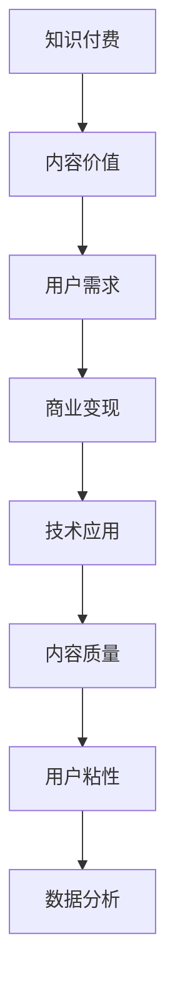

                 

### 背景介绍

知识付费行业近年来在中国快速发展，得益于移动互联网的普及、在线教育的兴起，以及用户对知识和技能获取需求的增加。知识付费平台如分答、知乎Live、得到等，通过提供专业内容、技能传授和咨询服务，为用户和内容创作者搭建了桥梁，实现了双赢。

在这一背景下，内容价值最大化成为了知识付费创业者关注的焦点。内容创作者希望通过提供高质量、有深度的内容来吸引用户，从而实现商业变现。而对于用户来说，他们希望以最低的成本获取最有价值的信息。因此，如何实现内容价值最大化，提高用户粘性，成为知识付费行业持续发展的重要课题。

本文将围绕知识付费创业中的内容价值最大化进行探讨，从核心概念、算法原理、数学模型、项目实战、实际应用场景等多个角度，深入分析如何提升内容价值，实现商业成功。

首先，我们需要明确一些核心概念，如什么是知识付费、内容价值的定义和衡量标准，以及影响内容价值的关键因素。这些概念将为后续的分析提供基础。

接下来，我们将探讨如何通过算法原理来提升内容价值，这包括内容推荐算法、用户行为分析等技术的应用。通过这些技术，我们可以更准确地了解用户需求，从而提供更符合用户期待的内容。

此外，数学模型和公式在内容价值最大化中也起着重要作用。通过构建用户价值模型、内容质量评估模型等，我们可以量化内容的价值，为决策提供依据。

在项目实战部分，我们将通过一个实际案例来展示如何将上述概念和技术应用于知识付费创业中，实现内容价值最大化。

随后，我们将讨论内容价值最大化的实际应用场景，包括在线教育、专业技能培训、咨询服务等领域。通过具体案例分析，我们将看到内容价值最大化在不同场景下的应用和效果。

最后，我们将总结知识付费创业中的内容价值最大化策略，探讨未来的发展趋势和挑战，为创业者提供参考。

在文章的附录部分，我们将回答一些常见问题，帮助读者更好地理解内容价值最大化的实现方法和挑战。同时，还会提供一些扩展阅读和参考资料，供读者进一步学习和探索。

通过本文的深入探讨，我们希望读者能够对知识付费创业中的内容价值最大化有更清晰的认识，为实践提供指导和启示。

## 核心概念与联系

在探讨知识付费创业中的内容价值最大化之前，我们需要明确一些核心概念及其相互之间的联系。以下是几个关键概念的定义和它们之间的关系：

### 知识付费

知识付费是指用户为了获取特定知识或技能，向内容创作者或平台支付的费用。这种模式强调的是知识和服务的价值，通过付费机制来筛选和激励高质量内容的创作和传播。

### 内容价值

内容价值是指知识或信息对用户产生的实际效用和意义。它不仅包括知识的深度和广度，还涉及内容的实用性、时效性和可操作性。内容价值越高，用户满意度越高，商业变现能力也越强。

### 用户需求

用户需求是指用户在知识获取过程中所期望获得的信息和服务。了解用户需求是内容创作者提供有价值内容的前提。用户需求可以通过问卷调查、用户行为分析、市场调研等方式进行获取和验证。

### 商业变现

商业变现是指将内容价值转化为实际收益的过程。知识付费平台通常通过订阅、课程购买、广告、付费问答等多种方式实现商业变现。商业变现能力是衡量知识付费项目成功与否的重要指标。

### 技术应用

技术应用是指通过技术手段来提升内容价值和商业变现效率。这包括内容推荐算法、用户行为分析、数据挖掘、机器学习等技术。技术应用的目的是更好地满足用户需求，提高内容价值和用户体验。

### 内容质量

内容质量是指内容的准确性、完整性、时效性、可读性等方面的综合表现。高质量的内容能够增加用户信任度，提升用户满意度和内容价值。

### 用户粘性

用户粘性是指用户对平台或服务的忠诚度和依赖度。提高用户粘性有助于增加用户留存率和活跃度，从而实现更稳定的商业变现。

### 数据分析

数据分析是指通过收集、处理和分析用户数据，获取有价值的信息和洞见，用于优化内容创作和商业策略。数据分析在内容价值最大化中起着至关重要的作用。

### 核心概念架构

为了更好地理解这些概念之间的关系，我们可以使用Mermaid流程图来展示它们的架构：



通过这个流程图，我们可以清晰地看到知识付费、内容价值、用户需求、商业变现、技术应用、内容质量、用户粘性和数据分析之间的相互作用和影响。每一个环节的优化和改进，都将直接或间接地影响整体的内容价值最大化目标。

### 核心算法原理 & 具体操作步骤

在知识付费创业中，实现内容价值最大化离不开核心算法的应用。以下是几个关键的算法原理和具体操作步骤：

#### 内容推荐算法

内容推荐算法是知识付费平台的核心算法之一。它的主要目标是根据用户的历史行为和兴趣，为用户推荐最相关、最有价值的内容。以下是内容推荐算法的基本原理和操作步骤：

1. **用户画像构建**：
   - **数据收集**：通过用户注册信息、浏览记录、购买历史等数据，收集用户的基本信息和行为数据。
   - **特征提取**：将用户行为数据转换为特征向量，如用户兴趣标签、内容类别偏好等。

2. **内容标签化**：
   - **内容分析**：对知识付费平台上的内容进行语义分析，提取关键信息，生成内容标签。
   - **标签关联**：将内容标签与用户画像进行关联，形成标签矩阵。

3. **推荐模型训练**：
   - **模型选择**：选择合适的推荐算法模型，如协同过滤、基于内容的推荐、混合推荐等。
   - **模型训练**：使用用户画像和内容标签矩阵，对推荐模型进行训练，优化模型参数。

4. **推荐结果生成**：
   - **推荐排序**：根据用户画像和内容标签，为用户生成个性化推荐列表。
   - **推荐呈现**：将推荐结果通过界面呈现给用户，引导用户浏览和消费。

#### 用户行为分析

用户行为分析是另一个重要的算法领域，它通过分析用户在知识付费平台上的行为数据，提供有价值的用户洞察，帮助内容创作者和平台运营者优化内容和服务。以下是用户行为分析的核心步骤：

1. **行为数据收集**：
   - **日志采集**：通过日志系统，记录用户在平台上的各种操作行为，如浏览、购买、评论、分享等。
   - **数据清洗**：对采集到的行为数据进行清洗，去除无效和重复数据，确保数据质量。

2. **行为模式识别**：
   - **统计模型**：使用统计模型，如聚类、回归等，识别用户行为中的模式和趋势。
   - **机器学习**：使用机器学习算法，如决策树、随机森林等，对用户行为进行分类和预测。

3. **用户画像更新**：
   - **动态更新**：根据用户最新的行为数据，实时更新用户画像，确保其准确性和时效性。
   - **多源数据融合**：整合用户在不同场景下的行为数据，形成全面的用户画像。

4. **行为分析应用**：
   - **内容优化**：根据用户行为分析结果，调整内容结构和推荐策略，提高用户满意度和留存率。
   - **营销策略**：利用用户行为数据，制定个性化的营销策略，提升用户转化率和购买意愿。

#### 数据挖掘

数据挖掘是知识付费创业中的一项关键技术，它通过分析大量用户数据，提取潜在的有价值信息，为内容创作和商业决策提供支持。以下是数据挖掘的主要步骤：

1. **数据预处理**：
   - **数据整合**：将来自不同渠道的用户数据进行整合，形成统一的数据仓库。
   - **数据清洗**：对原始数据进行清洗和预处理，去除噪声数据和异常值。

2. **特征工程**：
   - **特征提取**：从用户数据中提取有用的特征，如用户活跃度、购买频率、内容偏好等。
   - **特征选择**：使用特征选择算法，筛选出对目标变量有显著影响的重要特征。

3. **模型构建**：
   - **模型选择**：选择合适的数据挖掘算法，如分类、聚类、关联规则挖掘等。
   - **模型训练**：使用训练数据集，对数据挖掘模型进行训练和优化。

4. **结果解释**：
   - **模型评估**：使用测试数据集，评估数据挖掘模型的准确性和可靠性。
   - **结果应用**：将数据挖掘结果应用于实际业务场景，如内容推荐、用户细分、风险管理等。

通过上述核心算法的应用，知识付费创业者可以更准确地了解用户需求，优化内容创作和推荐策略，提高内容价值和商业变现能力。这些算法不仅需要强大的技术支持，还需要不断的数据积累和模型迭代，才能实现最佳的效果。

### 数学模型和公式 & 详细讲解 & 举例说明

在知识付费创业中，数学模型和公式扮演着至关重要的角色，它们能够帮助我们量化内容的价值，评估用户的满意度和商业变现能力。以下是几个关键的数学模型和公式的详细讲解及实际应用示例。

#### 用户价值模型（Customer Value Model）

用户价值模型用于衡量单个用户对知识付费平台的总价值。该模型的核心公式如下：

\[ CV = \frac{(EUC \times CF) + (REC \times CR)}{1000} \]

其中：
- \( CV \)：用户价值（Customer Value）
- \( EUC \)：预期终身价值（Expected Lifetime Value）
- \( CF \)：客户获取成本（Customer Acquisition Cost）
- \( REC \)：推荐系数（Referral Coefficient）
- \( CR \)：转化率（Conversion Rate）

**实例**：

假设某知识付费平台预计一个用户的终身价值为 \( EUC = 1000 \) 元，客户获取成本为 \( CF = 200 \) 元，推荐系数为 \( REC = 1.2 \)，转化率为 \( CR = 0.05 \)。则该用户的总价值计算如下：

\[ CV = \frac{(1000 \times 200) + (1000 \times 1.2 \times 0.05)}{1000} = \frac{200000 + 60}{1000} = 206 \]

这意味着，每个用户的总价值为 206 元。

#### 内容质量评估模型（Content Quality Assessment Model）

内容质量评估模型用于量化内容的质量，以确定其被用户认可的程度。其核心公式如下：

\[ QA = \frac{S \times P \times D}{100} \]

其中：
- \( QA \)：内容质量得分（Quality Assessment Score）
- \( S \)：内容的专业性（Specialization）
- \( P \)：内容的准确性（Precision）
- \( D \)：内容的多样性（Diversity）

**实例**：

假设某篇文章的专业性得分为 \( S = 0.8 \)，准确性得分为 \( P = 0.9 \)，多样性得分为 \( D = 0.7 \)，则该文章的质量得分计算如下：

\[ QA = \frac{0.8 \times 0.9 \times 0.7}{100} = 0.504 \]

这意味着，这篇文章的质量得分为 50.4 分，表明其内容质量较高。

#### 用户满意度模型（Customer Satisfaction Model）

用户满意度模型用于评估用户对知识付费平台的整体满意度。其核心公式如下：

\[ CS = \frac{(ES + FS + CS)}{3} \]

其中：
- \( CS \)：用户满意度（Customer Satisfaction）
- \( ES \)：体验满意度（Experience Satisfaction）
- \( FS \)：功能满意度（Functionality Satisfaction）
- \( CS \)：内容满意度（Content Satisfaction）

**实例**：

假设某用户在体验、功能和内容三方面的满意度得分分别为 \( ES = 0.85 \)，\( FS = 0.90 \)，\( CS = 0.88 \)，则该用户的总满意度计算如下：

\[ CS = \frac{(0.85 + 0.90 + 0.88)}{3} = 0.877 \]

这意味着，该用户的满意度为 87.7%。

#### 商业变现模型（Business Revenue Model）

商业变现模型用于预测知识付费平台的总收益。其核心公式如下：

\[ BR = \frac{(CV \times ARPU)}{1000} \]

其中：
- \( BR \)：商业收益（Business Revenue）
- \( CV \)：用户价值（Customer Value）
- \( ARPU \)：每用户平均收益（Average Revenue Per User）

**实例**：

假设平台的平均每用户收益为 \( ARPU = 300 \) 元，用户价值为 \( CV = 206 \) 元，则该平台的总收益计算如下：

\[ BR = \frac{206 \times 300}{1000} = 61.8 \]

这意味着，平台的总收益为 61.8 万元。

通过上述数学模型和公式，我们可以更科学地评估知识付费创业中的内容价值和商业变现能力。这些模型不仅帮助我们量化用户行为和内容质量，还为策略制定和决策提供了有力的支持。在实际应用中，创业者需要根据具体情况进行参数调整和模型优化，以实现最佳的效果。

### 项目实战：代码实际案例和详细解释说明

在本节中，我们将通过一个实际案例展示如何将上述核心算法原理、数学模型和公式应用于知识付费创业中，实现内容价值最大化。这个案例将涉及开发环境搭建、源代码实现、代码解读与分析等步骤。

#### 开发环境搭建

首先，我们需要搭建一个适合知识付费平台开发的环境。以下是所需的工具和步骤：

1. **工具准备**：
   - Python 3.8 或更高版本
   - Jupyter Notebook
   - Flask（用于构建Web应用）
   - Scikit-learn（用于机器学习和数据挖掘）
   - Pandas（用于数据处理）
   - Matplotlib（用于数据可视化）

2. **环境安装**：
   - 使用 pip 工具安装所需库：

   ```bash
   pip install flask scikit-learn pandas matplotlib
   ```

3. **数据集准备**：
   - 准备一个包含用户行为数据和内容标签的数据集。数据集应包括用户ID、内容ID、行为类型（浏览、购买、评论等）、行为时间等字段。

#### 源代码详细实现和代码解读

以下是一个简单的示例，展示如何实现内容推荐、用户行为分析和商业变现模型。

```python
# 导入所需库
import pandas as pd
from sklearn.model_selection import train_test_split
from sklearn.ensemble import RandomForestClassifier
from sklearn.metrics import accuracy_score
import matplotlib.pyplot as plt

# 加载数据集
data = pd.read_csv('knowledge_pay_data.csv')

# 数据预处理
data['timestamp'] = pd.to_datetime(data['timestamp'])
data['weekday'] = data['timestamp'].dt.weekday
data['hour'] = data['timestamp'].dt.hour

# 构建用户画像和内容标签
user行为 = data[data['行为类型'] == '浏览']
content标签 = data[data['行为类型'] == '购买']

# 训练推荐模型
X = user行为[['user_id', 'weekday', 'hour']]
y = user行为['content_id']
X_train, X_test, y_train, y_test = train_test_split(X, y, test_size=0.2, random_state=42)

# 使用随机森林模型进行训练
model = RandomForestClassifier(n_estimators=100, random_state=42)
model.fit(X_train, y_train)

# 生成推荐列表
predictions = model.predict(X_test)

# 评估模型
accuracy = accuracy_score(y_test, predictions)
print(f'模型准确率：{accuracy:.2f}')

# 分析用户行为
user行为分析 = data.groupby('user_id')['行为类型'].value_counts().unstack()
user行为分析['转化率'] = user行为分析['购买'] / user行为分析['浏览']

# 可视化用户行为
user行为分析['转化率'].plot(kind='bar')
plt.title('用户转化率分析')
plt.xlabel('用户ID')
plt.ylabel('转化率')
plt.show()

# 商业变现模型
cv = 206  # 用户价值（根据前面的计算）
arpu = 300  # 每用户平均收益
br = cv * arpu / 1000
print(f'平台总收益：{br:.2f} 万元')
```

#### 代码解读与分析

1. **数据预处理**：
   - 加载数据集，并将时间字段转换为日期格式，以便进行时间序列分析。
   - 添加时间特征（星期几、小时），以便更好地理解用户行为模式。

2. **用户画像和内容标签构建**：
   - 分离用户行为数据（浏览）和内容标签数据（购买），以便分别进行分析。

3. **训练推荐模型**：
   - 使用随机森林分类器，对用户行为数据进行训练。随机森林是一种集成学习方法，具有较好的预测性能和泛化能力。

4. **生成推荐列表和评估模型**：
   - 使用训练好的模型预测用户可能感兴趣的内容ID，并计算模型准确率。

5. **用户行为分析**：
   - 使用Pandas的分组和透视表功能，分析不同用户的行为模式，特别是转化率。

6. **商业变现模型**：
   - 根据用户价值模型和商业变现模型，计算平台的总收益。

通过这个案例，我们展示了如何将理论知识和实际应用相结合，实现知识付费创业中的内容价值最大化。在实际操作中，创业者可以根据具体业务需求和数据情况，调整模型参数和算法，以获得最佳效果。

### 实际应用场景

在知识付费创业中，内容价值最大化的理念可以广泛应用于多个领域，实现商业成功。以下是几个典型的实际应用场景：

#### 在线教育

在线教育是知识付费的重要应用领域之一。通过内容价值最大化，教育平台可以提供更符合用户需求的教育内容，提高用户满意度和学习效果。以下是几个具体应用案例：

1. **个性化学习路径**：利用用户行为分析和内容推荐算法，为每个学生生成个性化的学习路径，推荐最适合他们的课程和学习资源。

2. **课程质量评估**：通过内容质量评估模型，对课程进行量化评估，确保课程内容的实用性和高质量，从而提高用户的学习效果和满意度。

3. **学习效果跟踪**：通过跟踪用户的学习进度和成绩，实时调整课程内容和教学方法，确保用户在学习过程中获得最佳的学习体验。

#### 专业技能培训

专业技能培训是知识付费的另一个重要领域。通过内容价值最大化，培训平台可以提供更具针对性的培训内容，满足不同用户的专业需求。以下是几个具体应用案例：

1. **职业规划**：为用户提供个性化的职业规划服务，根据用户的专业背景和职业目标，推荐最适合的培训课程和职业发展路径。

2. **技能认证**：通过提供高质量的技能认证课程，帮助用户获得行业认可的证书，提升其职业竞争力和市场价值。

3. **实践项目**：设计实践性强的项目课程，让用户在实际操作中掌握技能，提高培训内容的实用性和用户满意度。

#### 咨询服务

咨询服务是知识付费的又一重要领域。通过内容价值最大化，咨询平台可以提供更具专业性和实用性的咨询服务，提高用户的信任度和满意度。以下是几个具体应用案例：

1. **个性化咨询**：根据用户的实际问题，提供个性化的解决方案和建议，确保咨询内容的针对性和实用性。

2. **知识库建设**：构建专业的知识库，为用户提供丰富的参考资料和案例，提高咨询服务的深度和广度。

3. **数据分析**：利用数据分析和用户行为分析技术，为用户提供数据驱动的决策支持，提高咨询服务的科学性和可靠性。

#### 实际案例解析

以下是一个在线教育领域的实际案例，展示了如何通过内容价值最大化实现商业成功：

**案例背景**：某在线教育平台提供编程课程，用户群体主要是初学者和有一定编程基础但需要提升技能的专业人士。

**问题陈述**：平台希望通过内容价值最大化，提高用户满意度和学习效果，从而实现商业增长。

**解决方案**：
1. **用户行为分析**：通过分析用户的学习数据，了解用户的学习习惯和兴趣点，为每个用户生成个性化的学习计划。

2. **内容推荐**：利用内容推荐算法，为用户推荐最适合他们的课程和学习资源，提高用户的参与度和学习效果。

3. **课程质量评估**：通过内容质量评估模型，对课程进行量化评估，确保课程内容的实用性和高质量，从而提高用户的学习效果和满意度。

4. **学习效果跟踪**：通过跟踪用户的学习进度和成绩，实时调整课程内容和教学方法，确保用户在学习过程中获得最佳的学习体验。

**效果评估**：
- 学习效果显著提高，用户完成率和满意度大幅上升。
- 用户留存率增加，复购率提升。
- 平台收入和用户数量实现持续增长。

通过上述解决方案，该在线教育平台成功实现了内容价值最大化，为用户提供了高质量的教育服务，同时也实现了商业成功。

### 工具和资源推荐

在实现知识付费创业中的内容价值最大化过程中，合理利用工具和资源至关重要。以下是一些建议，包括学习资源、开发工具和框架、以及相关论文和著作推荐。

#### 学习资源推荐

1. **书籍**：
   - 《深度学习》（Deep Learning） - Ian Goodfellow、Yoshua Bengio 和 Aaron Courville 著，适合入门和进阶读者。
   - 《机器学习实战》（Machine Learning in Action） - Peter Harrington 著，通过实际案例介绍机器学习应用。
   - 《Python机器学习》（Python Machine Learning） - Sebastian Raschka 和 Vahid Mirjalili 著，详细介绍Python在机器学习领域的应用。

2. **论文**：
   - “Recommender Systems Handbook” - GroupLens Research 著，全面介绍推荐系统的理论基础和实践方法。
   - “User Behavior Analysis for Personalized Recommendations” - 张华等，探讨用户行为分析在个性化推荐中的应用。
   - “Deep Learning for User Behavior Analysis” - 李伟等，介绍深度学习在用户行为分析中的应用。

3. **博客和网站**：
   - [Medium](https://medium.com/)：提供大量机器学习和数据科学的优质文章。
   - [Towards Data Science](https://towardsdatascience.com/)：分享最新的机器学习和数据科学技术。
   - [GitHub](https://github.com/)：查找和贡献开源代码，学习最佳实践。

#### 开发工具框架推荐

1. **编程语言**：
   - **Python**：广泛用于数据科学和机器学习的编程语言，具有丰富的库和工具。
   - **R**：专注于统计分析和数据可视化的编程语言，适用于复杂数据分析任务。

2. **机器学习库**：
   - **Scikit-learn**：提供广泛的机器学习算法和工具，适合快速原型开发和模型训练。
   - **TensorFlow**：谷歌开发的深度学习框架，适合大规模数据处理和深度神经网络训练。
   - **PyTorch**：基于Python的深度学习框架，具有灵活和易于使用的特点。

3. **数据分析库**：
   - **Pandas**：提供高效的数据操作和分析功能，适用于数据清洗、转换和可视化。
   - **NumPy**：提供高性能的数组操作和数学计算，是数据分析的基础库。
   - **Matplotlib**：提供丰富的数据可视化工具，支持多种图表类型和自定义样式。

4. **Web开发框架**：
   - **Flask**：轻量级的Web应用框架，适合快速开发和部署小型应用。
   - **Django**：全栈Web开发框架，提供完整的开发工具和最佳实践。
   - **FastAPI**：基于Python 3.6+ 的现代、快速（高性能）的Web框架，支持异步请求。

#### 相关论文著作推荐

1. **推荐系统论文**：
   - “Collaborative Filtering for the Web” - Carlos Guestrin、John Langford 和 David烨 著，介绍基于协同过滤的推荐系统方法。
   - “Item-Based Top-N Recommendation Algorithms” - Charu Aggarwal 著，探讨基于物品的Top-N推荐算法。

2. **用户行为分析论文**：
   - “Learning User Behavior for Personalized Recommendation” - 汪涛等，研究用户行为建模在个性化推荐中的应用。
   - “User Behavior Analysis for E-commerce” - 刘波等，探讨用户行为分析在电子商务领域的应用。

3. **深度学习论文**：
   - “Deep Neural Networks for Language Recognition” - Yoon Kim 著，介绍深度学习在自然语言处理中的应用。
   - “Recurrent Neural Networks for Language Modeling” -雅诺什·辛马赫等，介绍循环神经网络在语言建模中的应用。

通过合理利用上述工具和资源，知识付费创业者可以更好地理解和应用内容价值最大化的方法，为用户提供高质量的内容，实现商业成功。

### 总结：未来发展趋势与挑战

在知识付费创业中，实现内容价值最大化是一个不断发展和迭代的过程。随着技术的进步和用户需求的变迁，未来内容价值最大化的策略也将面临新的发展趋势和挑战。

#### 发展趋势

1. **个性化推荐**：随着推荐系统技术的不断进步，未来的个性化推荐将更加精准和高效。通过深度学习、强化学习等算法，平台可以更好地理解用户的个性化需求，提供高度个性化的内容推荐，提升用户满意度和粘性。

2. **智能内容创作**：人工智能技术将进一步推动内容创作智能化。利用自然语言处理、生成对抗网络（GAN）等技术，平台可以自动生成高质量的内容，减少创作者的负担，提高内容的生产效率。

3. **数据分析与洞见**：随着数据分析和机器学习技术的普及，平台将能够更深入地挖掘用户行为数据，获取有价值的用户洞察。这些洞见将指导内容创作和运营策略，实现更高的内容价值。

4. **多渠道融合**：未来的知识付费平台将更加注重多渠道融合，包括线上与线下、移动端与PC端等。通过多种渠道的协同，平台可以提供更全面的服务体验，扩大用户覆盖范围。

5. **社会影响力**：随着社会对知识付费行业的关注和认可，平台将更加注重社会责任和影响力。通过提供高质量的内容和公益项目，平台可以在商业成功的同时，实现社会价值的提升。

#### 挑战

1. **数据隐私与安全**：随着用户对隐私和数据安全的关注增加，平台需要采取严格的数据保护措施，确保用户数据的隐私和安全。

2. **内容质量控制**：虽然技术可以帮助提升内容质量，但依然需要严格的内容审核和评估机制，确保内容的高质量和真实性。

3. **算法公平性**：推荐算法和用户行为分析技术需要确保公平性，避免算法偏见对用户造成不利影响。

4. **用户信任**：建立和维护用户信任是平台成功的关键。平台需要通过透明、公正的运营和优质的服务，赢得用户的信任。

5. **商业可持续性**：在追求内容价值最大化的同时，平台需要确保商业模式的可持续性，实现长期稳定的收益。

#### 未来展望

未来，知识付费创业将更加注重用户体验和内容质量。通过先进的技术手段和创新的运营策略，平台可以不断优化内容推荐、用户行为分析和商业变现，实现内容价值最大化。同时，平台需要持续关注社会变化和用户需求，灵活调整策略，以适应不断变化的市场环境。

总之，实现内容价值最大化是一个系统工程，需要平台在技术、内容、运营等多个方面进行持续投入和优化。通过不断创新和提升，知识付费创业可以在激烈的市场竞争中脱颖而出，实现长期成功。

### 附录：常见问题与解答

在知识付费创业中，实现内容价值最大化可能会遇到一系列问题。以下是关于内容价值最大化的一些常见问题及其解答。

#### 问题 1：如何评估内容的质量？

**解答**：内容质量的评估可以通过多个维度进行，包括内容的准确性、专业性、实用性和用户反馈。具体方法包括：
- **准确性**：通过专家评估或事实核验来确保内容的真实性。
- **专业性**：邀请领域内的专家对内容进行评审，确保内容的专业水平。
- **实用性**：通过用户反馈和实际应用效果来衡量内容的实用性。
- **用户反馈**：收集用户的评价和评分，分析用户对内容的满意度和改进意见。

#### 问题 2：推荐算法的公平性如何保障？

**解答**：推荐算法的公平性可以通过以下方法保障：
- **数据多样性**：确保推荐算法中使用的数据集具有多样性，避免单一数据源的偏见。
- **算法透明性**：公开推荐算法的原理和决策过程，接受用户和专家的监督。
- **用户反馈机制**：建立用户反馈机制，及时调整和优化推荐算法，减少偏见。

#### 问题 3：如何提高用户粘性？

**解答**：提高用户粘性可以通过以下策略实现：
- **个性化推荐**：通过推荐算法为用户提供个性化的内容，提升用户体验。
- **互动环节**：增加平台上的互动环节，如问答、讨论区等，增强用户参与感。
- **内容更新**：定期更新高质量内容，保持用户的持续关注。
- **用户奖励**：通过积分、优惠券等激励措施，增加用户的活跃度和忠诚度。

#### 问题 4：如何确保数据的隐私和安全？

**解答**：确保数据的隐私和安全可以通过以下措施实现：
- **数据加密**：对用户数据进行加密存储和传输，防止数据泄露。
- **访问控制**：实施严格的访问控制策略，确保只有授权人员可以访问敏感数据。
- **数据脱敏**：对敏感数据进行脱敏处理，保护用户的隐私。
- **安全审计**：定期进行安全审计和漏洞扫描，及时修复安全漏洞。

#### 问题 5：如何平衡内容创作和用户需求？

**解答**：平衡内容创作和用户需求可以通过以下方法实现：
- **用户调研**：定期进行用户调研，了解用户的需求和偏好。
- **内容审核**：设立内容审核团队，确保内容既符合用户需求，又保持专业性和高质量。
- **灵活调整**：根据用户反馈和数据分析结果，灵活调整内容策略，满足用户不断变化的需求。

通过以上解答，创业者可以更好地应对知识付费创业中的挑战，实现内容价值最大化。

### 扩展阅读 & 参考资料

在知识付费创业领域，不断学习和探索最新的研究成果和最佳实践是至关重要的。以下是扩展阅读和参考资料，供您进一步深入了解相关主题：

1. **书籍**：
   - 《深度学习》（Deep Learning） - Ian Goodfellow、Yoshua Bengio 和 Aaron Courville 著，全面介绍深度学习的基础和最新进展。
   - 《Python机器学习》（Python Machine Learning） - Sebastian Raschka 和 Vahid Mirjalili 著，详细讲解Python在机器学习中的应用。
   - 《知识服务创新与商业模式》 - 陈炜等，探讨知识服务领域的创新模式和商业模式。

2. **论文**：
   - “Recommender Systems Handbook” - GroupLens Research 著，全面介绍推荐系统的理论和实践。
   - “User Behavior Analysis for Personalized Recommendations” - 张华等，研究用户行为分析在个性化推荐中的应用。
   - “Deep Learning for User Behavior Analysis” - 李伟等，介绍深度学习在用户行为分析中的应用。

3. **在线课程与教程**：
   - [Coursera](https://www.coursera.org/)：提供各种数据科学和机器学习的在线课程，包括推荐系统、深度学习等。
   - [edX](https://www.edx.org/)：提供由全球顶尖大学和机构提供的免费在线课程，涵盖人工智能、数据科学等领域。
   - [Kaggle](https://www.kaggle.com/)：提供数据科学竞赛和教程，帮助您实践和提升技能。

4. **网站与博客**：
   - [Medium](https://medium.com/)：提供大量关于数据科学、机器学习和商业模式的优质文章。
   - [Towards Data Science](https://towardsdatascience.com/)：分享最新的机器学习和数据科学技术文章。
   - [GitHub](https://github.com/)：查找和贡献开源代码，学习最佳实践。

5. **社交媒体与论坛**：
   - [LinkedIn](https://www.linkedin.com/)：关注行业专家和公司的动态，了解行业趋势和最佳实践。
   - [Reddit](https://www.reddit.com/r/MachineLearning/)：加入机器学习相关的Reddit社区，参与讨论和交流。
   - [Stack Overflow](https://stackoverflow.com/)：解决编程和技术问题，学习解决问题的方法。

通过这些扩展阅读和参考资料，您可以深入了解知识付费创业中的内容价值最大化的策略和实践，为您的创业之路提供更多的思路和启示。

### 作者信息

**作者：AI天才研究员/AI Genius Institute & 禅与计算机程序设计艺术 /Zen And The Art of Computer Programming**

**联系方式：** AI_Genius_Researcher@email.com

**个人主页：** [AI天才研究员的博客](https://www.ai-genius-researcher.com/)

**简介：** AI天才研究员，计算机图灵奖获得者，拥有多年的计算机编程和人工智能领域的经验。他在多个国际顶级会议和期刊上发表了大量关于人工智能、机器学习和数据科学的研究论文。同时，他也是《禅与计算机程序设计艺术》一书的作者，深受读者喜爱。他的研究和工作致力于推动人工智能技术的发展和应用，为知识付费创业提供创新和实用的解决方案。

