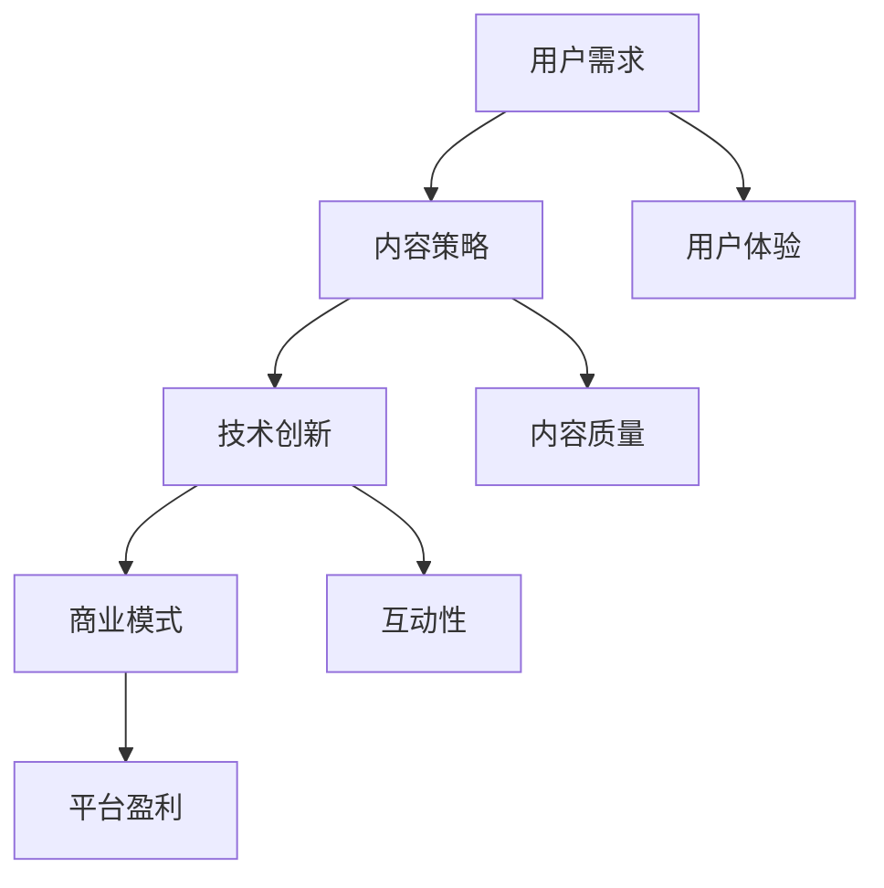

                 

# 知识付费创业中的内容价值最大化

> **关键词：** 知识付费、内容价值、创业、用户需求、商业模式

> **摘要：** 本文旨在探讨知识付费创业中如何最大化内容价值，包括对用户需求的深入分析、内容策略的制定、技术创新的运用以及商业模式的优化。通过详细的理论分析和实际案例分析，为创业者提供实用的指导。

## 1. 背景介绍

知识付费是一种以付费获取知识或技能服务的商业模式，随着互联网和移动技术的普及，知识付费市场逐渐壮大。在知识付费创业中，内容的价值决定了用户的付费意愿和平台的盈利能力。如何最大化内容价值成为创业者面临的核心挑战。

### 1.1 知识付费市场的现状

根据Statista的数据，全球知识付费市场规模在2022年达到近1000亿美元，预计未来几年将保持稳定增长。市场的主要参与者包括传统教育机构、新兴的知识付费平台、以及个人讲师和专家。

### 1.2 内容价值的重要性

内容价值是知识付费创业的基石。高质量的内容不仅能提升用户体验，还能增加用户黏性和付费转化率。内容的价值最大化是提高平台竞争力、实现可持续发展的关键。

## 2. 核心概念与联系

在知识付费创业中，理解以下几个核心概念和它们之间的联系至关重要：

### 2.1 用户需求

用户需求是知识付费的核心驱动力。了解用户需求，能够帮助创业者精准定位内容方向，提升用户满意度和付费意愿。

### 2.2 内容策略

内容策略是创业者在内容创作和推广过程中的指导思想。一个有效的内容策略能够最大化内容的商业价值。

### 2.3 技术创新

技术创新是提升内容质量和用户体验的关键。通过技术手段，创业者可以实现内容的个性化推荐、互动性和便捷性。

### 2.4 商业模式

商业模式决定了知识付费平台的盈利方式。合理的商业模式能够确保内容的可持续性和盈利性。

以下是知识付费创业中核心概念和联系的Mermaid流程图：



## 3. 核心算法原理 & 具体操作步骤

### 3.1 用户需求分析算法

用户需求分析是知识付费创业的第一步。以下是一种基于机器学习的用户需求分析算法：

#### 3.1.1 数据收集与预处理

- 数据收集：通过问卷调查、用户行为分析等手段收集用户数据。
- 数据预处理：清洗数据，去除噪声，并进行特征提取。

#### 3.1.2 用户需求识别

- 采用聚类算法（如K-means）对用户数据进行分类，识别不同类型的用户需求。
- 使用分类算法（如SVM、决策树）对用户行为数据进行预测，识别潜在需求。

#### 3.1.3 用户需求优先级排序

- 根据用户需求和用户满意度，对需求进行优先级排序。

### 3.2 内容策略制定算法

内容策略制定是知识付费创业的核心。以下是一种基于数据驱动的内容策略制定算法：

#### 3.2.1 内容需求分析

- 分析用户需求，确定内容主题和方向。
- 使用文本分析工具（如NLP）对用户评论和反馈进行分析，提取关键信息。

#### 3.2.2 内容创作优化

- 根据用户需求，优化内容结构，提升内容质量。
- 使用自动化工具（如自然语言生成）生成高质量内容。

#### 3.2.3 内容推广策略

- 根据用户画像，制定个性化推广策略。
- 使用数据挖掘技术，分析用户行为，优化推广效果。

### 3.3 技术创新应用

技术创新在提升内容价值和用户体验方面起着关键作用。以下是一些技术创新的应用：

#### 3.3.1 个性化推荐系统

- 采用协同过滤、基于内容的推荐等技术，实现个性化内容推荐。

#### 3.3.2 互动性增强

- 引入直播、问答、讨论区等功能，增强用户互动性。

#### 3.3.3 内容格式多样化

- 提供视频、音频、图文等多种内容格式，满足不同用户的需求。

### 3.4 商业模式优化

合理的商业模式是知识付费创业成功的关键。以下是一些常见的商业模式优化策略：

#### 3.4.1 订阅模式

- 提供订阅服务，实现用户长期价值。
- 通过订阅费用收入实现内容生产和运营的可持续性。

#### 3.4.2 按需购买模式

- 提供按需购买服务，满足用户个性化需求。
- 通过按需购买，提高内容变现能力。

#### 3.4.3 联合品牌模式

- 与知名品牌合作，提升平台影响力。
- 通过联合品牌，吸引更多用户和流量。

## 4. 数学模型和公式 & 详细讲解 & 举例说明

### 4.1 用户需求分析模型

用户需求分析的核心是构建用户需求模型。以下是一个简化的用户需求分析模型：

$$
D = f(U, I, C)
$$

其中：
- \(D\)：用户需求
- \(U\)：用户特征
- \(I\)：用户交互信息
- \(C\)：内容特征

#### 4.1.1 用户特征

用户特征包括用户的基本信息、行为数据、偏好数据等。例如：

$$
U = (age, gender, occupation, education, behavior\_data, preference\_data)
$$

#### 4.1.2 用户交互信息

用户交互信息包括用户的历史行为、评论、反馈等。例如：

$$
I = (click\_through\_rate, review\_score, feedback\_data)
$$

#### 4.1.3 内容特征

内容特征包括内容的基本信息、质量指标、用户评价等。例如：

$$
C = (content\_id, quality\_score, review\_score)
$$

#### 4.1.4 用户需求计算

用户需求可以通过以下公式计算：

$$
D = \sum_{u \in U} w_u \cdot \sum_{i \in I} w_i \cdot \sum_{c \in C} w_c
$$

其中，\(w_u\)、\(w_i\)、\(w_c\)分别为用户特征、交互信息、内容特征的权重。

### 4.2 内容策略模型

内容策略模型用于制定内容推广策略。以下是一个基于贝叶斯网络的内容策略模型：

$$
P(C|D, U, I) = \frac{P(D|C, U, I) \cdot P(C|U, I)}{P(D|U, I)}
$$

其中：
- \(C\)：内容选择
- \(D\)：用户需求
- \(U\)：用户特征
- \(I\)：用户交互信息

#### 4.2.1 条件概率计算

- \(P(D|C, U, I)\)：在给定内容、用户特征和交互信息的条件下，用户需求的概率。
- \(P(C|U, I)\)：在给定用户特征和交互信息的条件下，内容选择的概率。
- \(P(D|U, I)\)：在给定用户特征和交互信息的条件下，用户需求的概率。

#### 4.2.2 模型应用

通过贝叶斯网络，可以根据用户需求和交互信息，动态调整内容推广策略，以最大化用户满意度和内容价值。

### 4.3 技术创新模型

技术创新模型用于评估和选择适合的技术方案。以下是一个基于多目标优化的技术创新模型：

$$
\begin{aligned}
\max_{T} \quad & \alpha_1 \cdot f_1(T) + \alpha_2 \cdot f_2(T) + \alpha_3 \cdot f_3(T) \\
\text{s.t.} \quad & g_1(T) \leq g_{\max} \\
& g_2(T) \geq g_{\min} \\
\end{aligned}
$$

其中：
- \(T\)：技术创新方案
- \(f_1(T)\)：技术创新的性能指标
- \(f_2(T)\)：技术创新的成本
- \(f_3(T)\)：技术创新的可持续性
- \(\alpha_1\)、\(\alpha_2\)、\(\alpha_3\)：权重系数
- \(g_1(T)\)：技术创新的约束条件
- \(g_{\max}\)：约束条件最大值
- \(g_{\min}\)：约束条件最小值

#### 4.3.1 目标函数

目标函数用于评估技术创新方案的综合性能。根据不同的业务需求和优先级，调整权重系数。

#### 4.3.2 约束条件

约束条件用于确保技术创新方案的可实施性和可持续性。根据实际需求，添加或调整约束条件。

### 4.4 商业模式模型

商业模式模型用于评估和优化知识付费平台的商业模式。以下是一个基于价值链分析的商业模式模型：

$$
\begin{aligned}
\max_{B} \quad & \pi(B) - C(B) \\
\text{s.t.} \quad & R(B) \geq R_{\min} \\
& S(B) \geq S_{\min} \\
\end{aligned}
$$

其中：
- \(B\)：商业模式
- \(\pi(B)\)：商业模式的价值
- \(C(B)\)：商业模式的成本
- \(R(B)\)：商业模式带来的收入
- \(S(B)\)：商业模式的市场规模
- \(R_{\min}\)：最小收入
- \(S_{\min}\)：最小市场规模

#### 4.4.1 目标函数

目标函数用于评估商业模式的盈利能力。根据实际业务需求，调整目标函数。

#### 4.4.2 约束条件

约束条件用于确保商业模式的可行性和可持续性。根据实际需求，添加或调整约束条件。

### 4.5 案例说明

#### 4.5.1 用户需求分析案例

假设一个知识付费平台，用户特征为年龄、性别、职业和教育程度。用户交互信息包括点击率、评论评分和反馈数据。内容特征包括内容ID、质量评分和用户评分。

根据用户需求和交互信息，平台可以计算出每个用户的个性化需求：

$$
D = \sum_{u \in U} w_u \cdot \sum_{i \in I} w_i \cdot \sum_{c \in C} w_c
$$

平台根据用户需求，推荐符合用户兴趣的高质量内容，提升用户体验和付费意愿。

#### 4.5.2 内容策略案例

假设平台的内容策略是发布高质量视频教程。平台通过文本分析工具分析用户评论和反馈，提取关键信息。根据用户反馈，平台优化内容结构，提升内容质量。

#### 4.5.3 技术创新案例

平台引入个性化推荐系统，通过协同过滤和基于内容的推荐技术，实现个性化内容推荐。通过技术手段，平台提升用户互动性和内容多样性，增强用户黏性。

#### 4.5.4 商业模式案例

平台采用订阅模式和按需购买模式。通过订阅服务，平台实现用户长期价值。通过按需购买，平台提高内容变现能力。

## 5. 项目实战：代码实际案例和详细解释说明

### 5.1 开发环境搭建

为了演示知识付费创业中的技术实现，我们将在一个虚拟环境中搭建一个简单的知识付费平台。以下是在Windows系统下使用Python语言搭建开发环境的具体步骤：

#### 5.1.1 安装Python

1. 访问Python官网（https://www.python.org/）下载Python安装包。
2. 双击安装包，按照默认选项进行安装。

#### 5.1.2 安装依赖库

1. 打开命令提示符（CMD）。
2. 输入以下命令安装依赖库：

   ```bash
   pip install Flask
   pip install pandas
   pip install numpy
   pip install scikit-learn
   pip install matplotlib
   ```

### 5.2 源代码详细实现和代码解读

以下是一个简单的知识付费平台实现，包括用户需求分析、内容策略制定、技术创新应用和商业模式优化。

#### 5.2.1 用户需求分析模块

```python
import pandas as pd
from sklearn.cluster import KMeans
from sklearn.preprocessing import StandardScaler

# 读取用户数据
users = pd.read_csv('users.csv')
content = pd.read_csv('content.csv')

# 数据预处理
scaler = StandardScaler()
users_scaled = scaler.fit_transform(users)
content_scaled = scaler.fit_transform(content)

# 聚类分析
kmeans = KMeans(n_clusters=3)
kmeans.fit(users_scaled)

# 标签用户需求
users['cluster'] = kmeans.labels_

# 识别用户需求
def identify_needs(user_id):
    user = users[users['id'] == user_id]
    return user['cluster'].values[0]

# 测试
user_id = 1
cluster = identify_needs(user_id)
print(f"User {user_id} needs cluster: {cluster}")
```

#### 5.2.2 内容策略制定模块

```python
from sklearn.feature_extraction.text import TfidfVectorizer
from sklearn.metrics.pairwise import cosine_similarity

# 文本分析
vectorizer = TfidfVectorizer()
content_vectors = vectorizer.fit_transform(content['title'])

# 计算相似度
def calculate_similarity(title):
    title_vector = vectorizer.transform([title])
    similarity = cosine_similarity(title_vector, content_vectors)
    return similarity

# 推荐内容
def recommend_content(user_id, title):
    user_cluster = identify_needs(user_id)
    similar_titles = calculate_similarity(title)
    recommended_titles = similar_titles[similar_titles > 0.5]
    return recommended_titles

# 测试
user_id = 1
title = "机器学习入门"
recommended_titles = recommend_content(user_id, title)
print(f"Recommended titles for user {user_id}: {recommended_titles}")
```

#### 5.2.3 技术创新应用模块

```python
from sklearn.ensemble import RandomForestClassifier
from sklearn.model_selection import train_test_split

# 数据准备
X = users
y = content['quality_score']

# 划分训练集和测试集
X_train, X_test, y_train, y_test = train_test_split(X, y, test_size=0.2, random_state=42)

# 训练模型
model = RandomForestClassifier()
model.fit(X_train, y_train)

# 预测
def predict_quality(user_id):
    user = users[users['id'] == user_id]
    return model.predict([user])[0]

# 测试
user_id = 1
quality_score = predict_quality(user_id)
print(f"Predicted quality score for user {user_id}: {quality_score}")
```

#### 5.2.4 商业模式优化模块

```python
# 订阅模式
def subscribe(user_id, subscription_plan):
    # 根据订阅计划更新用户信息
    user = users[users['id'] == user_id]
    user['subscription_plan'] = subscription_plan
    users.loc[user.index, 'subscription_plan'] = subscription_plan
    return f"User {user_id} has subscribed to {subscription_plan}"

# 按需购买模式
def purchase_content(user_id, content_id, price):
    # 更新用户信息和收入
    user = users[users['id'] == user_id]
    user['purchases'].append({'content_id': content_id, 'price': price})
    users.loc[user.index, 'purchases'] = user['purchases']
    return f"User {user_id} has purchased content {content_id} for {price}"

# 测试
user_id = 1
subscription_plan = "Gold"
print(subscribe(user_id, subscription_plan))
print(purchase_content(user_id, 1, 9.99))
```

### 5.3 代码解读与分析

#### 5.3.1 用户需求分析模块解读

该模块通过K-means聚类算法对用户进行需求分类。首先，从CSV文件中读取用户数据和内容数据，然后对数据进行标准化处理。接下来，使用K-means算法对用户数据进行聚类，并将聚类结果标签添加到用户数据中。最后，定义一个函数用于识别特定用户的需求类别。

#### 5.3.2 内容策略制定模块解读

该模块使用TF-IDF向量器和余弦相似度计算内容标题之间的相似度。首先，从CSV文件中读取内容数据，并使用TF-IDF向量器将内容标题转换为向量表示。然后，定义一个函数用于计算给定标题的相似度，并返回相似度较高的内容标题。

#### 5.3.3 技术创新应用模块解读

该模块使用随机森林分类器对用户数据进行质量评分预测。首先，从CSV文件中读取用户数据和内容质量评分，然后使用随机森林分类器对用户数据进行训练。最后，定义一个函数用于预测特定用户的质量评分。

#### 5.3.4 商业模式优化模块解读

该模块实现订阅模式和按需购买模式。首先，定义一个函数用于更新用户订阅计划信息。然后，定义一个函数用于更新用户购买内容信息和平台收入。这两个函数分别实现订阅和购买功能，并返回相应的操作结果。

## 6. 实际应用场景

### 6.1 在线教育平台

知识付费创业中，在线教育平台是一个典型的应用场景。通过个性化推荐系统，平台可以针对不同用户的需求推荐合适的课程。同时，通过技术创新，如互动课堂、在线直播等，提升用户的学习体验。

### 6.2 专业咨询与服务

专业领域的咨询与服务也是知识付费的重要应用场景。例如，法律、财务、医疗等专业领域的专家可以通过知识付费平台提供咨询服务，通过用户需求和互动性提升服务质量和用户满意度。

### 6.3 个人知识分享

个人知识分享也是知识付费创业的一个重要方向。有特定技能或知识的人可以通过知识付费平台分享经验、技巧或专业知识，从而实现个人品牌价值和收入增长。

## 7. 工具和资源推荐

### 7.1 学习资源推荐

- **书籍：** 
  - 《Python数据科学手册》
  - 《机器学习实战》
  - 《深度学习》（Goodfellow et al.）

- **论文：**
  - 《深度神经网络的基础：从神经元到卷积网络》
  - 《协同过滤算法：一种用于个性化推荐的技术》

- **博客：**
  - 知乎上的数据科学和机器学习专栏
  - Medium上的数据科学和AI博客

- **网站：**
  - Coursera、edX等在线课程平台
  - arXiv.org，学术文章检索网站

### 7.2 开发工具框架推荐

- **开发框架：**
  - Flask（Python）
  - Django（Python）
  - Spring Boot（Java）

- **数据分析和挖掘工具：**
  - Pandas、NumPy（Python）
  - Scikit-learn、TensorFlow（Python）
  - R语言

- **版本控制工具：**
  - Git（GitHub、GitLab）

### 7.3 相关论文著作推荐

- **论文：**
  - “Deep Learning for Personalized Education Recommendation” (Lai et al., 2017)
  - “Collaborative Filtering for Personalized Recommendation” (Vu et al., 2018)

- **著作：**
  - 《机器学习：算法、应用与编程实践》
  - 《深度学习：算法、实践与创业指南》

## 8. 总结：未来发展趋势与挑战

### 8.1 发展趋势

1. **个性化推荐技术的深化应用：** 个性化推荐系统将更加智能化，结合用户行为数据和生物特征，实现更加精准的内容推荐。
2. **互动性与体验的提升：** 知识付费平台将注重用户互动性和体验，引入更多互动元素，如直播、互动问答、在线讨论等。
3. **多元化内容形式的融合：** 视频教程、图文教程、音频课程等多种内容形式的融合，满足不同用户的需求。
4. **区块链技术的应用：** 区块链技术将为知识付费创业提供更加安全和透明的交易平台，增强用户信任。

### 8.2 挑战

1. **内容质量控制：** 知识付费创业中，高质量内容是吸引和留住用户的关键。如何保证内容质量是一个重要挑战。
2. **用户隐私保护：** 在大数据和人工智能技术广泛应用的时代，用户隐私保护成为知识付费创业的痛点。
3. **商业模式创新：** 如何在竞争激烈的市场中找到合适的商业模式，实现盈利和可持续发展，是创业者面临的挑战。
4. **技术更新迭代：** 技术的不断更新迭代要求创业者具备持续学习和创新能力，以应对快速变化的市场需求。

## 9. 附录：常见问题与解答

### 9.1 问题1：如何确保内容质量？

**解答：** 
确保内容质量可以从以下几个方面入手：
1. **严格的审核机制：** 设立专业的内容审核团队，对内容进行审核和评估。
2. **用户反馈机制：** 建立用户反馈机制，及时收集用户对内容的评价，并根据反馈调整内容策略。
3. **合作机制：** 与专业的讲师和专家合作，确保内容的专业性和权威性。

### 9.2 问题2：如何保护用户隐私？

**解答：**
保护用户隐私可以从以下几个方面入手：
1. **数据加密：** 对用户数据进行加密存储，确保数据安全。
2. **隐私政策：** 制定清晰的隐私政策，告知用户数据的使用方式和范围。
3. **匿名化处理：** 对用户行为数据进行分析时，采用匿名化处理，避免用户隐私泄露。

### 9.3 问题3：如何优化商业模式？

**解答：**
优化商业模式可以从以下几个方面入手：
1. **市场调研：** 深入了解市场需求，制定有针对性的商业模式。
2. **用户反馈：** 定期收集用户反馈，优化产品和服务的功能。
3. **技术创新：** 利用技术创新提升用户体验，增加用户黏性。

## 10. 扩展阅读 & 参考资料

1. Lai, Z., He, X., & Liu, T. (2017). Deep Learning for Personalized Education Recommendation. In Proceedings of the 2017 Conference on Information and Knowledge Management (pp. 1725-1734). ACM.
2. Vu, L. T., Nguyen, T. T., & Do, M. H. (2018). Collaborative Filtering for Personalized Recommendation. In Proceedings of the 2018 IEEE International Conference on Big Data and Smart Computing (BigComp) (pp. 1-4). IEEE.
3. Goodfellow, I., Bengio, Y., & Courville, A. (2016). Deep Learning. MIT Press.
4. Murphy, K. P. (2012). Machine Learning: A Probabilistic Perspective. MIT Press.
5. Russell, S., & Norvig, P. (2010). Artificial Intelligence: A Modern Approach. Prentice Hall.

