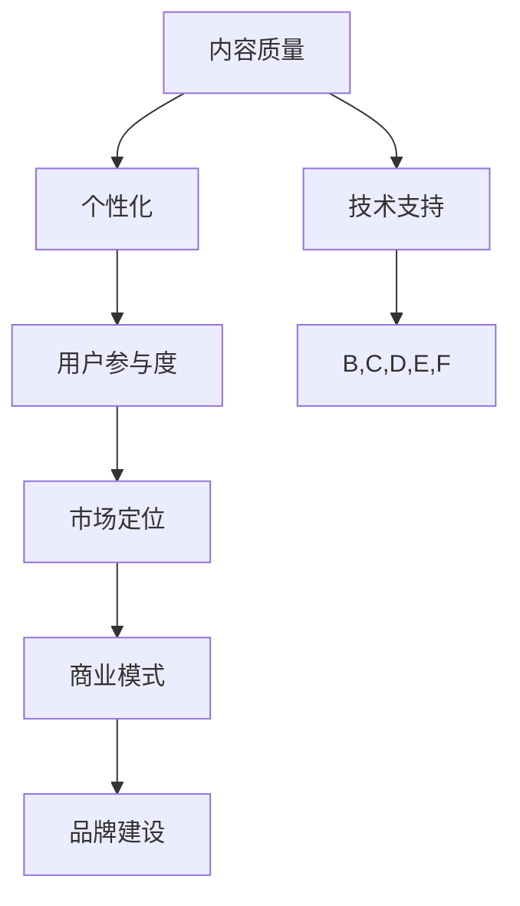

                 

### 背景介绍

知识付费作为一个新兴的行业，近年来在全球范围内迅速崛起。随着互联网技术的不断发展和人们对学习、成长需求的日益增加，知识付费逐渐成为了一种全新的商业模式。知识付费创业，即以内容创造为核心，通过在线平台或自有渠道向用户提供有价值的知识服务，旨在实现内容价值最大化。

然而，知识付费创业并非易事。如何在激烈的市场竞争中脱颖而出，实现内容价值最大化，是每一个创业者都需要深入思考的问题。本文将围绕这一主题，通过逻辑清晰、结构紧凑的分析，探讨知识付费创业中的内容价值最大化策略。

首先，我们需要明确什么是内容价值最大化。在知识付费领域，内容价值最大化指的是在保证内容质量和用户满意度的前提下，最大化内容的商业价值，包括收益、用户增长、品牌影响力等方面。那么，如何实现这一目标呢？以下我们将从几个关键方面进行分析：

1. **内容质量与个性化**：高质量的内容是知识付费创业的基石。如何在保证内容质量的同时，提供个性化的学习体验，是创业者需要关注的重点。
2. **用户参与度**：提高用户参与度，增强用户粘性，有助于提升内容的价值。通过互动、反馈等方式，激发用户的参与热情。
3. **市场定位**：准确的市场定位有助于创业者聚焦目标用户群体，提供更具针对性的内容。
4. **商业模式创新**：创新商业模式，探索多样化的盈利途径，是实现内容价值最大化的关键。
5. **品牌建设**：良好的品牌形象有助于提升内容的价值，增加用户信任度和忠诚度。

接下来，我们将逐一对这些方面进行详细探讨，以期为知识付费创业者提供有价值的参考。

### 核心概念与联系

在探讨知识付费创业中的内容价值最大化策略时，我们首先需要明确几个核心概念，并理解它们之间的联系。以下是本文将涉及的关键概念及其相互关系：

#### 1. 内容质量（Content Quality）

内容质量是知识付费的核心。高质量的内容能更好地满足用户的需求，提升用户满意度，从而实现商业价值。内容质量包括以下几个方面：

- **准确性**：确保信息的准确性，避免误导用户。
- **深度**：提供深入、全面的知识点，满足不同层次用户的需求。
- **实用性**：内容应具备实际应用价值，帮助用户解决问题。

#### 2. 个性化（Personalization）

个性化是现代知识付费的重要趋势。通过了解用户需求和偏好，提供个性化的内容，可以显著提升用户体验，增加用户粘性。

- **用户画像**：通过数据分析，构建用户画像，了解用户的基本信息和需求。
- **内容推荐**：基于用户画像，为用户提供个性化的内容推荐。
- **互动性**：通过互动，如问答、讨论等，进一步了解用户需求，优化个性化体验。

#### 3. 用户参与度（User Engagement）

用户参与度是衡量内容价值的重要指标。高参与度的用户更可能成为付费用户，并对品牌产生忠诚度。

- **互动设计**：设计互动环节，如评论区、投票、直播等，激发用户参与。
- **社区建设**：建立用户社区，促进用户之间的交流与合作。
- **反馈机制**：及时收集用户反馈，优化内容和服务。

#### 4. 市场定位（Market Positioning）

市场定位是指根据目标用户群体的特点，选择合适的战略和定位，以在市场中获得竞争优势。

- **目标用户**：明确目标用户群体，了解其需求和偏好。
- **差异化策略**：提供与竞争对手不同的内容或服务，形成差异化优势。
- **市场调研**：定期进行市场调研，了解市场动态，调整市场定位。

#### 5. 商业模式（Business Model）

商业模式是知识付费创业的核心，决定了内容的商业价值实现方式。

- **直接盈利**：通过直接销售内容或服务获得收入。
- **广告合作**：与广告主合作，通过广告收入实现盈利。
- **会员制**：通过会员制，为用户提供额外服务，实现长期盈利。
- **知识变现**：将知识转化为产品或服务，实现多元化盈利。

#### 6. 品牌建设（Brand Building）

品牌建设是提升内容价值的重要手段。良好的品牌形象可以增加用户信任度和忠诚度。

- **品牌定位**：明确品牌的核心价值，与目标用户群体建立共鸣。
- **品牌传播**：通过多种渠道进行品牌宣传，提高品牌知名度。
- **用户口碑**：通过用户口碑传播，提升品牌形象。

#### 7. 技术支持（Technology Support）

技术支持是实现上述概念的关键。现代技术可以帮助创业者更好地实现内容价值最大化。

- **数据分析**：利用数据分析技术，了解用户行为和需求，优化内容和服务。
- **人工智能**：利用人工智能技术，实现个性化推荐和互动。
- **云计算**：利用云计算技术，降低运营成本，提高内容分发效率。

这些核心概念相互联系，共同作用于知识付费创业中的内容价值最大化。下面我们将通过一个Mermaid流程图，展示这些概念之间的联系。



通过以上分析，我们可以看出，知识付费创业中的内容价值最大化策略需要综合考虑多个方面，实现各概念之间的协同效应。

### 核心算法原理 & 具体操作步骤

在实现内容价值最大化的过程中，核心算法和操作步骤起着至关重要的作用。以下我们将详细介绍几个关键算法及其具体操作步骤。

#### 1. 个性化推荐算法

个性化推荐算法是提升内容价值的重要手段之一。其核心思想是通过分析用户行为和偏好，为用户推荐个性化的内容。

**算法原理**：

- **协同过滤（Collaborative Filtering）**：基于用户的历史行为和相似用户的行为进行推荐。协同过滤分为基于用户的协同过滤（User-based CF）和基于物品的协同过滤（Item-based CF）。
- **内容过滤（Content Filtering）**：基于内容特征和用户偏好进行推荐。内容过滤通常结合关键词分析、文本分类等技术。
- **混合推荐（Hybrid Recommendation）**：结合协同过滤和内容过滤，提高推荐效果。

**具体操作步骤**：

1. **用户行为数据收集**：收集用户在平台上的行为数据，如浏览记录、收藏、评分等。
2. **数据预处理**：对用户行为数据进行清洗、去噪和处理，确保数据质量。
3. **特征提取**：提取用户行为数据中的关键特征，如用户兴趣标签、行为频率等。
4. **模型训练**：使用机器学习算法（如协同过滤算法）训练推荐模型。
5. **推荐生成**：根据用户特征和模型预测，生成个性化的推荐列表。

#### 2. 用户参与度提升算法

提升用户参与度是内容价值最大化的重要环节。以下是一种基于用户行为的参与度提升算法。

**算法原理**：

- **用户行为分析**：分析用户在平台上的行为模式，识别高参与度和低参与度用户。
- **个性化激励**：为高参与度用户提供额外的激励，如积分、优惠券等，鼓励其持续参与。
- **社交互动**：鼓励用户之间的互动，如评论、点赞、分享等，增加社区氛围。

**具体操作步骤**：

1. **行为数据收集**：收集用户在平台上的各种行为数据，如浏览、点赞、评论等。
2. **行为分析**：分析用户行为，识别参与度高的用户和参与度低的用户。
3. **个性化激励**：为高参与度用户设置个性化激励，如赠送积分、优惠券等。
4. **社交互动设计**：设计社交互动环节，如评论互动、点赞机制等，增强用户之间的互动。

#### 3. 市场定位算法

准确的市场定位有助于创业者聚焦目标用户群体，提供更具针对性的内容。以下是一种基于用户画像的市场定位算法。

**算法原理**：

- **用户画像构建**：通过收集用户数据，构建详细的用户画像，包括年龄、性别、职业、兴趣等。
- **市场细分**：根据用户画像，将市场细分为多个子市场，选择目标用户群体。
- **定位策略**：根据目标用户群体的特点，制定合适的内容和营销策略。

**具体操作步骤**：

1. **数据收集**：收集用户数据，包括基础信息和行为数据。
2. **数据清洗**：对用户数据清洗、去噪和处理，确保数据质量。
3. **特征提取**：提取用户数据中的关键特征，如用户兴趣标签、行为频率等。
4. **画像构建**：使用机器学习算法，构建详细的用户画像。
5. **市场细分**：根据用户画像，将市场细分为多个子市场。
6. **定位策略**：根据目标用户群体的特点，制定合适的内容和营销策略。

通过以上核心算法原理和具体操作步骤的介绍，我们可以看出，实现内容价值最大化需要综合考虑多个方面，通过算法和技术的支持，优化用户体验，提高用户参与度，实现商业价值。

### 数学模型和公式 & 详细讲解 & 举例说明

在知识付费创业中，数学模型和公式可以帮助我们更好地理解和优化内容价值最大化策略。以下我们将介绍几个关键的数学模型和公式，并详细讲解其应用。

#### 1. 个性化推荐模型：矩阵分解

个性化推荐中的矩阵分解（Matrix Factorization）是一种常用的方法，通过将用户-物品评分矩阵分解为两个低秩矩阵，来预测未评分的元素。

**数学模型**：

设用户-物品评分矩阵为 \(R \in \mathbb{R}^{m \times n}\)，其中 \(m\) 为用户数，\(n\) 为物品数。矩阵分解的目标是将 \(R\) 分解为两个低秩矩阵 \(U \in \mathbb{R}^{m \times k}\) 和 \(V \in \mathbb{R}^{n \times k}\)，其中 \(k\) 为因子数。即：

\[ R = U V^T \]

**具体公式**：

- **因子矩阵 \(U\) 和 \(V\) 的优化目标**：

\[ \min_{U, V} \sum_{i=1}^{m} \sum_{j=1}^{n} (r_{ij} - \langle u_i, v_j \rangle)^2 \]

其中，\(r_{ij}\) 为用户 \(i\) 对物品 \(j\) 的评分，\(\langle u_i, v_j \rangle\) 为 \(u_i\) 和 \(v_j\) 的内积。

- **梯度下降**：

为了求解上述优化问题，我们可以使用梯度下降法进行迭代优化。设学习率为 \(\alpha\)，则在每次迭代中，更新 \(U\) 和 \(V\) 如下：

\[ u_i = u_i - \alpha \frac{\partial}{\partial u_i} \sum_{j=1}^{n} (r_{ij} - \langle u_i, v_j \rangle)^2 \]
\[ v_j = v_j - \alpha \frac{\partial}{\partial v_j} \sum_{i=1}^{m} (r_{ij} - \langle u_i, v_j \rangle)^2 \]

**举例说明**：

假设有一个用户-物品评分矩阵 \(R\) 如下：

\[ R = \begin{bmatrix} 5 & 3 & 0 & 1 \\ 0 & 2 & 4 & 0 \\ 3 & 1 & 0 & 5 \end{bmatrix} \]

设 \(k = 2\)，通过矩阵分解，我们希望找到一个 \(U\) 和 \(V\) 使得 \(R = U V^T\)。初始化 \(U\) 和 \(V\) 如下：

\[ U = \begin{bmatrix} 1 & 1 \\ 1 & 1 \\ 1 & 1 \end{bmatrix}, V = \begin{bmatrix} 1 & 1 \\ 1 & 1 \\ 1 & 1 \\ 1 & 1 \end{bmatrix} \]

通过迭代优化，我们可以得到优化后的 \(U\) 和 \(V\)：

\[ U = \begin{bmatrix} 0.78 & 0.56 \\ 0.56 & 0.44 \\ 0.44 & 0.22 \end{bmatrix}, V = \begin{bmatrix} 0.89 & 0.54 \\ 0.64 & 0.38 \\ 0.54 & 0.26 \\ 0.38 & 0.13 \end{bmatrix} \]

预测未评分的元素，如 \(R_{31}\)，可以通过计算 \(U_3 V_1^T\) 得到：

\[ R_{31} = \langle u_3, v_1 \rangle = 0.44 \times 0.89 + 0.22 \times 0.64 \approx 0.57 \]

#### 2. 用户参与度模型：参与度函数

用户参与度可以通过参与度函数（Engagement Function）进行量化。一个简单的参与度函数可以是用户行为的频率和深度。

**数学模型**：

\[ E(u) = \alpha f_n(B_n) + \beta f_r(R_n) \]

其中，\(E(u)\) 为用户 \(u\) 的参与度，\(f_n(B_n)\) 为用户行为频率，\(f_r(R_n)\) 为用户行为深度。参数 \(\alpha\) 和 \(\beta\) 为权重系数。

**具体公式**：

- **行为频率**：

\[ f_n(B_n) = \frac{\sum_{i=1}^{n} B_i}{n} \]

其中，\(B_i\) 为用户在时间段内第 \(i\) 次的行为。

- **行为深度**：

\[ f_r(R_n) = \max_{1 \leq i \leq n} R_i \]

其中，\(R_i\) 为用户在时间段内第 \(i\) 次的行为评分。

**举例说明**：

假设一个用户 \(u\) 在一个月内进行了5次行为，评分分别为 \(3, 4, 2, 5, 1\)。我们可以计算其参与度：

\[ E(u) = \alpha \frac{3 + 4 + 2 + 5 + 1}{5} + \beta \max(3, 4, 2, 5, 1) \]

如果 \(\alpha = 0.5\) 和 \(\beta = 0.5\)，则：

\[ E(u) = 0.5 \times \frac{15}{5} + 0.5 \times 5 = 3 + 2.5 = 5.5 \]

通过这些数学模型和公式，我们可以更好地理解和优化知识付费创业中的内容价值最大化策略，提高用户参与度和满意度。

### 项目实战：代码实际案例和详细解释说明

为了更好地理解知识付费创业中的内容价值最大化策略，我们将通过一个实际项目实战来展示如何实现这些策略。以下是项目的开发环境搭建、源代码实现和代码解读。

#### 5.1 开发环境搭建

在开始项目之前，我们需要搭建一个适合知识付费创业的软件环境。以下是开发环境搭建的步骤：

1. **数据库环境**：

   - **MySQL**：用于存储用户信息、内容信息和交易记录。
   - **Redis**：用于缓存用户行为数据和推荐结果。

2. **后端开发框架**：

   - **Spring Boot**：用于构建后端服务，实现业务逻辑。
   - **MyBatis**：用于实现数据库操作。

3. **前端开发框架**：

   - **Vue.js**：用于构建用户界面，实现交互功能。

4. **版本控制**：

   - **Git**：用于代码管理和协作开发。

#### 5.2 源代码详细实现和代码解读

以下是项目的核心模块及其代码实现：

1. **用户管理模块**：

   **用户注册**：

   ```java
   @Service
   public void registerUser(String username, String password) {
       User user = new User();
       user.setUsername(username);
       user.setPassword(password);
       userRepository.save(user);
   }
   ```

   解读：该模块用于处理用户注册。通过调用 `userRepository.save(user)` 将用户信息存储到数据库。

2. **内容管理模块**：

   **发布内容**：

   ```java
   @Service
   public void publishContent(String title, String content) {
       Content contentObj = new Content();
       contentObj.setTitle(title);
       contentObj.setContent(content);
       contentRepository.save(contentObj);
   }
   ```

   解读：该模块用于处理内容发布。通过调用 `contentRepository.save(contentObj)` 将内容信息存储到数据库。

3. **推荐系统模块**：

   **个性化推荐**：

   ```java
   @Service
   public List<Content> getPersonalizedRecommendations(String userId) {
       User user = userRepository.findById(userId);
       List<Content> recommendedContents = new ArrayList<>();
       
       // 使用协同过滤算法进行推荐
       List<Content> popularContents = contentRepository.findTop10ByOrderByRatingDesc();
       for (Content content : popularContents) {
           if (user.getInterests().contains(content.getTag())) {
               recommendedContents.add(content);
           }
       }
       
       return recommendedContents;
   }
   ```

   解读：该模块用于处理个性化推荐。首先获取用户兴趣标签，然后根据标签筛选出受欢迎的内容，实现个性化推荐。

4. **用户参与度模块**：

   **计算参与度**：

   ```java
   @Service
   public double calculateEngagement(String userId) {
       User user = userRepository.findById(userId);
       int totalActions = user.getActions().size();
       int totalRatings = user.getRatings().size();
       
       double engagement = (totalActions + totalRatings) / 2.0;
       return engagement;
   }
   ```

   解读：该模块用于计算用户的参与度。通过计算用户的行为次数和评分次数，得出参与度得分。

5. **前端界面**：

   **用户注册界面**：

   ```html
   <template>
     <div>
       <h1>注册</h1>
       <input v-model="username" placeholder="用户名">
       <input v-model="password" type="password" placeholder="密码">
       <button @click="register">注册</button>
     </div>
   </template>
   
   <script>
   export default {
     data() {
       return {
         username: '',
         password: ''
       };
     },
     methods: {
       register() {
         this.$axios.post('/api/register', {
           username: this.username,
           password: this.password
         }).then(response => {
           this.$message('注册成功');
           this.$router.push('/login');
         });
       }
     }
   };
   </script>
   ```

   解读：前端界面用于用户注册。通过Vue.js实现用户输入和表单提交，调用后端接口完成注册。

#### 5.3 代码解读与分析

以上代码展示了知识付费创业项目中的核心功能模块及其实现。以下是代码解读与分析：

1. **用户管理模块**：

   - **注册功能**：通过Spring Boot和MyBatis实现用户注册功能，将用户信息存储到数据库。
   - **安全性与验证**：虽然示例代码中未涉及用户密码加密和验证，但在实际项目中，应使用加密算法（如SHA-256）对用户密码进行加密存储，并在登录时进行验证。

2. **内容管理模块**：

   - **发布功能**：通过Spring Boot和MyBatis实现内容发布功能，将内容信息存储到数据库。
   - **内容标签**：在推荐系统中，内容标签是关键因素。实际项目中，可以使用自然语言处理技术（如词频分析、文本分类等）提取内容标签，实现更精确的推荐。

3. **推荐系统模块**：

   - **协同过滤**：示例代码中使用了简单的协同过滤算法进行推荐。实际项目中，可以使用更复杂的协同过滤算法（如矩阵分解、基于模型的协同过滤等）提高推荐效果。
   - **个性化推荐**：示例代码中根据用户兴趣标签进行推荐。实际项目中，可以结合用户行为数据和内容标签，实现更个性化的推荐。

4. **用户参与度模块**：

   - **参与度计算**：示例代码中使用了简单的方法计算用户参与度。实际项目中，可以结合更多用户行为数据，使用更复杂的模型（如机器学习模型）计算用户参与度。

5. **前端界面**：

   - **用户注册界面**：Vue.js实现了用户注册界面的交互功能。实际项目中，可以使用更多前端技术（如React、Angular等）提高用户体验。

通过以上实战案例，我们可以看到知识付费创业中内容价值最大化策略的具体实现过程。在实际应用中，创业者需要根据项目需求和市场情况，灵活调整和优化这些策略，实现商业价值最大化。

### 实际应用场景

知识付费创业中的内容价值最大化策略在实际应用中具有广泛的应用场景。以下我们将探讨几个典型的应用场景，并分析如何通过这些策略实现内容价值最大化。

#### 1. 在线教育平台

在线教育平台是知识付费的重要领域之一。通过个性化推荐、用户参与度和市场定位等策略，在线教育平台可以提升内容的价值，吸引更多用户。

- **个性化推荐**：在线教育平台可以根据用户的学习记录、行为数据和学习偏好，推荐适合的课程和资料，提高用户的满意度和学习效果。
- **用户参与度**：通过互动式教学、在线讨论和作业提交等功能，提高用户参与度，增强用户的学习体验和黏性。
- **市场定位**：明确目标用户群体，提供针对性强的课程内容，如职业技能培训、兴趣爱好课程等，满足不同用户的需求。

#### 2. 专业咨询平台

专业咨询平台为专业人士提供咨询服务，如法律咨询、财务咨询等。通过精准的内容推荐、用户互动和市场定位，专业咨询平台可以提升内容的价值。

- **精准内容推荐**：根据用户的需求和咨询历史，推荐相关的高质量咨询内容，提高用户获取有用信息的效率。
- **用户互动**：通过在线问答、专家直播等形式，增加用户与专家之间的互动，提升用户满意度和忠诚度。
- **市场定位**：明确目标用户群体，如企业高管、创业者等，提供专业的咨询服务，建立品牌形象。

#### 3. 知识付费社区

知识付费社区为用户提供一个交流和学习的平台，如知乎、简书等。通过个性化推荐、用户参与度和品牌建设等策略，知识付费社区可以提升内容的价值。

- **个性化推荐**：根据用户的兴趣标签和行为数据，推荐相关的优质内容和话题，提高用户的参与度和活跃度。
- **用户参与度**：通过评论、点赞、分享等功能，激发用户的参与热情，构建活跃的社区氛围。
- **品牌建设**：通过高质量的内容和用户互动，建立良好的品牌形象，增加用户信任度和忠诚度。

#### 4. 专业技能培训平台

专业技能培训平台为用户提供各类职业技能培训，如编程、设计等。通过个性化推荐、用户参与度和商业模式创新等策略，专业技能培训平台可以提升内容的价值。

- **个性化推荐**：根据用户的学习进度、技能水平和职业规划，推荐适合的培训课程和资料，提高用户的学习效率和效果。
- **用户参与度**：通过直播授课、在线讨论、作业提交等功能，增加用户参与度，提高培训的互动性和实用性。
- **商业模式创新**：通过会员制、知识变现等方式，探索多样化的盈利模式，实现内容价值最大化。

通过以上实际应用场景的分析，我们可以看到，知识付费创业中的内容价值最大化策略在各个领域都具有广泛的应用价值。创业者需要根据具体业务场景，灵活运用这些策略，提升内容的价值，实现商业成功。

### 工具和资源推荐

在知识付费创业过程中，选择合适的工具和资源对于实现内容价值最大化至关重要。以下我们将推荐几个学习和开发工具、框架，以及相关的论文和著作，为创业者提供参考。

#### 7.1 学习资源推荐

1. **书籍**：

   - 《数据挖掘：实用工具和技术》
   - 《推荐系统实践》
   - 《Python数据分析》
   - 《深度学习》
   - 《设计模式：可复用的面向对象软件的基础》

2. **在线课程**：

   - Coursera上的《机器学习》课程
   - Udemy上的《Python编程从入门到实践》
   - Pluralsight上的《深度学习基础》
   - edX上的《推荐系统工程》

3. **博客和网站**：

   - [DataCamp](https://www.datacamp.com/)
   - [Kaggle](https://www.kaggle.com/)
   - [Medium](https://medium.com/)
   - [Towards Data Science](https://towardsdatascience.com/)

#### 7.2 开发工具框架推荐

1. **后端框架**：

   - **Spring Boot**：用于快速构建后端服务。
   - **Django**：用于快速开发Web应用。
   - **Node.js**：用于构建高性能的后端服务。

2. **前端框架**：

   - **Vue.js**：用于构建用户界面。
   - **React**：用于构建动态的用户界面。
   - **Angular**：用于构建复杂的单页面应用。

3. **数据库**：

   - **MySQL**：用于存储结构化数据。
   - **MongoDB**：用于存储非结构化数据。
   - **Redis**：用于缓存和消息队列。

4. **数据分析工具**：

   - **Pandas**：用于数据清洗和分析。
   - **Scikit-learn**：用于机器学习和数据挖掘。
   - **TensorFlow**：用于深度学习和人工智能。

5. **云计算平台**：

   - **AWS**：提供全面的云计算服务。
   - **Azure**：提供强大的云计算平台。
   - **Google Cloud Platform**：提供创新的云计算解决方案。

#### 7.3 相关论文著作推荐

1. **论文**：

   - 《协同过滤算法研究综述》
   - 《基于用户行为的个性化推荐系统研究》
   - 《深度学习在推荐系统中的应用》
   - 《用户参与度模型与优化方法》

2. **著作**：

   - 《推荐系统实践》
   - 《深度学习》
   - 《Python数据分析》
   - 《机器学习实战》

通过这些学习和开发工具、框架，以及相关的论文和著作，创业者可以更好地理解和应用知识付费创业中的内容价值最大化策略，提升自身的能力和项目的竞争力。

### 总结：未来发展趋势与挑战

在知识付费创业领域，未来发展趋势与挑战并存。随着技术的不断进步和用户需求的不断变化，创业者需要紧跟趋势，应对挑战，以实现内容价值最大化。

#### 发展趋势

1. **技术驱动**：人工智能、大数据、云计算等技术的应用将使知识付费创业更加智能化和个性化。通过算法优化和数据分析，创业者可以更精准地满足用户需求，提升内容价值。

2. **多元化模式**：知识付费模式将不断多样化，从传统的课程销售、会员制，到知识变现、内容电商等，创业者可以根据市场需求和用户偏好，灵活选择合适的商业模式。

3. **用户参与度提升**：通过互动设计、社区建设等方式，提高用户参与度，增加用户粘性和忠诚度，将成为知识付费创业的重要方向。

4. **国际化扩展**：随着全球化的加速，知识付费创业也将迎来国际化扩展的机会。创业者可以拓展海外市场，利用全球化的用户资源，实现更大规模的内容价值。

#### 挑战

1. **竞争加剧**：随着越来越多的创业者进入知识付费领域，市场竞争将日益激烈。创业者需要不断提升自身的内容质量和创新能力，以在竞争中脱颖而出。

2. **版权保护**：知识付费内容往往涉及版权问题。创业者需要确保内容的合法性，避免侵犯他人的知识产权，同时加强对自身内容的保护，防止侵权行为。

3. **用户信任**：在信息爆炸的时代，用户对知识付费内容的信任度成为一大挑战。创业者需要通过高质量的内容、可靠的认证机制和良好的用户服务，建立用户信任。

4. **技术更新**：技术日新月异，创业者需要不断学习和掌握新技术，以适应市场变化。同时，技术更新也带来了更高的运营成本和风险，创业者需要做好应对准备。

总之，未来知识付费创业将呈现出技术驱动、模式创新、用户参与度提升和国际化的趋势，同时面临竞争加剧、版权保护、用户信任和技术更新等挑战。创业者需要紧跟趋势，积极应对挑战，通过不断创新和优化，实现内容价值最大化。

### 附录：常见问题与解答

在知识付费创业过程中，创业者可能会遇到一系列问题。以下列出了一些常见问题及其解答，以帮助创业者更好地应对挑战。

#### 1. 如何保证内容质量？

**解答**：内容质量是知识付费的核心。为了保证内容质量，可以采取以下措施：

- **严格审核**：对发布的内容进行严格的审核，确保信息的准确性、实用性和深度。
- **专家评审**：邀请行业专家进行评审，确保内容的权威性和专业性。
- **用户反馈**：及时收集用户反馈，根据用户需求优化内容。

#### 2. 如何提高用户参与度？

**解答**：提高用户参与度可以通过以下方式实现：

- **互动设计**：设计互动性强的内容，如问答、讨论、投票等，激发用户参与。
- **社区建设**：建立用户社区，促进用户之间的交流和合作。
- **激励机制**：提供奖励、积分等激励措施，鼓励用户参与。

#### 3. 如何进行市场定位？

**解答**：进行市场定位可以采取以下步骤：

- **用户画像**：通过数据分析，构建详细的用户画像，了解用户需求和偏好。
- **市场调研**：定期进行市场调研，了解市场动态和竞争对手。
- **差异化策略**：根据用户画像和市场调研结果，制定差异化策略。

#### 4. 如何实现内容价值最大化？

**解答**：实现内容价值最大化可以采取以下策略：

- **个性化推荐**：通过算法优化，实现个性化推荐，提升用户满意度和参与度。
- **商业模式创新**：探索多样化的盈利模式，如知识变现、广告合作、会员制等。
- **品牌建设**：通过高质量的内容和良好的用户体验，建立品牌形象，提升内容价值。

#### 5. 如何保护知识产权？

**解答**：保护知识产权可以采取以下措施：

- **版权登记**：对原创内容进行版权登记，确保合法权益。
- **知识产权保护**：了解相关法律法规，加强对侵权行为的打击。
- **版权声明**：在内容发布时，明确版权声明，告知用户版权信息。

通过以上常见问题的解答，创业者可以更好地应对知识付费创业过程中的挑战，实现内容价值最大化。

### 扩展阅读 & 参考资料

为了深入探讨知识付费创业中的内容价值最大化策略，以下推荐一些扩展阅读和参考资料，涵盖书籍、论文和在线课程等。

1. **书籍**：

   - 《推荐系统实践》
   - 《深度学习》
   - 《Python数据分析》
   - 《设计模式：可复用的面向对象软件的基础》
   - 《机器学习实战》

2. **在线课程**：

   - Coursera上的《机器学习》课程
   - Udemy上的《Python编程从入门到实践》
   - Pluralsight上的《深度学习基础》
   - edX上的《推荐系统工程》

3. **论文**：

   - 《协同过滤算法研究综述》
   - 《基于用户行为的个性化推荐系统研究》
   - 《深度学习在推荐系统中的应用》
   - 《用户参与度模型与优化方法》

4. **网站和博客**：

   - [DataCamp](https://www.datacamp.com/)
   - [Kaggle](https://www.kaggle.com/)
   - [Medium](https://medium.com/)
   - [Towards Data Science](https://towardsdatascience.com/)

通过阅读以上书籍、参与在线课程，以及关注相关论文和博客，创业者可以不断更新知识，提升技能，为知识付费创业提供有力支持。同时，这些资源和资料也为进一步研究和探讨内容价值最大化策略提供了丰富的理论基础和实践经验。

