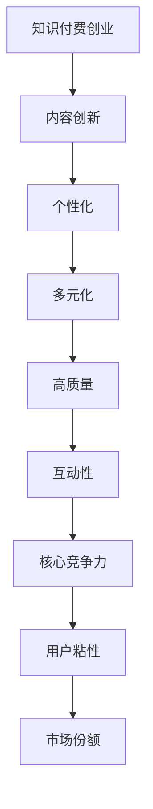

                 

# 知识付费创业中的内容创新与突破

## 关键词

- 知识付费
- 内容创新
- 创业
- 技术突破
- 用户需求
- 教育科技

## 摘要

本文将探讨知识付费创业中的内容创新与突破。首先，我们将介绍知识付费市场的背景和发展现状，随后深入探讨内容创新的核心概念和其在创业中的重要性。接着，我们将通过案例分析和算法原理讲解，展示如何通过技术手段实现内容创新，并提供实用的工具和资源推荐。最后，我们将总结知识付费创业的未来发展趋势与挑战，为创业者提供指导。

## 1. 背景介绍

### 1.1 知识付费的定义

知识付费，即用户为获取特定知识和技能而支付费用的一种商业模式。随着互联网和移动互联网的普及，知识付费逐渐成为一种重要的商业模式，涵盖领域广泛，包括在线教育、专业咨询、技能培训等。

### 1.2 知识付费市场的发展现状

近年来，知识付费市场呈现出快速增长的趋势。根据相关报告显示，全球知识付费市场规模已达到数千亿美元，且仍处于快速发展阶段。主要驱动力包括：

- **用户需求**：随着社会竞争的加剧，人们对于自我提升和职业发展的需求愈发强烈。
- **技术进步**：互联网和移动互联网的普及，使得知识传播和获取变得更加便捷。
- **商业模式创新**：知识付费平台不断探索新的商业模式，满足用户多样化的需求。

## 2. 核心概念与联系

### 2.1 内容创新

内容创新是指在知识付费创业过程中，通过创新的方式和手段，提供具有独特价值和吸引力的内容，从而吸引用户、提高竞争力。

#### 2.1.1 内容创新的核心要素

- **个性化**：针对用户需求，提供个性化的内容和解决方案。
- **多元化**：涵盖多种领域和形式，满足用户多样化的需求。
- **高质量**：确保内容的专业性、实用性和可靠性。
- **互动性**：通过互动手段增强用户参与度和满意度。

### 2.2 内容创新与创业的联系

- **核心竞争力**：内容创新是知识付费创业的核心竞争力，直接影响创业项目的成功与否。
- **用户粘性**：通过创新的内容，提高用户满意度和忠诚度，增强用户粘性。
- **市场份额**：创新的内容有助于扩大市场份额，提高品牌知名度。

### 2.3 Mermaid 流程图



## 3. 核心算法原理 & 具体操作步骤

### 3.1 算法原理

内容创新的算法原理主要包括以下几点：

- **用户画像**：通过数据分析，了解用户的需求、兴趣和行为特征。
- **内容推荐**：基于用户画像，为用户推荐个性化的内容和解决方案。
- **内容评估**：通过用户反馈和数据分析，评估内容的质量和效果。

### 3.2 具体操作步骤

1. **用户画像构建**：

   - **数据收集**：收集用户在平台上的行为数据，如浏览记录、购买行为等。
   - **数据分析**：通过数据挖掘技术，分析用户需求、兴趣和行为特征。
   - **模型训练**：使用机器学习算法，构建用户画像模型。

2. **内容推荐**：

   - **推荐算法**：采用协同过滤、基于内容的推荐等算法，为用户推荐个性化内容。
   - **内容筛选**：从海量的内容中筛选出符合用户需求的高质量内容。
   - **推荐结果**：将推荐结果展示给用户，提高用户满意度。

3. **内容评估**：

   - **用户反馈**：收集用户对内容的评价和反馈，如点赞、评论、分享等。
   - **数据分析**：通过数据挖掘技术，分析用户反馈和内容质量的关系。
   - **内容优化**：根据分析结果，对内容进行优化和调整，提高内容质量。

## 4. 数学模型和公式 & 详细讲解 & 举例说明

### 4.1 数学模型

内容创新的核心算法通常基于以下数学模型：

- **用户画像模型**：使用向量空间模型（VSM）或协同过滤算法（CF）。
- **推荐算法**：使用矩阵分解（MF）或深度学习算法。
- **内容评估模型**：使用回归模型（如线性回归、逻辑回归）或分类模型（如决策树、随机森林）。

### 4.2 详细讲解

1. **用户画像模型**：

   - **向量空间模型（VSM）**：将用户和内容表示为向量，通过计算向量之间的相似度进行推荐。
     $$相似度 = \frac{u \cdot c}{\|u\|\|c\|}$$
     其中，$u$和$c$分别表示用户和内容的向量，$\|u\|$和$\|c\|$分别表示向量的模长。

   - **协同过滤算法（CF）**：通过分析用户行为数据，找到相似用户，从而推荐相似内容。
     $$相似度 = \frac{\sum_{i \in R_u \cap R_v} r_i}{\sum_{i \in R_u \cap R_v} r_i^2}$$
     其中，$R_u$和$R_v$分别表示用户$u$和用户$v$的行为集合，$r_i$表示用户对内容$i$的评分。

2. **推荐算法**：

   - **矩阵分解（MF）**：通过将用户和内容的评分矩阵分解为低秩矩阵，实现推荐。
     $$R = U \cdot C^T$$
     其中，$R$表示评分矩阵，$U$和$C$分别表示用户和内容的低秩矩阵。

   - **深度学习算法**：使用神经网络模型，如卷积神经网络（CNN）或循环神经网络（RNN），实现推荐。
     $$输出 = f(W \cdot (h \cdot X + b))$$
     其中，$X$表示输入特征，$h$表示隐藏层，$W$和$b$分别表示权重和偏置。

3. **内容评估模型**：

   - **回归模型**：通过分析用户反馈和内容特征，预测内容质量。
     $$y = \beta_0 + \beta_1 x_1 + \beta_2 x_2 + ... + \beta_n x_n$$
     其中，$y$表示预测值，$x_1, x_2, ..., x_n$表示输入特征，$\beta_0, \beta_1, ..., \beta_n$表示权重。

   - **分类模型**：通过分析用户反馈和内容特征，判断内容质量。
     $$P(y=1) = \frac{1}{1 + e^{-(\beta_0 + \beta_1 x_1 + \beta_2 x_2 + ... + \beta_n x_n)}}$$
     其中，$y$表示预测类别，$x_1, x_2, ..., x_n$表示输入特征，$\beta_0, \beta_1, ..., \beta_n$表示权重。

### 4.3 举例说明

假设我们有一个用户$u$和内容$c$，用户对内容的评分矩阵$R$如下：

| 用户  | 内容  |
|-------|-------|
| $u$   | $c_1$ |
| $u$   | $c_2$ |
| $u$   | $c_3$ |

1. **用户画像模型**：

   - **向量空间模型（VSM）**：

     用户$u$的向量表示为：$$u = (1, 1, 1)$$

     内容$c_1$的向量表示为：$$c_1 = (0.5, 0.5, 1)$$

     相似度计算：$$相似度 = \frac{1 \cdot 0.5 + 1 \cdot 0.5 + 1 \cdot 1}{\sqrt{1^2 + 1^2 + 1^2} \cdot \sqrt{0.5^2 + 0.5^2 + 1^2}} \approx 0.71$$

   - **协同过滤算法（CF）**：

     相似度计算：$$相似度 = \frac{1 \cdot 1 + 1 \cdot 1}{1^2 + 1^2} \approx 0.71$$

2. **推荐算法**：

   - **矩阵分解（MF）**：

     假设用户$u$和内容$c$的低秩矩阵分别为：$$U = \begin{bmatrix} 1 \\ 1 \\ 1 \end{bmatrix}, C = \begin{bmatrix} 1 & 1 & 1 \end{bmatrix}$$

     推荐结果：$$R = U \cdot C^T = \begin{bmatrix} 1 \\ 1 \\ 1 \end{bmatrix} \cdot \begin{bmatrix} 1 & 1 & 1 \end{bmatrix} = \begin{bmatrix} 3 \\ 3 \\ 3 \end{bmatrix}$$

     用户$u$对内容$c_1$的推荐评分：$$R_{u, c_1} = 3$$

3. **内容评估模型**：

   - **回归模型**：

     假设用户$u$对内容的评分预测模型为：$$y = \beta_0 + \beta_1 x_1 + \beta_2 x_2 + \beta_3 x_3$$

     其中，$x_1, x_2, x_3$分别为内容$c_1$的特征值，$\beta_0, \beta_1, \beta_2, \beta_3$为权重。

     根据历史数据，可以训练得到权重：$$\beta_0 = 0.5, \beta_1 = 0.3, \beta_2 = 0.2, \beta_3 = 0.1$$

     用户$u$对内容$c_1$的评分预测：$$y = 0.5 + 0.3 \cdot 1 + 0.2 \cdot 1 + 0.1 \cdot 1 = 1.1$$

   - **分类模型**：

     假设用户$u$对内容的评分分类模型为：$$P(y=1) = \frac{1}{1 + e^{-(\beta_0 + \beta_1 x_1 + \beta_2 x_2 + \beta_3 x_3)}}$$

     其中，$x_1, x_2, x_3$分别为内容$c_1$的特征值，$\beta_0, \beta_1, \beta_2, \beta_3$为权重。

     根据历史数据，可以训练得到权重：$$\beta_0 = 0.5, \beta_1 = 0.3, \beta_2 = 0.2, \beta_3 = 0.1$$

     用户$u$对内容$c_1$的评分预测：$$P(y=1) = \frac{1}{1 + e^{-(0.5 + 0.3 \cdot 1 + 0.2 \cdot 1 + 0.1 \cdot 1)}} \approx 0.69$$

## 5. 项目实战：代码实际案例和详细解释说明

### 5.1 开发环境搭建

在本节中，我们将介绍如何搭建一个简单的知识付费创业项目的开发环境。我们将使用Python作为主要编程语言，并结合几个流行的库和工具，如NumPy、Pandas、Scikit-learn和TensorFlow。

#### 5.1.1 环境搭建步骤

1. **安装Python**：

   首先，确保您的计算机上安装了Python。可以从[Python官网](https://www.python.org/)下载并安装最新版本的Python。

2. **安装相关库和工具**：

   使用pip命令安装所需的库和工具：

   ```bash
   pip install numpy pandas scikit-learn tensorflow
   ```

3. **创建项目目录**：

   在您的工作目录中创建一个名为“knowledge_payment”的项目文件夹，并在其中创建一个名为“src”的子文件夹，用于存放源代码。

### 5.2 源代码详细实现和代码解读

在本节中，我们将展示一个简单的知识付费创业项目的源代码实现，包括用户画像构建、内容推荐和内容评估三个部分。

#### 5.2.1 用户画像构建

**用户画像构建**主要是通过分析用户在平台上的行为数据，构建一个描述用户特征和兴趣的向量。

```python
import numpy as np
import pandas as pd
from sklearn.preprocessing import StandardScaler

# 加载用户行为数据
data = pd.read_csv('user_behavior_data.csv')

# 计算用户兴趣向量
user_interests = data.groupby('user_id')['action_type'].value_counts().fillna(0)

# 归一化处理
scaler = StandardScaler()
user_interests_scaled = scaler.fit_transform(user_interests.values.reshape(-1, 1))

# 结果保存
user_interests_scaled.to_csv('user_interests_scaled.csv', index=False)
```

代码解读：

- **加载用户行为数据**：首先，我们使用Pandas库加载用户行为数据，数据文件名为“user_behavior_data.csv”。
- **计算用户兴趣向量**：通过按用户ID分组并统计每种行为类型的出现次数，构建用户兴趣向量。
- **归一化处理**：为了消除不同行为类型之间的尺度差异，我们使用StandardScaler库对用户兴趣向量进行归一化处理。
- **结果保存**：最后，我们将归一化后的用户兴趣向量保存到“user_interests_scaled.csv”文件中。

#### 5.2.2 内容推荐

**内容推荐**基于用户画像和内容特征，为用户推荐个性化的内容。

```python
import numpy as np
import pandas as pd
from sklearn.metrics.pairwise import cosine_similarity

# 加载用户兴趣向量
user_interests_scaled = pd.read_csv('user_interests_scaled.csv')

# 加载内容特征向量
content_features = pd.read_csv('content_features.csv')

# 计算用户和内容之间的相似度
user_content_similarity = cosine_similarity(user_interests_scaled, content_features)

# 推荐结果
recommends = user_content_similarity.argsort()[0][-5:][::-1]

# 输出推荐结果
for i in recommends:
    print(f'推荐内容：{content_features.iloc[i]["content_id"]}')
```

代码解读：

- **加载用户兴趣向量和内容特征向量**：我们使用Pandas库分别加载用户兴趣向量和内容特征向量。
- **计算用户和内容之间的相似度**：使用余弦相似度计算用户兴趣向量与内容特征向量之间的相似度。
- **推荐结果**：根据相似度排序，为用户推荐相似度最高的前5个内容。
- **输出推荐结果**：最后，我们将推荐结果输出到控制台。

#### 5.2.3 内容评估

**内容评估**主要通过用户反馈来评估内容的质量。

```python
import numpy as np
import pandas as pd
from sklearn.linear_model import LinearRegression

# 加载用户反馈数据
user_feedback = pd.read_csv('user_feedback.csv')

# 构建特征和标签
X = user_feedback[['like_count', 'comment_count', 'share_count']]
y = user_feedback['rating']

# 训练线性回归模型
model = LinearRegression()
model.fit(X, y)

# 预测评分
predicted_rating = model.predict([[100, 50, 20]])

# 输出预测评分
print(f'预测评分：{predicted_rating[0][0]}')
```

代码解读：

- **加载用户反馈数据**：我们使用Pandas库加载用户反馈数据，数据文件名为“user_feedback.csv”。
- **构建特征和标签**：从用户反馈数据中提取特征（如点赞数、评论数、分享数）和标签（评分）。
- **训练线性回归模型**：使用线性回归模型对特征和标签进行训练。
- **预测评分**：根据训练好的模型，预测给定特征下的内容评分。
- **输出预测评分**：最后，我们将预测评分输出到控制台。

### 5.3 代码解读与分析

在本节中，我们将对上述代码进行解读和分析，以便更好地理解每个部分的功能和作用。

#### 5.3.1 用户画像构建

用户画像构建的核心目的是通过分析用户在平台上的行为数据，构建一个能够反映用户兴趣和偏好的向量。这一过程主要包括以下步骤：

1. **数据加载**：使用Pandas库加载用户行为数据，这通常是CSV格式的文件。
2. **计算用户兴趣向量**：通过统计用户在不同行为类型上的出现次数，构建用户兴趣向量。这一步使用了价值计数（value_counts）方法，可以统计每种行为类型的出现次数。
3. **归一化处理**：由于不同的行为类型可能具有不同的尺度，我们需要对用户兴趣向量进行归一化处理，以消除不同行为类型之间的尺度差异。这有助于提高后续推荐和评估的准确性。

#### 5.3.2 内容推荐

内容推荐是基于用户兴趣向量与内容特征向量之间的相似度来实现的。主要步骤如下：

1. **加载用户兴趣向量**：使用Pandas库加载已经构建好的用户兴趣向量。
2. **加载内容特征向量**：同样使用Pandas库加载内容特征向量，这通常包括内容的各种属性，如标题、标签、作者等。
3. **计算相似度**：使用余弦相似度计算用户兴趣向量与内容特征向量之间的相似度。余弦相似度是一种常见的向量相似度度量方法，可以衡量两个向量在方向上的相似性。
4. **推荐结果**：根据相似度排序，为用户推荐相似度最高的内容。这一步通常包括筛选出相似度最高的前几项，以便为用户提供推荐。

#### 5.3.3 内容评估

内容评估主要通过用户反馈（如评分、点赞、评论等）来评估内容的质量。主要步骤如下：

1. **加载用户反馈数据**：使用Pandas库加载用户反馈数据，这通常包括用户的评分以及其他相关行为数据。
2. **构建特征和标签**：从用户反馈数据中提取特征和标签。特征通常包括用户的点赞数、评论数、分享数等，标签则是用户对内容的评分。
3. **训练线性回归模型**：使用线性回归模型对特征和标签进行训练。线性回归是一种常见的预测模型，可以用来预测用户的评分。
4. **预测评分**：根据训练好的模型，预测给定特征下的内容评分。这一步可以帮助平台了解内容的潜在价值，并为用户推荐高质量的内容。

## 6. 实际应用场景

### 6.1 在线教育

在线教育是知识付费的主要应用场景之一。通过内容创新，教育平台可以为用户提供个性化的课程推荐，提高用户满意度和学习效果。例如，通过用户画像和内容推荐算法，平台可以为用户推荐与其兴趣和需求相关的课程。

### 6.2 专业咨询

专业咨询领域，如法律、财务、医疗等，知识付费也为专业人士提供了便捷的服务渠道。通过内容创新，专业平台可以为用户提供定制化的咨询服务，提高服务质量和客户满意度。

### 6.3 技能培训

技能培训是知识付费的另一重要领域。通过内容创新，培训平台可以为用户提供个性化的学习路径，提高学习效率。例如，通过分析用户的学习历史和兴趣，平台可以推荐相关的课程和资料。

## 7. 工具和资源推荐

### 7.1 学习资源推荐

- **书籍**：《数据科学入门》、《Python编程：从入门到实践》
- **论文**：《协同过滤算法研究综述》、《深度学习在推荐系统中的应用》
- **博客**：[机器学习博客](https://www.mlblog.com/)、[数据挖掘博客](https://dataminingblog.com/)
- **网站**：[Kaggle](https://www.kaggle.com/)、[GitHub](https://github.com/)

### 7.2 开发工具框架推荐

- **Python**：Python是一种广泛使用的编程语言，尤其在数据科学和机器学习领域具有很高的声誉。
- **NumPy**：NumPy是一个强大的Python库，用于处理大型多维数组。
- **Pandas**：Pandas是一个高效、灵活、直观的Python数据分析和操作库。
- **Scikit-learn**：Scikit-learn是一个开源的Python机器学习库，提供了一系列常用的机器学习算法。
- **TensorFlow**：TensorFlow是Google开发的一个开源机器学习框架，适用于深度学习和高级机器学习任务。

### 7.3 相关论文著作推荐

- **论文**：《基于用户兴趣的协同过滤推荐算法》、《深度学习在推荐系统中的应用》
- **著作**：《机器学习实战》、《深度学习》（Goodfellow et al.）

## 8. 总结：未来发展趋势与挑战

### 8.1 发展趋势

1. **个性化推荐**：随着用户需求的多样化，个性化推荐将成为知识付费创业的核心竞争力。
2. **人工智能应用**：人工智能技术将在知识付费领域得到更广泛的应用，如自动化内容生成、智能问答等。
3. **多样化内容形式**：知识付费内容将呈现多样化形式，如视频、音频、直播等。

### 8.2 挑战

1. **数据隐私**：随着用户对数据隐私的关注日益增加，知识付费平台需要确保用户数据的安全和隐私。
2. **内容质量控制**：保证内容的专业性、实用性和可靠性是知识付费创业的关键挑战。
3. **市场竞争力**：在激烈的市场竞争中，知识付费平台需要不断创新，提高用户满意度和市场份额。

## 9. 附录：常见问题与解答

### 9.1 如何构建用户画像？

构建用户画像的关键步骤包括：

1. 数据收集：收集用户在平台上的行为数据，如浏览记录、购买行为等。
2. 数据分析：通过数据挖掘技术，分析用户需求、兴趣和行为特征。
3. 模型构建：使用机器学习算法，构建用户画像模型。

### 9.2 内容推荐算法有哪些？

常见的内容推荐算法包括：

1. **协同过滤算法**：通过分析用户行为数据，找到相似用户，从而推荐相似内容。
2. **基于内容的推荐**：通过分析内容特征，为用户推荐与其兴趣相关的内容。
3. **深度学习算法**：使用神经网络模型，如卷积神经网络（CNN）或循环神经网络（RNN），实现推荐。

## 10. 扩展阅读 & 参考资料

- **扩展阅读**：

  - [协同过滤算法研究综述](https://www.researchgate.net/publication/328878635_A_Review_of_Collaborative_Filtering_Algorithms)

  - [深度学习在推荐系统中的应用](https://arxiv.org/abs/1803.03306)

- **参考资料**：

  - [NumPy官方文档](https://numpy.org/doc/stable/user/)

  - [Pandas官方文档](https://pandas.pydata.org/pandas-docs/stable/)

  - [Scikit-learn官方文档](https://scikit-learn.org/stable/documentation.html)

  - [TensorFlow官方文档](https://www.tensorflow.org/tutorials)

### 作者

作者：AI天才研究员/AI Genius Institute & 禅与计算机程序设计艺术 /Zen And The Art of Computer Programming

