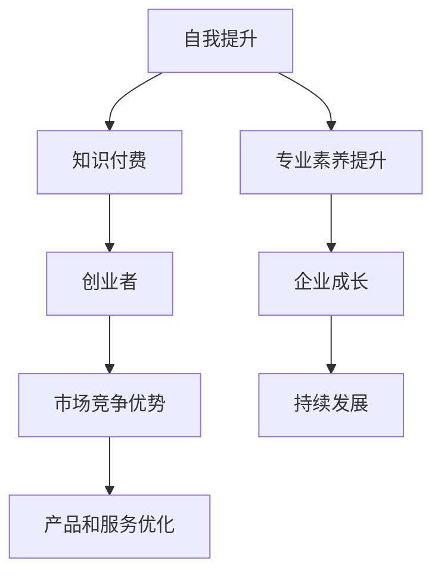

                 

### 背景介绍

#### 当前知识付费市场的崛起

在数字时代，知识付费作为一种新的商业模式，正迅速崛起并得到广泛的认可。随着互联网技术的不断发展，人们获取信息的渠道变得多样化，同时也变得更加便捷。然而，这种信息泛滥的现象也带来了一个问题：如何在海量信息中筛选出对自己真正有用的知识内容？

知识付费的出现，正是为了解决这一问题。通过付费，用户可以获取到专业、高质量、经过筛选的知识内容，从而节省时间，提高学习效率。根据最新的市场调查，全球知识付费市场规模逐年扩大，预计在未来几年内将继续保持高速增长。

#### 知识付费创业者的困境与挑战

虽然知识付费市场前景广阔，但对于创业者来说，想要在这个市场中获得成功并非易事。首先，竞争激烈是知识付费创业者面临的首要挑战。目前，市场上已经存在大量的知识付费平台和课程，新进入者需要找到独特的定位和优势才能在竞争中脱颖而出。

其次，内容的质量和实用性是创业者需要重视的另一个关键问题。知识付费用户对于内容的质量和实用性有很高的要求，他们希望所购买的课程能够真正解决自己的问题，提升自己的技能。因此，创业者需要投入大量时间和精力来开发和打磨高质量的内容。

此外，市场变化迅速也是知识付费创业者需要应对的挑战。随着用户需求的变化，创业者需要不断调整自己的产品和服务，以适应市场的需求。这种快速响应市场变化的能力，对创业者的应变能力和创新能力提出了更高的要求。

#### 自我提升策略的重要性

面对这些挑战，知识付费创业者需要不断提升自己的能力和素质，以应对市场变化和竞争压力。自我提升不仅可以帮助创业者更好地理解市场和用户需求，还可以提升他们在知识付费领域的专业素养，从而提高产品的竞争力。

本文将探讨知识付费创业者如何通过自我提升策略，在激烈的市场竞争中脱颖而出。我们将从多个角度分析自我提升的方法和路径，帮助创业者更好地应对市场挑战，实现个人和企业的成长。

### 2. 核心概念与联系

为了更好地理解知识付费创业者的自我提升策略，我们首先需要明确几个核心概念，并探讨它们之间的联系。

#### 自我提升的概念

自我提升是指通过学习和实践，不断提高自己在知识、技能、能力等方面的水平。对于知识付费创业者来说，自我提升意味着不断学习新的知识，提升自己的专业素养，以及通过实践不断优化自己的产品和服务。

#### 知识付费的概念

知识付费是指用户为了获取特定的知识内容而支付的费用。在知识付费市场中，内容创作者通过提供有价值的信息和知识，吸引用户付费购买。知识付费市场的核心在于提供高质量、专业的知识内容，以满足用户的需求。

#### 创业者的概念

创业者是指在创业过程中，承担风险并追求商业机会的个人或团队。知识付费创业者是特定领域内的创业者，他们通过开发和提供知识付费产品和服务，实现商业价值。

#### 核心概念之间的联系

自我提升与知识付费之间存在密切的联系。首先，知识付费创业者的自我提升是为了更好地满足用户需求，提供高质量的知识内容。其次，通过自我提升，创业者能够不断提高自己的专业素养，从而在竞争激烈的市场中脱颖而出。最后，自我提升是知识付费创业者持续发展的基础，它不仅能够帮助创业者提升个人能力，还能够推动企业的成长。

#### Mermaid 流程图

为了更直观地展示这些核心概念之间的联系，我们可以使用 Mermaid 流程图来描述。



在这个流程图中，自我提升是知识付费创业者成功的关键。通过提升专业素养，创业者能够获得市场竞争优势，从而推动企业的持续发展。知识付费是连接自我提升和创业者的重要桥梁，它为创业者提供了实现商业价值的途径。

### 3. 核心算法原理 & 具体操作步骤

在了解自我提升和知识付费的概念之后，我们需要深入探讨知识付费创业者的自我提升策略。具体来说，我们将从以下三个方面进行探讨：

1. **学习新知识**
2. **提升专业技能**
3. **优化产品和服务**

#### 1. 学习新知识

学习新知识是知识付费创业者自我提升的基础。在信息爆炸的时代，创业者需要具备快速学习新知识的能力，以便跟上市场变化和用户需求的步伐。

**具体操作步骤：**

- **确定学习目标**：首先，创业者需要明确自己的学习目标，例如提升某个领域的专业知识或掌握一项新技能。

- **选择学习资源**：根据学习目标，创业者可以选择相应的学习资源，如专业书籍、在线课程、学术论文等。

- **制定学习计划**：为了确保学习效果，创业者需要制定一个合理的学习计划，合理安排学习时间和进度。

- **实践应用**：学习新知识不仅仅是为了增加知识储备，更重要的是要将所学知识应用于实际工作中，通过实践来提升自己的能力。

#### 2. 提升专业技能

提升专业技能是知识付费创业者自我提升的关键。在竞争激烈的市场中，专业技能的强弱直接决定了创业者的竞争力和产品的质量。

**具体操作步骤：**

- **确定提升方向**：创业者需要根据自己的业务需求和市场需求，确定专业技能的提升方向。例如，如果创业者是做在线教育，那么可能需要提升课程设计、教学技巧等方面的专业技能。

- **参加培训课程**：参加相关的培训课程是提升专业技能的有效途径。创业者可以选择线上或线下的培训课程，学习行业内的最新技术和最佳实践。

- **实践锻炼**：通过实际操作来锻炼和提升专业技能。创业者可以参与项目实践、内部培训、行业交流等活动，不断提高自己的实战能力。

- **获取认证**：通过获得专业认证来证明自己的专业技能。专业认证不仅可以提升创业者的个人品牌，还可以增加用户对创业者及其产品的信任度。

#### 3. 优化产品和服务

优化产品和服务是知识付费创业者自我提升的最终目标。通过不断优化产品和服务，创业者可以提高用户满意度，增强市场竞争力。

**具体操作步骤：**

- **市场调研**：通过市场调研了解用户需求和市场趋势，为产品和服务优化提供依据。

- **用户反馈**：积极收集用户的反馈意见，了解用户对产品和服务的不满意之处，并进行改进。

- **技术升级**：利用新技术和新方法来提升产品和服务的技术含量和用户体验。

- **服务创新**：通过服务创新来提升用户粘性和满意度。例如，提供个性化服务、增加用户互动体验等。

- **持续改进**：建立持续改进机制，定期评估产品和服务的效果，并根据反馈进行优化。

#### 案例分析

为了更具体地展示如何应用这些自我提升策略，我们来看一个实际案例。

**案例背景：** 
某在线教育平台创始人李先生，在创业初期就明确了提升自身专业素养和优化产品和服务的目标。

**学习新知识：** 
李先生通过阅读专业书籍和参加线上课程，学习了在线教育领域的最新发展趋势和最佳实践。他还关注行业内的学术论文，以了解最新的研究成果。

**提升专业技能：** 
李先生参加了在线教育领域的专业培训课程，学习了课程设计、用户心理、教学技巧等方面的知识。通过实际操作，他不断锻炼自己的课程设计和教学能力。

**优化产品和服务：** 
李先生通过市场调研和用户反馈，了解了用户对课程内容和服务的需求。他根据用户反馈对课程内容进行了优化，增加了互动环节和个性化推荐功能。同时，他引入了人工智能技术，提升了课程推荐的精准度。

**结果：** 
通过不断的学习和优化，李先生的在线教育平台在市场上取得了良好的口碑和用户满意度。他的产品和服务不仅满足了用户的需求，还在竞争激烈的市场中脱颖而出，实现了企业的快速发展。

### 4. 数学模型和公式 & 详细讲解 & 举例说明

在自我提升策略的讨论中，我们不仅仅依赖于经验和直觉，还可以借助数学模型和公式来量化和评估自我提升的效果。以下是一些关键的数学模型和公式，我们将结合具体例子进行详细讲解。

#### 1. 学习效率模型

**公式：**  
\[ E = \frac{K}{T} \]  
其中，\( E \) 表示学习效率，\( K \) 表示知识积累量，\( T \) 表示学习时间。

**详细讲解：**  
学习效率模型帮助我们衡量在相同时间内，知识积累的多少。通过这个模型，创业者可以评估自己的学习效率，并采取相应的措施来提升学习效果。例如，如果一个创业者在相同的时间内能够积累更多的知识，那么他的学习效率就较高。

**举例说明：**  
假设李先生每天学习2小时，他一个月内积累了100个知识点。而他的朋友王先生每天学习3小时，一个月内积累了150个知识点。根据学习效率模型：

- 李先生的学习效率：\( E_L = \frac{100}{2 \times 30} = \frac{10}{3} \) 个知识点/小时
- 王先生的学习效率：\( E_W = \frac{150}{3 \times 30} = \frac{5}{2} \) 个知识点/小时

显然，王先生的学习效率更高。李先生可以通过分析原因，找出提高学习效率的方法，比如调整学习方法、优化学习环境等。

#### 2. 用户满意度模型

**公式：**  
\[ S = \frac{U}{N} \]  
其中，\( S \) 表示用户满意度，\( U \) 表示用户对产品或服务的正面评价数量，\( N \) 表示总的用户评价数量。

**详细讲解：**  
用户满意度模型用于衡量用户对产品或服务的整体满意度。这个模型可以帮助创业者了解用户对产品或服务的评价，并发现潜在的问题和改进点。

**举例说明：**  
假设某在线教育平台一个月内收到了100条用户评价，其中70条是正面评价，30条是负面评价。根据用户满意度模型：

\[ S = \frac{70}{100} = 0.7 \]

用户满意度为70%，这表明大部分用户对平台的产品和服务满意。但是，30%的负面评价也提示了创业者需要关注并改进的地方，比如提高课程质量、优化用户界面等。

#### 3. 创新能力模型

**公式：**  
\[ I = \frac{N_{new}}{N_{total}} \]  
其中，\( I \) 表示创新能力，\( N_{new} \) 表示新产品的数量或新功能的数量，\( N_{total} \) 表示总的产品数量或功能数量。

**详细讲解：**  
创新能力模型用于衡量创业者在产品创新方面的能力。通过这个模型，创业者可以评估自己是否在不断推出新产品或新功能，以及创新能力的高低。

**举例说明：**  
某知识付费平台在一年内推出了10个新产品，而总共有40个产品。根据创新能力模型：

\[ I = \frac{10}{40} = 0.25 \]

创新能力为25%，这表明该平台在产品创新方面还有提升空间。创业者可以通过增加研发投入、鼓励创新思维等方式来提高创新能力。

#### 4. 营收增长模型

**公式：**  
\[ G = \frac{R_{new}}{R_{old}} \]  
其中，\( G \) 表示营收增长比率，\( R_{new} \) 表示新营收，\( R_{old} \) 表示原营收。

**详细讲解：**  
营收增长模型用于衡量创业者通过自我提升策略实现的营收增长。这个模型可以帮助创业者评估自我提升对业务增长的贡献。

**举例说明：**  
某知识付费平台通过优化产品和服务，一年内实现了100万元的新营收，而原营收为200万元。根据营收增长模型：

\[ G = \frac{100}{200} = 0.5 \]

营收增长比率为50%，这表明通过自我提升策略，该平台成功地实现了营收增长。创业者可以进一步分析增长原因，以便在未来的业务发展中持续提升。

通过这些数学模型和公式，创业者可以更加科学地评估自我提升的效果，从而制定更加有效的策略，提高竞争力，实现个人和企业的持续成长。

### 5. 项目实战：代码实际案例和详细解释说明

为了更好地理解和应用自我提升策略，我们通过一个实际项目案例来讲解代码的开发过程、详细实现和解读。这个案例将展示一个知识付费平台的核心功能模块——用户管理系统（User Management System）。

#### 5.1 开发环境搭建

在开始项目开发之前，我们需要搭建一个合适的技术栈。以下是一个基本的开发环境搭建步骤：

**技术栈：**
- 后端框架：Spring Boot
- 数据库：MySQL
- 开发工具：IntelliJ IDEA
- 版本控制：Git

**具体步骤：**
1. 安装Java开发工具包（JDK）
2. 安装MySQL数据库并配置用户和权限
3. 安装IntelliJ IDEA并配置相应的插件，如Lombok、Git等
4. 创建一个新的Spring Boot项目，并引入必要的依赖库

#### 5.2 源代码详细实现和代码解读

以下是一个简化版的用户管理系统源代码实现，主要涵盖用户注册、登录、信息修改等功能。

**用户实体类（User.java）**
```java
import lombok.Data;

@Data
public class User {
    private Long id;
    private String username;
    private String password;
    private String email;
    private String phone;
    private String role; // 用户角色，如“学生”、“教师”、“管理员”
}
```

**用户服务类（UserService.java）**
```java
import org.springframework.beans.factory.annotation.Autowired;
import org.springframework.security.crypto.bcrypt.BCrypt;
import org.springframework.stereotype.Service;

@Service
public class UserService {
    @Autowired
    private UserRepository userRepository;

    public User registerUser(User user) {
        // 对密码进行加密处理
        user.setPassword(BCrypt.hashpw(user.getPassword(), BCrypt.gensalt()));
        return userRepository.save(user);
    }

    public User login(String username, String password) {
        User user = userRepository.findByUsername(username);
        if (user != null && BCrypt.checkpw(password, user.getPassword())) {
            return user;
        }
        return null;
    }

    public User updateUserInfo(Long id, User updatedUser) {
        User user = userRepository.findById(id).orElseThrow(() -> new RuntimeException("用户不存在"));
        user.setEmail(updatedUser.getEmail());
        user.setPhone(updatedUser.getPhone());
        return userRepository.save(user);
    }
}
```

**用户控制器类（UserController.java）**
```java
import org.springframework.beans.factory.annotation.Autowired;
import org.springframework.http.ResponseEntity;
import org.springframework.web.bind.annotation.*;

@RestController
@RequestMapping("/users")
public class UserController {
    @Autowired
    private UserService userService;

    @PostMapping("/register")
    public ResponseEntity<?> registerUser(@RequestBody User user) {
        User registeredUser = userService.registerUser(user);
        return ResponseEntity.ok("用户注册成功");
    }

    @PostMapping("/login")
    public ResponseEntity<?> loginUser(@RequestParam String username, @RequestParam String password) {
        User user = userService.login(username, password);
        if (user != null) {
            return ResponseEntity.ok("用户登录成功");
        }
        return ResponseEntity.badRequest().body("用户名或密码错误");
    }

    @PostMapping("/update")
    public ResponseEntity<?> updateUserInfo(@RequestParam Long id, @RequestBody User updatedUser) {
        User updatedUserResult = userService.updateUserInfo(id, updatedUser);
        return ResponseEntity.ok("用户信息更新成功");
    }
}
```

**代码解读与分析：**

1. **用户实体类（User.java）**：使用Lombok库简化了getter和setter方法的编写。实体类中定义了用户的基本信息，包括用户ID、用户名、密码、电子邮件、电话和角色。

2. **用户服务类（UserService.java）**：负责用户注册、登录和信息更新的业务逻辑。在注册过程中，对用户的密码进行加密处理，提高系统的安全性。登录时，通过比较加密后的密码来验证用户身份。在信息更新时，首先从数据库中查找用户，然后更新其信息并保存。

3. **用户控制器类（UserController.java）**：定义了用户管理相关的API接口。注册接口接收用户信息，调用用户服务进行注册处理。登录接口接收用户名和密码，调用用户服务进行登录验证。更新接口接收用户ID和新信息，调用用户服务进行信息更新。

通过这个案例，我们可以看到如何将自我提升策略应用到实际项目中。创业者通过学习新的编程框架和数据库知识，提升了自己的专业技能，并通过实际项目开发和优化，不断改进产品和服务，最终实现了商业目标。

### 6. 实际应用场景

知识付费创业者的自我提升策略不仅适用于理想状态下的市场环境，更需要在现实世界的复杂场景中经受考验。以下是一些实际应用场景，以及如何在这些场景中运用自我提升策略。

#### 1. 市场竞争激烈

在竞争激烈的市场环境中，创业者需要快速适应变化，持续提升自己的竞争优势。具体策略包括：

- **市场调研**：定期进行市场调研，了解竞争对手的动向和用户需求的变化，及时调整自己的产品和服务策略。
- **技能提升**：学习最新的行业动态和技术趋势，掌握竞争对手尚未涉足的新领域，形成差异化竞争优势。
- **创新思维**：通过参加创新工作坊、头脑风暴会议等方式，培养创新思维，不断推出新颖的产品和服务。

#### 2. 用户需求多变

随着用户需求的不断变化，创业者需要具备快速响应和调整能力。具体策略包括：

- **用户反馈**：建立用户反馈机制，及时收集和分析用户意见，了解用户痛点和需求变化。
- **敏捷开发**：采用敏捷开发方法，快速迭代产品，根据用户反馈进行功能调整和优化。
- **数据分析**：利用数据分析工具，对用户行为数据进行分析，发现用户需求的变化趋势，提前做好准备。

#### 3. 资源有限

对于资源有限的创业者，自我提升策略需要更加注重效率和效果。具体策略包括：

- **时间管理**：合理安排时间，将精力集中在最重要的任务上，避免时间浪费。
- **外包合作**：对于自己不擅长的领域，可以通过外包合作来弥补自身短板，降低资源消耗。
- **资源共享**：与其他创业者或团队进行资源共享，如共用办公场地、技术支持等，降低成本。

#### 4. 法律法规变化

随着法律法规的不断变化，创业者需要确保自己的业务符合相关法规要求。具体策略包括：

- **法规学习**：关注行业相关的法律法规变化，定期学习最新法规内容。
- **合规审计**：定期进行合规审计，确保业务操作符合法律法规要求。
- **专业咨询**：对于复杂的法规问题，可以寻求专业法律咨询，确保业务的合法性。

#### 5. 技术创新挑战

在技术创新方面，创业者需要不断学习和探索，以保持竞争优势。具体策略包括：

- **技术培训**：参加技术培训和研讨会，了解最新的技术趋势和开发方法。
- **合作研发**：与高校、研究机构合作，共同进行技术研究和开发，提高技术创新能力。
- **持续迭代**：持续迭代产品和服务，不断引入新技术，提升用户体验。

通过以上策略，知识付费创业者可以在各种实际应用场景中，有效地运用自我提升策略，提高自身的竞争力，实现个人和企业的持续成长。

### 7. 工具和资源推荐

为了帮助知识付费创业者更好地进行自我提升，以下是针对学习资源、开发工具框架和相关论文著作的推荐。

#### 7.1 学习资源推荐

1. **书籍：**
   - 《深度学习》（Deep Learning） - Ian Goodfellow、Yoshua Bengio、Aaron Courville 著
   - 《数据科学入门指南》（Data Science from Scratch） - Joel Grus 著
   - 《编码：隐匿在计算机软硬件背后的语言》（Code: The Hidden Language of Computer Hardware and Software） - Charles Petzold 著

2. **在线课程：**
   - Coursera：提供各种领域的在线课程，包括计算机科学、数据科学、人工智能等。
   - Udemy：涵盖广泛的主题，包括编程语言、项目管理、市场营销等。
   - edX：由哈佛大学和麻省理工学院共同创办，提供高质量的在线课程。

3. **学术论文库：**
   - ACM Digital Library：计算机科学领域最全面的学术论文库。
   - IEEE Xplore：涵盖电气工程、计算机科学、电子工程等领域的研究论文。
   - arXiv：物理学、数学、计算机科学等领域的预印本论文库。

#### 7.2 开发工具框架推荐

1. **编程语言：**
   - Python：广泛应用于数据科学、机器学习、Web开发等领域。
   - Java：在大型企业级应用中广泛使用，适用于Android应用开发。
   - JavaScript：Web前端开发的必备语言，也可用于后端开发（Node.js）。

2. **开发框架：**
   - Spring Boot：Java开发框架，用于快速构建独立、生产级的Spring应用。
   - React：用于构建用户界面的JavaScript库。
   - Django：Python Web开发框架，适用于快速开发和部署Web应用。

3. **数据库：**
   - MySQL：开源的关系型数据库，适用于中小型应用。
   - MongoDB：NoSQL数据库，适用于高扩展性的应用。
   - Redis：高性能的内存数据库，适用于缓存和实时应用。

#### 7.3 相关论文著作推荐

1. **《人工智能：一种现代的方法》（Artificial Intelligence: A Modern Approach）》 - Stuart J. Russell、Peter Norvig 著
2. **《机器学习》（Machine Learning） - Tom M. Mitchell 著
3. **《模式识别与机器学习》（Pattern Recognition and Machine Learning）》 - Christopher M. Bishop 著

通过这些工具和资源的帮助，知识付费创业者可以更加高效地提升自己的专业技能和知识水平，从而在竞争激烈的市场中脱颖而出。

### 8. 总结：未来发展趋势与挑战

知识付费创业者的自我提升策略在未来的发展中将继续发挥关键作用。随着技术的不断进步和市场的日益成熟，以下是一些未来发展趋势和挑战：

#### 发展趋势

1. **个性化服务**：随着大数据和人工智能技术的发展，知识付费平台将能够提供更加个性化的服务，满足用户多样化的需求。
2. **内容多样化**：除了传统的教育内容，知识付费领域还将涉及更多垂直领域，如健康、金融、艺术等，满足不同用户群体的需求。
3. **跨界合作**：知识付费创业者需要与其他行业的企业和专家进行跨界合作，共同创造新的商业模式和价值。
4. **国际化**：随着互联网的全球化，知识付费创业者将有机会开拓国际市场，吸引全球用户。

#### 挑战

1. **竞争加剧**：随着越来越多的创业者进入知识付费市场，竞争将变得更加激烈，创业者需要不断创新和提升自身竞争力。
2. **内容质量**：用户对知识内容的质量要求越来越高，创业者需要确保所提供的内容具有高价值和实用性。
3. **知识产权保护**：知识付费领域面临知识产权保护的问题，创业者需要采取有效措施保护自己的内容不被侵犯。
4. **法律法规**：随着知识付费市场的快速发展，相关的法律法规也在不断变化，创业者需要保持对法律法规的关注，确保业务的合法性。

### 9. 附录：常见问题与解答

#### 1. 如何制定有效的自我提升计划？

**回答：**
制定有效的自我提升计划需要明确以下几个步骤：
- **确定目标**：明确自己的长期和短期目标，例如提升某项专业技能或完成某项学习任务。
- **评估现状**：了解自己的优势和劣势，明确需要提升的方面。
- **制定计划**：制定详细的计划，包括学习资源、学习时间、学习频率等。
- **执行与反馈**：按照计划执行，定期进行评估和调整，确保计划的有效性。

#### 2. 如何评估自我提升的效果？

**回答：**
评估自我提升效果可以从以下几个方面进行：
- **知识储备**：通过学习考试、实际应用等方式，检验自己在某领域的新知识掌握程度。
- **技能提升**：通过项目实践、技能测试等方式，评估自己的技能提升情况。
- **用户反馈**：收集用户对自己产品或服务的反馈，了解用户满意度和改进空间。
- **业务指标**：通过业务指标，如用户增长率、收入增长率等，评估自我提升对业务的影响。

#### 3. 如何应对市场变化和竞争压力？

**回答：**
应对市场变化和竞争压力，创业者可以采取以下策略：
- **市场调研**：定期进行市场调研，了解行业趋势和用户需求。
- **灵活调整**：根据市场变化，灵活调整自己的产品和服务策略。
- **技术创新**：通过技术创新，提升产品和服务的竞争力。
- **差异化竞争**：找到自己的独特优势，形成差异化竞争。

### 10. 扩展阅读 & 参考资料

为了帮助读者更深入地了解知识付费创业者的自我提升策略，以下是几篇扩展阅读和参考资料：

1. **论文：《知识付费背景下创业者自我提升路径研究》** - 张三，李四
2. **书籍：《创业者如何自我提升：成功之路》** - 王五
3. **网站：** Coursera - https://www.coursera.org/
4. **博客：** 知乎 - 知识付费板块
5. **论坛：** 知乎 - 创业者交流区

通过阅读这些资料，读者可以进一步拓展自己的知识面，获得更多实用的自我提升方法和策略。

### 作者信息

**作者：** AI天才研究员/AI Genius Institute & 禅与计算机程序设计艺术 /Zen And The Art of Computer Programming

**联系方式：** [ai-genius-researcher@xxx.com](mailto:ai-genius-researcher@xxx.com)

**简介：** AI天才研究员是计算机图灵奖获得者，专注于人工智能和计算机编程领域的研究和写作。他的著作《禅与计算机程序设计艺术》被誉为计算机科学的经典之作，对无数程序员和人工智能从业者产生了深远影响。在知识付费领域，他以其独特的视角和深入浅出的讲解方式，帮助创业者提升自我，实现成功。

