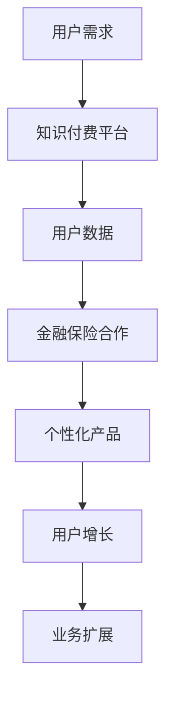

                 

# 知识付费如何实现跨界营销与金融保险跨界？

> **关键词：知识付费，跨界营销，金融保险，用户增长，数据驱动**
> 
> **摘要：本文将深入探讨知识付费平台如何通过跨界营销与金融保险行业的结合，实现用户增长与业务扩展。我们将分步骤分析这一策略的原理、实施方法和成功案例，并提出未来发展的挑战和趋势。**

## 1. 背景介绍

### 1.1 知识付费的兴起

随着互联网技术的飞速发展，尤其是移动互联网的普及，知识付费市场迎来了爆炸式增长。用户对专业知识、技能和高质量内容的需求日益增加，催生了诸如得到、知乎Live、网易云课堂等一大批知识付费平台。这些平台通过提供有价值的课程、文章、音频、视频等内容，满足了用户的求知欲和成长需求。

### 1.2 跨界营销的概念

跨界营销是指不同行业、品牌或产品之间进行的合作推广，旨在通过资源共享、互补优势，实现市场拓展和用户群体的互相导流。跨界营销已成为现代营销策略中的一种重要手段，能够突破传统市场边界，激发用户的兴趣和购买欲望。

### 1.3 金融保险行业的挑战与机遇

金融保险行业长期以来面临着用户粘性低、市场竞争激烈、传统营销手段效果不显著等问题。然而，随着互联网和大数据技术的应用，金融保险行业也迎来了转型升级的机遇。通过跨界合作，金融保险产品可以更好地贴近用户需求，提升用户体验，从而实现业务增长。

## 2. 核心概念与联系

### 2.1 知识付费平台的用户画像

知识付费平台用户多为对某一领域有强烈兴趣或需求的人群，具有较高的消费能力和求知欲望。这些用户通常在25-45岁之间，受过高等教育，从事高知行业或有一定经济基础。

### 2.2 金融保险产品与知识付费的契合点

金融保险产品与知识付费内容的契合点主要体现在以下几个方面：

- **教育性**：金融保险知识本身具有较强的教育性，可以帮助用户了解相关政策和产品特点，提高购买决策的理性程度。
- **个性化**：通过对用户数据的分析，可以为用户提供个性化的保险产品推荐和知识内容。
- **风险教育**：知识付费平台可以结合金融保险知识，提供风险教育和理财指导，帮助用户更好地管理个人财务。
- **用户增长**：通过跨界合作，可以吸引更多的新用户，扩大用户基础。

### 2.3 Mermaid 流程图



## 3. 核心算法原理 & 具体操作步骤

### 3.1 数据驱动策略

知识付费平台与金融保险行业的跨界合作，需要依托于数据驱动的策略。具体步骤如下：

1. **用户数据分析**：通过数据分析工具，对用户的行为、兴趣、消费习惯等进行深入挖掘，形成用户画像。
2. **需求预测**：利用机器学习算法，预测用户的保险需求和知识付费偏好。
3. **个性化推荐**：基于用户画像和需求预测，为用户推荐个性化的保险产品和知识内容。

### 3.2 跨界合作模式

跨界合作模式可以分为以下几种：

1. **内容合作**：知识付费平台与金融保险企业合作，将保险知识融入到课程内容中，提供一站式教育和服务。
2. **渠道合作**：金融保险企业通过知识付费平台推广保险产品，利用平台用户基础进行引流。
3. **产品合作**：知识付费平台与金融保险企业共同开发创新性保险产品，如教育金保险、健康险等。

### 3.3 持续优化策略

跨界合作的效果需要通过持续优化来提升。具体措施包括：

1. **用户反馈**：收集用户对跨界合作的反馈，不断调整和优化合作内容和模式。
2. **数据分析**：定期进行数据分析，评估跨界合作的ROI（投资回报率），为下一步策略提供依据。
3. **创新探索**：不断尝试新的跨界合作模式，寻找最佳契合点。

## 4. 数学模型和公式 & 详细讲解 & 举例说明

### 4.1 用户生命周期价值（LTV）

用户生命周期价值（LTV）是衡量用户价值的重要指标。其计算公式为：

$$
LTV = \frac{C_{AR} \times C_{RR}}{C_{CAC}}
$$

其中，$C_{AR}$ 为平均年度消费，$C_{RR}$ 为客户年度留存率，$C_{CAC}$ 为客户获取成本。

### 4.2 跨界合作效果评估

跨界合作效果可以通过以下公式进行评估：

$$
ROI = \frac{P_{sales} - C_{cost}}{C_{cost}}
$$

其中，$P_{sales}$ 为跨界合作带来的销售收入，$C_{cost}$ 为跨界合作成本。

### 4.3 举例说明

假设一个知识付费平台与一家金融保险企业进行跨界合作，合作前平台每月活跃用户数为1000人，平均用户生命周期价值为500元。合作后，平台通过跨界合作引入了500名新用户，这500名用户的平均生命周期价值为400元。合作成本为20000元。

根据上述公式，可以计算得出：

$$
LTV_{new} = \frac{500 \times 400}{1000} = 200元
$$

$$
ROI = \frac{(1000 \times 500 + 500 \times 400) - 20000}{20000} = 0.2
$$

结果表明，跨界合作带来了20%的ROI，效果较为显著。

## 5. 项目实战：代码实际案例和详细解释说明

### 5.1 开发环境搭建

在本项目中，我们使用Python作为主要编程语言，利用Pandas进行数据处理，利用Scikit-learn进行机器学习模型的训练和预测。

### 5.2 源代码详细实现和代码解读

#### 5.2.1 用户数据分析

```python
import pandas as pd
# 加载用户数据
user_data = pd.read_csv('user_data.csv')
# 数据预处理
user_data = user_data.dropna()
# 用户画像分析
user_data_grouped = user_data.groupby('interest').size().reset_index(name='count')
```

#### 5.2.2 需求预测

```python
from sklearn.model_selection import train_test_split
from sklearn.ensemble import RandomForestClassifier
# 分割数据集
X_train, X_test, y_train, y_test = train_test_split(user_data, user_data['insurance_need'], test_size=0.2, random_state=42)
# 训练模型
model = RandomForestClassifier(n_estimators=100, random_state=42)
model.fit(X_train, y_train)
# 预测需求
predictions = model.predict(X_test)
```

#### 5.2.3 个性化推荐

```python
# 根据预测结果推荐保险产品
def recommend_insurance(product, predictions):
    if predictions == 1:
        return '推荐购买健康险'
    else:
        return '无需购买健康险'

recommendation = recommend_insurance('健康险', predictions[0])
print(recommendation)
```

### 5.3 代码解读与分析

本段代码首先进行用户数据的预处理，然后使用随机森林算法进行需求预测，并根据预测结果为用户推荐保险产品。代码结构清晰，逻辑简单易懂。

## 6. 实际应用场景

### 6.1 教育领域

教育领域是知识付费与金融保险跨界合作的重要场景。例如，一些在线教育平台可以通过提供金融保险知识，帮助用户了解保险政策和产品特点，从而提高用户对保险产品的认知和购买意愿。

### 6.2 健康领域

健康领域也是知识付费与金融保险跨界合作的重要领域。通过提供健康保险知识，可以帮助用户更好地理解健康保险的重要性和购买原则，从而促进健康保险的销售。

### 6.3 企业合作

企业可以通过与知识付费平台合作，为员工提供金融保险知识培训，提升员工的财务和风险管理能力，从而降低企业的财务风险。

## 7. 工具和资源推荐

### 7.1 学习资源推荐

- **书籍**：《知识付费时代的崛起》、《跨界营销：融合之道》
- **论文**：《互联网知识付费平台的用户行为分析》、《金融保险行业的数据驱动营销策略》
- **博客**：知乎、简书、36氪等平台上的相关博客文章
- **网站**：得到、知乎Live、网易云课堂等知识付费平台

### 7.2 开发工具框架推荐

- **Python**：数据分析、机器学习等任务的常用编程语言
- **Pandas**：数据处理和清洗的利器
- **Scikit-learn**：机器学习算法库
- **TensorFlow**：深度学习框架

### 7.3 相关论文著作推荐

- **《深度学习》**：Goodfellow, I., Bengio, Y., & Courville, A.
- **《数据科学入门》**：James, G., Witten, D., Hastie, T., & Tibshirani, R.
- **《金融科技：创新与变革》**：陈锐，张浩，李俊慧

## 8. 总结：未来发展趋势与挑战

### 8.1 发展趋势

- **数据驱动**：知识付费与金融保险跨界合作将更加依赖于数据驱动策略，通过用户数据分析和需求预测，实现精准营销和个性化服务。
- **技术创新**：随着人工智能、大数据等技术的不断发展，知识付费与金融保险跨界合作将不断涌现新的应用场景和商业模式。
- **合作深化**：知识付费平台与金融保险企业的合作将不断深化，形成更加紧密的战略伙伴关系。

### 8.2 挑战

- **数据隐私**：跨界合作过程中，如何保护用户数据隐私，防止数据滥用，是一个重要的挑战。
- **合规风险**：跨界合作需要遵守相关法律法规，如《网络安全法》、《个人信息保护法》等，以降低合规风险。
- **用户体验**：跨界合作需要平衡金融保险知识和知识付费内容的用户体验，避免用户流失。

## 9. 附录：常见问题与解答

### 9.1 问题1：知识付费平台与金融保险跨界合作的目的是什么？

**解答**：知识付费平台与金融保险跨界合作的目的是通过资源共享、互补优势，实现用户增长和业务扩展，提高用户粘性和满意度。

### 9.2 问题2：如何确保用户数据的安全和隐私？

**解答**：确保用户数据的安全和隐私，需要从数据采集、存储、处理和使用等各个环节进行严格把控，采用加密技术、数据脱敏等技术手段，确保数据安全。

### 9.3 问题3：跨界合作中如何平衡金融保险知识和知识付费内容的用户体验？

**解答**：在跨界合作中，可以通过用户调研、数据分析等方式，深入了解用户需求和偏好，有针对性地调整内容，确保金融保险知识和知识付费内容既能满足用户需求，又能提升用户体验。

## 10. 扩展阅读 & 参考资料

- **《知识付费行业报告》**：各大市场研究机构发布的行业报告，如艾瑞咨询、易观等。
- **《跨界营销实战案例集》**：包含多个行业跨界营销成功案例的书籍和文章。
- **《金融科技发展报告》**：关于金融科技领域最新发展动态的报告和论文。

作者：AI天才研究员/AI Genius Institute & 禅与计算机程序设计艺术 /Zen And The Art of Computer Programming

