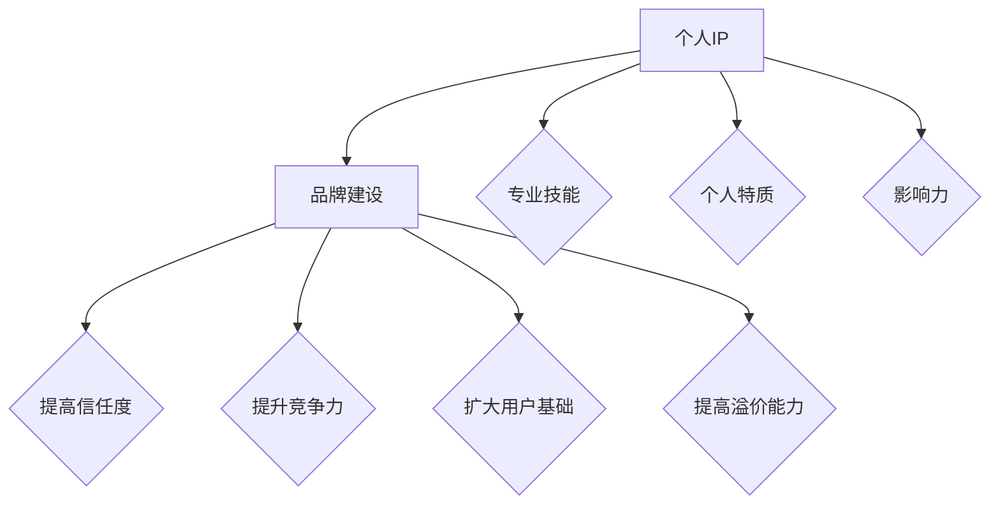

                 

# 知识付费赚钱的关键：打造个人IP与品牌

## > {关键词：知识付费、个人IP、品牌建设、营销策略、用户增长}

> {摘要：本文将深入探讨知识付费领域的核心要素——如何通过打造个人IP和品牌实现盈利。我们将分析知识付费的市场趋势，详细讲解打造个人IP和品牌的策略，并提供实用的工具和资源，帮助读者在知识付费领域取得成功。}

## 1. 背景介绍

### **知识付费的定义与发展**

知识付费，是指用户为获取特定领域的专业知识和技能而支付的费用。随着互联网技术的发展和用户需求的多样化，知识付费逐渐成为了一种新兴的商业模式。知识付费的形式多样，包括在线课程、专业咨询、内容订阅等。

近年来，知识付费市场呈现出快速发展的态势。根据相关数据显示，我国知识付费市场规模从2016年的19.7亿元增长到2021年的396亿元，年均复合增长率达到51.4%。这一趋势在全球范围内也得到了验证，特别是在新冠疫情影响下，在线教育和知识付费的崛起尤为显著。

### **个人IP与品牌的重要性**

在知识付费领域，个人IP和品牌建设显得尤为重要。个人IP指的是个人在某一领域的知识、技能和影响力的集合，而品牌则是一个人在市场中的整体形象和信誉。两者相辅相成，共同构成了知识付费成功的关键。

一个成功的个人IP和品牌能够带来以下几方面的优势：

1. **增加信任度**：个人IP和品牌建设能够提高用户对知识的信任度，从而增加付费意愿。
2. **提升竞争力**：拥有独特个人IP和品牌形象能够在众多竞争者中脱颖而出。
3. **扩大用户基础**：强大的个人IP和品牌能够吸引更多潜在用户，实现用户快速增长。
4. **提高溢价能力**：个人IP和品牌价值越高，知识产品的定价能力越强，从而实现更高盈利。

## 2. 核心概念与联系

### **个人IP与品牌的关系**

个人IP和品牌是相互关联的，两者共同构成了知识付费的核心竞争力。个人IP是品牌的基础，而品牌则是个人IP的市场体现。

**个人IP** 可以理解为个人的专业知识和技能的集合，包括但不限于：

1. **专业技能**：在某一领域的专业知识和实践经验。
2. **个人特质**：包括个性、风格、形象等。
3. **影响力**：在某一领域的知名度和影响力。

**品牌** 则是个人IP的市场表现，它包括：

1. **品牌形象**：在用户心中的整体印象。
2. **品牌定位**：个人IP在市场中的特定位置。
3. **品牌价值**：个人IP在市场中的价值体现。

### **个人IP与品牌建设的 Mermaid 流程图**



通过上述 Mermaid 流程图，我们可以清晰地看到个人IP和品牌建设之间的关联以及个人IP的构成要素。

## 3. 核心算法原理 & 具体操作步骤

### **打造个人IP的算法原理**

打造个人IP的核心在于构建独特且具有吸引力的个人品牌。这需要以下几步操作：

1. **定位个人IP**：确定自己在某一领域的专业方向，明确自己的优势和特点。
2. **积累专业知识**：通过学习、实践、分享等方式不断积累专业知识。
3. **塑造个人特质**：打造独特且具有吸引力的个人形象，包括风格、个性等。
4. **建立影响力**：通过多种渠道（如社交媒体、线上课程、线下讲座等）扩大在目标领域的影响力。

### **打造个人品牌的算法原理**

打造个人品牌的关键在于建立强大的市场认知和信任。以下是具体操作步骤：

1. **确立品牌定位**：明确个人品牌在市场中的定位，确定目标用户群体。
2. **制定品牌策略**：根据品牌定位制定合适的品牌推广策略，包括内容创作、渠道选择等。
3. **提升品牌形象**：通过高质量的内容、专业的形象设计等手段提升品牌形象。
4. **建立品牌信誉**：通过持续的服务和优质的体验建立品牌信誉。

### **具体操作步骤**

**3.1 定位个人IP**

- **自我评估**：评估自己的专业技能、个人特质和影响力。
- **市场调研**：了解目标市场的需求，确定个人IP的定位。

**3.2 积累专业知识**

- **学习与实践**：通过学习、实践不断提升自己的专业知识和技能。
- **分享与传播**：通过撰写博客、发表文章、开设线上课程等方式分享知识。

**3.3 塑造个人特质**

- **个性化设计**：包括形象设计、风格定位等。
- **社交互动**：通过社交媒体等渠道与用户互动，建立良好的个人形象。

**3.4 建立影响力**

- **内容创作**：创作高质量的内容，包括文章、视频、音频等。
- **推广与传播**：通过多种渠道推广个人IP，扩大影响力。

**3.5 确立品牌定位**

- **目标用户分析**：分析目标用户群体的特征和需求。
- **市场定位**：根据目标用户分析确定个人品牌的市场定位。

**3.6 制定品牌策略**

- **内容策略**：根据品牌定位制定内容创作策略。
- **渠道策略**：选择合适的渠道进行品牌推广。

**3.7 提升品牌形象**

- **视觉设计**：包括品牌标志、海报、名片等。
- **用户体验**：提供优质的用户体验，建立良好的口碑。

**3.8 建立品牌信誉**

- **持续服务**：提供高质量的服务，保持用户满意度。
- **客户反馈**：收集用户反馈，不断改进产品和服务。

## 4. 数学模型和公式 & 详细讲解 & 举例说明

### **4.1 用户增长模型**

在知识付费领域，用户增长是关键指标。一个简单的用户增长模型可以用以下公式表示：

$$
\text{用户增长} = \text{新用户} + \text{留存用户} - \text{流失用户}
$$

**详细讲解：**

- **新用户**：通过推广和营销活动吸引的新用户。
- **留存用户**：在一段时间内持续使用服务的用户。
- **流失用户**：停止使用服务的用户。

**举例说明：**

假设一家在线教育平台在一个月内吸引了1000个新用户，其中有800个用户在一个月内保持了活跃，有200个用户停止了使用。那么该平台的用户增长为：

$$
\text{用户增长} = 1000 + 800 - 200 = 700
$$

### **4.2 品牌认知度模型**

品牌认知度是衡量品牌影响力的关键指标。一个简单的品牌认知度模型可以用以下公式表示：

$$
\text{品牌认知度} = \frac{\text{认知用户}}{\text{目标用户}} \times 100\%
$$

**详细讲解：**

- **认知用户**：知道并认可个人品牌的目标用户。
- **目标用户**：个人品牌所针对的用户群体。

**举例说明：**

假设一个知识博主的目标用户是1000人，其中有800人知道并认可他的品牌。那么他的品牌认知度为：

$$
\text{品牌认知度} = \frac{800}{1000} \times 100\% = 80\%
$$

### **4.3 品牌价值模型**

品牌价值是衡量品牌在市场中的经济价值的指标。一个简单的品牌价值模型可以用以下公式表示：

$$
\text{品牌价值} = \text{品牌认知度} \times \text{用户忠诚度} \times \text{市场规模}
$$

**详细讲解：**

- **品牌认知度**：前面已经介绍过。
- **用户忠诚度**：用户对品牌的忠诚程度，可以用用户复购率等指标衡量。
- **市场规模**：品牌所覆盖的市场规模。

**举例说明：**

假设一个知识博主的品牌认知度为80%，用户忠诚度为70%，市场规模为1000万元。那么他的品牌价值为：

$$
\text{品牌价值} = 80\% \times 70\% \times 1000万元 = 560万元
$$

## 5. 项目实战：代码实际案例和详细解释说明

### **5.1 开发环境搭建**

在本文的项目实战部分，我们将使用Python来搭建一个简单的知识付费平台。以下是开发环境搭建的步骤：

1. 安装Python：从官网下载并安装Python。
2. 安装必要的库：使用pip安装Flask、SQLAlchemy等库。

```bash
pip install Flask
pip install SQLAlchemy
```

### **5.2 源代码详细实现和代码解读**

**5.2.1 登录注册模块**

```python
from flask import Flask, request, redirect, url_for, render_template
from models import User

app = Flask(__name__)

@app.route('/')
def home():
    return render_template('home.html')

@app.route('/login', methods=['GET', 'POST'])
def login():
    if request.method == 'POST':
        username = request.form['username']
        password = request.form['password']
        user = User.query.filter_by(username=username, password=password).first()
        if user:
            return redirect(url_for('dashboard'))
        else:
            return '登录失败，用户名或密码错误！'
    return render_template('login.html')

@app.route('/register', methods=['GET', 'POST'])
def register():
    if request.method == 'POST':
        username = request.form['username']
        password = request.form['password']
        user = User(username=username, password=password)
        db.session.add(user)
        db.session.commit()
        return redirect(url_for('login'))
    return render_template('register.html')

if __name__ == '__main__':
    app.run(debug=True)
```

**代码解读：**

- **路由配置**：使用Flask定义了三个路由，分别是首页、登录页面和注册页面。
- **登录注册功能**：通过表单提交实现登录和注册功能，并使用SQLAlchemy进行数据库操作。

**5.2.2 课程管理模块**

```python
from flask import Flask, request, redirect, url_for, render_template
from models import User, Course

app = Flask(__name__)

@app.route('/dashboard')
def dashboard():
    user = User.query.first()
    courses = Course.query.all()
    return render_template('dashboard.html', user=user, courses=courses)

@app.route('/course/create', methods=['GET', 'POST'])
def create_course():
    if request.method == 'POST':
        title = request.form['title']
        description = request.form['description']
        course = Course(title=title, description=description, user_id=user.id)
        db.session.add(course)
        db.session.commit()
        return redirect(url_for('dashboard'))
    return render_template('create_course.html')

if __name__ == '__main__':
    app.run(debug=True)
```

**代码解读：**

- **路由配置**：定义了课程管理相关的路由，包括课程列表和创建课程页面。
- **课程管理功能**：通过表单提交实现创建课程功能，并使用SQLAlchemy进行数据库操作。

### **5.3 代码解读与分析**

在上述代码中，我们使用了Flask作为Web框架，SQLAlchemy作为ORM进行数据库操作。

**5.3.1 登录注册模块**

- **登录功能**：通过`/login`路由处理登录请求，从表单获取用户名和密码，使用SQLAlchemy查询数据库验证用户信息。
- **注册功能**：通过`/register`路由处理注册请求，从表单获取用户名和密码，创建新用户并存储到数据库。

**5.3.2 课程管理模块**

- **课程列表**：通过`/dashboard`路由获取用户信息和课程列表，渲染到课程管理页面。
- **创建课程**：通过`/course/create`路由处理创建课程请求，从表单获取课程信息，创建新课程并存储到数据库。

通过以上代码实现，我们可以搭建一个简单的知识付费平台，包括登录注册、课程管理和用户管理等功能。

## 6. 实际应用场景

### **6.1 教育行业**

教育行业是知识付费的重要领域。通过打造个人IP和品牌，教育工作者可以开设线上课程、提供专业咨询，从而实现知识变现。例如，一位数学老师可以通过开设数学课程，分享自己的教学经验和解题技巧，吸引学生报名。

### **6.2 职场技能培训**

随着职场竞争的加剧，职场技能培训成为知识付费的另一个重要领域。个人IP和品牌建设可以帮助职场培训师吸引学员，提供包括职业技能、沟通技巧、团队管理等方面的培训服务。

### **6.3 专业咨询**

专业咨询是知识付费的高端领域。通过打造个人IP和品牌，专业顾问可以在金融、法律、医疗等领域提供专业咨询服务。例如，一位资深律师可以通过建立个人品牌，吸引客户寻求法律服务。

### **6.4 内容创作**

内容创作是知识付费的新兴领域。通过个人IP和品牌建设，内容创作者可以在自媒体平台、视频网站等渠道发布原创内容，吸引粉丝和观众，从而实现内容变现。

## 7. 工具和资源推荐

### **7.1 学习资源推荐**

- **书籍**：《影响力》、《引爆点》、《营销管理》
- **论文**：《知识付费：现状与趋势》、《社交媒体时代下的个人品牌建设》
- **博客**：刘润公众号、吴晓波频道
- **网站**：知乎、MBA智库

### **7.2 开发工具框架推荐**

- **开发框架**：Flask、Django
- **数据库**：MySQL、PostgreSQL
- **前端框架**：Bootstrap、Vue.js

### **7.3 相关论文著作推荐**

- **论文**：李明华，《知识付费模式与个人品牌建设研究》
- **著作**：《互联网+知识付费：创新与实践》、《知识变现：个人IP与品牌打造》

## 8. 总结：未来发展趋势与挑战

### **8.1 未来发展趋势**

1. **个性化服务**：随着人工智能技术的发展，知识付费将更加个性化，根据用户需求提供定制化内容。
2. **互动性增强**：知识付费平台将更加注重用户互动，通过直播、讨论区等方式提升用户体验。
3. **跨界融合**：知识付费将与其他领域（如娱乐、电商等）融合，形成新的商业模式。

### **8.2 面临的挑战**

1. **市场竞争激烈**：随着知识付费市场的快速发展，竞争将愈发激烈，如何脱颖而出成为关键。
2. **用户信任问题**：知识付费产品的质量参差不齐，如何建立用户信任是长期挑战。
3. **知识产权保护**：保护知识产权，防止内容抄袭和侵权，是知识付费领域需要解决的重要问题。

## 9. 附录：常见问题与解答

### **9.1 如何打造个人IP？**

**解答**：打造个人IP需要以下几个步骤：

1. 明确个人定位：确定自己在某一领域的专业方向和独特优势。
2. 不断积累知识：通过学习、实践和分享不断提升自己的专业水平。
3. 塑造个人形象：通过社交媒体、内容创作等手段展示自己的个性特质。
4. 建立影响力：通过多种渠道扩大在目标领域的知名度。

### **9.2 如何建立品牌信任？**

**解答**：建立品牌信任可以从以下几个方面入手：

1. 提供高质量内容：确保知识产品的专业性和实用性。
2. 保持诚信：诚实守信，不夸大宣传，不虚假承诺。
3. 优质用户体验：提供优质的售前、售中和售后服务。
4. 建立口碑：通过用户评价和推荐建立良好口碑。

### **9.3 如何提升品牌认知度？**

**解答**：提升品牌认知度可以通过以下几种方式：

1. 内容营销：创作高质量、有吸引力的内容，吸引用户关注。
2. 社交媒体推广：利用社交媒体平台进行品牌宣传，提高曝光率。
3. 合作与联动：与其他品牌或意见领袖合作，扩大品牌影响力。
4. 活动营销：举办线上线下活动，提升品牌知名度。

## 10. 扩展阅读 & 参考资料

- 李明华，《知识付费模式与个人品牌建设研究》，2021。
- 知乎专栏，《知识付费：现状与趋势》。
- MBA智库，《社交媒体时代下的个人品牌建设》。
- 刘润公众号，《互联网+知识付费：创新与实践》。
- 吴晓波频道，《知识变现：个人IP与品牌打造》。
- Flask官方文档，https://flask.palletsprojects.com/
- SQLAlchemy官方文档，https://docs.sqlalchemy.org/
- Bootstrap官方文档，https://getbootstrap.com/
- Vue.js官方文档，https://vuejs.org/。

### 作者信息

- 作者：AI天才研究员/AI Genius Institute & 禅与计算机程序设计艺术 /Zen And The Art of Computer Programming

本文深入探讨了知识付费领域的核心问题——如何通过打造个人IP和品牌实现盈利。通过分析市场趋势、详细讲解打造个人IP和品牌的策略，并提供实用的工具和资源，希望本文能够为读者在知识付费领域取得成功提供有力支持。在未来的发展中，知识付费将继续呈现出个性化、互动性、跨界融合等趋势，同时也将面临市场竞争、用户信任和知识产权保护等挑战。通过持续的努力和创新，个人IP和品牌将在这个领域发挥越来越重要的作用。让我们共同迎接知识付费的新时代！

