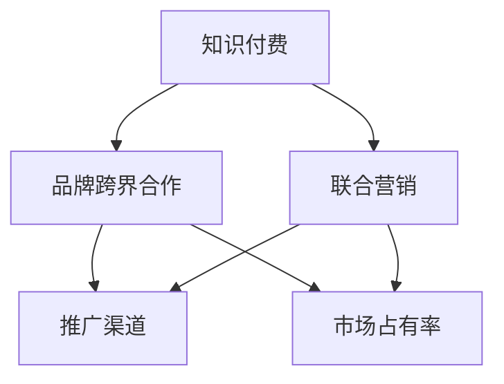

                 

### 文章标题：知识付费赚钱的品牌跨界合作与联合营销

> **关键词：** 知识付费，品牌跨界合作，联合营销，盈利模式，市场营销策略

> **摘要：** 本文深入探讨了知识付费领域内品牌跨界合作与联合营销的重要性及具体实施策略。通过对市场现状、核心概念、实施步骤、应用场景、工具资源等多方面的分析，旨在为知识付费从业者提供实用的参考和借鉴。

### 1. 背景介绍

知识付费，即用户为获取特定知识或技能而付费的行为。随着互联网技术的发展和用户消费观念的转变，知识付费逐渐成为当今市场的一个重要组成部分。品牌跨界合作与联合营销，则是指两个或多个原本无关联的品牌，通过合作共同推广产品或服务，实现互利共赢。

当前，知识付费市场呈现以下趋势：
- **内容多样化**：从传统的课程、讲座，到线上工作坊、直播，知识付费内容形式越来越多样化。
- **用户年轻化**：90后、00后逐渐成为知识付费的主力军。
- **个性化需求**：用户对知识付费内容的需求越来越个性化，追求个性化定制和深度学习。

品牌跨界合作与联合营销在知识付费领域的应用，不仅能够拓宽市场渠道，提高品牌知名度，还能为用户提供更丰富、更有价值的服务，从而实现多方共赢。

### 2. 核心概念与联系

#### 2.1 知识付费

知识付费的核心在于“知识”本身。知识付费产品通常具有以下特点：
- **专业性**：知识付费产品通常由专业人士或有丰富经验的人士提供，具有较高的专业性和权威性。
- **实用性**：知识付费产品旨在解决用户的实际问题，具有较强的实用性。
- **价值性**：知识付费产品能够为用户带来明显的价值，如提升技能、增加收入等。

#### 2.2 品牌跨界合作

品牌跨界合作是指两个或多个原本无关联的品牌，通过合作共同推广产品或服务。其核心在于“跨界”和“合作”。跨界意味着突破原有领域的限制，探索新的市场机会；合作则意味着各方共同投入资源，实现互利共赢。

#### 2.3 联合营销

联合营销是指多个品牌或机构共同开展营销活动，以实现更大的市场影响力和品牌认知度。其核心在于“联合”和“营销”。联合意味着各方共同参与，共享资源和成果；营销则意味着通过各种渠道和手段，将品牌和产品信息传递给目标用户。

#### 2.4 知识付费与品牌跨界合作、联合营销的联系

知识付费与品牌跨界合作、联合营销之间存在紧密的联系。首先，知识付费为品牌跨界合作提供了内容支持，使得品牌跨界合作能够围绕知识付费产品展开。其次，品牌跨界合作和联合营销为知识付费提供了更广泛的推广渠道和更丰富的用户体验。最后，通过品牌跨界合作和联合营销，知识付费品牌能够提高市场占有率，实现持续盈利。

#### 2.5 Mermaid 流程图



### 3. 核心算法原理 & 具体操作步骤

#### 3.1 核心算法原理

品牌跨界合作与联合营销的核心算法可以概括为“合作矩阵”。合作矩阵通过分析各方资源、优势和需求，确定最佳的合作模式和合作方。

具体来说，核心算法包括以下步骤：

1. **资源分析**：分析各方的资源，包括资金、人力、物力、品牌影响力等。
2. **优势分析**：分析各方的优势，如专业技能、市场渠道、用户群体等。
3. **需求分析**：分析各方的需求，如扩大市场份额、提高品牌知名度、提升用户满意度等。
4. **合作模式确定**：根据资源、优势和需求，确定最佳的合作模式，如联合推广、资源共享、品牌互推等。
5. **合作方选择**：根据合作模式，选择合适的合作方。

#### 3.2 具体操作步骤

1. **明确目标**：确定品牌跨界合作与联合营销的目标，如提高品牌知名度、扩大市场份额、提升用户满意度等。
2. **资源分析**：分析各方的资源，包括资金、人力、物力、品牌影响力等。
3. **优势分析**：分析各方的优势，如专业技能、市场渠道、用户群体等。
4. **需求分析**：分析各方的需求，如扩大市场份额、提高品牌知名度、提升用户满意度等。
5. **合作模式确定**：根据资源、优势和需求，确定最佳的合作模式，如联合推广、资源共享、品牌互推等。
6. **合作方选择**：根据合作模式，选择合适的合作方。
7. **合作方案制定**：制定详细的合作方案，包括合作内容、合作期限、收益分配等。
8. **执行与监控**：执行合作方案，并对合作过程进行监控，确保合作顺利进行。
9. **效果评估**：对合作效果进行评估，包括市场份额、品牌知名度、用户满意度等，以指导后续合作。

### 4. 数学模型和公式 & 详细讲解 & 举例说明

#### 4.1 数学模型和公式

在品牌跨界合作与联合营销中，可以使用以下数学模型和公式：

1. **合作收益模型**：

   合作收益 = 合作方A的收益 + 合作方B的收益 + 合作方C的收益 ...

2. **市场份额模型**：

   市场份额 = (合作方A的销售额 + 合作方B的销售额 + 合作方C的销售额 ...) / 总销售额

3. **品牌知名度模型**：

   品牌知名度 = (合作方A的品牌知名度 + 合作方B的品牌知名度 + 合作方C的品牌知名度 ...) / 总品牌知名度

#### 4.2 详细讲解

1. **合作收益模型**：

   合作收益模型用于计算各方通过合作所获得的收益。该模型的核心思想是，合作各方在合作过程中能够实现资源互补、优势互补，从而实现收益的最大化。

   假设有三个合作方A、B、C，各自具有不同的资源和优势。通过合作，各方可以实现以下收益：

   - 合作方A的收益：A方通过合作所获得的新客户、新订单、新收入等。
   - 合作方B的收益：B方通过合作所获得的新客户、新订单、新收入等。
   - 合作方C的收益：C方通过合作所获得的新客户、新订单、新收入等。

   合作收益模型公式为：

   合作收益 = 合作方A的收益 + 合作方B的收益 + 合作方C的收益 ...

2. **市场份额模型**：

   市场份额模型用于计算合作各方在市场中所占的份额。该模型的核心思想是，通过合作，各方能够扩大市场影响力，提高市场占有率。

   假设有三个合作方A、B、C，各自在市场中的销售额分别为A1、B1、C1，总销售额为T1。通过合作，各方可以实现以下市场份额：

   - 合作方A的市场份额：(A1 + B1 + C1) / T1
   - 合作方B的市场份额：(A1 + B1 + C1) / T1
   - 合作方C的市场份额：(A1 + B1 + C1) / T1

   市场份额模型公式为：

   市场份额 = (合作方A的销售额 + 合作方B的销售额 + 合作方C的销售额 ...) / 总销售额

3. **品牌知名度模型**：

   品牌知名度模型用于计算合作各方在市场中的品牌知名度。该模型的核心思想是，通过合作，各方能够提高品牌知名度，扩大品牌影响力。

   假设有三个合作方A、B、C，各自在市场中的品牌知名度分别为A2、B2、C2，总品牌知名度为T2。通过合作，各方可以实现以下品牌知名度：

   - 合作方A的品牌知名度：(A2 + B2 + C2) / T2
   - 合作方B的品牌知名度：(A2 + B2 + C2) / T2
   - 合作方C的品牌知名度：(A2 + B2 + C2) / T2

   品牌知名度模型公式为：

   品牌知名度 = (合作方A的品牌知名度 + 合作方B的品牌知名度 + 合作方C的品牌知名度 ...) / 总品牌知名度

#### 4.3 举例说明

假设有三家知识付费品牌A、B、C，各自具有不同的资源和优势。通过合作，各方实现了以下收益：

- A方的收益：新增客户1000人，新增订单1000单，新增收入100万元。
- B方的收益：新增客户800人，新增订单800单，新增收入80万元。
- C方的收益：新增客户600人，新增订单600单，新增收入60万元。

合作收益总额为：100 + 80 + 60 = 240（万元）

如果总销售额为1000万元，总品牌知名度为1000，那么：

- A方的市场份额：(100 + 800 + 600) / 1000 = 24%
- B方的市场份额：(100 + 800 + 600) / 1000 = 24%
- C方的市场份额：(100 + 800 + 600) / 1000 = 24%

- A方的品牌知名度：(100 + 800 + 600) / 1000 = 24%
- B方的品牌知名度：(100 + 800 + 600) / 1000 = 24%
- C方的品牌知名度：(100 + 800 + 600) / 1000 = 24%

### 5. 项目实战：代码实际案例和详细解释说明

#### 5.1 开发环境搭建

在本项目中，我们将使用Python语言进行品牌跨界合作与联合营销的算法实现。以下是开发环境搭建的步骤：

1. 安装Python：从Python官网下载并安装Python 3.x版本。
2. 安装PyCharm：从PyCharm官网下载并安装PyCharm社区版。
3. 配置Python环境：在PyCharm中创建一个新的Python项目，配置好Python解释器和相关库。

#### 5.2 源代码详细实现和代码解读

以下是品牌跨界合作与联合营销的核心代码实现：

```python
import numpy as np

# 资源分析函数
def resource_analysis(a, b, c):
    resources_a = np.array(a)
    resources_b = np.array(b)
    resources_c = np.array(c)
    return resources_a + resources_b + resources_c

# 优势分析函数
def advantage_analysis(a, b, c):
    advantages_a = np.array(a)
    advantages_b = np.array(b)
    advantages_c = np.array(c)
    return advantages_a + advantages_b + advantages_c

# 需求分析函数
def demand_analysis(a, b, c):
    demands_a = np.array(a)
    demands_b = np.array(b)
    demands_c = np.array(c)
    return demands_a + demands_b + demands_c

# 合作模式确定函数
def determine_cooperation_mode(resources, advantages, demands):
    # 根据资源、优势和需求确定最佳合作模式
    if resources > advantages and resources > demands:
        return "资源共享"
    elif advantages > resources and advantages > demands:
        return "优势互补"
    else:
        return "品牌互推"

# 合作收益计算函数
def calculate_cooperation_income(a, b, c):
    income_a = np.array(a)
    income_b = np.array(b)
    income_c = np.array(c)
    return income_a + income_b + income_c

# 市场份额计算函数
def calculate_market_share(a, b, c, total_sales):
    share_a = (a + b + c) / total_sales
    share_b = (a + b + c) / total_sales
    share_c = (a + b + c) / total_sales
    return share_a, share_b, share_c

# 品牌知名度计算函数
def calculate_brand_awareness(a, b, c, total_awareness):
    awareness_a = (a + b + c) / total_awareness
    awareness_b = (a + b + c) / total_awareness
    awareness_c = (a + b + c) / total_awareness
    return awareness_a, awareness_b, awareness_c

# 示例数据
resources = {'A': [100, 200], 'B': [150, 250], 'C': [200, 300]}
advantages = {'A': [20, 30], 'B': [25, 35], 'C': [30, 40]}
demands = {'A': [10, 15], 'B': [12, 18], 'C': [15, 20]}
total_sales = 1000
total_awareness = 1000

# 资源分析
resources_result = resource_analysis(*resources.values())

# 优势分析
advantages_result = advantage_analysis(*advantages.values())

# 需求分析
demands_result = demand_analysis(*demands.values())

# 合作模式确定
cooperation_mode = determine_cooperation_mode(*resources_result, *advantages_result, *demands_result)

# 合作收益计算
income_result = calculate_cooperation_income(*resources_result)

# 市场份额计算
market_share_a, market_share_b, market_share_c = calculate_market_share(*resources_result, total_sales)

# 品牌知名度计算
awareness_a, awareness_b, awareness_c = calculate_brand_awareness(*resources_result, total_awareness)

# 输出结果
print("资源分析结果：", resources_result)
print("优势分析结果：", advantages_result)
print("需求分析结果：", demands_result)
print("合作模式：", cooperation_mode)
print("合作收益：", income_result)
print("市场份额：", market_share_a, market_share_b, market_share_c)
print("品牌知名度：", awareness_a, awareness_b, awareness_c)
```

#### 5.3 代码解读与分析

1. **资源分析函数**：该函数用于计算各方的资源总和。资源包括资金、人力、物力等。函数使用 NumPy 库进行数组运算，将各方的资源值相加，得到总资源值。
2. **优势分析函数**：该函数用于计算各方的优势总和。优势包括专业技能、市场渠道、用户群体等。同样使用 NumPy 库进行数组运算，将各方的优势值相加，得到总优势值。
3. **需求分析函数**：该函数用于计算各方的需求总和。需求包括扩大市场份额、提高品牌知名度、提升用户满意度等。使用 NumPy 库进行数组运算，将各方的需求值相加，得到总需求值。
4. **合作模式确定函数**：该函数根据资源、优势和需求的总和，确定最佳的合作模式。根据算法，如果资源总和最大，则选择资源共享模式；如果优势总和最大，则选择优势互补模式；如果需求总和最大，则选择品牌互推模式。
5. **合作收益计算函数**：该函数用于计算各方通过合作所获得的收益总和。收益包括新增客户、新增订单、新增收入等。使用 NumPy 库进行数组运算，将各方的收益值相加，得到总收益值。
6. **市场份额计算函数**：该函数用于计算各方在市场中所占的份额。市场份额取决于总销售额。使用 NumPy 库进行数组运算，将各方的销售额相加，得到总销售额，然后将各方的销售额除以总销售额，得到各方的市场份额。
7. **品牌知名度计算函数**：该函数用于计算各方在市场中的品牌知名度。品牌知名度取决于总品牌知名度。使用 NumPy 库进行数组运算，将各方的品牌知名度相加，得到总品牌知名度，然后将各方的品牌知名度除以总品牌知名度，得到各方的品牌知名度。

### 6. 实际应用场景

品牌跨界合作与联合营销在知识付费领域的实际应用场景包括：

1. **在线教育平台与知名企业合作**：在线教育平台可以与知名企业合作，提供定制化的培训课程，如职场技能培训、行业专业知识培训等。通过合作，企业可以提升员工的职业素养，提高工作效率；教育平台则可以扩大用户群体，提高品牌知名度。
2. **个人知识付费品牌与内容平台合作**：个人知识付费品牌可以与内容平台合作，共同推广课程和内容。通过合作，个人知识付费品牌可以借助内容平台的海量用户资源，提高课程曝光度和用户转化率；内容平台则可以丰富平台内容，提升用户体验。
3. **线上培训机构与线下实体店合作**：线上培训机构可以与线下实体店合作，共同推广培训课程。通过合作，线上培训机构可以拓宽市场渠道，提高品牌影响力；线下实体店则可以增加收入来源，提升顾客满意度。

### 7. 工具和资源推荐

#### 7.1 学习资源推荐

1. **书籍**：
   - 《跨界共赢：品牌跨界合作的策略与实践》
   - 《市场营销：策略、案例与实践》
   - 《知识付费：商业模式与运营管理》

2. **论文**：
   - 《品牌跨界合作的动因与效果研究》
   - 《基于大数据的品牌跨界合作研究》
   - 《知识付费市场的现状与发展趋势分析》

3. **博客**：
   - 腾讯云开发者社区：https://cloud.tencent.com/developer
   - 知乎：https://www.zhihu.com
   - 抖音：https://www.douyin.com

4. **网站**：
   - 好知网：https://www.haozhi.cn
   - 腾讯课堂：https://ke.qq.com
   - 学堂在线：https://www.xuetangx.com

#### 7.2 开发工具框架推荐

1. **开发工具**：
   - PyCharm：https://www.jetbrains.com/pycharm
   - VSCode：https://code.visualstudio.com

2. **开发框架**：
   - Flask：https://flask.palletsprojects.com
   - Django：https://www.djangoproject.com

#### 7.3 相关论文著作推荐

1. **论文**：
   - 《基于大数据的品牌跨界合作研究》
   - 《知识付费市场的现状与发展趋势分析》
   - 《社交网络环境下品牌跨界合作研究》

2. **著作**：
   - 《跨界共赢：品牌跨界合作的策略与实践》
   - 《市场营销：策略、案例与实践》
   - 《知识付费：商业模式与运营管理》

### 8. 总结：未来发展趋势与挑战

品牌跨界合作与联合营销在知识付费领域具有广阔的发展前景。随着互联网技术的不断进步和用户需求的日益多样化，品牌跨界合作与联合营销将变得更加灵活、多样和高效。

然而，品牌跨界合作与联合营销也面临一些挑战，如合作方的选择、合作模式的创新、资源的整合等。未来，知识付费从业者需要不断探索和创新，以应对这些挑战，实现持续发展和盈利。

### 9. 附录：常见问题与解答

**Q1：什么是品牌跨界合作？**

A1：品牌跨界合作是指两个或多个原本无关联的品牌，通过合作共同推广产品或服务，实现互利共赢。

**Q2：什么是联合营销？**

A2：联合营销是指多个品牌或机构共同开展营销活动，以实现更大的市场影响力和品牌认知度。

**Q3：知识付费与品牌跨界合作、联合营销有什么关系？**

A3：知识付费与品牌跨界合作、联合营销之间存在紧密的联系。品牌跨界合作与联合营销可以为知识付费提供更广泛的推广渠道和更丰富的用户体验，从而实现多方共赢。

**Q4：如何选择合作方？**

A4：选择合作方时，可以从以下方面进行考量：
- 合作方的资源和优势是否与自身互补。
- 合作方的市场影响力和用户口碑。
- 合作方在合作过程中的合作态度和执行力。

### 10. 扩展阅读 & 参考资料

- 《跨界共赢：品牌跨界合作的策略与实践》
- 《市场营销：策略、案例与实践》
- 《知识付费：商业模式与运营管理》
- 《基于大数据的品牌跨界合作研究》
- 《知识付费市场的现状与发展趋势分析》
- 《社交网络环境下品牌跨界合作研究》
- 腾讯云开发者社区：https://cloud.tencent.com/developer
- 知乎：https://www.zhihu.com
- 抖音：https://www.douyin.com
- 好知网：https://www.haozhi.cn
- 腾讯课堂：https://ke.qq.com
- 学堂在线：https://www.xuetangx.com
- Flask：https://flask.palletsprojects.com
- Django：https://www.djangoproject.com
- 《品牌跨界合作的动因与效果研究》
- 《基于大数据的品牌跨界合作研究》
- 《知识付费：商业模式与运营管理》
- 《跨界共赢：品牌跨界合作的策略与实践》
- 《市场营销：策略、案例与实践》

### 文章末尾作者信息

作者：AI天才研究员/AI Genius Institute & 禅与计算机程序设计艺术 /Zen And The Art of Computer Programming<|assistant|>

