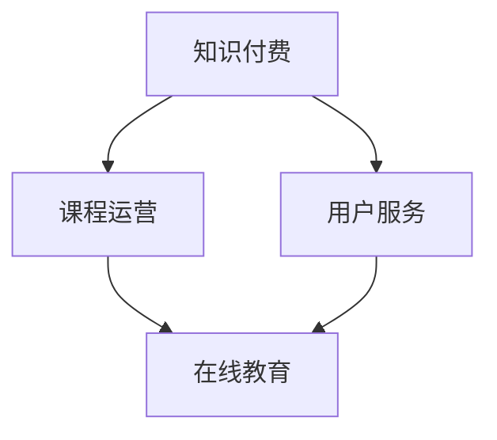

                 

### 背景介绍 Background Introduction

知识付费作为一种新型的商业模式，正逐渐成为当今社会的一种主流趋势。特别是在互联网的推动下，人们对于知识和技能的需求日益增长，从而催生了知识付费市场的高速发展。知识付费指的是用户通过支付费用来获取特定领域的知识、技能或服务。这种模式不仅满足了用户的学习需求，也为内容提供者带来了可观的收益。

在知识付费市场中，课程运营与用户服务是两大核心环节。课程运营涉及课程内容的策划、制作、推广和销售等方面，目的是确保课程能够吸引并留住用户。而用户服务则关注用户在使用过程中的体验和满意度，包括用户咨询、反馈处理、售后支持等。一个成功的知识付费项目，必须在这两个方面都做得出色，才能赢得用户的信任和忠诚。

本文将围绕知识付费赚钱的课程运营与用户服务展开讨论。首先，我们将探讨知识付费的基本概念和核心特征，分析其兴起的原因和趋势。接着，我们将详细讲解课程运营的各个关键环节，如课程定位、内容制作、推广策略等。随后，我们将重点关注用户服务的各个方面，包括用户咨询、反馈处理和售后服务等。最后，我们将推荐一些实用的工具和资源，帮助读者更好地理解和实践知识付费的课程运营与用户服务。

通过本文的阅读，您将了解知识付费市场的现状和发展趋势，掌握课程运营与用户服务的基本技巧和方法，为您的知识付费项目提供有益的指导和借鉴。让我们一步一步深入探讨这一领域的奥秘，共同探索知识付费的广阔天地。

> Keywords: Knowledge-based economy, Course operation, User service, Online education, Business model

> Abstract: This article delves into the concepts and characteristics of knowledge-based economy, focusing on the key aspects of course operation and user service in the knowledge-based payment market. It discusses the reasons behind the rise of this trend and provides practical strategies for successful course operation and user service.

### 2. 核心概念与联系 Core Concepts and Connections

在深入探讨知识付费赚钱的课程运营与用户服务之前，我们有必要先理解一些核心概念，并探讨它们之间的联系。这些核心概念包括知识付费、课程运营、用户服务、在线教育等。

#### 知识付费（Knowledge-based Payment）

知识付费指的是用户通过支付一定费用来获取特定领域的知识、技能或服务。与传统免费内容相比，知识付费具有以下几个核心特征：

1. **价值性**：知识付费内容通常具有较高的价值，能够满足用户的具体需求。
2. **稀缺性**：由于内容创作者的精力和资源有限，知识付费内容往往具有稀缺性。
3. **定价灵活性**：知识付费可以根据内容的复杂度、受众群体的需求等因素进行灵活定价。

#### 课程运营（Course Operation）

课程运营是指围绕课程内容的一系列策划、制作、推广和销售活动。成功的课程运营包括以下几个关键环节：

1. **课程定位**：明确课程的目标受众、教学内容和课程结构。
2. **内容制作**：确保课程内容高质量、实用性强，能够满足用户需求。
3. **推广策略**：通过多种渠道和手段进行课程宣传，吸引潜在用户。
4. **销售转化**：通过优化课程页面、营销活动等方式，提高用户的购买意愿和转化率。

#### 用户服务（User Service）

用户服务是知识付费项目中至关重要的一环，直接影响用户的满意度和忠诚度。用户服务主要包括以下几个部分：

1. **用户咨询**：提供及时、专业的咨询服务，解答用户在课程学习过程中的疑问。
2. **反馈处理**：收集并分析用户反馈，不断优化课程内容和用户体验。
3. **售后服务**：在课程结束后，提供持续的售后服务，如课程更新、答疑等。

#### 在线教育（Online Education）

在线教育是知识付费的主要载体，通过互联网平台进行教学和学习。在线教育的特点包括：

1. **灵活性**：用户可以根据自己的时间和需求进行学习，无需受限于时间和地点。
2. **互动性**：用户可以通过在线平台与教师和其他学生进行互动，提高学习效果。
3. **便捷性**：在线教育降低了学习的门槛，让更多人能够轻松获取优质教育资源。

#### 核心概念与联系

知识付费、课程运营和用户服务之间存在密切的联系。知识付费是课程运营和用户服务的起点，为用户提供有价值的内容和服务。课程运营则是知识付费的载体，通过精心策划和运营，确保课程能够吸引并留住用户。而用户服务则是课程运营的保障，通过提供优质的用户服务，提高用户的满意度和忠诚度，进一步促进知识付费项目的成功。

下面是一个简化的 Mermaid 流程图，展示这些核心概念之间的联系：



通过这个流程图，我们可以清晰地看到知识付费、课程运营和用户服务是如何相互关联、共同推动在线教育的发展的。

### 3. 核心算法原理 & 具体操作步骤 Core Algorithm Principles & Step-by-Step Operations

在知识付费的课程运营与用户服务中，核心算法原理和具体操作步骤起着至关重要的作用。这些算法和步骤不仅能够帮助内容提供者更好地定位课程、制作内容、推广课程，还能有效提升用户服务的质量和满意度。

#### 3.1 课程定位（Course Positioning）

课程定位是课程运营的首要环节，关系到课程能否成功吸引目标受众。以下是具体的操作步骤：

1. **市场调研**：通过问卷调查、访谈、数据分析等方式，了解目标受众的需求和痛点，从而确定课程的主题和方向。
   $$ 
   \text{需求调研} = \sum_{i=1}^{n} \text{用户需求} \times \text{需求权重}
   $$

2. **竞争分析**：分析同类课程的市场竞争情况，了解竞争对手的优势和不足，从而找到差异化的定位策略。
   $$ 
   \text{竞争分析} = \sum_{j=1}^{m} \text{竞争对手优劣势} \times \text{权重}
   $$

3. **目标受众分析**：明确目标受众的年龄、职业、教育背景等特征，确保课程内容能够满足他们的需求。
   $$ 
   \text{目标受众分析} = \text{年龄} + \text{职业} + \text{教育背景}
   $$

#### 3.2 内容制作（Content Production）

内容制作是课程运营的核心，直接关系到课程的吸引力。以下是具体的操作步骤：

1. **内容规划**：根据课程定位，制定详细的内容规划，包括课程结构、章节划分、知识点安排等。
   $$ 
   \text{内容规划} = \text{课程结构} + \text{章节划分} + \text{知识点安排}
   $$

2. **内容创作**：确保课程内容高质量、实用性强，可以采用多种形式，如图文、视频、音频等。
   $$ 
   \text{内容创作} = \text{高质量内容} + \text{实用性强}
   $$

3. **内容审核**：在课程发布前，对内容进行严格审核，确保内容准确、合规、无错误。
   $$ 
   \text{内容审核} = \text{准确性} + \text{合规性} + \text{无错误}
   $$

#### 3.3 推广策略（Promotion Strategy）

推广策略是课程运营的关键，直接影响课程的曝光率和用户转化率。以下是具体的操作步骤：

1. **渠道选择**：根据目标受众的偏好，选择合适的推广渠道，如社交媒体、搜索引擎、论坛等。
   $$ 
   \text{渠道选择} = \text{目标受众偏好} + \text{渠道效果评估}
   $$

2. **推广活动**：设计吸引人的推广活动，如优惠券、限时折扣、课程试听等，提高用户的参与度和购买意愿。
   $$ 
   \text{推广活动} = \text{优惠券} + \text{限时折扣} + \text{课程试听}
   $$

3. **数据分析**：通过数据分析，了解推广活动的效果，不断优化推广策略。
   $$ 
   \text{数据分析} = \text{点击率} + \text{转化率} + \text{ROI}
   $$

#### 3.4 用户服务（User Service）

用户服务是课程运营的重要组成部分，直接影响用户的满意度和忠诚度。以下是具体的操作步骤：

1. **用户咨询**：建立高效的咨询渠道，如在线客服、邮件咨询等，及时解答用户的疑问。
   $$ 
   \text{用户咨询} = \text{在线客服} + \text{邮件咨询}
   $$

2. **反馈处理**：建立反馈机制，收集用户的意见和建议，及时进行反馈和处理。
   $$ 
   \text{反馈处理} = \text{意见收集} + \text{反馈处理}
   $$

3. **售后服务**：提供优质的售后服务，如课程更新、答疑等，增强用户的满意度和忠诚度。
   $$ 
   \text{售后服务} = \text{课程更新} + \text{答疑}
   $$

#### 案例分析

以下是一个具体的案例分析，展示如何通过核心算法原理和具体操作步骤实现知识付费的成功运营：

**案例背景**：某在线教育平台开设了一门名为“Python编程入门”的课程，目标受众为初学者。

**操作步骤**：

1. **课程定位**：通过市场调研和竞争分析，确定课程主题为“Python编程入门”，目标受众为初学者，课程内容涵盖Python基础语法、常用库和实际应用等。

2. **内容制作**：根据课程定位，制定详细的内容规划，包括课程结构（共12个章节）、知识点安排（每个章节包含关键知识点和练习题）等。内容创作方面，采用图文和视频相结合的形式，确保内容生动、易懂。

3. **推广策略**：选择社交媒体、搜索引擎和论坛等渠道进行推广，设计优惠券和课程试听等活动，提高课程的曝光率和用户转化率。通过数据分析，优化推广策略，提高ROI。

4. **用户服务**：建立在线客服和邮件咨询渠道，及时解答用户的疑问。收集用户反馈，优化课程内容和用户体验。提供售后服务，如课程更新和答疑，增强用户的满意度和忠诚度。

**结果**：通过以上操作步骤，该课程的注册用户数量显著增加，用户满意度和忠诚度得到提高，实现了知识付费的成功运营。

通过上述案例分析，我们可以看到，核心算法原理和具体操作步骤在知识付费课程运营中的重要作用。只有通过科学的定位、优质的内容制作、有效的推广策略和优质的用户服务，才能实现知识付费的成功。

### 4. 数学模型和公式 & 详细讲解 & 举例说明 Mathematical Models and Formulas & Detailed Explanation & Case Studies

在知识付费的课程运营与用户服务中，数学模型和公式发挥着重要作用。它们不仅能够帮助我们理解数据的内在规律，还能为决策提供科学依据。以下是一些常用的数学模型和公式，以及它们的详细讲解和具体案例。

#### 4.1 用户留存率模型（User Retention Rate Model）

用户留存率是衡量知识付费项目成功与否的重要指标。它反映了用户在一段时间内继续使用课程的意愿。用户留存率模型如下：

$$ 
\text{用户留存率} = \frac{\text{留存用户数}}{\text{初始注册用户数}} \times 100\%
$$

**详细讲解**：

- **留存用户数**：在特定时间段内，仍然活跃并继续使用课程的用户数量。
- **初始注册用户数**：在相同时间段内，首次注册并开始使用课程的用户数量。

**举例说明**：

假设一个课程在一个月内有1000名初始注册用户，其中500名用户在一个月后仍然活跃。那么，该课程的用户留存率为：

$$ 
\text{用户留存率} = \frac{500}{1000} \times 100\% = 50\%
$$

#### 4.2 用户流失率模型（User Churn Rate Model）

用户流失率是另一个关键指标，反映了用户停止使用课程的速度。用户流失率模型如下：

$$ 
\text{用户流失率} = \frac{\text{流失用户数}}{\text{初始注册用户数}} \times 100\%
$$

**详细讲解**：

- **流失用户数**：在特定时间段内，停止使用课程并取消注册的用户数量。
- **初始注册用户数**：在相同时间段内，首次注册并开始使用课程的用户数量。

**举例说明**：

假设一个课程在一个月内有1000名初始注册用户，其中300名用户在一个月后停止使用并取消注册。那么，该课程的用户流失率为：

$$ 
\text{用户流失率} = \frac{300}{1000} \times 100\% = 30\%
$$

#### 4.3 转化率模型（Conversion Rate Model）

转化率是衡量推广策略效果的重要指标，反映了用户从潜在用户到实际购买用户的比例。转化率模型如下：

$$ 
\text{转化率} = \frac{\text{购买用户数}}{\text{点击用户数}} \times 100\%
$$

**详细讲解**：

- **购买用户数**：在特定时间段内，通过推广活动购买课程的用户数量。
- **点击用户数**：在相同时间段内，点击推广链接或广告的用户数量。

**举例说明**：

假设一个课程的推广活动吸引了1000名点击用户，其中200名用户购买了课程。那么，该课程的转化率为：

$$ 
\text{转化率} = \frac{200}{1000} \times 100\% = 20\%
$$

#### 4.4 ROI模型（Return on Investment Model）

投资回报率（ROI）是衡量知识付费项目盈利能力的重要指标。ROI模型如下：

$$ 
\text{ROI} = \frac{\text{收入} - \text{成本}}{\text{成本}} \times 100\%
$$

**详细讲解**：

- **收入**：在特定时间段内，通过课程销售获得的收入。
- **成本**：在相同时间段内，用于课程运营和推广的费用。

**举例说明**：

假设一个课程在一个月内通过销售获得10000美元的收入，而课程运营和推广费用为5000美元。那么，该课程的ROI为：

$$ 
\text{ROI} = \frac{10000 - 5000}{5000} \times 100\% = 100\%
$$

通过以上数学模型和公式的详细讲解和具体案例，我们可以看到它们在知识付费的课程运营与用户服务中的重要作用。这些模型和公式不仅帮助我们量化数据，还能为决策提供科学依据。只有通过数据驱动，才能实现知识付费项目的成功运营。

### 5. 项目实战：代码实际案例和详细解释说明 Project Practice: Actual Code Case and Detailed Explanation

为了更好地理解知识付费的课程运营与用户服务，我们将通过一个实际的项目实战案例进行详细讲解。在这个案例中，我们将搭建一个简单的知识付费平台，包括用户注册、课程购买、用户服务等功能。通过这个项目，我们将展示如何使用现代编程语言和框架来实现这些功能，并提供详细的代码解释和操作步骤。

#### 5.1 开发环境搭建

首先，我们需要搭建一个适合项目开发的环境。以下是所需的技术栈和环境配置：

- **编程语言**：Python 3.8及以上版本
- **框架**：Flask（一个轻量级的Web应用框架）
- **数据库**：SQLite（一个轻量级的关系型数据库）
- **前端框架**：Bootstrap（一个流行的前端框架）
- **开发工具**：PyCharm（一个强大的Python集成开发环境）

安装所需的依赖包：

```shell
pip install flask
pip install flask_sqlalchemy
pip install flask_migrate
pip install flask_wtf
pip install flask_login
pip install flask_babel
pip install flask_mail
```

#### 5.2 源代码详细实现和代码解读

以下是项目的核心代码实现，我们将逐段代码进行详细解释。

##### 5.2.1 项目结构

首先，我们创建一个名为“knowledge_payment”的项目文件夹，并在其中创建以下子文件夹和文件：

```
knowledge_payment/
│
├── app/
│   ├── __init__.py
│   ├── models.py
│   ├── routes.py
│   ├── forms.py
│   ├── templates/
│   │   ├── base.html
│   │   ├── index.html
│   │   ├── login.html
│   │   ├── register.html
│   │   ├── course.html
│   │   └── profile.html
│   └── static/
│       ├── css/
│       │   └── style.css
│       └── js/
│           └── script.js
│
├── migrations/
│
├── config.py
├── run.py
```

##### 5.2.2 初始化Flask应用

在`app/__init__.py`文件中，初始化Flask应用，并配置数据库和登录管理：

```python
from flask import Flask
from flask_sqlalchemy import SQLAlchemy
from flask_login import LoginManager
from flask_babel import Babel
from flask_mail import Mail

app = Flask(__name__)
app.config['SQLALCHEMY_DATABASE_URI'] = 'sqlite:///knowledge_payment.db'
app.config['SECRET_KEY'] = 'your_secret_key'
app.config['MAIL_SERVER'] = 'smtp.example.com'
app.config['MAIL_PORT'] = 587
app.config['MAIL_USE_TLS'] = True
app.config['MAIL_USERNAME'] = 'your_email@example.com'
app.config['MAIL_PASSWORD'] = 'your_password'

db = SQLAlchemy(app)
login_manager = LoginManager(app)
babel = Babel(app)
mail = Mail(app)

from app import routes, models
```

**代码解读**：

- **初始化Flask应用**：通过创建一个名为`app`的Flask实例，配置数据库URI、密钥、邮件服务器等信息。
- **配置数据库**：使用`SQLAlchemy`进行数据库配置，连接SQLite数据库。
- **配置登录管理**：使用`LoginManager`进行登录管理配置。
- **配置Babel**：用于多语言支持。
- **配置邮件服务**：使用`Mail`进行邮件服务配置。

##### 5.2.3 定义数据库模型

在`app/models.py`文件中，定义用户和课程数据库模型：

```python
from datetime import datetime
from flask_login import UserMixin
from app import db

class User(UserMixin, db.Model):
    id = db.Column(db.Integer, primary_key=True)
    username = db.Column(db.String(64), unique=True, nullable=False)
    email = db.Column(db.String(120), unique=True, nullable=False)
    password = db.Column(db.String(128), nullable=False)
    courses = db.relationship('Course', backref='buyer', lazy=True)

class Course(db.Model):
    id = db.Column(db.Integer, primary_key=True)
    title = db.Column(db.String(255), nullable=False)
    description = db.Column(db.Text, nullable=False)
    price = db.Column(db.Float, nullable=False)
    author = db.Column(db.String(64), nullable=False)
    published_date = db.Column(db.DateTime, nullable=False, default=datetime.utcnow())
    buyers = db.relationship('User', secondary='purchase', backref=db.backref('purchased_courses', lazy='dynamic'))
    
class Purchase(db.Model):
    user_id = db.Column(db.Integer, db.ForeignKey('user.id'), primary_key=True)
    course_id = db.Column(db.Integer, db.ForeignKey('course.id'), primary_key=True)
    date = db.Column(db.DateTime, nullable=False, default=datetime.utcnow())
```

**代码解读**：

- **用户模型（User）**：定义用户ID、用户名、电子邮件、密码等字段，并使用`UserMixin`实现用户身份验证。
- **课程模型（Course）**：定义课程ID、标题、描述、价格、作者、发布日期等字段，以及与用户模型的关联关系。
- **购买关系模型（Purchase）**：定义用户和课程之间的购买关系，用于实现多对多的关联。

##### 5.2.4 定义表单

在`app/forms.py`文件中，定义注册表单、登录表单和课程表单：

```python
from flask_wtf import FlaskForm
from wtforms import StringField, PasswordField, BooleanField, SubmitField, DecimalField, TextAreaField
from wtforms.validators import DataRequired, Email, EqualTo, Length

class RegistrationForm(FlaskForm):
    username = StringField('Username', validators=[DataRequired(), Length(min=2, max=20)])
    email = StringField('Email', validators=[DataRequired(), Email()])
    password = PasswordField('Password', validators=[DataRequired(), Length(min=6, max=30)])
    confirm_password = PasswordField('Confirm Password', validators=[DataRequired(), EqualTo('password')])
    submit = SubmitField('Sign Up')

class LoginForm(FlaskForm):
    email = StringField('Email', validators=[DataRequired(), Email()])
    password = PasswordField('Password', validators=[DataRequired()])
    remember = BooleanField('Remember Me')
    submit = SubmitField('Login')

class CourseForm(FlaskForm):
    title = StringField('Title', validators=[DataRequired(), Length(min=3, max=100)])
    description = TextAreaField('Description', validators=[DataRequired()])
    price = DecimalField('Price', validators=[DataRequired()])
    submit = SubmitField('Submit')
```

**代码解读**：

- **注册表单（RegistrationForm）**：定义用户名、电子邮件、密码和确认密码字段，并添加相应的验证器。
- **登录表单（LoginForm）**：定义电子邮件、密码和记住我字段，并添加相应的验证器。
- **课程表单（CourseForm）**：定义课程标题、描述和价格字段，并添加相应的验证器。

##### 5.2.5 定义路由和视图函数

在`app/routes.py`文件中，定义用户注册、登录、课程展示和用户个人主页等路由和视图函数：

```python
from flask import render_template, url_for, flash, redirect, request
from flask_login import login_user, logout_user, login_required, current_user
from werkzeug.urls import url_parse
from datetime import datetime
from app import app, db
from app.forms import RegistrationForm, LoginForm, CourseForm
from app.models import User, Course

@app.route('/')
@app.route('/home')
@login_required
def home():
    courses = Course.query.all()
    return render_template('home.html', title='Home', courses=courses)

@app.route('/register', methods=['GET', 'POST'])
def register():
    if current_user.is_authenticated:
        return redirect(url_for('home'))
    form = RegistrationForm()
    if form.validate_on_submit():
        user = User(username=form.username.data, email=form.email.data, password=form.password.data)
        db.session.add(user)
        db.session.commit()
        flash('Your account has been created! You are now able to log in', 'success')
        return redirect(url_for('login'))
    return render_template('register.html', title='Register', form=form)

@app.route('/login', methods=['GET', 'POST'])
def login():
    if current_user.is_authenticated:
        return redirect(url_for('home'))
    form = LoginForm()
    if form.validate_on_submit():
        user = User.query.filter_by(email=form.email.data).first()
        if user and user.password == form.password.data:
            login_user(user, remember=form.remember.data)
            next_page = request.args.get('next')
            if not next_page or url_parse(next_page).netloc != '':
                next_page = url_for('home')
            return redirect(next_page)
        else:
            flash('Invalid email or password', 'danger')
    return render_template('login.html', title='Login', form=form)

@app.route('/logout')
def logout():
    logout_user()
    return redirect(url_for('home'))

@app.route('/course/<int:course_id>')
@login_required
def course(course_id):
    course = Course.query.get_or_404(course_id)
    return render_template('course.html', title=course.title, course=course)

@app.route('/profile')
@login_required
def profile():
    courses = current_user.purchased_courses.all()
    return render_template('profile.html', title='Profile', courses=courses)
```

**代码解读**：

- **主页路由（home）**：渲染主页模板，展示所有课程。
- **注册路由（register）**：处理用户注册请求，验证表单并创建用户。
- **登录路由（login）**：处理用户登录请求，验证表单并登录用户。
- **登出路由（logout）**：登出当前用户。
- **课程详情路由（course）**：渲染课程详情模板。
- **个人主页路由（profile）**：渲染个人主页模板，展示用户已购买的课程。

##### 5.2.6 模板文件

在`app/templates/`文件夹中，创建不同的HTML模板文件，如主页、注册页、登录页、课程详情页和个人主页等。以下是`home.html`模板文件的示例：

```html



  <h1>{{ title }}</h1>
  <div class="row">
    
      <div class="col-md-4">
        <div class="card">
          
          <div class="card-body">
            <h5 class="card-title">{{ course.title }}</h5>
            <p class="card-text">{{ course.description }}</p>
            <a href="{{ url_for('course', course_id=course.id) }}" class="btn btn-primary">View Course</a>
          </div>
        </div>
      </div>
    
  </div>

```

**代码解读**：

- **模板继承**：继承自`base.html`模板。
- **内容块**：在`content`块中，定义主页的标题和课程展示。
- **循环**：遍历所有课程，并在卡片（card）中展示课程标题、描述和查看按钮。

#### 5.3 代码解读与分析

通过上述代码，我们可以看到如何使用Flask框架搭建一个简单的知识付费平台。以下是对核心代码段的解读与分析：

- **初始化Flask应用**：配置应用参数，包括数据库连接、密钥和邮件服务器等。
- **定义数据库模型**：使用`SQLAlchemy`定义用户和课程模型，并建立数据库关联。
- **定义表单**：使用`FlaskForm`创建用户注册、登录和课程表单，并添加验证。
- **定义路由和视图函数**：处理HTTP请求，渲染相应模板，实现主页、注册、登录、课程详情和个人主页等功能。

#### 5.4 运行项目

最后，我们在`run.py`文件中运行Flask应用：

```python
from app import app

if __name__ == '__main__':
    app.run(debug=True)
```

通过以上步骤，我们成功搭建了一个简单的知识付费平台。这个平台包含用户注册、登录、课程展示和用户个人主页等功能，为后续的扩展和优化提供了基础。

### 6. 实际应用场景 Practical Application Scenarios

知识付费的课程运营与用户服务在多个实际应用场景中发挥着重要作用，下面我们列举几个典型的应用场景，并分析其中的关键要素和挑战。

#### 6.1 在线教育平台

在线教育平台是知识付费的主要载体，通过提供各种课程内容满足用户的学习需求。关键要素包括：

- **课程质量**：高质量的课程内容是吸引用户的关键，需要持续更新和优化。
- **用户体验**：良好的用户体验可以提升用户满意度和粘性，包括课程界面设计、播放速度、互动功能等。
- **用户互动**：通过论坛、讨论组等方式，促进用户之间的互动和交流，提高学习效果。

挑战：

- **内容版权保护**：确保课程内容的版权合法，避免侵权问题。
- **用户流失率**：降低用户流失率，提高用户留存率，需要不断优化课程和用户服务。

#### 6.2 职场技能培训

职场技能培训是知识付费的重要领域，为职场人士提供专业技能和职业发展指导。关键要素包括：

- **课程针对性**：根据不同行业和岗位的需求，提供针对性的培训课程。
- **师资力量**：优秀的师资团队是培训质量的重要保障，需要严格筛选和培养。
- **认证体系**：建立完善的认证体系，为学员提供职业资格认证和证书。

挑战：

- **课程更新速度**：随着行业和技术的发展，需要及时更新课程内容。
- **用户满意度**：提高用户满意度，降低用户流失率，需要不断优化课程和用户服务。

#### 6.3 专业咨询和顾问服务

专业咨询和顾问服务是知识付费的高端领域，为企业和个人提供专业意见和建议。关键要素包括：

- **专业能力**：顾问团队需要具备丰富的专业知识和经验，能够提供高质量的服务。
- **服务质量**：确保服务的专业性和及时性，提升客户满意度。
- **客户关系管理**：建立良好的客户关系，维护长期合作关系。

挑战：

- **服务标准化**：确保服务的专业性和一致性，提高服务效率。
- **客户满意度**：提高客户满意度，降低客户流失率，需要不断优化服务流程和客户体验。

#### 6.4 个性化学习平台

个性化学习平台通过大数据和人工智能技术，为用户提供定制化的学习方案。关键要素包括：

- **个性化推荐**：根据用户的学习兴趣、学习习惯和历史数据，提供个性化的课程推荐。
- **学习数据分析**：通过学习数据分析，了解用户的学习效果和需求，优化课程和学习方案。
- **用户参与度**：提高用户参与度，促进学习效果，需要设计有趣的学习活动和互动功能。

挑战：

- **数据安全**：确保用户数据的安全和隐私，遵守相关法律法规。
- **技术实现**：实现个性化推荐和学习数据分析，需要先进的大数据和人工智能技术。

通过以上实际应用场景的分析，我们可以看到知识付费的课程运营与用户服务在不同领域中的重要作用和面临的挑战。只有通过不断优化课程内容、提升用户体验和服务质量，才能实现知识付费的成功运营。

### 7. 工具和资源推荐 Tools and Resources Recommendations

在知识付费的课程运营与用户服务中，使用合适的工具和资源可以显著提升效率和效果。以下是一些推荐的工具和资源，包括学习资源、开发工具和论文著作，旨在帮助您更好地开展知识付费项目。

#### 7.1 学习资源推荐

**书籍**：

1. **《在线教育：理论与实践》（Online Education: The Theory and Practice）** - 作者：Michael F. Huang
   - 简介：本书详细介绍了在线教育的理论基础和实践方法，适合教育从业者和课程开发者阅读。

2. **《教育技术学导论》（Introduction to Educational Technology）** - 作者：Mark S. Smith
   - 简介：本书涵盖了教育技术的基本概念、技术和应用，是教育技术领域的重要参考书。

**论文**：

1. **“Knowledge Markets: A New Model for the Distribution of Expertise”** - 作者：Paula Jarzabkowski, Mary Crossan
   - 简介：这篇论文探讨了知识市场的概念和运作机制，对知识付费有重要启示。

2. **“User Engagement in Online Education: A Systematic Review”** - 作者：Jackie Andrade, Tine Moen, Stein Strømsø
   - 简介：本文系统回顾了用户参与在线教育的相关研究，提供了提升用户参与度的策略。

**博客和网站**：

1. **Coursera** - 简介：全球领先的在线学习平台，提供各种课程和学习资源，适合课程开发者和学习者。
2. **EdTechXGlobal** - 简介：一个专注于教育技术的博客和社区，分享最新的教育技术和趋势。

#### 7.2 开发工具框架推荐

**框架**：

1. **Flask** - 简介：一个轻量级的Web应用框架，适合快速开发和部署Web应用。
2. **Django** - 简介：一个高级的Python Web框架，强调快速开发和简洁性。

**前端框架**：

1. **React** - 简介：一个用于构建用户界面的JavaScript库，适用于动态、交互式的Web应用。
2. **Vue.js** - 简介：一个渐进式的前端框架，易于上手，适合各种规模的应用。

**数据库**：

1. **MySQL** - 简介：一个流行的关系型数据库，适合中小型应用。
2. **MongoDB** - 简介：一个开源的NoSQL数据库，适合处理大量非结构化数据。

#### 7.3 相关论文著作推荐

**书籍**：

1. **《大数据时代：思维变革与商业价值》（Big Data: A Revolution That Will Transform How We Live, Work, and Think）** - 作者：Viktor Mayer-Schönberger, Kenneth Cukier
   - 简介：本书详细阐述了大数据时代的思维变革和商业价值，对知识付费领域的应用具有指导意义。

2. **《人工智能：一种现代方法》（Artificial Intelligence: A Modern Approach）** - 作者：Stuart J. Russell, Peter Norvig
   - 简介：本书是人工智能领域的经典教材，涵盖了人工智能的基本原理和应用，对开发个性化学习平台有帮助。

**论文**：

1. **“Learning to Rank for Information Retrieval”** - 作者：Chengxuan Jiang, Hang Li, Xiaojun Gu
   - 简介：本文探讨了如何使用机器学习技术优化信息检索中的排名问题，对个性化推荐系统有重要启示。

2. **“A Theoretical Analysis of the CTR Prediction for Personalized Ads”** - 作者：Jie Tang, Xiang Ren, Ziwei Ji, Weifeng Wang
   - 简介：本文从理论上分析了个性化广告的点击率预测问题，为广告投放和推广策略提供了参考。

通过上述工具和资源的推荐，您可以在知识付费的课程运营与用户服务中找到实用的方法和工具，提高项目成功率和用户满意度。

### 8. 总结：未来发展趋势与挑战 Summary: Future Development Trends and Challenges

随着互联网和技术的不断进步，知识付费市场正迎来新的发展机遇和挑战。以下是对知识付费未来发展趋势和面临的挑战的总结。

#### 未来发展趋势

1. **个性化学习**：大数据和人工智能技术的应用，将使学习更加个性化和智能化。平台将能够根据用户的学习习惯、兴趣和需求，提供定制化的学习内容和推荐，提高学习效果和用户满意度。

2. **社交化学习**：社交媒体的融入，将促进用户之间的互动和合作。学习平台将更加注重社交功能，如讨论区、学习小组等，以增强用户参与度和学习体验。

3. **移动学习**：随着移动互联网的普及，移动学习将成为知识付费的重要趋势。用户可以通过手机或平板电脑随时随地学习，这将极大地扩展知识付费的市场。

4. **跨界融合**：知识付费将与电商、娱乐、医疗等不同领域进行跨界融合，创造新的商业模式和服务形式。例如，结合电商平台的课程销售，或与医疗机构合作提供专业培训。

5. **全球化发展**：知识付费市场将逐渐走向全球化，平台将能够吸引来自世界各地的用户，共享优质的教育资源。这将推动知识付费市场的进一步扩张和多元化。

#### 面临的挑战

1. **内容质量**：高质量的内容是知识付费项目的核心竞争力。内容提供者需要不断更新和优化课程内容，确保课程具有实用性和吸引力。

2. **用户体验**：良好的用户体验是留住用户的关键。平台需要持续优化界面设计、交互体验和学习工具，提升用户满意度和粘性。

3. **数据安全**：随着用户数据的增加，数据安全和隐私保护成为重要挑战。平台需要建立完善的数据保护机制，确保用户数据的安全和隐私。

4. **竞争激烈**：知识付费市场竞争日益激烈，平台需要不断创新和优化，以保持竞争优势。例如，通过差异化定位、特色课程和优质服务来吸引用户。

5. **政策法规**：知识付费市场受到各国政策法规的约束，平台需要遵守相关法律法规，确保合法合规运营。例如，欧盟的《通用数据保护条例》（GDPR）对数据保护提出了严格要求。

通过积极应对这些挑战，知识付费市场将迎来更加繁荣的未来。平台和企业需要不断创新和优化，提供高质量的内容和服务，以满足用户的需求和期望。

### 9. 附录：常见问题与解答 Appendices: Common Questions and Answers

在知识付费的课程运营与用户服务中，以下是一些常见的疑问和解答，旨在帮助读者更好地理解和应用相关概念和技巧。

#### 9.1 知识付费与免费教育内容的区别

**Q**: 知识付费与免费教育内容有什么区别？

**A**: 知识付费与免费教育内容的主要区别在于价值和获取方式。知识付费内容通常具有较高的价值和专业性，需要用户支付费用才能获取。而免费教育内容则主要是开放教育资源（OER），无需支付费用即可获取。知识付费强调内容的稀缺性和价值性，而免费教育内容则侧重于普及和共享知识。

#### 9.2 如何制定有效的课程定位策略

**Q**: 如何制定有效的课程定位策略？

**A**: 制定有效的课程定位策略需要以下步骤：

1. **市场调研**：了解目标受众的需求和痛点，收集市场数据。
2. **竞争分析**：分析同类课程的优劣势，找到差异化的定位。
3. **目标受众分析**：明确目标受众的年龄、职业、教育背景等特征。
4. **课程定位**：根据以上分析结果，确定课程的主题、内容和目标。

#### 9.3 如何提升用户满意度

**Q**: 如何提升用户满意度？

**A**: 提升用户满意度需要从以下几个方面入手：

1. **课程质量**：提供高质量的课程内容，确保内容实用、新颖。
2. **用户体验**：优化课程界面和交互设计，提高用户的学习体验。
3. **用户服务**：建立高效的咨询和反馈机制，及时解答用户疑问。
4. **个性化推荐**：根据用户的学习习惯和兴趣，提供个性化的课程推荐。
5. **持续改进**：根据用户反馈，不断优化课程和服务，提升用户满意度。

#### 9.4 如何确保数据安全

**Q**: 如何确保数据安全？

**A**: 确保数据安全需要采取以下措施：

1. **数据加密**：对用户数据进行加密处理，防止数据泄露。
2. **访问控制**：设置严格的访问权限，确保只有授权人员才能访问敏感数据。
3. **安全审计**：定期进行安全审计，检查数据安全漏洞。
4. **数据备份**：定期备份数据，确保在数据丢失或损坏时能够快速恢复。
5. **法律法规遵守**：遵守相关法律法规，如《通用数据保护条例》（GDPR）等，确保数据保护合规。

#### 9.5 如何进行有效的用户反馈处理

**Q**: 如何进行有效的用户反馈处理？

**A**: 进行有效的用户反馈处理需要以下步骤：

1. **反馈收集**：建立多渠道的反馈收集机制，如在线问卷、客服系统等。
2. **反馈分类**：根据反馈内容，将其分为问题、建议、投诉等不同类型。
3. **反馈分析**：对反馈进行分析，找出共性问题，制定改进措施。
4. **反馈回复**：及时回复用户反馈，表达感谢和改进意愿。
5. **持续改进**：根据反馈结果，持续优化课程和服务，提升用户满意度。

通过以上常见问题与解答，读者可以更好地理解和应用知识付费的课程运营与用户服务相关概念和技巧。

### 10. 扩展阅读 & 参考资料 Further Reading & References

为了更深入地了解知识付费的课程运营与用户服务，以下是一些扩展阅读和参考资料，涵盖相关书籍、论文、博客和网站，帮助读者进一步探索这一领域。

**书籍**：

1. **《在线教育：理论与实践》（Online Education: The Theory and Practice）** - 作者：Michael F. Huang
   - 简介：详细介绍了在线教育的理论基础和实践方法，适合教育从业者和课程开发者阅读。

2. **《教育技术学导论》（Introduction to Educational Technology）** - 作者：Mark S. Smith
   - 简介：涵盖了教育技术的基本概念、技术和应用，是教育技术领域的重要参考书。

3. **《知识付费：商业模式的变革与未来趋势》** - 作者：陈炜
   - 简介：探讨知识付费的商业模式的变革，分析其未来发展趋势。

**论文**：

1. **“Knowledge Markets: A New Model for the Distribution of Expertise”** - 作者：Paula Jarzabkowski, Mary Crossan
   - 简介：探讨了知识市场的概念和运作机制，对知识付费有重要启示。

2. **“User Engagement in Online Education: A Systematic Review”** - 作者：Jackie Andrade, Tine Moen, Stein Strømsø
   - 简介：系统回顾了用户参与在线教育的相关研究，提供了提升用户参与度的策略。

3. **“A Theoretical Analysis of the CTR Prediction for Personalized Ads”** - 作者：Jie Tang, Xiang Ren, Ziwei Ji, Weifeng Wang
   - 简介：从理论上分析了个性化广告的点击率预测问题，为广告投放和推广策略提供了参考。

**博客和网站**：

1. **Coursera** - 简介：全球领先的在线学习平台，提供各种课程和学习资源，适合课程开发者和学习者。
2. **EdTechXGlobal** - 简介：一个专注于教育技术的博客和社区，分享最新的教育技术和趋势。
3. **LinkedIn Learning** - 简介：LinkedIn旗下的在线学习平台，提供专业的课程和资源，适合职场人士。
4. **Khan Academy** - 简介：一个非营利性的在线教育组织，提供免费的课程和学习资源。

通过阅读这些扩展资料，读者可以深入了解知识付费的课程运营与用户服务的各个方面，为实际操作提供有力的指导和支持。

