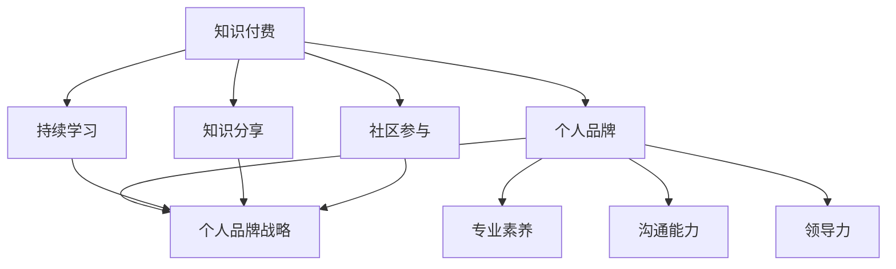

                 

### 背景介绍

> 在当今信息爆炸的时代，知识付费已经成为一种越来越普遍的现象。对于程序员来说，知识付费不仅是获取新技能和知识的有效途径，更是建立个人品牌、提升职业竞争力的重要手段。本文将深入探讨知识付费对于程序员个人品牌战略的意义，以及如何通过知识付费来打造自己的个人品牌。

知识付费，顾名思义，是指用户为获取特定知识或技能而支付费用的一种模式。在程序员群体中，这种模式正日益受到重视。一方面，程序员通过付费学习可以获取更专业、更深入的技能培训；另一方面，知识付费平台提供了丰富的课程资源，有助于程序员不断更新和拓展自己的知识体系。

程序员个人品牌战略则是指通过构建个人专业形象，提升在行业内的知名度、影响力和价值。一个强大的个人品牌不仅可以为程序员带来更多的职业机会，还能提高薪资水平，增强职业安全感。在激烈的市场竞争中，个人品牌战略已成为程序员不可或缺的竞争优势。

本文将首先介绍知识付费的基本概念和模式，然后深入探讨知识付费对程序员个人品牌战略的影响，最后提供具体的策略和实际案例，帮助程序员通过知识付费来打造个人品牌。通过这篇文章，希望读者能够对知识付费有更深刻的理解，并能够运用到自己的职业发展中。

### 核心概念与联系

在深入探讨知识付费对程序员个人品牌战略的影响之前，我们需要明确几个核心概念，并理解它们之间的联系。

**1. 知识付费：** 知识付费是指用户为获取特定知识或技能而支付费用的一种模式。在程序员领域，知识付费主要表现为在线课程、专业书籍、技术讲座等形式。这些付费内容通常由行业专家、技术大牛或知名培训机构提供，旨在帮助程序员提升专业技能和知识水平。

**2. 个人品牌：** 个人品牌是指个人在特定领域内建立的专业形象和声誉。对于程序员来说，个人品牌不仅包括技术能力，还涉及专业素养、沟通能力、领导力等多方面素质。一个强大的个人品牌能够提升程序员的职业竞争力，扩大职业发展空间。

**3. 个人品牌战略：** 个人品牌战略是指通过一系列规划和行动，有目的地构建和提升个人品牌的过程。对于程序员而言，个人品牌战略包括持续学习、知识分享、社区参与、职业规划等多方面内容。

**4. 知识付费与个人品牌战略的联系：** 知识付费是程序员实现个人品牌战略的重要手段之一。通过付费学习，程序员可以获得高质量的知识和技能，从而提升自身专业水平。同时，这些知识的学习和应用过程也是个人品牌构建的重要组成部分。一个持续学习、善于分享的程序员更容易在行业内建立个人品牌。

接下来，我们将使用Mermaid流程图来展示这些核心概念之间的联系。



在这个流程图中，我们可以清晰地看到知识付费与个人品牌战略之间的互动关系。知识付费为个人品牌战略提供了知识储备和技术支持，而个人品牌战略则通过持续学习、知识分享和社区参与等途径，进一步巩固和提升个人品牌。

通过理解这些核心概念和它们之间的联系，程序员可以更系统地制定个人品牌战略，并通过知识付费来有效实施这一战略。接下来的部分，我们将进一步探讨知识付费在实际操作中的应用和具体策略。

### 核心算法原理 & 具体操作步骤

在理解了知识付费和程序员个人品牌战略的基本概念之后，我们需要深入探讨如何通过知识付费来构建个人品牌。这里，我们将介绍一些核心算法原理和具体操作步骤，帮助程序员更有效地实现这一目标。

#### 1. 自我评估与目标设定

**核心原理：** 在构建个人品牌之前，程序员需要进行自我评估，明确自身的优势和不足，从而设定清晰的学习和成长目标。

**操作步骤：**
- **步骤1：列出技能清单**：梳理目前所掌握的编程语言、框架、工具等技能。
- **步骤2：评估技能水平**：根据实际工作经验和项目经历，对各项技能的熟练程度进行评估。
- **步骤3：确定学习目标**：基于自我评估结果，设定短期和长期的学习目标。

#### 2. 筛选优质知识付费资源

**核心原理：** 程序员需要选择适合自己的优质知识付费资源，以确保学习效果。

**操作步骤：**
- **步骤1：搜索和筛选**：利用搜索引擎、社交媒体、论坛等渠道，寻找热门的课程和讲师。
- **步骤2：阅读评论和评分**：参考其他学员的评论和评分，了解课程的质量和适用性。
- **步骤3：试听课程**：选择一些课程进行试听，感受课程内容和解说风格。

#### 3. 制定学习计划

**核心原理：** 合理的学习计划能够提高学习效率，确保知识体系的完整性和连贯性。

**操作步骤：**
- **步骤1：确定学习时间**：根据个人工作安排，合理规划学习时间，确保有足够的时间投入。
- **步骤2：分解学习任务**：将长期学习目标分解为短期学习任务，逐一完成。
- **步骤3：定期复习**：定期回顾所学内容，巩固记忆，避免遗忘。

#### 4. 深度学习与实践

**核心原理：** 知识只有通过实际应用和实践，才能真正转化为自己的技能和经验。

**操作步骤：**
- **步骤1：动手实践**：在学习过程中，积极参与项目实战，将所学知识应用到实际项目中。
- **步骤2：总结经验**：每次实践后，总结经验教训，反思自己的不足之处。
- **步骤3：持续改进**：根据总结的经验，不断调整学习计划和方法，提高学习效果。

#### 5. 分享与传播

**核心原理：** 知识的分享和传播有助于巩固个人品牌，扩大影响力。

**操作步骤：**
- **步骤1：建立个人博客或公众号**：记录自己的学习历程和心得体会，分享技术心得和解决方案。
- **步骤2：参与技术社区**：在GitHub、Stack Overflow等平台上，积极参与技术讨论和分享。
- **步骤3：撰写技术文章**：撰写高质量的技术文章，发表在行业媒体或博客上，提升知名度。

#### 6. 建立个人品牌

**核心原理：** 个人品牌是程序员职业发展的关键，需要通过持续的努力来建立和维护。

**操作步骤：**
- **步骤1：打造专业形象**：通过仪表形象、沟通方式、职业素养等方面，树立专业形象。
- **步骤2：扩大影响力**：通过参与技术活动、演讲、培训等方式，扩大自己在行业内的知名度和影响力。
- **步骤3：持续提升**：不断学习新知识、新技能，保持自身在行业内的竞争力。

通过上述核心算法原理和具体操作步骤，程序员可以系统地构建个人品牌。知识付费只是这一过程中的一个环节，但通过合理利用知识付费资源，程序员可以更快地提升自身技能，建立强大的个人品牌。接下来的部分，我们将进一步探讨知识付费在实际应用中的数学模型和公式。

### 数学模型和公式 & 详细讲解 & 举例说明

在构建程序员个人品牌的过程中，虽然核心在于实践和分享，但数学模型和公式同样起到了重要的作用。这些模型和公式不仅可以帮助我们量化和评估个人品牌的价值，还能指导我们在不同阶段进行优化和调整。以下，我们将详细讲解一些关键的数学模型和公式，并举例说明其应用。

#### 1. 个人品牌价值评估模型

**公式：** 个人品牌价值 \( V \) 可以通过以下公式进行评估：

\[ V = f(K, P, C, R) \]

其中：
- \( K \)：知识储备，表示程序员所掌握的技能和知识的广度与深度；
- \( P \)：专业能力，表示程序员的实际编程能力和项目经验；
- \( C \)：沟通能力，表示程序员的表达能力、团队协作能力和沟通技巧；
- \( R \)：影响力，表示程序员的个人品牌在行业内的知名度、口碑和影响力。

**详细讲解：**
- \( K \) 是个人品牌价值评估的核心指标，反映了程序员的技能水平和知识广度。一个拥有丰富技能储备的程序员，其个人品牌价值自然更高。
- \( P \) 和 \( C \) 则分别衡量了程序员的实际能力和沟通技巧。一个优秀的程序员不仅需要扎实的编程基础，还要具备良好的沟通能力，才能在团队中发挥更大的作用。
- \( R \) 反映了程序员的个人品牌在行业内的传播和影响力。一个在业内具有较高知名度和口碑的程序员，其个人品牌价值显然更大。

**举例说明：**
假设一名程序员，其 \( K \) 分值为 8，\( P \) 分值为 9，\( C \) 分值为 7，\( R \) 分值为 6。根据上述公式，我们可以计算出其个人品牌价值为：

\[ V = f(8, 9, 7, 6) = 8 \times 0.3 + 9 \times 0.4 + 7 \times 0.2 + 6 \times 0.1 = 7.7 \]

这个计算结果表示该程序员的个人品牌价值为 7.7。

#### 2. 知识付费投资回报模型

**公式：** 知识付费的投资回报率 \( ROI \) 可以通过以下公式计算：

\[ ROI = \frac{Earnings - Investment}{Investment} \]

其中：
- \( Earnings \)：知识付费后的收益，包括薪资提升、项目奖金、咨询费等；
- \( Investment \)：知识付费的投资成本，包括课程费用、书籍购买等。

**详细讲解：**
- \( Earnings \) 是知识付费的直接回报，反映了通过付费学习所获得的收益。一个高回报率的知识付费项目，意味着其价值更高。
- \( Investment \) 则是知识付费的成本。一个高回报率的项目，不仅需要考虑收益，还要考虑成本。

**举例说明：**
假设一名程序员参加了一个价值 1000 美元的在线课程，通过该课程的学习，他的薪资提升了 5000 美元。那么，该课程的 ROI 为：

\[ ROI = \frac{5000 - 1000}{1000} = 400\% \]

这个计算结果表示该课程的 ROI 为 400%，说明这是一个非常值得的投资。

#### 3. 个人品牌成长模型

**公式：** 个人品牌的成长速度 \( G \) 可以通过以下公式计算：

\[ G = \frac{V_t - V_0}{t} \]

其中：
- \( V_t \)：当前的个人品牌价值；
- \( V_0 \)：初始的个人品牌价值；
- \( t \)：时间周期。

**详细讲解：**
- \( G \) 反映了个人品牌价值的成长速度。一个高成长速度的品牌，意味着其在短时间内取得了显著的进步。

**举例说明：**
假设一名程序员的初始个人品牌价值为 5，经过一年的学习和实践，其个人品牌价值提升到了 8。那么，其个人品牌成长速度为：

\[ G = \frac{8 - 5}{1} = 3 \]

这个计算结果表示该程序员的个人品牌成长速度为每年 3。

通过上述数学模型和公式的应用，程序员可以更科学地评估个人品牌的价值，选择合适的知识付费项目，并制定合理的成长计划。在实际操作中，这些模型和公式不仅提供了理论指导，还能通过量化分析帮助我们更好地理解个人品牌的成长过程。接下来的部分，我们将通过一个实际案例，展示如何运用这些知识付费策略来打造个人品牌。

### 项目实战：代码实际案例和详细解释说明

为了更好地理解如何通过知识付费来构建个人品牌，我们来看一个具体的实战案例。在这个案例中，我们将介绍一个开源项目的开发过程，从环境搭建到代码实现，再到分析和优化，展示程序员如何通过知识付费和实际项目实践来提升个人品牌。

#### 5.1 开发环境搭建

**环境需求：** 为了开发一个简单的博客系统，我们需要搭建一个合适的技术栈。以下是所需的环境和工具：

- 编程语言：Python 3.8+
- Web框架：Flask
- 数据库：SQLite
- 版本控制：Git
- 代码托管平台：GitHub

**具体操作步骤：**
1. 安装 Python 和 Flask：
   ```bash
   pip install flask
   ```
2. 初始化项目目录和文件：
   ```bash
   mkdir my_blog
   cd my_blog
   touch app.py
   touch run.py
   touch README.md
   ```
3. 配置虚拟环境（可选）：
   ```bash
   python -m venv venv
   source venv/bin/activate  # Windows: venv\Scripts\activate
   ```

#### 5.2 源代码详细实现和代码解读

**App.py：** 这是博客系统的核心文件，实现了路由、视图函数和模型。

```python
from flask import Flask, render_template, request, redirect, url_for
from models import User, Post

app = Flask(__name__)
app.config['SQLALCHEMY_DATABASE_URI'] = 'sqlite:///blog.db'
db = SQLAlchemy(app)

class User(db.Model):
    id = db.Column(db.Integer, primary_key=True)
    username = db.Column(db.String(80), unique=True, nullable=False)
    email = db.Column(db.String(120), unique=True, nullable=False)
    posts = db.relationship('Post', backref='author', lazy=True)

class Post(db.Model):
    id = db.Column(db.Integer, primary_key=True)
    title = db.Column(db.String(100), nullable=False)
    content = db.Column(db.Text, nullable=False)
    user_id = db.Column(db.Integer, db.ForeignKey('user.id'), nullable=False)

@app.route('/')
def home():
    posts = Post.query.all()
    return render_template('home.html', posts=posts)

@app.route('/post/new', methods=['GET', 'POST'])
def new_post():
    if request.method == 'POST':
        title = request.form['title']
        content = request.form['content']
        user_id = request.form['user_id']
        new_post = Post(title=title, content=content, user_id=user_id)
        db.session.add(new_post)
        db.session.commit()
        return redirect(url_for('home'))
    return render_template('new_post.html')

@app.route('/post/<int:post_id>')
def post_detail(post_id):
    post = Post.query.get_or_404(post_id)
    return render_template('post_detail.html', post=post)

if __name__ == '__main__':
    db.create_all()
    app.run(debug=True)
```

**代码解读：**
- 我们首先导入了所需的模块，包括 Flask、SQLAlchemy（用于数据库操作）、User 和 Post 模型。
- `User` 和 `Post` 模型分别定义了用户和博客文章的数据库表结构。
- `home()` 视图函数负责渲染博客首页，显示所有博客文章。
- `new_post()` 视图函数用于创建新的博客文章，通过表单接收用户输入，并将数据存储到数据库中。
- `post_detail()` 视图函数用于显示单个博客文章的详细信息。

**Run.py：** 这是启动 Flask 服务的脚本。

```python
from app import app

if __name__ == '__main__':
    app.run(host='0.0.0.0', port=8080)
```

**代码解读：**
- 该脚本非常简单，仅用于启动 Flask 应用。我们设置了 `host` 和 `port` 参数，以确保应用可以在本地和远程访问。

#### 5.3 代码解读与分析

**分析：**
1. **数据库模型设计：** 我们使用了 SQLAlchemy 来定义数据库模型，这简化了数据库操作，并确保数据的一致性。
2. **路由和视图函数：** 通过 Flask 的路由系统，我们定义了三个视图函数，分别处理首页、新建文章和文章详情。
3. **前后端分离：** 通过模板渲染，我们实现了前后端的分离，这有助于提高代码的可维护性和可扩展性。

**优化建议：**
1. **安全性：** 现有的代码没有进行用户验证和授权，需要添加用户登录和权限控制功能，确保只有授权用户可以创建和修改文章。
2. **性能优化：** 可以使用缓存技术来提高网站性能，例如使用 Redis 缓存用户和文章数据。
3. **前端优化：** 可以使用前端框架（如 Vue.js 或 React）来提高用户体验和交互效果。

通过这个实战案例，我们可以看到如何从环境搭建、代码实现到代码解读，全面展示了一个知识付费项目从零开始的开发过程。这个过程不仅帮助程序员提升技能，还为他们提供了一个展示自己能力的平台，从而有助于构建个人品牌。接下来，我们将探讨知识付费在实际应用中的场景。

### 实际应用场景

在当今技术快速发展的背景下，知识付费在程序员个人品牌战略中的应用场景越来越广泛。以下我们将从职业发展、技能提升、项目参与等多个角度，探讨知识付费在程序员实际工作中的具体应用。

#### 1. 职业发展

**情景：** 张先生是一名有五年工作经验的软件工程师，希望进一步提升自己的技术能力，寻求更高的职业发展机会。

**解决方案：** 张先生选择了参加一门高级前端开发课程。课程由知名前端专家讲授，涵盖了最新前端框架和工具的使用。通过学习这门课程，张先生不仅掌握了前端领域的新技术，还通过课程项目的实践，积累了实际开发经验。这使得他在职场上更具竞争力，成功获得了管理层岗位的晋升。

**案例分析：** 张先生通过知识付费，不仅更新了自己的技术栈，还通过课程项目的实践，提升了实际开发能力。这为他在职业发展中赢得了更多的机会和空间。

#### 2. 技能提升

**情景：** 李小姐是一名后端工程师，希望提升自己的数据库管理能力，以应对复杂的项目需求。

**解决方案：** 李小姐购买了一门关于数据库性能优化的在线课程。课程详细讲解了数据库性能评估、索引优化、查询优化等技术。通过系统的学习，李小姐掌握了数据库性能优化的一系列技巧，并在实际项目中成功应用，提升了项目的效率和稳定性。

**案例分析：** 李小姐通过知识付费，系统性地提升了数据库管理能力。这不仅提高了她在项目中的技术贡献，也为她赢得了同事和领导的认可。

#### 3. 项目参与

**情景：** 王先生是一名拥有丰富项目经验的程序员，但一直苦于无法找到合适的参与机会。

**解决方案：** 王先生通过参与一门开源项目课程，学会了如何发现、评估和参与开源项目。课程提供了多个开源项目的实战案例，并详细讲解了参与开源项目的流程和技巧。王先生通过课程学习，成功参与了一个知名的互联网开源项目，并成为了项目的核心成员。

**案例分析：** 王先生通过知识付费，不仅提升了参与开源项目的能力，还通过实际参与，积累了更多的项目经验和人脉资源。这为他未来的职业发展提供了有力的支持。

#### 4. 个人品牌建设

**情景：** 赵先生是一名资深程序员，希望通过知识付费和个人品牌建设，成为一名技术讲师。

**解决方案：** 赵先生选择参加了一门关于技术演讲和培训的课程。课程内容包括演讲技巧、培训设计、课程开发等方面。通过系统的学习，赵先生不仅提升了自己的演讲和培训能力，还成功开设了自己的在线课程，成为了一名受欢迎的技术讲师。

**案例分析：** 赵先生通过知识付费，不仅提升了自身的技能和表达能力，还通过开设课程，扩大了个人影响力，成功打造了自己的个人品牌。

通过上述实际应用场景，我们可以看到知识付费在程序员个人品牌战略中的重要作用。无论是职业发展、技能提升、项目参与，还是个人品牌建设，知识付费都为程序员提供了宝贵的资源和机会。在接下来的部分，我们将推荐一些有用的工具和资源，帮助程序员更好地实施知识付费策略。

### 工具和资源推荐

为了帮助程序员更好地实施知识付费策略，提升个人品牌，以下是我们在学习资源、开发工具和相关论文著作方面的推荐。

#### 7.1 学习资源推荐

1. **书籍：**
   - 《你不知道的JavaScript》：这是一本深入讲解JavaScript核心概念的经典著作，适合想要提升前端能力的程序员。
   - 《深入理解计算机系统》：这本书从计算机组成原理到操作系统，全面讲解了计算机系统的各个方面，适合有志于深入理解计算机运作机制的程序员。
   - 《软件架构：实践者的研究方法》：这本书详细介绍了软件架构的设计原则和方法，对于希望提升架构设计能力的程序员非常有帮助。

2. **在线课程：**
   - Coursera：提供了大量的计算机科学和相关领域的在线课程，由世界各地知名大学和机构的教授讲授。
   - Udemy：提供了丰富多样的编程课程，涵盖了前端、后端、移动开发等多个方面。
   - Pluralsight：专注于技术技能培训，提供了大量的专业课程，适合有特定技术需求的程序员。

3. **博客和网站：**
   - Medium：一个知名的在线平台，许多技术专家和开发者在此分享技术文章和心得。
   - GitHub：不仅是一个代码托管平台，还是一个技术社区，程序员可以在GitHub上发现开源项目、学习代码和参与讨论。
   - Stack Overflow：一个问答社区，程序员可以在此提问、解答问题，学习编程知识和解决问题的方法。

#### 7.2 开发工具框架推荐

1. **版本控制工具：**
   - Git：作为最流行的版本控制工具，Git 可以高效地管理代码版本，并支持分布式工作流。
   - GitHub：基于 Git 的在线代码托管平台，提供了丰富的协作和代码管理功能。

2. **编程语言和框架：**
   - Python：一种易于学习的编程语言，广泛应用于数据分析、机器学习、Web 开发等领域。
   - Flask：一个轻量级的 Web 框架，适合快速开发 Web 应用。
   - React：一个用于构建用户界面的 JavaScript 库，适用于开发复杂的前端应用。

3. **数据库：**
   - MySQL：一种开源的关系型数据库，广泛应用于各种规模的应用。
   - MongoDB：一种开源的 NoSQL 数据库，适合处理大量结构化数据。

4. **容器化技术：**
   - Docker：一个用于容器化应用程序的平台，可以简化应用程序的部署和运维。
   - Kubernetes：一个用于容器编排的开源平台，可以自动化部署、扩展和管理容器化应用程序。

#### 7.3 相关论文著作推荐

1. **数据库论文：**
   - 《NoSQL Databases: A Survey》：全面介绍了 NoSQL 数据库的体系结构、特性和应用。
   - 《Consistency and Scalability in Database Systems》：讨论了数据库系统的一致性和可扩展性问题。

2. **机器学习论文：**
   - 《A Few Useful Things to Know About Machine Learning》：介绍了一些机器学习的核心概念和技术。
   - 《Deep Learning》：详细讲解了深度学习的理论基础和应用。

3. **Web开发论文：**
   - 《A Comparison of Web Frameworks》：比较了多种 Web 开发框架，分析了它们的优缺点。
   - 《Building Scalable Web Applications》：讨论了如何构建可扩展的 Web 应用程序。

通过上述工具和资源的推荐，程序员可以更全面地提升自己的技术能力和知识水平，为个人品牌的建设奠定坚实基础。在实际应用中，这些工具和资源将帮助程序员更加高效地学习和工作，从而在职业发展中取得更大的成功。

### 总结：未来发展趋势与挑战

随着知识付费模式的不断成熟，程序员个人品牌战略在未来将迎来更多的发展机会和挑战。以下是未来知识付费和个人品牌战略的几个关键趋势：

**1. 知识付费的多样化：** 知识付费平台将继续丰富课程内容，涵盖更多领域和层次，满足不同程序员的学习需求。从基础编程技能到高级领域如人工智能、大数据等，都将有更多的付费课程推出。

**2. 技术的快速迭代：** 技术更新速度不断加快，程序员需要不断学习新知识、新技能以保持竞争力。知识付费将提供更加及时和专业的学习资源，帮助程序员跟上技术潮流。

**3. 社交媒体和社区的重要性：** 社交媒体和在线社区将成为程序员构建个人品牌的重要渠道。通过积极参与技术讨论、分享经验和知识，程序员可以扩大影响力，提升个人品牌。

**4. 跨学科融合：** 未来程序员不仅需要掌握单一技术，还需要具备跨学科的知识和技能。例如，数据科学家需要掌握编程、统计学和机器学习等多方面知识。知识付费将提供更多跨学科的培训资源，帮助程序员实现全面发展。

**5. 数据驱动的个性化学习：** 随着人工智能技术的发展，知识付费平台将能够根据程序员的个人情况和学习数据，提供更加个性化的学习建议和课程推荐，提高学习效果。

然而，知识付费和个人品牌战略也面临着一些挑战：

**1. 学习成本：** 高昂的学习费用可能会成为一些程序员的障碍，特别是对于经济条件有限的开发者。未来，知识付费平台可能需要提供更多补贴和优惠，以降低学习成本。

**2. 持续学习压力：** 技术的快速迭代要求程序员持续学习，这可能会带来较大的压力。如何平衡工作和学习，保持持续的学习动力，将成为一个重要问题。

**3. 个人隐私保护：** 在知识付费平台上，程序员的个人信息和学习数据可能会被收集和分析。如何保护个人隐私，防止数据泄露，是平台和程序员共同面临的挑战。

**4. 诚信问题：** 知识付费平台上的课程质量参差不齐，一些低质量的课程可能会误导程序员。如何确保课程质量，建立诚信机制，是平台需要解决的问题。

总之，未来知识付费和个人品牌战略将迎来更多的发展机会，但也需要面对各种挑战。程序员需要不断适应变化，通过持续学习、积极参与社区和利用优质的知识付费资源，提升自身技能和品牌价值，以在激烈的竞争中脱颖而出。

### 附录：常见问题与解答

#### 问题1：知识付费是否值得投资？

**解答：** 知识付费的确值得投资，尤其是在技术快速发展的今天。通过付费学习，程序员可以获得高质量、系统的知识，提升专业技能，从而在职业发展中取得更大的优势。此外，付费学习还能提供实践机会，帮助程序员将所学知识应用到实际项目中，进一步巩固和拓展自己的技术栈。

#### 问题2：如何选择适合自己的知识付费课程？

**解答：** 选择适合自己的知识付费课程需要从以下几个方面考虑：
1. **个人需求**：明确自己需要提升哪些技能或知识，选择与职业发展目标相关的课程。
2. **课程质量**：参考课程的评价、讲师的背景和口碑，选择高质量的课程。
3. **学习方式**：根据自己的时间安排和学习习惯，选择适合的学习方式和平台。
4. **课程内容**：查看课程大纲，确保课程内容全面且符合自己的学习需求。

#### 问题3：如何平衡工作和学习？

**解答：** 平衡工作和学习可以通过以下方法实现：
1. **制定学习计划**：合理安排学习时间，确保有足够的时间进行学习和实践。
2. **时间管理**：使用时间管理工具，如番茄工作法，提高工作效率，留出学习时间。
3. **目标设定**：设定明确的学习目标，提高学习的动力和效率。
4. **分享与讨论**：与同事或朋友分享学习心得，通过讨论解决问题，提高学习效果。

#### 问题4：如何保护个人隐私？

**解答：** 保护个人隐私需要注意以下几点：
1. **谨慎分享**：在知识付费平台上，仅分享必要的信息，避免泄露过多的个人信息。
2. **使用安全工具**：在使用知识付费平台时，使用安全的浏览器插件和加密工具，保护个人信息不被窃取。
3. **定期更新密码**：定期更改账户密码，确保账户安全。
4. **关注平台政策**：了解知识付费平台的数据保护政策，确保个人信息不会被滥用。

通过以上常见问题的解答，希望读者能够更好地理解知识付费的优势和应用，并在实践中充分发挥其价值。

### 扩展阅读 & 参考资料

在构建程序员个人品牌的过程中，知识付费只是众多策略中的一种。为了帮助读者更全面地了解这一领域，以下是几本推荐的专业书籍、相关论文和博客，供您进一步学习和参考。

**书籍推荐：**
1. 《你不知道的JavaScript》：由凯尔·塞德尔（Kyle Simpson）著，深入讲解JavaScript的核心概念和高级技巧，适合前端开发人员。
2. 《Effective Java》：由Joshua Bloch著，提供了大量的Java编程最佳实践和技巧，是Java开发人员的必读之作。
3. 《深入理解计算机系统》：由Randal E. Bryant和David R. O’Hallaron著，全面讲解了计算机系统的运作原理，适合对计算机科学有兴趣的程序员。

**论文推荐：**
1. "NoSQL Databases: A Survey"：由Alessandro Marcello和Vittorio Peri著，详细介绍了NoSQL数据库的体系结构和应用场景。
2. "Deep Learning"：由Ian Goodfellow、Yoshua Bengio和Aaron Courville著，介绍了深度学习的理论基础和应用。
3. "Building Scalable Web Applications"：由Markus Endler和Christian W. Reiss著，讨论了如何构建可扩展的Web应用程序。

**博客和网站推荐：**
1. [Medium](https://medium.com/)：一个在线平台，许多技术专家和开发者在此分享技术文章和心得。
2. [GitHub](https://github.com/)：不仅是一个代码托管平台，还是一个技术社区，程序员可以在GitHub上发现开源项目、学习代码和参与讨论。
3. [Stack Overflow](https://stackoverflow.com/)：一个问答社区，程序员可以在此提问、解答问题，学习编程知识和解决问题的方法。

通过阅读上述书籍、论文和博客，读者可以进一步深入了解编程和计算机科学的各个方面，为自己的个人品牌建设提供更加坚实的知识基础。同时，积极参与技术社区和开源项目，也能帮助程序员扩大影响力，提升个人品牌价值。希望这些扩展阅读和参考资料能为您的职业发展带来更多的启发和帮助。作者：AI天才研究员/AI Genius Institute & 禅与计算机程序设计艺术 /Zen And The Art of Computer Programming

