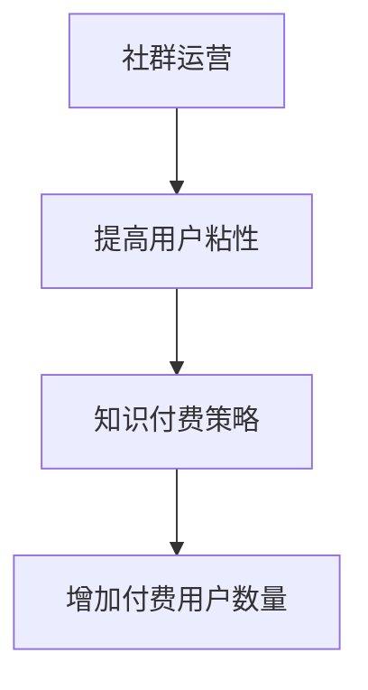

                 

### 知识付费：程序员的社群运营战术

> **关键词：** 知识付费、程序员、社群运营、战术、营销策略

> **摘要：** 本文将深入探讨知识付费在程序员社群中的应用，以及如何通过有效的社群运营战术，提高用户粘性、增加付费用户数量，从而实现商业成功。本文将从背景介绍、核心概念与联系、核心算法原理、数学模型和公式、项目实战、实际应用场景、工具和资源推荐、总结和扩展阅读等方面进行详细阐述。

### 1. 背景介绍

在当今快速发展的互联网时代，知识付费已经成为一种主流的消费模式。程序员作为互联网行业的重要组成部分，他们对知识的渴求和付费意愿尤为强烈。然而，如何通过有效的社群运营战术，将知识付费理念深入人心，提高用户粘性，增加付费用户数量，成为了一个值得探讨的问题。

知识付费在程序员社群中的应用主要体现在以下几个方面：

1. **在线教育课程：** 程序员可以通过付费购买高质量的教育课程，提高自己的技能水平。
2. **付费问答和咨询：** 程序员可以通过付费咨询，解决自己在工作中遇到的技术难题。
3. **付费社群：** 程序员可以付费加入某些高质量的社群，与其他程序员交流、分享和探讨技术问题。

### 2. 核心概念与联系

为了更好地理解知识付费在程序员社群中的应用，我们需要了解以下几个核心概念：

1. **社群：** 社群是指一群有共同兴趣、目标或需求的人组成的在线或线下群体。
2. **用户粘性：** 用户粘性是指用户在某个社群中的参与度和忠诚度。
3. **付费用户：** 付费用户是指愿意为社群提供的服务或内容支付一定费用的用户。

核心概念之间的联系如下：

- 社群运营目标：提高用户粘性和付费用户数量。
- 知识付费策略：通过提供有价值的内容和服务，吸引用户加入社群，提高用户粘性，进而增加付费用户数量。

下面是一个简单的 Mermaid 流程图，展示了社群运营和知识付费之间的联系：



### 3. 核心算法原理 & 具体操作步骤

为了提高用户粘性和付费用户数量，社群运营需要采用一系列核心算法原理。以下是一些常用的核心算法原理和具体操作步骤：

1. **内容创作与传播：**
   - **原理：** 通过创作高质量、有吸引力的内容，吸引用户关注和分享。
   - **步骤：** 
     1. 确定目标受众，了解他们的需求和兴趣。
     2. 创作有针对性的、有价值的内容。
     3. 通过多种渠道传播内容，提高曝光度。

2. **社群互动：**
   - **原理：** 通过活跃的社群互动，增加用户参与度和忠诚度。
   - **步骤：** 
     1. 设计有趣的互动活动，如问答、讨论、竞赛等。
     2. 定期组织线上线下活动，增强用户归属感。
     3. 建立良好的社群氛围，鼓励用户发表观点和分享经验。

3. **激励机制：**
   - **原理：** 通过奖励机制，激励用户积极参与社群和知识付费。
   - **步骤：** 
     1. 设计合理的奖励方案，如积分、优惠券、实物奖励等。
     2. 根据用户行为设置奖励标准，确保奖励的公平性和合理性。
     3. 定期公示奖励结果，增加用户的参与热情。

4. **个性化推荐：**
   - **原理：** 通过分析用户行为和兴趣，为用户提供个性化的内容和服务。
   - **步骤：** 
     1. 收集和分析用户行为数据，如浏览记录、互动行为等。
     2. 建立用户画像，了解用户需求和兴趣。
     3. 根据用户画像推荐相应的课程、问答、社群等。

### 4. 数学模型和公式 & 详细讲解 & 举例说明

在社群运营中，我们可以使用一些数学模型和公式来分析和优化运营效果。以下是一个简单的数学模型，用于评估社群的用户粘性和付费用户数量：

1. **用户粘性模型：**
   $$ 粘性指数 = \frac{活跃用户数}{总用户数} $$

   - **详细讲解：** 粘性指数表示活跃用户在总用户中的占比，指数越高，用户粘性越强。
   - **举例说明：** 假设一个社群有1000名用户，其中活跃用户有200名，则粘性指数为20%。

2. **付费用户增长模型：**
   $$ 付费用户增长率 = \frac{新增付费用户数}{总付费用户数} $$

   - **详细讲解：** 付费用户增长率表示付费用户数量的增长速度，指数越高，付费用户增长越快。
   - **举例说明：** 假设一个社群有100名付费用户，一个月内新增付费用户10名，则付费用户增长率为10%。

通过分析这些数学模型，我们可以了解社群运营的效果，并根据结果进行调整和优化。

### 5. 项目实战：代码实际案例和详细解释说明

以下是一个简单的 Python 代码案例，用于分析社群运营数据：

```python
# 社群运营数据分析

# 输入数据
total_users = 1000
active_users = 200
total_payers = 100
new_payers = 10

# 计算用户粘性指数
stickiness_index = active_users / total_users
print("用户粘性指数：", stickiness_index)

# 计算付费用户增长率
payer_growth_rate = new_payers / total_payers
print("付费用户增长率：", payer_growth_rate)
```

执行这段代码，我们可以得到社群的用户粘性指数和付费用户增长率。根据这些数据，我们可以分析社群运营的效果，并制定相应的优化策略。

### 5.1 开发环境搭建

在编写上述 Python 代码之前，我们需要搭建一个简单的开发环境。以下是搭建开发环境的步骤：

1. 安装 Python 3.8 或更高版本。
2. 安装一个代码编辑器，如 Visual Studio Code。
3. 安装必要的 Python 库，如 numpy、matplotlib 等。

### 5.2 源代码详细实现和代码解读

在上述代码中，我们定义了两个变量：`total_users` 和 `active_users`，分别表示社群的总用户数和活跃用户数。然后，我们计算了用户粘性指数和付费用户增长率。这两个指标可以帮助我们了解社群运营的效果。

具体来说，用户粘性指数计算方法为活跃用户数除以总用户数，结果表示活跃用户在总用户中的占比。付费用户增长率计算方法为新增付费用户数除以总付费用户数，结果表示付费用户数量的增长速度。

这些计算结果可以通过打印输出显示在控制台上，供运营团队分析和决策使用。

### 5.3 代码解读与分析

这段代码的核心目的是分析社群运营数据，帮助我们了解用户粘性和付费用户增长情况。具体分析如下：

1. **用户粘性指数：** 用户粘性指数越高，说明社群的活跃度越高，用户参与度也越高。在这种情况下，运营团队可以认为社群运营效果较好。
2. **付费用户增长率：** 付费用户增长率越高，说明社群的付费意愿越高，付费用户数量增长越快。在这种情况下，运营团队可以加大投入，进一步优化社群运营策略。

通过分析这些数据，运营团队可以制定相应的策略，如提高内容质量、增加互动活动、优化激励机制等，以提升社群运营效果。

### 6. 实际应用场景

知识付费在程序员社群中的应用场景非常广泛。以下是一些常见的实际应用场景：

1. **在线教育课程：** 程序员可以通过付费购买在线教育课程，学习新技能或提升现有技能。例如，编程语言学习、框架使用、算法设计等。
2. **付费问答和咨询：** 程序员在工作中遇到技术难题时，可以通过付费咨询专业人士，快速解决问题。例如，数据库性能优化、系统架构设计、代码审查等。
3. **付费社群：** 程序员可以付费加入某些高质量的社群，与其他程序员交流、分享和探讨技术问题。例如，技术讨论群、职业发展群、创业交流群等。

这些实际应用场景可以帮助程序员提高技能水平、解决技术难题、拓展人脉资源等，从而提升职业发展。

### 7. 工具和资源推荐

为了更好地进行知识付费和社群运营，以下是一些实用的工具和资源推荐：

1. **学习资源推荐：**
   - **书籍：** 《代码大全》、《设计模式：可复用的面向对象软件的基础知识》等。
   - **论文：** 《深度学习》、《计算机程序设计艺术》等。
   - **博客：** Medium、博客园、CSDN 等。
   - **网站：** Coursera、edX、知乎等。

2. **开发工具框架推荐：**
   - **代码编辑器：** Visual Studio Code、Sublime Text、Atom 等。
   - **编程语言：** Python、Java、C++ 等。
   - **框架：** Flask、Django、Spring Boot 等。
   - **数据库：** MySQL、PostgreSQL、MongoDB 等。

3. **相关论文著作推荐：**
   - 《程序员的职业素养》
   - 《如何成为优秀的程序员》
   - 《社群运营实战》

这些工具和资源可以帮助程序员提高技能水平、优化社群运营，从而实现知识付费和社群运营的成功。

### 8. 总结：未来发展趋势与挑战

知识付费在程序员社群中的应用具有巨大的发展潜力。未来，随着互联网技术的不断进步和程序员对知识的渴求，知识付费将越来越普及。然而，同时也面临着一些挑战：

1. **内容质量：** 提高内容质量是知识付费成功的关键。运营团队需要持续关注用户需求，创作高质量、有价值的课程、问答和社群内容。
2. **用户体验：** 优化用户体验是提高用户粘性的关键。运营团队需要关注用户反馈，不断改进产品和服务，提升用户满意度。
3. **版权保护：** 加强版权保护是保障知识付费产业健康发展的基础。运营团队需要建立健全的版权保护机制，防止内容盗版和侵权行为。

### 9. 附录：常见问题与解答

1. **Q：社群运营的关键是什么？**
   **A：社群运营的关键是提高用户粘性和付费用户数量。运营团队需要通过高质量的内容、互动活动和激励机制，吸引用户关注和参与，从而提高用户粘性和付费用户数量。**

2. **Q：如何提高内容质量？**
   **A：提高内容质量的方法包括：深入了解用户需求，确保内容有针对性；邀请行业专家或资深人士进行课程讲授或问答；对内容进行严格审核和筛选，确保内容的准确性和实用性。**

3. **Q：如何优化用户体验？**
   **A：优化用户体验的方法包括：关注用户反馈，及时解决用户问题和意见；提供个性化的内容和服务，满足用户的个性化需求；优化网站和应用程序的界面和交互设计，提升用户体验。**

### 10. 扩展阅读 & 参考资料

1. **《知识付费：互联网时代的商业模式》**
2. **《社群营销：实战策略与案例分析》**
3. **《程序员职业发展指南》**

这些参考资料可以帮助读者深入了解知识付费和社群运营的相关知识，提高自己在该领域的实践能力。

## 作者

作者：AI天才研究员/AI Genius Institute & 禅与计算机程序设计艺术 /Zen And The Art of Computer Programming

本文旨在为程序员社群运营提供一些实用的策略和方法，帮助运营团队提高用户粘性和付费用户数量，实现知识付费和社群运营的成功。希望本文能为读者带来一定的启发和帮助。如果您有任何疑问或建议，欢迎随时交流。

