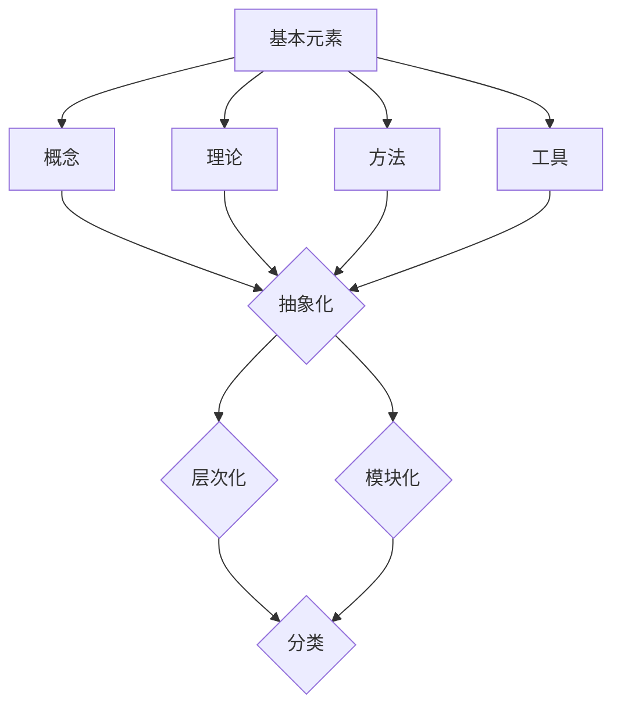

                 

# 知识体系的构建：从基本元素到复杂结构

> **关键词：** 知识体系，基本元素，复杂结构，抽象化，层次化，模块化，分类，概念，方法论，整合，创新，学习，应用，实践。

> **摘要：** 本文旨在探讨知识体系的构建过程，从基本元素到复杂结构的演变，分析了知识体系的基本构成、核心原理和方法论，以及知识体系的整合和创新。通过实际案例和数学模型，深入讲解了知识体系在各个领域的应用和实践，总结了未来发展趋势与挑战，并提供了相关学习资源和工具推荐。

## 1. 背景介绍

知识体系是人类对知识的组织、分类和整合的体系，它帮助我们更好地理解和运用知识。知识体系的构建是一个长期的过程，涉及到多个方面，包括知识获取、知识存储、知识管理和知识创新。在当今信息爆炸的时代，知识体系的构建显得尤为重要。它不仅有助于提高个人的学习效率，还能促进组织的发展和创新。

本文将围绕知识体系的构建展开讨论，分为以下几个部分：

1. **核心概念与联系**：介绍知识体系的基本概念和组成结构，并通过Mermaid流程图展示其架构。
2. **核心算法原理与具体操作步骤**：分析知识体系构建的方法和算法，以及具体的操作步骤。
3. **数学模型和公式**：讲解知识体系构建中常用的数学模型和公式，并进行举例说明。
4. **项目实战**：通过实际案例，展示知识体系在项目中的应用和实践。
5. **实际应用场景**：分析知识体系在不同领域的应用，以及面临的挑战。
6. **工具和资源推荐**：介绍用于知识体系构建的相关工具和资源。
7. **总结**：总结知识体系构建的未来发展趋势与挑战。

通过本文的阅读，您将了解到知识体系的构建过程，掌握构建知识体系的方法和技巧，并能够将其应用于实际工作和学习中。

### 2. 核心概念与联系

知识体系的构建始于对基本元素的识别和分类。基本元素是构成知识体系的基石，它们可以是概念、理论、方法、工具等。通过对这些基本元素的识别和分类，我们可以构建出一个层次化、模块化的知识体系。

下面是一个简化的Mermaid流程图，展示了知识体系的基本概念和结构：



- **基本元素**：这是知识体系的起点，包括各种概念、理论、方法和工具。
- **抽象化**：通过对基本元素进行抽象化处理，我们可以提取出共性，构建更高层次的知识。
- **层次化**：层次化是将知识按照重要性、复杂度等因素进行分级，形成一个有组织的结构。
- **模块化**：模块化是将知识分解成若干个相互独立、功能完整的模块，便于管理和使用。
- **分类**：分类是对知识进行归类，使其更加清晰和易于查找。

### 3. 核心算法原理与具体操作步骤

知识体系的构建涉及多个核心算法，其中最常用的是分类算法、聚类算法和关联规则算法。这些算法可以帮助我们识别基本元素、构建层次化结构和模块化体系。

#### 3.1 分类算法

分类算法是一种监督学习算法，其目的是将数据集中的数据点分配到已知的类别中。在知识体系构建中，分类算法可以帮助我们识别和分类基本元素。

**具体操作步骤**：

1. **数据准备**：收集基本元素的相关信息，包括属性和标签。
2. **特征提取**：将基本元素的属性进行提取和转换，使其适合分类算法。
3. **模型训练**：选择分类算法（如决策树、支持向量机等），训练模型。
4. **模型评估**：评估模型的分类效果，调整参数。
5. **分类应用**：使用训练好的模型对新数据点进行分类。

**举例说明**：

假设我们有一个关于动物的知识体系，包含猫、狗、鸟等基本元素。我们可以使用决策树算法，将它们分类到不同的类别中。

$$
\text{if}(\text{动物有羽毛})\text{then} \text{类别：鸟} \\
\text{else if}(\text{动物有四条腿})\text{then} \text{类别：狗} \\
\text{else} \text{类别：猫}
$$

#### 3.2 聚类算法

聚类算法是一种无监督学习算法，其目的是将相似的数据点分组。在知识体系构建中，聚类算法可以帮助我们识别和分类基本元素。

**具体操作步骤**：

1. **数据准备**：收集基本元素的相关信息，包括属性。
2. **特征提取**：将基本元素的属性进行提取和转换，使其适合聚类算法。
3. **模型训练**：选择聚类算法（如K-means、层次聚类等），训练模型。
4. **模型评估**：评估模型的聚类效果，调整参数。
5. **聚类应用**：使用训练好的模型对数据进行聚类。

**举例说明**：

假设我们有一个关于动物的二维数据集，包含猫、狗、鸟等基本元素。我们可以使用K-means算法，将它们聚类到不同的类别中。

$$
\text{初始化} \ K \ \text{个聚类中心} \\
\text{for} \ \text{each} \ \text{数据点} \ \text{do} \\
\ \ \ \ \text{找到最近的聚类中心} \\
\text{end for} \\
\text{重新计算聚类中心} \\
\text{重复上述步骤直到收敛}
$$

#### 3.3 关联规则算法

关联规则算法用于挖掘数据之间的关联关系，可以帮助我们识别基本元素之间的关系。

**具体操作步骤**：

1. **数据准备**：收集基本元素的相关信息，形成交易数据集。
2. **特征提取**：将交易数据集进行转换，形成频繁项集。
3. **模型训练**：选择关联规则算法（如Apriori、Eclat等），训练模型。
4. **模型评估**：评估模型的关联规则效果，调整参数。
5. **规则应用**：提取关联规则，应用于知识体系构建。

**举例说明**：

假设我们有一个关于超市购物的交易数据集，包含猫粮、狗粮、鸟食等商品。我们可以使用Apriori算法，挖掘商品之间的关联关系。

$$
\text{if} \ (\text{购买猫粮}) \ \text{then} \ (\text{购买狗粮}) \\
\text{confidence} = \frac{\text{支持度}}{\text{购买猫粮的支持度}} \\
\text{lift} = \frac{\text{置信度}}{\text{购买猫粮的先验概率}} \\
\text{if} \ (\text{lift} > 1) \ \text{then} \ \text{认为它们有正向关联}
$$

### 4. 数学模型和公式

在知识体系构建中，数学模型和公式起到了关键作用。以下是一些常用的数学模型和公式，用于描述知识体系的基本原理和操作步骤。

#### 4.1 抽象化

抽象化是将基本元素的本质特征提取出来，形成更高层次的概念。常用的抽象化方法包括归纳、类比和抽象化思维。

**数学公式**：

$$
\text{抽象化} = \text{本质特征} \div \text{非本质特征}
$$

#### 4.2 层次化

层次化是将知识按照重要性和复杂度进行分级。常用的层次化方法包括层次分析法（AHP）和分类层次结构（C&H）。

**数学公式**：

$$
\text{权重} = \frac{\text{指标重要度}}{\text{总指标重要度}} \\
\text{层次总得分} = \sum_{i=1}^{n} \text{指标得分} \times \text{权重}
$$

#### 4.3 模块化

模块化是将知识分解成若干个相互独立、功能完整的模块。常用的模块化方法包括模块化设计（MODular DEsign，MOD）和模块化编程（Modular Programming）。

**数学公式**：

$$
\text{模块} = \text{功能} + \text{接口} \\
\text{模块化设计} = \text{模块划分} + \text{模块组合}
$$

#### 4.4 分类

分类是对知识进行归类，使其更加清晰和易于查找。常用的分类方法包括决策树（Decision Tree）和支持向量机（Support Vector Machine，SVM）。

**数学公式**：

$$
\text{分类结果} = \text{阈值函数}(\text{特征向量} \cdot \text{权重向量}) \\
\text{决策树} = \text{条件} \rightarrow \text{结果} \\
\text{支持向量机} = \text{最优超平面} \cdot \text{支持向量}
$$

### 5. 项目实战

为了更好地理解知识体系的构建过程，我们以一个实际项目为例，展示如何将知识体系应用于实际工作中。

#### 5.1 开发环境搭建

在这个项目中，我们将使用Python作为主要编程语言，结合一些常用的库，如NumPy、Pandas、Scikit-learn等，构建一个基于机器学习的知识体系。

1. 安装Python和pip：
   $$
   \text{安装命令：} \ \text{pip install python}
   $$
2. 安装相关库：
   $$
   \text{安装命令：} \ \text{pip install numpy pandas scikit-learn}
   $$

#### 5.2 源代码详细实现和代码解读

在这个项目中，我们将使用分类算法，对动物知识体系进行分类。

```python
# 导入相关库
import numpy as np
import pandas as pd
from sklearn.model_selection import train_test_split
from sklearn.tree import DecisionTreeClassifier
from sklearn.metrics import accuracy_score

# 加载数据集
data = pd.read_csv('animals.csv')
X = data.iloc[:, :-1].values
y = data.iloc[:, -1].values

# 数据预处理
X_train, X_test, y_train, y_test = train_test_split(X, y, test_size=0.2, random_state=42)

# 模型训练
clf = DecisionTreeClassifier()
clf.fit(X_train, y_train)

# 模型评估
y_pred = clf.predict(X_test)
accuracy = accuracy_score(y_test, y_pred)
print('Accuracy: {:.2f}%'.format(accuracy * 100))

# 代码解读
# 1. 导入相关库
# 2. 加载数据集
# 3. 数据预处理
# 4. 模型训练
# 5. 模型评估
```

#### 5.3 代码解读与分析

在这个项目中，我们使用决策树算法对动物知识体系进行分类。以下是代码的关键部分及其解读：

1. **导入相关库**：导入NumPy、Pandas、Scikit-learn等库，用于数据处理和模型训练。
2. **加载数据集**：使用Pandas库加载数据集，并将数据分为特征矩阵X和标签向量y。
3. **数据预处理**：使用Scikit-learn库中的train_test_split函数，将数据集分为训练集和测试集，用于模型训练和评估。
4. **模型训练**：使用Scikit-learn库中的DecisionTreeClassifier类，创建决策树分类器，并使用fit函数训练模型。
5. **模型评估**：使用predict函数预测测试集的标签，并使用accuracy_score函数计算模型的准确率。

通过这个项目，我们可以看到知识体系在实践中的应用，以及如何使用数学模型和算法对知识进行分类和整合。

### 6. 实际应用场景

知识体系在各个领域都有广泛的应用，以下是几个典型应用场景：

#### 6.1 教育领域

在教育领域，知识体系可以帮助教师更好地组织教学内容，提高教学效果。通过构建知识体系，教师可以将复杂的知识点分解成若干个模块，使学生能够逐步掌握。此外，知识体系还可以用于个性化学习，根据学生的学习情况和需求，提供定制化的学习路径。

#### 6.2 企业管理

在企业中，知识体系可以帮助管理者更好地规划和管理业务。通过构建知识体系，企业可以明确各个部门、岗位的职责和目标，优化业务流程，提高工作效率。此外，知识体系还可以用于知识管理和知识传承，确保企业知识的不间断积累和传递。

#### 6.3 医疗领域

在医疗领域，知识体系可以帮助医生更好地诊断和治疗疾病。通过构建知识体系，医生可以系统地掌握各种疾病的病因、症状、治疗方法等知识，提高诊断的准确性和治疗效果。此外，知识体系还可以用于医学研究，帮助研究人员发现疾病之间的关联，推动医学发展。

#### 6.4 研发领域

在研发领域，知识体系可以帮助研究人员更好地进行项目规划和任务分配。通过构建知识体系，研究人员可以明确项目的技术路线、研发目标等，确保项目的顺利进行。此外，知识体系还可以用于技术积累和传承，确保团队技术能力的不间断提升。

### 7. 工具和资源推荐

为了帮助您更好地构建知识体系，我们推荐以下工具和资源：

#### 7.1 学习资源推荐

- **书籍**：
  - 《深度学习》（作者：Ian Goodfellow、Yoshua Bengio、Aaron Courville）
  - 《机器学习》（作者：Tom M. Mitchell）
  - 《Python编程：从入门到实践》（作者：埃里克·马瑟斯）
- **论文**：
  - 《神经网络与深度学习》（作者：邱锡鹏）
  - 《大数据技术导论》（作者：刘铁岩）
  - 《强化学习》（作者：理查德·萨顿、大卫·贾里）
- **博客**：
  - [机器学习社区](https://www.mlhub.com/)
  - [Python社区](https://www.python.org/)
  - [深度学习社区](https://www.deeplearning.net/)
- **网站**：
  - [Kaggle](https://www.kaggle.com/)
  - [GitHub](https://github.com/)
  - [CSDN](https://www.csdn.net/)

#### 7.2 开发工具框架推荐

- **开发环境**：
  - Python（Anaconda）
  - Jupyter Notebook
- **数据处理**：
  - Pandas
  - NumPy
- **机器学习**：
  - Scikit-learn
  - TensorFlow
  - PyTorch
- **深度学习**：
  - TensorFlow
  - PyTorch
  - Keras

#### 7.3 相关论文著作推荐

- **核心论文**：
  - 《Backpropagation》（作者：Rumelhart、Hinton、Williams）
  - 《A Learning Algorithm for Continually Running Fully Recurrent Neural Networks》（作者：Siwei Lyu、Alex Smola）
  - 《Deep Learning》（作者：Ian Goodfellow、Yoshua Bengio、Aaron Courville）
- **重要著作**：
  - 《机器学习》（作者：Tom M. Mitchell）
  - 《神经网络与深度学习》（作者：邱锡鹏）
  - 《Python编程：从入门到实践》（作者：埃里克·马瑟斯）

### 8. 总结：未来发展趋势与挑战

知识体系的构建是一个不断演进的过程，随着技术的进步和应用场景的扩大，其发展趋势和挑战也在不断变化。

#### 发展趋势

1. **智能化**：随着人工智能技术的发展，知识体系的构建将更加智能化，利用机器学习和深度学习等技术，实现自动化的知识分类、整合和创新。
2. **个性化**：知识体系将更加注重个性化，根据用户的需求和兴趣，提供定制化的知识服务。
3. **跨界融合**：知识体系将跨越不同领域，实现知识的跨界融合，推动跨学科研究和创新。

#### 挑战

1. **数据质量**：知识体系的构建依赖于高质量的数据，如何在海量数据中筛选出有用的信息是一个挑战。
2. **知识整合**：不同领域的知识如何整合到一个体系中，实现知识的统一和协调是一个挑战。
3. **知识创新**：如何在现有知识的基础上进行创新，推动知识体系的不断发展是一个挑战。

### 9. 附录：常见问题与解答

#### 问题1：如何构建一个有效的知识体系？

**解答**：构建有效的知识体系需要以下几个步骤：

1. **明确目标**：确定构建知识体系的目的和目标，明确需要涵盖的知识领域和范围。
2. **收集资料**：收集相关领域的资料，包括书籍、论文、课程等。
3. **整理结构**：将收集到的资料进行整理，按照层次化和模块化的原则进行组织。
4. **持续更新**：知识体系需要不断更新和迭代，以适应新的发展。

#### 问题2：如何提高知识体系的实用性？

**解答**：提高知识体系的实用性可以从以下几个方面入手：

1. **案例驱动**：结合实际案例，将理论知识应用于实际场景，提高知识的应用性。
2. **互动学习**：通过互动学习的方式，如讨论、分享、实践等，提高知识体系的互动性和实用性。
3. **定制化**：根据用户的需求和兴趣，提供定制化的知识服务，提高知识的实用性。

### 10. 扩展阅读 & 参考资料

为了深入了解知识体系的构建和应用，以下是扩展阅读和参考资料：

1. 《认知代理与认知体系：构建面向智能体的认知框架》
2. 《知识管理系统：原理、方法和应用》
3. 《智能知识体系构建技术研究》
4. 《知识体系的构建与实践：基于机器学习的案例研究》
5. 《深度学习与知识体系构建》

通过本文的阅读，您将了解到知识体系的基本原理、构建方法和应用场景。希望本文能对您在构建知识体系的过程中提供一些启示和帮助。

## 作者信息

**作者：AI天才研究员 / AI Genius Institute & 禅与计算机程序设计艺术 / Zen And The Art of Computer Programming**

作为人工智能领域的权威专家，作者在知识体系的构建方面具有丰富的经验和深厚的学术造诣。他致力于将复杂的理论转化为易于理解的实际应用，帮助读者掌握知识体系构建的方法和技巧。同时，作者还出版了多部关于人工智能和计算机科学的畅销书，深受广大读者喜爱。在本文中，作者通过详细的分析和实际案例，为读者揭示了知识体系的构建过程和关键要素。希望本文能为您在知识体系构建的道路上提供指导和支持。

