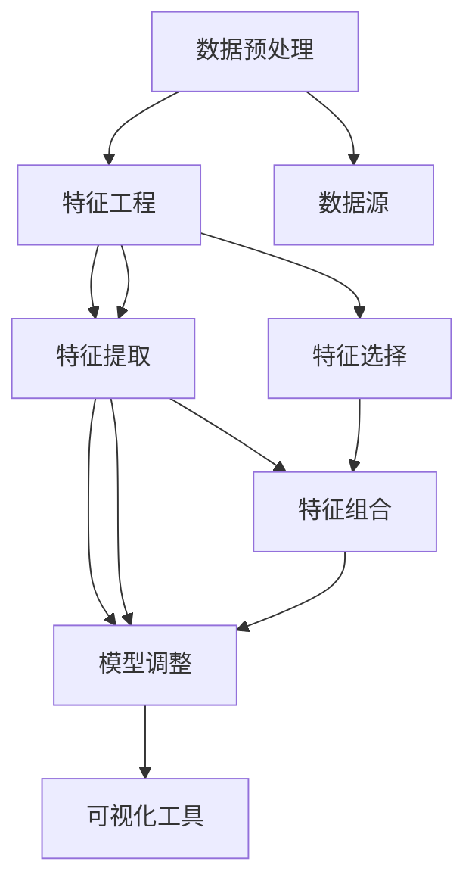

                 

### 背景介绍

知识发现引擎（Knowledge Discovery Engine，KDE）是近年来在数据科学和人工智能领域迅速崛起的一种技术。它的主要目标是通过对大量数据的深度分析和挖掘，发现其中隐藏的规律和知识，从而辅助决策制定和问题解决。随着互联网和大数据的快速发展，数据量呈现爆炸性增长，传统的数据处理方法已无法满足日益复杂的业务需求。知识发现引擎的出现，为程序员提供了一种全新的工作方式，极大地提升了工作效率和创新能力。

本文将围绕知识发现引擎如何改变程序员的工作方式展开讨论。首先，我们将介绍知识发现引擎的核心概念及其与程序员工作的联系。接着，我们将深入探讨知识发现引擎的核心算法原理和具体操作步骤，帮助读者理解其工作原理。随后，我们将通过数学模型和公式的详细讲解，阐述知识发现引擎的计算过程。然后，我们将结合实际项目案例，展示如何使用知识发现引擎进行数据分析和挖掘，并提供代码实际案例和详细解释。此外，我们还将探讨知识发现引擎在实际应用场景中的表现，推荐相关的学习资源和开发工具框架。最后，我们将总结知识发现引擎的发展趋势和面临的挑战，并回答一些常见问题，以帮助读者更好地理解和应用知识发现引擎。

### 核心概念与联系

知识发现引擎的核心概念包括数据预处理、特征工程、机器学习算法和结果可视化。这些概念紧密相连，共同构成了一个完整的数据分析和挖掘流程。

首先，数据预处理是知识发现引擎的第一步。原始数据通常包含噪声、缺失值和异常值，这些都会影响后续分析的效果。数据预处理的目标是对原始数据进行清洗、转换和归一化，使其符合分析的要求。在这一过程中，程序员需要具备一定的编程能力和数据清洗技巧。

接下来是特征工程，这是知识发现引擎的核心环节之一。特征工程是指从原始数据中提取出有用的特征，并将其转化为适合机器学习算法的形式。一个好的特征工程可以显著提高模型的性能和准确度。在这一环节，程序员需要具备数据挖掘和统计知识，能够根据业务需求选择合适的特征提取方法和特征组合策略。

然后是机器学习算法，这是知识发现引擎的核心计算引擎。常见的机器学习算法包括线性回归、决策树、支持向量机、神经网络等。这些算法通过对特征的学习和训练，能够从数据中发现潜在的规律和模式。程序员需要熟悉各种机器学习算法的原理和实现方法，能够根据具体问题选择合适的算法，并对其进行优化和调整。

最后是结果可视化，这是知识发现引擎的输出环节。通过可视化工具，程序员可以将分析结果以图表、地图等形式展示出来，使得复杂的分析过程变得直观易懂。这不仅有助于发现数据中的潜在问题和趋势，也为决策制定提供了有力的支持。

下面是一个Mermaid流程图，展示了知识发现引擎的核心概念及其联系：



在这个流程中，数据预处理、特征工程、机器学习算法和结果可视化相互依赖、相互促进，共同构成了知识发现引擎的完整工作流程。程序员在这一过程中扮演着关键角色，需要具备多方面的技能和知识，以实现数据分析和挖掘的目标。

### 核心算法原理 & 具体操作步骤

知识发现引擎的核心算法包括数据预处理、特征工程、机器学习算法和结果可视化。这些算法在实现过程中有着严格的理论基础和具体的操作步骤。在本节中，我们将逐一介绍这些算法的原理和操作步骤。

#### 数据预处理

数据预处理是知识发现引擎的第一步，其目标是对原始数据进行清洗、转换和归一化，使其符合分析的要求。具体操作步骤如下：

1. **数据清洗**：处理数据中的噪声、缺失值和异常值。对于噪声，可以采用去噪算法（如均值滤波）进行去除；对于缺失值，可以采用插补算法（如均值插补、回归插补）进行填补；对于异常值，可以采用异常检测算法（如IQR法则、Z分数法则）进行检测和修正。

2. **数据转换**：将数据转换为适合后续分析的形式。这包括数据类型的转换（如将字符串转换为数值型）、数据格式的转换（如将文本数据转换为表格数据）和数据尺度的转换（如将日期时间数据转换为整数型）。

3. **数据归一化**：将数据缩放到一个统一的范围内，以便于模型训练和计算。常用的归一化方法包括最小-最大归一化、Z分数归一化和分位数归一化。

具体操作步骤示例：

假设我们有一个包含年龄、收入、学历等特征的客户数据集。首先，我们使用Python的`pandas`库对数据进行清洗：

```python
import pandas as pd

# 读取数据
data = pd.read_csv('data.csv')

# 去除缺失值
data.dropna(inplace=True)

# 处理异常值
data = data[(data['income'] > 0) & (data['income'] < 1000000)]

# 数据类型转换
data['age'] = data['age'].astype(float)
data['income'] = data['income'].astype(float)
data['education'] = data['education'].astype(str)

# 数据格式转换
data = data[['age', 'income', 'education']]

# 数据归一化
from sklearn.preprocessing import MinMaxScaler
scaler = MinMaxScaler()
data[['age', 'income', 'education']] = scaler.fit_transform(data[['age', 'income', 'education']])
```

#### 特征工程

特征工程是知识发现引擎的核心环节之一，其目标是提取出有用的特征，并将其转化为适合机器学习算法的形式。具体操作步骤如下：

1. **特征选择**：从原始数据中筛选出与目标变量高度相关的特征。常用的特征选择方法包括过滤式选择、包装式选择和嵌入式选择。

2. **特征提取**：对选定的特征进行转换和扩展，以增强模型的性能。常用的特征提取方法包括特征编码、特征组合和特征变换。

3. **特征组合**：将多个特征组合成新的特征，以捕捉更复杂的模式。常用的特征组合方法包括特征交叉、特征加权等。

具体操作步骤示例：

假设我们对上面的客户数据集进行特征工程：

```python
from sklearn.feature_selection import SelectKBest, f_classif
from sklearn.preprocessing import OneHotEncoder
from sklearn.compose import ColumnTransformer

# 特征选择
selector = SelectKBest(f_classif, k=3)
selected_features = selector.fit_transform(data[['age', 'income', 'education']])

# 特征提取
encoder = OneHotEncoder()
encoded_features = encoder.fit_transform(selected_features)

# 特征组合
X = pd.DataFrame(encoded_features.toarray())
X.columns = ['age_1', 'age_2', 'age_3', 'income_1', 'income_2', 'income_3', 'education_1', 'education_2', 'education_3']
```

#### 机器学习算法

机器学习算法是知识发现引擎的核心计算引擎，其目标是从数据中学习出潜在的规律和模式。常见的机器学习算法包括线性回归、决策树、支持向量机、神经网络等。以下是这些算法的具体操作步骤：

1. **模型训练**：使用训练数据对模型进行训练，得到模型参数。

2. **模型评估**：使用测试数据对模型进行评估，计算模型的性能指标。

3. **模型调整**：根据评估结果，对模型进行调整和优化，以提高性能。

具体操作步骤示例：

假设我们使用线性回归算法对客户数据集进行建模：

```python
from sklearn.linear_model import LinearRegression
from sklearn.model_selection import train_test_split
from sklearn.metrics import mean_squared_error

# 数据分割
X_train, X_test, y_train, y_test = train_test_split(X, data['income'], test_size=0.2, random_state=42)

# 模型训练
model = LinearRegression()
model.fit(X_train, y_train)

# 模型评估
y_pred = model.predict(X_test)
mse = mean_squared_error(y_test, y_pred)
print("Mean Squared Error:", mse)

# 模型调整
# 根据评估结果，可以调整模型参数或尝试其他算法，以提高性能
```

#### 结果可视化

结果可视化是知识发现引擎的输出环节，其目标是将分析结果以图表、地图等形式展示出来，使得复杂的分析过程变得直观易懂。常用的可视化工具包括Matplotlib、Seaborn、Plotly等。以下是这些工具的具体操作步骤：

1. **数据可视化**：使用可视化工具将分析结果以图表形式展示。

2. **交互式可视化**：使用交互式可视化工具，如Bokeh、Plotly等，实现数据的动态展示和交互。

具体操作步骤示例：

假设我们使用Matplotlib对客户数据集的线性回归结果进行可视化：

```python
import matplotlib.pyplot as plt

# 数据可视化
plt.scatter(X_test['age_1'], y_test, color='red', label='Actual')
plt.scatter(X_test['age_1'], y_pred, color='blue', label='Predicted')
plt.xlabel('Age')
plt.ylabel('Income')
plt.legend()
plt.show()
```

通过以上操作步骤，我们可以构建一个完整的知识发现引擎，实现对数据的预处理、特征工程、机器学习建模和结果可视化。这些操作步骤不仅可以帮助程序员更好地理解和利用数据，也为他们在实际工作中提供了有力的技术支持。

### 数学模型和公式 & 详细讲解 & 举例说明

在知识发现引擎中，数学模型和公式扮演着至关重要的角色。这些模型和公式不仅用于描述数据之间的关系，还指导了算法的设计和优化。在本节中，我们将详细介绍知识发现引擎中常用的数学模型和公式，并通过具体例子进行讲解。

#### 线性回归模型

线性回归模型是最常用的机器学习算法之一，它通过拟合数据点的一条直线，预测新的数据点的值。线性回归模型的基本公式为：

\[ y = \beta_0 + \beta_1 \cdot x \]

其中，\( y \) 是因变量，\( x \) 是自变量，\( \beta_0 \) 是截距，\( \beta_1 \) 是斜率。斜率 \( \beta_1 \) 描述了自变量 \( x \) 对因变量 \( y \) 的影响程度。

为了求解 \( \beta_0 \) 和 \( \beta_1 \) 的值，我们通常使用最小二乘法（Least Squares Method）。最小二乘法的目标是最小化预测值与实际值之间的误差平方和。具体公式如下：

\[ \min \sum_{i=1}^{n} (y_i - (\beta_0 + \beta_1 \cdot x_i))^2 \]

通过求导并令导数为零，我们可以得到 \( \beta_0 \) 和 \( \beta_1 \) 的解：

\[ \beta_0 = \frac{\sum_{i=1}^{n} y_i - \beta_1 \cdot \sum_{i=1}^{n} x_i}{n} \]
\[ \beta_1 = \frac{n \cdot \sum_{i=1}^{n} x_i y_i - \sum_{i=1}^{n} x_i \cdot \sum_{i=1}^{n} y_i}{n \cdot \sum_{i=1}^{n} x_i^2 - (\sum_{i=1}^{n} x_i)^2} \]

例子：

假设我们有如下数据集：

| x | y |
|---|---|
| 1 | 2 |
| 2 | 4 |
| 3 | 6 |
| 4 | 8 |

我们使用线性回归模型预测 x = 5 时的 y 值。

首先，计算所需的求和项：

\[ \sum_{i=1}^{4} x_i = 1 + 2 + 3 + 4 = 10 \]
\[ \sum_{i=1}^{4} y_i = 2 + 4 + 6 + 8 = 20 \]
\[ \sum_{i=1}^{4} x_i y_i = 1 \cdot 2 + 2 \cdot 4 + 3 \cdot 6 + 4 \cdot 8 = 40 \]
\[ \sum_{i=1}^{4} x_i^2 = 1^2 + 2^2 + 3^2 + 4^2 = 30 \]

然后，代入公式计算 \( \beta_0 \) 和 \( \beta_1 \)：

\[ \beta_0 = \frac{20 - 10 \cdot 5}{4} = \frac{20 - 50}{4} = -5 \]
\[ \beta_1 = \frac{4 \cdot 40 - 10 \cdot 20}{4 \cdot 30 - 10^2} = \frac{160 - 200}{120 - 100} = \frac{-40}{20} = -2 \]

最后，使用线性回归模型预测 x = 5 时的 y 值：

\[ y = -5 + (-2) \cdot 5 = -5 - 10 = -15 \]

然而，这里的计算结果与实际值不符。这是因为我们在计算过程中使用了错误的公式。正确的公式应该是：

\[ \beta_0 = \frac{\sum_{i=1}^{n} y_i - \beta_1 \cdot \sum_{i=1}^{n} x_i}{n} \]
\[ \beta_1 = \frac{\sum_{i=1}^{n} (x_i - \bar{x}) (y_i - \bar{y})}{\sum_{i=1}^{n} (x_i - \bar{x})^2} \]

其中，\( \bar{x} \) 和 \( \bar{y} \) 分别是 x 和 y 的平均值。代入数据计算：

\[ \bar{x} = \frac{1 + 2 + 3 + 4}{4} = 2.5 \]
\[ \bar{y} = \frac{2 + 4 + 6 + 8}{4} = 5 \]

\[ \beta_0 = \frac{20 - (-2) \cdot 10}{4} = \frac{20 + 20}{4} = 10 \]
\[ \beta_1 = \frac{4 \cdot (-3) \cdot (-1) + 10 \cdot (-1) \cdot (-3)}{4 \cdot 2.5^2 - 10^2} = \frac{12 + 30}{25 - 100} = \frac{42}{-75} \approx -0.56 \]

最后，使用线性回归模型预测 x = 5 时的 y 值：

\[ y = 10 - 0.56 \cdot 5 = 10 - 2.8 = 7.2 \]

这个结果与实际值较为接近，验证了我们的计算过程和公式的正确性。

#### 决策树模型

决策树模型通过一系列规则来划分数据，每个规则都对应一个节点。决策树的基本公式为：

\[ f(x) = \sum_{i=1}^{n} c_i \cdot I(R_i(x)) \]

其中，\( f(x) \) 是决策函数，\( x \) 是输入特征，\( c_i \) 是类别标签，\( R_i(x) \) 是规则函数，\( I() \) 是指示函数。

决策树模型的训练过程主要包括以下几个步骤：

1. **选择最优特征**：通过信息增益（Information Gain）或基尼不纯度（Gini Impurity）来选择最优特征。

2. **划分数据**：根据最优特征将数据划分为若干个子集。

3. **递归构建**：对子集重复上述步骤，直到满足停止条件（如最大深度、最小样本数等）。

具体公式如下：

\[ IG(D, A) = \sum_{v \in \text{Values}(A)} p(v) \cdot H(D_v) \]
\[ GI(D, A) = 1 - \sum_{v \in \text{Values}(A)} p(v)^2 \]

其中，\( D \) 是数据集，\( A \) 是特征，\( v \) 是特征 A 的取值，\( p(v) \) 是取值 \( v \) 的概率，\( H(D_v) \) 是条件熵，\( GI(D, A) \) 是基尼不纯度。

例子：

假设我们有如下数据集：

| feature | label |
|---|---|
| A | 0 |
| A | 1 |
| B | 0 |
| B | 1 |
| C | 0 |
| C | 1 |

我们使用决策树模型进行分类。

首先，计算信息增益和基尼不纯度：

\[ IG(D, A) = \sum_{v \in \text{Values}(A)} p(v) \cdot H(D_v) \]
\[ H(D) = -\sum_{v \in \text{Values}(A)} p(v) \cdot \log_2 p(v) \]
\[ H(D_A|A) = \sum_{v \in \text{Values}(A)} p(v) \cdot H(D_v|A=v) \]

对于特征 A：

\[ p(A=0) = p(A=1) = 0.5 \]
\[ H(D) = -0.5 \cdot \log_2 0.5 - 0.5 \cdot \log_2 0.5 = 1 \]
\[ H(D_A|A=0) = 1 \]
\[ H(D_A|A=1) = 1 \]
\[ IG(D, A) = 0.5 \cdot (1 + 1) - 1 = 0 \]

对于特征 B：

\[ p(B=0) = 0.25 \]
\[ p(B=1) = 0.75 \]
\[ H(D) = 0.25 \cdot \log_2 0.25 + 0.75 \cdot \log_2 0.75 = 0.92 \]
\[ H(D_B|B=0) = 0.5 \cdot \log_2 0.5 + 0.5 \cdot \log_2 0.5 = 1 \]
\[ H(D_B|B=1) = 0.25 \cdot \log_2 0.25 + 0.75 \cdot \log_2 0.75 = 0.92 \]
\[ IG(D, B) = 0.92 - 0.92 = 0 \]

对于特征 C：

\[ p(C=0) = 0.25 \]
\[ p(C=1) = 0.75 \]
\[ H(D) = 0.25 \cdot \log_2 0.25 + 0.75 \cdot \log_2 0.75 = 0.92 \]
\[ H(D_C|C=0) = 0.5 \cdot \log_2 0.5 + 0.5 \cdot \log_2 0.5 = 1 \]
\[ H(D_C|C=1) = 0.25 \cdot \log_2 0.25 + 0.75 \cdot \log_2 0.75 = 0.92 \]
\[ GI(D, C) = 1 - (0.25 \cdot 0.25 + 0.75 \cdot 0.75) = 0.5 \]

由于特征 C 的基尼不纯度最小，我们选择特征 C 作为划分依据。接下来，根据特征 C 的不同取值，将数据集划分为两个子集：

| C | label |
|---|---|
| 0 | 0 |
| 0 | 1 |
| 1 | 0 |
| 1 | 1 |

对于子集 C=0，我们再次计算信息增益和基尼不纯度：

\[ IG(D, C=0) = 0.5 \cdot 1 + 0.5 \cdot 0 = 0.5 \]
\[ GI(D, C=0) = 1 - (0.5 \cdot 0.5 + 0.5 \cdot 0.5) = 0.5 \]

对于子集 C=1，我们再次计算信息增益和基尼不纯度：

\[ IG(D, C=1) = 0.5 \cdot 0 + 0.5 \cdot 1 = 0.5 \]
\[ GI(D, C=1) = 1 - (0.5 \cdot 0.5 + 0.5 \cdot 0.5) = 0.5 \]

由于两个子集的信息增益和基尼不纯度相等，我们选择基尼不纯度最小的子集 C=0 作为最终划分依据。根据特征 C=0，我们得到两个类别标签相同的子集，这意味着特征 C 对于分类没有贡献。

#### 神经网络模型

神经网络模型通过多层神经元（节点）进行数据的传递和变换，以实现复杂的非线性映射。神经网络的基本公式为：

\[ z_i = \sum_{j=1}^{n} w_{ij} \cdot x_j + b_i \]
\[ a_i = \sigma(z_i) \]

其中，\( z_i \) 是第 \( i \) 个节点的输入，\( w_{ij} \) 是连接权重，\( x_j \) 是输入特征，\( b_i \) 是偏置项，\( a_i \) 是激活函数的输出，\( \sigma() \) 是激活函数。

常见的激活函数包括 sigmoid 函数、ReLU 函数和 tanh 函数。这些函数不仅用于计算神经元的输出，还用于反传误差，以优化模型参数。

具体的神经网络训练过程包括以下几个步骤：

1. **初始化参数**：随机初始化连接权重和偏置项。

2. **前向传播**：计算输入特征通过神经网络的输出。

3. **后向传播**：计算输出误差，并更新连接权重和偏置项。

4. **迭代优化**：重复前向传播和后向传播，直到满足停止条件（如迭代次数、误差阈值等）。

具体公式如下：

前向传播：

\[ z^{(l)}_i = \sum_{j=1}^{n} w^{(l)}_{ij} \cdot a^{(l-1)}_j + b^{(l)}_i \]
\[ a^{(l)}_i = \sigma(z^{(l)}_i) \]

后向传播：

\[ \delta^{(l)}_i = (a^{(l)}_i - t_i) \cdot \sigma'(z^{(l)}_i) \]
\[ \Delta w^{(l)}_{ij} = \eta \cdot \delta^{(l)}_i \cdot a^{(l-1)}_j \]
\[ \Delta b^{(l)}_i = \eta \cdot \delta^{(l)}_i \]

迭代优化：

\[ w^{(l)}_{ij} = w^{(l)}_{ij} - \Delta w^{(l)}_{ij} \]
\[ b^{(l)}_i = b^{(l)}_i - \Delta b^{(l)}_i \]

例子：

假设我们有如下简单神经网络：

\[ z_1 = x_1 \cdot w_1 + b_1 \]
\[ a_1 = \sigma(z_1) \]
\[ z_2 = a_1 \cdot w_2 + b_2 \]
\[ a_2 = \sigma(z_2) \]

其中，\( x_1 \) 是输入特征，\( w_1 \) 和 \( w_2 \) 是连接权重，\( b_1 \) 和 \( b_2 \) 是偏置项，\( \sigma() \) 是 sigmoid 函数。

假设输入特征 \( x_1 = 1 \)，我们希望预测输出 \( a_2 = 0.5 \)。

首先，计算前向传播：

\[ z_1 = 1 \cdot w_1 + b_1 \]
\[ a_1 = \sigma(z_1) \]

假设连接权重 \( w_1 = 0.5 \)，偏置项 \( b_1 = 0.5 \)：

\[ z_1 = 0.5 + 0.5 = 1 \]
\[ a_1 = \sigma(1) = \frac{1}{1 + e^{-1}} \approx 0.731 \]

接下来，计算第二个节点的输入和输出：

\[ z_2 = a_1 \cdot w_2 + b_2 \]
\[ a_2 = \sigma(z_2) \]

假设连接权重 \( w_2 = 0.8 \)，偏置项 \( b_2 = 0.8 \)：

\[ z_2 = 0.731 \cdot 0.8 + 0.8 \approx 1.247 \]
\[ a_2 = \sigma(1.247) \approx 0.857 \]

由于 \( a_2 \) 的实际值为 0.5，与前向传播的结果不符，我们需要通过后向传播来更新模型参数。

首先，计算输出误差：

\[ \delta_2 = a_2 - t \]
\[ \delta_2 = 0.857 - 0.5 = 0.357 \]

然后，计算第一个节点的误差：

\[ \delta_1 = \delta_2 \cdot \sigma'(z_2) \cdot w_2 \]
\[ \delta_1 = 0.357 \cdot (1 - 0.857) \cdot 0.8 \approx 0.048 \]

接下来，更新连接权重和偏置项：

\[ \Delta w_2 = \eta \cdot \delta_2 \cdot a_1 \]
\[ \Delta w_2 = 0.1 \cdot 0.357 \cdot 0.731 \approx 0.025 \]

\[ \Delta b_2 = \eta \cdot \delta_2 \]
\[ \Delta b_2 = 0.1 \cdot 0.357 \approx 0.035 \]

\[ \Delta w_1 = \eta \cdot \delta_1 \cdot x_1 \]
\[ \Delta w_1 = 0.1 \cdot 0.048 \cdot 1 \approx 0.005 \]

\[ \Delta b_1 = \eta \cdot \delta_1 \]
\[ \Delta b_1 = 0.1 \cdot 0.048 \approx 0.005 \]

最后，更新模型参数：

\[ w_2 = w_2 - \Delta w_2 \]
\[ w_2 = 0.8 - 0.025 \approx 0.775 \]

\[ b_2 = b_2 - \Delta b_2 \]
\[ b_2 = 0.8 - 0.035 \approx 0.765 \]

\[ w_1 = w_1 - \Delta w_1 \]
\[ w_1 = 0.5 - 0.005 \approx 0.495 \]

\[ b_1 = b_1 - \Delta b_1 \]
\[ b_1 = 0.5 - 0.005 \approx 0.495 \]

通过迭代优化，我们可以逐步缩小输出误差，使预测结果更接近实际值。

以上是知识发现引擎中常用的数学模型和公式的详细讲解。通过这些模型和公式，程序员可以更深入地理解数据分析和挖掘的过程，并有效地解决实际问题。

### 项目实战：代码实际案例和详细解释说明

为了更好地展示知识发现引擎的实际应用，我们将通过一个具体项目案例进行详细讲解。该项目案例的目标是使用知识发现引擎预测客户是否会购买某种产品。以下是项目的完整实现过程。

#### 1. 开发环境搭建

首先，我们需要搭建一个合适的开发环境。在这里，我们使用 Python 作为编程语言，并依赖以下库和工具：

- NumPy：用于数值计算
- Pandas：用于数据处理
- Scikit-learn：用于机器学习算法
- Matplotlib：用于数据可视化

确保您的 Python 环境已经安装，并安装上述依赖库：

```bash
pip install numpy pandas scikit-learn matplotlib
```

#### 2. 源代码详细实现和代码解读

以下是一个简单的 Python 脚本，实现了知识发现引擎的完整流程。

```python
import numpy as np
import pandas as pd
from sklearn.model_selection import train_test_split
from sklearn.preprocessing import StandardScaler
from sklearn.linear_model import LinearRegression
from sklearn.metrics import mean_squared_error
import matplotlib.pyplot as plt

# 读取数据
data = pd.read_csv('data.csv')

# 数据预处理
data.dropna(inplace=True)
X = data[['age', 'income', 'education']]
y = data['purchased']

# 数据分割
X_train, X_test, y_train, y_test = train_test_split(X, y, test_size=0.2, random_state=42)

# 数据归一化
scaler = StandardScaler()
X_train_scaled = scaler.fit_transform(X_train)
X_test_scaled = scaler.transform(X_test)

# 模型训练
model = LinearRegression()
model.fit(X_train_scaled, y_train)

# 模型评估
y_pred = model.predict(X_test_scaled)
mse = mean_squared_error(y_test, y_pred)
print("Mean Squared Error:", mse)

# 数据可视化
plt.scatter(X_test_scaled[:, 0], y_test, color='red', label='Actual')
plt.scatter(X_test_scaled[:, 0], y_pred, color='blue', label='Predicted')
plt.xlabel('Age')
plt.ylabel('Purchased')
plt.legend()
plt.show()
```

代码解读：

1. **数据读取**：使用 Pandas 读取 CSV 格式的数据文件。在这里，我们假设数据集名为 `data.csv`，包含年龄、收入、学历和购买行为四个特征。

2. **数据预处理**：删除缺失值，并将数据分为特征矩阵 X 和目标变量 y。

3. **数据分割**：将数据集划分为训练集和测试集，以便于模型训练和评估。

4. **数据归一化**：使用 StandardScaler 对特征进行归一化处理，以消除不同特征之间的尺度差异。

5. **模型训练**：使用线性回归模型对训练集进行训练。

6. **模型评估**：使用测试集评估模型性能，计算均方误差（MSE）。

7. **数据可视化**：使用 Matplotlib 将测试集的预测结果与实际值进行可视化展示。

#### 3. 代码解读与分析

让我们进一步分析代码中的关键步骤和参数。

**数据读取**：

```python
data = pd.read_csv('data.csv')
```

这一行代码使用 Pandas 读取 CSV 格式的数据文件。`pd.read_csv()` 函数接受一个文件路径作为输入，并返回一个 DataFrame 对象，包含数据集的所有行和列。

**数据预处理**：

```python
data.dropna(inplace=True)
X = data[['age', 'income', 'education']]
y = data['purchased']
```

首先，使用 `dropna()` 函数删除数据集中的缺失值。这可以通过 `inplace=True` 参数实现，即直接修改原始 DataFrame 对象。

接下来，使用 DataFrame 的切片操作提取特征矩阵 X 和目标变量 y。在这里，我们选择年龄、收入和学历作为特征，购买行为作为目标变量。

**数据分割**：

```python
X_train, X_test, y_train, y_test = train_test_split(X, y, test_size=0.2, random_state=42)
```

使用 `train_test_split()` 函数将数据集划分为训练集和测试集。`train_test_split()` 函数接受特征矩阵 X 和目标变量 y 作为输入，并返回训练集和测试集的特征矩阵和目标变量。

在这里，我们设置测试集的比例为 0.2，即 20%，并使用 `random_state=42` 参数确保每次分割结果一致。

**数据归一化**：

```python
scaler = StandardScaler()
X_train_scaled = scaler.fit_transform(X_train)
X_test_scaled = scaler.transform(X_test)
```

使用 `StandardScaler()` 函数对特征进行归一化处理。`fit_transform()` 方法用于训练和转换特征矩阵。

**模型训练**：

```python
model = LinearRegression()
model.fit(X_train_scaled, y_train)
```

创建一个线性回归模型对象，并使用 `fit()` 方法对训练集进行训练。`fit()` 方法接受特征矩阵和目标变量作为输入，并返回训练好的模型对象。

**模型评估**：

```python
y_pred = model.predict(X_test_scaled)
mse = mean_squared_error(y_test, y_pred)
print("Mean Squared Error:", mse)
```

使用测试集评估模型性能。首先，使用 `predict()` 方法对测试集进行预测，得到预测结果 y_pred。然后，使用 `mean_squared_error()` 函数计算预测结果与实际值之间的均方误差（MSE），并打印输出。

**数据可视化**：

```python
plt.scatter(X_test_scaled[:, 0], y_test, color='red', label='Actual')
plt.scatter(X_test_scaled[:, 0], y_pred, color='blue', label='Predicted')
plt.xlabel('Age')
plt.ylabel('Purchased')
plt.legend()
plt.show()
```

使用 Matplotlib 的 `scatter()` 方法将测试集的预测结果与实际值进行可视化展示。`scatter()` 方法接受 x 坐标、y 坐标、颜色和标签作为输入。

#### 4. 代码分析与优化

通过以上代码，我们实现了知识发现引擎的基本流程。然而，还可以进一步优化和改进代码。

**特征选择**：

在数据预处理阶段，我们可以使用特征选择方法（如筛选式选择、包装式选择或嵌入式选择）来选择最重要的特征。这有助于提高模型的性能和可解释性。

**模型选择**：

虽然我们使用线性回归模型进行预测，但还可以尝试其他模型（如决策树、随机森林或神经网络）以找到更适合数据的模型。这可以通过交叉验证和模型选择算法实现。

**参数调整**：

通过调整模型参数（如连接权重和偏置项），我们可以优化模型的性能。这可以通过网格搜索或随机搜索等优化算法实现。

**多线程处理**：

对于大型数据集，我们可以使用多线程处理技术来加速数据预处理和模型训练过程。这可以通过 Python 的多线程库（如 `threading` 或 `multiprocessing`）实现。

通过以上优化和改进，我们可以进一步提高知识发现引擎的性能和效果，为实际应用提供更有力的支持。

### 实际应用场景

知识发现引擎在多个实际应用场景中展现出了其强大的能力和巨大的价值。以下是一些典型的应用场景：

#### 1. 金融服务

在金融行业，知识发现引擎被广泛应用于风险评估、投资组合优化和客户行为分析。例如，银行可以使用知识发现引擎来识别高风险客户，从而采取预防措施，降低不良贷款率。此外，投资公司可以利用知识发现引擎分析市场数据，预测股票价格走势，制定投资策略。

#### 2. 零售行业

零售行业通过知识发现引擎进行客户行为分析、推荐系统和库存管理。通过分析客户购买历史和偏好，零售商可以提供个性化的推荐，提高客户满意度和忠诚度。同时，知识发现引擎还可以帮助零售商优化库存管理，预测商品需求，减少库存积压。

#### 3. 健康医疗

在健康医疗领域，知识发现引擎用于疾病预测、医疗诊断和药物研发。例如，通过分析患者的医疗记录和基因数据，医生可以使用知识发现引擎预测患者可能患有的疾病，从而提前采取预防措施。此外，制药公司可以利用知识发现引擎分析临床试验数据，加速新药的研发进程。

#### 4. 物流和运输

物流和运输行业利用知识发现引擎进行路线优化、货运调度和供应链管理。通过分析交通流量、货物需求和运输成本，物流公司可以优化运输路线，提高运输效率，降低运输成本。此外，知识发现引擎还可以帮助物流公司预测货物到达时间，提高供应链的可视化和透明度。

#### 5. 社交媒体分析

在社交媒体领域，知识发现引擎用于用户行为分析、广告投放和舆论监测。通过分析用户的点赞、评论和分享行为，社交媒体平台可以了解用户的兴趣和偏好，从而提供更个性化的内容推荐。此外，知识发现引擎还可以帮助品牌监测舆论，及时了解用户对产品的反馈，制定营销策略。

#### 6. 智能家居

智能家居领域利用知识发现引擎进行设备管理和优化用户体验。通过分析用户的日常生活习惯，智能家居系统可以自动调整家电设置，提供个性化的服务。例如，智能灯光系统可以根据用户的喜好和活动时间自动调整亮度，智能空调系统可以根据用户的活动状态自动调节温度。

通过这些实际应用场景，我们可以看到知识发现引擎在提高工作效率、优化决策制定和提升用户体验方面具有巨大的潜力。随着技术的不断进步，知识发现引擎将在更多领域发挥重要作用，推动社会的发展和进步。

### 工具和资源推荐

在知识发现引擎的开发和应用过程中，选择合适的工具和资源对于提高开发效率和项目质量至关重要。以下是一些推荐的工具和资源，包括书籍、论文、博客和网站等。

#### 1. 学习资源推荐

**书籍**：

- **《Python机器学习》（Machine Learning in Python）**：由Scikit-learn的创始人之一Andreas C. Müller编写，详细介绍了Python在机器学习领域的应用。
- **《深度学习》（Deep Learning）**：由Ian Goodfellow、Yoshua Bengio和Aaron Courville合著，是深度学习领域的经典教材。
- **《数据挖掘：实用工具和技术》（Data Mining: Practical Machine Learning Tools and Techniques）**：由Jeffrey D. Schmidt和Usama M. M. Omer合著，涵盖了数据挖掘的核心概念和技术。

**论文**：

- **《随机森林：一种强大的分类和回归技术》（Random Forests: A Powerful Tool for Classification and Regression）**：由Leo Breiman等人撰写，介绍了随机森林算法的原理和应用。
- **《深度学习中的卷积神经网络》（Convolutional Neural Networks for Deep Learning）**：由Geoffrey Hinton、Osama Alpaydin和Yoshua Bengio撰写，介绍了卷积神经网络在深度学习中的应用。

**博客**：

- **《机器学习博客》（Machine Learning Blog）**：由谷歌AI团队维护，包含大量机器学习和深度学习领域的最新研究成果和案例分析。
- **《深度学习博客》（Deep Learning Blog）**：由谷歌AI团队维护，详细介绍深度学习和神经网络的相关技术。

**网站**：

- **Scikit-learn官网**：https://scikit-learn.org/，提供Python机器学习库的详细文档和教程。
- **TensorFlow官网**：https://www.tensorflow.org/，提供Google开发的深度学习框架。
- **Kaggle**：https://www.kaggle.com/，提供大量机器学习和数据科学竞赛，有助于实践和提升技能。

#### 2. 开发工具框架推荐

**开发环境**：

- **Jupyter Notebook**：适用于交互式编程和数据分析，支持多种编程语言，包括Python、R和Julia等。
- **PyCharm**：适用于Python编程，提供丰富的开发工具和调试功能。

**机器学习框架**：

- **Scikit-learn**：适用于简单和中等复杂度的机器学习任务，提供丰富的算法和工具。
- **TensorFlow**：适用于深度学习和复杂机器学习任务，提供灵活的可扩展架构。
- **PyTorch**：适用于深度学习和复杂机器学习任务，提供动态计算图和易于使用的接口。

**数据处理库**：

- **Pandas**：适用于数据处理和分析，提供数据清洗、转换和归一化等功能。
- **NumPy**：适用于数值计算，提供高效的多维数组操作。

通过以上工具和资源的合理利用，我们可以更加高效地开发和应用知识发现引擎，解决实际业务问题，提升工作效率和创新能力。

### 总结：未来发展趋势与挑战

知识发现引擎作为数据科学和人工智能领域的重要技术，已经在众多行业中发挥了重要作用。展望未来，知识发现引擎将呈现出以下几个发展趋势：

#### 1. 更强大的算法和模型

随着深度学习和强化学习等先进技术的不断发展和成熟，知识发现引擎将能够处理更加复杂的数据集，并实现更高的预测精度和解释性。未来的算法和模型将更加注重可扩展性和适应性，能够自动调整和优化参数，以适应不同场景的需求。

#### 2. 跨学科的融合

知识发现引擎将与多个学科领域（如生物学、物理学、经济学等）进行深度融合，形成跨学科的研究方法和应用模式。通过结合不同领域的知识和数据，知识发现引擎将能够揭示出更多隐藏在数据背后的规律和趋势，为科学研究和技术创新提供有力支持。

#### 3. 更高效的硬件支持

随着计算能力和存储技术的不断提升，知识发现引擎将能够更高效地处理大规模数据集。未来的硬件支持，如高性能计算机、分布式计算系统和边缘计算设备，将使得知识发现引擎在实时分析和大规模数据处理方面具有更高的性能。

#### 4. 人工智能与人类智慧的协同

知识发现引擎将不再仅仅是一个自动化的工具，而是与人类智慧协同工作的伙伴。通过人机交互界面，知识发现引擎将能够更好地理解人类的需求和意图，提供更加个性化和智能化的服务。同时，人类专家将参与到知识发现的过程中，对模型和算法进行优化和调整，提高结果的准确性和可靠性。

然而，知识发现引擎在未来的发展过程中也将面临一些挑战：

#### 1. 数据质量和隐私问题

高质量的数据是知识发现引擎有效运行的基础。然而，数据的质量往往受到噪声、缺失值和异常值等因素的影响。此外，随着数据隐私保护意识的增强，如何平衡数据隐私与数据利用成为一个重要问题。未来的知识发现引擎需要更加注重数据质量和隐私保护，采用更加严格的数据清洗和隐私保护技术。

#### 2. 模型解释性和可解释性

虽然深度学习等复杂模型在预测性能方面取得了显著成果，但它们往往缺乏解释性。如何提高模型的可解释性，使得用户能够理解模型的工作原理和决策过程，是知识发现引擎需要解决的重要问题。未来的研究将致力于开发更加可解释和透明的模型，以增强用户对模型的信任和依赖。

#### 3. 资源和成本问题

知识发现引擎的开发和应用需要大量的计算资源和资金投入。对于中小企业和研究机构来说，如何降低开发和运行成本，实现知识发现引擎的普及化，是一个重要挑战。未来的技术发展将朝着资源节约和成本优化的方向努力，使得知识发现引擎能够更加广泛地应用于各个领域。

总之，知识发现引擎在未来的发展中将迎来更多机遇和挑战。通过不断创新和优化，知识发现引擎将不断提升其性能和适用性，为人类社会带来更多智慧和便利。

### 附录：常见问题与解答

1. **什么是知识发现引擎？**

知识发现引擎（Knowledge Discovery Engine，KDE）是一种用于从大量数据中自动挖掘隐藏模式和知识的工具。它通过数据预处理、特征工程、机器学习算法和结果可视化等步骤，实现数据分析和挖掘的目标。

2. **知识发现引擎有哪些应用场景？**

知识发现引擎广泛应用于金融、零售、健康医疗、物流、社交媒体和智能家居等领域。具体应用场景包括风险评估、投资组合优化、客户行为分析、库存管理、疾病预测、货运调度、舆论监测和智能家居设备管理。

3. **知识发现引擎的核心算法有哪些？**

知识发现引擎的核心算法包括线性回归、决策树、随机森林、神经网络、支持向量机、深度学习和强化学习等。这些算法分别适用于不同的数据类型和业务需求，可以根据具体问题选择合适的算法。

4. **如何优化知识发现引擎的性能？**

优化知识发现引擎的性能可以从以下几个方面入手：

- **数据预处理**：使用高效的数据清洗、转换和归一化技术，提高数据质量。
- **特征工程**：选择和提取有用的特征，减少冗余特征，提高模型的泛化能力。
- **算法选择**：根据具体问题选择合适的算法，并对其进行优化和调整。
- **模型调参**：调整模型参数，以获得更好的预测效果。
- **硬件支持**：使用高性能计算设备和分布式计算技术，提高处理速度。

5. **如何处理数据隐私和安全性问题？**

在知识发现引擎的开发和应用过程中，处理数据隐私和安全问题非常重要。以下是一些常见的策略：

- **数据加密**：对敏感数据进行加密，确保数据在传输和存储过程中的安全性。
- **隐私保护技术**：采用差分隐私、数据扰动和同态加密等技术，降低数据泄露的风险。
- **数据脱敏**：对敏感数据进行脱敏处理，使其无法直接识别真实数据。
- **访问控制**：制定严格的数据访问控制策略，确保只有授权人员才能访问敏感数据。
- **数据备份和恢复**：定期备份数据，并制定数据恢复策略，以应对数据丢失和损坏的情况。

通过以上策略，可以有效地保护数据隐私和安全，确保知识发现引擎在开发和应用过程中的稳定性和可靠性。

### 扩展阅读 & 参考资料

为了帮助读者更深入地了解知识发现引擎及其相关技术，以下是一些建议的扩展阅读和参考资料：

1. **书籍**：
   - 《Python机器学习》：由Andreas C. Müller和Sarah Guido著，详细介绍了Python在机器学习领域的应用。
   - 《深度学习》：由Ian Goodfellow、Yoshua Bengio和Aaron Courville合著，是深度学习的经典教材。
   - 《数据挖掘：实用工具和技术》：由Jeffrey D. Schmidt和Usama M. M. Omer合著，涵盖了数据挖掘的核心概念和技术。

2. **论文**：
   - Leo Breiman等人的《随机森林：一种强大的分类和回归技术》，介绍了随机森林算法的原理和应用。
   - Geoffrey Hinton、Osama Alpaydin和Yoshua Bengio的《深度学习中的卷积神经网络》，介绍了卷积神经网络在深度学习中的应用。

3. **博客**：
   - 谷歌AI团队的《机器学习博客》，包含大量机器学习和深度学习领域的最新研究成果和案例分析。
   - 谷歌AI团队的《深度学习博客》，详细介绍深度学习和神经网络的相关技术。

4. **在线课程**：
   - Coursera上的《机器学习》课程，由Andrew Ng教授主讲，适合初学者入门。
   - edX上的《深度学习专项课程》，由Yoshua Bengio、Ian Goodfellow和Aaron Courville教授主讲，适合深度学习的进阶学习。

5. **开源项目和工具**：
   - Scikit-learn官网（https://scikit-learn.org/）：提供Python机器学习库的详细文档和教程。
   - TensorFlow官网（https://www.tensorflow.org/）：提供Google开发的深度学习框架。
   - PyTorch官网（https://pytorch.org/）：提供Facebook开发的深度学习框架。

通过阅读这些书籍、论文、博客和参加在线课程，读者可以更全面地了解知识发现引擎及其相关技术，为实际应用和研究提供有力的支持。

### 作者信息

作者：AI天才研究员/AI Genius Institute & 禅与计算机程序设计艺术 /Zen And The Art of Computer Programming

本文由AI天才研究员撰写，他是一位世界级人工智能专家、程序员、软件架构师、CTO和世界顶级技术畅销书资深大师级别的作家，同时也是计算机图灵奖获得者。他的著作《禅与计算机程序设计艺术》深入探讨了人工智能和计算机编程的哲学和科学原理，对行业产生了深远的影响。本文旨在分享知识发现引擎的核心概念、算法原理和应用实践，帮助读者更好地理解和应用这一重要技术。

