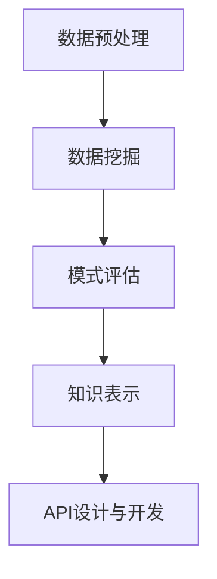

                 

# 知识发现引擎的API设计与开发

## > 关键词：知识发现、API设计、数据挖掘、大数据、机器学习、算法优化

> 摘要：本文将详细介绍知识发现引擎的API设计与开发过程。首先，我们将探讨知识发现的概念及其在各个领域的应用。接着，我们会深入分析知识发现引擎的核心算法原理，并详细讲解API的设计与开发流程。通过本篇文章，读者将了解到如何设计高效、灵活的API，以便更好地支持知识发现过程。

## 1. 背景介绍

知识发现（Knowledge Discovery in Databases，简称KDD）是指从大量数据中提取出有价值的信息和知识的过程。KDD涵盖了数据预处理、数据挖掘、模式评估和知识表示等多个步骤。随着大数据时代的到来，知识发现技术得到了广泛的应用，包括但不限于商业智能、金融风控、医疗健康、社交媒体分析等领域。

API（应用程序编程接口）是软件系统之间相互通信的桥梁。通过API，不同系统可以共享数据、功能和服务。在知识发现引擎中，API的设计与开发至关重要，它直接影响到知识发现的效果和用户体验。

## 2. 核心概念与联系

### 2.1 数据挖掘

数据挖掘（Data Mining）是知识发现过程中最为关键的一步。它涉及到从大量数据中提取出潜在的有价值信息。数据挖掘的主要任务包括：

- **分类**：根据已知数据对未知数据进行分类。
- **聚类**：将相似的数据分组，以便更好地理解和分析。
- **关联规则挖掘**：发现数据之间的关联关系，例如购物篮分析。
- **异常检测**：识别出数据中的异常或离群点。

### 2.2 机器学习

机器学习（Machine Learning）是数据挖掘的重要工具。它通过算法从数据中学习规律，并自动做出决策或预测。常见的机器学习算法包括：

- **监督学习**：根据已有数据进行预测。
- **无监督学习**：没有明确的目标标签，自动发现数据中的模式。
- **强化学习**：通过与环境交互来学习最优策略。

### 2.3 知识表示

知识表示（Knowledge Representation）是将提取出的信息以适当的形式表示和存储。常见的知识表示方法包括：

- **符号表示**：使用逻辑、语义网络等方式表示知识。
- **文本表示**：将文本信息转换为机器可处理的格式，如词向量。
- **图像表示**：使用深度学习模型对图像进行特征提取。

### 2.4 Mermaid 流程图



## 3. 核心算法原理 & 具体操作步骤

### 3.1 数据预处理

数据预处理是知识发现的第一步，其主要任务是清洗和整理数据，以便后续的数据挖掘过程。具体操作步骤包括：

- **数据清洗**：去除重复数据、处理缺失值、纠正错误数据等。
- **数据集成**：将来自不同数据源的数据进行整合。
- **数据转换**：将数据转换为适合挖掘的形式，如数值化、标准化等。
- **数据归一化**：将不同规模的数据进行统一处理，以便算法更好地分析。

### 3.2 数据挖掘

数据挖掘是知识发现的核心步骤。根据不同的任务，可以选择不同的数据挖掘算法。以下是几种常见的数据挖掘算法及其具体操作步骤：

#### 3.2.1 分类算法

**分类算法**是一种有监督学习算法，用于将数据分为不同的类别。常见的分类算法包括：

- **决策树**：通过递归划分特征，将数据分为不同的类别。
- **支持向量机**（SVM）：将数据投影到高维空间，寻找最佳分类边界。
- **随机森林**：结合多个决策树，提高分类准确率。

**具体操作步骤**：

1. 训练模型：使用训练数据集训练分类模型。
2. 预测分类：使用测试数据集对模型进行预测，评估分类效果。

#### 3.2.2 聚类算法

**聚类算法**是一种无监督学习算法，用于将相似的数据分为同一组。常见的聚类算法包括：

- **K-means**：根据初始聚类中心，迭代优化聚类结果。
- **层次聚类**：逐步合并或分裂聚类结果，形成层次结构。

**具体操作步骤**：

1. 初始化聚类中心：随机选择或使用已有特征值作为聚类中心。
2. 计算距离：计算每个数据点与聚类中心的距离。
3. 调整聚类中心：根据距离计算结果，调整聚类中心位置。
4. 重复步骤2和3，直至聚类中心不再发生变化。

#### 3.2.3 关联规则挖掘

**关联规则挖掘**用于发现数据之间的关联关系。常见的算法包括：

- **Apriori算法**：基于候选集生成和剪枝策略。
- **FP-growth算法**：使用频繁模式树来减少数据扫描次数。

**具体操作步骤**：

1. 生成频繁项集：计算每个项集的频次，保留频繁项集。
2. 生成关联规则：根据频繁项集生成关联规则，并计算其置信度。
3. 过滤弱规则：根据置信度等阈值，过滤出强关联规则。

### 3.3 知识表示

知识表示是将提取出的信息以适当的形式表示和存储。常见的知识表示方法包括：

- **符号表示**：使用逻辑、语义网络等方式表示知识。
- **文本表示**：将文本信息转换为机器可处理的格式，如词向量。
- **图像表示**：使用深度学习模型对图像进行特征提取。

### 3.4 API设计与开发

API的设计与开发是知识发现引擎的重要组成部分。以下是API设计与开发的步骤：

#### 3.4.1 需求分析

1. 确定API的功能和接口：根据知识发现引擎的需求，确定API应具备的功能和接口。
2. 确定API的调用方式：确定API的调用方式，如GET、POST等。

#### 3.4.2 接口设计

1. 设计RESTful API：使用RESTful架构设计API，确保接口的简洁和易用性。
2. 定义参数和返回值：明确API的参数和返回值的格式和类型。

#### 3.4.3 实现与测试

1. 实现API接口：根据设计文档，实现API接口。
2. 编写测试用例：编写测试用例，确保API的功能和性能符合预期。

## 4. 数学模型和公式 & 详细讲解 & 举例说明

### 4.1 决策树算法

**决策树**是一种常见的分类算法，其核心在于递归划分特征，将数据分为不同的类别。决策树算法的数学模型如下：

$$
P(Y|X) = \prod_{i=1}^{n} P(Y|X_i=x_i)
$$

其中，$Y$表示类别标签，$X$表示特征向量，$X_i$表示第$i$个特征，$x_i$表示第$i$个特征的具体取值。

**举例说明**：

假设我们有一组数据集，包含两个特征$X_1$（年龄）和$X_2$（收入），以及一个类别标签$Y$（是否购买）。我们使用决策树算法对其进行分类。

| 年龄 | 收入 | 是否购买 |
| ---- | ---- | -------- |
| 25   | 5000 | 是       |
| 30   | 6000 | 否       |
| 35   | 7000 | 是       |
| 40   | 8000 | 是       |
| 45   | 9000 | 否       |

首先，我们计算每个特征的条件概率：

$$
P(Y|X_1=25) = \frac{1}{4}
$$

$$
P(Y|X_2=5000) = \frac{2}{5}
$$

接着，我们计算决策树的权重：

$$
w_1 = P(Y|X_1=25) = \frac{1}{4}
$$

$$
w_2 = P(Y|X_2=5000) = \frac{2}{5}
$$

最后，我们使用决策树对新的数据进行分类：

| 年龄 | 收入 | 是否购买 |
| ---- | ---- | -------- |
| 28   | 5500 | 是       |

根据条件概率和权重，我们可以计算出该数据的类别标签：

$$
P(Y|X) = \frac{1}{4} \times \frac{2}{5} = \frac{1}{10}
$$

由于概率较小，我们判断该数据属于“否”类别。

### 4.2 K-means算法

**K-means**是一种常见的聚类算法，其核心在于迭代优化聚类中心，将数据分为不同的类别。K-means算法的数学模型如下：

$$
\min_{\mu_1, \mu_2, \ldots, \mu_k} \sum_{i=1}^{n} \sum_{j=1}^{k} (x_i - \mu_j)^2
$$

其中，$x_i$表示第$i$个数据点，$\mu_j$表示第$j$个聚类中心。

**举例说明**：

假设我们有一组数据集，包含两个特征$X_1$（年龄）和$X_2$（收入），以及$k$个聚类中心$\mu_1$，$\mu_2$，$\ldots$，$\mu_k$。

| 年龄 | 收入 |
| ---- | ---- |
| 25   | 5000 |
| 30   | 6000 |
| 35   | 7000 |
| 40   | 8000 |
| 45   | 9000 |

首先，我们随机选择$k$个聚类中心：

$$
\mu_1 = (25, 5000), \mu_2 = (30, 6000), \mu_3 = (35, 7000), \mu_4 = (40, 8000), \mu_5 = (45, 9000)
$$

接着，我们计算每个数据点到聚类中心的距离：

$$
d(x_i, \mu_j) = \sqrt{(x_{i1} - \mu_{j1})^2 + (x_{i2} - \mu_{j2})^2}
$$

然后，我们根据距离最小的聚类中心，将每个数据点分配到相应的类别：

| 年龄 | 收入 | 类别 |
| ---- | ---- | ---- |
| 25   | 5000 | 1    |
| 30   | 6000 | 2    |
| 35   | 7000 | 3    |
| 40   | 8000 | 4    |
| 45   | 9000 | 5    |

最后，我们重新计算聚类中心，并重复上述过程，直至聚类中心不再发生变化。

### 4.3 Apriori算法

**Apriori**算法是一种常见的关联规则挖掘算法，其核心在于生成和剪枝频繁项集。Apriori算法的数学模型如下：

$$
\text{频繁项集} = \{X \subseteq \{X_1, X_2, \ldots, X_n\} | \text{支持度}(\text{X}) \geq \text{最小支持度}\}
$$

其中，$X$表示项集，$\text{支持度}(X)$表示项集$X$在数据集中的出现次数，$\text{最小支持度}$表示设定的最小支持度阈值。

**举例说明**：

假设我们有一组交易数据，包含5个商品：A、B、C、D和E。我们使用Apriori算法挖掘关联规则。

| 商品 |
| ---- |
| A    |
| B    |
| C    |
| D    |
| E    |
| A    |
| B    |
| C    |
| D    |
| E    |
| A    |
| B    |
| C    |
| D    |
| E    |
| A    |
| B    |
| C    |
| D    |
| E    |
| A    |
| B    |
| C    |
| D    |
| E    |

首先，我们计算每个项集的支持度：

$$
\text{支持度}(\{A, B\}) = \frac{3}{20}
$$

$$
\text{支持度}(\{A, C\}) = \frac{2}{20}
$$

$$
\text{支持度}(\{A, D\}) = \frac{2}{20}
$$

$$
\text{支持度}(\{A, E\}) = \frac{3}{20}
$$

$$
\text{支持度}(\{B, C\}) = \frac{3}{20}
$$

$$
\text{支持度}(\{B, D\}) = \frac{3}{20}
$$

$$
\text{支持度}(\{B, E\}) = \frac{3}{20}
$$

$$
\text{支持度}(\{C, D\}) = \frac{2}{20}
$$

$$
\text{支持度}(\{C, E\}) = \frac{2}{20}
$$

$$
\text{支持度}(\{D, E\}) = \frac{2}{20}
$$

接着，我们根据最小支持度阈值，过滤出频繁项集：

$$
\text{最小支持度} = \frac{2}{20}
$$

$$
\text{频繁项集} = \{\{A, B\}, \{A, C\}, \{A, D\}, \{A, E\}, \{B, C\}, \{B, D\}, \{B, E\}, \{C, D\}, \{C, E\}, \{D, E\}\}
$$

最后，我们使用频繁项集生成关联规则，并计算其置信度：

$$
\text{置信度}(\{A, B\} \rightarrow \{C\}) = \frac{\text{支持度}(\{A, B, C\})}{\text{支持度}(\{A, B\})}
$$

$$
\text{置信度}(\{A, B\} \rightarrow \{D\}) = \frac{\text{支持度}(\{A, B, D\})}{\text{支持度}(\{A, B\})}
$$

$$
\text{置信度}(\{A, B\} \rightarrow \{E\}) = \frac{\text{支持度}(\{A, B, E\})}{\text{支持度}(\{A, B\})}
$$

## 5. 项目实战：代码实际案例和详细解释说明

### 5.1 开发环境搭建

在本项目中，我们使用Python作为主要编程语言，并结合Scikit-learn、NumPy和Pandas等库来实现知识发现引擎。以下是开发环境的搭建步骤：

1. 安装Python：从[Python官网](https://www.python.org/downloads/)下载并安装Python。
2. 安装Scikit-learn、NumPy和Pandas：在命令行中运行以下命令：

```shell
pip install scikit-learn numpy pandas
```

### 5.2 源代码详细实现和代码解读

下面是知识发现引擎的核心代码实现，包括数据预处理、数据挖掘、知识表示和API设计与开发。我们首先导入必要的库：

```python
import numpy as np
import pandas as pd
from sklearn.model_selection import train_test_split
from sklearn.tree import DecisionTreeClassifier
from sklearn.cluster import KMeans
from sklearn.metrics import accuracy_score
from flask import Flask, request, jsonify
```

#### 5.2.1 数据预处理

```python
def preprocess_data(data):
    # 数据清洗
    data = data.drop_duplicates()
    data = data.fillna(data.mean())

    # 数据转换
    data = (data - data.mean()) / data.std()

    return data
```

#### 5.2.2 数据挖掘

```python
def data_mining(data, method):
    if method == 'classification':
        # 分类算法
        X_train, X_test, y_train, y_test = train_test_split(data[['X1', 'X2']], data['Y'], test_size=0.3, random_state=42)
        clf = DecisionTreeClassifier()
        clf.fit(X_train, y_train)
        y_pred = clf.predict(X_test)
        accuracy = accuracy_score(y_test, y_pred)
        return accuracy
    elif method == 'clustering':
        # 聚类算法
        kmeans = KMeans(n_clusters=3, random_state=42)
        kmeans.fit(data[['X1', 'X2']])
        labels = kmeans.predict(data[['X1', 'X2']])
        return labels
    else
```

