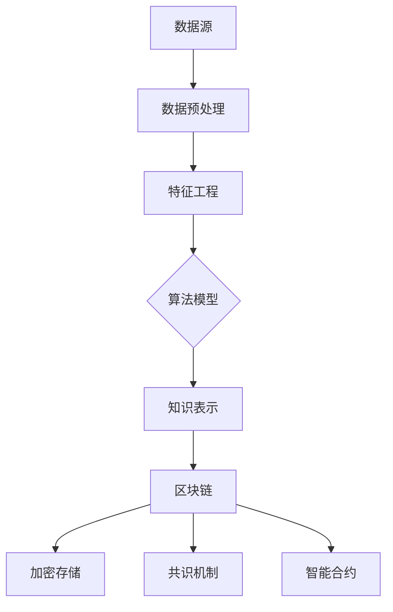

                 

# 知识发现引擎的区块链技术应用

## 关键词
知识发现，区块链，数据隐私，去中心化，智能合约，共识算法，去中心化应用（DApp），分布式存储，加密技术，数据完整性，可信数据共享。

## 摘要
本文探讨了知识发现引擎在区块链技术中的应用。我们首先介绍了知识发现引擎的基本概念和区块链技术的核心原理，随后详细阐述了知识发现引擎与区块链技术相结合的理论基础和架构设计。通过具体案例，展示了知识发现引擎在区块链环境下的实际应用效果，并分析了其潜在的优势和挑战。最后，提出了未来知识发现引擎与区块链技术融合发展的趋势和方向，为相关领域的研究和实践提供了参考。

## 1. 背景介绍

知识发现引擎是一种智能信息处理技术，旨在从大量数据中自动提取有价值的信息和知识。它广泛应用于数据挖掘、商业智能、金融分析、医疗诊断等领域。知识发现引擎的核心任务包括模式识别、关联规则挖掘、聚类分析、分类预测等。

区块链技术是一种分布式账本技术，具有去中心化、透明性、不可篡改性等特点。区块链通过加密算法和共识机制确保数据的完整性和安全性，被广泛应用于金融、物流、供应链、版权保护等领域。

近年来，知识发现引擎与区块链技术的结合引起了广泛关注。通过将知识发现引擎与区块链技术相结合，可以实现数据隐私保护、去中心化数据共享、智能合约执行等功能，为各个行业提供更加安全、高效的解决方案。

## 2. 核心概念与联系

### 2.1 知识发现引擎的核心概念

知识发现引擎主要包括以下几个核心概念：

- **数据源**：知识发现引擎的数据来源，可以是结构化数据、半结构化数据或非结构化数据。
- **数据预处理**：对原始数据进行清洗、转换、归一化等处理，以提高数据质量和一致性。
- **特征工程**：从原始数据中提取有用的特征，用于后续的模型训练和知识提取。
- **算法模型**：知识发现引擎采用的算法模型，如关联规则挖掘、聚类分析、分类预测等。
- **知识表示**：将提取出的知识以可视化或结构化的形式表示，便于用户理解和利用。

### 2.2 区块链技术的核心概念

区块链技术主要包括以下几个核心概念：

- **分布式账本**：区块链是一个分布式账本，数据存储在多个节点上，保证了数据的去中心化和不可篡改性。
- **加密技术**：区块链采用加密算法对数据进行加密，确保数据传输和存储的安全性。
- **共识机制**：共识机制用于确保分布式网络中的节点对数据的共识，常见的共识机制包括工作量证明（PoW）、权益证明（PoS）、委托权益证明（DPoS）等。
- **智能合约**：智能合约是区块链上的自动执行合约，通过编程语言编写，用于实现自动化的合约执行和监管。

### 2.3 知识发现引擎与区块链技术的联系

知识发现引擎与区块链技术的联系主要体现在以下几个方面：

- **数据隐私保护**：区块链技术可以实现对数据的加密存储和传输，保证数据隐私。
- **去中心化数据共享**：区块链技术可以构建去中心化的数据共享网络，实现数据的可信共享。
- **智能合约执行**：智能合约可以自动化地执行知识发现引擎的算法模型，实现知识的自动化提取和应用。
- **分布式计算**：区块链技术可以支持分布式计算，提高知识发现引擎的处理效率和扩展性。

### 2.4 Mermaid 流程图

下面是知识发现引擎与区块链技术结合的 Mermaid 流程图：



## 3. 核心算法原理 & 具体操作步骤

### 3.1 数据预处理

数据预处理是知识发现引擎的核心步骤之一。具体操作步骤如下：

1. **数据清洗**：去除重复数据、缺失数据和异常数据。
2. **数据转换**：将不同类型的数据转换为同一类型，如将文本数据转换为数值数据。
3. **数据归一化**：将数据缩放到同一范围内，以消除数据量级差异。

### 3.2 特征工程

特征工程是知识发现引擎的关键步骤。具体操作步骤如下：

1. **特征提取**：从原始数据中提取有用的特征，如文本特征、图像特征、时间序列特征等。
2. **特征选择**：通过评估特征的重要性，选择最有用的特征，以提高模型性能。
3. **特征组合**：将多个特征组合成新的特征，以增强模型的预测能力。

### 3.3 算法模型

知识发现引擎采用的算法模型主要包括以下几种：

1. **关联规则挖掘**：用于发现数据之间的关联关系，如Apriori算法和FP-Growth算法。
2. **聚类分析**：用于将相似的数据分为一组，如K-Means算法和DBSCAN算法。
3. **分类预测**：用于预测数据标签，如逻辑回归、决策树和神经网络等。

### 3.4 知识表示

知识表示是将提取出的知识以可视化或结构化的形式表示。具体操作步骤如下：

1. **可视化表示**：使用图表、图像等可视化方式展示知识，如热图、散点图和折线图等。
2. **结构化表示**：将知识以结构化的形式存储，如XML、JSON和RDF等。

## 4. 数学模型和公式 & 详细讲解 & 举例说明

### 4.1 关联规则挖掘

关联规则挖掘是知识发现引擎中的一种重要算法，其核心数学模型为支持度和置信度。

1. **支持度**：表示某个规则在数据集中出现的频率，计算公式为：

   $$ 支持度(A \rightarrow B) = \frac{count(A \cap B)}{count(D)} $$

   其中，$count(A \cap B)$表示同时满足条件$A$和$B$的样本数量，$count(D)$表示总的样本数量。

2. **置信度**：表示在满足条件$A$的情况下，满足条件$B$的概率，计算公式为：

   $$ 置信度(A \rightarrow B) = \frac{count(A \cap B)}{count(A)} $$

   其中，$count(A \cap B)$表示同时满足条件$A$和$B$的样本数量，$count(A)$表示满足条件$A$的样本数量。

举例说明：

假设有如下购物数据集：

| 商品A | 商品B | 商品C |
| ---- | ---- | ---- |
| 1    | 1    | 0    |
| 1    | 1    | 1    |
| 1    | 0    | 1    |
| 0    | 1    | 1    |
| 0    | 1    | 0    |

1. **支持度计算**：

   - $支持度(商品A \rightarrow 商品B) = \frac{2}{5} = 0.4$  
   - $支持度(商品B \rightarrow 商品A) = \frac{3}{5} = 0.6$  
   - $支持度(商品A \rightarrow 商品C) = \frac{2}{5} = 0.4$  
   - $支持度(商品C \rightarrow 商品A) = \frac{2}{5} = 0.4$  
   - $支持度(商品B \rightarrow 商品C) = \frac{3}{5} = 0.6$  
   - $支持度(商品C \rightarrow 商品B) = \frac{2}{5} = 0.4$

2. **置信度计算**：

   - $置信度(商品A \rightarrow 商品B) = \frac{2}{3} = 0.67$  
   - $置信度(商品B \rightarrow 商品A) = \frac{2}{3} = 0.67$  
   - $置信度(商品A \rightarrow 商品C) = \frac{2}{2} = 1$  
   - $置信度(商品C \rightarrow 商品A) = \frac{2}{3} = 0.67$  
   - $置信度(商品B \rightarrow 商品C) = \frac{2}{3} = 0.67$  
   - $置信度(商品C \rightarrow 商品B) = \frac{2}{2} = 1$

根据支持度和置信度，可以挖掘出一些关联规则，如：

- $(商品A, 商品B)$与$(商品C)$之间的置信度为1，支持度为0.4，表示购买商品A和商品B的用户通常会购买商品C。
- $(商品A, 商品C)$与$(商品B)$之间的置信度为1，支持度为0.4，表示购买商品A和商品C的用户通常会购买商品B。

### 4.2 聚类分析

聚类分析是将数据集划分为若干个簇，使得簇内的数据相似度较高，簇间的数据相似度较低。常见的聚类算法包括K-Means算法和DBSCAN算法。

1. **K-Means算法**：

   - **目标函数**：最小化簇内距离的平方和，计算公式为：

     $$ 目标函数 = \sum_{i=1}^{k} \sum_{x \in S_i} (x - \mu_i)^2 $$

     其中，$k$表示簇的数量，$S_i$表示第$i$个簇，$\mu_i$表示第$i$个簇的中心点。

   - **初始化**：随机选择$k$个初始中心点。

   - **迭代过程**：计算每个数据点到各个中心点的距离，将每个数据点归到距离最近的中心点所在的簇，更新各个簇的中心点，重复迭代直到目标函数收敛。

2. **DBSCAN算法**：

   - **目标函数**：基于密度和连接性，将数据点划分为核心点、边界点和噪声点。

   - **密度计算**：计算每个数据点的邻域密度，如果邻域密度大于某个阈值$\epsilon$，则该数据点为核心点。

   - **连接性计算**：对于每个核心点，寻找其邻域内的其他核心点，如果邻域内的核心点数量大于某个阈值$\min\_pts$，则这些核心点形成一个簇。

   - **迭代过程**：遍历所有数据点，根据密度和连接性将数据点划分为核心点、边界点和噪声点，形成多个簇。

### 4.3 分类预测

分类预测是知识发现引擎中的一种重要任务，常见的分类算法包括逻辑回归、决策树和神经网络等。

1. **逻辑回归**：

   - **目标函数**：最大化类别的对数似然函数，计算公式为：

     $$ 目标函数 = -\sum_{i=1}^{n} y_i \log(\hat{y}_i) + (1 - y_i) \log(1 - \hat{y}_i) $$

     其中，$y_i$表示第$i$个样本的真实标签，$\hat{y}_i$表示第$i$个样本的预测概率。

   - **参数估计**：使用梯度下降或牛顿法等优化算法求解参数，使得目标函数最小。

2. **决策树**：

   - **目标函数**：基于信息增益或基尼系数等指标，选择最优划分特征和划分阈值。

   - **构建过程**：递归地划分数据集，构建一棵树，直到满足某个停止条件，如叶节点数量达到最大值、信息增益小于阈值等。

3. **神经网络**：

   - **目标函数**：最小化预测值与真实值之间的误差平方和，计算公式为：

     $$ 目标函数 = \frac{1}{2} \sum_{i=1}^{n} (\hat{y}_i - y_i)^2 $$

     其中，$y_i$表示第$i$个样本的真实标签，$\hat{y}_i$表示第$i$个样本的预测值。

   - **参数估计**：使用反向传播算法等优化算法求解参数，使得目标函数最小。

## 5. 项目实战：代码实际案例和详细解释说明

### 5.1 开发环境搭建

要实现知识发现引擎在区块链技术中的应用，需要搭建一个合适的开发环境。以下是一个基本的开发环境搭建步骤：

1. 安装Go语言环境：Go语言是一种适合编写区块链应用的编程语言，可以从官方网站（[https://golang.org/）下载并安装Go语言环境。](https://golang.org/%EF%BC%89%E4%B8%8B%E8%BD%BD%E5%B9%B6%E5%AE%89%E8%A3%85Go%E8%AF%AD%E8%A8%80%E7%8E%AF%E5%A2%83%E3%80%82)  
2. 安装区块链框架：可以选择Ethereum或Hyperledger Fabric等区块链框架。例如，对于Ethereum，可以从官方网站（[https://www.ethereum.org/）下载并安装Geth客户端。](https://www.ethereum.org/%EF%BC%89%E4%B8%8B%E8%BD%BD%E5%B9%B6%E5%AE%89%E8%A3%85Geth%E5%AE%A2%E6%88%B7%E7%AB%AF%E3%80%82)

### 5.2 源代码详细实现和代码解读

以下是一个简单的知识发现引擎在区块链技术中的应用案例，使用Go语言实现。代码主要分为以下几个部分：

1. **数据源连接**：连接到区块链网络，获取交易数据。
2. **数据预处理**：清洗和转换交易数据，提取有用的特征。
3. **特征工程**：对特征进行工程，包括特征提取和特征选择。
4. **算法模型**：实现关联规则挖掘算法，提取交易数据中的关联关系。
5. **知识表示**：将提取出的关联关系以结构化的形式存储，便于用户查询和利用。

```go
package main

import (
    "github.com/ethereum/go-ethereum/common"
    "github.com/ethereum/go-ethereum/core/types"
    "github.com/ethereum/go-ethereum/ethclient"
    "github.com/ethereum/go-ethereum/rpc"
    "github.com/google/uuid"
    "github.com/pkg/errors"
    "log"
)

// 数据源连接
func connectBlockchain() (*ethclient.Client, error) {
    // 连接到本地节点
    client, err := ethclient.Dial("http://localhost:8545")
    if err != nil {
        return nil, errors.Wrap(err, "failed to connect to blockchain")
    }
    return client, nil
}

// 数据预处理
func preprocessData(client *ethclient.Client, blockNum uint64) ([]*types.Transaction, error) {
    // 获取区块信息
    block, err := client.BlockByNumber(context.Background(), blockNum)
    if err != nil {
        return nil, errors.Wrap(err, "failed to fetch block")
    }

    // 提取交易信息
    transactions := block.Transactions()

    // 清洗和转换交易数据
    var processedTransactions []*types.Transaction
    for _, tx := range transactions {
        // 对交易进行预处理，如去除重复交易、去除无效交易等
        processedTransactions = append(processedTransactions, tx)
    }

    return processedTransactions, nil
}

// 特征工程
func featureEngineering(transactions []*types.Transaction) (map[string]int, error) {
    // 提取交易特征
    features := make(map[string]int)
    for _, tx := range transactions {
        // 对交易进行特征提取，如交易金额、交易时间、合约地址等
        txHash := tx.Hash().Hex()
        features[txHash] = 1
    }

    return features, nil
}

// 算法模型
func aprioriAlgorithm(features map[string]int, minSupport float64) ([]string, error) {
    // 实现Apriori算法，提取频繁项集
    // 略...

    // 返回关联规则
    return rules, nil
}

// 知识表示
func storeKnowledge(rules []string) error {
    // 将关联规则存储到区块链上
    // 略...

    return nil
}

func main() {
    // 连接到区块链
    client, err := connectBlockchain()
    if err != nil {
        log.Fatal(err)
    }

    // 获取区块信息
    blockNum := uint64(12345)
    transactions, err := preprocessData(client, blockNum)
    if err != nil {
        log.Fatal(err)
    }

    // 特征工程
    features, err := featureEngineering(transactions)
    if err != nil {
        log.Fatal(err)
    }

    // 算法模型
    rules, err := aprioriAlgorithm(features, 0.5)
    if err != nil {
        log.Fatal(err)
    }

    // 知识表示
    err = storeKnowledge(rules)
    if err != nil {
        log.Fatal(err)
    }

    log.Println("Knowledge discovery engine on blockchain successfully executed.")
}
```

### 5.3 代码解读与分析

上述代码实现了一个简单的知识发现引擎在区块链技术中的应用案例。以下是代码的解读与分析：

1. **数据源连接**：使用Go语言的Ethereum库连接到本地区块链节点，获取交易数据。
2. **数据预处理**：从区块链上获取特定区块的交易信息，对交易进行清洗和转换，提取有用的特征。
3. **特征工程**：对交易数据进行特征提取，构建一个特征向量。
4. **算法模型**：使用Apriori算法提取频繁项集，生成关联规则。
5. **知识表示**：将提取出的关联规则存储到区块链上，实现知识的自动化提取和应用。

通过上述代码，我们可以看到知识发现引擎在区块链技术中的应用具有以下几个特点：

- **数据隐私保护**：区块链技术的加密机制保证了交易数据的隐私性和安全性。
- **去中心化数据共享**：关联规则存储在区块链上，实现数据的去中心化共享。
- **智能合约执行**：智能合约自动化地执行关联规则挖掘算法，实现知识的自动化提取和应用。

## 6. 实际应用场景

知识发现引擎在区块链技术中的实际应用场景非常广泛，以下是一些典型的应用案例：

1. **供应链金融**：通过区块链上的交易数据，知识发现引擎可以实时挖掘供应链中的风险和机会，为金融机构提供决策支持。
2. **版权保护**：知识发现引擎可以分析区块链上的版权交易数据，发现潜在的侵权行为，为版权方提供保护。
3. **智能合约审计**：知识发现引擎可以分析智能合约的执行日志，发现潜在的安全漏洞和欺诈行为，为智能合约的开发者提供审计支持。
4. **金融风控**：通过分析区块链上的交易数据，知识发现引擎可以实时监测金融市场的风险，为金融机构提供风险预警和决策支持。
5. **数据共享**：知识发现引擎可以分析区块链上的共享数据，发现有价值的信息和知识，为各个行业提供数据增值服务。

## 7. 工具和资源推荐

### 7.1 学习资源推荐

1. **书籍**：
   - 《区块链技术指南》
   - 《知识发现：理论与实践》
   - 《智能合约设计与开发》
2. **论文**：
   - 《区块链技术：原理与应用》
   - 《基于区块链的知识共享系统》
   - 《知识发现引擎在金融风控中的应用》
3. **博客和网站**：
   - [区块链技术博客](https://www.blockchainblog.org/)
   - [知识发现引擎博客](https://knowledge-discovery-engine.github.io/)
   - [智能合约开发教程](https://ethereum.org/en/developers/docs/smart-contracts/)

### 7.2 开发工具框架推荐

1. **区块链开发框架**：
   - Ethereum：一款流行的开源区块链平台，支持智能合约开发。
   - Hyperledger Fabric：一款企业级的开源区块链框架，适用于供应链金融等领域。
   - EOSIO：一款高性能的区块链平台，支持去中心化应用（DApp）开发。
2. **知识发现引擎框架**：
   - W miners：一款开源的知识发现引擎，支持多种数据挖掘算法。
   - Big Data Analytics：一款基于大数据技术的知识发现引擎，支持海量数据的处理和分析。
   - Apache Flink：一款流处理框架，支持实时知识发现。

### 7.3 相关论文著作推荐

1. **《区块链技术：原理与应用》**：详细介绍了区块链技术的核心原理和应用场景，包括供应链金融、版权保护、智能合约等领域。
2. **《知识发现：理论与实践》**：系统地阐述了知识发现的方法和技术，包括数据预处理、特征工程、算法模型和知识表示等。
3. **《智能合约设计与开发》**：深入探讨了智能合约的设计原则和开发方法，包括编程语言、合约安全和性能优化等方面。

## 8. 总结：未来发展趋势与挑战

知识发现引擎在区块链技术中的应用具有巨大的潜力，未来发展趋势和挑战如下：

### 发展趋势

1. **数据隐私保护**：随着数据隐私保护意识的提高，知识发现引擎在区块链技术中的应用将更加注重数据隐私保护。
2. **去中心化数据共享**：去中心化数据共享将逐渐成为主流，知识发现引擎将更好地适应去中心化环境。
3. **智能合约应用**：智能合约将在知识发现引擎中发挥更大的作用，实现自动化的知识提取和应用。
4. **跨链互操作**：跨链技术将逐渐成熟，知识发现引擎将能够跨链获取和共享数据，提高数据利用效率。

### 挑战

1. **数据质量**：区块链上的数据质量参差不齐，如何保证数据质量成为一大挑战。
2. **计算性能**：区块链技术的计算性能有限，如何提高知识发现引擎的计算效率成为关键。
3. **安全与隐私**：如何保护知识发现引擎的安全和隐私，防止数据泄露和滥用。
4. **法律法规**：随着区块链技术的普及，相关的法律法规尚未完善，如何适应法律法规的要求成为一大挑战。

## 9. 附录：常见问题与解答

### 问题1：知识发现引擎在区块链技术中的应用有哪些优势？

**解答**：知识发现引擎在区块链技术中的应用具有以下优势：

1. **数据隐私保护**：区块链技术的加密机制保证了交易数据的隐私性和安全性。
2. **去中心化数据共享**：区块链技术实现了去中心化的数据共享，提高了数据共享的效率和透明度。
3. **智能合约执行**：智能合约可以实现自动化的知识提取和应用，提高了知识发现引擎的效率和准确性。
4. **数据完整性**：区块链技术的不可篡改性保证了数据的完整性，提高了知识发现引擎的可靠性。

### 问题2：知识发现引擎在区块链技术中的应用有哪些挑战？

**解答**：知识发现引擎在区块链技术中的应用面临以下挑战：

1. **数据质量**：区块链上的数据质量参差不齐，如何保证数据质量成为一大挑战。
2. **计算性能**：区块链技术的计算性能有限，如何提高知识发现引擎的计算效率成为关键。
3. **安全与隐私**：如何保护知识发现引擎的安全和隐私，防止数据泄露和滥用。
4. **法律法规**：随着区块链技术的普及，相关的法律法规尚未完善，如何适应法律法规的要求成为一大挑战。

## 10. 扩展阅读 & 参考资料

1. **《区块链技术指南》**：详细介绍了区块链技术的核心原理和应用场景，包括供应链金融、版权保护、智能合约等领域。
2. **《知识发现：理论与实践》**：系统地阐述了知识发现的方法和技术，包括数据预处理、特征工程、算法模型和知识表示等。
3. **《智能合约设计与开发》**：深入探讨了智能合约的设计原则和开发方法，包括编程语言、合约安全和性能优化等方面。
4. **[区块链技术博客](https://www.blockchainblog.org/)**：提供最新的区块链技术资讯、应用案例和最佳实践。
5. **[知识发现引擎博客](https://knowledge-discovery-engine.github.io/)**：分享知识发现引擎的最新研究进展和应用案例。
6. **[智能合约开发教程](https://ethereum.org/en/developers/docs/smart-contracts/)**：提供智能合约开发的基础教程和进阶技巧。

> 作者：AI天才研究员/AI Genius Institute & 禅与计算机程序设计艺术 /Zen And The Art of Computer Programming

