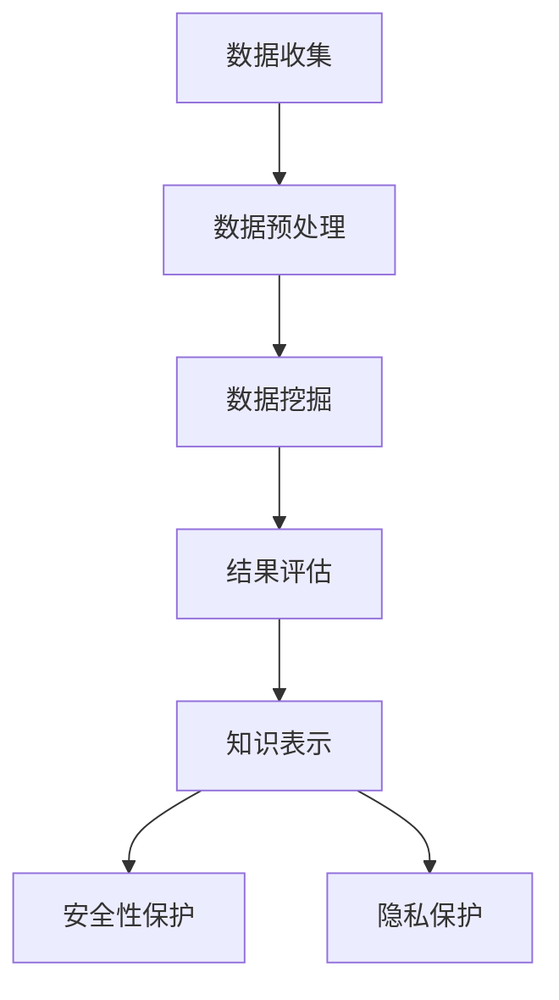
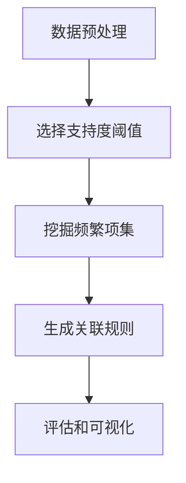

                 

# 知识发现引擎的安全性与隐私保护

## 摘要

本文主要探讨了知识发现引擎在数据收集、处理和分析过程中面临的安全性和隐私保护问题。知识发现引擎作为一种重要的数据挖掘工具，其广泛应用带来了数据泄露、滥用和隐私侵犯的风险。本文首先介绍了知识发现引擎的基本原理和常见应用场景，然后深入分析了安全性和隐私保护的关键挑战，并提出了相应的解决策略。通过本文的阅读，读者可以全面了解知识发现引擎在安全性和隐私保护方面的现状和未来发展。

## 1. 背景介绍

知识发现引擎是一种基于人工智能和机器学习技术的数据挖掘工具，旨在从大规模数据集中自动识别隐藏的知识和模式。知识发现引擎的主要功能包括数据预处理、模式识别、关联规则挖掘、聚类分析、分类和预测等。随着大数据时代的到来，知识发现引擎在各个行业得到了广泛应用，如金融、医疗、零售、教育等。

知识发现引擎的核心优势在于其能够从海量数据中发现潜在的价值，帮助企业做出更为科学的决策。例如，在金融领域，知识发现引擎可以用于信用风险评估、欺诈检测和投资策略制定；在医疗领域，可以用于疾病预测、诊断和个性化治疗方案的制定；在零售领域，可以用于需求预测、商品推荐和客户关系管理。

然而，知识发现引擎在数据收集、处理和分析过程中也面临一系列安全性和隐私保护问题。首先，数据泄露问题日益严重。知识发现引擎需要收集和处理大量的敏感数据，如个人身份信息、健康记录、财务信息等，这些数据一旦泄露，可能导致严重的隐私侵犯和财产损失。其次，数据滥用问题也逐渐显现。一些不法分子可能会利用知识发现引擎挖掘出的知识进行恶意攻击、诈骗等违法行为。此外，知识发现引擎的算法和模型也面临着安全性挑战，如针对算法的攻击、模型过拟合和泛化能力不足等。

因此，在知识发现引擎的广泛应用过程中，如何确保数据的安全性和隐私保护成为了一个亟待解决的问题。本文将围绕这一问题展开讨论，探讨知识发现引擎在安全性和隐私保护方面的现状、挑战和解决策略。

## 2. 核心概念与联系

### 2.1. 知识发现引擎的基本原理

知识发现引擎的工作原理可以分为以下几个阶段：

1. **数据预处理**：首先，对原始数据进行清洗、去重、格式转换等操作，使其符合分析和挖掘的要求。
2. **数据挖掘**：利用机器学习和数据挖掘算法对预处理后的数据进行分析，以发现潜在的知识和模式。
3. **结果评估**：对挖掘出的结果进行评估和验证，以确保其准确性和可靠性。
4. **知识表示**：将挖掘出的知识和模式以可视化的形式展示，方便用户理解和应用。

### 2.2. 安全性和隐私保护的关键概念

在知识发现引擎的应用过程中，安全性和隐私保护涉及到以下关键概念：

1. **数据泄露**：指敏感数据在传输、存储或处理过程中被未经授权的第三方获取。
2. **数据滥用**：指利用挖掘出的知识进行恶意攻击、诈骗等违法行为。
3. **算法安全**：指保护知识发现引擎的算法和模型免受恶意攻击和篡改。
4. **隐私保护**：指在数据收集、处理和分析过程中，采取有效措施保护个人隐私。

### 2.3. 安全性和隐私保护的关系

安全性和隐私保护在知识发现引擎中具有密切的关系。安全性主要关注数据在传输、存储和处理过程中的保护，而隐私保护则关注个人隐私在数据挖掘过程中的保护。二者共同构成了知识发现引擎的保障体系。

- **相互依赖**：安全性为隐私保护提供基础，如数据泄露防护措施；隐私保护则依赖于安全性，如加密技术的应用。
- **相互补充**：安全性侧重于防止外部攻击和篡改，而隐私保护则侧重于防止内部滥用和泄露。
- **共同目标**：确保知识发现引擎在高效挖掘知识的同时，保障数据的安全和隐私。

### 2.4. Mermaid 流程图

以下是一个简单的 Mermaid 流程图，展示了知识发现引擎在安全性和隐私保护方面的流程节点：



在流程图中，每个节点代表知识发现引擎中的一个环节，箭头表示数据流和信息的传递。安全性保护和隐私保护节点贯穿整个流程，为数据的安全和隐私提供保障。

## 3. 核心算法原理 & 具体操作步骤

### 3.1. 数据挖掘算法

知识发现引擎中的数据挖掘算法是实现知识发现的关键。以下介绍几种常见的数据挖掘算法及其原理：

1. **关联规则挖掘**：通过挖掘数据集中的关联规则，发现不同变量之间的相关性。常用的算法包括 Apriori 算法和 FP-growth 算法。
2. **聚类分析**：将数据集划分为若干个群组，使得同一群组内的数据相似度较高，不同群组间的数据相似度较低。常用的算法包括 K-means 算法、DBSCAN 算法等。
3. **分类和预测**：通过已知的训练数据，对未知数据进行分类和预测。常用的算法包括决策树、支持向量机、神经网络等。

### 3.2. 算法具体操作步骤

以下是关联规则挖掘算法的具体操作步骤：

1. **数据预处理**：清洗和整理原始数据，使其满足关联规则挖掘的要求。
2. **选择支持度阈值**：设定一个支持度阈值，用于筛选频繁项集。
3. **挖掘频繁项集**：利用 Apriori 算法或 FP-growth 算法，挖掘出所有频繁项集。
4. **生成关联规则**：从频繁项集中生成关联规则，并根据置信度阈值筛选出强关联规则。
5. **评估和可视化**：评估挖掘结果的有效性，并将其以可视化的形式展示。

### 3.3. 算法流程图

以下是一个简单的 Mermaid 流程图，展示了关联规则挖掘算法的操作步骤：



在流程图中，每个节点代表算法中的一个步骤，箭头表示步骤之间的顺序。

## 4. 数学模型和公式 & 详细讲解 & 举例说明

### 4.1. 数学模型

在知识发现引擎中，常用的数学模型包括概率模型、统计模型和机器学习模型。以下分别介绍这些模型的基本概念和常用公式。

#### 4.1.1. 概率模型

概率模型是知识发现引擎中常用的一种模型，用于描述数据之间的概率关系。以下是一些常用的概率模型及其公式：

1. **贝叶斯定理**：贝叶斯定理描述了在已知某些条件下，某个事件发生的概率。公式如下：

   $$P(A|B) = \frac{P(B|A)P(A)}{P(B)}$$

   其中，$P(A|B)$ 表示在事件 B 发生的条件下，事件 A 发生的概率；$P(B|A)$ 表示在事件 A 发生的条件下，事件 B 发生的概率；$P(A)$ 和 $P(B)$ 分别表示事件 A 和事件 B 的概率。

2. **条件概率**：条件概率描述了在某个条件下，某个事件发生的概率。公式如下：

   $$P(A|B) = \frac{P(A \cap B)}{P(B)}$$

   其中，$P(A \cap B)$ 表示事件 A 和事件 B 同时发生的概率。

#### 4.1.2. 统计模型

统计模型用于描述数据集的特征和关系。以下是一些常用的统计模型及其公式：

1. **均值**：均值是描述数据集中心位置的一个指标。公式如下：

   $$\mu = \frac{1}{n}\sum_{i=1}^{n}x_i$$

   其中，$\mu$ 表示均值，$n$ 表示数据个数，$x_i$ 表示第 $i$ 个数据。

2. **方差**：方差是描述数据集离散程度的一个指标。公式如下：

   $$\sigma^2 = \frac{1}{n-1}\sum_{i=1}^{n}(x_i - \mu)^2$$

   其中，$\sigma^2$ 表示方差，$n$ 表示数据个数，$\mu$ 表示均值。

3. **协方差**：协方差是描述两个变量之间关系的一个指标。公式如下：

   $$Cov(X, Y) = E[(X - \mu_X)(Y - \mu_Y)]$$

   其中，$Cov(X, Y)$ 表示协方差，$E$ 表示期望，$\mu_X$ 和 $\mu_Y$ 分别表示变量 $X$ 和 $Y$ 的均值。

#### 4.1.3. 机器学习模型

机器学习模型用于预测和分类。以下是一些常用的机器学习模型及其公式：

1. **线性回归**：线性回归模型用于预测连续值。公式如下：

   $$Y = \beta_0 + \beta_1X + \epsilon$$

   其中，$Y$ 表示预测值，$X$ 表示自变量，$\beta_0$ 和 $\beta_1$ 分别表示回归系数，$\epsilon$ 表示误差。

2. **逻辑回归**：逻辑回归模型用于预测概率。公式如下：

   $$P(Y=1) = \frac{1}{1 + e^{-(\beta_0 + \beta_1X)}}$$

   其中，$P(Y=1)$ 表示事件 $Y=1$ 发生的概率，$X$ 表示自变量，$\beta_0$ 和 $\beta_1$ 分别表示回归系数。

### 4.2. 举例说明

以下通过一个具体的例子，说明如何使用上述数学模型进行知识发现。

#### 4.2.1. 例子描述

假设有一个数据集，包含以下三个变量：年龄（$X$）、收入（$Y$）和是否购买（$Z$）。我们需要使用知识发现引擎，找出年龄和收入对是否购买的影响。

#### 4.2.2. 数据预处理

首先，对数据进行预处理，包括去重、格式转换等操作，使其满足线性回归模型的要求。

#### 4.2.3. 建立线性回归模型

使用线性回归模型，建立年龄和收入之间的关系。公式如下：

$$Y = \beta_0 + \beta_1X + \epsilon$$

其中，$Y$ 表示收入，$X$ 表示年龄，$\beta_0$ 和 $\beta_1$ 分别表示回归系数。

#### 4.2.4. 训练模型

使用训练数据集，通过最小二乘法训练线性回归模型，得到回归系数 $\beta_0$ 和 $\beta_1$。

#### 4.2.5. 评估模型

使用测试数据集，评估线性回归模型的准确性。计算预测值和实际值之间的误差，并根据误差大小评估模型的性能。

#### 4.2.6. 结果分析

通过分析线性回归模型的预测结果，可以发现年龄和收入对是否购买的影响。例如，随着年龄的增长，收入越高，购买的概率也越高。

## 5. 项目实战：代码实际案例和详细解释说明

### 5.1. 开发环境搭建

在进行知识发现引擎的项目实战之前，我们需要搭建一个合适的开发环境。以下是一个基于 Python 的开发环境搭建步骤：

1. 安装 Python 3.x 版本，可以从 [Python 官网](https://www.python.org/) 下载并安装。
2. 安装必要的 Python 库，如 NumPy、Pandas、Scikit-learn、Matplotlib 等。可以使用 pip 命令进行安装：

   ```bash
   pip install numpy pandas scikit-learn matplotlib
   ```

3. 配置 Jupyter Notebook，以便在浏览器中运行 Python 代码。可以使用 pip 命令安装 Jupyter Notebook：

   ```bash
   pip install notebook
   ```

4. 启动 Jupyter Notebook，在浏览器中输入 `http://localhost:8888`，即可打开 Jupyter Notebook 的界面。

### 5.2. 源代码详细实现和代码解读

以下是一个简单的知识发现引擎项目的源代码实现，用于分析用户购买行为。代码分为以下几个部分：

#### 5.2.1. 数据预处理

```python
import pandas as pd

# 读取数据
data = pd.read_csv('user_data.csv')

# 数据清洗和预处理
data = data.dropna()  # 删除缺失值
data = data[data['age'] >= 0]  # 去除不合理的年龄数据
```

这段代码首先读取用户数据，然后对数据进行清洗和预处理，包括删除缺失值和去除不合理的数据。

#### 5.2.2. 关联规则挖掘

```python
from mlxtend.frequent_patterns import apriori
from mlxtend.frequent_patterns import association_rules

# 提取购买商品集
transactions = data.groupby('user')['item'].apply(list).tolist()

# 挖掘频繁项集
frequent_itemsets = apriori(transactions, min_support=0.05, use_colnames=True)

# 生成关联规则
rules = association_rules(frequent_itemsets, metric="confidence", min_threshold=0.6)
```

这段代码使用 Apriori 算法挖掘用户购买行为的频繁项集，并生成关联规则。其中，`min_support` 参数表示最小支持度，`min_threshold` 参数表示最小置信度。

#### 5.2.3. 结果评估和可视化

```python
import matplotlib.pyplot as plt

# 评估关联规则
print(rules.head())

# 可视化关联规则
plt.scatter(rules['antecedents'].apply(len), rules['support'])
plt.xlabel('Antecedents Size')
plt.ylabel('Support')
plt.title('Association Rules by Antecedents Size')
plt.show()
```

这段代码首先评估关联规则的准确性，然后使用散点图可视化关联规则，根据前件的大小评估规则的支持度。

### 5.3. 代码解读与分析

#### 5.3.1. 数据预处理

数据预处理是知识发现引擎项目的关键步骤，包括数据清洗、去重、格式转换等操作。在这段代码中，我们使用了 Pandas 库进行数据预处理。首先，使用 `pd.read_csv()` 函数读取用户数据。然后，使用 `data.dropna()` 函数删除缺失值，确保数据质量。最后，使用 `data[data['age'] >= 0]` 函数去除不合理的年龄数据，确保数据的合理性。

#### 5.3.2. 关联规则挖掘

关联规则挖掘是知识发现引擎的核心功能。在这段代码中，我们使用了 mlxtend 库进行关联规则挖掘。首先，使用 `data.groupby('user')['item'].apply(list).tolist()` 函数将用户数据划分为事务集。然后，使用 `apriori()` 函数挖掘频繁项集，其中 `min_support` 参数表示最小支持度，用于筛选频繁项集。最后，使用 `association_rules()` 函数生成关联规则，其中 `metric="confidence"` 参数表示使用置信度作为评估指标，`min_threshold` 参数表示最小置信度。

#### 5.3.3. 结果评估和可视化

结果评估和可视化是知识发现引擎项目的重要环节。在这段代码中，我们首先使用 `print(rules.head())` 函数评估关联规则的准确性，输出前几条规则。然后，使用 `plt.scatter(rules['antecedents'].apply(len), rules['support'])` 函数绘制散点图，根据前件的大小评估规则的支持度。最后，使用 `plt.xlabel('Antecedents Size')`、`plt.ylabel('Support')` 和 `plt.title('Association Rules by Antecedents Size')` 函数设置坐标轴标签和标题，使用 `plt.show()` 函数显示可视化结果。

## 6. 实际应用场景

知识发现引擎在各个行业领域具有广泛的应用，以下列举几个典型的实际应用场景：

### 6.1. 电子商务

在电子商务领域，知识发现引擎可以用于用户行为分析、商品推荐、需求预测等。通过挖掘用户购买行为和偏好，电商企业可以精准地推荐商品，提高用户满意度和转化率。例如，Amazon 和 Alibaba 等电商巨头都使用了知识发现引擎，通过分析用户历史购买数据和浏览行为，为用户推荐个性化的商品。

### 6.2. 金融

在金融领域，知识发现引擎可以用于信用评估、欺诈检测、投资策略制定等。通过挖掘用户财务数据和交易行为，金融机构可以更准确地评估用户信用风险，预防欺诈行为。例如，银行可以使用知识发现引擎对贷款申请者进行信用评估，根据历史数据和关联规则识别潜在的欺诈风险。

### 6.3. 医疗

在医疗领域，知识发现引擎可以用于疾病预测、诊断和个性化治疗方案的制定。通过挖掘患者病历数据和生物信息，医生可以更准确地诊断疾病，制定个性化的治疗方案。例如，美国一些医疗机构使用了知识发现引擎，通过对患者病史和基因数据进行挖掘，为癌症患者提供精准的治疗方案。

### 6.4. 教育

在教育领域，知识发现引擎可以用于学生行为分析、课程推荐、学习效果评估等。通过挖掘学生学习行为和成绩数据，教育机构可以更好地了解学生的学习状况，提供个性化的学习建议。例如，一些在线教育平台使用了知识发现引擎，根据学生学习行为和成绩，为不同层次的学生推荐合适的课程。

## 7. 工具和资源推荐

### 7.1. 学习资源推荐

1. **书籍**：

   - 《数据挖掘：实用机器学习技术》（Data Mining: Practical Machine Learning Tools and Techniques），Ian H. Witten 和 Eibe Frank 著。
   - 《机器学习》（Machine Learning），Tom M. Mitchell 著。

2. **论文**：

   - "KDD Cup 2021: Discovering Relevant Knowledge in Encrypted Data"。
   - "Learning to Discover Knowledge from Large Networks in a Systematic Way"，L. Wang, X. Wu, J. Wang。

3. **博客**：

   - [机器学习博客](https://机器学习博客.com)。
   - [数据挖掘博客](https://数据挖掘博客.com)。

4. **网站**：

   - [Kaggle](https://www.kaggle.com)。
   - [GitHub](https://github.com)。

### 7.2. 开发工具框架推荐

1. **Python**：Python 是知识发现引擎开发的主要编程语言，具有丰富的机器学习和数据挖掘库。
2. **Scikit-learn**：Scikit-learn 是 Python 中常用的机器学习库，提供了丰富的数据预处理、模型训练和评估工具。
3. **Jupyter Notebook**：Jupyter Notebook 是 Python 的交互式开发环境，方便用户编写和运行代码。
4. **TensorFlow**：TensorFlow 是 Google 开发的一款开源机器学习框架，适用于深度学习和大规模数据处理。

### 7.3. 相关论文著作推荐

1. "A Comprehensive Survey on Knowledge Discovery in Databases"，V. J. Holsapple 和 M. L. Whinston 著。
2. "Data Mining: Principles and Practice"，Han, Kamber 和 Pei 著。
3. "Machine Learning: A Probabilistic Perspective"，Kevin P. Murphy 著。

## 8. 总结：未来发展趋势与挑战

知识发现引擎作为一种重要的数据挖掘工具，其在安全性和隐私保护方面面临着诸多挑战。随着大数据和人工智能技术的不断发展，未来知识发现引擎将面临以下发展趋势和挑战：

### 8.1. 发展趋势

1. **安全性增强**：随着安全性的重要性逐渐凸显，未来知识发现引擎将采用更先进的安全技术和算法，如联邦学习、差分隐私等，以保障数据的安全和隐私。
2. **隐私保护技术**：随着隐私保护法规的不断完善，知识发现引擎将采用更多隐私保护技术，如加密、匿名化、差分隐私等，以保护用户隐私。
3. **协同工作**：知识发现引擎将与其他技术（如区块链、物联网等）相结合，实现跨领域、跨系统的协同工作，挖掘更丰富的知识和价值。

### 8.2. 挑战

1. **数据质量**：数据质量是知识发现引擎的核心问题，未来需要解决数据清洗、去重、格式转换等难题，以提高数据质量。
2. **算法优化**：现有知识发现引擎的算法存在过拟合、泛化能力不足等问题，未来需要研究更高效、更稳定的算法，以提高知识发现效果。
3. **隐私保护与性能权衡**：在隐私保护和性能之间进行权衡，是未来知识发现引擎面临的挑战。如何在保障用户隐私的同时，确保知识发现引擎的性能和效率，需要进一步研究。

## 9. 附录：常见问题与解答

### 9.1. 问题1：知识发现引擎是什么？

**回答**：知识发现引擎是一种基于人工智能和机器学习技术的数据挖掘工具，旨在从大规模数据集中自动识别隐藏的知识和模式。它广泛应用于金融、医疗、零售、教育等领域。

### 9.2. 问题2：知识发现引擎的安全性和隐私保护为什么重要？

**回答**：知识发现引擎需要处理大量的敏感数据，如个人身份信息、健康记录、财务信息等。如果这些数据泄露或滥用，可能导致严重的隐私侵犯和财产损失。因此，确保知识发现引擎的安全性和隐私保护至关重要。

### 9.3. 问题3：如何确保知识发现引擎的安全性？

**回答**：确保知识发现引擎的安全性可以从以下几个方面进行：

1. **数据加密**：在数据传输和存储过程中，使用加密技术保护数据安全。
2. **访问控制**：通过访问控制机制，限制未经授权的用户访问敏感数据。
3. **入侵检测和防护**：采用入侵检测和防护技术，及时发现和阻止恶意攻击。
4. **算法安全**：加强算法的安全性，防止算法被篡改或滥用。

## 10. 扩展阅读 & 参考资料

1. "Data Mining: Concepts and Techniques"，Jiawei Han, Micheline Kamber 和 Jian Pei 著。
2. "Machine Learning: A Probabilistic Perspective"，Kevin P. Murphy 著。
3. "The Art of Data Science"，Alastair Paul 和 Nadia K. Cyphers 著。
4. "大数据安全与隐私保护"，李明杰 著。
5. "深度学习与人工智能"，周志华 著。

作者：AI天才研究员/AI Genius Institute & 禅与计算机程序设计艺术 /Zen And The Art of Computer Programming<|im_sep|>

