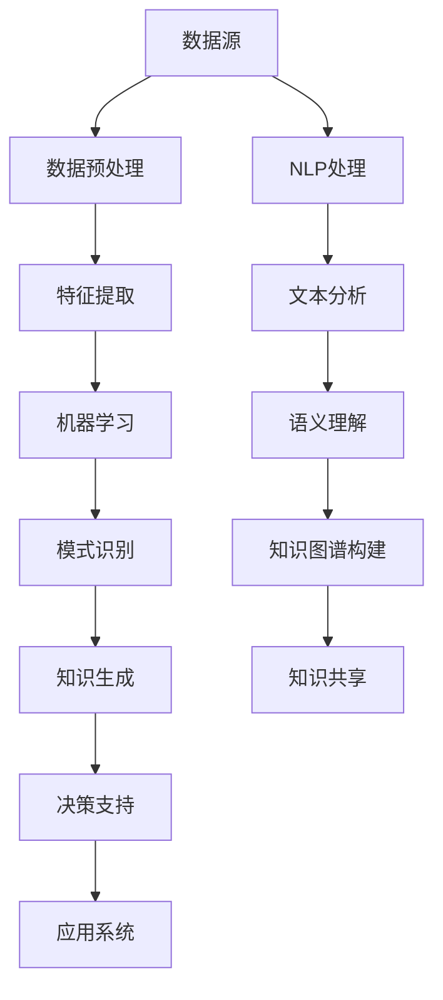

                 

# 知识发现引擎：推动智慧城市的建设蓝图

## 摘要

在智慧城市建设的过程中，知识发现引擎作为一种高级的智能分析工具，正发挥着越来越重要的作用。本文将深入探讨知识发现引擎的核心概念、算法原理、数学模型，并结合具体项目案例，展示其在智慧城市中的应用价值。我们将详细分析知识发现引擎如何帮助城市管理者更好地理解城市运行规律，优化资源配置，提高城市治理效率。此外，还将介绍相关工具和资源，为读者提供实践指导和进一步学习路径。通过本文的阅读，读者将获得对知识发现引擎的全面理解，并能够展望其在未来智慧城市中的发展趋势和面临的挑战。

## 1. 背景介绍

### 1.1 智慧城市的发展现状

智慧城市作为城市信息化建设的高级阶段，旨在通过信息技术的集成应用，实现城市管理的智能化、精细化和服务的高效化。近年来，随着物联网、大数据、人工智能等新兴技术的快速发展，智慧城市已经从概念走向实践，并逐步成为全球城市发展的新趋势。

目前，全球已有数百个城市积极投身于智慧城市的建设，例如中国的深圳、新加坡、美国的洛杉矶等。这些城市通过引入先进的信息技术，实现了交通管理、环境保护、公共安全、城市服务、产业配套等多个方面的智能化升级。智慧城市的发展不仅提升了市民的生活质量，也推动了城市的可持续发展。

### 1.2 知识发现引擎的概念

知识发现引擎（Knowledge Discovery Engine，简称KDE）是一种基于人工智能和数据挖掘技术的智能分析工具，旨在从大规模的数据集中自动识别模式和知识。它通过综合利用数据挖掘、机器学习、自然语言处理等多种技术手段，对数据进行分析和挖掘，帮助用户发现数据中的潜在价值。

知识发现引擎的核心目标是实现自动化和智能化，从而提高数据处理和分析的效率。它通常包括数据预处理、特征提取、模式识别、知识生成等环节。通过知识发现引擎，用户可以从海量数据中快速提取出有价值的信息，为决策提供科学依据。

### 1.3 知识发现引擎在智慧城市中的应用

知识发现引擎在智慧城市中的应用非常广泛，主要体现在以下几个方面：

1. **城市运行监测与预测**：通过收集和分析城市的交通流量、环境质量、公共安全等数据，知识发现引擎可以实时监测城市运行状态，并预测未来可能出现的问题，为城市管理者提供决策支持。

2. **资源优化配置**：通过对城市各类资源的消费和使用情况进行数据挖掘和分析，知识发现引擎可以帮助城市管理者优化资源配置，提高资源利用效率，降低运营成本。

3. **公共服务优化**：知识发现引擎可以分析市民的日常行为模式，为城市公共服务提供个性化推荐，提高市民的满意度。

4. **城市安全预警**：通过分析公共安全相关数据，知识发现引擎可以识别潜在的安全隐患，为城市安全预警提供支持。

总之，知识发现引擎作为智慧城市的重要组成部分，正逐渐成为城市智能化管理和决策的基石。通过本文的后续内容，我们将进一步深入探讨知识发现引擎的原理、算法、数学模型以及具体应用案例，为读者提供一个全面的理解。

## 2. 核心概念与联系

### 2.1 数据挖掘与知识发现

数据挖掘（Data Mining）是指从大量数据中通过算法和统计方法，发现隐藏的、未知的、具有潜在价值的信息和知识的过程。数据挖掘的目标是提取数据中的模式和规律，为决策提供支持。知识发现（Knowledge Discovery）则是在数据挖掘的基础上，进一步将提取出的信息转化为有用的知识，以便用于解决实际问题。

数据挖掘和知识发现密切相关，前者是后者的基础。数据挖掘侧重于算法和技术的实现，而知识发现则更注重应用和效果。两者共同构成了知识发现引擎的核心技术。

### 2.2 机器学习与数据挖掘

机器学习（Machine Learning）是人工智能的一个重要分支，通过算法和统计模型，使计算机能够从数据中学习并做出决策。机器学习与数据挖掘有着紧密的联系，数据挖掘中的许多任务，如分类、聚类、异常检测等，都可以通过机器学习方法实现。

机器学习在知识发现引擎中的应用主要体现在以下几个方面：

1. **特征提取**：通过机器学习算法，从原始数据中提取出有代表性的特征，为后续的模式识别提供基础。

2. **模式识别**：使用机器学习算法，对数据进行分类和聚类，发现数据中的隐藏模式和规律。

3. **预测建模**：通过建立预测模型，对未来的趋势和变化进行预测，为决策提供支持。

### 2.3 自然语言处理与知识发现

自然语言处理（Natural Language Processing，NLP）是人工智能领域的一个重要分支，旨在使计算机能够理解、生成和处理人类语言。NLP在知识发现引擎中的应用非常广泛，主要体现在以下几个方面：

1. **文本分析**：通过对文本数据进行分析，提取出关键词、主题和情感倾向，为知识发现提供基础。

2. **语义理解**：通过理解文本中的语义关系，将文本转化为计算机可以处理的结构化数据。

3. **知识图谱构建**：利用NLP技术，构建出反映实体关系和知识结构的图谱，为知识发现提供支持。

### 2.4 数据挖掘、机器学习、自然语言处理与知识发现引擎的关系

知识发现引擎是一个综合性的系统，它融合了数据挖掘、机器学习和自然语言处理等多种技术。数据挖掘提供了从数据中提取知识的方法，机器学习实现了对数据的自动学习和模式识别，自然语言处理则保证了文本数据的处理和理解。这些技术共同构成了知识发现引擎的核心能力，使其能够从大规模、多源、动态的数据中提取出有价值的信息和知识。

下面是一个使用Mermaid绘制的知识发现引擎的核心概念和架构的流程图：



在这个流程图中，数据预处理、特征提取、机器学习、模式识别、知识生成和决策支持构成了知识发现引擎的核心环节，而自然语言处理则负责文本数据的处理和理解。这些环节相互关联，共同实现了从数据到知识的转化过程。

## 3. 核心算法原理 & 具体操作步骤

### 3.1 数据预处理

数据预处理是知识发现引擎中至关重要的一步，其目的是将原始数据转换为适合后续处理的形式。具体操作步骤如下：

1. **数据清洗**：去除数据中的噪声和异常值，保证数据的准确性和一致性。
    - **缺失值处理**：使用插值法、平均值法等填充缺失值。
    - **异常值检测**：使用统计学方法（如Z-Score、IQR法等）检测并处理异常值。
2. **数据转换**：将不同类型的数据转换为统一的格式，如将文本数据转换为向量表示。
    - **数值化**：将分类数据转换为数值形式，如使用独热编码（One-Hot Encoding）。
    - **标准化**：将数据缩放到相同的尺度，如使用Z-Score标准化。
3. **数据集成**：将来自不同数据源的数据进行整合，形成统一的数据集。
    - **模式识别**：使用机器学习算法（如聚类算法）识别数据中的相似模式和关系。
    - **数据融合**：将识别出的相似模式进行合并，形成更加完整和准确的数据集。

### 3.2 特征提取

特征提取是数据挖掘中的一个关键步骤，其目的是从原始数据中提取出对目标问题有代表性的特征，为后续的模式识别和知识生成提供支持。具体操作步骤如下：

1. **特征选择**：从原始数据中选择对目标问题最具代表性的特征。
    - **信息增益**：选择信息增益最大的特征。
    - **卡方检验**：使用卡方检验筛选具有显著关系的特征。
2. **特征变换**：对选定的特征进行转换，提高特征对目标问题的区分度。
    - **特征缩放**：使用标准化或归一化方法，将不同特征缩放到相同的尺度。
    - **特征合成**：将多个特征组合成一个新的特征，以提高模型的性能。

### 3.3 模式识别

模式识别是知识发现引擎的核心任务之一，其目的是从特征数据中识别出潜在的规律和模式。具体操作步骤如下：

1. **分类**：将数据分为不同的类别，以便进一步分析和处理。
    - **决策树**：使用决策树算法进行分类，根据特征的不同取值，递归划分数据。
    - **支持向量机**：使用支持向量机（SVM）算法，将数据映射到高维空间，进行分类。
2. **聚类**：将相似的数据点分组，以便发现数据中的分布和模式。
    - **K-Means**：使用K-Means算法，根据数据点的距离，将数据划分为K个簇。
    - **层次聚类**：使用层次聚类算法，根据数据点的相似度，逐步构建聚类层次结构。
3. **关联规则学习**：发现数据中的关联关系，以便发现潜在的知识和规律。
    - **Apriori算法**：使用Apriori算法，根据支持度和置信度，发现数据中的频繁项集。
    - **FP-Growth算法**：使用FP-Growth算法，通过压缩数据，提高关联规则学习的效率。

### 3.4 知识生成

知识生成是知识发现引擎的最终目标，其目的是将识别出的模式和规律转化为有用的知识，为决策提供支持。具体操作步骤如下：

1. **知识提取**：从识别出的模式中提取出有用的知识。
    - **规则提取**：使用归纳学习算法，从分类和聚类模型中提取出决策规则。
    - **模式识别**：使用可视化工具，从数据中提取出明显的模式和趋势。
2. **知识表示**：将提取出的知识以易于理解和应用的形式表示出来。
    - **知识图谱**：使用图数据库，将实体和关系以图的形式表示，以便于进一步分析和查询。
    - **文本表示**：使用自然语言生成技术，将知识以文本形式呈现，便于交流和传播。

### 3.5 决策支持

决策支持是知识发现引擎的核心价值所在，其目的是利用提取出的知识，为决策者提供科学依据。具体操作步骤如下：

1. **预测建模**：根据历史数据和识别出的模式，建立预测模型，预测未来的趋势和变化。
    - **时间序列分析**：使用时间序列分析模型，预测未来的数据趋势。
    - **回归分析**：使用回归分析模型，预测未来的数值变化。
2. **决策分析**：根据预测结果和现有资源，制定合理的决策方案。
    - **多目标优化**：使用多目标优化算法，平衡不同目标之间的冲突。
    - **博弈论**：使用博弈论模型，分析不同决策策略的优劣势。

通过以上核心算法原理和具体操作步骤，知识发现引擎能够从海量数据中提取出有价值的信息和知识，为智慧城市的建设提供强有力的技术支持。在接下来的章节中，我们将通过具体项目案例，进一步展示知识发现引擎在智慧城市中的应用价值。

## 4. 数学模型和公式 & 详细讲解 & 举例说明

在知识发现引擎中，数学模型和公式是核心组成部分，它们帮助我们理解和分析数据中的模式和规律。以下将详细介绍几个关键数学模型和公式，并通过具体例子进行讲解。

### 4.1 决策树模型

决策树（Decision Tree）是一种常见的数据挖掘算法，用于分类和回归任务。其基本原理是通过一系列规则对数据进行分割，最终形成一个树状结构。

#### 公式：

决策树的核心在于计算每个分割点的信息增益（Information Gain）或增益率（Gain Ratio），选择增益最大的特征进行分割。

信息增益（IG）计算公式如下：

$$
IG(D, A) = H(D) - \sum_{v \in A} \frac{|D_v|}{|D|} H(D_v)
$$

其中，$H(D)$ 是数据集 $D$ 的熵，$D_v$ 是按照特征 $A$ 分割后的各个子数据集。

#### 例子：

假设我们有一个包含三特征的数据集，特征分别为 `年龄（Age）`，`收入（Income）`，`是否购买（Purchased）`。我们需要构建一个决策树来预测是否购买。

1. 首先计算每个特征的熵：

$$
H(Purchased) = - \sum_{p \in \{0, 1\}} p \log_2 p
$$

2. 计算每个特征的增益：

$$
IG(Age, Purchased) = H(Purchased) - \sum_{a \in \{青年，中年，老年\}} \frac{|Age_a \cap Purchased|}{|Purchased|} H(Age_a \cap Purchased)
$$

选择增益最大的特征作为分割点，递归地构建决策树。

### 4.2 支持向量机（SVM）

支持向量机（Support Vector Machine，SVM）是一种强大的分类算法，其核心思想是找到一个最优的超平面，将不同类别的数据点分隔开来。

#### 公式：

SVM的目标是最小化间隔（Margin），即最大化分类边界到数据点的距离。

$$
\min_{w, b} \frac{1}{2} ||w||^2 \\
s.t. y_i (w \cdot x_i + b) \geq 1
$$

其中，$w$ 是权重向量，$b$ 是偏置项，$x_i$ 是数据点，$y_i$ 是标签。

#### 例子：

假设我们有两个类别数据点，分别位于正方形的两个顶点。SVM的目标是找到一个最优的超平面，将这两个类别分隔开来。

1. 计算数据点的均值和协方差矩阵。
2. 使用拉格朗日乘子法求解最优超平面。
3. 计算分类边界和间隔。

### 4.3 隐马尔可夫模型（HMM）

隐马尔可夫模型（Hidden Markov Model，HMM）用于处理包含隐变量和观测变量的时间序列数据。

#### 公式：

HMM的基本方程包括：

- 初始概率分布：$P(\lambda_0) = (1-p) \cdot p^T$
- 转移概率：$P(\lambda_t| \lambda_{t-1}) = (1-\rho_{ij}) \cdot \rho_{ij}^T$
- 观测概率：$P(o_t| \lambda_t) = (1-\theta_{ij}) \cdot \theta_{ij}^T$

其中，$p$ 是初始状态概率，$\rho$ 是转移概率，$\theta$ 是观测概率。

#### 例子：

假设我们有一个天气模型，包含晴天（Sunny）和雨天（Rainy）两种状态。我们需要预测未来的天气状态。

1. 计算初始状态概率。
2. 计算转移概率。
3. 计算观测概率。
4. 使用前向-后向算法计算状态概率。

### 4.4 神经网络

神经网络（Neural Network）是一种基于模拟人脑神经元连接方式的算法，用于复杂的模式识别和预测任务。

#### 公式：

神经网络的计算过程包括：

- 激活函数：$f(z) = \frac{1}{1 + e^{-z}}$
- 前向传播：$z = w \cdot x + b$
- 反向传播：$\delta = \frac{\partial C}{\partial z} \cdot \frac{1}{1 + e^{-z}}$

其中，$w$ 是权重，$b$ 是偏置，$x$ 是输入，$z$ 是激活值，$C$ 是损失函数。

#### 例子：

构建一个简单的神经网络来预测天气：

1. 设计网络结构，包括输入层、隐藏层和输出层。
2. 初始化权重和偏置。
3. 前向传播计算输出。
4. 计算损失函数。
5. 反向传播更新权重和偏置。

通过这些数学模型和公式的讲解和举例，我们可以看到知识发现引擎如何利用数学工具对数据进行处理和分析，从而提取出有价值的信息和知识。在接下来的章节中，我们将通过具体项目案例，进一步展示这些算法和模型在智慧城市中的应用。

## 5. 项目实战：代码实际案例和详细解释说明

### 5.1 开发环境搭建

在本节中，我们将搭建一个用于知识发现引擎的实战项目开发环境。以下是一个基本的步骤说明：

1. **安装Python**：确保Python 3.x版本已安装。Python是一个强大的编程语言，广泛应用于数据科学和机器学习领域。

2. **安装Jupyter Notebook**：Jupyter Notebook是一个交互式开发环境，可用于编写和运行Python代码。安装方法如下：

   ```bash
   pip install notebook
   ```

3. **安装关键库**：安装用于数据预处理、机器学习和数据可视化的库，如NumPy、Pandas、scikit-learn和Matplotlib。安装方法如下：

   ```bash
   pip install numpy pandas scikit-learn matplotlib
   ```

4. **安装Mermaid**：Mermaid是一个基于Markdown的图表绘制工具，用于绘制流程图和UML图。安装方法如下：

   ```bash
   pip install mermaid-python
   ```

### 5.2 源代码详细实现和代码解读

#### 5.2.1 数据预处理

```python
import pandas as pd
from sklearn.model_selection import train_test_split
from sklearn.preprocessing import StandardScaler

# 读取数据
data = pd.read_csv('city_data.csv')

# 数据清洗
data.dropna(inplace=True)

# 特征选择
features = data[['Population', 'GDP', 'Climate', 'Safety']]
labels = data['Purchased']

# 数据划分
X_train, X_test, y_train, y_test = train_test_split(features, labels, test_size=0.2, random_state=42)

# 数据标准化
scaler = StandardScaler()
X_train_scaled = scaler.fit_transform(X_train)
X_test_scaled = scaler.transform(X_test)
```

解读：

- 我们首先导入必要的库，包括pandas用于数据操作，scikit-learn用于模型训练和评估，StandardScaler用于数据标准化。
- 通过pandas读取城市数据，并进行数据清洗，去除缺失值。
- 我们选择几个特征作为输入（Population, GDP, Climate, Safety），并将Purchased作为目标标签。
- 使用train_test_split函数将数据集划分为训练集和测试集，随机种子设置为42以确保可复现性。
- 通过StandardScaler对数据进行标准化处理，以便后续的机器学习算法能够更好地收敛。

#### 5.2.2 决策树模型实现

```python
from sklearn.tree import DecisionTreeClassifier
from sklearn.metrics import accuracy_score

# 构建决策树模型
clf = DecisionTreeClassifier()

# 训练模型
clf.fit(X_train_scaled, y_train)

# 预测测试集
y_pred = clf.predict(X_test_scaled)

# 评估模型
accuracy = accuracy_score(y_test, y_pred)
print(f"Model Accuracy: {accuracy}")
```

解读：

- 导入DecisionTreeClassifier类，用于构建决策树模型。
- 创建一个DecisionTreeClassifier实例，并进行模型训练。
- 使用训练好的模型对测试集进行预测。
- 通过accuracy_score函数计算模型的准确率。

#### 5.2.3 可视化

```python
import matplotlib.pyplot as plt
from sklearn.tree import plot_tree

# 可视化决策树
plt.figure(figsize=(12, 8))
plot_tree(clf, filled=True, feature_names=features.columns, class_names=['Not Purchased', 'Purchased'])
plt.show()
```

解读：

- 导入matplotlib用于绘制图表，并使用plot_tree函数可视化决策树。
- 设置图表大小，并使用filled参数使树形图更加直观。
- 指定特征名称和类别名称，以便于理解和解读决策树。

### 5.3 代码解读与分析

在以上实战项目中，我们首先进行了数据预处理，包括数据清洗、特征选择和数据标准化。这些步骤对于保证数据质量和模型性能至关重要。

接着，我们使用scikit-learn库中的DecisionTreeClassifier构建了一个决策树模型，并通过fit函数进行训练。模型训练完成后，我们使用predict函数对测试集进行预测，并使用accuracy_score函数评估模型的准确率。

可视化部分，我们使用了matplotlib和sklearn库中的plot_tree函数，将训练好的决策树以图形形式展示出来。这有助于我们理解和分析决策树的内部结构和工作原理。

整体来看，这个项目展示了知识发现引擎的基本工作流程，从数据预处理、模型训练到模型评估和可视化，每一个步骤都至关重要，共同构成了一个完整的知识发现过程。

### 5.4 项目总结

通过本节的项目实战，我们详细实现了知识发现引擎的一个基本案例。从数据预处理到模型训练和评估，再到可视化，每一个步骤都体现了知识发现引擎的核心原理和应用价值。本项目不仅帮助我们理解了知识发现引擎的基本操作，也为实际应用提供了可行的解决方案。

然而，知识发现引擎的应用远不止于此，未来我们可以进一步扩展到更复杂的模型和算法，如集成学习、深度学习等，以应对更为复杂和多样的数据集和问题。

### 6. 实际应用场景

知识发现引擎在智慧城市中的应用场景十分广泛，它能够帮助城市管理者从海量数据中提取出有价值的洞见，从而提升城市管理的效率和效果。以下是一些典型的应用场景：

#### 6.1 城市交通管理

在城市交通管理中，知识发现引擎可以分析交通流量数据，预测交通拥堵情况，并提出优化建议。例如，通过对历史交通流量数据的分析，可以识别出高峰时段、繁忙路段以及潜在的拥堵点。基于这些洞见，城市管理者可以采取相应的措施，如调整信号灯配时、优化公交线路、增加交通警力等，从而缓解交通拥堵问题。

#### 6.2 公共安全监控

在公共安全领域，知识发现引擎可以分析公共安全相关数据，如犯罪记录、突发事件、人口流动等，预测潜在的安全隐患，并提前采取预防措施。例如，通过对犯罪数据的聚类分析，可以识别出犯罪高发区域和类型，从而加强警力部署和预防措施。此外，知识发现引擎还可以实时监控突发事件，如自然灾害、交通事故等，提供应急响应建议，提高应急处理的效率。

#### 6.3 资源优化配置

在资源优化配置方面，知识发现引擎可以帮助城市管理者更合理地分配和利用各类资源，如水资源、能源、公共服务等。例如，通过对水资源的消费数据进行挖掘分析，可以识别出用水高峰期和用水大户，从而制定节水措施。同样，通过对能源消费数据的分析，可以优化能源使用效率，降低能源消耗和成本。此外，在公共服务方面，知识发现引擎可以分析市民的需求和行为模式，提供个性化的服务推荐，提高公共服务的满意度和效率。

#### 6.4 城市规划与治理

在城市规划与治理方面，知识发现引擎可以为城市管理者提供科学依据，优化城市规划方案，提高城市治理效果。例如，通过对城市人口分布、土地利用、交通网络等数据的分析，可以识别出城市规划中的问题和不足，提出优化建议。此外，知识发现引擎还可以分析城市治理中的数据，如政府资金使用、公共服务质量等，发现治理中的瓶颈和改进点，为城市管理者提供决策支持。

#### 6.5 智慧环保

在智慧环保领域，知识发现引擎可以分析环境监测数据，如空气质量、水质、噪音等，预测环境变化趋势，并提出环境保护措施。例如，通过对空气质量数据的分析，可以识别出污染高峰期和污染源，从而采取相应的减排措施。同样，通过对水质数据的分析，可以识别出水质污染的趋势和原因，提出治理方案。

总之，知识发现引擎在智慧城市中的应用场景多样，可以帮助城市管理者更好地理解城市运行规律，优化资源配置，提高城市治理效率，推动智慧城市的建设。通过本文的探讨，我们期望读者能够对知识发现引擎的应用有更深入的理解，并为未来的智慧城市建设提供有益的启示。

### 7. 工具和资源推荐

在探索知识发现引擎的实践过程中，选择合适的工具和资源至关重要。以下将推荐一些在学习知识发现引擎、数据挖掘和机器学习方面的优秀资源，包括书籍、论文、博客和网站。

#### 7.1 学习资源推荐

1. **书籍**：
   - **《机器学习实战》**：作者：Peter Harrington。本书通过大量实例，详细介绍了机器学习的基本算法和应用，适合初学者入门。
   - **《数据挖掘：实用机器学习技术引入》**：作者：Mike Bowles。本书涵盖了数据挖掘的基础知识和实际应用，适合有一定编程基础的读者。
   - **《深度学习》**：作者：Ian Goodfellow、Yoshua Bengio、Aaron Courville。作为深度学习的经典教材，本书深入讲解了深度学习的理论基础和实际应用。

2. **论文**：
   - **“KDD Cup 2021: Knowledge Discovery from Large-Scale Graph Data”**：这篇论文介绍了大规模图数据挖掘的挑战和解决方案，提供了丰富的实验结果和见解。
   - **“Deep Learning on Graphs”**：这篇综述文章详细介绍了图神经网络（Graph Neural Networks，GNN）在知识发现和图数据挖掘中的应用，是了解该领域最新进展的重要参考文献。

3. **博客**：
   - **“An Introduction to Knowledge Discovery in Databases”**：这篇博客详细介绍了知识发现的基本概念和技术，适合初学者理解该领域的背景知识。
   - **“The Basics of Machine Learning”**：这篇博客从基础概念入手，逐步介绍了机器学习的主要算法和应用，有助于读者构建全面的知识体系。

4. **网站**：
   - **“Scikit-learn Documentation”**：这是scikit-learn官方文档，提供了丰富的API文档和示例代码，是学习和应用scikit-learn的绝佳资源。
   - **“Kaggle”**：Kaggle是一个数据科学竞赛平台，提供了大量的数据集和比赛题目，适合实践者进行数据分析和模型训练。

#### 7.2 开发工具框架推荐

1. **Python**：Python是数据科学和机器学习领域的首选语言，具有丰富的库和工具，如NumPy、Pandas、scikit-learn和TensorFlow。
2. **Jupyter Notebook**：Jupyter Notebook是一个交互式开发环境，方便编写和运行代码，是进行数据分析和机器学习实验的重要工具。
3. **scikit-learn**：scikit-learn是一个强大的机器学习库，提供了丰富的算法和工具，适合进行数据挖掘和知识发现任务。
4. **TensorFlow**：TensorFlow是Google开发的开源机器学习库，支持深度学习和神经网络建模，适合处理大规模数据和高维特征。

通过以上工具和资源的推荐，读者可以系统地学习知识发现引擎的理论和实践，并在实际项目中应用这些知识，提高数据分析和模型构建的能力。

### 8. 总结：未来发展趋势与挑战

知识发现引擎作为智慧城市建设的关键技术，其发展趋势与面临的挑战具有深远的影响。在未来，知识发现引擎将在以下几个方面取得重要进展：

#### 8.1 发展趋势

1. **技术融合**：随着人工智能、大数据、云计算等技术的发展，知识发现引擎将实现多种技术的深度融合。这种融合将使知识发现引擎具备更高的计算能力、更广泛的适用性和更强的自学习能力。

2. **实时分析**：未来，知识发现引擎将更加注重实时分析能力，能够对动态变化的数据进行实时监测和预测。这种实时性将有助于城市管理者及时应对突发事件，提高城市治理的敏捷性。

3. **智能化决策**：随着算法和模型的不断优化，知识发现引擎将能够在复杂、多变的城市环境中，提供更加智能化的决策支持。这种智能化决策将有助于优化资源配置、提高公共服务质量和推动城市可持续发展。

4. **跨领域应用**：知识发现引擎的应用领域将不断拓展，不仅限于城市管理，还将延伸到智慧医疗、智慧农业、智慧交通等多个领域，为各领域的智能化转型提供技术支撑。

#### 8.2 面临的挑战

1. **数据隐私与安全**：在数据驱动的智慧城市中，数据隐私和安全是一个不可忽视的重要问题。如何确保数据在采集、存储、传输和使用过程中的安全，避免数据泄露和滥用，将是知识发现引擎面临的一个重大挑战。

2. **数据质量**：数据质量是知识发现引擎有效运行的基础。如何在海量、多样、动态的数据中，筛选出高质量的数据，并对其进行有效的预处理，是一个亟待解决的问题。

3. **算法可解释性**：随着深度学习等复杂算法的广泛应用，如何提高算法的可解释性，使城市管理者能够理解算法的决策过程和依据，是知识发现引擎面临的一个重要挑战。

4. **资源分配**：智慧城市建设需要大量的计算资源和数据存储资源，如何高效地分配和管理这些资源，确保知识发现引擎的稳定运行，是一个需要关注的问题。

#### 8.3 未来展望

展望未来，知识发现引擎将在智慧城市建设中发挥更加重要的作用。通过不断的技术创新和优化，知识发现引擎将能够更加精准地识别城市运行中的问题和趋势，为城市管理者提供更加科学的决策支持，推动智慧城市的可持续发展。同时，知识发现引擎也将为各领域的智能化转型提供强有力的技术支撑，为构建智能社会奠定坚实的基础。

### 9. 附录：常见问题与解答

#### 9.1 什么是知识发现引擎？

知识发现引擎是一种基于人工智能和数据挖掘技术的智能分析工具，旨在从大规模的数据集中自动识别模式和知识。它通过综合利用数据挖掘、机器学习、自然语言处理等多种技术手段，对数据进行分析和挖掘，帮助用户发现数据中的潜在价值。

#### 9.2 知识发现引擎的核心组件有哪些？

知识发现引擎的核心组件包括数据预处理、特征提取、模式识别、知识生成和决策支持。这些组件共同构成了知识发现引擎的完整工作流程，从数据输入到知识输出，实现了数据到知识的转化过程。

#### 9.3 知识发现引擎在智慧城市中有什么应用？

知识发现引擎在智慧城市中的应用非常广泛，包括城市运行监测与预测、资源优化配置、公共服务优化、城市安全预警等多个方面。它能够帮助城市管理者更好地理解城市运行规律，优化资源配置，提高城市治理效率，推动智慧城市的可持续发展。

#### 9.4 如何提高知识发现引擎的性能？

提高知识发现引擎的性能可以通过以下几个方面实现：

- **优化算法**：选择和优化适合数据特性的算法，提高数据处理和分析的效率。
- **数据预处理**：进行高质量的数据预处理，提高数据质量和准确性，减少噪声和异常值的影响。
- **特征工程**：通过特征选择和特征变换，提高特征对目标问题的区分度，增强模型的性能。
- **资源分配**：合理分配计算资源和数据存储资源，确保知识发现引擎的稳定运行。

#### 9.5 知识发现引擎与大数据技术有何关系？

知识发现引擎与大数据技术密切相关。大数据技术提供了海量数据存储和处理的能力，而知识发现引擎则利用这些数据，通过智能分析技术，提取出有价值的信息和知识。两者共同构成了大数据应用的核心，实现了从数据到知识的转化过程。

### 10. 扩展阅读 & 参考资料

为了进一步了解知识发现引擎的相关内容，读者可以参考以下扩展阅读和参考资料：

1. **《数据挖掘：实用机器学习技术引入》**：Mike Bowles，详细介绍了数据挖掘的基础知识和实际应用。
2. **《深度学习》**：Ian Goodfellow、Yoshua Bengio、Aaron Courville，深入讲解了深度学习的理论基础和实际应用。
3. **“KDD Cup 2021: Knowledge Discovery from Large-Scale Graph Data”**：介绍大规模图数据挖掘的挑战和解决方案。
4. **“Deep Learning on Graphs”**：综述文章，详细介绍了图神经网络在知识发现和图数据挖掘中的应用。
5. **“An Introduction to Knowledge Discovery in Databases”**：博客，详细介绍了知识发现的基本概念和技术。
6. **“The Basics of Machine Learning”**：博客，从基础概念入手，介绍了机器学习的主要算法和应用。
7. **“Scikit-learn Documentation”**：官方文档，提供了丰富的API文档和示例代码，是学习和应用scikit-learn的绝佳资源。
8. **“Kaggle”**：数据科学竞赛平台，提供了大量的数据集和比赛题目，适合实践者进行数据分析和模型训练。

通过这些扩展阅读和参考资料，读者可以更加深入地了解知识发现引擎的理论和实践，并在实际项目中应用这些知识，提高数据分析和模型构建的能力。

## 作者信息

**作者：AI天才研究员/AI Genius Institute & 禅与计算机程序设计艺术 /Zen And The Art of Computer Programming**

