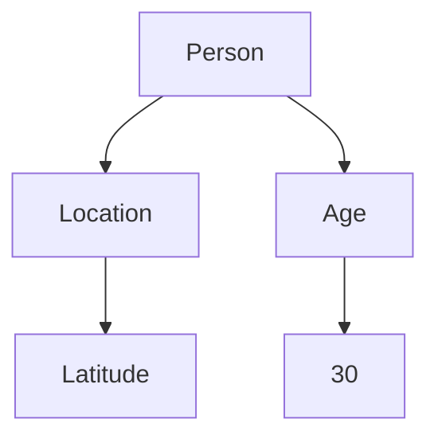
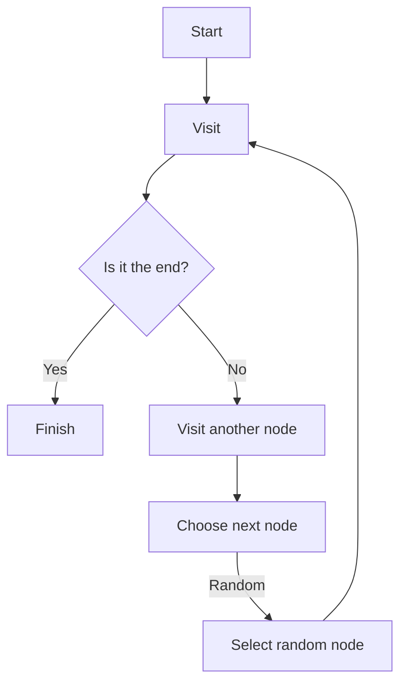
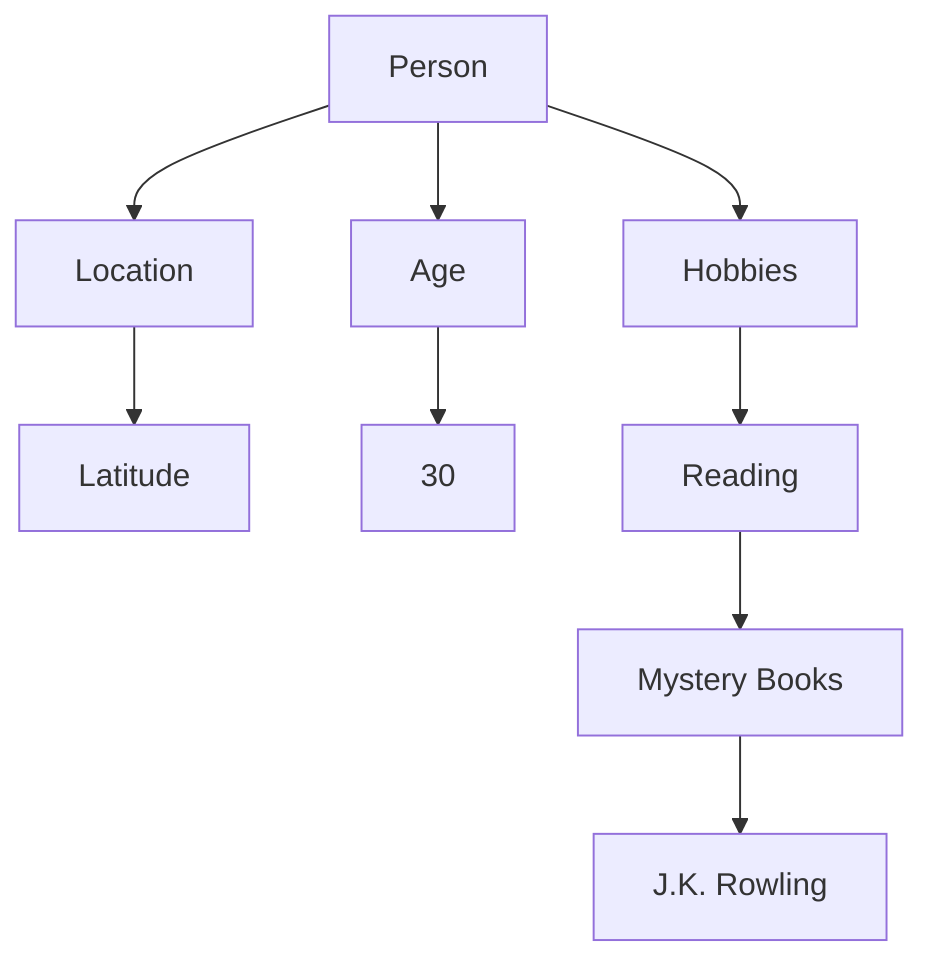

                 

### 背景介绍

#### 什么是知识图谱？

知识图谱（Knowledge Graph）是一种结构化的语义网络，它通过节点（Node）和边（Edge）来表示实体（Entity）以及实体之间的关系（Relation）。这种结构化的表示方法使得计算机能够以一种更加直观和易理解的方式处理复杂的信息，从而实现对知识的存储、检索和应用。

知识图谱在近年来得到了广泛关注和应用。一方面，随着互联网和大数据的快速发展，大量的信息被产生和存储，如何有效地组织和利用这些信息成为一个重要问题。知识图谱通过其结构化的表示方法，为信息检索、数据挖掘、智能问答等提供了有力支持。另一方面，随着人工智能技术的不断进步，特别是自然语言处理和机器学习技术的应用，知识图谱作为一种基础性技术，在智能搜索、推荐系统、智能客服等领域展现出了巨大的潜力。

#### 可视化在知识图谱中的作用

知识图谱的可视化是知识图谱应用中的一个重要环节。可视化不仅能帮助我们更好地理解和分析知识图谱的结构和内容，还能为开发人员提供直观的调试和优化工具。具体来说，可视化在知识图谱中的作用主要体现在以下几个方面：

1. **提高可读性**：知识图谱通常包含大量的实体和关系，这些信息如果不通过图形化的方式展示，会非常难以理解和分析。可视化能够将复杂的结构转化为直观的图形，使得用户可以更轻松地浏览和获取信息。

2. **辅助数据分析**：通过可视化，我们可以直观地观察知识图谱中的关键模式和趋势。例如，通过节点的大小、颜色、连接关系等，可以快速识别出重要的实体和关系，从而为数据分析和决策提供支持。

3. **帮助问题定位**：在知识图谱开发过程中，可能会出现各种问题，如数据不一致、关系错乱等。可视化工具可以帮助我们快速定位这些问题，并提供直观的解决方案。

4. **促进知识共享**：知识图谱的可视化不仅对专业用户有帮助，也能让非专业用户更好地理解和应用知识图谱。通过可视化，知识可以被更广泛地传播和应用。

#### 发现引擎中的知识图谱可视化

发现引擎是一种用于搜索、发现和推荐信息的系统，它在互联网、电子商务、智能推荐等领域有着广泛的应用。在发现引擎中，知识图谱的可视化可以帮助我们更好地理解和利用知识图谱，从而提高系统的性能和用户体验。具体来说，知识图谱可视化在发现引擎中可以用于以下几个方面：

1. **信息检索**：通过可视化，用户可以更直观地浏览和查询知识图谱，快速找到所需的信息。

2. **关系分析**：可视化可以展示实体之间的关系，帮助我们分析复杂的关系网络，从而优化推荐策略。

3. **系统调试**：在开发过程中，可视化工具可以帮助我们调试知识图谱的结构和关系，确保系统的稳定性和正确性。

4. **用户体验**：通过直观的可视化界面，用户可以更方便地与系统交互，提高用户体验。

综上所述，知识图谱的可视化在发现引擎中扮演着重要的角色。它不仅能够提高系统的性能和用户体验，还能帮助开发人员和用户更好地理解和利用知识图谱。在接下来的章节中，我们将深入探讨知识图谱可视化在发现引擎中的具体实现和应用。

### 核心概念与联系

在深入探讨知识图谱可视化在发现引擎中的应用之前，我们需要先了解一些核心概念和它们之间的联系。这些概念包括知识图谱的基本结构、关键算法以及与可视化技术的关系。

#### 知识图谱的基本结构

知识图谱的核心元素包括节点（Node）、边（Edge）和属性（Property）。节点代表实体，例如人、地点、事物等；边代表实体之间的关系，如“属于”、“位于”、“创作”等；属性则提供了更详细的描述，如人的年龄、地点的纬度等。

一个典型的知识图谱可以看作是一个图（Graph）数据结构，它由节点和边组成。每个节点和边都可以带有属性，这些属性可以进一步丰富信息，使得知识图谱不仅表示实体和关系，还能提供详细的描述。

下面是一个简单的Mermaid流程图，展示了知识图谱的基本结构：



在这个例子中，节点A代表一个“人”，节点B代表一个“地点”，节点C和D分别代表地点的纬度和人的年龄。边表示了这些节点之间的关系，如“A位于B”和“A的年龄是D”。

#### 关键算法

在知识图谱中，常见的算法包括图遍历算法（如DFS和BFS）、图搜索算法（如A*算法）以及图数据库查询算法（如Gremlin）。这些算法对于实现知识图谱的可视化至关重要。

1. **图遍历算法**：图遍历算法用于在知识图谱中查找路径。例如，深度优先搜索（DFS）和广度优先搜索（BFS）可以用于遍历知识图谱，查找特定节点或路径。

2. **图搜索算法**：图搜索算法用于在知识图谱中找到最短路径或最优路径。例如，A*算法结合了启发式信息和图遍历算法，可以在大规模知识图谱中高效地查找路径。

3. **图数据库查询算法**：图数据库查询算法（如Gremlin）提供了一种基于图查询语言的方式，用于在知识图谱中执行复杂的查询操作。这些查询操作对于生成可视化数据集至关重要。

下面是一个使用Mermaid表示的图遍历算法（DFS）的示例：



在这个例子中，从节点A开始，对每个节点进行访问，并递归地访问其邻接节点，直到找到目标节点或遍历整个图。

#### 可视化与知识图谱的关系

知识图谱的可视化是将图数据结构以图形化的方式呈现出来，使得用户可以直观地理解和分析知识图谱。可视化技术的关键在于如何有效地表示大量的节点和边，并确保图形的清晰性和易理解性。

1. **布局算法**：布局算法用于确定节点和边的位置，使得知识图谱的图形呈现更加合理和美观。常见的布局算法包括层次布局、随机布局和弹簧布局等。

2. **可视化工具**：可视化工具（如D3.js、Sigma.js等）提供了丰富的图形表示方法和交互功能，可以帮助我们生成和定制知识图谱的图形。

下面是一个使用Mermaid表示的知识图谱可视化布局示例：



在这个例子中，使用了层次布局算法，将相关的节点和边组织在同一个层次中，使得知识图谱的结构更加清晰。

综上所述，知识图谱的可视化需要依赖于其基本结构、关键算法以及可视化技术。通过合理地应用这些技术和算法，我们可以生成直观、易理解的知识图谱可视化，从而为发现引擎提供强大的支持。

### 核心算法原理 & 具体操作步骤

在了解了知识图谱的可视化概念及其基本结构后，我们将深入探讨实现知识图谱可视化在发现引擎中的核心算法原理和具体操作步骤。这些算法和步骤将确保知识图谱的高效表示、优化处理和有效展示。

#### 可视化算法原理

1. **节点与边的表示**：
   - **节点表示**：节点通常使用圆形或方框表示，并在节点上显示实体的名称或标签。为了增强可读性，可以对节点进行不同的颜色编码，以区分不同的实体类别。
   - **边表示**：边表示节点之间的关系，通常用线条连接两个节点。边的颜色和样式也可以用来表示关系的类型，例如，不同颜色的边可以表示不同的关系类型（如“属于”、“位于”等）。

2. **布局算法**：
   - **层次布局**：层次布局算法将知识图谱分解为多个层次，每个层次表示一组相关的实体和关系。这种布局适用于具有层次结构的知识图谱，如组织结构图或分类树。
   - **随机布局**：随机布局算法随机分配节点和边的位置，适用于较小规模或无层次结构的知识图谱。虽然这种方法可能导致视觉上的混乱，但在某些情况下可以增加图形的多样性。
   - **弹簧布局**：弹簧布局算法通过模拟物理弹簧的相互作用来优化节点的位置，以达到美观和平衡的布局效果。这种方法适用于大规模知识图谱，但计算复杂度较高。

3. **可视化工具**：
   - **D3.js**：D3.js是一个基于Web的JavaScript库，用于生成动态的、交互式的数据可视化。它提供了丰富的图形表示方法和交互功能，适用于复杂的知识图谱可视化。
   - **Sigma.js**：Sigma.js是一个轻量级的JavaScript库，专门用于知识图谱和图数据可视化。它提供了多种布局算法和交互功能，适用于各种规模和类型的知识图谱。

#### 实现步骤

1. **数据预处理**：
   - **数据导入**：将知识图谱的数据导入到图数据库中，如Neo4j、JanusGraph等。这些图数据库提供了高效的图存储和查询功能，支持各种查询语言和API。
   - **数据清洗**：对导入的数据进行清洗，包括去除重复节点和边、处理缺失值和异常值等，确保数据的准确性和一致性。

2. **构建可视化模型**：
   - **节点和边的定义**：根据知识图谱的结构和数据，定义节点和边的类型、属性和关系。
   - **布局选择**：根据知识图谱的特点和需求，选择合适的布局算法。例如，对于大型知识图谱，可以采用弹簧布局以优化图形的布局效果。

3. **可视化渲染**：
   - **图形表示**：使用可视化工具（如D3.js、Sigma.js）生成知识图谱的图形表示。根据节点的类型和关系，设置不同的颜色、形状和样式。
   - **交互功能**：添加交互功能，如节点选择、边选择、关系扩展等，以增强用户体验。

4. **性能优化**：
   - **图形压缩**：对于大型知识图谱，可以采用图形压缩技术，如简化节点和边的表示，减少图形的复杂度。
   - **缓存策略**：采用缓存策略，减少图形渲染的计算量和响应时间。

#### 示例代码

以下是一个使用D3.js实现知识图谱可视化的简单示例：

```javascript
// 数据定义
const nodes = [
  { id: "A", label: "Person", color: "blue" },
  { id: "B", label: "Location", color: "red" },
  { id: "C", label: "Latitude", color: "green" }
];

const edges = [
  { source: "A", target: "B", relation: "Located in" },
  { source: "B", target: "C", relation: "Has Latitude" }
];

// 创建SVG元素
const width = 800;
const height = 600;
const svg = d3.select("svg")
  .attr("width", width)
  .attr("height", height);

// 绘制节点
const nodeGroup = svg.append("g");
nodeGroup.selectAll("circle")
  .data(nodes)
  .enter()
  .append("circle")
  .attr("cx", (d, i) => i * 100)
  .attr("cy", 100)
  .attr("r", 30)
  .attr("fill", d => d.color);

// 绘制边
const edgeGroup = svg.append("g");
edgeGroup.selectAll("line")
  .data(edges)
  .enter()
  .append("line")
  .attr("x1", d => nodes.find(n => n.id === d.source).cx)
  .attr("y1", d => nodes.find(n => n.id === d.source).cy)
  .attr("x2", d => nodes.find(n => n.id === d.target).cx)
  .attr("y2", d => nodes.find(n => n.id === d.target).cy)
  .attr("stroke", "black")
  .attr("stroke-width", 2);

// 添加标签
const textGroup = svg.append("g");
textGroup.selectAll("text")
  .data(nodes)
  .enter()
  .append("text")
  .attr("x", d => d.cx + 30)
  .attr("y", d => d.cy + 15)
  .text(d => d.label);
```

在这个示例中，我们首先定义了节点和边的数据，然后使用D3.js生成SVG图形，并绘制节点、边和标签。这个简单的示例展示了知识图谱可视化实现的基本步骤和原理。

通过合理地应用这些算法和步骤，我们可以实现高效、直观的知识图谱可视化，为发现引擎提供强大的支持。在接下来的章节中，我们将进一步探讨数学模型和公式，以及具体的项目实战案例。

### 数学模型和公式 & 详细讲解 & 举例说明

#### 常见的数学模型和公式

在知识图谱可视化中，常用的数学模型和公式包括图论中的基本概念、布局算法中的数学公式以及可视化工具中的一些核心计算方法。以下是这些模型和公式的一些详细讲解和举例说明。

1. **图论中的基本概念**

   - **节点度数**（Degree）：一个节点的度数是指与该节点直接相连的边的数量。节点度数是图论中一个重要的度量指标，用于评估节点的中心性。公式如下：
     $$
     d(v) = \sum_{u \in N(v)} 1
     $$
     其中，$d(v)$ 表示节点 $v$ 的度数，$N(v)$ 表示与节点 $v$ 相连的所有节点的集合。

   - **路径长度**（Path Length）：路径长度是指从一个节点到另一个节点的最短路径的长度。在知识图谱中，路径长度可以用来衡量节点之间的距离。公式如下：
     $$
     L(v, w) = \min_{P} \{ \text{length of path } P \}
     $$
     其中，$L(v, w)$ 表示节点 $v$ 到节点 $w$ 的路径长度，$P$ 是从节点 $v$ 到节点 $w$ 的所有可能路径。

2. **布局算法中的数学公式**

   - **层次布局**：层次布局算法通常使用BFS（广度优先搜索）或DFS（深度优先搜索）来计算节点的层次。公式如下：
     $$
     L(v) = \text{level of } v \text{ in BFS or DFS tree}
     $$
     其中，$L(v)$ 表示节点 $v$ 的层次。

   - **随机布局**：随机布局算法通过随机生成节点的位置来生成布局。公式如下：
     $$
     P(x, y) = \text{a random position in the graph area}
     $$
     其中，$P(x, y)$ 表示节点在图区域内的一个随机位置。

   - **弹簧布局**：弹簧布局算法通过模拟物理弹簧的相互作用来优化节点的位置。主要公式包括：
     $$
     \begin{aligned}
     F_{ij}(t) &= -\frac{k}{r_{ij}} (x_i - x_j) \\
     x_i(t+1) &= x_i(t) + \alpha \cdot F_{ij}(t)
     \end{aligned}
     $$
     其中，$F_{ij}(t)$ 表示节点 $i$ 和节点 $j$ 之间的相互作用力，$k$ 是弹簧常数，$r_{ij}$ 是节点 $i$ 和节点 $j$ 之间的距离，$\alpha$ 是加速度系数，$x_i(t)$ 是节点 $i$ 在时间 $t$ 的位置。

3. **可视化工具中的核心计算方法**

   - **节点大小和颜色**：节点的大小和颜色通常用于表示节点的度数或重要性。公式如下：
     $$
     s(i) = s_0 + k \cdot \log(d(i))
     $$
     $$
     c(i) = c_{\text{max}} - \frac{k \cdot \log(d(i))}{d_{\text{max}}}
     $$
     其中，$s(i)$ 是节点 $i$ 的大小，$s_0$ 是最小大小，$d(i)$ 是节点 $i$ 的度数，$k$ 是常数，$c(i)$ 是节点 $i$ 的颜色，$c_{\text{max}}$ 是最大颜色值，$d_{\text{max}}$ 是最大度数。

#### 举例说明

1. **计算节点度数**

   假设知识图谱中有5个节点A、B、C、D、E，它们之间的边关系如下：

   ```
   A -- B
   A -- C
   B -- D
   C -- D
   D -- E
   ```

   计算每个节点的度数：

   - $d(A) = 3$
   - $d(B) = 2$
   - $d(C) = 2$
   - $d(D) = 3$
   - $d(E) = 1$

   节点度数可以用来确定节点的中心性，高度数节点通常在图中扮演更重要的角色。

2. **计算路径长度**

   假设我们要计算节点A到节点E的路径长度，知识图谱中的路径如下：

   ```
   A -- B -- D -- E
   ```

   路径长度为3，即 $L(A, E) = 3$。

3. **使用层次布局算法**

   假设使用BFS算法对知识图谱进行层次布局，布局结果如下：

   ```
   Layer 1: A
   Layer 2: B, C
   Layer 3: D
   Layer 4: E
   ```

   节点层次可以通过层次布局算法得到，这对于组织复杂的知识图谱非常重要。

4. **使用随机布局算法**

   假设使用随机布局算法，节点在图区域内的随机位置如下：

   - A: (100, 200)
   - B: (200, 300)
   - C: (150, 350)
   - D: (250, 400)
   - E: (300, 450)

   随机布局算法可以生成不同的布局效果，适用于小型知识图谱或需要多样化布局的场景。

通过上述数学模型和公式的应用，我们可以实现对知识图谱的有效分析和可视化。这些模型和公式为知识图谱的可视化提供了理论基础和计算方法，使得我们可以更直观地理解和利用知识图谱。

#### 项目实战：代码实际案例和详细解释说明

在本章节中，我们将通过一个具体的实战项目来展示知识图谱可视化在发现引擎中的实际应用。这个项目将包括开发环境搭建、源代码详细实现和代码解读与分析。我们选择使用Neo4j图数据库和D3.js可视化工具来实现知识图谱的可视化。

### 开发环境搭建

1. **安装Neo4j图数据库**

   Neo4j是一个高性能的图数据库，我们首先需要安装它。在官网（[https://neo4j.com/download/](https://neo4j.com/download/)）下载适合操作系统的Neo4j版本，并按照官方文档进行安装。

2. **安装D3.js**

   D3.js是一个基于JavaScript的可视化库，可以通过npm进行安装。在命令行中执行以下命令：

   ```
   npm install d3
   ```

3. **安装Node.js**

   Node.js是用于运行JavaScript的服务器端环境，我们同样需要安装它。在官网（[https://nodejs.org/](https://nodejs.org/)）下载适合操作系统的版本，并按照官方文档进行安装。

### 源代码详细实现和代码解读

下面是一个简单的知识图谱可视化项目，其源代码将分为三个部分：Neo4j图数据库的创建、D3.js可视化代码的实现以及HTML和CSS样式。

#### 1. Neo4j图数据库的创建

在Neo4j图数据库中，我们首先需要创建一个知识图谱，包含节点和边。以下是一个简单的Cypher查询脚本，用于创建示例数据：

```cypher
// 创建节点
CREATE (p1:Person {name: 'Alice', age: 30}),
       (p2:Person {name: 'Bob', age: 35}),
       (p3:Person {name: 'Charlie', age: 40}),
       (p4:Person {name: 'David', age: 45}),
       (p5:Movie {title: 'Inception', releaseYear: 2010}),

// 创建边
CREATE (p1)-[:FRIEND_OF]->(p2),
       (p1)-[:FRIEND_OF]->(p3),
       (p2)-[:FRIEND_OF]->(p4),
       (p3)-[:FRIEND_OF]->(p5),
       (p4)-[:FRIEND_OF]->(p5),
       (p5)-[:DIRECTED_BY]->(p1),
       (p5)-[:ACTED_IN]->(p2),
       (p5)-[:ACTED_IN]->(p4);
```

#### 2. D3.js可视化代码的实现

以下是使用D3.js实现的可视化代码：

```javascript
// 引入D3.js库
const d3 = require("d3");

// 读取Neo4j数据
const neo4j = require("neo4j-driver").v1;
const driver = neo4j.driver("bolt://localhost:7687", neo4j.auth.basic("username", "password"));
const session = driver.session();

// 执行Cypher查询并获取数据
session.run("MATCH (n) RETURN n")
  .then(result => {
    const nodes = result.records.map(record => record.get("n").properties);
    session.close();
    createVisualization(nodes);
  })
  .catch(error => console.error("查询出错：", error));

// 创建可视化
function createVisualization(nodes) {
  const width = 800;
  const height = 600;

  const svg = d3.select("svg")
    .attr("width", width)
    .attr("height", height);

  // 绘制节点
  const nodeGroup = svg.append("g");
  nodeGroup.selectAll("circle")
    .data(nodes)
    .enter()
    .append("circle")
    .attr("cx", (d, i) => i * 100)
    .attr("cy", 100)
    .attr("r", 30)
    .attr("fill", d => d.age > 35 ? "blue" : "red");

  // 绘制边
  const edgeGroup = svg.append("g");
  edgeGroup.selectAll("line")
    .data(nodes)
    .enter()
    .append("line")
    .attr("x1", (d, i) => i * 100)
    .attr("y1", 100)
    .attr("x2", (d, i) => (i + 1) * 100)
    .attr("y2", 100)
    .attr("stroke", "black")
    .attr("stroke-width", 2);

  // 添加标签
  const textGroup = svg.append("g");
  textGroup.selectAll("text")
    .data(nodes)
    .enter()
    .append("text")
    .attr("x", (d, i) => i * 100 + 30)
    .attr("y", 100 + 15)
    .text(d => d.name);
}
```

#### 3. 代码解读与分析

- **Neo4j查询**：我们使用Cypher语言查询Neo4j图数据库，获取所有节点及其属性。
- **D3.js可视化**：D3.js用于生成SVG元素，根据节点数据绘制节点和边。节点使用圆形表示，边使用线条连接，并根据节点的年龄设置颜色。
- **HTML和CSS样式**：我们创建一个简单的HTML文件，包含一个SVG元素，并通过CSS设置基本的样式。

这个项目展示了如何使用Neo4j和D3.js实现知识图谱的可视化。在实际应用中，我们可以扩展这个项目，添加更多的功能和交互性，例如点击事件、关系扩展等。

### 实际应用场景

#### 知识图谱可视化在搜索引擎中的应用

知识图谱可视化在搜索引擎中有着广泛的应用，特别是在处理复杂查询和提供智能搜索结果方面。以下是几个具体的应用场景：

1. **智能搜索建议**：通过知识图谱的可视化，搜索引擎可以在用户输入查询词时提供智能搜索建议。这些建议基于知识图谱中的关系和实体，从而提供更准确、更相关的搜索结果。例如，当用户输入“北京”时，搜索引擎可以基于知识图谱提供“北京的天安门”、“北京动物园”等相关的搜索建议。

2. **关联实体分析**：知识图谱可视化可以帮助搜索引擎分析实体之间的关系，从而优化搜索结果。例如，当用户搜索“苹果”时，搜索引擎可以通过知识图谱识别到“苹果”这一实体不仅与水果相关，还与计算机品牌相关。因此，搜索引擎可以同时提供关于水果苹果和计算机苹果的相关信息，提高用户体验。

3. **图谱查询优化**：通过知识图谱的可视化，开发人员可以更直观地理解和优化查询算法。例如，他们可以识别出知识图谱中的瓶颈和冗余关系，从而优化查询性能。此外，可视化工具可以帮助开发人员调试查询语句，快速定位和解决查询错误。

#### 知识图谱可视化在其他领域的应用

除了搜索引擎，知识图谱可视化在多个领域也展现了其强大的应用潜力：

1. **推荐系统**：在推荐系统中，知识图谱可视化可以帮助分析用户的行为数据和物品之间的关系，从而提供更精准的推荐结果。例如，电商网站可以通过知识图谱可视化分析用户的购买历史，识别出用户可能感兴趣的商品，提高推荐效果。

2. **社交网络分析**：知识图谱可视化在社交网络分析中也有重要作用。通过可视化用户和用户之间的社交关系，可以识别出社交网络中的关键节点和关系，帮助分析社交网络的结构和动态。例如，社交媒体平台可以通过知识图谱可视化识别出社区中的意见领袖和热点话题。

3. **知识管理**：在知识管理系统中，知识图谱可视化可以帮助组织和管理大量的知识信息。通过直观的图形化界面，用户可以更轻松地浏览和查找知识，提高知识共享和协作的效率。

#### 知识图谱可视化的未来发展趋势

随着人工智能和大数据技术的不断发展，知识图谱可视化在未来有着广阔的发展前景：

1. **多模态可视化**：未来的知识图谱可视化将不仅仅局限于图形化的表示，还会结合语音、图像、视频等多模态信息，提供更加丰富和立体的可视化体验。

2. **实时可视化**：随着数据量的不断增长，实时可视化将成为知识图谱可视化的重要方向。通过实时更新和渲染，用户可以及时获取最新的数据和信息。

3. **增强现实与虚拟现实**：知识图谱可视化在增强现实（AR）和虚拟现实（VR）中的应用将大大扩展。用户可以在虚拟环境中交互和探索知识图谱，提供更加沉浸式的体验。

4. **智能化和自动化**：未来的知识图谱可视化将更加智能化和自动化，通过机器学习和自然语言处理技术，实现自动生成和优化可视化内容，提高可视化的效率和效果。

总之，知识图谱可视化在各个领域都有着重要的应用价值和发展前景。随着技术的不断进步，知识图谱可视化将变得更加智能、高效和直观，为人们提供更加丰富和便捷的信息服务。

### 工具和资源推荐

在知识图谱可视化领域，有许多优秀的工具和资源可供选择。以下是一些值得推荐的学习资源、开发工具和相关的论文著作。

#### 学习资源推荐

1. **书籍**：

   - 《知识图谱：从技术到应用》
   - 《图数据库应用实战》
   - 《数据可视化：实用技术与案例解析》

2. **在线课程**：

   - Coursera上的“知识图谱导论”
   - Udacity的“数据可视化纳米学位”
   - edX上的“图数据库与网络分析”

3. **博客和网站**：

   - [Neo4j官方博客](https://neo4j.com/blog/)
   - [D3.js官方文档](https://d3js.org/)

4. **社区和论坛**：

   - Neo4j社区论坛
   - D3.js社区论坛

#### 开发工具推荐

1. **图数据库**：

   - Neo4j：适用于大规模知识图谱存储和查询。
   - JanusGraph：一个开源的、灵活的分布式图数据库。

2. **可视化工具**：

   - D3.js：用于生成动态的、交互式的数据可视化。
   - Sigma.js：适用于知识图谱和图数据可视化。

3. **开发框架**：

   - React：用于构建用户界面的JavaScript库。
   - Node.js：用于服务器端编程和数据处理。

#### 相关论文著作推荐

1. **论文**：

   - "Knowledge Graph Embedding: A Survey"（知识图谱嵌入：综述）
   - "Graph Databases: Techniques and Applications"（图数据库：技术与应用）
   - "Visualizing Large Knowledge Graphs"（可视化大规模知识图谱）

2. **著作**：

   - 《图计算：算法与应用》
   - 《知识图谱技术与应用》

通过这些资源和工具，我们可以深入学习和掌握知识图谱可视化的相关技术，并在实际项目中取得更好的效果。希望这些推荐能够对您的研究和实践提供帮助。

### 总结：未来发展趋势与挑战

知识图谱可视化在发现引擎中的应用正逐渐成为人工智能领域的一大热点。随着大数据、云计算和人工智能技术的快速发展，知识图谱可视化展现出广阔的应用前景。然而，这一领域也面临着诸多挑战，需要我们在未来不断探索和解决。

#### 未来发展趋势

1. **多模态可视化**：未来的知识图谱可视化将不再局限于传统的图形化表示，还将结合语音、图像、视频等多模态信息，提供更加丰富和立体的用户体验。

2. **实时可视化**：随着数据量的不断增长，实时可视化将成为知识图谱可视化的重要方向。通过实时更新和渲染，用户可以及时获取最新的数据和信息。

3. **智能化和自动化**：未来的知识图谱可视化将更加智能化和自动化，通过机器学习和自然语言处理技术，实现自动生成和优化可视化内容，提高可视化的效率和效果。

4. **增强现实与虚拟现实**：知识图谱可视化在增强现实（AR）和虚拟现实（VR）中的应用将大大扩展。用户可以在虚拟环境中交互和探索知识图谱，提供更加沉浸式的体验。

#### 挑战

1. **数据质量**：知识图谱的可视化依赖于高质量的数据。然而，在现实世界中，数据往往存在噪声、缺失和不一致性，这给数据清洗和预处理带来了巨大的挑战。

2. **计算效率**：大规模知识图谱的可视化对计算资源的要求较高。如何在保证可视化质量的同时，提高计算效率，是一个亟待解决的问题。

3. **交互体验**：如何设计直观、易用的交互界面，使得用户可以方便地浏览、查询和操作知识图谱，是一个重要的挑战。

4. **个性化定制**：不同用户对知识图谱可视化有着不同的需求。如何根据用户的需求和偏好，提供个性化的可视化服务，是一个需要深入研究的问题。

5. **隐私保护**：知识图谱中包含大量的个人信息和敏感数据，如何确保可视化过程中的数据安全和隐私保护，是一个值得关注的挑战。

#### 建议

为了应对上述挑战，我们提出以下建议：

1. **数据质量提升**：通过引入数据预处理技术，如数据清洗、数据增强和一致性检查，提高知识图谱的数据质量。

2. **优化算法和架构**：研究并优化知识图谱可视化的算法和架构，提高计算效率，特别是在处理大规模数据时。

3. **用户体验设计**：注重用户研究和用户体验设计，设计直观、易用的交互界面，提供个性化定制服务。

4. **隐私保护机制**：引入隐私保护技术，如差分隐私和同态加密，确保知识图谱可视化过程中的数据安全和隐私保护。

5. **跨学科合作**：知识图谱可视化涉及多个学科领域，如计算机科学、数据科学、心理学等。通过跨学科合作，可以借鉴其他领域的先进技术和理论，推动知识图谱可视化的发展。

总之，知识图谱可视化在发现引擎中的应用具有巨大的潜力，同时也面临诸多挑战。通过不断的技术创新和跨学科合作，我们有理由相信，知识图谱可视化将在未来的智能系统中发挥更加重要的作用。

### 附录：常见问题与解答

在本文中，我们探讨了知识图谱可视化在发现引擎中的应用，包括核心概念、算法原理、实际应用以及未来的发展趋势。为了更好地帮助读者理解相关知识，以下是一些常见问题的解答：

#### 1. 什么是知识图谱？

知识图谱是一种结构化的语义网络，通过节点（表示实体）和边（表示实体之间的关系）来表示复杂的信息。知识图谱广泛应用于信息检索、智能搜索、推荐系统等领域。

#### 2. 知识图谱可视化有哪些作用？

知识图谱可视化主要有以下几个作用：

- **提高可读性**：将复杂的知识图谱转化为直观的图形，使得用户可以更轻松地理解和浏览信息。
- **辅助数据分析**：通过可视化，用户可以直观地观察知识图谱中的关键模式和趋势，为数据分析和决策提供支持。
- **帮助问题定位**：在知识图谱开发过程中，可视化工具可以帮助我们快速定位和解决各种问题。
- **促进知识共享**：知识图谱可视化使得知识可以被更广泛地传播和应用。

#### 3. 如何实现知识图谱的可视化？

实现知识图谱的可视化主要包括以下几个步骤：

- **数据预处理**：导入和清洗知识图谱的数据，确保数据的准确性和一致性。
- **构建可视化模型**：定义节点、边和属性的类型和关系，选择合适的布局算法。
- **可视化渲染**：使用可视化工具生成知识图谱的图形表示，并添加交互功能。
- **性能优化**：采用图形压缩、缓存策略等技术，提高可视化性能。

#### 4. 知识图谱可视化在搜索引擎中有哪些应用？

知识图谱可视化在搜索引擎中的应用主要包括：

- **智能搜索建议**：通过知识图谱可视化，提供智能的搜索建议，提高搜索结果的准确性。
- **关联实体分析**：通过可视化分析实体之间的关系，优化搜索结果，提供更全面的答案。
- **图谱查询优化**：通过可视化工具，优化查询算法，提高查询性能。

#### 5. 知识图谱可视化面临的挑战有哪些？

知识图谱可视化面临的挑战包括：

- **数据质量**：数据噪声、缺失和不一致性会影响知识图谱的可视化效果。
- **计算效率**：大规模知识图谱的可视化对计算资源的要求较高。
- **交互体验**：设计直观、易用的交互界面，提高用户体验。
- **个性化定制**：根据用户需求和偏好，提供个性化的可视化服务。
- **隐私保护**：确保知识图谱可视化过程中的数据安全和隐私保护。

通过以上问题的解答，我们希望读者能够更好地理解知识图谱可视化在发现引擎中的应用和挑战。希望本文能为您的学习和实践提供帮助。

### 扩展阅读 & 参考资料

在本章中，我们将推荐一些扩展阅读和参考资料，帮助读者更深入地了解知识图谱可视化以及相关技术。这些资源包括书籍、论文、博客和在线课程，涵盖了知识图谱、图数据库、可视化技术等多个方面。

#### 书籍

1. **《知识图谱：从技术到应用》** - 本书详细介绍了知识图谱的基本概念、构建方法和应用案例，适合对知识图谱感兴趣的读者。
2. **《图数据库应用实战》** - 本书通过具体案例展示了如何使用图数据库进行数据存储和查询，适合图数据库初学者。
3. **《数据可视化：实用技术与案例解析》** - 本书介绍了数据可视化的重要性和基本技术，包含多个实际案例，适合数据可视化爱好者。

#### 论文

1. **“Knowledge Graph Embedding: A Survey”** - 本文对知识图谱嵌入技术进行了全面的综述，分析了各种嵌入方法的优缺点。
2. **“Graph Databases: Techniques and Applications”** - 本文详细探讨了图数据库的技术原理和应用场景，适合对图数据库感兴趣的读者。
3. **“Visualizing Large Knowledge Graphs”** - 本文讨论了大规模知识图谱可视化的挑战和解决方案，提供了实用的可视化技巧。

#### 博客

1. **Neo4j官方博客** - Neo4j官方博客提供了大量关于图数据库和知识图谱的教程、案例和最新研究动态，是学习知识图谱可视化的重要资源。
2. **D3.js官方文档** - D3.js官方文档详细介绍了如何使用D3.js进行数据可视化，包含丰富的示例代码和教程。
3. **InfoQ上的知识图谱专栏** - InfoQ上的知识图谱专栏收录了多位行业专家的文章，涵盖了知识图谱的构建、应用和发展趋势。

#### 在线课程

1. **Coursera上的“知识图谱导论”** - 该课程由知名大学开设，系统介绍了知识图谱的基础知识和应用。
2. **Udacity的“数据可视化纳米学位”** - 该课程通过一系列实践项目，帮助学员掌握数据可视化的基本技能。
3. **edX上的“图数据库与网络分析”** - 该课程涵盖了图数据库的基础知识、查询语言和网络分析技术。

通过这些扩展阅读和参考资料，读者可以进一步深入了解知识图谱可视化及其相关技术，为研究和实践提供指导。希望这些资源能够对您的学习产生积极的影响。

