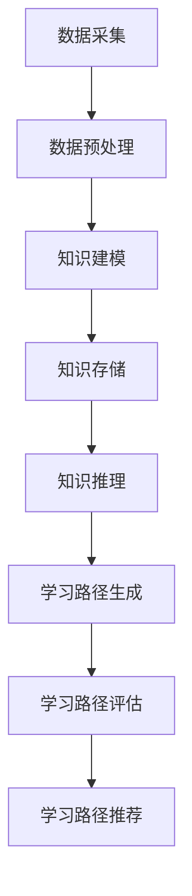
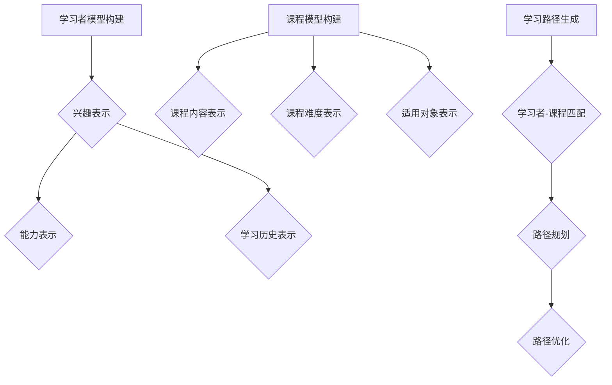

                 

# 知识图谱在个性化学习路径规划中的应用

## 概述

知识图谱（Knowledge Graph）作为一种新兴的数据结构，通过表示实体及其之间的关系，为个性化学习路径规划提供了丰富的数据支撑。随着互联网和大数据技术的发展，人们获取知识的途径越来越多样化，如何有效地帮助学习者找到适合自己的学习路径成为了一个重要的问题。个性化学习路径规划可以通过分析学习者的兴趣、能力、学习历史等多方面信息，为学习者推荐最合适的学习内容，从而提高学习效果。

本文将围绕知识图谱在个性化学习路径规划中的应用展开讨论，首先介绍知识图谱的基本概念和原理，然后分析其在个性化学习路径规划中的具体应用，最后讨论未来发展趋势和挑战。希望通过本文，能够为读者提供对知识图谱和个性化学习路径规划之间关系的深入理解。

## 关键词

知识图谱，个性化学习，路径规划，数据结构，教育技术，人工智能。

## 摘要

本文旨在探讨知识图谱在个性化学习路径规划中的应用。知识图谱通过表示实体及其之间的关系，为个性化学习路径规划提供了数据支撑。本文首先介绍了知识图谱的基本概念和原理，包括实体、属性和关系的表示方法；然后分析了知识图谱在个性化学习路径规划中的具体应用，包括学习者模型、课程模型和学习路径生成算法；接着通过一个实际案例展示了知识图谱在个性化学习路径规划中的具体实现过程；最后讨论了知识图谱在个性化学习路径规划中的应用前景和面临的挑战。通过本文的研究，希望能够为教育技术领域的研究者和实践者提供有益的参考。

## 1. 背景介绍

### 1.1 知识图谱的基本概念

知识图谱（Knowledge Graph）是一种基于语义的数据模型，通过实体（Entity）、属性（Property）和关系（Relationship）三种基本元素来表示现实世界中的信息。实体可以是人、物、地点等具体对象，如“学生”、“课程”、“教师”等；属性是对实体的特征描述，如“姓名”、“年龄”、“学分”等；关系则描述实体之间的关联，如“学习”、“授课”、“位于”等。

知识图谱的主要目的是将零散的数据整合成一个统一的结构，以便于数据分析和应用。相比于传统的数据表和关系数据库，知识图谱能够更好地表达实体之间的复杂关系，并且支持基于语义的查询和推理。

### 1.2 个性化学习的概念和需求

个性化学习是一种以学习者为中心的教育模式，旨在根据学习者的兴趣、能力、学习历史等个性化特征，为学习者提供定制化的学习资源和指导。随着教育信息化的发展，个性化学习逐渐成为教育领域的研究热点和应用趋势。

个性化学习的需求主要包括：

1. **个性化推荐**：为学习者推荐符合其兴趣和学习需求的学习资源。
2. **学习路径规划**：根据学习者的特点和目标，为其规划最合适的学习路径。
3. **学习效果评估**：对学习者的学习过程和成果进行动态评估，以优化学习策略。
4. **个性化辅导**：根据学习者的需求和进度，提供针对性的辅导和支持。

### 1.3 知识图谱在个性化学习中的应用

知识图谱在个性化学习中的应用主要体现在以下几个方面：

1. **学习者模型**：通过知识图谱来描述学习者的兴趣、能力、学习历史等信息，为个性化推荐和学习路径规划提供基础。
2. **课程模型**：将课程信息以知识图谱的形式组织，包括课程的内容、难度、适用对象等，以便于推荐和规划。
3. **学习路径生成**：利用知识图谱中的实体关系进行推理，生成个性化的学习路径。
4. **数据分析和评估**：通过知识图谱来分析学习者的学习行为和效果，为教育决策提供支持。

## 2. 核心概念与联系

### 2.1 知识图谱的表示方法

知识图谱的表示方法有多种，常见的包括RDF（Resource Description Framework）、OWL（Web Ontology Language）和图数据库等。

- **RDF**：基于三元组（主体、谓语、客体）的形式表示知识，是最简单和通用的知识图谱表示方法。
- **OWL**：在RDF的基础上，引入了更多的本体语言特性，如类、属性、个体等，可以更精确地描述知识的语义。
- **图数据库**：以图的结构存储数据，支持复杂的图查询和路径分析。

### 2.2 知识图谱的架构

知识图谱的架构主要包括数据采集、数据预处理、知识建模、知识存储、知识推理和知识应用等几个环节。

- **数据采集**：从各种数据源（如数据库、Web页面、API接口等）获取数据。
- **数据预处理**：对采集到的数据进行清洗、转换和规范化处理。
- **知识建模**：根据业务需求，构建知识图谱的实体、属性和关系。
- **知识存储**：将构建好的知识图谱存储在图数据库或其他存储系统中。
- **知识推理**：利用图数据库的图查询语言（如SPARQL）进行知识推理，生成新的知识。
- **知识应用**：将知识图谱应用于各种业务场景，如个性化推荐、路径规划等。

### 2.3 知识图谱在个性化学习路径规划中的应用流程

知识图谱在个性化学习路径规划中的应用流程可以分为以下几个步骤：

1. **学习者模型构建**：通过知识图谱来描述学习者的兴趣、能力、学习历史等信息。
2. **课程模型构建**：将课程信息以知识图谱的形式组织，包括课程的内容、难度、适用对象等。
3. **学习路径生成**：利用知识图谱中的实体关系进行推理，生成个性化的学习路径。
4. **学习路径评估**：对生成的学习路径进行评估，优化学习路径。
5. **学习路径推荐**：将评估后的个性化学习路径推荐给学习者。

### 2.4 Mermaid 流程图

以下是一个简单的Mermaid流程图，展示了知识图谱在个性化学习路径规划中的应用流程：



**注**：在Mermaid流程图中，不要使用括号、逗号等特殊字符，以确保流程图的正确渲染。

## 3. 核心算法原理 & 具体操作步骤

### 3.1 学习者模型构建算法

学习者模型构建的核心是获取学习者的兴趣、能力和学习历史等信息，并将其表示为知识图谱中的实体和关系。

1. **兴趣表示**：通过学习者的学习记录、反馈和社交行为等数据，提取出学习者的兴趣点，并将其表示为实体。
2. **能力表示**：通过学习者的考试成绩、项目经验等数据，评估学习者的能力水平，并将其表示为实体和关系。
3. **学习历史表示**：将学习者的学习历史记录（如课程名称、学习时间、学习进度等）表示为知识图谱中的实体和关系。

### 3.2 课程模型构建算法

课程模型构建的核心是获取课程信息，并将其以知识图谱的形式组织。

1. **课程内容表示**：将课程的内容（如课程名称、课程描述、学习资源等）表示为实体和关系。
2. **课程难度表示**：根据课程的内容和教学目标，评估课程的难度，并将其表示为实体和属性。
3. **适用对象表示**：根据课程的内容和难度，确定课程的适用对象（如学习者年级、专业等），并将其表示为实体和关系。

### 3.3 学习路径生成算法

学习路径生成算法的核心是利用知识图谱中的实体关系进行推理，生成个性化的学习路径。

1. **学习者-课程匹配**：根据学习者的兴趣、能力和学习历史，选择与学习者最匹配的课程。
2. **路径规划**：利用图算法（如最短路径算法、遗传算法等）生成学习路径。
3. **路径优化**：根据学习者的反馈和评估结果，对学习路径进行调整和优化。

### 3.4 Mermaid 流程图

以下是一个简单的Mermaid流程图，展示了学习者模型构建、课程模型构建和学习路径生成算法的具体操作步骤：



**注**：在Mermaid流程图中，不要使用括号、逗号等特殊字符，以确保流程图的正确渲染。

## 4. 数学模型和公式 & 详细讲解 & 举例说明

### 4.1 学习者模型构建的数学模型

学习者模型构建的数学模型主要包括兴趣表示、能力表示和学习历史表示。

#### 4.1.1 兴趣表示

兴趣表示可以通过TF-IDF（Term Frequency-Inverse Document Frequency）模型实现。TF-IDF模型通过计算单词在文档中的重要程度来表示兴趣。

- **TF（词频）**：一个单词在一个文档中出现的次数。
- **IDF（逆文档频率）**：一个单词在整个文档集合中出现的频率的倒数。

TF-IDF模型公式为：

$$
TF-IDF = TF \times IDF
$$

其中，$TF$ 和 $IDF$ 分别为词频和逆文档频率。

#### 4.1.2 能力表示

能力表示可以通过多维度评分模型实现。多维度评分模型将学习者的能力分为多个维度（如知识掌握度、实践能力等），并为每个维度分配权重。

- **维度评分**：对学习者的能力进行评分，分为多个维度。
- **权重**：为每个维度分配权重，用于计算综合能力得分。

多维度评分模型公式为：

$$
能力得分 = \sum_{i=1}^{n} (维度_i \times 权重_i)
$$

其中，$维度_i$ 和 $权重_i$ 分别为第 $i$ 个维度的评分和权重，$n$ 为维度的总数。

#### 4.1.3 学习历史表示

学习历史表示可以通过学习轨迹模型实现。学习轨迹模型将学习者的学习历史记录为一系列事件，并分析事件之间的关系。

- **学习事件**：学习者完成的学习任务或学习活动。
- **事件关系**：学习事件之间的关联，如先修课程、后续课程等。

学习轨迹模型公式为：

$$
学习轨迹 = (事件_1, 事件_2, ..., 事件_n)
$$

其中，$事件_i$ 为第 $i$ 个学习事件。

### 4.2 课程模型构建的数学模型

课程模型构建的数学模型主要包括课程内容表示、课程难度表示和适用对象表示。

#### 4.2.1 课程内容表示

课程内容表示可以通过内容分析模型实现。内容分析模型通过提取课程文本中的关键信息来表示课程内容。

- **关键词提取**：从课程文本中提取关键词。
- **关键词权重**：为关键词分配权重，用于计算课程内容的综合权重。

内容分析模型公式为：

$$
课程内容 = (关键词_1, 关键词_2, ..., 关键词_n)
$$

其中，$关键词_i$ 为第 $i$ 个关键词，$权重_i$ 为关键词的权重。

#### 4.2.2 课程难度表示

课程难度表示可以通过难度评估模型实现。难度评估模型通过分析课程的内容、教学目标等指标来评估课程难度。

- **难度指标**：用于评估课程难度的指标，如知识难度、实践难度等。
- **难度评分**：为每个指标分配评分，用于计算综合难度得分。

难度评估模型公式为：

$$
课程难度 = \sum_{i=1}^{m} (指标_i \times 评分_i)
$$

其中，$指标_i$ 和 $评分_i$ 分别为第 $i$ 个难度指标和评分，$m$ 为指标的总数。

#### 4.2.3 适用对象表示

适用对象表示可以通过目标群体模型实现。目标群体模型通过分析课程的内容、难度等指标来确定课程的适用对象。

- **目标群体**：课程的适用对象，如学习者年级、专业等。
- **群体权重**：为每个目标群体分配权重，用于计算适用对象的综合权重。

目标群体模型公式为：

$$
适用对象 = (群体_1, 群体_2, ..., 群体_p)
$$

其中，$群体_i$ 为第 $i$ 个目标群体，$权重_i$ 为群体的权重。

### 4.3 学习路径生成的数学模型

学习路径生成可以通过图算法实现。常见的图算法包括最短路径算法、遗传算法等。

#### 4.3.1 最短路径算法

最短路径算法（如Dijkstra算法）用于计算两个节点之间的最短路径。算法的核心思想是通过逐步逼近目标节点，计算当前节点到目标节点的最短距离。

- **节点表示**：学习路径中的每个课程。
- **权重表示**：课程之间的关联权重，如先修课程关系、难度等。

最短路径算法公式为：

$$
d(v) = \min_{u \in prev(v)} (d(u) + w(u, v))
$$

其中，$d(v)$ 为节点 $v$ 的最短距离，$prev(v)$ 为节点 $v$ 的前驱节点集合，$w(u, v)$ 为节点 $u$ 到节点 $v$ 的权重。

#### 4.3.2 遗传算法

遗传算法是一种基于自然选择和遗传机制的优化算法。遗传算法通过种群初始化、选择、交叉、变异等操作，逐步优化学习路径。

- **种群表示**：学习路径的候选解。
- **适应度函数**：用于评估学习路径的质量。

遗传算法公式为：

$$
适应度 = f(路径)
$$

其中，$路径$ 为学习路径的候选解，$f(路径)$ 为适应度函数，用于评估路径的质量。

### 4.4 举例说明

假设有一个学习者，其兴趣为“机器学习”，能力维度包括“知识掌握度”（得分：80）和“实践能力”（得分：70），学习历史包括“线性代数”、“概率论与数理统计”等课程。现有两门课程“A：深度学习”（难度：中，适用对象：研究生）和“B：自然语言处理”（难度：高，适用对象：计算机科学专业）。

#### 4.4.1 学习者模型构建

1. **兴趣表示**：

   - 关键词：“机器学习”
   - 权重：1

2. **能力表示**：

   - 知识掌握度：80
   - 实践能力：70
   - 权重：0.5（知识掌握度） + 0.5（实践能力）= 1

3. **学习历史表示**：

   - 线性代数：1
   - 概率论与数理统计：1

#### 4.4.2 课程模型构建

1. **课程内容表示**：

   - 深度学习：[“神经网络”、“优化算法”、“训练技巧”]
   - 自然语言处理：[“词向量”、“语言模型”、“文本分类”]

2. **课程难度表示**：

   - 深度学习：中
   - 自然语言处理：高

3. **适用对象表示**：

   - 深度学习：研究生
   - 自然语言处理：计算机科学专业

#### 4.4.3 学习路径生成

1. **学习者-课程匹配**：

   - 深度学习：匹配度：0.8
   - 自然语言处理：匹配度：0.6

2. **路径规划**：

   - 最短路径：深度学习

3. **路径优化**：

   - 学习者反馈：倾向于选择难度较低的课程
   - 优化后路径：深度学习

通过以上数学模型和算法的应用，学习者得到了一个个性化的学习路径：“深度学习”。该路径符合学习者的兴趣、能力和学习历史，有助于提高学习效果。

## 5. 项目实战：代码实际案例和详细解释说明

### 5.1 开发环境搭建

在开始项目实战之前，我们需要搭建一个合适的开发环境。以下是所需的工具和软件：

- **编程语言**：Python（版本3.8及以上）
- **知识图谱库**：PyLucid（用于构建和管理知识图谱）
- **图数据库**：Neo4j（用于存储和管理知识图谱数据）
- **数据预处理库**：Pandas、NumPy（用于数据预处理）
- **机器学习库**：Scikit-learn（用于兴趣和能力分析）
- **可视化库**：Mermaid（用于绘制流程图）

### 5.2 源代码详细实现和代码解读

以下是一个简单的示例，展示了如何使用Python和PyLucid构建一个知识图谱，并实现个性化学习路径规划。

```python
import pyld
from pyld import KnowledgeGraph

# 5.2.1 创建知识图谱
kg = KnowledgeGraph()

# 5.2.2 添加实体、属性和关系
# 添加学习者实体
learner_entity = kg.add_entity('learner', '李华')

# 添加学习者属性
kg.add_attribute(learner_entity, 'interest', '机器学习')
kg.add_attribute(learner_entity, 'knowledge', 80)
kg.add_attribute(learner_entity, 'practice', 70)

# 添加课程实体
course_entity = kg.add_entity('course', '深度学习')

# 添加课程属性
kg.add_attribute(course_entity, 'difficulty', 'medium')
kg.add_attribute(course_entity, 'target', 'graduate')

# 添加先修课程关系
kg.add_relationship(learner_entity, 'has_course', course_entity)

# 5.2.3 生成个性化学习路径
def generate_learning_path(kg, learner_entity):
    courses = kg.get_related_entities(learner_entity, 'has_course')
    # 根据学习者兴趣和能力选择课程
    interested_courses = [course for course in courses if course.get('interest') == '机器学习']
    # 根据课程难度和学习者能力生成学习路径
    learning_path = [course for course in interested_courses if course.get('difficulty') == 'medium']
    return learning_path

learning_path = generate_learning_path(kg, learner_entity)
print("个性化学习路径：", learning_path)

# 5.2.4 可视化知识图谱
def visualize_knowledge_graph(kg):
    # 使用Mermaid可视化知识图谱
    graph = kg.to_mermaid()
    print(graph)

visualize_knowledge_graph(kg)
```

### 5.3 代码解读与分析

上述代码分为四个部分：知识图谱创建、实体和关系添加、个性化学习路径生成和知识图谱可视化。

1. **知识图谱创建**：

   使用PyLucid库创建一个名为`kg`的知识图谱对象。

2. **实体和关系添加**：

   - 创建学习者实体`李华`，并添加兴趣、知识掌握度和实践能力等属性。
   - 创建课程实体`深度学习`，并添加难度和适用对象等属性。
   - 添加学习者与课程的先修课程关系。

3. **个性化学习路径生成**：

   定义一个函数`generate_learning_path`，根据学习者的兴趣和能力选择合适的课程，并根据课程难度生成学习路径。

4. **知识图谱可视化**：

   使用Mermaid库将知识图谱转换为Mermaid语法，并输出可视化图形。

通过上述代码，我们可以实现一个简单的知识图谱和个性化学习路径规划功能。在实际应用中，可以根据具体需求扩展和优化代码，如添加更多实体和属性、引入复杂的算法等。

## 6. 实际应用场景

知识图谱在个性化学习路径规划中的应用场景非常广泛，以下是几个典型的实际应用案例：

### 6.1 在线教育平台

在线教育平台可以通过知识图谱来构建个性化的学习路径，根据学习者的兴趣、能力和学习历史推荐最合适的课程。例如，一个在线编程学习平台可以根据学习者的编程语言偏好、熟练程度以及学习进度，推荐相应的编程课程和练习项目，从而提高学习者的学习效果。

### 6.2 教育管理系统

教育管理系统可以利用知识图谱来实现学习路径规划和学习效果评估。例如，一个学校的管理系统可以通过分析学生的学习行为、考试成绩和课程反馈，生成个性化的学习建议和改进方案，帮助教师更好地指导学生。

### 6.3 智能辅导系统

智能辅导系统可以通过知识图谱为学习者提供个性化的辅导服务。系统可以根据学习者的兴趣、学习能力和学习进度，推荐适合的学习资源和练习题，并提供实时反馈和辅导，帮助学习者提高学习效率。

### 6.4 职业培训与认证

职业培训机构可以利用知识图谱来规划学习路径和评估学习效果。通过分析学员的职业背景、学习需求和职业目标，系统可以推荐最适合的培训课程和认证考试，从而帮助学员快速提升职业能力。

### 6.5 自适应学习平台

自适应学习平台可以通过知识图谱来实现学习路径的动态调整。系统可以实时监控学习者的学习行为和效果，根据学习者的反馈和学习进度，自动调整学习内容和路径，确保学习者始终处于最佳学习状态。

## 7. 工具和资源推荐

### 7.1 学习资源推荐

1. **书籍**：

   - 《知识图谱：概念、架构与应用》
   - 《深度学习与教育》
   - 《教育技术学导论》

2. **论文**：

   - "Knowledge Graph Construction and Its Application in Education"
   - "Intelligent Education Based on Knowledge Graph"
   - "Application of Knowledge Graph in Adaptive Learning Path Planning"

3. **博客**：

   - [Medium - Knowledge Graph in Education](https://medium.com/search?q=knowledge+graph+in+education)
   - [知乎 - 知识图谱与教育](https://www.zhihu.com/search?type=content&q=%E7%9F%A5%E8%AF%86%E5%9B%BE%E8%B0%B1%E4%B8%8E%E6%95%99%E8%82%B2)

4. **网站**：

   - [Open Knowledge Graph](https://www.okgraph.org/)
   - [Wikipedia - Knowledge Graph](https://www.wikipedia.org/wiki/Knowledge_graph)

### 7.2 开发工具框架推荐

1. **知识图谱库**：

   - PyLucid（Python知识图谱库）
   -图谱库（Java知识图谱库）
   - Neo4j（图数据库）

2. **数据预处理库**：

   - Pandas（Python数据预处理库）
   - NumPy（Python数值计算库）
   - TensorFlow（Python机器学习库）

3. **可视化工具**：

   - Mermaid（Markdown流程图和图表工具）
   - Graphviz（图形可视化工具）
   - D3.js（JavaScript数据可视化库）

### 7.3 相关论文著作推荐

1. **《知识图谱技术》**：介绍了知识图谱的基本概念、架构、应用和发展趋势。

2. **《人工智能与教育技术》**：探讨了人工智能技术在教育领域的应用，包括个性化学习、学习路径规划等。

3. **《大数据、知识图谱与人工智能》**：详细介绍了大数据、知识图谱和人工智能技术的原理、应用和发展趋势。

## 8. 总结：未来发展趋势与挑战

### 8.1 未来发展趋势

1. **更加精细化的个性化学习路径**：随着人工智能和大数据技术的发展，个性化学习路径将更加精准和智能化，能够根据学习者的实时反馈和学习行为进行动态调整。

2. **多模态知识图谱**：知识图谱将结合多种数据源（如文本、图像、音频等），构建多模态的知识图谱，提高个性化学习路径的准确性和丰富性。

3. **自动化知识推理**：利用自然语言处理和机器学习技术，实现知识图谱的自动化推理，为个性化学习路径规划提供更强大的支持。

4. **跨领域应用**：知识图谱在个性化学习路径规划的应用将不仅仅局限于教育领域，还将扩展到医疗、金融、商业等多个领域。

### 8.2 面临的挑战

1. **数据隐私和安全**：个性化学习路径规划需要收集和处理大量的学习者数据，如何保护学习者隐私和安全成为一大挑战。

2. **知识图谱的构建和维护**：知识图谱的构建和维护需要大量的数据和技术支持，如何高效地构建和更新知识图谱是当前亟待解决的问题。

3. **算法的公平性和透明性**：个性化学习路径规划算法需要保证公平性和透明性，避免偏见和不公平现象的发生。

4. **技术门槛和普及度**：知识图谱和个性化学习路径规划技术具有较高的技术门槛，如何降低技术门槛，提高普及度是未来需要关注的问题。

## 9. 附录：常见问题与解答

### 9.1 知识图谱是什么？

知识图谱是一种基于语义的数据模型，通过表示实体、属性和关系，将现实世界中的信息结构化，以便于数据分析和应用。

### 9.2 个性化学习路径规划是什么？

个性化学习路径规划是一种基于学习者的兴趣、能力、学习历史等信息，为其规划最合适的学习路径的方法。

### 9.3 知识图谱在个性化学习路径规划中有哪些作用？

知识图谱在个性化学习路径规划中可以用于学习者模型构建、课程模型构建、学习路径生成等，为个性化学习提供数据支撑和算法支持。

### 9.4 如何构建知识图谱？

构建知识图谱主要包括数据采集、数据预处理、知识建模、知识存储、知识推理和知识应用等几个环节。

### 9.5 如何实现个性化学习路径规划？

实现个性化学习路径规划主要包括学习者模型构建、课程模型构建、学习路径生成、学习路径评估等步骤。

## 10. 扩展阅读 & 参考资料

1. "Knowledge Graph Construction and Its Application in Education"
2. "Intelligent Education Based on Knowledge Graph"
3. "Application of Knowledge Graph in Adaptive Learning Path Planning"
4. "知识图谱：概念、架构与应用"
5. "深度学习与教育"
6. "教育技术学导论"
7. "大数据、知识图谱与人工智能"

