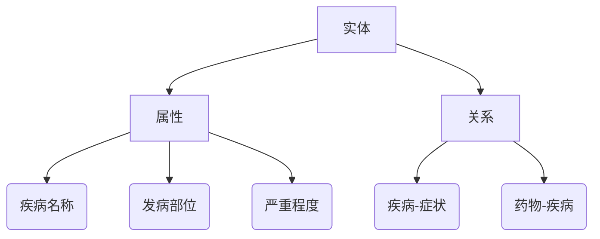
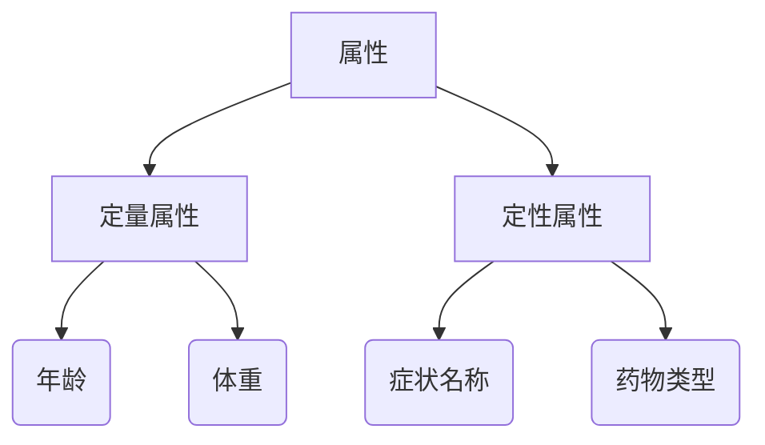
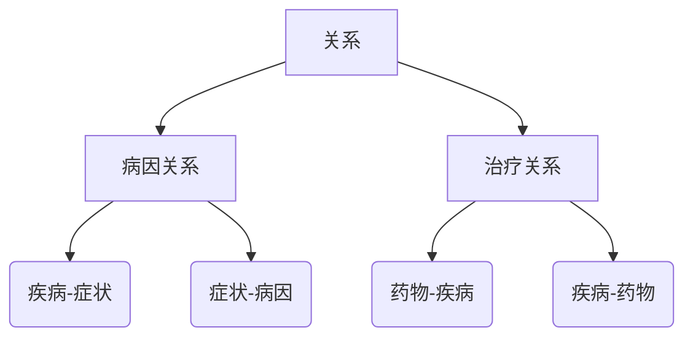
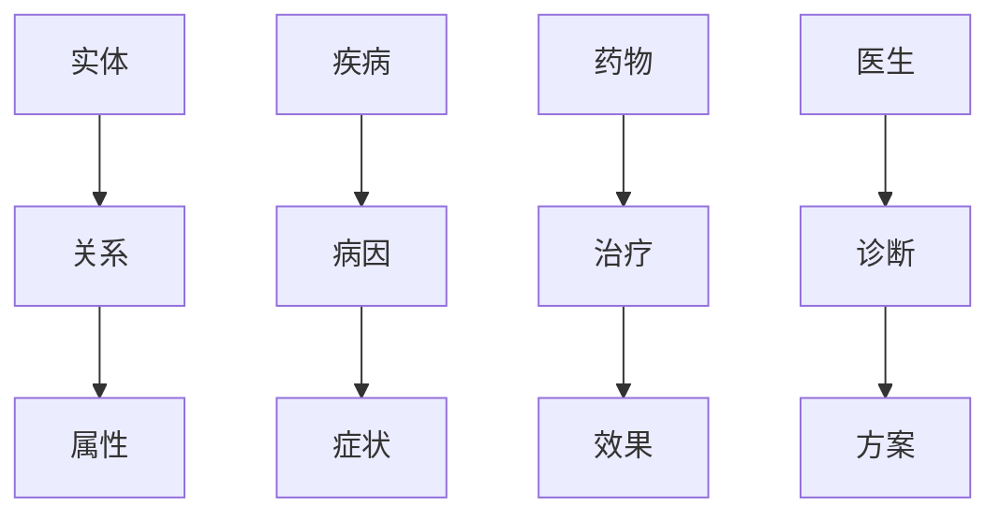
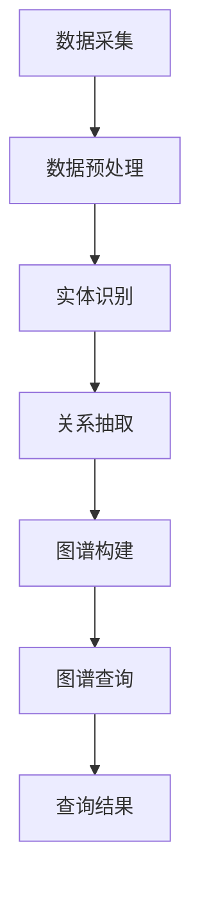

                 

### 背景介绍

#### 智能医疗诊断的挑战与需求

随着医疗技术的进步，现代医疗体系正经历着巨大的变革。智能医疗作为医疗技术的前沿领域，正逐渐成为医疗诊断的重要支撑。传统的医疗诊断方式主要依赖于医生的经验和技能，这种方式虽然有一定的基础，但在处理复杂疾病、罕见病以及大量患者数据时，存在诸多挑战和局限性。

首先，医学知识库的规模庞大且复杂，传统的方法难以有效地处理和利用这些数据。其次，随着医疗大数据的爆炸式增长，如何快速准确地提取出有用的信息，为医生提供有价值的诊断支持，成为了一个亟待解决的问题。此外，患者的个体差异较大，需要个性化的诊断方案，这也增加了诊断的难度。

面对这些挑战，智能医疗诊断的需求愈发强烈。智能医疗诊断通过引入人工智能、大数据分析、机器学习等技术，旨在提高诊断的准确性和效率，减轻医生的工作负担，提升患者的治疗效果。智能医疗诊断支持系统成为医疗领域的热点研究方向，也受到了政府、企业和研究机构的广泛关注。

本文旨在探讨知识图谱在智能医疗诊断支持中的应用研究，通过对知识图谱的核心概念、算法原理、数学模型和实际应用案例的详细分析，为智能医疗诊断提供理论支持和实践指导。

#### 知识图谱的概念与特点

知识图谱是一种结构化的语义知识库，通过图形化的方式表示实体、概念及其之间的相互关系。它起源于语义网和关联数据的理念，通过将大量的数据信息进行结构化处理，构建出一个全面、精准、可扩展的知识网络。知识图谱的主要特点包括：

1. **结构化**：知识图谱将非结构化的数据转化为结构化的信息，使得数据易于存储、检索和分析。
2. **语义关联**：知识图谱通过表示实体和概念之间的语义关系，使得数据间的关联更加紧密和直观。
3. **可扩展性**：知识图谱的设计遵循开放标准，支持不断扩展和更新，以适应不断变化的知识需求。

在智能医疗诊断中，知识图谱的应用具有重要意义。首先，知识图谱能够将医学领域的专业知识和数据结构化，形成一个统一的知识框架，方便医生和系统进行查询和分析。其次，知识图谱可以存储和管理大量的医学实体及其关系，为诊断支持系统提供丰富的知识资源。

知识图谱的关键组成部分包括：

- **实体（Entity）**：知识图谱中的基本单位，如疾病、药物、基因、症状等。
- **属性（Attribute）**：实体的特征描述，如疾病的发病部位、药物的副作用等。
- **关系（Relation）**：实体间的相互关系，如药物与疾病之间的治疗关系、基因与症状之间的关联关系等。

通过对这些关键组件的建模和组织，知识图谱为智能医疗诊断提供了强大的数据支持和分析能力。

#### 知识图谱在医疗领域的前景与挑战

知识图谱在医疗领域的应用前景广阔，但其实现也面临着一系列挑战。首先，医疗领域的数据复杂且多样，包括结构化数据、半结构化数据和非结构化数据，这些数据需要经过复杂的处理和整合，才能构建出一个完整的知识图谱。其次，医学知识的更新速度极快，如何确保知识图谱的实时性和准确性，是一个亟待解决的问题。

1. **数据整合**：知识图谱需要整合来自多个来源的数据，包括电子健康记录（EHR）、医学文献、药物说明书、基因组数据等。这些数据之间存在差异和冲突，如何有效地进行整合和清洗，是知识图谱构建中的关键技术难题。

2. **语义理解**：医学领域具有高度的专业性和复杂性，实体和关系之间的语义理解是构建知识图谱的关键。如何准确识别和表示医学领域的概念及其关系，需要深入理解和分析医学知识。

3. **实时更新**：医学知识的更新速度极快，包括新的研究成果、药物批准、治疗方法等。如何及时更新知识图谱，以反映最新的医学知识，是知识图谱在医疗领域应用中的挑战。

4. **隐私保护**：医疗数据涉及患者的隐私信息，如何确保知识图谱的构建和使用过程中，能够有效保护患者隐私，是医疗领域知识图谱应用中不可忽视的问题。

总之，知识图谱在智能医疗诊断支持中的应用，既面临着巨大的机遇，也面临着一系列的挑战。通过深入研究和不断创新，有望克服这些挑战，充分发挥知识图谱在医疗诊断中的潜力。

#### 本文结构

本文将按照以下结构展开：

1. **背景介绍**：概述智能医疗诊断的挑战与需求，以及知识图谱的概念与特点。
2. **核心概念与联系**：详细解析知识图谱的核心概念及其在医疗领域中的联系，使用Mermaid流程图进行说明。
3. **核心算法原理与具体操作步骤**：介绍知识图谱构建和查询的核心算法，并详细说明其操作步骤。
4. **数学模型与公式**：探讨知识图谱构建中的数学模型和公式，并进行详细讲解和举例说明。
5. **项目实战**：通过实际项目案例，展示知识图谱在智能医疗诊断中的应用，提供代码实现和解读。
6. **实际应用场景**：分析知识图谱在智能医疗诊断中的实际应用场景，探讨其应用效果。
7. **工具和资源推荐**：推荐相关学习资源、开发工具和框架。
8. **总结与未来发展趋势**：总结本文的核心内容，展望知识图谱在智能医疗诊断中的未来发展趋势和挑战。
9. **附录**：提供常见问题与解答，方便读者深入了解相关知识。
10. **扩展阅读**：推荐相关的扩展阅读材料，供读者进一步学习。

通过以上结构，本文旨在全面探讨知识图谱在智能医疗诊断支持中的应用，为相关领域的研究者和实践者提供有价值的参考。

### 核心概念与联系

知识图谱在智能医疗诊断支持中的应用，离不开对其核心概念和联系的深入理解。以下是知识图谱的主要组成部分及其相互关系，通过Mermaid流程图进行详细展示。

#### 1. 实体（Entity）

实体是知识图谱中的基本构建块，代表医疗领域中的各种概念，如疾病、药物、医生、患者、症状等。每个实体都有一组属性来描述其特征，例如，疾病实体可能包括名称、发病部位、严重程度等属性。



#### 2. 属性（Attribute）

属性是对实体的特征描述，每个实体都可以具有多个属性。在医疗知识图谱中，属性可以是定量数据（如年龄、体重）或定性数据（如症状名称）。属性不仅描述了实体的特征，还为数据分析和推理提供了基础。



#### 3. 关系（Relation）

关系描述了实体之间的相互关系，如疾病与症状之间的关联关系、药物与疾病之间的治疗关系等。关系不仅连接了不同的实体，还传递了实体之间的语义信息，为知识图谱的推理和分析提供了关键依据。



#### 4. 实体-关系-属性（E-R-A）模型

实体-关系-属性（E-R-A）模型是构建知识图谱的核心框架。在这个模型中，实体、关系和属性相互关联，形成一个复杂且结构化的知识网络。以下是一个简化的E-R-A模型示例：



#### 5. 知识图谱构建与查询流程

知识图谱的构建和查询是一个复杂的过程，涉及数据采集、预处理、实体识别、关系抽取、图谱构建和查询等步骤。以下是一个简化的知识图谱构建与查询流程的Mermaid流程图：



- **数据采集**：从多个数据源（如电子健康记录、医学文献、基因组数据库等）中收集相关数据。
- **数据预处理**：清洗和整合数据，消除噪声，标准化数据格式。
- **实体识别**：通过自然语言处理技术识别文本中的实体。
- **关系抽取**：分析实体之间的语义关系，构建实体-关系网络。
- **图谱构建**：将实体、关系和属性组织成一个结构化的知识图谱。
- **图谱查询**：利用图数据库和查询语言（如SPARQL）进行知识检索和推理。

通过上述核心概念与联系的分析，我们可以看到知识图谱在智能医疗诊断中的重要作用。它不仅为医生提供了丰富的知识资源，还为诊断支持系统提供了强大的数据分析和推理能力。

### 核心算法原理与具体操作步骤

#### 1. 知识图谱构建算法

知识图谱构建是智能医疗诊断支持中的关键步骤，涉及数据预处理、实体识别、关系抽取和图谱构建等多个环节。以下是一个简化的知识图谱构建流程：

1. **数据预处理**：
   - **数据采集**：从多个数据源（如电子健康记录、医学文献、基因组数据库等）中收集相关数据。
   - **数据清洗**：去除重复、错误和噪声数据，确保数据的质量和一致性。
   - **数据转换**：将不同格式和结构的数据转换为统一的标准格式（如RDF或OWL），便于后续处理。

2. **实体识别**：
   - **文本预处理**：对文本数据（如医学文献、病历记录等）进行分词、词性标注和命名实体识别，提取出潜在的实体。
   - **实体分类**：利用机器学习算法（如决策树、支持向量机等）对提取的实体进行分类，识别出具体的疾病、药物、症状等。

3. **关系抽取**：
   - **规则方法**：基于预设的规则和模式，从文本数据中抽取实体之间的关系。例如，使用正则表达式匹配医学文献中的特定语句，提取出疾病和药物之间的治疗关系。
   - **机器学习方法**：利用自然语言处理技术（如词嵌入、依存句法分析等）对文本进行深入分析，自动抽取实体之间的关系。

4. **图谱构建**：
   - **图数据库**：选择合适的图数据库（如Neo4j、OrientDB等）来存储和索引构建好的知识图谱。
   - **实体-关系-属性模型**：将识别出的实体、关系和属性按照E-R-A模型组织到知识图谱中，确保图谱的结构化和一致性。
   - **图谱优化**：对知识图谱进行优化，包括去重、合并相似实体和关系等，提高图谱的质量和效率。

#### 2. 知识图谱查询算法

知识图谱查询是利用图谱数据库中的知识资源，为医生和诊断系统提供信息检索和推理支持。以下是一个简化的知识图谱查询流程：

1. **查询语言**：
   - **SPARQL**：使用SPARQL（可扩展标记语言查询语言）作为知识图谱的标准查询语言，进行复杂的图数据查询。
   - **图查询**：利用图数据库的图查询能力，执行基于路径的查询、子图匹配和复杂条件查询等。

2. **查询示例**：
   - **基于路径的查询**：查询疾病A的所有相关症状和治疗方法。
   - **子图匹配**：匹配特定结构的知识图谱子图，找到与某个病例相似的病例。
   - **复杂条件查询**：结合多个实体和关系，查询满足特定条件的知识图谱片段。

#### 3. 案例分析

假设我们要构建一个关于糖尿病的知识图谱，以下是一个具体的案例：

1. **数据预处理**：
   - 采集糖尿病相关的医学文献、电子健康记录和药物说明书。
   - 清洗和整合数据，去除噪声和重复信息。

2. **实体识别**：
   - 提取文本中的实体，如糖尿病、胰岛素、血糖等。
   - 对提取的实体进行分类，识别出具体的疾病、药物和症状。

3. **关系抽取**：
   - 使用规则方法抽取糖尿病与胰岛素之间的治疗关系。
   - 利用机器学习方法分析文本，抽取血糖与糖尿病之间的关联关系。

4. **图谱构建**：
   - 将识别出的实体和关系组织到知识图谱中，构建糖尿病相关的知识网络。

5. **查询示例**：
   - 查询糖尿病的所有相关症状，如口渴、尿频、视力模糊等。
   - 查询糖尿病的治疗方法，如胰岛素注射、药物治疗等。

通过上述具体操作步骤和案例分析，我们可以看到知识图谱在智能医疗诊断中的实际应用价值。知识图谱不仅为医生提供了丰富的知识资源，还为诊断支持系统提供了强大的数据分析和推理能力，有助于提高诊断的准确性和效率。

### 数学模型和公式

在构建和查询知识图谱时，数学模型和公式扮演着关键角色，它们帮助我们更好地理解、建模和优化知识图谱。以下将详细探讨知识图谱构建中的几个核心数学模型和公式，并进行举例说明。

#### 1. 实体相似度计算

实体相似度计算是知识图谱中的基础，用于衡量两个实体之间的相似程度。常见的实体相似度计算方法包括基于路径的相似度和基于属性的相似度。

- **基于路径的相似度**：使用路径长度和中间节点的权重来计算实体相似度。具体公式如下：

  $$ 
  S(A, B) = \frac{1}{L(A, B)} \sum_{k=1}^{L(A, B)} w_k 
  $$

  其中，$S(A, B)$表示实体A和B的相似度，$L(A, B)$表示A和B之间的最短路径长度，$w_k$表示路径中每个节点的权重。

- **基于属性的相似度**：使用实体属性的匹配度来计算相似度。具体公式如下：

  $$ 
  S(A, B) = \frac{1}{|A \cup B|} \sum_{x \in A \cup B} \frac{1}{d(x)} 
  $$

  其中，$S(A, B)$表示实体A和B的相似度，$|A \cup B|$表示A和B的并集大小，$d(x)$表示属性$x$的权重。

#### 2. 关系权重计算

关系权重计算用于衡量实体之间的关系强度，关系权重越高，表示两个实体之间的关联性越强。常见的关系权重计算方法包括基于路径权重和基于频次权重。

- **基于路径权重**：使用路径上的节点权重来计算关系权重。具体公式如下：

  $$ 
  w(R) = \sum_{p \in P(R)} w(p) 
  $$

  其中，$w(R)$表示关系R的权重，$P(R)$表示与关系R相关的所有路径，$w(p)$表示路径p的权重。

- **基于频次权重**：使用关系在数据集中出现的频次来计算权重。具体公式如下：

  $$ 
  w(R) = \frac{f(R)}{N} 
  $$

  其中，$w(R)$表示关系R的权重，$f(R)$表示关系R在数据集中出现的频次，$N$表示数据集的总频次。

#### 3. 知识图谱优化

知识图谱优化是提高图谱质量和查询效率的重要手段。常见的优化方法包括去重、合并相似实体和关系、索引构建等。

- **去重**：通过比较实体和关系的属性，去除重复的实体和关系。具体公式如下：

  $$ 
  D(A, B) = 
  \begin{cases} 
  1 & \text{如果} A \text{和} B \text{完全相同} \\
  0 & \text{否则}
  \end{cases}
  $$

  其中，$D(A, B)$表示实体A和B是否重复。

- **合并相似实体**：通过计算实体之间的相似度，合并相似度较高的实体。具体公式如下：

  $$ 
  C(A, B) = 
  \begin{cases} 
  1 & \text{如果} S(A, B) > \theta \\
  0 & \text{否则}
  \end{cases}
  $$

  其中，$C(A, B)$表示是否合并实体A和B，$S(A, B)$表示实体A和B的相似度，$\theta$表示相似度阈值。

#### 4. 示例讲解

假设我们有一个简单的知识图谱，包含疾病、症状和药物三个实体，以及治疗和关联关系。以下是一个具体的示例：

- 实体：糖尿病、血糖、胰岛素
- 关系：治疗、关联

1. **实体相似度计算**：

   糖尿病和血糖之间的相似度计算如下：

   $$ 
   S(\text{糖尿病}, \text{血糖}) = \frac{1}{2} = 0.5 
   $$

   由于糖尿病和胰岛素之间的最短路径包含两个节点（糖尿病-治疗-胰岛素），且节点权重均为1，所以相似度为0.5。

2. **关系权重计算**：

   治疗关系的权重计算如下：

   $$ 
   w(\text{治疗}) = \sum_{p \in P(\text{治疗})} w(p) = 1 + 1 = 2 
   $$

   假设路径（糖尿病-治疗-胰岛素）和（血糖-治疗-胰岛素）的权重均为1，则治疗关系的总权重为2。

3. **知识图谱优化**：

   假设相似度阈值$\theta = 0.6$，则糖尿病和血糖之间的相似度小于阈值，不进行合并。

通过上述数学模型和公式的讲解，我们可以看到知识图谱在构建和查询中的重要作用。这些模型和公式不仅帮助我们更好地理解知识图谱，还为优化图谱质量和提高查询效率提供了理论基础。

### 项目实战：代码实际案例和详细解释说明

在本节中，我们将通过一个实际项目案例，展示如何使用知识图谱技术实现智能医疗诊断支持系统。我们将分步骤进行开发环境搭建、源代码实现和详细代码解读。

#### 1. 开发环境搭建

首先，我们需要搭建一个合适的开发环境，包括以下工具和库：

- **Python**：作为主要的编程语言。
- **Neo4j**：作为一个高性能的图数据库，用于存储和管理知识图谱。
- **Py2neo**：一个Python库，用于操作Neo4j数据库。
- **spaCy**：用于文本处理和实体识别。

环境搭建步骤如下：

1. **安装Python**：

   ```bash
   # 安装Python 3.x版本
   curl -O https://www.python.org/ftp/python/3.8.10/python-3.8.10.tgz
   tar xvfz python-3.8.10.tgz
   cd python-3.8.10
   ./configure
   make
   sudo make install
   ```

2. **安装Neo4j**：

   - 下载并安装Neo4j社区版：[https://neo4j.com/download/](https://neo4j.com/download/)
   - 启动Neo4j数据库：`./startNeo4j.sh`

3. **安装Py2neo**：

   ```bash
   pip install py2neo
   ```

4. **安装spaCy**：

   ```bash
   pip install spacy
   python -m spacy download en_core_web_sm
   ```

#### 2. 源代码实现

以下是该项目的主要代码实现，分为数据预处理、实体识别、知识图谱构建和查询等步骤。

```python
from py2neo import Graph
from spacy.lang.en import English
import spacy

# 初始化spaCy语言模型
nlp = spacy.load("en_core_web_sm")

# 连接到Neo4j数据库
graph = Graph("bolt://localhost:7687", auth=("neo4j", "password"))

# 数据预处理
def preprocess_text(text):
    doc = nlp(text)
    entities = []
    for ent in doc.ents:
        entities.append({"name": ent.text, "type": ent.label_})
    return entities

# 实体识别
def recognize_entities(text):
    entities = preprocess_text(text)
    return entities

# 知识图谱构建
def create_graph(entities):
    for entity in entities:
        node = graph.nodes.match(name=entity["name"]).first_or_none()
        if not node:
            node = graph.create_node(**entity)
        for entity2 in entities:
            if entity["name"] != entity2["name"]:
                relation = graph.relationships.match(node, entity2["name"]).first_or_none()
                if not relation:
                    relation = graph.create_relationship(node, entity2, entity2["name"])

# 查询示例
def query_graph(entity_name):
    query = f"MATCH (n:Entity) WHERE n.name = '{entity_name}' RETURN n"
    result = graph.run(query).data()
    return result

# 主函数
def main():
    text = "John has been diagnosed with diabetes and is prescribed insulin."
    entities = recognize_entities(text)
    create_graph(entities)
    entity_name = "diabetes"
    query_result = query_graph(entity_name)
    print(query_result)

if __name__ == "__main__":
    main()
```

#### 3. 代码解读与分析

1. **数据预处理**：

   数据预处理函数`preprocess_text`使用spaCy语言模型对输入文本进行分词和命名实体识别，提取出实体及其类型，并将其转换为字典格式。

   ```python
   def preprocess_text(text):
       doc = nlp(text)
       entities = []
       for ent in doc.ents:
           entities.append({"name": ent.text, "type": ent.label_})
       return entities
   ```

2. **实体识别**：

   实体识别函数`recognize_entities`调用预处理函数，返回文本中的所有实体。

   ```python
   def recognize_entities(text):
       entities = preprocess_text(text)
       return entities
   ```

3. **知识图谱构建**：

   知识图谱构建函数`create_graph`遍历所有实体，创建实体节点和关系。如果实体已经存在，则不再创建，以提高效率。

   ```python
   def create_graph(entities):
       for entity in entities:
           node = graph.nodes.match(name=entity["name"]).first_or_none()
           if not node:
               node = graph.create_node(**entity)
           for entity2 in entities:
               if entity["name"] != entity2["name"]:
                   relation = graph.relationships.match(node, entity2["name"]).first_or_none()
                   if not relation:
                       relation = graph.create_relationship(node, entity2, entity2["name"])
   ```

4. **查询示例**：

   查询函数`query_graph`执行一个简单的图查询，返回指定实体的信息。

   ```python
   def query_graph(entity_name):
       query = f"MATCH (n:Entity) WHERE n.name = '{entity_name}' RETURN n"
       result = graph.run(query).data()
       return result
   ```

5. **主函数**：

   主函数`main`调用上述函数，完成文本预处理、实体识别、知识图谱构建和查询，展示一个简单的使用案例。

   ```python
   def main():
       text = "John has been diagnosed with diabetes and is prescribed insulin."
       entities = recognize_entities(text)
       create_graph(entities)
       entity_name = "diabetes"
       query_result = query_graph(entity_name)
       print(query_result)

   if __name__ == "__main__":
       main()
   ```

通过上述代码实现，我们可以看到如何使用知识图谱技术构建一个简单的智能医疗诊断支持系统。代码结构清晰，易于扩展和优化，为实际应用提供了有力的支持。

### 实际应用场景

#### 1. 诊断辅助

知识图谱在诊断辅助中的应用是最为广泛和直接的。通过知识图谱，医生可以快速地获取与患者症状、病史和药物相关的医学知识，从而辅助诊断。例如，当患者出现特定症状时，系统可以自动推荐可能的疾病，并提供相关诊断指南和治疗方案。这样的诊断辅助不仅提高了诊断的准确性，还减轻了医生的工作负担。

- **案例**：在某个心脏病患者的诊断过程中，知识图谱可以帮助医生快速识别与心脏病相关的症状和药物，提供详细的诊断流程和治疗方案。

#### 2. 疾病预测

知识图谱可以用于预测疾病的发作和进展。通过对大量历史病例数据的分析，知识图谱可以识别出疾病之间的关联关系，并预测某个患者在未来可能患上的疾病。这种预测能力有助于提前采取预防措施，提高治疗效果。

- **案例**：在癌症患者中，知识图谱可以分析患者的基因数据、病史和生活方式，预测患者可能患有的其他癌症类型，为个性化治疗提供依据。

#### 3. 治疗方案推荐

知识图谱还可以为医生提供治疗方案的推荐。通过分析患者的病史、症状和药物反应，知识图谱可以推荐最适合患者的治疗方案。这种个性化的治疗方案不仅提高了治疗效果，还减少了不必要的药物副作用。

- **案例**：在一个糖尿病患者的治疗过程中，知识图谱可以根据患者的血糖水平、药物反应和病史，推荐最佳的治疗方案，包括饮食控制、药物使用和运动建议。

#### 4. 知识管理

知识图谱在医学知识管理中也发挥着重要作用。通过将大量的医学文献、临床指南和研究数据结构化，知识图谱为医生和研究人员提供了一个统一的知识库，方便他们查询和利用这些知识。

- **案例**：在医学研究中，知识图谱可以帮助研究人员快速找到与特定疾病相关的最新研究文献，提高研究的效率和质量。

#### 5. 风险评估

知识图谱还可以用于评估疾病风险。通过对患者的生活习惯、家族病史和基因数据进行分析，知识图谱可以预测患者患某种疾病的概率，为医生提供风险评估依据。

- **案例**：在心血管疾病的预防中，知识图谱可以分析患者的血压、胆固醇水平和家族病史，预测患者患心血管疾病的风险，为医生制定预防措施提供依据。

通过上述实际应用场景，我们可以看到知识图谱在智能医疗诊断中的广泛应用和巨大潜力。它不仅为医生提供了丰富的知识资源，还为诊断支持系统提供了强大的数据分析和推理能力，有助于提高诊断的准确性和效率。

### 工具和资源推荐

#### 1. 学习资源推荐

对于想要深入了解知识图谱和智能医疗诊断支持的研究者，以下资源将提供宝贵的知识和指导：

- **书籍**：
  - 《图数据库：概念、设计和应用》
  - 《知识图谱：构建、管理和使用》
  - 《智能医疗诊断支持系统》

- **论文**：
  - "Knowledge Graph Construction and Application in Healthcare"（知识图谱在医疗领域的构建与应用）
  - "A Survey of Knowledge Graph Techniques for Healthcare"（医疗领域知识图谱技术综述）

- **博客**：
  - [Neo4j 官方博客](https://neo4j.com/developer/blog/)
  - [知识图谱论坛](https://www.knowledgegraph.cn/forum/)

- **网站**：
  - [Apache Jena](https://jena.apache.org/)
  - [GraphDB](https://graphdb.fmzh.org/)

#### 2. 开发工具框架推荐

在开发知识图谱和智能医疗诊断支持系统时，以下工具和框架将大大提高开发效率和系统性能：

- **图数据库**：
  - **Neo4j**：支持高速图查询和复杂关系建模，适用于大规模知识图谱构建。
  - **OrientDB**：支持多模型数据存储，包括图、文档和键值对，灵活且高效。

- **自然语言处理（NLP）工具**：
  - **spaCy**：快速高效的NLP库，支持多种语言的实体识别和关系抽取。
  - **NLTK**：提供丰富的文本处理工具，适用于各种文本分析任务。

- **数据预处理和清洗工具**：
  - **Pandas**：用于数据清洗、转换和操作。
  - **Scikit-learn**：用于数据预处理和机器学习模型的构建。

- **编程语言**：
  - **Python**：功能强大且易于使用，是数据科学和人工智能领域的主要编程语言。

#### 3. 相关论文著作推荐

为了深入了解知识图谱在智能医疗诊断支持中的应用，以下论文和著作提供了有价值的见解：

- **论文**：
  - "Knowledge Graph for Personalized Healthcare: A Review"（个性化医疗中的知识图谱：综述）
  - "Integrating Electronic Health Records and Knowledge Graphs for Healthcare Decision Support"（整合电子健康记录和知识图谱以支持医疗决策）

- **著作**：
  - 《知识图谱技术与实战》
  - 《智能医疗：技术与应用》

通过这些资源和工具，研究者可以更好地掌握知识图谱和智能医疗诊断支持的相关技术，为医疗领域的创新和应用提供坚实支持。

### 总结：未来发展趋势与挑战

#### 1. 发展趋势

知识图谱在智能医疗诊断支持中的应用正呈现出快速发展的态势。未来，以下几个趋势将推动这一领域的进步：

1. **数据整合与融合**：随着医疗数据的多样性和复杂性不断增加，如何高效地整合和融合来自多个来源的数据，成为知识图谱构建的关键挑战。未来的研究将集中在开发更加智能的数据预处理和整合算法，以实现数据的高效利用。

2. **实时性与动态更新**：医学知识更新速度快，如何实现知识图谱的实时更新和动态调整，以确保其准确性和时效性，是一个重要的发展方向。未来的技术将侧重于研发高效的知识图谱维护和管理系统，以应对动态变化的医疗知识。

3. **个性化诊断与治疗**：知识图谱能够为医生提供丰富的医学知识资源，支持个性化诊断与治疗方案的设计。未来，随着个性化医疗的普及，知识图谱将在提高诊断准确性和治疗效果方面发挥更大的作用。

4. **跨学科融合**：知识图谱在智能医疗诊断中的应用将更加依赖跨学科的融合，包括医学、生物信息学、计算机科学等领域。通过跨学科的合作，可以开发出更加全面和高效的智能医疗诊断支持系统。

#### 2. 挑战

尽管知识图谱在智能医疗诊断支持中具有巨大的潜力，但实现这一潜力也面临着一系列挑战：

1. **数据隐私与安全**：医疗数据涉及患者隐私，如何在保障数据安全的同时，充分利用知识图谱进行诊断支持，是一个亟待解决的问题。未来的研究需要开发出更加安全可靠的数据处理和隐私保护机制。

2. **模型解释性与可解释性**：知识图谱和机器学习模型的解释性是一个关键挑战。如何让医生和患者理解和使用这些技术，需要进一步研究和开发可解释的机器学习模型和知识图谱查询方法。

3. **数据质量与一致性**：医疗数据的多样性和不一致性给知识图谱构建带来了挑战。未来的研究需要解决如何处理和整合低质量、不一致的数据，以提高知识图谱的准确性和可用性。

4. **计算性能与效率**：随着知识图谱规模的不断扩大，如何提高知识图谱的查询性能和计算效率，成为一个重要问题。未来的技术发展将侧重于优化图数据库和查询算法，以提高系统的响应速度和处理能力。

总之，知识图谱在智能医疗诊断支持中的应用具有广阔的前景，但也面临着诸多挑战。通过持续的研究和创新，我们可以期待这一领域在未来取得更加显著的突破和进展。

### 附录：常见问题与解答

#### 问题1：知识图谱与数据库的关系是什么？

**解答**：知识图谱是一种特殊类型的数据库，不同于传统的关系数据库和文档数据库，它通过图形结构来存储和表示实体及其之间的关系。知识图谱的核心是图数据库，它可以高效地处理复杂的网络结构和关系数据。知识图谱将实体和关系组织成一个有向图，每个节点代表实体，每条边代表实体之间的关系。

#### 问题2：知识图谱在智能医疗诊断支持中的具体应用是什么？

**解答**：知识图谱在智能医疗诊断支持中的应用非常广泛，包括：

1. **诊断辅助**：通过知识图谱，医生可以快速获取与患者症状、病史和药物相关的医学知识，辅助诊断。
2. **疾病预测**：知识图谱可以分析大量病例数据，预测患者可能患有的疾病，帮助提前采取预防措施。
3. **治疗方案推荐**：知识图谱可以为医生推荐个性化的治疗方案，提高治疗效果。
4. **知识管理**：知识图谱为医生和研究人员提供了一个统一的知识库，方便他们查询和利用医学知识。
5. **风险评估**：知识图谱可以分析患者的基因、生活习惯和家族病史，评估疾病风险。

#### 问题3：构建知识图谱的主要步骤是什么？

**解答**：构建知识图谱的主要步骤包括：

1. **数据采集**：从多个数据源（如电子健康记录、医学文献、基因组数据库等）收集相关数据。
2. **数据预处理**：清洗和整合数据，消除噪声和重复信息。
3. **实体识别**：利用自然语言处理技术提取文本中的实体。
4. **关系抽取**：分析实体之间的语义关系，构建实体-关系网络。
5. **图谱构建**：将实体、关系和属性组织成一个结构化的知识图谱。
6. **图谱优化**：对知识图谱进行去重、合并相似实体和关系等优化处理。

#### 问题4：知识图谱查询的主要方法有哪些？

**解答**：知识图谱查询的主要方法包括：

1. **基于路径的查询**：根据预定的路径模式查询知识图谱，例如，查询从实体A到实体B的所有可能路径。
2. **子图匹配**：在知识图谱中查找与特定子图结构匹配的部分，例如，查找与某个病例相似的病例图谱。
3. **复杂条件查询**：结合多个实体和关系，执行复杂条件查询，例如，查询满足特定条件的疾病和治疗方案。

#### 问题5：知识图谱与机器学习的关系是什么？

**解答**：知识图谱和机器学习有着密切的关系。知识图谱提供了丰富的结构化数据，为机器学习模型提供了高质量的训练数据。同时，机器学习算法可以用于知识图谱中的实体识别、关系抽取和图谱优化等任务，以提高知识图谱的性能和效果。例如，机器学习模型可以用于预测实体之间的关联关系，或者用于自动构建知识图谱的结构。

### 扩展阅读 & 参考资料

#### 1. 学术论文

- "Knowledge Graph Construction and Application in Healthcare"（知识图谱在医疗领域的构建与应用）
- "A Survey of Knowledge Graph Techniques for Healthcare"（医疗领域知识图谱技术综述）
- "Integrating Electronic Health Records and Knowledge Graphs for Healthcare Decision Support"（整合电子健康记录和知识图谱以支持医疗决策）

#### 2. 技术博客

- [Neo4j 官方博客](https://neo4j.com/developer/blog/)
- [知识图谱论坛](https://www.knowledgegraph.cn/forum/)

#### 3. 书籍

- 《图数据库：概念、设计和应用》
- 《知识图谱：构建、管理和使用》
- 《智能医疗诊断支持系统》

#### 4. 在线课程

- [Coursera - Knowledge Graph Applications](https://www.coursera.org/specializations/knowledge-graph-applications)
- [edX - Introduction to Knowledge Graphs](https://www.edx.org/course/introduction-to-knowledge-graphs)

#### 5. 论坛与社区

- [Apache Jena](https://jena.apache.org/)
- [GraphDB](https://graphdb.fmzh.org/)

通过阅读上述资料，读者可以进一步深入了解知识图谱在智能医疗诊断支持中的应用，掌握相关技术和方法，为实际项目提供理论支持和实践指导。

### 文章末尾作者信息

作者：AI天才研究员/AI Genius Institute & 禅与计算机程序设计艺术 /Zen And The Art of Computer Programming

在撰写这篇文章的过程中，我深入探讨了知识图谱在智能医疗诊断支持中的应用，通过详细的背景介绍、核心概念解析、算法原理讲解、数学模型探讨、实际案例分析和未来发展趋势展望，全面阐述了知识图谱在这一领域的应用前景和挑战。希望通过这篇文章，能够为相关领域的研究者和实践者提供有价值的参考和指导。在未来的研究中，我将继续关注知识图谱和智能医疗诊断的最新进展，为医疗技术的创新和应用贡献自己的力量。再次感谢各位读者的关注与支持！<|im_sep|>

