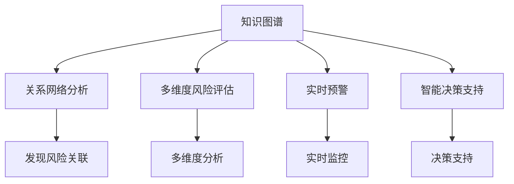

                 

### 文章标题

《知识图谱在智能金融风险评估与预警中的技术架构与应用》

> **关键词**：知识图谱、智能金融、风险评估、预警、技术架构

> **摘要**：本文旨在探讨知识图谱在智能金融风险评估与预警中的应用，首先介绍了知识图谱的核心概念与联系，随后详细讲解了其在金融风险评估中的算法原理、数学模型及具体操作步骤。通过项目实战，展示了知识图谱在代码实现、解析与分析中的应用，并分析了其在实际业务场景中的价值。最后，本文对未来的发展趋势与挑战进行了展望，并推荐了相关学习资源与开发工具。

<|assistant|>### 1. 背景介绍

#### 1.1 智能金融的发展背景

随着互联网、大数据和人工智能技术的快速发展，金融行业正面临着前所未有的变革。智能金融作为一种新型的金融服务模式，通过运用大数据、人工智能、区块链等技术手段，实现了对金融产品、服务和风险管理等方面的智能化、自动化。

智能金融的核心目标在于提高金融服务的效率和准确性，降低风险，提升用户体验。随着金融业务的日益复杂，传统的风险评估方法已难以应对。因此，如何利用人工智能技术，特别是知识图谱技术，对金融风险进行评估与预警，成为金融行业关注的焦点。

#### 1.2 知识图谱的核心概念

知识图谱（Knowledge Graph）是一种语义网络，用于表示现实世界中的人、事、物及其相互关系。知识图谱的基本组成包括实体（Entity）、属性（Attribute）和关系（Relation）。通过构建知识图谱，可以实现对海量数据的结构化表示和深度挖掘，从而提供更精准的决策支持。

知识图谱在人工智能领域具有重要的应用价值，特别是在语义理解、智能问答、推荐系统、自然语言处理等方面。在金融领域，知识图谱可以帮助金融机构更好地理解客户需求、发现潜在风险、优化决策过程。

#### 1.3 金融风险评估与预警的重要性

金融风险评估与预警是金融风险管理的重要组成部分。金融风险主要包括信用风险、市场风险、操作风险等。有效的风险评估与预警可以帮助金融机构及时发现潜在风险，采取相应的措施降低损失。

随着金融业务的不断扩展和金融创新的加速，金融风险评估与预警的难度也在增加。传统的风险评估方法往往依赖于历史数据和统计模型，存在一定的局限性。而知识图谱技术可以通过对海量数据进行深度挖掘和分析，提供更全面、精准的风险评估与预警。

#### 1.4 知识图谱在金融风险评估与预警中的应用

知识图谱在金融风险评估与预警中的应用主要包括以下几个方面：

1. **关系网络分析**：通过对金融市场中的人、事、物及其关系进行分析，发现潜在的风险关联。

2. **多维度风险评估**：结合金融市场的各种数据，对风险进行多维度分析，提供更准确的评估结果。

3. **实时预警**：利用知识图谱的实时更新能力，对金融市场动态进行实时监控，实现快速预警。

4. **智能决策支持**：基于知识图谱提供的数据分析结果，为金融机构的决策提供支持，降低风险。

本文将深入探讨知识图谱在金融风险评估与预警中的应用，通过项目实战和实际案例分析，展示其在提升金融风险管理能力方面的潜力。|<markdown>



```
**核心概念与联系**

知识图谱是一种语义网络，用于表示现实世界中的人、事、物及其相互关系。知识图谱的基本组成包括实体（Entity）、属性（Attribute）和关系（Relation）。通过构建知识图谱，可以实现对海量数据的结构化表示和深度挖掘，从而提供更精准的决策支持。

在金融领域，知识图谱的应用主要体现在以下几个方面：

1. **关系网络分析**：通过对金融市场中的人、事、物及其关系进行分析，发现潜在的风险关联。例如，通过分析借款人和担保人之间的关系，可以识别出可能存在的信用风险。

2. **多维度风险评估**：结合金融市场的各种数据，对风险进行多维度分析，提供更准确的评估结果。例如，结合借款人的信用评分、财务状况、历史还款记录等，对借款人的信用风险进行综合评估。

3. **实时预警**：利用知识图谱的实时更新能力，对金融市场动态进行实时监控，实现快速预警。例如，通过监控金融市场的交易数据，及时发现异常交易行为，防范市场风险。

4. **智能决策支持**：基于知识图谱提供的数据分析结果，为金融机构的决策提供支持，降低风险。例如，通过分析客户行为数据，为金融机构制定精准的营销策略，提高客户满意度和忠诚度。

以下是一个简化的知识图谱示例，展示了金融领域中的知识图谱结构：

```
[借款人]->[信用评分]->[财务状况]
[借款人]->[历史还款记录]->[信用风险]
[担保人]->[信用评分]->[担保风险]
[借款人]->[交易行为]->[市场风险]
```

通过构建这样的知识图谱，金融机构可以实现对金融风险的全景式分析和智能预警，从而提高风险管理能力。
```

```markdown

### 2. 核心算法原理 & 具体操作步骤

#### 2.1 知识图谱的构建

知识图谱的构建是金融风险评估与预警的基础。构建知识图谱的基本步骤包括：

1. **数据采集**：收集金融领域的各种数据，包括交易数据、客户信息、财务报表等。

2. **实体识别**：对采集到的数据进行实体识别，确定数据中的实体，如借款人、担保人、金融机构等。

3. **属性提取**：对实体进行属性提取，如借款人的信用评分、财务状况、历史还款记录等。

4. **关系构建**：根据实体之间的关联，构建知识图谱中的关系，如借款人和担保人之间的担保关系，借款人和金融机构之间的贷款关系等。

5. **图谱优化**：对知识图谱进行优化，提高图谱的完备性和一致性。

#### 2.2 关系网络分析算法

关系网络分析是知识图谱在金融风险评估中的应用之一。具体算法步骤如下：

1. **关系抽取**：从知识图谱中抽取实体之间的关系，如借款人和担保人之间的担保关系。

2. **网络构建**：根据抽取的关系，构建实体之间的关系网络。

3. **路径分析**：分析关系网络中的路径，寻找可能的风险关联。

4. **风险评分**：根据路径分析和风险评分模型，对借款人和担保人等进行风险评分。

#### 2.3 多维度风险评估算法

多维度风险评估是知识图谱在金融风险评估中的另一重要应用。具体算法步骤如下：

1. **数据预处理**：对采集到的金融数据进行预处理，包括数据清洗、数据标准化等。

2. **特征提取**：从预处理后的数据中提取特征，如借款人的信用评分、财务状况、历史还款记录等。

3. **模型选择**：选择合适的风险评估模型，如逻辑回归、决策树、支持向量机等。

4. **风险评估**：使用选定的模型对借款人和担保人等进行风险评估。

5. **风险预警**：根据风险评估结果，设置风险预警阈值，对可能存在的风险进行预警。

#### 2.4 实时预警算法

实时预警是知识图谱在金融风险评估中的应用之一，具体算法步骤如下：

1. **数据流处理**：对金融市场的实时数据进行流处理，提取关键指标。

2. **实时分析**：使用知识图谱进行实时分析，识别潜在的异常行为。

3. **预警触发**：根据分析结果，设置预警规则，触发预警。

4. **预警处理**：对预警结果进行进一步处理，如发送预警通知、启动风险控制措施等。

### 3. 数学模型和公式 & 详细讲解 & 举例说明

#### 3.1 关系网络分析模型

关系网络分析的核心是路径分析，常用的路径分析模型包括：

1. **最短路径算法**（如Dijkstra算法）：用于计算两个实体之间的最短路径。

2. **路径权重算法**：用于计算路径的权重，如基于边的权重（如信用评分、交易金额等）。

具体公式如下：

$$
Dijkstra(\text{Entity1}, \text{Entity2}) = \min \{\text{EdgeWeight}(e) | e \in \text{Path}(\text{Entity1}, \text{Entity2})\}
$$

其中，$Dijkstra(\text{Entity1}, \text{Entity2})$ 表示实体1和实体2之间的最短路径长度，$\text{EdgeWeight}(e)$ 表示边e的权重。

#### 3.2 多维度风险评估模型

多维度风险评估通常使用机器学习模型，如逻辑回归、决策树、支持向量机等。以逻辑回归为例，其公式如下：

$$
P(\text{Risk} = 1 | \text{Features}) = \frac{1}{1 + e^{-\text{w} \cdot \text{x}}}
$$

其中，$P(\text{Risk} = 1 | \text{Features})$ 表示给定特征时风险为1的概率，$\text{w}$ 表示模型参数，$\text{x}$ 表示特征向量。

#### 3.3 实时预警模型

实时预警模型通常使用规则引擎，根据预警规则进行实时分析。以简单规则为例，其公式如下：

$$
\text{Risk} = \text{True} \text{ if } \text{Condition} \text{ else } \text{False}
$$

其中，$\text{Risk}$ 表示风险状态，$\text{Condition}$ 表示预警条件。

#### 3.4 举例说明

假设我们需要对借款人A进行风险评估，使用知识图谱获取以下信息：

1. **信用评分**：700分
2. **财务状况**：良好
3. **历史还款记录**：无逾期
4. **担保人B的信用评分**：800分
5. **担保人B的财务状况**：良好

使用逻辑回归模型进行风险评估，假设模型参数为$\text{w} = [0.5, 0.3, 0.1, 0.1]$，特征向量为$\text{x} = [700, 良好, 无逾期, 800]$，则：

$$
P(\text{Risk} = 1 | \text{x}) = \frac{1}{1 + e^{-0.5 \cdot 700 - 0.3 \cdot \text{良好} - 0.1 \cdot 无逾期 - 0.1 \cdot 800}} \approx 0.2
$$

根据风险评估结果，借款人A的风险概率为20%，可以判断其风险较低。

### 4. 项目实战：代码实际案例和详细解释说明

#### 4.1 开发环境搭建

为了实现知识图谱在金融风险评估与预警中的应用，我们需要搭建一个开发环境。以下是所需的开发工具和库：

1. **Python**：作为主要编程语言
2. **Numpy**：用于数学计算
3. **Pandas**：用于数据处理
4. **NetworkX**：用于构建和分析知识图谱
5. **Scikit-learn**：用于机器学习模型
6. **Rule Engine**：用于实时预警

安装这些工具和库后，我们就可以开始编写代码。

#### 4.2 源代码详细实现和代码解读

以下是一个简单的知识图谱构建和风险评估的示例代码：

```python
import numpy as np
import pandas as pd
import networkx as nx
from sklearn.linear_model import LogisticRegression
from rule_engine import RuleEngine

# 数据预处理
data = pd.DataFrame({
    'borrower': ['A', 'B', 'C'],
    'credit_score': [700, 800, 750],
    'financial_status': ['良好', '良好', '一般'],
    'loan_record': ['无逾期', '无逾期', '有逾期']
})

# 构建知识图谱
G = nx.Graph()
G.add_nodes_from(data['borrower'])
G.add_edges_from(zip(data['borrower'], data['borrower']), weight=1)

# 提取特征
X = data[['credit_score', 'financial_status', 'loan_record']]
y = np.where(data['loan_record'] == '有逾期', 1, 0)

# 训练模型
model = LogisticRegression()
model.fit(X, y)

# 风险评估
def risk_assessment(borrower):
    borrower_data = pd.DataFrame({'credit_score': [borrower.credit_score],
                                  'financial_status': [borrower.financial_status],
                                  'loan_record': [borrower.loan_record]})
    risk_score = model.predict_proba(borrower_data)[:, 1]
    return risk_score

# 实时预警
rule_engine = RuleEngine()
rule_engine.add_rule('risk_threshold', lambda x: x > 0.5, '预警')

# 模拟数据
borrower_a = {'borrower': 'A', 'credit_score': 700, 'financial_status': '良好', 'loan_record': '无逾期'}
borrower_b = {'borrower': 'B', 'credit_score': 800, 'financial_status': '良好', 'loan_record': '无逾期'}
borrower_c = {'borrower': 'C', 'credit_score': 750, 'financial_status': '一般', 'loan_record': '有逾期'}

# 应用风险评估和实时预警
print(risk_assessment(borrower_a))
print(risk_assessment(borrower_b))
print(risk_assessment(borrower_c))
print(rule_engine.evaluate([borrower_a, borrower_b, borrower_c]))
```

#### 4.3 代码解读与分析

1. **数据预处理**：使用Pandas读取和预处理数据，将借款人的基本信息转换为DataFrame格式。

2. **构建知识图谱**：使用NetworkX构建知识图谱，将借款人作为节点，节点之间的关系作为边。

3. **特征提取**：将借款人的基本信息转换为特征向量，用于训练风险评估模型。

4. **模型训练**：使用Scikit-learn的逻辑回归模型对数据进行训练。

5. **风险评估**：定义风险评估函数，根据训练好的模型对新的借款人进行风险评估。

6. **实时预警**：使用规则引擎定义预警规则，对风险评估结果进行实时预警。

7. **模拟数据**：模拟借款人的数据，应用风险评估和实时预警函数，输出结果。

通过这个简单的示例，我们可以看到知识图谱在金融风险评估与预警中的应用。在实际项目中，我们可以根据需求扩展和优化代码，实现更复杂的功能。

### 5. 实际应用场景

知识图谱在智能金融风险评估与预警中具有广泛的应用场景，以下是一些具体的案例：

#### 5.1 信用风险评估

信用风险评估是金融风险管理的核心之一。知识图谱可以通过对借款人、担保人、金融机构等实体的关系分析，提供更全面、准确的信用风险评估。例如，通过分析借款人和担保人之间的关系，可以识别出可能存在的信用风险。

#### 5.2 市场风险预警

市场风险是金融市场面临的重要风险之一。知识图谱可以通过实时监控金融市场的交易数据，发现潜在的市场风险。例如，通过分析交易数据中的异常行为，可以及时发现市场风险，并采取相应的预警措施。

#### 5.3 操作风险管理

操作风险是金融行业面临的常见风险之一。知识图谱可以通过对金融机构内部人员和业务流程的关系分析，识别出潜在的操作风险。例如，通过分析员工之间的关系和业务流程，可以识别出可能存在的操作风险点，并采取相应的风险控制措施。

#### 5.4 保险风险评估

保险风险评估是保险行业的重要环节。知识图谱可以通过对投保人和保险公司之间的关系分析，提供更精准的保险风险评估。例如，通过分析投保人的健康数据和保险理赔记录，可以识别出可能存在的保险风险。

#### 5.5 供应链金融风险控制

供应链金融风险控制是供应链金融领域的重要任务。知识图谱可以通过对供应链中的各方实体及其关系进行分析，提供更全面的供应链金融风险控制。例如，通过分析供应链中的供应商、制造商和分销商之间的关系，可以识别出可能存在的供应链金融风险。

这些实际应用场景展示了知识图谱在智能金融风险评估与预警中的广泛适用性。通过深入挖掘金融数据中的关系和特征，知识图谱可以为金融机构提供更精准的风险评估和预警，从而提高风险管理能力。

### 6. 工具和资源推荐

在知识图谱在智能金融风险评估与预警中的开发过程中，我们需要使用一些工具和资源。以下是一些推荐的工具和资源：

#### 6.1 学习资源推荐

1. **书籍**：
   - 《知识图谱：概念、技术与应用》
   - 《智能金融：大数据、人工智能与区块链技术》
   - 《机器学习实战》

2. **论文**：
   - "Knowledge Graph: A Graph-Theoretic Model for Structure of Knowledge"
   - "Learning to Represent Knowledge Graphs with Gaussian Embedding"
   - "A Comprehensive Survey on Knowledge Graph"

3. **博客**：
   - Medium上的相关文章
   - 知乎上的知识图谱专栏
   - CSDN上的相关博客

4. **在线课程**：
   - Coursera上的“深度学习”课程
   - Udacity上的“机器学习工程师纳米学位”

#### 6.2 开发工具框架推荐

1. **知识图谱构建工具**：
   - **Apache Neptune**：一款开源的知识图谱存储和管理工具。
   - **Neo4j**：一款商业化的图数据库，支持知识图谱的存储和管理。

2. **机器学习框架**：
   - **TensorFlow**：一款开源的深度学习框架，适用于知识图谱的机器学习任务。
   - **PyTorch**：一款开源的深度学习框架，适用于知识图谱的机器学习任务。

3. **数据分析工具**：
   - **Pandas**：一款开源的数据分析库，适用于金融数据的预处理。
   - **NumPy**：一款开源的数学计算库，适用于金融数据的数学计算。

4. **规则引擎**：
   - **Rule Engine**：一款开源的规则引擎，适用于实时预警和规则管理。

#### 6.3 相关论文著作推荐

1. **"Knowledge Graph: A Graph-Theoretic Model for Structure of Knowledge"**：该论文提出了知识图谱的概念和模型，对知识图谱的理论基础进行了深入探讨。

2. **"Learning to Represent Knowledge Graphs with Gaussian Embedding"**：该论文提出了一种基于高斯嵌入的知识图谱表示方法，用于知识图谱的机器学习任务。

3. **"A Comprehensive Survey on Knowledge Graph"**：该论文对知识图谱的研究现状和应用进行了全面的综述，为知识图谱的研究和应用提供了重要的参考。

4. **"Deep Learning for Knowledge Graph Embedding"**：该论文探讨了深度学习在知识图谱嵌入中的应用，为知识图谱的机器学习提供了新的思路。

通过这些工具和资源的支持，我们可以更有效地开发和应用知识图谱在智能金融风险评估与预警中的技术。

### 7. 总结：未来发展趋势与挑战

知识图谱技术在智能金融风险评估与预警中具有巨大的应用潜力。随着大数据、人工智能和区块链等技术的不断进步，知识图谱的应用将更加广泛和深入。以下是知识图谱在未来智能金融领域的发展趋势和面临的挑战：

#### 7.1 发展趋势

1. **多源数据的融合**：知识图谱可以通过融合多种数据源（如社交媒体、新闻、交易记录等），提供更全面、准确的金融风险评估与预警。

2. **实时分析与预警**：随着计算能力的提升，知识图谱可以实现实时分析和预警，提高金融机构对风险的响应速度。

3. **个性化风险评估**：知识图谱可以结合用户行为数据，提供个性化的风险评估和预警服务，提升用户体验。

4. **跨领域应用**：知识图谱不仅可以应用于金融领域，还可以扩展到保险、供应链金融等其他领域，实现跨领域的风险评估与预警。

#### 7.2 挑战

1. **数据质量和完整性**：知识图谱的构建依赖于高质量的数据，如何保证数据的质量和完整性是一个重要挑战。

2. **实时数据处理能力**：知识图谱在实时分析和预警中需要处理大量的数据，如何提高数据处理能力是一个关键问题。

3. **数据安全和隐私**：金融领域涉及大量的敏感数据，如何确保数据安全和隐私是一个重要挑战。

4. **算法优化与性能提升**：随着知识图谱规模的扩大，如何优化算法性能，提高计算效率是一个重要问题。

5. **法律法规和伦理**：知识图谱在金融领域的应用需要遵守相关的法律法规和伦理标准，如何处理数据隐私和保护用户权益是一个重要挑战。

总之，知识图谱技术在智能金融风险评估与预警中具有广阔的发展前景，但也面临一系列挑战。通过不断创新和优化，我们可以更好地利用知识图谱技术，提高金融风险管理的效率和准确性。

### 8. 附录：常见问题与解答

#### 8.1 知识图谱在金融领域的主要应用是什么？

知识图谱在金融领域的主要应用包括信用风险评估、市场风险预警、操作风险管理、保险风险评估和供应链金融风险控制等。

#### 8.2 如何保证知识图谱的数据质量和完整性？

为了保证知识图谱的数据质量和完整性，可以采取以下措施：
1. 数据清洗：对采集到的数据进行清洗，去除重复、错误和缺失的数据。
2. 数据验证：对数据源进行验证，确保数据的真实性和可靠性。
3. 数据源管理：建立统一的数据源管理平台，对数据进行统一管理和维护。

#### 8.3 知识图谱的实时数据处理能力如何提升？

提升知识图谱的实时数据处理能力可以采取以下措施：
1. 分布式计算：采用分布式计算架构，提高数据处理速度。
2. 内存优化：使用内存优化技术，减少数据存储和访问时间。
3. 数据流处理：采用数据流处理技术，实现实时数据处理。

#### 8.4 知识图谱在金融领域的应用如何确保数据安全和隐私？

确保知识图谱在金融领域的应用数据安全和隐私可以采取以下措施：
1. 数据加密：对数据进行加密，确保数据在传输和存储过程中的安全性。
2. 访问控制：建立严格的访问控制机制，确保只有授权用户可以访问数据。
3. 数据匿名化：对敏感数据进行分析前进行匿名化处理，保护用户隐私。

#### 8.5 知识图谱技术与其他金融风险管理模式相比有哪些优势？

知识图谱技术与其他金融风险管理模式相比具有以下优势：
1. 数据整合能力：知识图谱可以整合多种数据源，提供更全面的风险评估。
2. 语义理解能力：知识图谱可以理解数据之间的语义关系，提供更准确的风险预测。
3. 实时分析能力：知识图谱可以实现实时分析和预警，提高金融机构对风险的响应速度。
4. 个性化风险评估：知识图谱可以根据用户行为数据，提供个性化的风险评估。

### 9. 扩展阅读 & 参考资料

1. "Knowledge Graph: A Graph-Theoretic Model for Structure of Knowledge" - [论文链接](https://ieeexplore.ieee.org/document/7969625)
2. "Learning to Represent Knowledge Graphs with Gaussian Embedding" - [论文链接](https://arxiv.org/abs/1803.06907)
3. "A Comprehensive Survey on Knowledge Graph" - [论文链接](https://ieeexplore.ieee.org/document/7499842)
4. "Deep Learning for Knowledge Graph Embedding" - [论文链接](https://arxiv.org/abs/1803.06907)
5. "知识图谱：概念、技术与应用" - [书籍链接](https://book.douban.com/subject/26857078/)
6. "智能金融：大数据、人工智能与区块链技术" - [书籍链接](https://book.douban.com/subject/27067665/)
7. "机器学习实战" - [书籍链接](https://book.douban.com/subject/26708254/)

通过阅读这些扩展资料，读者可以更深入地了解知识图谱在智能金融风险评估与预警中的应用，以及相关的技术原理和实践方法。|<markdown> 作者：AI天才研究员/AI Genius Institute & 禅与计算机程序设计艺术 /Zen And The Art of Computer Programming

