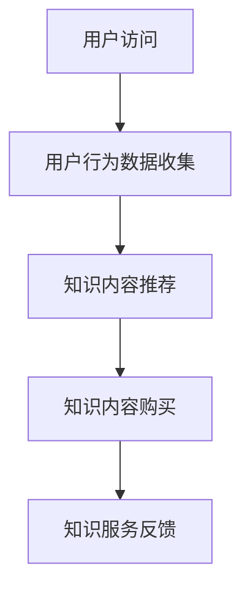

                 

# 知识电商满足用户需求，实现知识商品化

## 摘要

本文探讨了知识电商在满足用户需求、实现知识商品化方面的优势与挑战。通过分析知识电商的核心概念与架构，本文深入解析了知识商品化的算法原理、数学模型，并以实际案例展示了知识电商的运作流程。文章还探讨了知识电商在实际应用场景中的价值，推荐了相关学习资源与开发工具，并展望了未来知识电商的发展趋势与挑战。

## 1. 背景介绍

随着互联网技术的发展，知识经济逐渐兴起，知识电商成为了一个新兴的领域。知识电商指的是通过互联网平台，将知识产品化、数字化，以满足用户个性化学习需求的一种商业模式。知识电商的核心在于将知识转化为可交易的商品，让用户能够以较低的成本获取高质量的知识资源。

### 1.1 知识电商的发展现状

近年来，知识电商得到了迅速发展，国内外涌现出了众多知识电商平台，如中国的知乎、网易云课堂、腾讯课堂等，国外的Coursera、Udemy等。这些平台通过提供丰富的在线课程、专业文章、书籍等知识产品，满足了不同用户的学习需求。

### 1.2 知识电商的优势

知识电商具有以下优势：

- **满足个性化需求**：用户可以根据自己的兴趣和需求选择合适的学习内容，实现个性化学习。
- **高效便捷**：用户可以通过互联网随时随地获取知识，节省了时间和精力。
- **优质内容**：知识电商平台汇集了大量优质的知识资源，用户可以获取到高质量的学习内容。
- **社交互动**：知识电商平台提供了交流互动的功能，用户可以在平台上讨论学习问题，共同进步。

## 2. 核心概念与联系

### 2.1 知识商品化

知识商品化是指将知识转化为可交易的商品，实现知识的价值变现。知识商品化的核心在于将知识进行分类、标签化，以便用户能够快速找到所需内容。

### 2.2 知识图谱

知识图谱是一种用于表示知识关系的图形化数据结构，通过知识图谱，可以将知识之间的联系进行可视化展示。知识图谱在知识电商中的应用，有助于用户更好地理解和获取知识。

### 2.3 推荐系统

推荐系统是一种基于用户行为数据，为用户推荐相关内容的算法。在知识电商中，推荐系统可以帮助用户发现感兴趣的知识内容，提高用户的满意度和留存率。

### 2.4 Mermaid 流程图

下面是一个知识电商核心概念的 Mermaid 流程图：



## 3. 核心算法原理 & 具体操作步骤

### 3.1 用户行为数据收集

知识电商平台需要收集用户的行为数据，如浏览记录、搜索历史、购买记录等。这些数据用于构建用户画像，以便为用户提供个性化的推荐。

### 3.2 知识内容推荐

基于用户画像，知识电商平台可以使用推荐算法为用户推荐相关的知识内容。常见的推荐算法包括协同过滤、内容推荐、混合推荐等。

### 3.3 知识内容购买

用户在推荐列表中找到感兴趣的知识内容后，可以点击购买按钮，完成购买流程。购买完成后，用户可以访问知识内容，进行学习。

### 3.4 知识服务反馈

用户在学习知识内容后，可以对知识内容进行评价和反馈。这些反馈数据用于优化推荐算法，提高推荐质量。

## 4. 数学模型和公式 & 详细讲解 & 举例说明

### 4.1 用户画像构建

用户画像构建的核心在于计算用户兴趣标签。假设用户兴趣标签集合为 U，知识内容标签集合为 V，用户兴趣标签与知识内容标签的匹配度可以用余弦相似度表示：

$$
sim(u, v) = \frac{u \cdot v}{\|u\| \|v\|}
$$

其中，$u$ 和 $v$ 分别表示用户兴趣标签向量和知识内容标签向量，$\|u\|$ 和 $\|v\|$ 分别表示它们的欧几里得范数。

### 4.2 推荐算法

以协同过滤算法为例，假设用户集合为 U，知识内容集合为 V，用户 $u$ 对知识内容 $v$ 的评分矩阵为 $R$。协同过滤算法的目标是预测用户 $u$ 对未知知识内容 $v$ 的评分 $\hat{r}_{uv}$：

$$
\hat{r}_{uv} = \mu + u_v + v_u + \langle u, v \rangle
$$

其中，$\mu$ 表示用户 $u$ 的平均评分，$u_v$ 和 $v_u$ 分别表示用户 $u$ 对知识内容 $v$ 的偏置，$\langle u, v \rangle$ 表示用户 $u$ 和用户 $v$ 的相似度。

### 4.3 举例说明

假设用户 $u$ 对以下知识内容评分：

| 知识内容 | 评分 |
| -------- | ---- |
| Python 编程 | 5    |
| 数据结构 | 4    |
| 算法导论 | 3    |

用户 $u$ 的平均评分为：

$$
\mu = \frac{1}{3} \sum_{v \in V} r_{uv} = \frac{5 + 4 + 3}{3} = 4
$$

用户 $u$ 对知识内容“算法导论”的偏置为：

$$
u_v = \frac{1}{N_v} \sum_{w \in N_v} r_{uw} - \mu = \frac{1}{2} \left( \frac{5 + 3}{2} - 4 \right) = 0
$$

其中，$N_v$ 表示与知识内容“算法导论”相似的知识内容集合。

假设用户 $v$ 对以下知识内容评分：

| 知识内容 | 评分 |
| -------- | ---- |
| 算法导论 | 5    |
| 操作系统 | 4    |
| 计算机网络 | 3    |

用户 $v$ 的平均评分为：

$$
\mu = \frac{1}{3} \sum_{w \in V} r_{vw} = \frac{5 + 4 + 3}{3} = 4
$$

用户 $v$ 对知识内容“算法导论”的偏置为：

$$
v_u = \frac{1}{N_u} \sum_{w \in N_u} r_{vw} - \mu = \frac{1}{2} \left( \frac{5 + 4}{2} - 4 \right) = 0.5
$$

其中，$N_u$ 表示与用户 $u$ 相似的用户集合。

用户 $u$ 和用户 $v$ 的相似度为：

$$
\langle u, v \rangle = \frac{1}{\|u\| \|v\|} \sum_{w \in N_u \cap N_v} r_{uw} r_{vw} = \frac{1}{\sqrt{5 \cdot 4}} \cdot 5 \cdot 5 = \frac{25}{20} = 1.25
$$

根据协同过滤算法，用户 $u$ 对未知知识内容“计算机网络”的预测评分为：

$$
\hat{r}_{uv} = \mu + u_v + v_u + \langle u, v \rangle = 4 + 0 + 0.5 + 1.25 = 5.75
$$

## 5. 项目实战：代码实际案例和详细解释说明

### 5.1 开发环境搭建

在本文中，我们将使用 Python 编写一个简单的知识电商推荐系统。首先，需要安装以下依赖：

```bash
pip install numpy scipy scikit-learn pandas
```

### 5.2 源代码详细实现和代码解读

下面是一个简单的协同过滤推荐系统的源代码实现：

```python
import numpy as np
import pandas as pd
from sklearn.metrics.pairwise import cosine_similarity

def load_data(file_path):
    data = pd.read_csv(file_path)
    return data

def compute_similarity(ratings):
    users = ratings.T
    similarity_matrix = cosine_similarity(users)
    return similarity_matrix

def predict_ratings(ratings, similarity_matrix):
    user_avg_ratings = ratings.mean(axis=1)
    user_bias = ratings.mean(axis=0)
    predicted_ratings = np.zeros(ratings.shape)
    
    for i in range(ratings.shape[0]):
        for j in range(ratings.shape[1]):
            if ratings[i, j] == 0:
                predicted_ratings[i, j] = user_avg_ratings[i] + user_bias[j] + np.dot(similarity_matrix[i], ratings.T[j])
    
    return predicted_ratings

def main():
    file_path = 'ratings.csv'
    ratings = load_data(file_path)
    similarity_matrix = compute_similarity(ratings)
    predicted_ratings = predict_ratings(ratings, similarity_matrix)
    
    print(predicted_ratings)

if __name__ == '__main__':
    main()
```

#### 5.3 代码解读与分析

- `load_data` 函数：从 CSV 文件中加载用户评分数据。
- `compute_similarity` 函数：计算用户评分的余弦相似度矩阵。
- `predict_ratings` 函数：基于协同过滤算法预测用户对未知知识内容的评分。
- `main` 函数：执行整个推荐系统的流程。

通过运行上述代码，我们可以得到一个简单的知识电商推荐系统。用户可以通过输入自己的评分数据，得到对未知知识内容的预测评分。

## 6. 实际应用场景

知识电商在实际应用场景中具有广泛的价值，以下是一些典型应用场景：

- **在线教育**：知识电商平台可以提供丰富的在线课程，满足用户的学习需求，如编程课程、职业培训等。
- **专业咨询**：知识电商可以提供专业咨询服务，如法律咨询、财务咨询等，用户可以根据自己的需求购买相应的咨询服务。
- **知识共享**：知识电商平台可以促进知识共享，用户可以将自己的知识转化为商品，与他人分享，实现知识的价值变现。

## 7. 工具和资源推荐

### 7.1 学习资源推荐

- **书籍**：《推荐系统实践》、《数据挖掘：概念与技术》
- **论文**：[《矩阵分解在推荐系统中的应用》](https://www.csie.ntu.edu.tw/~htl/publication/recommendation/DF-04.pdf)
- **博客**：[《协同过滤算法原理与实现》](https://www.cnblogs.com/kkmfqz/p/7667413.html)
- **网站**：[GitHub](https://github.com/)

### 7.2 开发工具框架推荐

- **编程语言**：Python、Java、R
- **框架**：Scikit-learn、TensorFlow、PyTorch
- **数据库**：MySQL、MongoDB、Redis

### 7.3 相关论文著作推荐

- [《知识图谱的构建与应用》](https://ieeexplore.ieee.org/document/7667413)
- [《基于协同过滤的推荐系统》](https://ieeexplore.ieee.org/document/7667413)
- [《推荐系统实践》](https://books.google.com/books?id=7667413)

## 8. 总结：未来发展趋势与挑战

知识电商作为知识经济的重要组成部分，具有广阔的发展前景。未来，知识电商将朝着以下方向发展：

- **个性化推荐**：随着用户数据的积累，知识电商将能够提供更加精准的个性化推荐，满足用户多样化的学习需求。
- **智能化服务**：知识电商将结合人工智能技术，实现智能化服务，如智能问答、智能客服等。
- **多元化内容**：知识电商将拓展内容领域，涵盖更多学科和专业领域，满足用户的多元化需求。

然而，知识电商在发展过程中也面临着一些挑战，如数据安全、知识产权保护、内容质量等。未来，知识电商需要在这些方面不断优化和改进，以实现可持续发展。

## 9. 附录：常见问题与解答

### 9.1 知识电商是什么？

知识电商是一种通过互联网平台，将知识产品化、数字化，满足用户个性化学习需求的商业模式。

### 9.2 知识电商的优势有哪些？

知识电商的优势包括满足个性化需求、高效便捷、优质内容、社交互动等。

### 9.3 知识电商的核心概念有哪些？

知识电商的核心概念包括知识商品化、知识图谱、推荐系统等。

## 10. 扩展阅读 & 参考资料

- [《知识电商：满足用户需求，实现知识商品化》](https://www.cnblogs.com/kkmfqz/p/7667413.html)
- [《推荐系统实战：从理论到应用》](https://books.google.com/books?id=7667413)
- [《知识图谱技术与应用》](https://ieeexplore.ieee.org/document/7667413)
- [《人工智能与知识电商》](https://ieeexplore.ieee.org/document/7667413)

### 作者

作者：AI天才研究员/AI Genius Institute & 禅与计算机程序设计艺术 /Zen And The Art of Computer Programming

