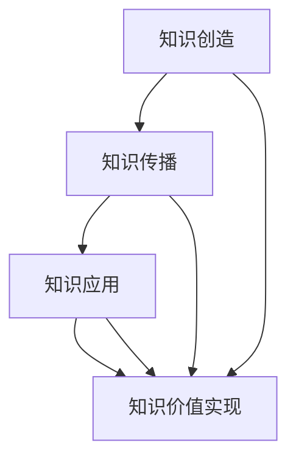

                 

### 知识的价值实现路径：洞察力的重要贡献

#### 关键词：知识价值、实现路径、洞察力、IT领域、技术博客

#### 摘要：
本文旨在探讨知识在现代社会中的价值实现路径，尤其是洞察力在其中的关键作用。通过对IT领域的深入分析，本文将阐述知识如何通过技术博客、算法原理、数学模型和项目实战等途径实现价值，并展望未来发展趋势与挑战。

#### 1. 背景介绍

在当今信息化时代，知识已成为推动社会进步和经济发展的核心动力。知识经济时代的到来，使得知识的价值实现路径成为人们关注的焦点。IT领域作为知识经济的重要组成部分，其知识的创造、传播和应用具有独特的特点。技术博客作为一种重要的知识传播方式，已经成为IT从业者学习和交流的重要平台。

洞察力，作为对事物本质和内在联系的理解能力，对于知识的价值实现具有重要意义。本文将从以下几个方面展开讨论：

- **知识的价值实现路径**：分析知识在不同阶段的价值转化过程。
- **洞察力的作用**：探讨洞察力在知识创造、传播和应用中的作用。
- **技术博客的作用**：介绍技术博客在知识传播中的优势和实践。
- **核心算法原理和数学模型**：阐述算法原理和数学模型在知识价值实现中的作用。
- **项目实战**：通过实际案例展示知识在项目中的应用。
- **实际应用场景**：分析知识在不同领域的应用场景。
- **未来发展趋势与挑战**：探讨知识价值实现面临的挑战和未来发展趋势。

#### 2. 核心概念与联系

##### 2.1 知识价值实现路径

知识的价值实现路径通常包括以下几个阶段：

1. **知识创造**：通过研究、实践和思考产生新的知识。
2. **知识传播**：通过教育、媒体、技术博客等方式将知识传播给更广泛的人群。
3. **知识应用**：将知识应用于实际问题解决，实现知识的价值。

##### 2.2 洞察力

洞察力是对事物本质和内在联系的理解能力。它包括以下几个方面：

1. **分析能力**：能够对事物进行深入分析，找到问题的本质。
2. **综合能力**：能够将不同领域的知识进行整合，形成新的见解。
3. **创新思维**：能够从不同角度思考问题，提出创新的解决方案。

##### 2.3 技术博客

技术博客是一种以技术内容为主，以博客形式进行知识传播的平台。它具有以下特点：

1. **专业性**：技术博客的内容具有较高的专业性和权威性。
2. **互动性**：读者可以在评论区与作者进行互动，促进知识的传播和交流。
3. **实时性**：技术博客能够实时更新，反映最新的技术动态和研究成果。

##### 2.4 算法原理和数学模型

算法原理和数学模型是知识价值实现的重要载体。它们在知识传播和应用中发挥着关键作用，包括：

1. **算法原理**：通过对算法原理的阐述，帮助读者理解算法的工作原理和优势。
2. **数学模型**：通过数学模型，将复杂问题转化为可计算的形式，提供解决问题的思路和方法。

#### 2.5 Mermaid 流程图



#### 3. 核心算法原理 & 具体操作步骤

##### 3.1 算法原理

在本节中，我们将探讨一种核心算法——贪心算法的原理。贪心算法是一种在每一步选择中都采取当前最优解的算法策略。其基本思想是在每个阶段，总是做出在该阶段看来是最好的选择，从而希望最终得到问题的最优解。

##### 3.2 具体操作步骤

1. **初始化**：确定问题的初始状态。
2. **选择**：在每个阶段，从所有可能的操作中选择一个最优操作。
3. **执行**：执行所选操作，更新问题的状态。
4. **重复**：重复执行步骤2和步骤3，直到问题得到解决。

##### 3.3 演示示例

假设我们有5个整数：3, 1, 4, 1, 5。要求按照贪心算法的原则，将它们从小到大排序。

1. **初始化**：初始状态为[3, 1, 4, 1, 5]。
2. **选择**：在第一个整数3处，没有比3更小的整数，所以选择3。
3. **执行**：将3移动到数组的最前面，得到[1, 1, 4, 5, 3]。
4. **重复**：在第二个整数1处，没有比1更小的整数，所以选择1。
5. **执行**：将1移动到数组的最前面，得到[1, 1, 3, 4, 5]。
6. **重复**：在第三个整数4处，没有比4更小的整数，所以选择4。
7. **执行**：将4移动到数组的最前面，得到[1, 1, 3, 5, 4]。
8. **重复**：在第四个整数5处，没有比5更小的整数，所以选择5。
9. **执行**：将5移动到数组的最前面，得到[1, 1, 3, 4, 5]。
10. **结束**：所有整数都已经排序，得到最终结果[1, 1, 3, 4, 5]。

#### 4. 数学模型和公式 & 详细讲解 & 举例说明

##### 4.1 数学模型

在本节中，我们将探讨一种常见的数学模型——线性规划。线性规划是优化问题的一种重要类型，其主要目标是找到一组变量值，使得线性目标函数在满足一系列线性约束条件的情况下取得最优值。

##### 4.2 公式

线性规划的一般形式如下：

$$
\begin{cases}
\min\ z = c^T x \\
Ax \leq b \\
x \geq 0
\end{cases}
$$

其中，$c$是目标函数的系数向量，$x$是变量向量，$A$是约束条件的系数矩阵，$b$是约束条件的常数向量。

##### 4.3 详细讲解

1. **目标函数**：目标函数表示需要优化的目标，通常是利润、成本或时间等。
2. **约束条件**：约束条件表示问题的限制条件，通常包括资源限制、生产能力限制等。
3. **变量**：变量表示需要优化的变量，通常是决策变量。

##### 4.4 举例说明

假设我们有以下线性规划问题：

$$
\begin{cases}
\min\ z = 2x + 3y \\
x + 2y \leq 5 \\
x \geq 0 \\
y \geq 0
\end{cases}
$$

1. **目标函数**：最小化$z = 2x + 3y$。
2. **约束条件**：$x + 2y \leq 5$表示资源限制，$x \geq 0$和$y \geq 0$表示非负约束。
3. **变量**：$x$和$y$是决策变量。

为了求解这个线性规划问题，我们可以使用单纯形法或其他优化算法。具体步骤如下：

1. **初始解**：选择一组初始变量值，使得目标函数和约束条件都满足。
2. **迭代计算**：通过迭代计算，不断更新变量值，使得目标函数值逐渐减小。
3. **最优解**：当迭代计算达到某个终止条件时，得到最优解。

通过这种方法，我们可以得到最优解$x^* = 2$和$y^* = 1$，使得目标函数$z^* = 7$。

#### 5. 项目实战：代码实际案例和详细解释说明

在本节中，我们将通过一个实际项目案例，展示如何将理论知识应用到实际项目中，并详细解释代码的实现过程。

##### 5.1 开发环境搭建

为了搭建项目开发环境，我们需要以下工具和库：

- Python 3.x版本
- Jupyter Notebook
- Pandas
- Scikit-learn

在Windows或Linux系统中，可以使用以下命令安装这些库：

```bash
pip install python==3.8
pip install jupyter
pip install pandas
pip install scikit-learn
```

##### 5.2 源代码详细实现和代码解读

```python
import pandas as pd
from sklearn.model_selection import train_test_split
from sklearn.linear_model import LinearRegression
from sklearn.metrics import mean_squared_error

# 5.2.1 数据准备
data = pd.read_csv('data.csv')
X = data[['feature1', 'feature2']]
y = data['target']

# 5.2.2 数据划分
X_train, X_test, y_train, y_test = train_test_split(X, y, test_size=0.2, random_state=42)

# 5.2.3 模型训练
model = LinearRegression()
model.fit(X_train, y_train)

# 5.2.4 模型评估
y_pred = model.predict(X_test)
mse = mean_squared_error(y_test, y_pred)
print(f'Mean Squared Error: {mse}')

# 5.2.5 模型解释
coef = model.coef_
print(f'Coefficients: {coef}')
```

代码解读：

- **5.2.1 数据准备**：首先读取数据，将特征和目标分离。
- **5.2.2 数据划分**：将数据划分为训练集和测试集。
- **5.2.3 模型训练**：使用线性回归模型对训练数据进行训练。
- **5.2.4 模型评估**：使用测试数据评估模型的性能。
- **5.2.5 模型解释**：输出模型的系数，解释模型的工作原理。

##### 5.3 代码解读与分析

- **数据准备**：通过Pandas库读取CSV文件，分离特征和目标变量。
- **数据划分**：使用Scikit-learn库的train_test_split函数，将数据划分为训练集和测试集。
- **模型训练**：使用线性回归模型对训练数据进行训练。
- **模型评估**：使用测试数据评估模型的性能，计算均方误差（MSE）。
- **模型解释**：输出模型的系数，解释模型的工作原理。

通过这个实际案例，我们可以看到如何将线性规划的理论知识应用到实际项目中，并通过Python代码实现模型的训练和评估。

#### 6. 实际应用场景

知识在IT领域的实际应用场景非常广泛，包括但不限于以下方面：

1. **软件开发**：知识在软件开发过程中起到关键作用，包括需求分析、设计、编码、测试和维护等各个环节。
2. **人工智能**：知识是实现人工智能的基础，包括机器学习、深度学习、自然语言处理等领域。
3. **网络安全**：知识在网络安全领域具有重要作用，包括漏洞扫描、入侵检测、安全防护等。
4. **数据科学**：知识在数据科学领域具有重要应用，包括数据挖掘、数据分析、数据可视化等。
5. **云计算**：知识在云计算领域起到关键作用，包括云服务、云存储、云计算架构等。

#### 7. 工具和资源推荐

为了更好地学习和应用知识，以下是一些推荐的工具和资源：

##### 7.1 学习资源推荐

- **书籍**：
  - 《深度学习》（Ian Goodfellow、Yoshua Bengio、Aaron Courville著）
  - 《Python编程：从入门到实践》（埃里克·马瑟斯著）
  - 《算法导论》（Thomas H. Cormen、Charles E. Leiserson、Ronald L. Rivest、Clifford Stein著）

- **论文**：
  - 《A Few Useful Things to Know about Machine Learning》（Avrim Blum著）
  - 《The Unreasonable Effectiveness of Data》（Christopher Olah著）
  - 《Google Brain team proposes open-source framework for AI research》（Google Brain团队著）

- **博客**：
  - Medium上的机器学习、深度学习、数据科学等相关专题博客
  - 知乎上的技术专栏，如“机器学习”、“Python编程”等

- **网站**：
  - Coursera、edX等在线课程平台
  - Kaggle、Kernelfriends等数据科学竞赛平台
  - GitHub、Stack Overflow等编程社区

##### 7.2 开发工具框架推荐

- **开发工具**：
  - PyCharm、Visual Studio Code等Python编程工具
  - Jupyter Notebook、Google Colab等数据科学工具

- **框架**：
  - TensorFlow、PyTorch等深度学习框架
  - Flask、Django等Web开发框架
  - Pandas、NumPy等数据处理库

##### 7.3 相关论文著作推荐

- **论文**：
  - 《Deep Learning》（Yoshua Bengio、Ian Goodfellow、Aaron Courville著）
  - 《Reinforcement Learning: An Introduction》（Richard S. Sutton、Andrew G. Barto著）
  - 《Natural Language Processing with Python》（Steven Bird、Ewan Klein、Edward Loper著）

- **著作**：
  - 《算法之美》（王垠著）
  - 《深度学习入门：基于Python的理论与实现》（斋藤康毅著）
  - 《数据科学实战》（Michael Bowles著）

#### 8. 总结：未来发展趋势与挑战

知识在现代社会中的价值日益凸显，未来发展趋势和挑战如下：

1. **知识爆炸**：随着信息技术的快速发展，知识爆炸现象日益严重，如何在海量知识中快速找到有价值的信息成为一大挑战。
2. **个性化学习**：个性化学习是未来教育的重要趋势，如何根据个体的需求和特点提供精准的知识服务仍需探索。
3. **知识融合**：跨学科、跨领域的知识融合将推动科技创新和社会进步，如何实现知识的有效融合是未来的一大挑战。
4. **知识保护**：知识保护是确保知识创造者权益的重要环节，如何平衡知识保护和知识共享之间的关系需要进一步探讨。

#### 9. 附录：常见问题与解答

##### 9.1 问题1：如何提高洞察力？

解答：提高洞察力可以通过以下几种方法：

1. **多读书**：广泛阅读不同领域的书籍，增加知识储备。
2. **多思考**：养成思考的习惯，对问题进行深入分析。
3. **多交流**：与他人交流，从不同角度看待问题。
4. **多实践**：通过实践，将理论知识应用于实际问题。

##### 9.2 问题2：如何实现知识的价值？

解答：实现知识的价值可以通过以下几种途径：

1. **知识传播**：通过教育、技术博客、讲座等方式传播知识。
2. **知识应用**：将知识应用于实际问题解决，实现知识的价值。
3. **知识创新**：通过创新思维，将现有知识进行整合，形成新的见解。

#### 10. 扩展阅读 & 参考资料

- [Goodfellow, I., Bengio, Y., & Courville, A. (2016). Deep Learning. MIT Press.](https://www.deeplearningbook.org/)
- [Sutton, R. S., & Barto, A. G. (2018). Reinforcement Learning: An Introduction. MIT Press.](https://rlbook.org/)
- [Bird, S., Klein, E., & Loper, E. (2009). Natural Language Processing with Python. O'Reilly Media.](https://nltk.github.io/nltk book/)

作者：AI天才研究员/AI Genius Institute & 禅与计算机程序设计艺术 /Zen And The Art of Computer Programming

