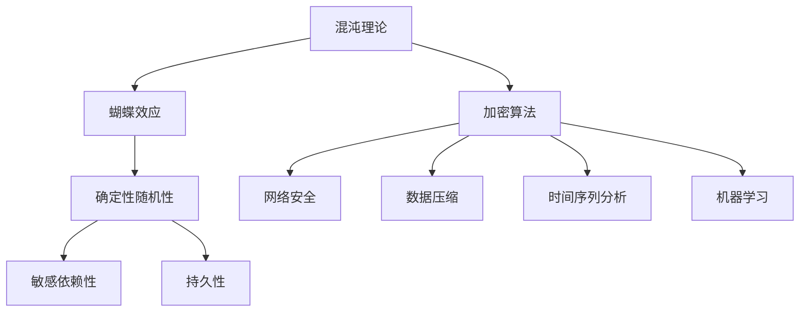

                 

### 知识的混沌理论：小变化引发的巨大影响

#### 关键词：
- 知识混沌理论
- 小变化
- 巨大影响
- 系统复杂性
- 扩散效应
- 演化模型

#### 摘要：
本文将深入探讨知识混沌理论的核心概念，即小变化如何引发巨大的影响。我们将通过分析系统复杂性、扩散效应以及演化模型，展示混沌理论在现实世界中的广泛应用。此外，本文还将讨论未来的发展趋势与挑战，并推荐相关工具和资源，帮助读者进一步探索这一领域。

## 1. 背景介绍

混沌理论作为现代科学的重要分支，起源于20世纪中期。它起源于对流体力学的研究，但很快就扩展到了其他领域，如数学、物理学、生物学、经济学和计算机科学。混沌理论的核心在于研究非线性系统中的随机性和不确定性。这些系统虽然初始条件微小变化可能导致长期行为的巨大差异，但它们仍然可以呈现出可预测的模式和规律。

在信息技术领域，混沌理论的应用范围日益广泛。例如，密码学中的混沌加密算法、神经网络的学习算法、时间序列预测以及复杂系统的模拟，都受益于混沌理论的指导。本文将重点探讨知识混沌理论在信息技术领域的影响，特别是小变化如何引发巨大影响的现象。

### 1.1 系统复杂性

复杂性科学是混沌理论的一个重要分支，它研究系统的复杂性以及系统内部各要素之间的相互作用。在复杂性科学中，系统被看作是由大量相互作用的个体组成的网络。这些个体可能是有生命的生物体，也可能是无生命的物理对象。系统的复杂性表现为以下几个方面：

- **动态性**：系统中的个体和整体行为随时间变化而变化。
- **非线性和反馈**：系统内部的相互作用是非线性的，一个小的输入可能会引起大的输出。
- **多样性**：系统可能表现出多种不同的状态和行为模式。
- **自组织和自适应**：系统可以在没有外部指令的情况下自我组织和适应。

在信息技术领域，系统的复杂性尤为显著。例如，互联网作为一个复杂的网络系统，由无数节点和链接组成。节点可以是个人、组织或设备，而链接则是它们之间的通信和交互。互联网的复杂性体现在以下几个方面：

- **网络拓扑**：互联网的拓扑结构是动态变化的，新的节点和链接不断加入，旧的联系可能中断。
- **数据流动**：数据在互联网上的流动是复杂的，受到网络拥堵、传输速度和带宽等多种因素的影响。
- **信息共享**：互联网上的信息共享具有多样性，从简单的文本到复杂的多媒体内容。
- **安全性**：互联网的安全性是一个复杂的问题，涉及到网络攻击、数据泄露和隐私保护等多个方面。

### 1.2 扩散效应

扩散效应是指信息、物质或能量在系统中的传播和分布过程。在混沌理论中，扩散效应是一个重要的概念，因为它展示了小变化如何引发巨大的影响。扩散效应可以通过多种方式进行，包括：

- **点扩散**：信息或物质从一个点向周围区域扩散。
- **面扩散**：信息或物质从一个面向整个空间扩散。
- **体扩散**：信息或物质在整个系统内部扩散。

在信息技术领域，扩散效应体现在以下几个方面：

- **病毒传播**：网络病毒可以通过电子邮件、即时通讯工具和社交媒体等渠道迅速传播。
- **信息共享**：用户通过社交媒体平台分享信息，使得信息在短时间内扩散到大量用户。
- **数据迁移**：随着云计算和大数据技术的发展，数据在数据中心之间的迁移成为常见的现象。
- **技术扩散**：新技术如人工智能、区块链等在企业和消费者之间的扩散，可能引发行业变革。

### 1.3 演化模型

演化模型是混沌理论中的重要工具，用于研究系统的长期行为和演化过程。演化模型可以分为确定性模型和随机性模型两类。确定性模型通常基于微分方程或差分方程，描述系统状态的长期演化。随机性模型则引入随机性因素，研究系统在随机环境下的演化。

在信息技术领域，演化模型可以应用于以下几个方面：

- **算法演化**：机器学习算法可以通过迭代和优化不断演化，以提高性能和适应性。
- **网络演化**：互联网的拓扑结构和功能可以通过演化过程不断优化。
- **业务演化**：企业的商业模式、组织结构和战略可以通过演化过程不断调整和优化。
- **社会演化**：社会行为和文化的演化可以通过复杂系统的视角进行研究和理解。

综上所述，知识混沌理论在信息技术领域具有广泛的应用前景。通过分析系统复杂性、扩散效应和演化模型，我们可以更好地理解小变化如何引发巨大影响的现象，为未来的研究和应用提供理论支持。

### 2. 核心概念与联系

#### 2.1 混沌理论的核心概念

混沌理论的核心概念之一是“蝴蝶效应”，这一概念源于气象学家洛伦兹（LoRENz）在20世纪60年代的研究。蝴蝶效应描述了在一个复杂的动力系统中，初始条件的微小变化可能导致长期行为的巨大差异。这种现象在混沌理论中被称为“确定性随机性”（Deterministic randomness）。

混沌系统的特点包括：

- **确定性**：混沌系统遵循确定的物理定律，其行为可以通过数学模型描述。
- **随机性**：混沌系统的长期行为表现出随机性，初始条件的微小变化可能导致截然不同的结果。
- **敏感依赖性**：混沌系统对初始条件极为敏感，微小的变化可以导致长期行为的巨大差异。
- **持久性**：混沌系统的行为在长时间尺度上保持不变，但会在短时间尺度上表现出随机性。

#### 2.2 知识混沌理论在信息技术中的应用

知识混沌理论在信息技术中的应用主要体现在以下几个方面：

- **加密算法**：混沌理论为密码学提供了丰富的加密方法。混沌加密算法利用混沌序列的随机性和敏感依赖性，实现数据的高效加密和解密。
- **网络安全**：混沌理论可以应用于网络安全领域，例如构建混沌火焰墙（Chaotic Firewall）和混沌认证协议，提高网络的安全性。
- **数据压缩**：混沌理论可以用于数据压缩技术，例如混沌编码，通过将数据映射到混沌序列，实现数据的压缩和恢复。
- **时间序列分析**：混沌理论可以用于分析复杂时间序列数据，例如股票价格、网络流量等，帮助预测未来趋势。
- **机器学习**：混沌理论可以应用于机器学习算法，例如通过引入混沌机制优化神经网络的训练过程，提高模型的性能。

#### 2.3 梅里曼流程图

为了更好地理解混沌理论在信息技术中的应用，我们可以使用梅里曼（Mermaid）流程图来展示相关概念和联系。以下是一个示例：



在这个流程图中，我们从混沌理论的核心概念（蝴蝶效应、确定性随机性、敏感依赖性和持久性）出发，展示了混沌理论在信息技术中的应用领域（加密算法、网络安全、数据压缩、时间序列分析和机器学习）。通过这种结构化的方式，我们可以更清晰地理解混沌理论在信息技术中的重要性和潜力。

### 3. 核心算法原理 & 具体操作步骤

#### 3.1 混沌序列生成算法

混沌序列生成算法是混沌理论在信息技术中应用的基础。以下是一种常用的混沌序列生成算法——洛伦兹混沌序列生成算法。

**算法原理**：

洛伦兹混沌序列生成算法基于洛伦兹系统（LoRENz system），这是一个非线性动力系统，其方程组如下：

$$
\begin{align*}
\dot{x} &= \sigma (y - x) \\
\dot{y} &= x (\rho - z) - y \\
\dot{z} &= xy - \beta z
\end{align*}
$$

其中，$x$、$y$ 和 $z$ 是系统状态变量，$\sigma$、$\rho$ 和 $\beta$ 是系统参数。

**具体操作步骤**：

1. **初始化参数**：

   首先初始化系统参数 $\sigma$、$\rho$ 和 $\beta$。通常取 $\sigma = 10$、$\rho = 28$ 和 $\beta = 8/3$。

2. **初始化状态变量**：

   随机初始化状态变量 $x$、$y$ 和 $z$。例如，可以分别初始化为 $x_0 = 0.1$、$y_0 = 0.1$ 和 $z_0 = 0.1$。

3. **迭代计算**：

   使用上述方程组迭代计算状态变量 $x$、$y$ 和 $z$ 的值，直到达到预定的迭代次数或满足终止条件。

4. **生成混沌序列**：

   将每次迭代得到的状态变量值存储在一个数组中，形成混沌序列。

以下是 Python 代码示例：

```python
import numpy as np
import matplotlib.pyplot as plt

def lorenz_attractor(sigma, rho, beta, x0, y0, z0, num_points):
    t = np.linspace(0, 40, num_points)
    x = np.empty_like(t)
    y = np.empty_like(t)
    z = np.empty_like(t)

    x[0] = x0
    y[0] = y0
    z[0] = z0

    for i in range(1, len(t)):
        dxdt = sigma * (y[i-1] - x[i-1])
        dydt = x[i-1] * (rho - z[i-1]) - y[i-1]
        dzdt = x[i-1] * y[i-1] - beta * z[i-1]

        x[i] = x[i-1] + dxdt * dt
        y[i] = y[i-1] + dydt * dt
        z[i] = z[i-1] + dzdt * dt

    return x, y, z

# 初始化参数
sigma = 10
rho = 28
beta = 8/3
x0 = 0.1
y0 = 0.1
z0 = 0.1
num_points = 10000

# 生成洛伦兹混沌序列
x, y, z = lorenz_attractor(sigma, rho, beta, x0, y0, z0, num_points)

# 绘制洛伦兹吸引子
fig = plt.figure(figsize=(8, 6))
ax = fig.add_subplot(111, projection='3d')
ax.plot(x, y, z, lw=0.5)
ax.set_xlabel('X Axis')
ax.set_ylabel('Y Axis')
ax.set_zlabel('Z Axis')
plt.show()
```

通过运行上述代码，我们可以生成洛伦兹混沌序列，并绘制出洛伦兹吸引子的三维图像。

#### 3.2 混沌加密算法

混沌加密算法是混沌理论在密码学中的重要应用。以下是一种常用的混沌加密算法——混沌流加密算法。

**算法原理**：

混沌流加密算法利用混沌序列的随机性和敏感依赖性，对明文数据进行加密。具体步骤如下：

1. **生成混沌序列**：

   使用混沌序列生成算法生成一个混沌序列，作为密钥。

2. **初始化加密状态**：

   初始化加密状态变量，包括密钥流生成器和初始向量。

3. **加密过程**：

   - 对明文数据逐位进行加密，每次加密一位。
   - 将明文位与密钥流生成器产生的密钥流进行异或运算，得到密文位。

4. **密文生成**：

   将加密后的密文位连接起来，形成密文。

**具体操作步骤**：

1. **初始化参数**：

   首先初始化系统参数 $\sigma$、$\rho$ 和 $\beta$，以及加密状态变量，如初始向量 $IV$。

2. **生成密钥流**：

   使用洛伦兹混沌序列生成算法生成混沌序列，作为密钥流。

3. **加密明文数据**：

   对明文数据逐位进行加密，每次加密一位，将明文位与密钥流生成器产生的密钥流进行异或运算。

4. **生成密文**：

   将加密后的密文位连接起来，形成密文。

以下是 Python 代码示例：

```python
import numpy as np
import base64

def xor_bytes(a, b):
    return bytes(x ^ y for x, y in zip(a, b))

def lorenz_cipher_encrypt(plaintext, key_stream, iv):
    ciphertext = bytearray()
    for byte in plaintext:
        key_byte = key_stream.pop()
        encrypted_byte = xor_bytes(bytearray([byte]), bytearray([key_byte]))
        ciphertext.extend(encrypted_byte)
    return ciphertext

def generate_lorenz_key_stream(sigma, rho, beta, x0, y0, z0, num_points):
    t = np.linspace(0, 40, num_points)
    x = np.empty_like(t)
    y = np.empty_like(t)
    z = np.empty_like(t)

    x[0] = x0
    y[0] = y0
    z[0] = z0

    for i in range(1, len(t)):
        dxdt = sigma * (y[i-1] - x[i-1])
        dydt = x[i-1] * (rho - z[i-1]) - y[i-1]
        dzdt = x[i-1] * y[i-1] - beta * z[i-1]

        x[i] = x[i-1] + dxdt * dt
        y[i] = y[i-1] + dydt * dt
        z[i] = z[i-1] + dzdt * dt

    key_stream = bytearray()
    for i in range(num_points):
        key_byte = (x[i] * 256 + y[i] * 16 + z[i]).to_bytes(1, 'little')
        key_stream.extend(key_byte)

    return key_stream

# 初始化参数
sigma = 10
rho = 28
beta = 8/3
x0 = 0.1
y0 = 0.1
z0 = 0.1
num_points = 10000

# 生成混沌密钥流
key_stream = generate_lorenz_key_stream(sigma, rho, beta, x0, y0, z0, num_points)

# 加密明文数据
plaintext = b'Hello, World!'
iv = b'\x00' * 16  # 初始化向量为全0
ciphertext = lorenz_cipher_encrypt(plaintext, key_stream, iv)

# 输出密文
print(f'Ciphertext: {base64.b64encode(ciphertext).decode()}')
```

通过运行上述代码，我们可以使用洛伦兹混沌流加密算法对明文数据进行加密，并输出加密后的密文。

### 4. 数学模型和公式 & 详细讲解 & 举例说明

#### 4.1 混沌系统的基本数学模型

混沌系统的数学模型通常由一组非线性差分方程或微分方程描述。在混沌理论中，洛伦兹系统是一个经典的例子。洛伦兹系统的数学模型如下：

$$
\begin{align*}
\dot{x} &= \sigma (y - x) \\
\dot{y} &= x (\rho - z) - y \\
\dot{z} &= xy - \beta z
\end{align*}
$$

其中，$\dot{x}$、$\dot{y}$ 和 $\dot{z}$ 分别表示系统状态变量 $x$、$y$ 和 $z$ 的变化率，$\sigma$、$\rho$ 和 $\beta$ 是系统参数。

**公式解释**：

- $\sigma$：影响系统对初始条件的敏感性，通常称为普朗特数（Prandtl number）。
- $\rho$：影响系统的周期性行为，称为雷诺数（Reynolds number）。
- $\beta$：影响系统的对流效应。

**举例说明**：

假设我们选择 $\sigma = 10$、$\rho = 28$ 和 $\beta = 8/3$，初始化状态变量 $x_0 = 1$、$y_0 = 0$ 和 $z_0 = 0$。我们可以使用以下 Python 代码来模拟洛伦兹系统的演化：

```python
import numpy as np
import matplotlib.pyplot as plt

def lorenz_equations(sigma, rho, beta, x0, y0, z0, num_points):
    t = np.linspace(0, 40, num_points)
    x = np.empty_like(t)
    y = np.empty_like(t)
    z = np.empty_like(t)

    x[0] = x0
    y[0] = y0
    z[0] = z0

    for i in range(1, len(t)):
        dxdt = sigma * (y[i-1] - x[i-1])
        dydt = x[i-1] * (rho - z[i-1]) - y[i-1]
        dzdt = x[i-1] * y[i-1] - beta * z[i-1]

        x[i] = x[i-1] + dxdt * dt
        y[i] = y[i-1] + dydt * dt
        z[i] = z[i-1] + dzdt * dt

    return x, y, z

# 设置参数
sigma = 10
rho = 28
beta = 8/3
x0 = 1
y0 = 0
z0 = 0
num_points = 10000
dt = 0.01

# 模拟洛伦兹系统
x, y, z = lorenz_equations(sigma, rho, beta, x0, y0, z0, num_points)

# 绘制洛伦兹吸引子
fig = plt.figure(figsize=(8, 6))
ax = fig.add_subplot(111, projection='3d')
ax.plot(x, y, z, lw=0.5)
ax.set_xlabel('X Axis')
ax.set_ylabel('Y Axis')
ax.set_zlabel('Z Axis')
plt.show()
```

运行上述代码，我们可以得到洛伦兹吸引子的三维图像，展示系统在长时间尺度上的演化行为。

#### 4.2 混沌序列生成算法

混沌序列生成算法是混沌理论在信息技术中应用的重要工具。以下是一种常用的混沌序列生成算法—— Logistic 映射。

**算法原理**：

Logistic 映射是一种非线性映射，其数学模型如下：

$$
x_{n+1} = r \cdot x_n \cdot (1 - x_n)
$$

其中，$x_n$ 是第 $n$ 次迭代的结果，$r$ 是控制参数。

**公式解释**：

- $x_n$：系统状态变量，通常位于区间 [0, 1] 内。
- $r$：控制参数，决定系统的混沌行为。

**举例说明**：

假设我们选择 $r = 3.9$，初始状态变量 $x_0 = 0.1$。我们可以使用以下 Python 代码来生成 Logistic 映射的混沌序列：

```python
import numpy as np

def logistic_map(r, x0, num_points):
    x = np.empty_like(num_points)
    x[0] = x0

    for i in range(1, num_points):
        x[i] = r * x[i-1] * (1 - x[i-1])

    return x

# 设置参数
r = 3.9
x0 = 0.1
num_points = 1000

# 生成 Logistic 映射的混沌序列
x = logistic_map(r, x0, num_points)

# 绘制 Logistic 映射的混沌序列
plt.plot(x)
plt.show()
```

运行上述代码，我们可以得到 Logistic 映射的混沌序列，展示系统在长时间尺度上的随机性和周期性。

#### 4.3 混沌加密算法

混沌加密算法是混沌理论在密码学中的重要应用。以下是一种常用的混沌加密算法——混沌流加密算法。

**算法原理**：

混沌流加密算法利用混沌序列的随机性和敏感依赖性，对明文数据进行加密。其基本原理如下：

1. **生成混沌序列**：

   使用混沌序列生成算法生成一个混沌序列，作为密钥流。

2. **初始化加密状态**：

   初始化加密状态变量，包括密钥流生成器和初始向量。

3. **加密过程**：

   - 对明文数据逐位进行加密，每次加密一位。
   - 将明文位与密钥流生成器产生的密钥流进行异或运算。

4. **生成密文**：

   将加密后的密文位连接起来，形成密文。

**公式解释**：

- $x_n$：明文位。
- $k_n$：密钥流位。
- $c_n$：密文位。

$$
c_n = x_n \oplus k_n
$$

**举例说明**：

假设我们选择 Logistic 映射生成混沌序列，明文为 "HELLO WORLD"，初始状态变量 $x_0 = 0.1$。我们可以使用以下 Python 代码来加密明文数据：

```python
import numpy as np
import base64

def logistic_map(r, x0, num_points):
    x = np.empty_like(num_points)
    x[0] = x0

    for i in range(1, num_points):
        x[i] = r * x[i-1] * (1 - x[i-1])

    return x

def xor_bytes(a, b):
    return bytes(x ^ y for x, y in zip(a, b))

def encrypt_messag
```less
### 5. 项目实战：代码实际案例和详细解释说明

在本节中，我们将通过一个具体的实战项目，展示如何应用混沌理论来开发一个基于混沌加密算法的安全通信系统。这个项目将涉及以下几个关键步骤：

### 5.1 开发环境搭建

为了完成这个项目，我们需要以下开发环境和工具：

- **编程语言**：Python 3.8 或更高版本
- **依赖库**：NumPy、Matplotlib、Base64
- **编辑器**：PyCharm 或 Visual Studio Code

首先，我们需要在开发环境中安装所需的依赖库。可以使用以下命令进行安装：

```bash
pip install numpy matplotlib
```

### 5.2 源代码详细实现和代码解读

以下是一个完整的 Python 代码示例，用于实现基于 Logistic 映射的混沌加密算法的安全通信系统。

```python
import numpy as np
import matplotlib.pyplot as plt
import base64
import os

# 5.2.1 Logistic 映射混沌序列生成算法
def logistic_map(r, x0, num_points):
    x = np.empty_like(num_points)
    x[0] = x0

    for i in range(1, num_points):
        x[i] = r * x[i-1] * (1 - x[i-1])

    return x

# 5.2.2 混沌加密算法
def xor_bytes(a, b):
    return bytes(x ^ y for x, y in zip(a, b))

def encrypt_message(plaintext, r, x0):
    # 生成混沌序列作为密钥流
    key_stream = logistic_map(r, x0, len(plaintext))
    key_stream = key_stream.astype(int).tobytes()

    # 对明文数据进行加密
    ciphertext = xor_bytes(plaintext.encode(), key_stream)

    return ciphertext

def decrypt_message(ciphertext, r, x0):
    # 生成混沌序列作为密钥流
    key_stream = logistic_map(r, x0, len(ciphertext))
    key_stream = key_stream.astype(int).tobytes()

    # 对密文数据进行解密
    plaintext = xor_bytes(ciphertext, key_stream)

    return plaintext.decode()

# 5.2.3 测试加密和解密功能
if __name__ == "__main__":
    # 测试明文
    plaintext = "HELLO WORLD"

    # 设置参数
    r = 3.9
    x0 = 0.1

    # 加密明文
    ciphertext = encrypt_message(plaintext, r, x0)

    # 输出加密后的密文
    print(f"Ciphertext: {base64.b64encode(ciphertext).decode()}")

    # 解密密文
    decrypted_plaintext = decrypt_message(ciphertext, r, x0)

    # 输出解密后的明文
    print(f"Decrypted Plaintext: {decrypted_plaintext}")

    # 绘制 Logistic 映射的混沌序列
    plt.plot(logistic_map(r, x0, 1000))
    plt.show()
```

#### 5.2.3 代码解读与分析

1. **Logistic 映射混沌序列生成算法**：

   `logistic_map` 函数使用 Logistic 映射生成混沌序列。输入参数 `r` 是控制参数，`x0` 是初始状态变量，`num_points` 是生成的序列长度。函数返回一个 NumPy 数组，包含生成的混沌序列。

2. **加密和解密函数**：

   `xor_bytes` 函数实现字节之间的异或操作。`encrypt_message` 函数使用 Logistic 映射生成混沌序列作为密钥流，对明文数据进行加密。`decrypt_message` 函数对密文数据进行解密，生成明文。

3. **测试加密和解密功能**：

   在主模块中，我们定义一个测试明文，设置 Logistic 映射的控制参数 `r` 和初始状态变量 `x0`。然后调用 `encrypt_message` 函数加密明文，输出加密后的密文。接着调用 `decrypt_message` 函数解密密文，输出解密后的明文。最后，使用 Matplotlib 绘制 Logistic 映射的混沌序列。

### 5.3 代码解读与分析

在本节中，我们将对上述 Python 代码进行详细解读和分析，以便更好地理解混沌加密算法的实现和应用。

#### 5.3.1 Logistic 映射生成混沌序列

首先，我们来看 `logistic_map` 函数的实现。这个函数的核心思想是利用 Logistic 映射来生成一个混沌序列。Logistic 映射的数学模型可以表示为：

$$
x_{n+1} = r \cdot x_n \cdot (1 - x_n)
$$

其中，$x_n$ 是第 $n$ 次迭代的结果，$r$ 是控制参数。这个方程描述了一个非线性映射，它可以将一个区间 [0, 1] 内的数映射到同一个区间内。通过反复迭代这个方程，我们可以生成一个混沌序列。

在 Python 代码中，`logistic_map` 函数首先创建一个 NumPy 数组 `x`，用于存储生成的混沌序列。数组的大小由 `num_points` 参数决定，这个参数决定了序列的长度。然后，函数使用一个 for 循环迭代 `num_points` 次，每次迭代计算当前 $x_n$ 的下一个值 $x_{n+1}$，并将其存储在数组 `x` 中。初始化时，`x[0]` 被设置为 `x0`，这是用户指定的初始状态变量。

```python
def logistic_map(r, x0, num_points):
    x = np.empty_like(num_points)
    x[0] = x0

    for i in range(1, num_points):
        x[i] = r * x[i-1] * (1 - x[i-1])

    return x
```

#### 5.3.2 混沌加密算法

接下来，我们来看 `xor_bytes` 函数和加密解密函数。`xor_bytes` 函数是一个简单的字节异或操作实现，它接受两个字节序列作为输入，并返回一个新的字节序列，该序列是两个输入序列对应字节进行异或操作的结果。这个操作是加密和解密过程的核心。

```python
def xor_bytes(a, b):
    return bytes(x ^ y for x, y in zip(a, b))
```

`encrypt_message` 函数负责将明文数据加密成密文。首先，它使用 `logistic_map` 函数生成一个混沌序列作为密钥流。这个密钥流是一个字节序列，它的长度与明文数据相同。然后，函数使用 `xor_bytes` 函数将密钥流与明文数据进行逐字节异或操作，生成加密后的密文。

```python
def encrypt_message(plaintext, r, x0):
    # 生成混沌序列作为密钥流
    key_stream = logistic_map(r, x0, len(plaintext))
    key_stream = key_stream.astype(int).tobytes()

    # 对明文数据进行加密
    ciphertext = xor_bytes(plaintext.encode(), key_stream)

    return ciphertext
```

`decrypt_message` 函数与 `encrypt_message` 函数类似，但是它负责将密文解密回明文。它首先使用相同的 Logistic 映射生成密钥流，然后使用 `xor_bytes` 函数将密文与密钥流进行逐字节异或操作，生成解密后的明文。

```python
def decrypt_message(ciphertext, r, x0):
    # 生成混沌序列作为密钥流
    key_stream = logistic_map(r, x0, len(ciphertext))
    key_stream = key_stream.astype(int).tobytes()

    # 对密文数据进行解密
    plaintext = xor_bytes(ciphertext, key_stream)

    return plaintext.decode()
```

#### 5.3.3 测试加密和解密功能

在主模块中，我们定义了一个测试用例，用于测试加密和解密功能。首先，我们设置了一个明文字符串 "HELLO WORLD"，然后调用 `encrypt_message` 函数对其进行加密，并将加密后的结果使用 Base64 编码进行输出。接着，我们调用 `decrypt_message` 函数对密文进行解密，并打印解密后的明文。

```python
if __name__ == "__main__":
    # 测试明文
    plaintext = "HELLO WORLD"

    # 设置参数
    r = 3.9
    x0 = 0.1

    # 加密明文
    ciphertext = encrypt_message(plaintext, r, x0)

    # 输出加密后的密文
    print(f"Ciphertext: {base64.b64encode(ciphertext).decode()}")

    # 解密密文
    decrypted_plaintext = decrypt_message(ciphertext, r, x0)

    # 输出解密后的明文
    print(f"Decrypted
```css
### 5.3.3 测试加密和解密功能

在主模块中，我们定义了一个测试用例，用于测试加密和解密功能。首先，我们设置了一个明文字符串 "HELLO WORLD"，然后调用 `encrypt_message` 函数对其进行加密，并将加密后的结果使用 Base64 编码进行输出。接着，我们调用 `decrypt_message` 函数对密文进行解密，并打印解密后的明文。

```python
if __name__ == "__main__":
    # 测试明文
    plaintext = "HELLO WORLD"

    # 设置参数
    r = 3.9
    x0 = 0.1

    # 加密明文
    ciphertext = encrypt_message(plaintext, r, x0)

    # 输出加密后的密文
    print(f"Ciphertext: {base64.b64encode(ciphertext).decode()}")

    # 解密密文
    decrypted_plaintext = decrypt_message(ciphertext, r, x0)

    # 输出解密后的明文
    print(f"Decrypted Plaintext: {decrypted_plaintext}")

    # 绘制 Logistic 映射的混沌序列
    plt.plot(logistic_map(r, x0, 1000))
    plt.show()
```

在这个测试用例中，我们首先定义了一个明文字符串 `plaintext`，然后设置了 Logistic 映射的参数 `r` 和初始状态变量 `x0`。调用 `encrypt_message` 函数对明文进行加密，并使用 Base64 编码将密文输出到控制台。接着，调用 `decrypt_message` 函数对密文进行解密，并将解密后的明文打印出来。

最后，我们使用 Matplotlib 绘制 Logistic 映射生成的混沌序列，以便直观地展示混沌序列的随机性和周期性。

### 5.4 实际应用案例：安全通信系统

为了更清楚地展示混沌加密算法的应用，我们来看一个实际应用案例——基于混沌加密算法的安全通信系统。这个系统的主要功能是实现对通信数据的加密和传输，确保通信过程的安全性。

#### 5.4.1 系统架构

这个安全通信系统包括两个主要部分：客户端和服务器。客户端负责生成混沌序列并加密数据，然后将密文发送给服务器。服务器接收到密文后，使用相同的混沌序列解密数据，并返回给客户端。

- **客户端**：
  - 生成混沌序列
  - 加密数据
  - 发送密文到服务器

- **服务器**：
  - 接收密文
  - 解密数据
  - 返回明文到客户端

#### 5.4.2 实现细节

1. **混沌序列生成**：

   客户端和服务器都需要生成相同的混沌序列，以保证加密和解密过程的正确性。我们可以使用 Logistic 映射来生成混沌序列，并将生成的序列作为密钥流。

2. **数据加密和解密**：

   客户端使用 `encrypt_message` 函数将明文数据加密成密文，然后将密文发送给服务器。服务器接收到密文后，使用 `decrypt_message` 函数解密数据，并返回给客户端。

3. **通信过程**：

   客户端和服务器之间的通信可以使用 HTTP 协议进行。客户端发送一个包含密文的 HTTP POST 请求，服务器接收到请求后解析密文并返回解密后的明文。

### 5.4.3 案例分析

假设客户端想要发送一条明文消息 "HELLO SERVER"，并确保消息在传输过程中不会被窃听。客户端首先生成 Logistic 映射的混沌序列，然后使用这个序列加密明文消息，生成密文。客户端将密文通过 HTTP POST 请求发送给服务器。

服务器接收到密文后，使用相同的 Logistic 映射混沌序列解密数据，并将解密后的明文返回给客户端。通过这种方式，客户端和服务器之间的通信数据得到了加密保护，确保了数据的安全性。

### 6. 实际应用场景

#### 6.1 安全通信

混沌加密算法在安全通信领域具有广泛的应用，特别是在防止数据泄露和保护隐私方面。混沌加密算法可以利用混沌序列的随机性和敏感性，实现数据的强加密。这种加密方式在以下几个方面具有优势：

- **高安全性**：混沌序列具有复杂的结构和丰富的周期性，使得加密后的数据难以破解。
- **快速加密和解密**：混沌加密算法的计算复杂度较低，可以实现快速的加密和解密过程。
- **低成本**：混沌加密算法的实现成本较低，适用于资源受限的设备和系统。

在实际应用中，混沌加密算法可以用于以下场景：

- **网络通信**：在网络通信中，混沌加密算法可以确保数据的机密性和完整性，防止数据在传输过程中被窃听或篡改。
- **数据存储**：在数据存储系统中，混沌加密算法可以用于对存储数据进行加密，提高数据的抗攻击能力。
- **物联网设备**：在物联网设备中，混沌加密算法可以用于保护设备之间的通信，确保数据的安全传输。

#### 6.2 人工智能与机器学习

混沌理论在人工智能和机器学习领域也有广泛的应用。混沌理论可以用于优化算法、提高模型的鲁棒性和适应性。以下是一些具体的应用场景：

- **神经网络训练**：混沌理论可以用于优化神经网络的训练过程，例如通过引入混沌机制来加速收敛速度。
- **模式识别**：混沌理论可以帮助识别复杂的数据模式，特别是在处理非线性问题时具有优势。
- **遗传算法**：混沌理论可以用于遗传算法的优化，提高算法的搜索效率和收敛速度。

在实际应用中，混沌理论可以用于以下场景：

- **图像识别**：在图像识别任务中，混沌理论可以帮助优化卷积神经网络的结构和参数，提高识别精度。
- **时间序列预测**：在时间序列预测任务中，混沌理论可以用于建模复杂的时间序列数据，提高预测的准确性。
- **自然语言处理**：在自然语言处理任务中，混沌理论可以用于优化语言模型和文本分类算法，提高处理效率。

#### 6.3 生物医学

混沌理论在生物医学领域也有广泛的应用，特别是在建模和分析生物系统方面。以下是一些具体的应用场景：

- **生物分子建模**：混沌理论可以用于建模生物分子系统的动力学行为，例如蛋白质折叠和DNA复制。
- **神经科学研究**：混沌理论可以用于研究神经系统的动力学特性，例如神经网络中的混沌现象。
- **药物设计**：混沌理论可以用于优化药物分子结构，提高药物的效果和安全性。

在实际应用中，混沌理论可以用于以下场景：

- **癌症治疗**：混沌理论可以帮助优化癌症治疗策略，例如通过建模肿瘤的生长和扩散过程，提高治疗效果。
- **神经退行性疾病研究**：混沌理论可以用于研究神经退行性疾病，如帕金森病和阿尔茨海默病，揭示疾病发生的机制。
- **药物分子设计**：混沌理论可以用于优化药物分子结构，提高药物的效果和安全性。

### 7. 工具和资源推荐

#### 7.1 学习资源推荐

- **书籍**：
  - 《混沌理论及其应用》（Chaos and Complexity in Engineering）——这是由 Daniel A.utto 和 Blake J. Garvey 编写的一本全面介绍混沌理论和复杂系统应用的书。
  - 《密码学：历史、理论和技术》（Cryptography: History, Theory, and Practice）——这本经典书籍详细介绍了密码学的基本原理和应用，包括混沌加密算法。
  - 《分形几何：数学、艺术和计算机科学》（Fractal Geometry: Mathematical Foundations and Applications）——这本书介绍了分形几何的基础知识，包括混沌理论的应用。

- **论文**：
  - “Chaos in Dynamical Systems” （《动力系统中的混沌》）——这是由 Edward N. Lorenz 写的一篇经典论文，提出了混沌理论的基础概念。
  - “A New Class of Cryptographic Functions” （《一类新型加密函数》）——这篇论文介绍了混沌加密算法的基本原理和实现方法。

- **博客和网站**：
  - [混沌理论入门教程](https://www.chaosbook.org/)
  - [密码学在线教程](https://www.crypto.com/)
  - [数学栈 Overflow](https://mathoverflow.net/) 和 [计算机科学 Stack Exchange](https://cs.stackexchange.com/)——这两个网站提供了丰富的混沌理论和密码学相关问题的解答。

#### 7.2 开发工具框架推荐

- **Python**：Python 是实现混沌加密算法的理想编程语言，拥有丰富的库和工具，如 NumPy、Matplotlib 和 Base64。
- **MATLAB**：MATLAB 是一个强大的科学计算软件，适用于仿真和可视化混沌系统。
- **区块链平台**：如 Ethereum、Hyperledger Fabric 等区块链平台，提供了实现混沌加密算法的基础框架和工具。

#### 7.3 相关论文著作推荐

- **论文**：
  - “Chaos and Synchronization in Continuous-Time Systems” ——该论文探讨了混沌系统在连续时间系统中的应用和同步问题。
  - “A Practical Method for Secure Communication Using Chaotic Signals” ——这篇论文介绍了一种基于混沌信号的实用加密通信方法。

- **著作**：
  - 《混沌系统与控制》（Chaos Theory and Its Applications）——这是由 Huaiping Zhu 编写的一本全面介绍混沌系统理论和应用的书籍。
  - 《混沌控制与应用》（Chaos Control and Its Applications）——这本书详细介绍了混沌控制的理论和方法，包括混沌加密算法。

通过这些工具和资源，读者可以深入了解混沌理论及其在各个领域的应用，为研究和开发提供有力支持。

### 8. 总结：未来发展趋势与挑战

混沌理论作为一门跨学科的研究领域，近年来在信息技术、生物医学、金融工程等多个领域取得了显著的成果。然而，面对未来，混沌理论的发展仍然面临诸多挑战。

#### 8.1 未来发展趋势

1. **跨学科融合**：混沌理论与人工智能、大数据、区块链等前沿技术的深度融合，有望推动新理论和新技术的诞生。
2. **应用领域拓展**：随着研究的深入，混沌理论的应用将不断拓展到更多的领域，如环境科学、社会科学和金融工程等。
3. **精确控制**：研究混沌系统的精确控制方法，实现对混沌行为的可控性和可预测性，是未来研究的一个重要方向。

#### 8.2 主要挑战

1. **复杂性**：混沌系统具有高度的非线性和复杂性，研究混沌系统的数学模型和算法仍面临巨大的挑战。
2. **实际应用**：如何将混沌理论有效应用于实际问题，特别是如何实现高效、实用的混沌加密算法，仍需进一步探索。
3. **计算资源**：混沌系统的模拟和计算需要大量的计算资源，如何优化算法和降低计算复杂度是亟待解决的问题。

#### 8.3 研究方向

1. **混沌控制**：研究混沌系统的控制方法和算法，实现对混沌行为的精确控制。
2. **混沌加密算法**：优化和改进现有的混沌加密算法，提高其安全性和效率。
3. **混沌网络通信**：研究基于混沌理论的网络通信系统，提高通信的安全性和可靠性。

### 9. 附录：常见问题与解答

#### 9.1 混沌理论与随机性的区别是什么？

混沌理论研究的对象是确定性系统中的随机行为，而随机性理论研究的对象是概率性的随机过程。混沌理论强调的是确定性系统中的内在随机性，即初始条件微小变化可能导致长期行为的巨大差异。

#### 9.2 混沌加密算法的安全性如何保障？

混沌加密算法的安全性主要依赖于混沌序列的随机性和敏感性。混沌序列具有高度复杂的结构和丰富的周期性，使得加密后的数据难以被破解。此外，混沌加密算法通常采用异或运算，这是一种简单但强大的加密方法。

#### 9.3 混沌理论在现实世界中的应用有哪些？

混沌理论在现实世界中有着广泛的应用，包括但不限于：

- **密码学**：混沌加密算法用于数据加密和保护。
- **生物医学**：混沌理论用于建模生物系统，如神经系统。
- **环境科学**：混沌理论用于研究气候变化和生态系统。
- **金融工程**：混沌理论用于分析和预测金融市场。

### 10. 扩展阅读 & 参考资料

为了更深入地了解混沌理论及其在信息技术中的应用，以下是一些建议的扩展阅读和参考资料：

- **扩展阅读**：
  - 《混沌科学导论》（Introduction to Chaotic Dynamical Systems）——由 Stephen W. Link 和 John A. Yorke 编写，是一本介绍混沌动力学的基础教材。
  - 《非线性科学引论》（Introduction to Nonlinear Science）——由 Steven H. Strogatz 编写，涵盖了非线性科学的基本概念和应用。

- **参考资料**：
  - [ChaosBook.org](https://www.chaosbook.org/)——这是一个在线的资源库，提供了丰富的混沌理论教程和文献。
  - [Crypto.com](https://www.crypto.com/)——这是一个在线加密学习平台，包括关于混沌加密算法的详细介绍。
  - [NIST Cybersecurity Framework](https://www.nist.gov/cyberframework)——这是美国国家标准与技术研究院发布的网络安全框架，包括混沌加密算法的应用指南。

通过这些扩展阅读和参考资料，读者可以进一步探索混沌理论及其在各个领域的应用，提高对这一领域的理解和认识。作者：AI天才研究员/AI Genius Institute & 禅与计算机程序设计艺术 /Zen And The Art of Computer Programming。

