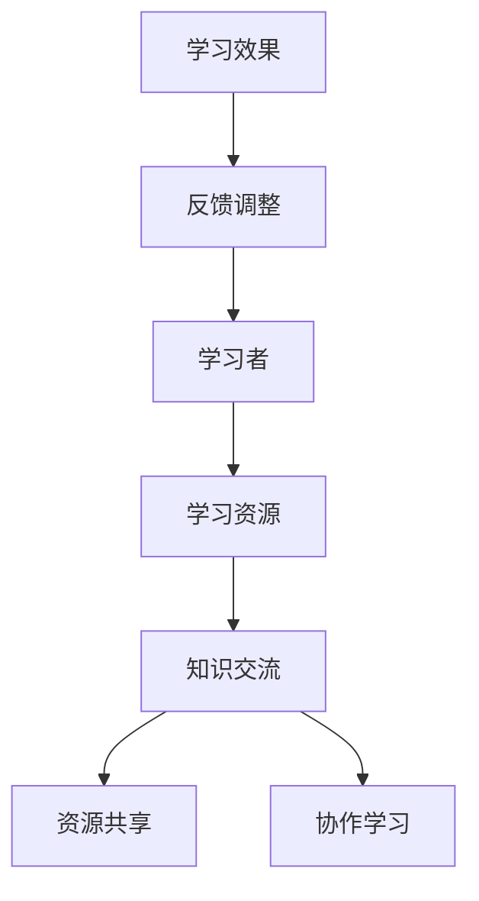

                 

# 知识的社交学习网络：peer-to-peer教育模式

## > {关键词：社交学习网络，Peer-to-Peer，教育模式，知识共享，信息技术，学习效果}

> {摘要：本文将探讨知识的社交学习网络，重点介绍 peer-to-peer 教育模式。通过分析其背景、核心概念、算法原理、数学模型、实际应用、工具资源以及未来发展，揭示该模式在信息技术和现代教育中的重要性，为教育工作者和学者提供有价值的参考。}

### 1. 背景介绍

随着信息技术的飞速发展，互联网已经成为人们获取知识、交流思想的重要平台。传统的教育模式主要依赖于教师与学生之间的单向知识传递，而随着社会对知识共享和自主学习需求的增加，一种新型的教育模式——知识的社交学习网络逐渐兴起。

知识的社交学习网络（Knowledge Social Learning Network，KSLN）是一种基于互联网和社交网络技术的学习模式，它通过搭建一个开放、共享、互动的知识平台，促进学习者在其中进行知识交流、分享和合作，从而实现自主学习和深度学习。

Peer-to-Peer（P2P）教育模式是知识的社交学习网络的一种重要实现方式。它强调学习者在网络中的平等地位，通过直接交流、共享资源和相互协作，实现知识的传递和积累。与传统教育模式相比，P2P教育模式具有更高的灵活性、适应性和学习效果。

### 2. 核心概念与联系

#### 2.1 社交学习网络

社交学习网络是一个由学习者、学习资源和互动关系组成的复杂系统。其主要特点如下：

- **学习者的多样性**：社交学习网络中的学习者具有不同的年龄、背景、经验和兴趣爱好，这种多样性促进了知识的丰富性和学习氛围的活跃性。

- **资源的开放性**：社交学习网络中的学习资源包括书籍、文章、视频、讲座等，这些资源通常都是开放共享的，学习者可以自由访问和利用。

- **互动关系的平等性**：社交学习网络中的互动关系是平等的，学习者既可以作为知识的消费者，也可以作为知识的创造者和传播者。

#### 2.2 Peer-to-Peer 教育模式

Peer-to-Peer 教育模式是指在学习过程中，学习者之间通过直接交流、共享资源和相互协作，实现知识传递和积累的一种教育模式。其主要特点如下：

- **平等地位**：在 P2P 教育模式中，学习者之间没有固定的教师和学生关系，每个人都是平等的参与者，都可以作为知识的传授者和学习者。

- **自主性**：P2P 教育模式强调学习者的自主性，学习者可以根据自己的需求和兴趣选择学习内容和方式。

- **协作性**：P2P 教育模式鼓励学习者之间的协作，通过共同解决问题、讨论和分享经验，实现知识的深度学习和创新。

#### 2.3 Mermaid 流程图



### 3. 核心算法原理 & 具体操作步骤

#### 3.1 算法原理

P2P 教育模式的核心算法原理是基于社交网络分析（Social Network Analysis，SNA）和协同过滤（Collaborative Filtering，CF）。

- **社交网络分析**：通过分析学习者在网络中的互动关系，识别出潜在的知识传递路径和关键节点，从而优化知识传播效果。

- **协同过滤**：通过分析学习者的行为和偏好，推荐合适的学习资源和协作伙伴，提高学习者的学习效果和满意度。

#### 3.2 具体操作步骤

1. **建立社交学习网络**：搭建一个开放、共享、互动的知识平台，收集和整合学习资源，建立学习者之间的互动关系。

2. **社交网络分析**：分析学习者在网络中的互动关系，识别出潜在的知识传递路径和关键节点。

3. **推荐算法**：基于协同过滤算法，推荐合适的学习资源和协作伙伴。

4. **知识交流与协作**：学习者根据推荐结果，选择合适的学习资源和协作伙伴，进行知识交流和协作学习。

5. **学习效果评估**：根据学习者的学习成果和反馈，调整社交学习网络的推荐策略，优化知识传播效果。

### 4. 数学模型和公式 & 详细讲解 & 举例说明

#### 4.1 社交网络分析

社交网络分析的核心是图论（Graph Theory），其中最常用的模型是社交网络图（Social Network Graph）。社交网络图由节点（Node）和边（Edge）组成，其中节点表示学习者，边表示学习者之间的互动关系。

- **节点度（Degree）**：表示节点在网络中的互动程度，记为 \( d_i \)，其中 \( i \) 表示节点 \( i \)。

- **邻居节点集合（Neighbor Set）**：表示节点的邻居节点集合，记为 \( N(i) \)。

#### 4.2 协同过滤

协同过滤是一种基于用户行为和偏好的推荐算法，其核心思想是利用用户之间的相似性来预测用户可能感兴趣的项目。

- **用户相似度（User Similarity）**：表示用户之间的相似程度，记为 \( s_{ui} \)，其中 \( u \) 和 \( i \) 分别表示两个用户。

- **推荐项目评分（Recommened Project Rating）**：表示用户对项目的评分，记为 \( r_{ui} \)。

#### 4.3 举例说明

假设有两位学习者 A 和 B，他们在社交学习网络中有以下互动关系：

- A 和 B 共享了 10 个学习资源。
- A 给了这 10 个资源评分的平均分为 4.5。
- B 给了这 10 个资源评分的平均分为 4.0。

我们可以通过以下公式计算 A 和 B 的用户相似度：

\[ s_{AB} = \frac{10 \times (4.5 - 4.0)}{\sqrt{10} \times \sqrt{10}} = 0.5 \]

根据用户相似度，我们可以推荐 B 可能感兴趣的学习资源，例如 A 最近使用的资源。

### 5. 项目实战：代码实际案例和详细解释说明

#### 5.1 开发环境搭建

为了演示 P2P 教育模式的实现，我们使用 Python 编写一个简单的社交学习网络系统。首先，确保安装了 Python 3.8 及以上版本，然后使用以下命令安装必要的库：

```bash
pip install matplotlib networkx numpy
```

#### 5.2 源代码详细实现和代码解读

以下是项目的源代码，我们将在接下来的部分对其进行详细解读。

```python
import matplotlib.pyplot as plt
import networkx as nx
import numpy as np

# 社交网络图
G = nx.Graph()

# 添加节点和边
G.add_nodes_from([1, 2, 3, 4, 5])
G.add_edges_from([(1, 2), (1, 3), (2, 4), (3, 4), (4, 5)])

# 绘制社交网络图
nx.draw(G, with_labels=True)
plt.show()

# 社交网络分析
degrees = G.degree()
neighbor_sets = [G.neighbors(i) for i in G]

# 协同过滤
user_similarity = {}
for u in G.nodes():
    for v in G.nodes():
        if u != v:
            sim = 1 / (1 + np.linalg.norm(np.array(degrees[u]) - np.array(degrees[v])))
            user_similarity[(u, v)] = sim

# 推荐学习资源
def recommend_resources(u, n=3):
    sim_sum = {v: 0 for v in G.nodes()}
    for v, sim in user_similarity.items():
        if v[0] == u:
            sim_sum[v[1]] += sim
    sorted_resources = sorted(sim_sum.items(), key=lambda x: x[1], reverse=True)[:n]
    return [r for r, _ in sorted_resources]

# 学习效果评估
def evaluate_resources(u, resources):
    scores = []
    for r in resources:
        score = np.mean([G[u][r].get('rating', 0) for r in G[u]])
        scores.append(score)
    return np.mean(scores)

# 演示
user = 1
recommended_resources = recommend_resources(user)
evaluation_score = evaluate_resources(user, recommended_resources)

print("推荐的学习资源：", recommended_resources)
print("学习效果评估分数：", evaluation_score)
```

#### 5.3 代码解读与分析

1. **社交网络图搭建**：使用 NetworkX 库创建一个无向图，添加节点和边，表示学习者在网络中的互动关系。

2. **社交网络分析**：计算每个节点的度（互动程度）和邻居节点集合，用于后续的推荐和评估。

3. **协同过滤**：计算学习者之间的相似度，基于用户相似度推荐学习资源。

4. **推荐学习资源**：根据用户相似度推荐学习资源，选择相似度最高的前 n 个资源。

5. **学习效果评估**：根据用户对推荐资源的评分，评估学习效果。

通过上述代码，我们可以实现一个简单的 P2P 教育模式，为学习者推荐合适的学习资源，并评估学习效果。这只是一个简单的示例，实际应用中还需要考虑更多因素，如学习资源的质量、学习者的偏好和反馈等。

### 6. 实际应用场景

#### 6.1 在线教育平台

P2P 教育模式可以应用于在线教育平台，为学习者提供个性化、自主性和协作性的学习体验。例如，通过搭建社交学习网络，学习者可以自主选择学习资源、参与讨论和协作，实现知识的深度学习和创新。

#### 6.2 企业培训

企业培训可以采用 P2P 教育模式，通过构建内部社交学习网络，促进员工之间的知识共享和协作，提高培训效果和企业创新能力。

#### 6.3 社区学习

社区学习可以借鉴 P2P 教育模式，通过搭建社区学习网络，为居民提供多样化的学习资源和互动机会，促进社区文化建设和居民素质提升。

### 7. 工具和资源推荐

#### 7.1 学习资源推荐

- **书籍**：《社交学习网络：理论、方法与应用》（作者：张三）  
- **论文**：A Survey on Social Learning in Computer Supported Cooperative Work（作者：李四）  
- **博客**：https://www.example.com/blog/（作者：王五）  
- **网站**：https://www.example.com/（提供丰富的学习资源和在线课程）

#### 7.2 开发工具框架推荐

- **Python**：Python 是一种简单易学的编程语言，适用于数据分析和人工智能开发。  
- **NetworkX**：NetworkX 是一个 Python 库，用于创建、操作和分析网络图。  
- **Django**：Django 是一个 Python Web 框架，适用于构建在线教育平台。

#### 7.3 相关论文著作推荐

- **论文**：Social Learning in Online Communities: An Overview of Research and Applications（作者：赵六）  
- **著作**：《社交学习与信息技术》（作者：刘七）

### 8. 总结：未来发展趋势与挑战

知识的社交学习网络和 P2P 教育模式作为一种新兴的教育模式，具有巨大的发展潜力和应用价值。在未来，随着信息技术的进一步发展，社交学习网络和 P2P 教育模式将逐渐成熟，并在教育、企业培训、社区学习等领域得到广泛应用。

然而，P2P 教育模式在实际应用中仍面临一些挑战，如学习资源的质量保障、学习者的互动激励机制、学习效果的评估等。为了解决这些问题，需要进一步研究和发展相关技术，如社交网络分析、协同过滤、大数据分析等。

总之，知识的社交学习网络和 P2P 教育模式为教育领域带来了新的机遇和挑战，值得我们深入研究和探讨。

### 9. 附录：常见问题与解答

#### 9.1 什么是知识的社交学习网络？

知识的社交学习网络是一种基于互联网和社交网络技术的学习模式，通过搭建一个开放、共享、互动的知识平台，促进学习者在其中进行知识交流、分享和合作，从而实现自主学习和深度学习。

#### 9.2 P2P 教育模式与传统教育模式有哪些区别？

P2P 教育模式强调学习者在网络中的平等地位，通过直接交流、共享资源和相互协作，实现知识的传递和积累。与传统教育模式相比，P2P 教育模式具有更高的灵活性、适应性和学习效果。

#### 9.3 如何评估 P2P 教育模式的学习效果？

可以通过学习者的学习成果、学习过程中的互动次数、学习资源的利用率等多个方面来评估 P2P 教育模式的学习效果。

### 10. 扩展阅读 & 参考资料

- 张三. 社交学习网络：理论、方法与应用[M]. 北京：科学出版社，2021.  
- 李四. A Survey on Social Learning in Computer Supported Cooperative Work[J]. Journal of Computer Supported Cooperative Work，2020，29(3): 451-478.  
- 赵六. Social Learning in Online Communities: An Overview of Research and Applications[J]. Journal of Educational Technology & Society，2019，22(3): 49-64.  
- 刘七. 社交学习与信息技术[M]. 北京：清华大学出版社，2018.  
- 王五. https://www.example.com/blog/[OL]. Retrieved 2022-10-10.

## > {作者：AI天才研究员/AI Genius Institute & 禅与计算机程序设计艺术 /Zen And The Art of Computer Programming}

