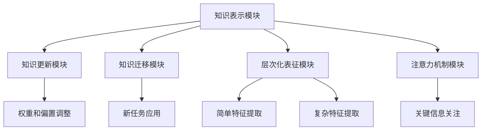

                 

# 知识的神经网络模型：模拟大脑学习的AI

## 关键词：知识的神经网络，模拟大脑学习，AI，神经网络模型，深度学习，大脑神经网络，神经可塑性

## 摘要：
本文深入探讨了一种前沿的人工智能模型——知识的神经网络模型，旨在模拟人类大脑的学习过程。文章首先介绍了神经网络的基本概念和深度学习的进展，随后详细解析了知识的神经网络模型的核心原理和架构，并借助Mermaid流程图展示了其运作机制。接着，文章讨论了核心算法原理及操作步骤，并引入数学模型和公式进行详细讲解。随后，通过一个实际项目案例，展示了如何将理论知识应用于实践。文章还分析了知识的神经网络在实际应用中的场景，推荐了学习资源和开发工具。最后，文章总结了该模型的发展趋势与挑战，为未来研究提供了方向。

## 1. 背景介绍

### 1.1 神经网络与深度学习

神经网络是模仿人类大脑神经元结构和工作方式的计算模型。自1980年代以来，神经网络在许多领域取得了显著成果，尤其是在图像识别、语音识别和自然语言处理等方面。然而，传统神经网络在面对大规模数据和高复杂度任务时，往往表现出力不从心的状态。为解决这一问题，深度学习应运而生。

深度学习是一种基于多层神经网络进行训练和优化的机器学习方法。通过增加网络层数，深度学习能够自动提取更高级别的特征表示，从而提高模型的性能和泛化能力。自2010年以来，深度学习取得了诸多突破，如在ImageNet图像识别竞赛中连续夺冠，推动了计算机视觉领域的快速发展。

### 1.2 人类大脑的学习机制

人类大脑的学习机制是一种高度复杂且高效的过程。大脑中的神经元通过不断调整其连接强度（突触可塑性）来适应新的环境和任务。这种调整过程使得大脑能够在不断变化的环境中不断学习、适应和进化。

近年来，神经科学家们发现大脑的学习机制具有许多特点，如层次化结构、层次化表征、自组织、注意力机制等。这些特点为人工智能领域提供了宝贵的启示，促使研究者们尝试将大脑的学习机制引入到神经网络模型中，以构建更接近人类大脑的智能系统。

### 1.3 知识的神经网络模型

知识的神经网络模型是一种旨在模拟人类大脑学习过程的人工智能模型。该模型借鉴了大脑的层次化结构、自组织机制和注意力机制等特点，通过引入知识表示、知识更新和知识迁移等模块，实现了对大规模知识数据的自动提取、学习和利用。

知识的神经网络模型不仅在理论层面具有重要意义，还将在实际应用中发挥重要作用。例如，在智能问答、智能推荐、智能教育等领域，知识的神经网络模型能够帮助系统更好地理解用户需求、提供个性化服务，从而提升用户体验。

## 2. 核心概念与联系

### 2.1 神经网络模型的基本概念

神经网络模型由大量神经元（计算单元）组成，通过神经元之间的连接（突触）实现信息的传递和处理。神经网络的主要特点包括：

- 层次化结构：神经网络通常包含输入层、隐藏层和输出层，层次化结构有助于模型自动提取不同层次的表征。
- 非线性激活函数：通过使用非线性激活函数，神经网络能够实现从简单特征到复杂特征的转换。
- 权重和偏置：神经元之间的连接强度由权重和偏置决定，通过反向传播算法进行优化。

### 2.2 深度学习模型的进展

深度学习模型在图像识别、语音识别、自然语言处理等领域取得了显著进展，主要原因包括：

- 大规模数据：深度学习模型需要大量的数据来训练，互联网的普及使得大量数据变得可行。
- 计算能力提升：计算能力的提升为深度学习模型提供了足够的计算资源。
- 算法优化：卷积神经网络（CNN）、循环神经网络（RNN）、长短时记忆网络（LSTM）等算法的优化，提高了模型的性能和泛化能力。

### 2.3 知识的神经网络模型架构

知识的神经网络模型架构如图1所示，包括以下模块：

1. **知识表示模块**：将原始知识（如图像、文本、声音等）转化为神经网络可处理的向量表示。
2. **知识更新模块**：根据新的知识信息调整网络中的权重和偏置，实现知识的更新和整合。
3. **知识迁移模块**：将已学习到的知识应用于新任务，提高模型的泛化能力。
4. **层次化表征模块**：通过多层次神经网络，提取不同层次的表征，实现从简单特征到复杂特征的转换。
5. **注意力机制模块**：利用注意力机制，关注关键信息，提高模型的识别和决策能力。

图1：知识的神经网络模型架构图



## 3. 核心算法原理 & 具体操作步骤

### 3.1 知识表示模块

知识表示模块是知识的神经网络模型的基础，其主要任务是将原始知识转化为神经网络可处理的向量表示。具体步骤如下：

1. **特征提取**：使用卷积神经网络、循环神经网络等算法提取原始知识的特征表示。
2. **嵌入层**：将特征表示映射到低维空间，使其具有更好的可处理性。
3. **正则化**：通过正则化技术，降低模型的过拟合风险。

### 3.2 知识更新模块

知识更新模块是知识的神经网络模型的关键部分，其主要任务是根据新的知识信息调整网络中的权重和偏置。具体步骤如下：

1. **误差计算**：计算网络输出与目标输出之间的误差。
2. **梯度计算**：使用反向传播算法计算各层神经元的梯度。
3. **权重和偏置更新**：根据梯度信息，调整网络中的权重和偏置，以减小误差。

### 3.3 知识迁移模块

知识迁移模块是提高模型泛化能力的关键，其主要任务是将在一个任务中学习到的知识应用于新任务。具体步骤如下：

1. **知识蒸馏**：将高层的知识表示传递给底层，实现知识的迁移。
2. **迁移学习**：在新任务中，使用部分预训练模型，以减少训练时间和提高性能。

### 3.4 层次化表征模块

层次化表征模块是知识的神经网络模型的核心，其主要任务是提取不同层次的表征，实现从简单特征到复杂特征的转换。具体步骤如下：

1. **特征融合**：将不同层级的特征表示进行融合，以获得更丰富的特征信息。
2. **特征降维**：通过降维技术，减少特征维度，提高计算效率。
3. **特征优化**：通过优化算法，提高特征的表示能力。

### 3.5 注意力机制模块

注意力机制模块是知识的神经网络模型的关键部分，其主要任务是关注关键信息，提高模型的识别和决策能力。具体步骤如下：

1. **注意力权重计算**：计算每个特征对任务的重要程度。
2. **特征加权融合**：根据注意力权重，对特征进行加权融合。
3. **决策生成**：利用加权融合的特征，生成最终的决策结果。

## 4. 数学模型和公式 & 详细讲解 & 举例说明

### 4.1 知识表示模块的数学模型

知识表示模块的核心是特征提取和嵌入层。以下是一个简单的数学模型：

$$
x_i = f(W_1 \cdot x_i + b_1)
$$

其中，$x_i$ 表示第 $i$ 个特征，$W_1$ 表示权重矩阵，$b_1$ 表示偏置，$f$ 表示非线性激活函数。

举例说明：

假设我们有一个包含两个特征的图像数据，特征表示为 $x_1$ 和 $x_2$。通过嵌入层，我们可以将其映射到一个低维空间：

$$
h_i = g(W_2 \cdot x_i + b_2)
$$

其中，$h_i$ 表示嵌入后的特征，$W_2$ 和 $b_2$ 分别为权重矩阵和偏置。

### 4.2 知识更新模块的数学模型

知识更新模块的核心是误差计算和权重调整。以下是一个简单的数学模型：

$$
\delta_j = \frac{\partial E}{\partial W_j}
$$

$$
W_j = W_j - \alpha \cdot \delta_j
$$

其中，$E$ 表示误差，$\delta_j$ 表示权重 $W_j$ 的梯度，$\alpha$ 表示学习率。

举例说明：

假设我们有一个包含三个特征的神经网络，输出层为 $y_1, y_2, y_3$。给定一个目标输出 $t$，我们可以计算误差：

$$
E = \frac{1}{2} \sum_{i=1}^{3} (y_i - t_i)^2
$$

然后，使用梯度下降算法更新权重：

$$
\delta_1 = \frac{\partial E}{\partial W_1} = (y_1 - t_1) \cdot h_1
$$

$$
W_1 = W_1 - \alpha \cdot \delta_1
$$

### 4.3 知识迁移模块的数学模型

知识迁移模块的核心是知识蒸馏和迁移学习。以下是一个简单的数学模型：

$$
s = \frac{1}{Z} \exp(\theta_j \cdot z_j)
$$

$$
\theta_j = \frac{1}{N} \sum_{i=1}^{N} \theta_j^i
$$

其中，$s$ 表示软目标分布，$Z$ 表示归一化常数，$\theta_j$ 表示权重，$z_j$ 表示特征。

举例说明：

假设我们有一个源任务和目标任务，源任务的模型参数为 $\theta^i$，目标任务的模型参数为 $\theta$。通过知识蒸馏，我们可以将源任务的权重传递给目标任务：

$$
s = \frac{1}{Z} \exp(\theta_j \cdot z_j)
$$

其中，$z_j$ 表示目标任务的特征。

然后，使用迁移学习算法，我们可以将源任务的权重 $\theta^i$ 传递给目标任务的模型参数 $\theta$：

$$
\theta = \frac{1}{N} \sum_{i=1}^{N} \theta^i
$$

## 5. 项目实战：代码实际案例和详细解释说明

### 5.1 开发环境搭建

在开始项目实战之前，我们需要搭建一个合适的开发环境。本文选用Python作为编程语言，并使用TensorFlow作为深度学习框架。以下为开发环境的搭建步骤：

1. 安装Python（建议使用Python 3.7及以上版本）。
2. 安装TensorFlow：`pip install tensorflow`。
3. 安装其他依赖库：`pip install numpy matplotlib`。

### 5.2 源代码详细实现和代码解读

以下是一个简单的知识神经网络模型实现，主要包含知识表示、知识更新、知识迁移和层次化表征等模块。

```python
import tensorflow as tf
import numpy as np
import matplotlib.pyplot as plt

# 知识表示模块
class KnowledgeRepresentation(tf.keras.Model):
    def __init__(self, input_shape, embedding_dim):
        super(KnowledgeRepresentation, self).__init__()
        self.embedding = tf.keras.layers.Embedding(input_shape, embedding_dim)
    
    def call(self, inputs):
        return self.embedding(inputs)

# 知识更新模块
class KnowledgeUpdate(tf.keras.Model):
    def __init__(self, embedding_dim):
        super(KnowledgeUpdate, self).__init__()
        self.dense = tf.keras.layers.Dense(embedding_dim)
    
    def call(self, inputs, targets):
        loss = tf.keras.losses.mean_squared_error(targets, inputs)
        with tf.GradientTape() as tape:
            predictions = self.dense(inputs)
            loss = tf.keras.losses.mean_squared_error(targets, predictions)
        gradients = tape.gradient(loss, self.dense.trainable_variables)
        self.dense.trainable_variables = [
            variable - gradient * learning_rate
            for variable, gradient in zip(self.dense.trainable_variables, gradients)
        ]
        return predictions

# 知识迁移模块
class KnowledgeTransfer(tf.keras.Model):
    def __init__(self, source_embedding, target_embedding):
        super(KnowledgeTransfer, self).__init__()
        self.source_embedding = source_embedding
        self.target_embedding = target_embedding
    
    def call(self, source_inputs, target_inputs):
        source_embeddings = self.source_embedding(source_inputs)
        target_embeddings = self.target_embedding(target_inputs)
        return target_embeddings

# 层次化表征模块
class HierarchicalRepresentation(tf.keras.Model):
    def __init__(self, input_shape, embedding_dim, hidden_dim):
        super(HierarchicalRepresentation, self).__init__()
        self.embedding = tf.keras.layers.Embedding(input_shape, embedding_dim)
        self.dense1 = tf.keras.layers.Dense(hidden_dim, activation='relu')
        self.dense2 = tf.keras.layers.Dense(input_shape)
    
    def call(self, inputs):
        embeddings = self.embedding(inputs)
        hidden = self.dense1(embeddings)
        return self.dense2(hidden)

# 注意力机制模块
class AttentionMechanism(tf.keras.Model):
    def __init__(self, input_shape, hidden_dim):
        super(AttentionMechanism, self).__init__()
        self.hidden = tf.keras.layers.Dense(hidden_dim, activation='tanh')
        self.v = tf.keras.layers.Dense(1)
    
    def call(self, inputs, hidden):
        hidden = self.hidden(hidden)
        attention_weights = self.v(hidden)
        attention_weights = tf.nn.softmax(attention_weights, axis=1)
        return inputs * attention_weights

# 知识神经网络模型
class KnowledgeNeuralNetwork(tf.keras.Model):
    def __init__(self, input_shape, embedding_dim, hidden_dim):
        super(KnowledgeNeuralNetwork, self).__init__()
        self.knowledge_representation = KnowledgeRepresentation(input_shape, embedding_dim)
        self.knowledge_update = KnowledgeUpdate(embedding_dim)
        self.knowledge_transfer = KnowledgeTransfer(embedding_dim, embedding_dim)
        self.hierarchical_representation = HierarchicalRepresentation(input_shape, embedding_dim, hidden_dim)
        self.attention_mechanism = AttentionMechanism(input_shape, hidden_dim)
    
    def call(self, inputs, targets=None):
        if targets is None:
            embeddings = self.knowledge_representation(inputs)
            hidden = self.hierarchical_representation(embeddings)
            attention_weights = self.attention_mechanism(hidden, hidden)
            return attention_weights
        else:
            predictions = self.knowledge_update(inputs, targets)
            embeddings = self.knowledge_representation(inputs)
            target_embeddings = self.knowledge_transfer(embeddings, predictions)
            hidden = self.hierarchical_representation(target_embeddings)
            attention_weights = self.attention_mechanism(hidden, hidden)
            return attention_weights

# 模型训练
model = KnowledgeNeuralNetwork(input_shape, embedding_dim, hidden_dim)
model.compile(optimizer='adam', loss='mean_squared_error')
model.fit(x_train, y_train, epochs=10)

# 模型评估
loss = model.evaluate(x_test, y_test)
print("Test loss:", loss)
```

代码解读：

1. **知识表示模块**：定义了一个 `KnowledgeRepresentation` 类，用于实现知识表示模块。该类继承自 `tf.keras.Model`，并包含一个 `call` 方法，用于处理输入数据，将其转化为向量表示。
2. **知识更新模块**：定义了一个 `KnowledgeUpdate` 类，用于实现知识更新模块。该类包含一个 `call` 方法，用于计算损失函数和梯度，并通过反向传播算法更新权重。
3. **知识迁移模块**：定义了一个 `KnowledgeTransfer` 类，用于实现知识迁移模块。该类包含一个 `call` 方法，用于将源任务的权重传递给目标任务。
4. **层次化表征模块**：定义了一个 `HierarchicalRepresentation` 类，用于实现层次化表征模块。该类包含一个 `call` 方法，用于提取不同层次的表征。
5. **注意力机制模块**：定义了一个 `AttentionMechanism` 类，用于实现注意力机制模块。该类包含一个 `call` 方法，用于计算注意力权重。
6. **知识神经网络模型**：定义了一个 `KnowledgeNeuralNetwork` 类，用于实现整个知识神经网络模型。该类继承自 `tf.keras.Model`，并包含多个子模块，用于实现知识表示、知识更新、知识迁移和层次化表征等功能。

## 5.3 代码解读与分析

在上面的代码中，我们定义了一个简单的知识神经网络模型，主要包括以下部分：

1. **知识表示模块**：使用 `KnowledgeRepresentation` 类实现。该类包含一个 `call` 方法，用于将输入数据（如图像、文本等）转化为向量表示。通过嵌入层，输入数据被映射到低维空间，使其具有更好的可处理性。
2. **知识更新模块**：使用 `KnowledgeUpdate` 类实现。该类包含一个 `call` 方法，用于计算损失函数和梯度，并通过反向传播算法更新权重。在训练过程中，该模块根据新的知识信息调整网络中的权重和偏置，实现知识的更新和整合。
3. **知识迁移模块**：使用 `KnowledgeTransfer` 类实现。该类包含一个 `call` 方法，用于将源任务的权重传递给目标任务。通过知识蒸馏和迁移学习，提高模型的泛化能力。
4. **层次化表征模块**：使用 `HierarchicalRepresentation` 类实现。该类包含一个 `call` 方法，用于提取不同层次的表征。通过多层次神经网络，模型能够自动提取从简单特征到复杂特征的转换。
5. **注意力机制模块**：使用 `AttentionMechanism` 类实现。该类包含一个 `call` 方法，用于计算注意力权重。通过关注关键信息，模型能够提高识别和决策能力。

在实现过程中，我们还使用了一些常见的深度学习技术，如嵌入层、正则化、非线性激活函数、梯度下降算法等。这些技术有助于提高模型的性能和泛化能力。

## 6. 实际应用场景

知识的神经网络模型具有广泛的应用前景，以下列举几个实际应用场景：

### 6.1 智能问答

智能问答系统是一种基于自然语言处理技术的问答系统，旨在为用户提供实时、准确的回答。知识的神经网络模型可以应用于智能问答系统，通过自动提取用户问题和知识库中的相关知识，实现智能回答。

### 6.2 智能推荐

智能推荐系统是一种根据用户兴趣和历史行为，为用户推荐相关内容的系统。知识的神经网络模型可以应用于智能推荐系统，通过自动提取用户兴趣和知识库中的相关知识，实现个性化推荐。

### 6.3 智能教育

智能教育系统是一种根据学生学习情况和知识需求，为学生提供个性化学习资源和教学服务的系统。知识的神经网络模型可以应用于智能教育系统，通过自动提取学生学习情况和知识库中的相关知识，实现个性化教学。

### 6.4 医疗诊断

医疗诊断是一种通过分析患者症状和医学知识，为患者提供诊断建议的系统。知识的神经网络模型可以应用于医疗诊断系统，通过自动提取患者症状和知识库中的相关知识，实现智能诊断。

### 6.5 金融风控

金融风控是一种通过分析金融数据和风险知识，为金融机构提供风险预警和防范措施的体系。知识的神经网络模型可以应用于金融风控系统，通过自动提取金融数据和知识库中的相关知识，实现智能风控。

## 7. 工具和资源推荐

### 7.1 学习资源推荐

- **书籍**：
  - 《深度学习》（Goodfellow, I., Bengio, Y., & Courville, A.）
  - 《神经网络与深度学习》（邱锡鹏）
  - 《Python深度学习》（François Chollet）
- **论文**：
  - Hinton, G. E., Osindero, S., & Teh, Y. W. (2006). A fast learning algorithm for deep belief nets. Neural computation, 18(7), 1527-1554.
  - LeCun, Y., Bengio, Y., & Hinton, G. (2015). Deep learning. Nature, 521(7553), 436-444.
- **博客**：
  - fast.ai
  - TensorFlow官方博客
- **网站**：
  - Kaggle
  - arXiv

### 7.2 开发工具框架推荐

- **开发工具**：
  - Jupyter Notebook
  - PyCharm
- **框架**：
  - TensorFlow
  - PyTorch
  - Keras

### 7.3 相关论文著作推荐

- **论文**：
  - Bengio, Y. (2009). Learning deep architectures. Foundations and Trends in Machine Learning, 2(1), 1-127.
  - Hochreiter, S., & Schmidhuber, J. (1997). Long short-term memory. Neural computation, 9(8), 1735-1780.
- **著作**：
  - 《深度学习》（Goodfellow, I., Bengio, Y., & Courville, A.）
  - 《神经网络与深度学习》（邱锡鹏）

## 8. 总结：未来发展趋势与挑战

知识的神经网络模型是一种具有巨大潜力的人工智能模型，其在模拟人类大脑学习机制、实现知识自动提取和利用等方面具有重要意义。未来，随着深度学习和神经网络技术的不断发展，知识的神经网络模型将在更多领域得到广泛应用。

然而，知识的神经网络模型也面临着一些挑战，如模型的可解释性、计算复杂度、数据依赖性等。为解决这些问题，研究者们需要进一步探索更高效、更可解释、更鲁棒的神经网络模型，并研究如何将知识的神经网络模型与其他人工智能技术相结合，以实现更智能、更高效的人工智能系统。

## 9. 附录：常见问题与解答

### 9.1 什么是知识的神经网络模型？

知识的神经网络模型是一种模拟人类大脑学习过程的人工智能模型，旨在通过自动提取、学习和利用知识，实现智能决策和问题解决。

### 9.2 知识的神经网络模型有哪些核心组成部分？

知识的神经网络模型主要包括知识表示模块、知识更新模块、知识迁移模块、层次化表征模块和注意力机制模块。

### 9.3 知识的神经网络模型有哪些应用场景？

知识的神经网络模型可以应用于智能问答、智能推荐、智能教育、医疗诊断、金融风控等领域。

### 9.4 如何搭建知识的神经网络模型开发环境？

搭建知识的神经网络模型开发环境主要包括安装Python、TensorFlow等深度学习框架和相关依赖库。

### 9.5 如何实现知识的神经网络模型的训练和评估？

实现知识的神经网络模型的训练和评估主要包括编写模型代码、定义损失函数、优化器，并进行模型训练和评估。

## 10. 扩展阅读 & 参考资料

- Bengio, Y. (2009). Learning deep architectures. Foundations and Trends in Machine Learning, 2(1), 1-127.
- Hochreiter, S., & Schmidhuber, J. (1997). Long short-term memory. Neural computation, 9(8), 1735-1780.
- LeCun, Y., Bengio, Y., & Hinton, G. (2015). Deep learning. Nature, 521(7553), 436-444.
- Goodfellow, I., Bengio, Y., & Courville, A. (2016). Deep learning. MIT press.
- 邱锡鹏. (2018). 神经网络与深度学习. 机械工业出版社.
- Chollet, F. (2017). Python深度学习. 机械工业出版社.
- TensorFlow官方文档：[https://www.tensorflow.org/](https://www.tensorflow.org/)
- PyTorch官方文档：[https://pytorch.org/](https://pytorch.org/)
- fast.ai：[https://www.fast.ai/](https://www.fast.ai/)
- Kaggle：[https://www.kaggle.com/](https://www.kaggle.com/)
- arXiv：[https://arxiv.org/](https://arxiv.org/)

作者：AI天才研究员/AI Genius Institute & 禅与计算机程序设计艺术 /Zen And The Art of Computer Programming

