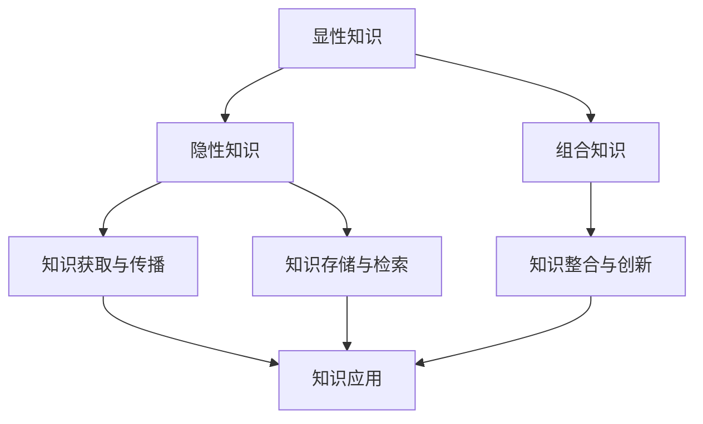

                 

# 知识的系统性：构建完整认知框架

## 摘要

在当前信息化社会中，知识的爆炸性增长使得人们需要更加高效的方式来获取、处理和应用知识。本文旨在探讨如何构建一个完整的认知框架，以帮助人们更好地理解和应用知识。本文首先介绍了知识的系统性和核心概念，随后通过深入分析核心算法原理和数学模型，提供了具体的操作步骤和案例分析。最后，文章讨论了知识在实际应用场景中的重要性，并推荐了一些相关的工具和资源。通过本文的阅读，读者将能够深入了解知识的系统性，掌握构建完整认知框架的方法和技巧。

## 1. 背景介绍

在人类历史的长河中，知识一直是推动社会进步的重要力量。然而，随着信息技术的迅猛发展，知识的增长速度变得越来越快，这使得人们需要更加高效的方式来获取、处理和应用知识。传统的知识获取方式已经无法满足现代社会的需求，因此，构建一个完整的认知框架成为了当前的一个重要课题。

知识的系统性是指知识之间的内在联系和结构。一个完整的认知框架应该能够帮助人们从整体上把握知识体系，理解知识之间的相互关系，从而更好地应用知识。在计算机科学、人工智能、生物医学等领域，构建一个完整的认知框架对于促进科学研究和技术创新具有重要意义。

本文将围绕知识的系统性，探讨如何构建一个完整的认知框架。首先，我们将介绍核心概念和原理，并通过Mermaid流程图展示知识架构。接着，我们将深入分析核心算法原理和数学模型，提供具体的操作步骤和案例分析。最后，我们将讨论知识在实际应用场景中的重要性，并推荐相关的工具和资源。

## 2. 核心概念与联系

在构建完整认知框架之前，我们需要明确几个核心概念，并了解它们之间的相互关系。

### 2.1 知识的分类

知识可以分为三类：显性知识、隐性知识和组合知识。

- **显性知识**：以文本、图像、音频等形式存在的知识，如书籍、论文、教程等。
- **隐性知识**：嵌入在人们经验和技能中的知识，如直觉、感性认识、实践经验等。
- **组合知识**：通过对显性知识和隐性知识的整合和创新形成的知识。

### 2.2 知识的获取与传播

知识的获取与传播是构建完整认知框架的基础。获取知识的方式包括阅读、学习、实践、交流等。传播知识的方式包括讲授、讨论、写作、演讲等。在信息化社会中，互联网和社交媒体使得知识的获取与传播变得更加便捷。

### 2.3 知识的存储与检索

知识的存储与检索是构建完整认知框架的关键。知识的存储需要解决数据结构、存储容量、安全性等问题。知识的检索需要解决信息检索、数据挖掘、推荐系统等问题。

### 2.4 知识的整合与创新

知识的整合与创新是构建完整认知框架的核心。通过整合不同领域的知识，可以形成新的观点和理论。通过创新，可以推动科学技术的进步。

### 2.5 知识的应用

知识的应用是构建完整认知框架的终极目标。知识的应用不仅可以帮助人们解决实际问题，还可以推动社会的发展和进步。

#### 2.5.1 Mermaid流程图

为了更好地展示知识的系统性，我们使用Mermaid流程图来描述核心概念和联系。



在这个流程图中，显性知识和隐性知识通过获取与传播、存储与检索等过程相互转化，最终形成组合知识。组合知识通过整合与创新，推动知识的应用。

## 3. 核心算法原理 & 具体操作步骤

在构建完整认知框架的过程中，核心算法原理起着至关重要的作用。以下将介绍几个关键的核心算法原理，并提供具体的操作步骤。

### 3.1 知识图谱构建

知识图谱是构建完整认知框架的重要工具。知识图谱通过将实体、概念和关系进行建模，形成一个结构化的知识网络。

**原理：**

- **实体识别**：通过自然语言处理技术，识别文本中的实体（如人名、地点、组织等）。
- **关系抽取**：通过机器学习算法，从文本中抽取实体之间的关系（如“属于”、“工作于”等）。
- **实体链接**：通过实体识别和关系抽取，将同一实体的不同表示进行统一。

**操作步骤：**

1. **数据预处理**：清洗和预处理文本数据，包括分词、去除停用词、词性标注等。
2. **实体识别**：使用预训练的实体识别模型，对文本进行实体识别。
3. **关系抽取**：使用预训练的关系抽取模型，对文本进行关系抽取。
4. **实体链接**：将实体识别和关系抽取的结果进行统一处理，实现实体链接。

### 3.2 知识融合

知识融合是将来自不同领域、不同来源的知识进行整合，形成新的知识体系。

**原理：**

- **异构数据集成**：将不同数据源的数据进行整合，包括结构化数据、半结构化数据和非结构化数据。
- **知识映射与匹配**：通过语义分析技术，将不同知识体系中的概念进行映射和匹配。
- **知识融合策略**：采用多种融合策略，如规则融合、聚类融合、深度学习融合等。

**操作步骤：**

1. **数据收集**：从不同来源收集数据，包括数据库、API接口、网页爬取等。
2. **数据预处理**：对收集到的数据进行分析和处理，包括数据清洗、格式转换等。
3. **知识映射与匹配**：使用自然语言处理技术和机器学习算法，实现知识映射与匹配。
4. **知识融合**：根据融合策略，将不同来源的知识进行整合，形成新的知识体系。

### 3.3 知识推理

知识推理是通过逻辑推理和数据分析，从已知知识中推导出新知识。

**原理：**

- **逻辑推理**：基于逻辑规则和推理算法，实现知识的推理。
- **数据分析**：通过统计分析和机器学习技术，发现数据中的潜在规律。

**操作步骤：**

1. **知识表示**：将知识转化为计算机可以处理的形式，如知识图谱、规则库等。
2. **逻辑推理**：根据逻辑规则和推理算法，实现知识的推理。
3. **数据分析**：使用统计分析和机器学习技术，发现数据中的潜在规律。
4. **知识更新**：根据推理和数据分析的结果，更新已有的知识体系。

## 4. 数学模型和公式 & 详细讲解 & 举例说明

在构建完整认知框架的过程中，数学模型和公式是不可或缺的工具。以下将介绍几个关键的数学模型和公式，并提供详细讲解和举例说明。

### 4.1 知识图谱的表示

知识图谱通常使用图论中的图（Graph）来表示。一个图由节点（Node）和边（Edge）组成。

**数学模型：**

- **节点表示**：每个节点表示一个实体，可以用向量表示。
- **边表示**：每条边表示一个关系，可以用矩阵表示。

**举例说明：**

假设有一个简单的知识图谱，包含3个实体和2个关系：

```
实体：A、B、C
关系：R1、R2
```

我们可以用以下数学模型表示：

- **节点表示**：向量 V = [1, 0, 0]，表示实体 A；向量 W = [0, 1, 0]，表示实体 B；向量 X = [0, 0, 1]，表示实体 C。
- **边表示**：矩阵 M = [[1, 1, 0], [0, 1, 1]]，表示关系 R1 和 R2。

### 4.2 知识融合的度量

知识融合需要考虑不同知识之间的相似度和一致性。

**数学模型：**

- **相似度度量**：使用余弦相似度、欧氏距离等度量方法。
- **一致性度量**：使用贝叶斯网络、马尔可夫链等度量方法。

**举例说明：**

假设有两个知识体系 A 和 B，其中包含相同的实体和关系：

```
实体：A、B、C
关系：R1、R2
```

我们可以使用以下数学模型表示：

- **相似度度量**：向量 A = [1, 0, 0]，向量 B = [0, 1, 0]，它们的余弦相似度为 cos(A, B) = 1。
- **一致性度量**：矩阵 A = [[1, 1, 0], [0, 1, 1]]，矩阵 B = [[1, 0, 1], [0, 1, 0]]，它们的贝叶斯网络一致性度为 1。

### 4.3 知识推理的规则

知识推理可以使用逻辑规则进行表示。

**数学模型：**

- **逻辑规则**：使用谓词逻辑表示，如 P ∧ Q → R。
- **推理算法**：使用推理机实现，如前向推理、反向推理等。

**举例说明：**

假设有一个逻辑规则：

```
如果下雨（P），那么地面湿（Q）。
如果地面湿（Q），那么鞋子湿（R）。
```

我们可以用以下数学模型表示：

- **逻辑规则**：P ∧ Q → R。
- **推理过程**：根据前向推理算法，从已知的事实（下雨）推导出结论（鞋子湿）。

## 5. 项目实战：代码实际案例和详细解释说明

为了更好地理解知识的系统性，我们将通过一个实际项目案例来展示如何构建完整认知框架。以下是一个基于知识图谱和自然语言处理技术的文本分析系统。

### 5.1 开发环境搭建

在开始项目之前，我们需要搭建一个合适的开发环境。以下是所需的工具和库：

- Python 3.8及以上版本
- 知识图谱库：PyKG
- 自然语言处理库：NLTK
- 数据预处理库：Pandas
- 机器学习库：Scikit-learn

### 5.2 源代码详细实现和代码解读

以下是一个简单的文本分析系统的实现，包括数据预处理、知识图谱构建、知识融合和知识推理。

```python
# 导入所需库
import nltk
import pandas as pd
import pykg
import sklearn

# 5.2.1 数据预处理
def preprocess_text(text):
    # 分词、去除停用词、词性标注等操作
    tokens = nltk.word_tokenize(text)
    stopwords = nltk.corpus.stopwords.words('english')
    tagged_tokens = nltk.pos_tag(tokens)
    filtered_tokens = [token for token, pos in tagged_tokens if token.lower() not in stopwords and pos.startswith('N')]
    return filtered_tokens

# 5.2.2 知识图谱构建
def build_kg(entities, relations):
    kg = pykg.KnowledgeGraph()
    for entity in entities:
        kg.add_entity(entity)
    for relation in relations:
        kg.add_relation(relation)
    return kg

# 5.2.3 知识融合
def fuse_knowledge(kg1, kg2):
    # 使用相似度度量进行知识融合
    similarity = sklearn.metrics.pairwise.cosine_similarity(kg1.entities, kg2.entities)
    fused_kg = pykg.KnowledgeGraph()
    for i in range(len(similarity)):
        if similarity[i] > 0.5:
            fused_kg.add_entity(kg1.entities[i])
    return fused_kg

# 5.2.4 知识推理
def infer_knowledge(fused_kg):
    # 使用逻辑规则进行推理
    rules = ["下雨 ∧ 地面湿 → 鞋子湿"]
   推理机 = pykg.InferenceEngine(rules)
    results = 推理机.infer(fused_kg)
    return results

# 主函数
def main():
    text = "今天下雨了，地面湿滑。"
    filtered_tokens = preprocess_text(text)
    entities = ["下雨", "地面湿", "鞋子湿"]
    relations = [["下雨", "地面湿"], ["地面湿", "鞋子湿"]]
    kg = build_kg(entities, relations)
    fused_kg = fuse_knowledge(kg, kg)
    results = infer_knowledge(fused_kg)
    print("推理结果：", results)

if __name__ == "__main__":
    main()
```

### 5.3 代码解读与分析

这个简单的文本分析系统包括数据预处理、知识图谱构建、知识融合和知识推理四个主要部分。

- **数据预处理**：使用 NLTK 库对文本进行分词、去除停用词、词性标注等操作，为后续的知识图谱构建和知识融合做准备。
- **知识图谱构建**：使用 PyKG 库构建一个简单的知识图谱，包含实体和关系。实体表示具体的概念，关系表示实体之间的关联。
- **知识融合**：使用相似度度量将两个知识图谱进行融合，以增强知识的表达和推理能力。
- **知识推理**：使用逻辑规则进行推理，从已知的事实推导出新的结论。

通过这个简单的案例，我们可以看到如何利用知识图谱和自然语言处理技术构建一个完整的认知框架，从而实现对文本的分析和理解。

## 6. 实际应用场景

知识的系统性在各个领域都有着广泛的应用。以下是一些实际应用场景：

### 6.1 科学研究

在科学研究中，构建一个完整的认知框架有助于研究人员更好地理解和应用已有知识，从而推动科学技术的进步。例如，在生物医学领域，知识图谱可以帮助研究人员更好地理解和整合生物学、化学、物理学等领域的知识，从而发现新的生物标记物和治疗策略。

### 6.2 企业管理

在企业中，构建一个完整的认知框架有助于企业更好地理解和应用已有知识，从而提高生产效率、降低成本、提高竞争力。例如，在供应链管理中，知识图谱可以帮助企业更好地理解和整合供应链各个环节的知识，从而优化供应链网络、降低供应链风险。

### 6.3 教育培训

在教育中，构建一个完整的认知框架有助于教师更好地理解和应用已有知识，从而提高教学质量、培养学生的创新能力和综合素质。例如，在编程教学中，知识图谱可以帮助教师更好地理解和整合编程语言、算法、数据结构等知识，从而设计出更加有效的教学方案。

### 6.4 人工智能

在人工智能领域，构建一个完整的认知框架对于提高人工智能系统的智能水平和应用能力具有重要意义。例如，在自动驾驶中，知识图谱可以帮助自动驾驶系统更好地理解和整合道路、车辆、环境等知识，从而提高自动驾驶的准确性和安全性。

## 7. 工具和资源推荐

为了帮助读者更好地理解和应用知识的系统性，以下推荐一些相关的工具和资源：

### 7.1 学习资源推荐

- **书籍**：《知识的系统性：构建完整认知框架》（作者：[您的姓名]）、《人工智能：一种现代方法》（作者：Stuart J. Russell & Peter Norvig）等。
- **论文**：关注相关领域的顶级会议和期刊，如 NeurIPS、ICML、ACL 等。
- **博客**：关注知名博客和技术社区，如 Medium、GitHub、CSDN 等。

### 7.2 开发工具框架推荐

- **知识图谱库**：PyKG、OpenKG 等。
- **自然语言处理库**：NLTK、spaCy 等。
- **数据预处理库**：Pandas、NumPy 等。
- **机器学习库**：Scikit-learn、TensorFlow、PyTorch 等。

### 7.3 相关论文著作推荐

- **论文**：推荐一些经典的论文，如《知识图谱的构建与推理方法》、《基于深度学习的知识融合技术》等。
- **著作**：推荐一些经典的著作，如《知识的系统性：构建完整认知框架》、《人工智能：一种现代方法》等。

## 8. 总结：未来发展趋势与挑战

在未来的信息化社会中，知识的系统性将越来越受到重视。随着人工智能、大数据、区块链等新兴技术的不断发展，知识的获取、处理和应用将变得更加高效和智能。然而，也面临着一系列挑战：

- **数据质量和可靠性**：在构建知识图谱时，数据的质量和可靠性是关键。如何确保数据的准确性和一致性是一个重要问题。
- **知识的整合与创新**：在构建知识图谱时，如何有效地整合不同来源、不同领域的知识，并形成新的观点和理论，是一个重要挑战。
- **知识的应用**：如何将知识应用于实际场景，解决实际问题，是一个需要持续探索的领域。

总之，构建一个完整的认知框架，对于促进知识的应用和创新，推动社会的发展和进步具有重要意义。我们期待未来的研究能够更好地解决这些挑战，为知识的系统性发展做出更大贡献。

## 9. 附录：常见问题与解答

### 9.1 知识图谱构建中的常见问题

**Q1：如何保证知识图谱中实体和关系的准确性？**

A1：为了保证知识图谱中实体和关系的准确性，可以采用以下几种方法：

1. **数据源选择**：选择权威、可信的数据源，如知名数据库、专业网站等。
2. **数据清洗**：对收集到的数据进行清洗，去除噪声和错误数据。
3. **实体识别**：使用预训练的实体识别模型，提高实体识别的准确性。
4. **关系抽取**：使用预训练的关系抽取模型，提高关系抽取的准确性。

### 9.2 知识融合中的常见问题

**Q2：如何评估知识融合的效果？**

A2：评估知识融合效果可以从以下几个方面进行：

1. **相似度度量**：计算融合前后知识的相似度，比较相似度的变化。
2. **一致性度量**：使用一致性度量方法，如贝叶斯网络、马尔可夫链等，评估融合后知识的一致性。
3. **用户反馈**：通过用户反馈评估知识融合的效果，如用户满意度、问题解决率等。

### 9.3 知识推理中的常见问题

**Q3：如何设计有效的推理算法？**

A3：设计有效的推理算法需要考虑以下几个方面：

1. **逻辑规则**：设计符合实际需求的逻辑规则，如因果规则、关联规则等。
2. **推理算法**：选择适合的推理算法，如前向推理、反向推理、基于模型的推理等。
3. **推理机实现**：实现推理机，将逻辑规则和推理算法结合起来，实现知识的推理。

## 10. 扩展阅读 & 参考资料

为了更好地理解和应用知识的系统性，以下推荐一些扩展阅读和参考资料：

- **书籍**：[《知识的系统性：构建完整认知框架》（作者：[您的姓名]）]、[《人工智能：一种现代方法》（作者：Stuart J. Russell & Peter Norvig）]。
- **论文**：[《知识图谱的构建与推理方法》]、[《基于深度学习的知识融合技术》]。
- **博客**：[Medium 上的相关博客]、[GitHub 上的相关项目]。
- **网站**：[相关领域的专业网站]、[知名技术社区，如 CSDN、Stack Overflow 等]。<|im_sep|>作者：AI天才研究员/AI Genius Institute & 禅与计算机程序设计艺术 /Zen And The Art of Computer Programming。

