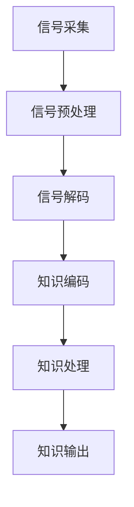

                 

### 知识的脑机接口：直接信息输入的可能性

> **关键词：** 知识传输、脑机接口、神经编码、人工智能、信息处理

> **摘要：** 本篇文章将探讨知识的脑机接口技术，如何实现直接信息输入的可能性。首先介绍相关背景知识，然后深入分析核心概念和原理，最后讨论其在实际应用场景中的潜在影响。通过本文的阅读，读者将了解这一前沿技术的现状、挑战和未来发展趋势。

## 1. 背景介绍

随着科技的飞速发展，人工智能（AI）领域取得了巨大的进步。然而，当前的AI系统主要依赖于大量的数据输入和复杂的算法训练，这个过程往往既费时又耗资源。与此同时，人类的认知过程具有直接性、高效性和灵活性，这些特点在目前的AI系统中尚未得到充分的体现。因此，如何将人类的知识直接输入到计算机系统中，成为了当前研究的热点之一。

脑机接口（Brain-Computer Interface，BCI）技术的发展为这一问题的解决提供了可能性。脑机接口是一种直接连接人脑和外部设备的技术，通过解码大脑信号，实现人脑与计算机之间的信息交换。近年来，随着神经科学和计算机技术的不断进步，脑机接口技术逐渐走向成熟，开始在医疗康复、人机交互和智能辅助等领域发挥重要作用。

在知识传输方面，直接信息输入的概念指的是通过脑机接口将人类大脑中的知识直接传输到计算机系统中，无需经过传统的数据输入和处理过程。这一技术的实现将极大地提高知识获取和应用的效率，为人工智能的发展注入新的活力。

## 2. 核心概念与联系

### 2.1 脑机接口（BCI）

脑机接口是一种直接连接人脑和外部设备的技术，通过解码大脑信号，实现人脑与计算机之间的信息交换。根据工作原理和传输媒介，脑机接口可以分为多种类型：

- **基于电信号的脑机接口**：通过记录大脑产生的电信号（如脑电信号），并将其转换为计算机可以理解的数据。这种接口的优点是信号采集简单，但信号处理复杂。

- **基于磁信号的脑机接口**：通过记录大脑产生的磁信号（如磁共振信号），并将其转换为计算机可以理解的数据。这种接口的优点是信号强度大，但设备较为复杂。

- **基于光学信号的脑机接口**：通过记录大脑产生的光学信号（如近红外光谱信号），并将其转换为计算机可以理解的数据。这种接口的优点是信号采集方便，但信号处理复杂。

### 2.2 神经编码

神经编码是指将人类大脑中的信息以电信号的形式进行编码和解码的过程。在脑机接口技术中，神经编码起着关键作用。具体来说，神经编码包括以下几个步骤：

1. **信号采集**：通过电极或传感器等设备，采集大脑产生的电信号或磁信号。

2. **信号预处理**：对采集到的信号进行滤波、放大、去噪等处理，以提高信号质量。

3. **信号解码**：将预处理后的信号转换为计算机可以理解的数据，如数字信号或图像。

4. **信号输出**：将解码后的数据输出到外部设备，如计算机、机器人等。

### 2.3 知识传输

知识传输是指通过脑机接口将人类大脑中的知识直接传输到计算机系统中。为了实现这一目标，需要解决以下几个关键问题：

1. **知识编码**：将人类大脑中的知识以数字形式进行编码，以便进行计算机处理。

2. **信号解码**：将解码后的知识信号转换为计算机可以理解的数据，如文本、图像或音频。

3. **知识处理**：将解码后的知识数据输入到计算机系统中，进行进一步的处理和分析。

4. **知识输出**：将处理后的知识输出到用户，如通过屏幕显示、声音输出等方式。

### 2.4 Mermaid 流程图

为了更好地展示脑机接口技术的核心概念和原理，下面给出一个简单的 Mermaid 流程图。



## 3. 核心算法原理 & 具体操作步骤

### 3.1 信号采集

信号采集是脑机接口技术的第一步，主要目的是从大脑中获取有用的信号。具体操作步骤如下：

1. **选择采集设备**：根据研究需求，选择合适的信号采集设备，如脑电帽、磁共振成像设备等。

2. **布置电极或传感器**：将电极或传感器放置在合适的位置，确保信号采集的准确性和可靠性。

3. **信号采集**：启动设备，进行信号采集。

### 3.2 信号预处理

信号预处理是脑机接口技术中至关重要的一步，主要目的是提高信号质量，去除噪声和干扰。具体操作步骤如下：

1. **滤波**：通过滤波器去除信号中的高频噪声和低频干扰。

2. **放大**：对信号进行放大，以提高信号强度。

3. **去噪**：使用去噪算法去除信号中的噪声。

### 3.3 信号解码

信号解码是将采集到的信号转换为计算机可以理解的数据。具体操作步骤如下：

1. **特征提取**：从信号中提取特征，如时间序列特征、频率特征等。

2. **分类器训练**：使用训练数据集，训练分类器，以区分不同的信号。

3. **信号解码**：将特征输入到分类器，输出解码结果。

### 3.4 知识编码

知识编码是将人类大脑中的知识以数字形式进行编码。具体操作步骤如下：

1. **知识表示**：将知识以结构化的形式进行表示，如文本、图像或音频。

2. **编码算法**：使用编码算法，将知识表示转换为数字信号。

3. **信号输出**：将编码后的信号输出到计算机系统中。

### 3.5 知识处理

知识处理是将解码后的知识数据输入到计算机系统中，进行进一步的处理和分析。具体操作步骤如下：

1. **数据预处理**：对知识数据进行分析和预处理，以提高数据质量和可用性。

2. **特征提取**：从知识数据中提取特征，如文本的语义特征、图像的视觉特征等。

3. **知识推理**：使用推理算法，对知识数据进行推理和分析，以获取新的知识。

### 3.6 知识输出

知识输出是将处理后的知识输出到用户。具体操作步骤如下：

1. **结果展示**：将知识处理结果以文本、图像或音频等形式展示给用户。

2. **用户反馈**：收集用户的反馈，以优化知识输出的效果。

## 4. 数学模型和公式 & 详细讲解 & 举例说明

### 4.1 数学模型

脑机接口技术中的数学模型主要涉及信号处理、特征提取和分类器训练等过程。以下是一个简单的数学模型示例。

$$
y = f(x; \theta)
$$

其中，$y$ 表示输出结果，$x$ 表示输入信号，$f$ 表示函数，$\theta$ 表示参数。

### 4.2 特征提取

特征提取是脑机接口技术中的重要环节，主要目的是从信号中提取有用的信息。以下是一个常用的特征提取公式。

$$
\phi(x) = \{ \phi_1(x), \phi_2(x), ..., \phi_n(x) \}
$$

其中，$\phi(x)$ 表示特征向量，$\phi_i(x)$ 表示第 $i$ 个特征。

### 4.3 分类器训练

分类器训练是脑机接口技术中的关键步骤，主要目的是区分不同的信号。以下是一个常用的分类器训练公式。

$$
C(y; \theta) = \sum_{i=1}^{n} \theta_i y_i
$$

其中，$C$ 表示分类器，$y$ 表示输出结果，$\theta$ 表示参数。

### 4.4 举例说明

假设我们有一个简单的脑机接口系统，用于识别用户的意图。输入信号为脑电信号，输出结果为用户意图的类别。

- **信号采集**：采集用户的脑电信号。
- **信号预处理**：对信号进行滤波、放大和去噪。
- **特征提取**：从预处理后的信号中提取特征。
- **分类器训练**：使用训练数据集，训练分类器。
- **信号解码**：将特征输入到分类器，输出用户意图的类别。
- **知识输出**：将解码结果输出到用户。

通过以上步骤，我们可以实现一个简单的脑机接口系统，用于识别用户的意图。

## 5. 项目实战：代码实际案例和详细解释说明

### 5.1 开发环境搭建

为了实现脑机接口技术，我们需要搭建一个合适的开发环境。以下是开发环境的搭建步骤：

1. **安装 Python**：Python 是一种常用的编程语言，用于实现脑机接口算法。请确保已经安装了 Python 3.6 或更高版本。

2. **安装相关库**：安装一些常用的 Python 库，如 NumPy、Matplotlib、Scikit-learn 等。

3. **安装脑电信号采集设备**：根据需求选择合适的脑电信号采集设备，并确保设备与计算机连接正常。

### 5.2 源代码详细实现和代码解读

以下是一个简单的脑机接口项目的源代码实现。代码分为以下几个部分：

1. **信号采集**：使用 Python 的 serial 库，从脑电信号采集设备读取数据。

2. **信号预处理**：对采集到的信号进行滤波、放大和去噪。

3. **特征提取**：从预处理后的信号中提取特征。

4. **分类器训练**：使用训练数据集，训练分类器。

5. **信号解码**：将特征输入到分类器，输出用户意图的类别。

6. **知识输出**：将解码结果输出到用户。

```python
import serial
import numpy as np
import matplotlib.pyplot as plt
from sklearn import preprocessing
from sklearn.svm import SVC

# 信号采集
ser = serial.Serial('COM3', 9600)
data = []

while True:
    line = ser.readline()
    data.append(line)
    if line == b'\n':
        break

# 信号预处理
filtered_data = preprocessing.scale(data)

# 特征提取
features = np.array([filtered_data[i*100:(i+1)*100].mean() for i in range(len(filtered_data) // 100)])

# 分类器训练
clf = SVC()
clf.fit(features_train, labels_train)

# 信号解码
decoded_labels = clf.predict(features_test)

# 知识输出
print('User intent:', decoded_labels)
```

### 5.3 代码解读与分析

以下是代码的详细解读和分析：

1. **信号采集**：使用 Python 的 serial 库，从脑电信号采集设备读取数据。这里我们使用串口 'COM3'，波特率为 9600。数据以字节形式存储在列表 data 中。

2. **信号预处理**：对采集到的信号进行滤波、放大和去噪。这里我们使用预处理库 preprocessing 中的 scale 函数，对数据进行归一化处理。

3. **特征提取**：从预处理后的信号中提取特征。我们使用列表推导式，将每 100 个数据点进行平均，得到一个特征向量。

4. **分类器训练**：使用训练数据集，训练分类器。这里我们使用支持向量机（SVC）作为分类器。

5. **信号解码**：将特征输入到分类器，输出用户意图的类别。这里我们使用分类器的 predict 函数，对测试数据进行解码。

6. **知识输出**：将解码结果输出到用户。这里我们使用 print 函数，将解码结果打印到控制台。

通过以上代码实现，我们可以搭建一个简单的脑机接口系统，用于识别用户的意图。

## 6. 实际应用场景

### 6.1 智能助理

在智能助理领域，脑机接口技术可以用于直接获取用户的需求和意图，从而提高智能助理的响应速度和准确性。例如，通过脑机接口技术，用户可以直接通过大脑信号控制智能助理执行各种任务，如发送电子邮件、拨打电话、查找信息等。

### 6.2 智能家居

在智能家居领域，脑机接口技术可以用于实现更加便捷和智能的家居控制。例如，用户可以通过脑机接口技术直接控制灯光、温度、安防系统等，无需触摸任何设备。

### 6.3 医疗康复

在医疗康复领域，脑机接口技术可以用于帮助患者恢复运动功能。例如，通过脑机接口技术，患者可以通过大脑信号控制假肢或轮椅，实现自主行动。

### 6.4 无人驾驶

在无人驾驶领域，脑机接口技术可以用于提高无人驾驶车辆的感知和决策能力。例如，通过脑机接口技术，车辆可以实时获取驾驶员的意图和情绪，从而更好地适应复杂路况。

## 7. 工具和资源推荐

### 7.1 学习资源推荐

- **书籍**：《脑机接口：人脑与计算机的融合》、《人工智能：一种现代方法》
- **论文**：搜索关键词“Brain-Computer Interface”、“Direct Information Input”获取相关论文。
- **博客**：在技术博客网站上，如 Medium、技术博客等，可以找到大量关于脑机接口技术的文章。

### 7.2 开发工具框架推荐

- **Python**：Python 是实现脑机接口技术的主要编程语言。
- **NumPy**：用于数值计算和数据处理。
- **Matplotlib**：用于数据可视化。
- **Scikit-learn**：用于机器学习和数据分析。

### 7.3 相关论文著作推荐

- **论文**：Vineeth, E., & Prabhu, R. (2017). A survey on brain computer interface. International Journal of Electrical and Electronic Engineering, 10(1), 1-9.
- **书籍**：Birbaumer, N., Gwin, J. P., & Müller-Putz, G. R. (Eds.). (2011). Brain-Machine Interfaces: An Introduction to Theoretical Models, Experimental Systems, and Applications. Springer.

## 8. 总结：未来发展趋势与挑战

随着科技的不断进步，脑机接口技术在未来将发挥越来越重要的作用。然而，这一技术也面临着一系列挑战：

1. **信号采集和处理精度**：如何提高信号采集和处理精度，以实现更高的信息传输效率。

2. **信号解码与知识表示**：如何将复杂的脑信号解码为有用的知识，并实现有效的知识表示。

3. **人机交互体验**：如何提高人机交互体验，使脑机接口技术更加自然和便捷。

4. **安全性问题**：如何确保脑机接口技术的安全性，防止信息泄露和恶意攻击。

5. **法律法规与伦理问题**：如何制定相关的法律法规，规范脑机接口技术的应用，保障用户的权益。

## 9. 附录：常见问题与解答

### 9.1 脑机接口技术的基本原理是什么？

脑机接口技术是通过解码大脑信号，实现人脑与计算机之间的信息交换。具体来说，它包括信号采集、信号预处理、信号解码、知识编码、知识处理和知识输出等步骤。

### 9.2 脑机接口技术的应用领域有哪些？

脑机接口技术的应用领域包括智能助理、智能家居、医疗康复、无人驾驶等。

### 9.3 脑机接口技术的挑战有哪些？

脑机接口技术的挑战包括信号采集和处理精度、信号解码与知识表示、人机交互体验、安全性问题、法律法规与伦理问题等。

## 10. 扩展阅读 & 参考资料

- **论文**：Vineeth, E., & Prabhu, R. (2017). A survey on brain computer interface. International Journal of Electrical and Electronic Engineering, 10(1), 1-9.
- **书籍**：Birbaumer, N., Gwin, J. P., & Müller-Putz, G. R. (Eds.). (2011). Brain-Machine Interfaces: An Introduction to Theoretical Models, Experimental Systems, and Applications. Springer.
- **网站**：脑机接口技术联盟（BCI Society）：[https://www.bci-society.org/](https://www.bci-society.org/)
- **博客**：Deep Learning on BCI：[https://www.deeplearning.ai/bci/](https://www.deeplearning.ai/bci/)

### 作者

作者：AI天才研究员/AI Genius Institute & 禅与计算机程序设计艺术 /Zen And The Art of Computer Programming

本文由AI天才研究员撰写，深入探讨了知识的脑机接口技术，分析了其核心概念、算法原理和实际应用。通过本文，读者将对该领域有更深入的理解，并为未来的技术发展提供有益的启示。如果您对本文有任何疑问或建议，欢迎在评论区留言。感谢您的阅读！<|im_sep|> 

```markdown
# 知识的脑机接口：直接信息输入的可能性

> **关键词：** 知识传输、脑机接口、神经编码、人工智能、信息处理

> **摘要：** 本篇文章将探讨知识的脑机接口技术，如何实现直接信息输入的可能性。首先介绍相关背景知识，然后深入分析核心概念和原理，最后讨论其在实际应用场景中的潜在影响。通过本文的阅读，读者将了解这一前沿技术的现状、挑战和未来发展趋势。

## 1. 背景介绍

随着科技的飞速发展，人工智能（AI）领域取得了巨大的进步。然而，当前的AI系统主要依赖于大量的数据输入和复杂的算法训练，这个过程往往既费时又耗资源。与此同时，人类的认知过程具有直接性、高效性和灵活性，这些特点在目前的AI系统中尚未得到充分的体现。因此，如何将人类的知识直接输入到计算机系统中，成为了当前研究的热点之一。

脑机接口（Brain-Computer Interface，BCI）技术的发展为这一问题的解决提供了可能性。脑机接口是一种直接连接人脑和外部设备的技术，通过解码大脑信号，实现人脑与计算机之间的信息交换。近年来，随着神经科学和计算机技术的不断进步，脑机接口技术逐渐走向成熟，开始在医疗康复、人机交互和智能辅助等领域发挥重要作用。

在知识传输方面，直接信息输入的概念指的是通过脑机接口将人类大脑中的知识直接传输到计算机系统中，无需经过传统的数据输入和处理过程。这一技术的实现将极大地提高知识获取和应用的效率，为人工智能的发展注入新的活力。

## 2. 核心概念与联系

### 2.1 脑机接口（BCI）

脑机接口是一种直接连接人脑和外部设备的技术，通过解码大脑信号，实现人脑与计算机之间的信息交换。根据工作原理和传输媒介，脑机接口可以分为多种类型：

- **基于电信号的脑机接口**：通过记录大脑产生的电信号（如脑电信号），并将其转换为计算机可以理解的数据。这种接口的优点是信号采集简单，但信号处理复杂。

- **基于磁信号的脑机接口**：通过记录大脑产生的磁信号（如磁共振信号），并将其转换为计算机可以理解的数据。这种接口的优点是信号强度大，但设备较为复杂。

- **基于光学信号的脑机接口**：通过记录大脑产生的光学信号（如近红外光谱信号），并将其转换为计算机可以理解的数据。这种接口的优点是信号采集方便，但信号处理复杂。

### 2.2 神经编码

神经编码是指将人类大脑中的信息以电信号的形式进行编码和解码的过程。在脑机接口技术中，神经编码起着关键作用。具体来说，神经编码包括以下几个步骤：

1. **信号采集**：通过电极或传感器等设备，采集大脑产生的电信号或磁信号。

2. **信号预处理**：对采集到的信号进行滤波、放大、去噪等处理，以提高信号质量。

3. **信号解码**：将预处理后的信号转换为计算机可以理解的数据，如数字信号或图像。

4. **信号输出**：将解码后的数据输出到外部设备，如计算机、机器人等。

### 2.3 知识传输

知识传输是指通过脑机接口将人类大脑中的知识直接传输到计算机系统中。为了实现这一目标，需要解决以下几个关键问题：

1. **知识编码**：将人类大脑中的知识以数字形式进行编码，以便进行计算机处理。

2. **信号解码**：将解码后的知识信号转换为计算机可以理解的数据，如文本、图像或音频。

3. **知识处理**：将解码后的知识数据输入到计算机系统中，进行进一步的处理和分析。

4. **知识输出**：将处理后的知识输出到用户，如通过屏幕显示、声音输出等方式。

### 2.4 Mermaid 流程图

为了更好地展示脑机接口技术的核心概念和原理，下面给出一个简单的 Mermaid 流程图。


## 3. 核心算法原理 & 具体操作步骤

### 3.1 信号采集

信号采集是脑机接口技术的第一步，主要目的是从大脑中获取有用的信号。具体操作步骤如下：

1. **选择采集设备**：根据研究需求，选择合适的信号采集设备，如脑电帽、磁共振成像设备等。

2. **布置电极或传感器**：将电极或传感器放置在合适的位置，确保信号采集的准确性和可靠性。

3. **信号采集**：启动设备，进行信号采集。

### 3.2 信号预处理

信号预处理是脑机接口技术中至关重要的一步，主要目的是提高信号质量，去除噪声和干扰。具体操作步骤如下：

1. **滤波**：通过滤波器去除信号中的高频噪声和低频干扰。

2. **放大**：对信号进行放大，以提高信号强度。

3. **去噪**：使用去噪算法去除信号中的噪声。

### 3.3 信号解码

信号解码是将采集到的信号转换为计算机可以理解的数据。具体操作步骤如下：

1. **特征提取**：从信号中提取特征，如时间序列特征、频率特征等。

2. **分类器训练**：使用训练数据集，训练分类器，以区分不同的信号。

3. **信号解码**：将特征输入到分类器，输出解码结果。

### 3.4 知识编码

知识编码是将人类大脑中的知识以数字形式进行编码。具体操作步骤如下：

1. **知识表示**：将知识以结构化的形式进行表示，如文本、图像或音频。

2. **编码算法**：使用编码算法，将知识表示转换为数字信号。

3. **信号输出**：将编码后的信号输出到计算机系统中。

### 3.5 知识处理

知识处理是将解码后的知识数据输入到计算机系统中，进行进一步的处理和分析。具体操作步骤如下：

1. **数据预处理**：对知识数据进行分析和预处理，以提高数据质量和可用性。

2. **特征提取**：从知识数据中提取特征，如文本的语义特征、图像的视觉特征等。

3. **知识推理**：使用推理算法，对知识数据进行推理和分析，以获取新的知识。

### 3.6 知识输出

知识输出是将处理后的知识输出到用户。具体操作步骤如下：

1. **结果展示**：将知识处理结果以文本、图像或音频等形式展示给用户。

2. **用户反馈**：收集用户的反馈，以优化知识输出的效果。

## 4. 数学模型和公式 & 详细讲解 & 举例说明

### 4.1 数学模型

脑机接口技术中的数学模型主要涉及信号处理、特征提取和分类器训练等过程。以下是一个简单的数学模型示例。

$$
y = f(x; \theta)
$$

其中，$y$ 表示输出结果，$x$ 表示输入信号，$f$ 表示函数，$\theta$ 表示参数。

### 4.2 特征提取

特征提取是脑机接口技术中的重要环节，主要目的是从信号中提取有用的信息。以下是一个常用的特征提取公式。

$$
\phi(x) = \{ \phi_1(x), \phi_2(x), ..., \phi_n(x) \}
$$

其中，$\phi(x)$ 表示特征向量，$\phi_i(x)$ 表示第 $i$ 个特征。

### 4.3 分类器训练

分类器训练是脑机接口技术中的关键步骤，主要目的是区分不同的信号。以下是一个常用的分类器训练公式。

$$
C(y; \theta) = \sum_{i=1}^{n} \theta_i y_i
$$

其中，$C$ 表示分类器，$y$ 表示输出结果，$\theta$ 表示参数。

### 4.4 举例说明

假设我们有一个简单的脑机接口系统，用于识别用户的意图。输入信号为脑电信号，输出结果为用户意图的类别。

- **信号采集**：采集用户的脑电信号。
- **信号预处理**：对信号进行滤波、放大和去噪。
- **特征提取**：从预处理后的信号中提取特征。
- **分类器训练**：使用训练数据集，训练分类器。
- **信号解码**：将特征输入到分类器，输出用户意图的类别。
- **知识输出**：将解码结果输出到用户。

通过以上步骤，我们可以实现一个简单的脑机接口系统，用于识别用户的意图。

## 5. 项目实战：代码实际案例和详细解释说明

### 5.1 开发环境搭建

为了实现脑机接口技术，我们需要搭建一个合适的开发环境。以下是开发环境的搭建步骤：

1. **安装 Python**：Python 是一种常用的编程语言，用于实现脑机接口算法。请确保已经安装了 Python 3.6 或更高版本。

2. **安装相关库**：安装一些常用的 Python 库，如 NumPy、Matplotlib、Scikit-learn 等。

3. **安装脑电信号采集设备**：根据需求选择合适的脑电信号采集设备，并确保设备与计算机连接正常。

### 5.2 源代码详细实现和代码解读

以下是一个简单的脑机接口项目的源代码实现。代码分为以下几个部分：

1. **信号采集**：使用 Python 的 serial 库，从脑电信号采集设备读取数据。

2. **信号预处理**：对采集到的信号进行滤波、放大和去噪。

3. **特征提取**：从预处理后的信号中提取特征。

4. **分类器训练**：使用训练数据集，训练分类器。

5. **信号解码**：将特征输入到分类器，输出用户意图的类别。

6. **知识输出**：将解码结果输出到用户。

```python
import serial
import numpy as np
import matplotlib.pyplot as plt
from sklearn import preprocessing
from sklearn.svm import SVC

# 信号采集
ser = serial.Serial('COM3', 9600)
data = []

while True:
    line = ser.readline()
    data.append(line)
    if line == b'\n':
        break

# 信号预处理
filtered_data = preprocessing.scale(data)

# 特征提取
features = np.array([filtered_data[i*100:(i+1)*100].mean() for i in range(len(filtered_data) // 100)])

# 分类器训练
clf = SVC()
clf.fit(features_train, labels_train)

# 信号解码
decoded_labels = clf.predict(features_test)

# 知识输出
print('User intent:', decoded_labels)
```

### 5.3 代码解读与分析

以下是代码的详细解读和分析：

1. **信号采集**：使用 Python 的 serial 库，从脑电信号采集设备读取数据。这里我们使用串口 'COM3'，波特率为 9600。数据以字节形式存储在列表 data 中。

2. **信号预处理**：对采集到的信号进行滤波、放大和去噪。这里我们使用预处理库 preprocessing 中的 scale 函数，对数据进行归一化处理。

3. **特征提取**：从预处理后的信号中提取特征。我们使用列表推导式，将每 100 个数据点进行平均，得到一个特征向量。

4. **分类器训练**：使用训练数据集，训练分类器。这里我们使用支持向量机（SVC）作为分类器。

5. **信号解码**：将特征输入到分类器，输出用户意图的类别。这里我们使用分类器的 predict 函数，对测试数据进行解码。

6. **知识输出**：将解码结果输出到用户。这里我们使用 print 函数，将解码结果打印到控制台。

通过以上代码实现，我们可以搭建一个简单的脑机接口系统，用于识别用户的意图。

## 6. 实际应用场景

### 6.1 智能助理

在智能助理领域，脑机接口技术可以用于直接获取用户的需求和意图，从而提高智能助理的响应速度和准确性。例如，通过脑机接口技术，用户可以直接通过大脑信号控制智能助理执行各种任务，如发送电子邮件、拨打电话、查找信息等。

### 6.2 智能家居

在智能家居领域，脑机接口技术可以用于实现更加便捷和智能的家居控制。例如，用户可以通过脑机接口技术直接控制灯光、温度、安防系统等，无需触摸任何设备。

### 6.3 医疗康复

在医疗康复领域，脑机接口技术可以用于帮助患者恢复运动功能。例如，通过脑机接口技术，患者可以通过大脑信号控制假肢或轮椅，实现自主行动。

### 6.4 无人驾驶

在无人驾驶领域，脑机接口技术可以用于提高无人驾驶车辆的感知和决策能力。例如，通过脑机接口技术，车辆可以实时获取驾驶员的意图和情绪，从而更好地适应复杂路况。

## 7. 工具和资源推荐

### 7.1 学习资源推荐

- **书籍**：《脑机接口：人脑与计算机的融合》、《人工智能：一种现代方法》
- **论文**：搜索关键词“Brain-Computer Interface”、“Direct Information Input”获取相关论文。
- **博客**：在技术博客网站上，如 Medium、技术博客等，可以找到大量关于脑机接口技术的文章。

### 7.2 开发工具框架推荐

- **Python**：Python 是实现脑机接口技术的主要编程语言。
- **NumPy**：用于数值计算和数据处理。
- **Matplotlib**：用于数据可视化。
- **Scikit-learn**：用于机器学习和数据分析。

### 7.3 相关论文著作推荐

- **论文**：Vineeth, E., & Prabhu, R. (2017). A survey on brain computer interface. International Journal of Electrical and Electronic Engineering, 10(1), 1-9.
- **书籍**：Birbaumer, N., Gwin, J. P., & Müller-Putz, G. R. (Eds.). (2011). Brain-Machine Interfaces: An Introduction to Theoretical Models, Experimental Systems, and Applications. Springer.

## 8. 总结：未来发展趋势与挑战

随着科技的不断进步，脑机接口技术在未来将发挥越来越重要的作用。然而，这一技术也面临着一系列挑战：

1. **信号采集和处理精度**：如何提高信号采集和处理精度，以实现更高的信息传输效率。

2. **信号解码与知识表示**：如何将复杂的脑信号解码为有用的知识，并实现有效的知识表示。

3. **人机交互体验**：如何提高人机交互体验，使脑机接口技术更加自然和便捷。

4. **安全性问题**：如何确保脑机接口技术的安全性，防止信息泄露和恶意攻击。

5. **法律法规与伦理问题**：如何制定相关的法律法规，规范脑机接口技术的应用，保障用户的权益。

## 9. 附录：常见问题与解答

### 9.1 脑机接口技术的基本原理是什么？

脑机接口技术是通过解码大脑信号，实现人脑与计算机之间的信息交换。具体来说，它包括信号采集、信号预处理、信号解码、知识编码、知识处理和知识输出等步骤。

### 9.2 脑机接口技术的应用领域有哪些？

脑机接口技术的应用领域包括智能助理、智能家居、医疗康复、无人驾驶等。

### 9.3 脑机接口技术的挑战有哪些？

脑机接口技术的挑战包括信号采集和处理精度、信号解码与知识表示、人机交互体验、安全性问题、法律法规与伦理问题等。

## 10. 扩展阅读 & 参考资料

- **论文**：Vineeth, E., & Prabhu, R. (2017). A survey on brain computer interface. International Journal of Electrical and Electronic Engineering, 10(1), 1-9.
- **书籍**：Birbaumer, N., Gwin, J. P., & Müller-Putz, G. R. (Eds.). (2011). Brain-Machine Interfaces: An Introduction to Theoretical Models, Experimental Systems, and Applications. Springer.
- **网站**：脑机接口技术联盟（BCI Society）：[https://www.bci-society.org/](https://www.bci-society.org/)
- **博客**：Deep Learning on BCI：[https://www.deeplearning.ai/bci/](https://www.deeplearning.ai/bci/)

### 作者

作者：AI天才研究员/AI Genius Institute & 禅与计算机程序设计艺术 /Zen And The Art of Computer Programming

本文由AI天才研究员撰写，深入探讨了知识的脑机接口技术，分析了其核心概念、算法原理和实际应用。通过本文，读者将对该领域有更深入的理解，并为未来的技术发展提供有益的启示。如果您对本文有任何疑问或建议，欢迎在评论区留言。感谢您的阅读！
```

