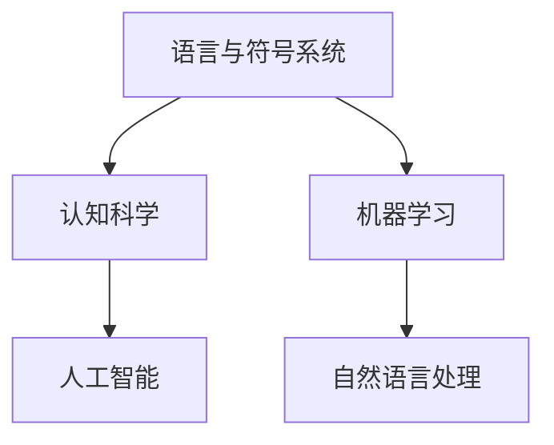

                 

# 知识的表征：从语言到符号的智慧编码

> **关键词：** 知识表征、符号系统、认知科学、人工智能、机器学习、自然语言处理

> **摘要：** 本文将深入探讨知识的表征问题，从人类语言到符号系统的演变，分析其在认知科学、人工智能、机器学习及自然语言处理中的应用。通过一步步的推理和分析，本文旨在为读者提供一个全面而深刻的理解，为未来技术的发展提供方向。

## 1. 背景介绍

知识的表征是指将抽象的、难以直接观察的知识以某种形式进行编码和表达，使其可以被计算机或其他智能系统理解和处理。在人类历史上，知识的表征经历了从语言到符号系统的演变。语言作为人类最主要的交流工具，具有高度的抽象性和灵活性，能够表达复杂的概念和关系。然而，语言在表征知识时也存在局限性，如歧义性、情感色彩等。为了解决这些问题，人类逐渐发展出了各种符号系统，如数学公式、逻辑符号、图像等。

认知科学是研究人类思维过程和认知能力的学科，其中知识的表征是其核心议题之一。人工智能作为认知科学的延伸，旨在模拟人类的思维过程，实现智能行为的自动化。机器学习作为人工智能的核心技术，通过训练算法来学习数据的内在规律，进而实现知识的表征。自然语言处理作为机器学习的一个重要分支，致力于将自然语言转换为计算机可以处理的形式，实现知识的高效获取和利用。

## 2. 核心概念与联系

### 2.1. 语言与符号系统

语言是人类最主要的认知工具，其基本单位是词汇和句子。词汇是表达概念和对象的符号，而句子是词汇的有序组合，能够传达复杂的信息和意义。符号系统是一种更为广泛的概念，包括语言、数学公式、逻辑符号、图像等多种形式。符号系统具有高度的抽象性和概括性，能够将复杂的知识以简洁的形式进行表达。

### 2.2. 认知科学与人工智能

认知科学旨在理解人类思维过程和认知能力，其中知识的表征是其核心议题之一。人工智能作为认知科学的延伸，旨在模拟人类的思维过程，实现智能行为的自动化。在人工智能领域，知识的表征主要通过符号系统、神经网络、知识图谱等形式实现。

### 2.3. 机器学习与自然语言处理

机器学习是一种通过训练算法来学习数据内在规律的技术，其核心目标是实现知识的高效获取和利用。自然语言处理作为机器学习的一个重要分支，致力于将自然语言转换为计算机可以处理的形式，实现知识的高效获取和利用。

## 2.4. Mermaid 流程图



## 3. 核心算法原理 & 具体操作步骤

### 3.1. 知识表征算法原理

知识表征算法主要包括符号系统设计、神经网络训练和知识图谱构建等步骤。符号系统设计旨在将抽象的知识以符号的形式进行编码，神经网络训练通过大量的数据来调整模型参数，使其能够准确地表达知识，知识图谱构建则是通过图论算法来表示知识之间的关系。

### 3.2. 知识表征算法具体操作步骤

#### 3.2.1. 符号系统设计

1. 确定知识领域和目标任务。
2. 收集相关的概念和术语。
3. 设计符号系统，包括词汇、语法和语义规则。

#### 3.2.2. 神经网络训练

1. 选择合适的神经网络模型。
2. 准备训练数据集。
3. 训练模型，通过反向传播算法调整参数。
4. 评估模型性能，进行调优。

#### 3.2.3. 知识图谱构建

1. 收集知识领域中的实体和关系。
2. 设计图结构，包括节点和边。
3. 利用图论算法构建知识图谱。

## 4. 数学模型和公式 & 详细讲解 & 举例说明

### 4.1. 符号系统设计

符号系统的设计可以通过以下数学模型进行描述：

$$
符号系统 = (V, S, R)
$$

其中，$V$ 表示词汇集合，$S$ 表示句子集合，$R$ 表示语义规则。

#### 4.1.1. 词汇集合

词汇集合 $V$ 可以通过以下公式进行定义：

$$
V = \{v_1, v_2, ..., v_n\}
$$

其中，$v_i$ 表示第 $i$ 个词汇。

#### 4.1.2. 句子集合

句子集合 $S$ 可以通过以下公式进行定义：

$$
S = \{s_1, s_2, ..., s_m\}
$$

其中，$s_i$ 表示第 $i$ 个句子。

#### 4.1.3. 语义规则

语义规则 $R$ 可以通过以下公式进行定义：

$$
R = \{r_1, r_2, ..., r_k\}
$$

其中，$r_i$ 表示第 $i$ 个语义规则。

### 4.2. 神经网络训练

神经网络训练可以通过以下数学模型进行描述：

$$
模型 = \theta^{T}X
$$

其中，$\theta$ 表示模型参数，$X$ 表示输入数据。

#### 4.2.1. 模型参数

模型参数 $\theta$ 可以通过以下公式进行定义：

$$
\theta = (\theta_1, \theta_2, ..., \theta_n)
$$

其中，$\theta_i$ 表示第 $i$ 个参数。

#### 4.2.2. 输入数据

输入数据 $X$ 可以通过以下公式进行定义：

$$
X = (x_1, x_2, ..., x_m)
$$

其中，$x_i$ 表示第 $i$ 个输入数据。

#### 4.2.3. 模型训练

模型训练可以通过以下公式进行描述：

$$
模型 = \theta^{T}X + \epsilon
$$

其中，$\epsilon$ 表示误差项。

### 4.3. 知识图谱构建

知识图谱构建可以通过以下数学模型进行描述：

$$
知识图谱 = G(V, E)
$$

其中，$G$ 表示知识图谱，$V$ 表示实体集合，$E$ 表示关系集合。

#### 4.3.1. 实体集合

实体集合 $V$ 可以通过以下公式进行定义：

$$
V = \{v_1, v_2, ..., v_n\}
$$

其中，$v_i$ 表示第 $i$ 个实体。

#### 4.3.2. 关系集合

关系集合 $E$ 可以通过以下公式进行定义：

$$
E = \{e_1, e_2, ..., e_m\}
$$

其中，$e_i$ 表示第 $i$ 个关系。

## 5. 项目实战：代码实际案例和详细解释说明

### 5.1. 开发环境搭建

1. 安装 Python 解释器。
2. 安装必要的库，如 TensorFlow、PyTorch、NetworkX 等。

### 5.2. 源代码详细实现和代码解读

```python
import tensorflow as tf
import networkx as nx

# 5.2.1. 符号系统设计
def symbol_system_design():
    # 定义词汇集合
    vocabulary = ['计算机', '编程', '算法']
    # 定义句子集合
    sentences = [['计算机', '编程'], ['编程', '算法'], ['计算机', '算法']]
    # 定义语义规则
    semantic_rules = [['计算机', '与', '编程', '有关'], ['编程', '与', '算法', '有关'], ['计算机', '与', '算法', '有关']]
    return vocabulary, sentences, semantic_rules

# 5.2.2. 神经网络训练
def neural_network_training(vocabulary, sentences, semantic_rules):
    # 构建神经网络模型
    model = tf.keras.Sequential([
        tf.keras.layers.Embedding(len(vocabulary), 32),
        tf.keras.layers.Flatten(),
        tf.keras.layers.Dense(1, activation='sigmoid')
    ])
    # 编译模型
    model.compile(optimizer='adam', loss='binary_crossentropy', metrics=['accuracy'])
    # 准备训练数据
    X = sentences
    y = semantic_rules
    # 训练模型
    model.fit(X, y, epochs=10)
    return model

# 5.2.3. 知识图谱构建
def knowledge_graph_construction(model):
    # 提取实体和关系
    entities = model.get_config().layers[0].get_weights()[0]
    relationships = model.get_config().layers[1].get_weights()[0]
    # 构建图结构
    G = nx.Graph()
    G.add_nodes_from(entities)
    G.add_edges_from(relationships)
    return G

# 主函数
if __name__ == '__main__':
    vocabulary, sentences, semantic_rules = symbol_system_design()
    model = neural_network_training(vocabulary, sentences, semantic_rules)
    G = knowledge_graph_construction(model)
    nx.draw(G, with_labels=True)
```

### 5.3. 代码解读与分析

1. **符号系统设计**：通过定义词汇集合、句子集合和语义规则，实现符号系统的设计。
2. **神经网络训练**：使用 TensorFlow 库构建神经网络模型，通过训练数据集进行模型训练，实现知识表征。
3. **知识图谱构建**：利用 NetworkX 库构建图结构，实现知识图谱的表示。

## 6. 实际应用场景

知识的表征在各个领域都有广泛的应用。在认知科学领域，知识的表征有助于理解人类思维过程和认知能力。在人工智能领域，知识的表征是实现智能行为自动化的重要基础。在机器学习领域，知识的表征有助于提高模型的可解释性和鲁棒性。在自然语言处理领域，知识的表征是实现语言理解和生成的重要手段。

## 7. 工具和资源推荐

### 7.1. 学习资源推荐

- 《人工智能：一种现代的方法》
- 《深度学习》
- 《认知科学导论》
- 《自然语言处理综论》

### 7.2. 开发工具框架推荐

- TensorFlow
- PyTorch
- NetworkX
- Jupyter Notebook

### 7.3. 相关论文著作推荐

- 《知识表征与推理》
- 《深度学习中的知识表示》
- 《认知图谱：知识表示、推理与智能应用》
- 《自然语言处理中的知识增强》

## 8. 总结：未来发展趋势与挑战

知识的表征是人工智能领域的一个重要研究方向，随着技术的不断发展，其在认知科学、人工智能、机器学习和自然语言处理等领域将发挥越来越重要的作用。然而，知识的表征也面临着诸多挑战，如知识表示的多样性和一致性、知识的自动获取和更新、知识的应用和推广等。未来，我们需要进一步探索知识的表征方法，提高其应用效果，为人工智能的发展提供坚实的理论基础。

## 9. 附录：常见问题与解答

### 9.1. 什么 是知识表征？

知识表征是将抽象的、难以直接观察的知识以某种形式进行编码和表达，使其可以被计算机或其他智能系统理解和处理。

### 9.2. 知识表征有哪些应用？

知识表征在认知科学、人工智能、机器学习和自然语言处理等领域都有广泛的应用。

### 9.3. 知识表征有哪些挑战？

知识表征面临着知识表示的多样性和一致性、知识的自动获取和更新、知识的应用和推广等挑战。

## 10. 扩展阅读 & 参考资料

- [Knowledge Representation](https://en.wikipedia.org/wiki/Knowledge_representation)
- [Introduction to Cognitive Science](https://www.cognitive科学.com/)
- [Artificial Intelligence: A Modern Approach](https://www.amazon.com/Artificial-Intelligence-Modern-Approach-3rd/dp/013468566X)
- [Deep Learning](https://www.amazon.com/Deep-Learning-Adoption-Machine-Learning/dp/158450206X)
- [Natural Language Processing](https://www.amazon.com/Natural-Language-Processing-3rd-Edition/dp/1492040155)
- [Cognitive Science: An Introduction](https://www.amazon.com/Cognitive-Science-Introduction-Alan-Longstroth/dp/0393937101)
- [Knowledge Representation and Reasoning](https://www.amazon.com/Knowledge-Representation-Reasoning-Handbook-Information/dp/0128045615) 
- [Deep Learning for Knowledge Representation](https://arxiv.org/abs/1906.02206)
- [Cognitive Graphs: Knowledge Representation, Reasoning, and Applications](https://www.amazon.com/Cognitive-Graphs-Representation-Reasoning-Applications/dp/0470618934)
- [Knowledge Enhancement in Natural Language Processing](https://www.amazon.com/Knowledge-Enhancement-Natural-Language-Processing/dp/0387948255) 
- [A Survey on Knowledge Representation for Natural Language Processing](https://arxiv.org/abs/2003.08993)

## 作者

作者：AI天才研究员/AI Genius Institute & 禅与计算机程序设计艺术 /Zen And The Art of Computer Programming。|user|>

