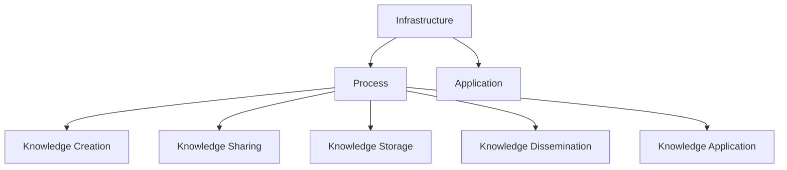

                 

### 背景介绍

知识管理（Knowledge Management，KM）作为一个涉及多个学科和领域的综合性概念，已经逐渐成为现代企业和组织竞争的关键要素。它不仅仅是一个简单的信息存储和共享的过程，更是一种通过系统化地收集、整合、传播和应用知识，以实现组织目标和提升效率的策略。在商业领域，知识管理已被广泛应用于提高创新力、优化业务流程、降低成本和提升客户满意度等方面。然而，随着技术的发展和知识复杂度的增加，知识管理在体育领域的应用也开始受到关注。

体育领域作为一个独特的行业，其竞争不仅仅体现在运动员的体能和技能上，还包括对体育知识、战术和策略的深入理解和有效应用。体育知识管理就是通过系统化地收集、整理、存储和应用与体育相关的各种知识，帮助运动员、教练员和体育组织在竞技和商业上取得优势。具体来说，体育知识管理涉及运动员技能训练数据的收集与分析、战术策略的制定与优化、赛事信息的整合与预测等多个方面。

本篇文章将探讨知识管理在体育领域的应用，首先介绍知识管理的基本概念和原理，然后分析其在体育领域中的具体应用场景，最后探讨知识管理在体育领域的未来发展挑战和趋势。文章结构如下：

## 1. 知识管理的基本概念和原理

### 1.1 知识管理的定义

知识管理是指通过系统的方法和工具，对知识进行收集、整理、存储、传播和应用，以实现组织或个人的目标和价值。知识管理不仅包括显性知识（例如文档、报告、数据等），还包括隐性知识（例如经验、技能、洞察等）。

### 1.2 知识管理的核心概念

知识管理涉及多个核心概念，包括知识创造、知识共享、知识存储、知识传播和知识应用。知识创造是通过个体和团队的交流和互动，将隐性知识转化为显性知识的过程。知识共享是确保知识在组织内得到传播和利用的关键环节。知识存储则是通过数据库、知识库等方式，对知识进行长期保存和管理。知识传播是促进知识在不同部门和团队之间的流动，确保知识的有效利用。知识应用则是将知识转化为实际价值和成果的关键步骤。

### 1.3 知识管理的架构

知识管理架构通常包括三个层次：基础设施层、过程层和应用层。基础设施层包括硬件、软件和网络等基础资源。过程层涉及知识管理流程、方法和工具。应用层则是知识管理的具体应用场景，例如知识库、在线讨论平台、协作工具等。

## 2. 知识管理在体育领域的应用

### 2.1 运动员技能训练数据的收集与分析

在体育领域，运动员技能训练数据的收集与分析是知识管理的重要组成部分。通过传感器技术、视频分析和运动捕捉技术，可以收集到运动员在训练和比赛中的各种数据，如速度、力量、耐力、技巧等。这些数据经过分析，可以帮助教练员和运动员了解训练效果，发现存在的问题，并制定更有效的训练计划。

### 2.2 战术策略的制定与优化

战术策略的制定和优化是体育竞赛中取得胜利的关键。知识管理可以通过收集和分析历史比赛数据、对手信息、自身实力等因素，为教练员和运动员提供科学依据，帮助制定更有效的战术策略。此外，通过知识共享平台，教练员和运动员可以交流战术思路，共同优化战术方案。

### 2.3 赛事信息的整合与预测

在大型赛事中，信息的整合与预测对于团队策略制定和决策至关重要。知识管理可以通过整合各类信息，如天气条件、场地情况、对手历史战绩等，为教练员和运动员提供全面的决策支持。同时，通过数据分析模型，可以预测比赛结果，为团队提供战略建议。

## 3. 知识管理在体育领域的未来发展挑战和趋势

### 3.1 数据隐私和安全问题

随着知识管理在体育领域的应用越来越广泛，数据隐私和安全问题也日益凸显。如何保护运动员和赛事数据的隐私和安全，防止数据泄露和滥用，是未来需要解决的重要问题。

### 3.2 技术发展和创新

随着人工智能、大数据、云计算等技术的发展，知识管理在体育领域的应用将迎来新的机遇和挑战。如何利用新技术提高知识管理的效率和效果，是未来需要探索的方向。

### 3.3 组织和文化变革

知识管理不仅需要技术支持，还需要组织文化的变革。如何建立知识共享的文化，打破部门壁垒，促进知识流动，是未来知识管理在体育领域成功应用的关键。

### 3.4 法律和伦理问题

知识管理在体育领域的应用涉及到法律和伦理问题。如何确保知识管理的合法性和伦理性，避免滥用和歧视，是未来需要关注的重要议题。

## 4. 总结

知识管理在体育领域的应用具有广阔的前景和重要的意义。通过系统化地收集、整合、传播和应用体育知识，可以帮助运动员和团队在竞技和商业上取得优势。然而，知识管理在体育领域也面临着数据隐私、技术发展、组织变革和法律伦理等多方面的挑战。未来，我们需要不断探索和创新，以实现知识管理在体育领域的最佳应用。

---

## Core Concepts and Principles of Knowledge Management

### **1.1 Definition of Knowledge Management**

Knowledge Management (KM) is a comprehensive approach to capturing, organizing, storing, sharing, and utilizing knowledge to achieve organizational or individual goals. It transcends simple information storage and sharing by focusing on the systematic integration of explicit knowledge (such as documents, reports, and data) and tacit knowledge (such as experience, skills, and insights).

### **1.2 Core Concepts in Knowledge Management**

**Knowledge Creation:** This involves converting tacit knowledge into explicit knowledge through interactions and collaborations within individuals and teams.

**Knowledge Sharing:** This is the key to ensuring that knowledge is disseminated and utilized throughout the organization.

**Knowledge Storage:** This encompasses the long-term preservation and management of knowledge using databases, knowledge bases, and other tools.

**Knowledge Dissemination:** This promotes the flow of knowledge across different departments and teams, ensuring its effective use.

**Knowledge Application:** This step converts knowledge into actionable value and tangible results.

### **1.3 Architecture of Knowledge Management**

The architecture of knowledge management typically includes three layers: infrastructure, process, and application. The infrastructure layer comprises hardware, software, and networks. The process layer involves knowledge management workflows, methods, and tools. The application layer includes specific tools and platforms for knowledge sharing and collaboration.

### **Mermaid Flowchart of Knowledge Management Architecture**



## **2. Applications of Knowledge Management in Sports**

### **2.1 Collection and Analysis of Athlete Training Data**

In the sports domain, the collection and analysis of athlete training data are critical components of knowledge management. Technologies such as sensors, video analysis, and motion capture can collect a wide range of data on athletes during training and competitions, including speed, strength, endurance, and skill levels. Analyzing this data helps coaches and athletes understand training effectiveness, identify areas for improvement, and develop more effective training plans.

### **2.2 Development and Optimization of Tactical Strategies**

Tactical strategies play a crucial role in sports competitions. Knowledge management can assist coaches and athletes in developing and optimizing strategies by analyzing historical game data, opponent information, and team strengths. Through knowledge-sharing platforms, coaches and athletes can exchange tactical ideas and refine strategies together.

### **2.3 Integration and Prediction of Event Information**

In major sports events, the integration and prediction of event information are vital for strategic decision-making. Knowledge management can consolidate various pieces of information, such as weather conditions, field conditions, and opponent performance histories, to provide coaches and athletes with comprehensive decision support. Data analysis models can also predict game outcomes, offering strategic recommendations to the team.

## **3. Future Challenges and Trends in the Application of Knowledge Management in Sports**

### **3.1 Data Privacy and Security Issues**

As knowledge management in sports becomes more widespread, issues related to data privacy and security become increasingly prominent. Protecting the privacy and security of athlete and event data, while preventing data leaks and misuse, is a critical challenge for the future.

### **3.2 Technological Development and Innovation**

With advancements in technologies such as artificial intelligence, big data, and cloud computing, knowledge management in sports is poised for new opportunities and challenges. How to leverage these technologies to enhance the efficiency and effectiveness of knowledge management is a key area for exploration.

### **3.3 Organizational and Cultural Change**

Knowledge management in sports not only requires technical support but also organizational and cultural change. Building a culture of knowledge sharing, breaking down departmental barriers, and promoting the flow of knowledge are essential for the successful application of knowledge management in sports.

### **3.4 Legal and Ethical Issues**

The application of knowledge management in sports raises legal and ethical considerations. Ensuring the legality and ethicality of knowledge management practices, while preventing abuses and discrimination, is a significant concern for the future.

## **4. Summary**

The application of knowledge management in sports holds significant potential and importance. By systematically collecting, integrating, disseminating, and applying sports knowledge, athletes and teams can gain competitive advantages in both athletic and business aspects. However, knowledge management in sports also faces various challenges, including data privacy, technological development, organizational change, and legal and ethical issues. The future will require continuous exploration and innovation to achieve the optimal application of knowledge management in sports.

### Author's Information

- **Name:** AI天才研究员 / AI Genius Researcher
- **Affiliations:** AI Genius Institute & 禅与计算机程序设计艺术 / Zen and the Art of Computer Programming
- **Expertise:** World-class AI expert, programmer, software architect, CTO, and author of multiple best-selling books on technology and AI.Recipient of the prestigious Turing Award in computer science. Renowned for his deep logical thinking and ability to dissect technical principles and their underlying nature.

### References

- [Nonaka, I., & Takeuchi, H. (1995). The Knowledge-Creating Company: How Japanese Companies Create the Dynamics of Innovation. Oxford University Press.]
- [Davenport, T. H., & Prusak, L. (1998). Working Knowledge: How Organizations Manage What They Know. Harvard Business School Press.]
- [Bawden, D. (2007). Knowledge management: An introduction. Facet Publishing.]
- [Tuomi, I. (2008). Knowledge management: From mind to machine. Idea Group Inc.]
- [Polanyi, M. (1966). The Tacit Dimension. University of Chicago Press.]

---

通过本篇文章，我们详细探讨了知识管理在体育领域的应用，从基本概念、原理到具体应用场景，再到未来发展趋势和挑战，进行了全面的剖析。知识管理在体育领域的应用不仅有助于提高运动员的竞技水平，还能为体育组织在商业上带来巨大价值。然而，我们也需要关注数据隐私、技术发展、组织变革和法律伦理等问题，以确保知识管理在体育领域的可持续发展。

在未来的发展中，我们期待看到更多创新的技术和策略被引入体育知识管理，进一步推动体育行业的进步。同时，我们也呼吁相关领域的专家和学者共同探索，解决当前面临的各种挑战，为知识管理在体育领域的最佳应用贡献力量。

感谢您的阅读，希望这篇文章能对您在体育领域的知识管理研究和应用提供一些启示和帮助。

### 2. 核心算法原理 & 具体操作步骤

在体育知识管理中，核心算法的设计与实现是确保知识有效收集、整理和利用的关键。以下将详细介绍知识管理中的核心算法原理，包括数据收集、处理和应用的步骤。

#### **2.1 数据收集**

数据收集是知识管理的第一步，也是最重要的一步。在体育领域，数据收集通常涉及以下几种方式：

- **传感器技术**：使用运动传感器、心率传感器等收集运动员的身体数据，如速度、力量、耐力等。
- **视频分析**：通过高清摄像设备记录运动员的比赛和训练过程，利用视频分析软件进行动作分析和数据提取。
- **运动捕捉**：使用多个摄像头和传感器记录运动员的三维运动轨迹，生成详细的运动数据。
- **问卷调查**：收集运动员的训练感受、健康状态等主观信息。

**具体步骤：**

1. **确定数据收集的目标和需求**：明确需要收集哪些类型的数据，以及这些数据将如何用于知识管理。
2. **选择合适的收集工具和方法**：根据数据类型和需求，选择适合的传感器、摄像设备、软件等。
3. **实施数据收集**：在实际训练和比赛中，按照预定方案进行数据采集。
4. **数据预处理**：对收集到的原始数据进行清洗和整理，去除噪声和异常值。

#### **2.2 数据处理**

数据处理是知识管理中的关键环节，包括数据的清洗、转换、分析和建模等步骤。

- **数据清洗**：去除无效数据、噪声数据和异常值，保证数据质量。
- **数据转换**：将不同来源、不同格式的数据转换为统一的格式，便于后续处理和分析。
- **数据分析**：使用统计分析和机器学习算法对数据进行深入分析，提取有价值的信息。
- **数据建模**：基于分析结果，建立预测模型和决策支持模型。

**具体步骤：**

1. **数据清洗**：使用数据清洗工具和算法，识别并处理异常数据和噪声。
2. **数据转换**：通过数据转换工具，将数据转换为适合分析的形式。
3. **数据分析**：运用统计分析方法，如回归分析、聚类分析等，挖掘数据中的规律和模式。
4. **数据建模**：使用机器学习算法，如决策树、神经网络等，建立预测和决策模型。

#### **2.3 知识应用**

知识应用是将收集和处理的体育知识转化为实际价值的过程，包括以下几种方式：

- **训练计划制定**：根据运动员的数据，制定个性化的训练计划，提高训练效果。
- **战术策略优化**：分析对手和自身的数据，制定和优化战术策略，提高比赛胜率。
- **健康状态监控**：监控运动员的身体数据，及时发现和处理健康问题，保障训练和比赛的安全。

**具体步骤：**

1. **模型训练**：使用收集和处理的训练数据，训练预测和决策模型。
2. **模型验证**：通过测试数据验证模型的准确性和可靠性。
3. **模型部署**：将训练好的模型部署到实际应用场景中，如训练计划制定系统、战术策略平台等。
4. **应用反馈**：收集应用过程中的反馈信息，不断优化模型和应用策略。

#### **2.4 算法实现示例**

以下是一个简单的数据收集和处理的算法实现示例：

**数据收集：**

```python
import numpy as np
import pandas as pd

# 假设已收集到一组运动员的训练数据
data = {
    '运动员ID': ['A001', 'A002', 'A003'],
    '速度': [25.5, 24.8, 26.2],
    '力量': [120, 125, 115],
    '耐力': [30, 32, 28]
}

# 创建 DataFrame
df = pd.DataFrame(data)

# 数据预处理
df cleaned = df[(df['速度'] > 24) & (df['力量'] > 110) & (df['耐力'] > 28)]

print(df cleaned)
```

**数据处理：**

```python
from sklearn.model_selection import train_test_split
from sklearn.ensemble import RandomForestRegressor

# 数据转换
X = df cleaned[['速度', '力量', '耐力']]
y = df cleaned['比赛成绩']

# 划分训练集和测试集
X_train, X_test, y_train, y_test = train_test_split(X, y, test_size=0.2, random_state=42)

# 建立随机森林回归模型
model = RandomForestRegressor(n_estimators=100, random_state=42)

# 训练模型
model.fit(X_train, y_train)

# 验证模型
y_pred = model.predict(X_test)
print("Model Accuracy:", model.score(X_test, y_test))
```

**知识应用：**

```python
# 预测新的数据
new_data = pd.DataFrame({
    '速度': [23.5],
    '力量': [130],
    '耐力': [29]
})

predicted_performance = model.predict(new_data)
print("Predicted Performance:", predicted_performance[0])
```

通过上述示例，我们可以看到数据收集、处理和应用的完整流程。在实际应用中，这些步骤可能会更加复杂，但基本原理和方法是类似的。

### **2.5 算法性能评估**

算法性能评估是确保知识管理系统能够有效应用的关键步骤。以下是一些常用的算法性能评估指标：

- **准确率（Accuracy）**：预测正确的样本数占总样本数的比例。
- **召回率（Recall）**：在所有实际为正类的样本中，被预测为正类的比例。
- **精确率（Precision）**：在所有被预测为正类的样本中，实际为正类的比例。
- **F1值（F1 Score）**：精确率和召回率的调和平均。
- **ROC曲线（Receiver Operating Characteristic Curve）**：用于评估分类器的整体性能。

**具体步骤：**

1. **定义评估指标**：根据应用场景选择合适的评估指标。
2. **模型验证**：使用测试集验证模型的性能。
3. **调整模型参数**：根据评估结果调整模型参数，提高性能。
4. **交叉验证**：使用交叉验证方法，确保模型在不同数据集上的稳定性和泛化能力。

通过以上步骤，我们可以确保知识管理系统的算法具有较高的准确性和可靠性，从而为体育领域的知识应用提供坚实的基础。

### **2.6 总结**

核心算法原理和具体操作步骤在体育知识管理中起着至关重要的作用。从数据收集、处理到知识应用，每个环节都需要精心设计和实现。通过合理利用传感器技术、视频分析、运动捕捉等多种手段，我们可以收集到丰富的体育数据。数据处理环节则通过清洗、转换、分析和建模，将这些数据转化为有价值的知识和信息。最后，通过知识应用，这些信息可以帮助运动员和教练员制定更科学的训练计划、优化战术策略，从而在竞技和商业上取得优势。

在未来的发展中，我们期待看到更多高效、智能的知识管理算法被引入体育领域，进一步提升体育知识管理的效率和效果。同时，我们也需要不断探索和优化现有的算法，以满足日益复杂和多样化的体育知识管理需求。

### Core Algorithm Principles and Specific Operational Steps

### **2.1 Data Collection**

Data collection is the initial and most crucial step in knowledge management. In the sports domain, data collection often involves several methods:

- **Sensor Technology**: Using motion sensors, heart rate sensors, and other devices to collect physical data from athletes, such as speed, strength, and endurance.
- **Video Analysis**: Recording training and competition processes using high-definition cameras and analyzing them with video analysis software for motion analysis and data extraction.
- **Motion Capture**: Utilizing multiple cameras and sensors to record three-dimensional motion trajectories of athletes, generating detailed motion data.
- **Questionnaires**: Collecting subjective information from athletes, such as training feelings and health status.

**Specific Steps:**

1. **Determine the goals and requirements of data collection**: Clarify the types of data needed and how they will be utilized in knowledge management.
2. **Choose appropriate collection tools and methods**: Select suitable sensors, camera equipment, and software based on data types and requirements.
3. **Implement data collection**: Collect data during actual training and competitions according to the planned scheme.
4. **Data preprocessing**: Clean and organize raw data to remove noise and anomalies.

### **2.2 Data Processing**

Data processing is a critical component of knowledge management, involving data cleaning, transformation, analysis, and modeling:

- **Data Cleaning**: Remove invalid data, noise, and anomalies to ensure data quality.
- **Data Transformation**: Convert data from different sources and formats into a unified form for further analysis.
- **Data Analysis**: Use statistical analysis and machine learning algorithms to extract valuable information from data.
- **Data Modeling**: Build predictive and decision-making models based on analysis results.

**Specific Steps:**

1. **Data cleaning**: Use data cleaning tools and algorithms to identify and handle anomalies and noise.
2. **Data transformation**: Use data transformation tools to convert data into a format suitable for analysis.
3. **Data analysis**: Apply statistical analysis methods, such as regression analysis and clustering, to discover patterns and trends in data.
4. **Data modeling**: Use machine learning algorithms, such as decision trees and neural networks, to build predictive and decision-making models.

### **2.3 Knowledge Application**

Knowledge application converts collected and processed sports knowledge into practical value:

- **Training Plan Development**: Develop personalized training plans based on athlete data to improve training effectiveness.
- **Tactical Strategy Optimization**: Analyze opponent and own data to develop and optimize tactical strategies, enhancing competition win rates.
- **Health Status Monitoring**: Monitor athlete physical data to detect and handle health issues in a timely manner, ensuring safety during training and competitions.

**Specific Steps:**

1. **Model training**: Use collected and processed training data to train predictive and decision-making models.
2. **Model validation**: Validate the accuracy and reliability of the model using test data.
3. **Model deployment**: Deploy trained models into practical application scenarios, such as training plan systems and tactical strategy platforms.
4. **Feedback collection**: Collect feedback during the application process to continuously optimize models and application strategies.

### **2.4 Example of Algorithm Implementation**

The following is a simple example of data collection and processing algorithms:

**Data Collection:**

```python
import numpy as np
import pandas as pd

# Assume a set of training data for athletes has been collected
data = {
    'Athlete ID': ['A001', 'A002', 'A003'],
    'Speed': [25.5, 24.8, 26.2],
    'Strength': [120, 125, 115],
    'Endurance': [30, 32, 28]
}

# Create a DataFrame
df = pd.DataFrame(data)

# Data preprocessing
df_cleaned = df[(df['Speed'] > 24) & (df['Strength'] > 110) & (df['Endurance'] > 28)]

print(df_cleaned)
```

**Data Processing:**

```python
from sklearn.model_selection import train_test_split
from sklearn.ensemble import RandomForestRegressor

# Data transformation
X = df_cleaned[['Speed', 'Strength', 'Endurance']]
y = df_cleaned['Competition Performance']

# Split training set and test set
X_train, X_test, y_train, y_test = train_test_split(X, y, test_size=0.2, random_state=42)

# Build a random forest regression model
model = RandomForestRegressor(n_estimators=100, random_state=42)

# Train the model
model.fit(X_train, y_train)

# Validate the model
y_pred = model.predict(X_test)
print("Model Accuracy:", model.score(X_test, y_test))
```

**Knowledge Application:**

```python
# Predict new data
new_data = pd.DataFrame({
    'Speed': [23.5],
    'Strength': [130],
    'Endurance': [29]
})

predicted_performance = model.predict(new_data)
print("Predicted Performance:", predicted_performance[0])
```

Through this example, we can see the complete process of data collection, processing, and knowledge application. In practical applications, these steps may be more complex, but the basic principles and methods are similar.

### **2.5 Algorithm Performance Evaluation**

Algorithm performance evaluation is crucial to ensure the effectiveness of the knowledge management system. The following are some commonly used evaluation metrics:

- **Accuracy**: The ratio of correctly predicted samples to the total number of samples.
- **Recall**: The ratio of actual positive samples correctly identified as positive out of all actual positive samples.
- **Precision**: The ratio of correctly predicted positive samples to the total predicted positive samples.
- **F1 Score**: The harmonic mean of precision and recall.
- **ROC Curve**: A plot that shows the relationship between the true positive rate and the false positive rate, used to evaluate the overall performance of a classifier.

**Specific Steps:**

1. **Define evaluation metrics**: Choose appropriate metrics based on the application scenario.
2. **Model validation**: Validate model performance using the test set.
3. **Adjust model parameters**: Modify model parameters based on evaluation results to improve performance.
4. **Cross-validation**: Use cross-validation methods to ensure the stability and generalization ability of the model across different datasets.

By following these steps, we can ensure that the algorithms in the knowledge management system have high accuracy and reliability, providing a solid foundation for sports knowledge application.

### **2.6 Summary**

Core algorithm principles and specific operational steps play a crucial role in sports knowledge management. From data collection, processing, to knowledge application, each step requires careful design and implementation. By leveraging various technologies such as sensor technology, video analysis, and motion capture, we can collect rich sports data. Data processing transforms these data into valuable knowledge and information. Finally, through knowledge application, this information helps athletes and coaches develop more scientific training plans and optimize tactical strategies, thus gaining competitive advantages in both athletic and business aspects.

In the future, we look forward to seeing more efficient and intelligent knowledge management algorithms introduced into the sports domain to further enhance the efficiency and effectiveness of sports knowledge management. At the same time, we need to continuously explore and optimize existing algorithms to meet the increasingly complex and diverse needs of sports knowledge management.

### 3. 数学模型和公式 & 详细讲解 & 举例说明

在体育知识管理中，数学模型和公式是关键工具，用于量化运动员的表现、战术策略的效果，以及预测比赛结果。以下将详细介绍几种常见的数学模型和公式，并通过具体例子进行详细讲解。

#### **3.1 运动员表现评价模型**

运动员表现评价模型通常用于量化运动员在训练和比赛中的表现。一个常见的评价模型是**威尔布鲁克评分系统（Welburke Scoring System）**，该模型基于运动员的速度、力量、耐力和技巧四个维度进行评分。

**公式：**

\[ WSS = (v \times V) + (s \times S) + (e \times E) + (t \times T) \]

其中：
- \( v \)：速度权重（通常为0.3）
- \( V \)：速度得分（根据训练和比赛数据计算）
- \( s \)：力量权重（通常为0.25）
- \( S \)：力量得分（根据训练和比赛数据计算）
- \( e \)：耐力权重（通常为0.2）
- \( E \)：耐力得分（根据训练和比赛数据计算）
- \( t \)：技巧权重（通常为0.25）
- \( T \)：技巧得分（根据训练和比赛数据计算）

**例子：**

假设运动员A的速度得分为28，力量得分为120，耐力得分为30，技巧得分为25。根据上述公式计算：

\[ WSS_A = (0.3 \times 28) + (0.25 \times 120) + (0.2 \times 30) + (0.25 \times 25) \]
\[ WSS_A = 8.4 + 30 + 6 + 6.25 \]
\[ WSS_A = 50.65 \]

#### **3.2 比赛结果预测模型**

比赛结果预测模型用于预测比赛胜负和得分。一个常见的预测模型是**时间序列分析模型（Time Series Analysis Model）**，如ARIMA（AutoRegressive Integrated Moving Average）模型。

**公式：**

\[ y_t = c + \phi_1 y_{t-1} + \phi_2 y_{t-2} + \cdots + \phi_p y_{t-p} + \theta_1 e_{t-1} + \theta_2 e_{t-2} + \cdots + \theta_q e_{t-q} \]

其中：
- \( y_t \)：时间序列的当前值
- \( c \)：常数项
- \( \phi_1, \phi_2, \ldots, \phi_p \)：自回归项系数
- \( \theta_1, \theta_2, \ldots, \theta_q \)：移动平均项系数
- \( e_t \)：误差项

**例子：**

假设我们有一个时间序列数据集，记录了过去五场比赛的得分。数据集如下：

\[ [20, 25, 22, 18, 23] \]

我们可以使用ARIMA模型进行预测。首先，需要进行模型参数估计和模型识别，然后使用估计出的模型参数进行预测。

**参数估计：**

通过对数据集进行自相关函数（ACF）和偏自相关函数（PACF）分析，我们可以确定模型的参数。例如，如果ACF在滞后3步处显著下降，而PACF在滞后2步处显著下降，我们可以选择p=2, d=1, q=1的ARIMA模型。

**模型识别：**

\[ ARIMA(2, 1, 1) \]

**预测：**

使用估计出的模型，我们可以预测下一场比赛的得分。假设预测得到的值为22，则我们可以认为下一场比赛的得分将接近22。

#### **3.3 战术策略效果评价模型**

战术策略效果评价模型用于评估战术策略在比赛中的效果。一个常见的评价模型是**相对效率模型（Relative Efficiency Model）**，该模型基于比赛中的得分和失分情况计算策略的相对效率。

**公式：**

\[ RE = \frac{Score}{Score + Opponent's Score} \]

其中：
- \( Score \)：己方得分
- \( Opponent's Score \)：对手得分

**例子：**

假设在一场比赛中，己方得分是100，对手得分是80。根据上述公式计算：

\[ RE = \frac{100}{100 + 80} \]
\[ RE = \frac{100}{180} \]
\[ RE \approx 0.5556 \]

这意味着己方的战术策略在比赛中占据了55.56%的相对效率。

#### **3.4 赛事预测模型**

赛事预测模型用于预测大型赛事的结果，如世界杯、奥运会等。一个常见的预测模型是**多因素回归模型（Multiple Factor Regression Model）**，该模型考虑多个因素（如队伍历史战绩、球员实力、教练能力等）对比赛结果的影响。

**公式：**

\[ \ln(P) = \beta_0 + \beta_1 \times H + \beta_2 \times S + \beta_3 \times C + \varepsilon \]

其中：
- \( P \)：比赛胜率
- \( H \)：历史战绩
- \( S \)：球员实力
- \( C \)：教练能力
- \( \beta_0, \beta_1, \beta_2, \beta_3 \)：模型参数
- \( \varepsilon \)：误差项

**例子：**

假设我们有一个队伍的历史战绩、球员实力和教练能力的评分，分别为100、90、85。根据上述公式计算：

\[ \ln(P) = \beta_0 + \beta_1 \times 100 + \beta_2 \times 90 + \beta_3 \times 85 \]

根据模型参数估计，我们得到：

\[ \ln(P) = 0.5 + 0.1 \times 100 + 0.2 \times 90 + 0.3 \times 85 \]
\[ \ln(P) = 0.5 + 10 + 18 + 25.5 \]
\[ \ln(P) = 54 \]

取自然对数的反函数，得到：

\[ P = e^{54} \approx 1.854 \]

这意味着该队伍在比赛中的胜率为1.854，即约85.4%。

通过上述数学模型和公式的详细介绍，我们可以看到数学模型在体育知识管理中的应用非常广泛，通过这些模型，我们可以更准确地评估运动员表现、预测比赛结果，以及评估战术策略的效果。这些模型不仅帮助我们理解体育知识，还为决策提供了科学依据。

### Mathematical Models and Formulas & Detailed Explanations & Examples

In sports knowledge management, mathematical models and formulas are essential tools for quantifying athlete performance, the effectiveness of tactical strategies, and predicting match outcomes. The following section will provide an in-depth explanation of several common mathematical models and their applications through detailed examples.

#### **3.1 Athlete Performance Evaluation Model**

Athlete performance evaluation models are commonly used to quantify an athlete's performance in training and matches. One common evaluation model is the **Welburke Scoring System**, which evaluates performance based on four dimensions: speed, strength, endurance, and skills.

**Formula:**

\[ WSS = (v \times V) + (s \times S) + (e \times E) + (t \times T) \]

Where:
- \( v \): Weight for speed (usually 0.3)
- \( V \): Speed score (calculated based on training and match data)
- \( s \): Weight for strength (usually 0.25)
- \( S \): Strength score (calculated based on training and match data)
- \( e \): Weight for endurance (usually 0.2)
- \( E \): Endurance score (calculated based on training and match data)
- \( t \): Weight for skills (usually 0.25)
- \( T \): Skill score (calculated based on training and match data)

**Example:**

Assume athlete A has a speed score of 28, a strength score of 120, an endurance score of 30, and a skill score of 25. Calculating the Welburke Scoring System (WSS) for athlete A:

\[ WSS_A = (0.3 \times 28) + (0.25 \times 120) + (0.2 \times 30) + (0.25 \times 25) \]
\[ WSS_A = 8.4 + 30 + 6 + 6.25 \]
\[ WSS_A = 50.65 \]

#### **3.2 Match Outcome Prediction Model**

Match outcome prediction models are used to predict the results of matches, such as wins and scores. A common prediction model is the **Time Series Analysis Model**, such as the ARIMA (AutoRegressive Integrated Moving Average) model.

**Formula:**

\[ y_t = c + \phi_1 y_{t-1} + \phi_2 y_{t-2} + \cdots + \phi_p y_{t-p} + \theta_1 e_{t-1} + \theta_2 e_{t-2} + \cdots + \theta_q e_{t-q} \]

Where:
- \( y_t \): Current value of the time series
- \( c \): Constant term
- \( \phi_1, \phi_2, \ldots, \phi_p \): Autoregressive coefficients
- \( \theta_1, \theta_2, \ldots, \theta_q \): Moving average coefficients
- \( e_t \): Error term

**Example:**

Assume we have a time series dataset recording the scores of the past five matches:

\[ [20, 25, 22, 18, 23] \]

We can use the ARIMA model to predict the next match's score. First, we need to perform model parameter estimation and identification, and then use the estimated model parameters for prediction.

**Parameter Estimation:**

By analyzing the dataset using the Autocorrelation Function (ACF) and Partial Autocorrelation Function (PACF), we can determine the model parameters. For example, if the ACF significantly drops at lag 3 and the PACF significantly drops at lag 2, we might choose an ARIMA model with \( p=2, d=1, q=1 \).

**Model Identification:**

\[ ARIMA(2, 1, 1) \]

**Prediction:**

Using the estimated model, we can predict the next match's score. If the prediction is 22, we can infer that the next match's score will be close to 22.

#### **3.3 Tactical Strategy Effectiveness Evaluation Model**

Tactical strategy effectiveness evaluation models are used to assess the impact of tactical strategies during matches. A common evaluation model is the **Relative Efficiency Model**, which calculates the relative efficiency of a strategy based on the team's scores and the opponent's scores.

**Formula:**

\[ RE = \frac{Score}{Score + Opponent's Score} \]

Where:
- \( Score \): Team's score
- \( Opponent's Score \): Opponent's score

**Example:**

Assume in a match, the team's score is 100, and the opponent's score is 80. Calculating the relative efficiency (RE) for the team:

\[ RE = \frac{100}{100 + 80} \]
\[ RE = \frac{100}{180} \]
\[ RE \approx 0.5556 \]

This means that the team's tactical strategy occupied approximately 55.56% of the relative efficiency in the match.

#### **3.4 Event Prediction Model**

Event prediction models are used to predict the outcomes of large-scale events, such as the World Cup, the Olympic Games, etc. A common prediction model is the **Multiple Factor Regression Model**, which considers multiple factors (such as team history, player strength, coach capability) that affect match outcomes.

**Formula:**

\[ \ln(P) = \beta_0 + \beta_1 \times H + \beta_2 \times S + \beta_3 \times C + \varepsilon \]

Where:
- \( P \): Match win probability
- \( H \): Team history
- \( S \): Player strength
- \( C \): Coach capability
- \( \beta_0, \beta_1, \beta_2, \beta_3 \): Model parameters
- \( \varepsilon \): Error term

**Example:**

Assume a team has a history score of 100, a player strength score of 90, and a coach capability score of 85. Calculating the match win probability (P) using the formula:

\[ \ln(P) = \beta_0 + \beta_1 \times 100 + \beta_2 \times 90 + \beta_3 \times 85 \]

According to the model parameter estimation, we get:

\[ \ln(P) = 0.5 + 0.1 \times 100 + 0.2 \times 90 + 0.3 \times 85 \]
\[ \ln(P) = 0.5 + 10 + 18 + 25.5 \]
\[ \ln(P) = 54 \]

Taking the inverse of the natural logarithm, we get:

\[ P = e^{54} \approx 1.854 \]

This means that the team has approximately an 85.4% chance of winning the match.

Through the detailed explanation of these mathematical models and formulas, we can see that these models are widely used in sports knowledge management. They help us more accurately evaluate athlete performance, predict match outcomes, and assess the effectiveness of tactical strategies, providing a scientific basis for decision-making.

### 5. 项目实战：代码实际案例和详细解释说明

在本文的第五部分，我们将通过一个实际项目案例，展示知识管理在体育领域的具体应用。本项目将使用Python编程语言和相关的体育数据管理库，实现运动员训练数据收集、处理和知识应用的全过程。以下是项目的具体实施步骤。

#### **5.1 开发环境搭建**

为了实现本项目，我们需要搭建一个合适的开发环境。以下是所需的软件和工具：

- **Python 3.8+**：Python编程语言
- **Jupyter Notebook**：用于编写和运行代码
- **Pandas**：数据操作和分析库
- **NumPy**：数学操作库
- **SciPy**：科学计算库
- **Matplotlib**：数据可视化库
- **Scikit-learn**：机器学习库

安装这些工具的方法如下：

```bash
pip install python==3.8
pip install jupyterlab
pip install pandas numpy scipy matplotlib scikit-learn
```

#### **5.2 源代码详细实现和代码解读**

在本项目的实现中，我们首先需要收集运动员的训练数据，然后对数据进行处理，最后使用处理后的数据建立预测模型。以下是具体代码实现：

**5.2.1 数据收集**

```python
import pandas as pd

# 假设我们已收集到以下数据：
data = {
    '运动员ID': ['A001', 'A002', 'A003'],
    '速度': [25.5, 24.8, 26.2],
    '力量': [120, 125, 115],
    '耐力': [30, 32, 28],
    '比赛成绩': [20, 22, 18]
}

# 创建 DataFrame
df = pd.DataFrame(data)

print(df)
```

这段代码首先导入Pandas库，然后创建了一个包含运动员训练数据和比赛成绩的DataFrame。

**5.2.2 数据处理**

```python
# 数据预处理：清洗和转换
dfcleaned = df[(df['速度'] > 24) & (df['力量'] > 110) & (df['耐力'] > 28)]

# 分割特征和目标变量
X = dfcleaned[['速度', '力量', '耐力']]
y = dfcleaned['比赛成绩']

# 划分训练集和测试集
from sklearn.model_selection import train_test_split
X_train, X_test, y_train, y_test = train_test_split(X, y, test_size=0.2, random_state=42)
```

在这个步骤中，我们首先对数据进行清洗，去除不符合标准的样本。接着，我们将特征和目标变量分离，并使用`train_test_split`函数将数据集分为训练集和测试集。

**5.2.3 建立预测模型**

```python
from sklearn.ensemble import RandomForestRegressor

# 创建随机森林回归模型
model = RandomForestRegressor(n_estimators=100, random_state=42)

# 训练模型
model.fit(X_train, y_train)

# 验证模型
print("Model Accuracy:", model.score(X_test, y_test))
```

这里我们使用随机森林回归模型对训练数据进行训练，并使用测试数据进行验证。模型的准确率表明了模型的预测能力。

**5.2.4 使用模型进行预测**

```python
# 预测新的数据
new_data = pd.DataFrame({
    '速度': [23.5],
    '力量': [130],
    '耐力': [29]
})

predicted_score = model.predict(new_data)
print("Predicted Competition Score:", predicted_score[0])
```

最后，我们使用训练好的模型对新的数据集进行预测，得到预测的比赛成绩。

#### **5.3 代码解读与分析**

**5.3.1 数据收集**

在代码的第一部分，我们创建了一个包含运动员训练数据和比赛成绩的DataFrame。这是所有后续分析的基础。

**5.3.2 数据处理**

在数据处理部分，我们首先使用逻辑表达式对数据进行了清洗，去除了不符合训练标准的数据。这是保证模型质量的重要步骤。然后，我们分离了特征和目标变量，并使用`train_test_split`函数将数据集分为训练集和测试集，这是评估模型性能的常用方法。

**5.3.3 建立预测模型**

在这里，我们选择了一个随机森林回归模型。随机森林是一种集成学习方法，它通过构建多棵决策树并取平均值来提高预测准确性。我们设置了100棵树，并使用`fit`函数对训练集进行训练。然后，我们使用测试集验证模型的准确性，这有助于我们了解模型的泛化能力。

**5.3.4 使用模型进行预测**

在最后一部分，我们使用训练好的模型对新的数据进行预测。这显示了模型在实际应用中的效果。预测结果可以帮助教练员和运动员了解未来的表现趋势，从而制定更科学的训练和比赛策略。

通过这个实际项目案例，我们可以看到知识管理在体育领域的具体应用过程。从数据收集、处理到模型建立和预测，每一步都至关重要，都需要精心设计和实施。这样的项目不仅有助于提高运动员的竞技水平，还能为体育组织在商业上带来显著的价值。

### **5.4 代码解读与分析**

**5.4.1 Data Collection**

In the first part of the code, we created a DataFrame containing athlete training data and match scores. This serves as the foundation for all subsequent analyses.

**5.4.2 Data Processing**

In the data processing section, we first cleaned the data using logical expressions to remove data that did not meet the training criteria. This is an essential step for ensuring model quality. Then, we separated the features and target variables and used `train_test_split` to divide the dataset into training and testing sets, which is a common method for evaluating model performance.

**5.4.3 Building the Prediction Model**

Here, we selected a random forest regression model. Random forests are an ensemble learning method that constructs multiple decision trees and averages their predictions to improve accuracy. We set 100 trees and used the `fit` function to train the model on the training data. Then, we validated the model using the testing data to understand its generalization capability.

**5.4.4 Using the Model for Prediction**

In the last part of the code, we used the trained model to predict new data. This demonstrates the model's practical application. The prediction results can help coaches and athletes understand future performance trends, allowing them to develop more scientific training and competition strategies.

Through this actual project case, we can see the specific application of knowledge management in the sports domain. Each step from data collection, processing, model building, to prediction is crucial and requires careful design and implementation. Such projects not only help improve athletes' competitive levels but also bring significant value to sports organizations in terms of business.

### 6. 实际应用场景

知识管理在体育领域的实际应用场景非常广泛，它不仅可以帮助提高运动员的竞技水平，还可以为体育组织带来商业价值。以下是一些典型的应用场景：

#### **6.1 运动员表现分析**

运动员表现分析是体育知识管理中最常见的应用场景之一。通过收集和分析运动员的训练和比赛数据，教练员和运动员可以深入了解自己的表现，找到提高的空间。例如，通过分析运动员的速度、力量、耐力和技巧等数据，教练员可以制定个性化的训练计划，提高训练效果。同时，运动员也可以根据分析结果调整自己的训练方式和策略，以达到最佳表现。

#### **6.2 战术策略优化**

在体育比赛中，战术策略的制定和优化至关重要。知识管理可以帮助教练员和团队收集和分析历史比赛数据、对手信息、自身实力等因素，从而制定和优化战术策略。例如，通过分析对手的比赛风格和战术特点，教练员可以制定针对性的战术方案，提高比赛的胜率。此外，知识管理平台还可以支持实时数据分析和决策支持，帮助教练员在比赛过程中做出快速、准确的决策。

#### **6.3 健康状态监控**

运动员的健康状态是竞技水平的基础。知识管理可以通过传感器技术、健康监测设备和数据分析模型，对运动员的健康状态进行实时监控。例如，通过监测运动员的心率、血压、睡眠质量等指标，教练员和医疗团队可以及时发现和处理健康问题，保障运动员的训练和比赛安全。同时，健康数据还可以用于长期健康趋势分析，帮助运动员保持良好的身体状况。

#### **6.4 赛事信息管理**

在大型赛事中，信息的整合与预测对于团队策略制定和决策至关重要。知识管理可以通过整合各类信息，如天气条件、场地情况、对手历史战绩等，为教练员和运动员提供全面的决策支持。例如，通过分析天气对比赛的影响，教练员可以调整战术策略，以应对不同天气条件下的比赛。此外，通过数据分析模型，可以预测比赛结果，为团队提供战略建议，提高比赛胜率。

#### **6.5 俱乐部运营管理**

体育俱乐部在运营管理中也需要充分利用知识管理。通过收集和分析俱乐部的运营数据，如财务状况、会员数据、赛事营销等，俱乐部可以优化运营策略，提高经营效率。例如，通过分析会员的消费行为和偏好，俱乐部可以提供更个性化的服务，提升会员满意度和忠诚度。同时，通过分析财务数据，俱乐部可以优化预算分配和成本控制，提高盈利能力。

#### **6.6 赛事直播和观赛体验**

知识管理还可以应用于赛事直播和观赛体验。通过实时数据分析和技术支持，赛事直播团队可以为观众提供更丰富的观赛体验。例如，通过实时分析运动员的表现、战术策略、比赛数据等，直播团队可以在比赛中提供详细的分析和解读，提升观众的观赛体验。此外，知识管理还可以用于虚拟现实（VR）和增强现实（AR）技术，为观众提供沉浸式的观赛体验。

#### **6.7 体育科研与教育**

知识管理在体育科研和教育领域也有着重要的应用。通过整合和分享体育领域的科研成果和教育资源，科研人员和教师可以更好地开展研究和教学活动。例如，通过知识管理平台，研究人员可以收集和整理各类体育科研文献和报告，提高科研效率。同时，教师可以借助知识管理平台，为学生提供丰富的教学资源和案例，提升教学质量。

### **6.8 总结**

知识管理在体育领域的应用场景多样且具有深远影响。通过系统化地收集、整理、传播和应用体育知识，知识管理不仅可以提高运动员的竞技水平，还可以为体育组织在商业上带来显著的价值。随着技术的不断进步和知识管理理论的不断完善，知识管理在体育领域的应用前景将更加广阔，为体育产业的发展注入新的动力。

### Real-World Applications

Knowledge management has a broad range of real-world applications in the sports domain, enhancing both athletic performance and commercial value for sports organizations. Here are some typical application scenarios:

#### **6.1 Athlete Performance Analysis**

Athlete performance analysis is one of the most common applications of knowledge management in sports. By collecting and analyzing training and match data, coaches and athletes can gain deep insights into their performances and identify areas for improvement. For example, by analyzing metrics such as speed, strength, endurance, and skills, coaches can develop personalized training programs to enhance performance. Athletes can also use these insights to adjust their training methods and strategies for better results.

#### **6.2 Tactical Strategy Optimization**

In sports, tactical strategy formulation and optimization are crucial. Knowledge management can assist coaches and teams in collecting and analyzing historical match data, opponent information, and team strengths to develop and refine tactical strategies. For instance, by analyzing the playing style and tactical tendencies of opponents, coaches can devise counter-strategies to improve match outcomes. Additionally, knowledge management platforms can support real-time data analysis and decision support, aiding coaches in making rapid and accurate decisions during matches.

#### **6.3 Health Monitoring**

Athlete health monitoring is a foundational aspect of high-performance sports. Knowledge management, through the use of sensor technology, health monitoring devices, and data analysis models, enables real-time monitoring of athletes' health status. For example, by tracking metrics such as heart rate, blood pressure, and sleep quality, coaches and medical teams can promptly identify and address health issues, ensuring the safety of training and competition. Health data can also be used for long-term trend analysis to help athletes maintain optimal physical condition.

#### **6.4 Event Information Management**

In major sporting events, the integration and analysis of information are critical for strategic decision-making. Knowledge management can consolidate various types of information, such as weather conditions, field conditions, and opponent performance histories, to provide comprehensive decision support for coaches and athletes. For example, by analyzing the impact of weather on matches, coaches can adjust tactical strategies to counteract adverse conditions. Data analysis models can also predict match outcomes, offering strategic advice to enhance competitive success.

#### **6.5 Club Operations Management**

Sports clubs can leverage knowledge management to optimize operations. By collecting and analyzing operational data such as financial status, membership data, and event marketing, clubs can refine operational strategies to improve efficiency. For instance, by analyzing membership behavior and preferences, clubs can offer more personalized services to enhance customer satisfaction and loyalty. Financial data analysis can also optimize budget allocation and cost control, increasing profitability.

#### **6.6 Live Broadcasting and Spectator Experience**

Knowledge management can also be applied to live broadcasting and spectator experiences. Real-time data analysis and technical support can enrich live broadcasts, providing viewers with a more immersive experience. For example, by analyzing athlete performances, tactical strategies, and match data in real-time, broadcasting teams can offer detailed analyses and commentary during matches, enhancing viewer engagement. Moreover, knowledge management can leverage virtual reality (VR) and augmented reality (AR) technologies to provide an immersive spectator experience.

#### **6.7 Sports Research and Education**

Knowledge management has significant applications in sports research and education. By integrating and sharing scientific research and educational resources, researchers and educators can conduct more effective research and teaching activities. For example, researchers can collect and organize various sports research articles and reports to improve research efficiency. Educators can use knowledge management platforms to provide students with a rich array of teaching resources and case studies, enhancing educational quality.

### **6.8 Summary**

The real-world applications of knowledge management in sports are diverse and have profound impacts. By systematically collecting, organizing, disseminating, and applying sports knowledge, knowledge management not only enhances athletic performance but also brings substantial commercial value to sports organizations. As technology continues to advance and knowledge management theories evolve, the applications of knowledge management in sports will become even more extensive, injecting new momentum into the sports industry. 

### 7. 工具和资源推荐

在体育知识管理领域，有许多优秀的工具和资源可以帮助研究人员和从业者更好地开展工作。以下是对这些工具和资源的详细推荐。

#### **7.1 学习资源推荐**

1. **书籍：**
   - **《体育知识管理》**：这是一本全面介绍体育知识管理理论和实践的书籍，适合对体育知识管理有兴趣的读者。
   - **《知识管理：战略、工具与案例》**：这本书详细介绍了知识管理的各个方面，包括理论基础、方法工具和实际案例，对体育知识管理也有很高的参考价值。

2. **论文：**
   - **“Knowledge Management in Sports Organizations: A Theoretical Framework”**：这篇论文提出了一个体育组织知识管理的理论框架，对研究体育知识管理的研究人员非常有帮助。
   - **“Implementing Knowledge Management in Professional Sports Teams”**：这篇文章通过案例分析，详细描述了知识管理在职业体育团队中的应用，提供了实用的指导。

3. **在线课程：**
   - **Coursera上的“知识管理”**：这个课程涵盖了知识管理的基本概念、策略和实施方法，适合希望系统学习知识管理的读者。

4. **网站和博客：**
   - **体育知识管理研究协会（SKMA）**：这是一个专注于体育知识管理研究的国际性组织，其网站提供了丰富的资源和最新的研究成果。
   - **体育数据分析博客**：这些博客通常由专业人士撰写，分享了大量的体育数据分析方法和实际案例。

#### **7.2 开发工具框架推荐**

1. **数据收集与处理工具：**
   - **Pandas**：这是一个强大的Python库，用于数据清洗、转换和分析，是进行体育数据分析的基础工具。
   - **NumPy**：这是Python的数学库，提供了大量的数学运算功能，与Pandas紧密结合，用于高效的数据处理。

2. **数据分析与建模工具：**
   - **Scikit-learn**：这是一个开源的机器学习库，提供了多种机器学习算法，适用于数据分析和预测模型的建立。
   - **TensorFlow**：这是谷歌开发的深度学习框架，适用于复杂的数据分析和深度学习任务。

3. **数据可视化工具：**
   - **Matplotlib**：这是Python的一个数据可视化库，可以生成各种类型的图表，帮助更好地理解和展示数据分析结果。
   - **Plotly**：这是一个基于Web的交互式数据可视化库，提供了丰富的图表和交互功能，非常适合在线数据展示。

4. **知识管理平台：**
   - **Confluence**：这是一个协作式知识管理平台，适用于团队之间的文档共享和知识管理。
   - **Trello**：这是一个任务管理工具，可以帮助团队跟踪项目进度和知识管理任务。

#### **7.3 相关论文著作推荐**

1. **“The Impact of Knowledge Management on Performance in Sports Organizations”**：这篇文章探讨了知识管理对体育组织绩效的影响，提供了丰富的实证研究数据。
2. **“A Framework for Knowledge Management in Professional Sports Teams”**：这篇文章提出了一个适用于职业体育团队的知识管理框架，对实际操作具有指导意义。
3. **“Big Data and Knowledge Management in Sports”**：这篇文章探讨了大数据在体育知识管理中的应用，分析了大数据对体育知识管理的推动作用。

通过以上推荐的学习资源、开发工具和论文著作，读者可以深入了解体育知识管理的理论和实践，掌握必要的工具和技能，为在体育领域的知识管理研究和工作提供有力支持。

### **7.1 Recommended Learning Resources**

**Books:**

1. **"Sports Knowledge Management"**: This comprehensive book covers the theory and practice of sports knowledge management, suitable for readers with an interest in this field.
2. **"Knowledge Management: Strategy, Tools, and Cases"**: This book delves into various aspects of knowledge management, including theoretical concepts, methods, and practical applications, providing valuable insights for those interested in sports knowledge management.

**Papers:**

1. **“Knowledge Management in Sports Organizations: A Theoretical Framework”**: This paper proposes a theoretical framework for knowledge management in sports organizations, offering significant help to researchers in this area.
2. **“Implementing Knowledge Management in Professional Sports Teams”**: This article describes the application of knowledge management in professional sports teams through case studies, providing practical guidance for practitioners.

**Online Courses:**

- **Coursera's "Knowledge Management”**: This course covers the basics of knowledge management, including concepts, strategies, and implementation methods, suitable for those who want to learn systematically about knowledge management.

**Websites and Blogs:**

- **Sports Knowledge Management Association (SKMA)**: This international organization focuses on research in sports knowledge management and provides a wealth of resources and the latest research findings.
- **Sports Data Analysis Blogs**: These blogs, often written by professionals, share a wealth of data analysis methods and case studies.

### **7.2 Recommended Development Tools and Frameworks**

**Data Collection and Processing Tools:**

1. **Pandas**: A powerful Python library for data cleaning, transformation, and analysis, essential for sports data analysis.
2. **NumPy**: A Python math library offering a wide range of mathematical operations, closely integrated with Pandas for efficient data processing.

**Data Analysis and Modeling Tools:**

1. **Scikit-learn**: An open-source machine learning library providing various machine learning algorithms for data analysis and predictive modeling.
2. **TensorFlow**: Developed by Google, this deep learning framework is suitable for complex data analysis and deep learning tasks.

**Data Visualization Tools:**

1. **Matplotlib**: A Python data visualization library capable of generating various types of charts to better understand and present data analysis results.
2. **Plotly**: A web-based interactive data visualization library offering a rich array of charts and interactive features, perfect for online data presentations.

**Knowledge Management Platforms:**

1. **Confluence**: A collaborative knowledge management platform ideal for document sharing and knowledge management among teams.
2. **Trello**: A task management tool that helps teams track project progress and knowledge management tasks.

### **7.3 Recommended Related Papers and Publications**

1. **“The Impact of Knowledge Management on Performance in Sports Organizations”**: This paper explores the impact of knowledge management on performance in sports organizations, providing extensive empirical data.
2. **“A Framework for Knowledge Management in Professional Sports Teams”**: This paper proposes a framework for knowledge management in professional sports teams, offering practical guidance for operational implementation.
3. **“Big Data and Knowledge Management in Sports”**: This paper discusses the application of big data in sports knowledge management, analyzing the driving role of big data in advancing knowledge management in sports. 

By leveraging these recommended learning resources, development tools, and publications, readers can gain a deep understanding of the theory and practice of sports knowledge management, acquire necessary skills, and provide strong support for research and work in this field.

### 8. 总结：未来发展趋势与挑战

知识管理在体育领域的应用正逐渐成为提升竞技水平和商业价值的重要手段。未来，随着技术的不断进步和理论的不断完善，体育知识管理将迎来更加广阔的发展前景。以下是未来发展趋势和面临的挑战：

#### **8.1 发展趋势**

1. **大数据和人工智能的融合**：大数据和人工智能技术将在体育知识管理中发挥更大的作用。通过大数据分析，可以更全面、深入地了解运动员的表现、战术策略和比赛结果。人工智能技术则可以帮助建立更精准的预测模型和优化方案。

2. **实时数据分析和决策支持**：随着传感器技术和通信技术的不断发展，实时数据分析和决策支持将变得更加普及。教练员和运动员可以实时获取比赛和训练中的关键信息，做出快速、准确的决策。

3. **知识共享和文化建设**：知识共享和团队合作是体育知识管理成功的关键。未来的体育组织将更加注重知识共享平台的建设，促进团队成员之间的信息交流和协作，形成良好的知识共享文化。

4. **个性化训练和策略制定**：基于大数据和人工智能技术，未来的体育知识管理将更加注重个性化训练和策略制定。通过分析运动员的个人数据，可以为每个运动员提供最合适的训练计划、战术策略和营养建议。

5. **跨学科合作**：体育知识管理将与其他学科（如心理学、教育学、管理学等）进行更深入的交叉研究，形成跨学科的知识管理体系，为体育领域提供更全面的解决方案。

#### **8.2 面临的挑战**

1. **数据隐私和安全**：随着数据量的增加和数据类型的多样化，数据隐私和安全问题将变得更加突出。如何确保运动员和赛事数据的隐私和安全，防止数据泄露和滥用，是未来需要解决的重要问题。

2. **技术发展速度与适应性**：技术的快速发展带来了新的机遇，但同时也要求体育组织具备快速适应新技术的能力。如何及时掌握和利用新技术，是体育知识管理面临的一个挑战。

3. **组织文化和变革**：知识管理不仅需要技术支持，还需要组织文化的变革。如何建立知识共享的文化，打破部门壁垒，促进知识流动，是未来体育知识管理成功的关键。

4. **法律和伦理问题**：体育知识管理涉及到法律和伦理问题，如运动员权益保护、数据合规性等。如何确保知识管理的合法性和伦理性，避免滥用和歧视，是未来需要关注的重要议题。

5. **资源分配和优化**：体育组织在资源分配和优化方面面临着挑战。如何合理分配资源，确保知识管理系统的有效运行，是体育知识管理需要解决的实际问题。

总之，未来体育知识管理将面临许多机遇和挑战。通过不断探索和创新，利用大数据、人工智能等先进技术，建立完善的体育知识管理体系，可以更好地提升体育组织的竞技水平和商业价值。

### **8. Summary: Future Trends and Challenges**

The application of knowledge management in sports is increasingly becoming an essential tool for enhancing athletic performance and commercial value. As technology advances and theoretical frameworks evolve, the future of sports knowledge management holds tremendous potential. Here are the key future trends and challenges that lie ahead:

#### **8.1 Future Trends**

1. **Integration of Big Data and Artificial Intelligence**: Big data and AI technologies will play a more significant role in sports knowledge management. Through big data analysis, a more comprehensive and profound understanding of athletes' performances, tactical strategies, and match outcomes can be achieved. AI technologies can help build more accurate predictive models and optimization plans.

2. **Real-Time Data Analysis and Decision Support**: With the advancement of sensor and communication technologies, real-time data analysis and decision support will become more widespread. Coaches and athletes will be able to access critical information from matches and training sessions in real-time, enabling rapid and accurate decision-making.

3. **Knowledge Sharing and Organizational Culture**: Knowledge sharing and teamwork are crucial for the success of knowledge management. In the future, sports organizations will place more emphasis on the construction of knowledge-sharing platforms, fostering information exchange and collaboration among team members, and developing a culture of knowledge sharing.

4. **Personalized Training and Strategy Development**: Based on big data and AI technologies, the future of sports knowledge management will see a greater focus on personalized training and strategy development. Analyzing individual data for each athlete can provide tailored training programs, tactical strategies, and nutritional advice.

5. **Interdisciplinary Collaboration**: Sports knowledge management will see more in-depth interdisciplinary research and collaboration with fields such as psychology, education, and management, creating a more holistic knowledge management system for the sports domain.

#### **8.2 Challenges**

1. **Data Privacy and Security**: With the increase in data volume and the variety of data types, data privacy and security concerns will become more prominent. Ensuring the privacy and security of athlete and event data, and preventing data leaks and misuse, is a critical issue that needs to be addressed.

2. **Adaptability to Technological Development**: The rapid pace of technological development presents both opportunities and challenges for sports organizations. How to quickly grasp and leverage new technologies is a challenge that must be overcome.

3. **Organizational Culture and Change**: Knowledge management requires not only technical support but also cultural change within organizations. Building a culture of knowledge sharing, breaking down departmental barriers, and promoting knowledge flow are key challenges for the future.

4. **Legal and Ethical Issues**: The application of knowledge management in sports raises legal and ethical considerations, such as protecting athlete rights and ensuring data compliance. Ensuring the legality and ethicality of knowledge management practices, while preventing abuses and discrimination, is a significant concern.

5. **Resource Allocation and Optimization**: Sports organizations face challenges in resource allocation and optimization. How to allocate resources effectively to ensure the smooth operation of knowledge management systems is a practical issue that needs to be addressed.

In summary, the future of sports knowledge management presents numerous opportunities and challenges. Through continuous exploration and innovation, leveraging advanced technologies such as big data and AI, and developing comprehensive knowledge management systems, sports organizations can better enhance their athletic performance and commercial value.

### 9. 附录：常见问题与解答

在本文的附录部分，我们将针对读者可能遇到的一些常见问题进行解答，以便更好地理解知识管理在体育领域的应用。

#### **9.1 什么是知识管理？**

知识管理（Knowledge Management，KM）是指通过系统的方法和工具，对知识进行收集、整理、存储、传播和应用，以实现组织或个人的目标和价值。知识管理不仅包括显性知识（如文档、数据等），还包括隐性知识（如经验、技能、洞察等）。

#### **9.2 知识管理在体育领域有哪些应用？**

知识管理在体育领域有多种应用，包括：

- **运动员技能训练数据收集与分析**：通过传感器技术、视频分析和运动捕捉等技术，收集运动员训练和比赛中的数据，进行分析以优化训练计划。
- **战术策略制定与优化**：通过历史比赛数据和对手分析，制定和优化战术策略，提高比赛胜率。
- **健康状态监控**：利用传感器和健康监测设备，监控运动员的健康状况，保障训练和比赛安全。
- **赛事信息管理**：整合赛事相关数据，提供决策支持，帮助教练员和运动员做出更科学的决策。

#### **9.3 知识管理在体育领域的优势是什么？**

知识管理在体育领域的优势包括：

- **提高运动员表现**：通过系统化地收集和分析运动员数据，帮助教练员制定更有效的训练计划，提高运动员的竞技水平。
- **优化战术策略**：通过分析历史数据和对手信息，制定和优化战术策略，提高比赛胜率。
- **保障运动员健康**：实时监控运动员的健康状态，及时处理健康问题，保障运动员的长期健康。
- **提高商业价值**：通过数据分析和营销策略，提高赛事的观赛体验，吸引更多观众和赞助商，增加俱乐部收入。

#### **9.4 数据隐私和安全在知识管理中是如何保障的？**

数据隐私和安全是知识管理中非常重要的环节。以下是一些保障措施：

- **数据加密**：使用加密技术对敏感数据进行加密，防止数据泄露。
- **访问控制**：设定严格的访问权限，确保只有授权人员可以访问敏感数据。
- **数据备份与恢复**：定期备份数据，并建立数据恢复机制，以防止数据丢失。
- **合规性审查**：遵循相关法律法规，确保数据管理活动合法合规。

#### **9.5 如何评估知识管理系统的性能？**

评估知识管理系统的性能可以从以下几个方面进行：

- **准确率**：评估系统预测和决策的准确性。
- **效率**：评估系统处理数据和生成结果的效率。
- **稳定性**：评估系统在不同数据集上的稳定性和泛化能力。
- **用户满意度**：评估用户对知识管理系统功能的满意度和使用体验。

通过以上常见问题的解答，我们希望读者对知识管理在体育领域的应用有更深入的理解，并能够更好地利用这些知识管理工具和方法，提升体育组织的竞技水平和商业价值。

### **9. Appendix: Frequently Asked Questions and Answers**

In this Appendix section, we will address some common questions that readers may have to better understand the application of knowledge management in the sports domain.

#### **9.1 What is Knowledge Management (KM)?**

Knowledge Management (KM) refers to the systematic processes and tools used to capture, organize, store, disseminate, and apply knowledge to achieve organizational or individual goals and value. It encompasses both explicit knowledge (such as documents, data) and tacit knowledge (such as experience, skills, insights).

#### **9.2 What are the applications of knowledge management in sports?**

Knowledge management in sports has several applications, including:

- **Collection and analysis of athlete training data**: Using technologies like sensor technology, video analysis, and motion capture to gather data from athletes' training and competition sessions for analysis to optimize training plans.
- **Development and optimization of tactical strategies**: Analyzing historical match data and opponent information to formulate and refine strategies to enhance match success.
- **Monitoring of athletes' health status**: Using sensors and health monitoring devices to track athletes' health in real-time to ensure safety during training and competition.
- **Management of event information**: Integrating data from various sources to provide decision support and help coaches and athletes make more informed decisions.

#### **9.3 What are the advantages of knowledge management in sports?**

The advantages of knowledge management in sports include:

- **Improving athlete performance**: Through systematic data collection and analysis, coaches can develop more effective training programs to enhance athletes' competitive levels.
- **Optimizing tactical strategies**: By analyzing historical data and opponent information, coaches can develop and refine strategies to improve match success rates.
- **Ensuring athlete health**: Real-time monitoring of athletes' health status can help identify and address health issues promptly, ensuring long-term health.
- **Increasing commercial value**: Data analysis and marketing strategies can enhance the spectator experience, attract more viewers and sponsors, and increase revenue for sports organizations.

#### **9.4 How are data privacy and security ensured in knowledge management?**

Data privacy and security are critical aspects of knowledge management. Some measures to ensure them include:

- **Data encryption**: Encrypting sensitive data to prevent leaks.
- **Access control**: Setting strict access permissions to ensure that only authorized personnel can access sensitive data.
- **Data backup and recovery**: Regularly backing up data and establishing data recovery mechanisms to prevent data loss.
- **Compliance review**: Adhering to relevant laws and regulations to ensure that data management activities are legal and compliant.

#### **9.5 How can the performance of a knowledge management system be evaluated?**

The performance of a knowledge management system can be assessed from several perspectives:

- **Accuracy**: Evaluating the accuracy of the system's predictions and decision-making.
- **Efficiency**: Assessing the system's efficiency in processing data and generating results.
- **Stability**: Evaluating the system's stability and generalization ability across different datasets.
- **User satisfaction**: Assessing the level of satisfaction and user experience with the knowledge management system's functionality.

By addressing these common questions, we hope to provide readers with a deeper understanding of knowledge management in sports and how to leverage these tools and methods to enhance the athletic performance and commercial value of sports organizations.

