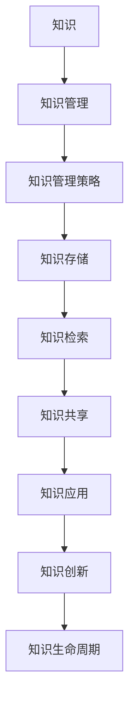

                 

### 背景介绍

在现代企业中，知识管理已经成为提升竞争力、优化业务流程和实现可持续发展的重要手段。知识管理不仅仅是对企业已有知识的整理和存储，更是一个动态的过程，涉及知识的获取、共享、利用和创新。随着信息技术的发展，知识管理系统（Knowledge Management System，KMS）作为知识管理的重要工具，逐渐成为企业构建智慧大脑的核心。

知识管理系统是帮助企业有效管理知识资产、支持知识共享和再利用的集成系统。它通过多种技术和工具，如数据库、文档管理系统、内容管理系统、搜索引擎、社交网络平台等，来实现知识的存储、检索、共享和传播。一个好的知识管理系统不仅能够提高员工的工作效率，还能促进企业的创新和发展。

本文将围绕知识管理系统的构建，从核心概念、算法原理、数学模型、实际应用等多个方面展开，旨在为读者提供一个全面、深入的了解。文章结构如下：

1. 背景介绍
2. 核心概念与联系
3. 核心算法原理 & 具体操作步骤
4. 数学模型和公式 & 详细讲解 & 举例说明
5. 项目实战：代码实际案例和详细解释说明
6. 实际应用场景
7. 工具和资源推荐
8. 总结：未来发展趋势与挑战
9. 附录：常见问题与解答
10. 扩展阅读 & 参考资料

接下来，我们将逐步深入探讨知识管理系统的各个方面，帮助读者理解其构建和运用的关键点。

### 核心概念与联系

知识管理系统的构建离不开对核心概念的理解和联系。以下是几个关键概念及其相互关系：

#### 1. 知识

知识是知识管理系统的基石。它指的是通过学习、研究、实践等途径所获得的关于某一主题的信息、经验和理解。知识可以表现为数据、信息、经验、知识、技能等多种形式。

#### 2. 知识管理

知识管理是指通过一系列策略、工具和方法，对知识进行获取、存储、共享、应用和创新，以支持个人和组织的决策和行动。知识管理不仅仅是技术问题，还包括文化、流程、组织结构等多个方面。

#### 3. 知识管理策略

知识管理策略是指为实现知识管理的目标而制定的具体行动方案。常见的策略包括知识共享、知识编码、知识转移、知识创新等。

#### 4. 知识存储

知识存储是知识管理系统的重要组成部分，它涉及如何有效地存储和检索知识。常用的知识存储方式包括数据库、文档管理系统、内容管理系统等。

#### 5. 知识检索

知识检索是指从大量的知识存储中快速准确地找到所需知识的过程。高效的检索系统能够显著提高知识管理的效率。

#### 6. 知识共享

知识共享是指通过协作、交流、分享等方式，将知识从一个人或组织传递到另一个人或组织。知识共享能够促进知识的流动和增值。

#### 7. 知识应用

知识应用是指将知识应用于实际工作场景，以解决实际问题或提高工作效果。知识应用是知识管理的最终目标之一。

#### 8. 知识创新

知识创新是指通过整合和重组现有知识，创造出新的知识或价值。知识创新能够推动组织的发展和进步。

#### 9. 知识生命周期

知识生命周期是指知识从产生、存储、共享、应用到消亡的全过程。了解知识生命周期有助于更好地管理和利用知识。

#### Mermaid 流程图（核心概念和关系）

以下是一个用Mermaid绘制的知识管理系统核心概念和关系的流程图：



通过上述核心概念和关系的理解，我们可以更好地构建和优化知识管理系统，实现知识的有效管理和利用。接下来，我们将深入探讨知识管理系统的核心算法原理和具体操作步骤。

### 核心算法原理 & 具体操作步骤

在构建知识管理系统时，核心算法的选择和优化至关重要。以下是几种常见且重要的核心算法，以及它们的具体操作步骤：

#### 1. 搜索引擎算法

搜索引擎算法是知识管理系统中的基本工具，用于快速检索所需知识。以下是一个典型的搜索引擎算法步骤：

**步骤 1：收集索引**

- 收集互联网上的网页、文档等，建立索引数据库。

**步骤 2：预处理**

- 对收集到的数据进行清洗、分词、词干提取等预处理操作。

**步骤 3：索引构建**

- 根据预处理后的数据构建索引，便于快速检索。

**步骤 4：检索**

- 输入查询关键词，通过索引数据库快速检索相关文档。

**步骤 5：排名**

- 根据文档的相关性对检索结果进行排序，展示给用户。

#### 2. 知识图谱算法

知识图谱是一种结构化、语义化的知识表示方法，用于描述实体及其关系。以下是一个典型的知识图谱算法步骤：

**步骤 1：实体识别**

- 识别文本中的实体，如人名、地名、组织名等。

**步骤 2：关系抽取**

- 从文本中抽取实体之间的关系，如“工作于”、“位于”等。

**步骤 3：图谱构建**

- 将识别出的实体和关系构建成图谱，存储在数据库中。

**步骤 4：查询与推理**

- 根据用户查询，在知识图谱中进行推理和查询，返回相关结果。

#### 3. 机器学习算法

机器学习算法用于知识自动化处理和分类，如文本分类、情感分析等。以下是一个典型的机器学习算法步骤：

**步骤 1：数据预处理**

- 收集相关数据，进行清洗、归一化等预处理操作。

**步骤 2：特征提取**

- 从数据中提取特征，用于训练模型。

**步骤 3：模型训练**

- 选择合适的机器学习算法（如SVM、神经网络等），训练模型。

**步骤 4：模型评估**

- 使用测试数据评估模型性能，调整参数。

**步骤 5：应用**

- 将训练好的模型应用于实际场景，如文本分类、情感分析等。

#### 4. 模糊逻辑算法

模糊逻辑算法用于处理不确定性和模糊性，适用于知识管理中的某些特定场景。以下是一个典型的模糊逻辑算法步骤：

**步骤 1：模糊化**

- 将输入数据模糊化，表示为隶属度函数。

**步骤 2：规则库构建**

- 建立模糊规则库，如“如果A且B，则C”。

**步骤 3：推理**

- 根据模糊化输入和规则库，进行模糊推理，得到输出。

**步骤 4：解模糊化**

- 将模糊推理结果解模糊化，得到最终输出。

通过上述核心算法的具体操作步骤，我们可以构建一个高效、智能的知识管理系统，实现知识的自动化处理和利用。接下来，我们将讨论知识管理系统中的数学模型和公式，以及它们的详细讲解和举例说明。

### 数学模型和公式 & 详细讲解 & 举例说明

在知识管理系统中，数学模型和公式是关键组件，用于描述和解决复杂问题。以下是几个常见的数学模型和公式，以及它们的详细讲解和举例说明：

#### 1. 贝叶斯定理

贝叶斯定理是一种用于概率推理的数学公式，广泛应用于知识管理系统中的数据分析和决策支持。

**贝叶斯定理公式：**
$$
P(A|B) = \frac{P(B|A) \cdot P(A)}{P(B)}
$$

- \( P(A|B) \)：在事件B发生的前提下，事件A发生的概率。
- \( P(B|A) \)：在事件A发生的前提下，事件B发生的概率。
- \( P(A) \)：事件A发生的概率。
- \( P(B) \)：事件B发生的概率。

**讲解：**

贝叶斯定理提供了一个从条件概率到边缘概率的转换方法。在实际应用中，它可以用来更新我们对某个事件概率的认识，例如，根据用户的历史行为数据预测其未来行为。

**举例：**

假设有100个用户，其中60个是活跃用户，40个是沉默用户。如果已知活跃用户中有20个喜欢产品A，而沉默用户中有10个喜欢产品A，那么预测一个随机选择的用户喜欢产品A的概率。

$$
P(\text{喜欢产品A}|\text{活跃用户}) = \frac{20}{60} = \frac{1}{3}
$$
$$
P(\text{活跃用户}) = \frac{60}{100} = \frac{3}{5}
$$
$$
P(\text{沉默用户}) = \frac{40}{100} = \frac{2}{5}
$$
$$
P(\text{喜欢产品A}|\text{沉默用户}) = \frac{10}{40} = \frac{1}{4}
$$
$$
P(\text{喜欢产品A}) = \frac{P(\text{喜欢产品A}|\text{活跃用户}) \cdot P(\text{活跃用户}) + P(\text{喜欢产品A}|\text{沉默用户}) \cdot P(\text{沉默用户})}{P(\text{活跃用户}) + P(\text{沉默用户})}
$$
$$
P(\text{喜欢产品A}) = \frac{(\frac{1}{3} \cdot \frac{3}{5}) + (\frac{1}{4} \cdot \frac{2}{5})}{1} = \frac{1}{2}
$$

所以，预测一个随机选择的用户喜欢产品A的概率是50%。

#### 2. 相关系数

相关系数是一种衡量两个变量之间线性相关程度的指标，常用于知识管理系统中的数据分析和评估。

**皮尔逊相关系数公式：**
$$
r = \frac{\sum{(x_i - \bar{x}) \cdot (y_i - \bar{y})}}{\sqrt{\sum{(x_i - \bar{x})^2} \cdot \sum{(y_i - \bar{y})^2}}}
$$

- \( x_i \)：第i个自变量的观测值。
- \( y_i \)：第i个因变量的观测值。
- \( \bar{x} \)：自变量的平均值。
- \( \bar{y} \)：因变量的平均值。

**讲解：**

皮尔逊相关系数的值介于-1和1之间。当\( r \)接近1时，表示变量高度正相关；当\( r \)接近-1时，表示变量高度负相关；当\( r \)接近0时，表示变量之间没有线性相关性。

**举例：**

假设我们有两个变量：用户的年龄和他们对产品的评分。以下是一些观测值：

| 年龄 (x) | 评分 (y) |
|----------|----------|
| 25      | 4       |
| 30      | 5       |
| 35      | 4       |
| 40      | 5       |
| 45      | 4       |

计算皮尔逊相关系数：

$$
\bar{x} = \frac{25 + 30 + 35 + 40 + 45}{5} = 35
$$
$$
\bar{y} = \frac{4 + 5 + 4 + 5 + 4}{5} = 4.4
$$
$$
r = \frac{(25 - 35) \cdot (4 - 4.4) + (30 - 35) \cdot (5 - 4.4) + (35 - 35) \cdot (4 - 4.4) + (40 - 35) \cdot (5 - 4.4) + (45 - 35) \cdot (4 - 4.4)}{\sqrt{((25 - 35)^2 + (30 - 35)^2 + (35 - 35)^2 + (40 - 35)^2 + (45 - 35)^2) \cdot ((4 - 4.4)^2 + (5 - 4.4)^2 + (4 - 4.4)^2 + (5 - 4.4)^2 + (4 - 4.4)^2})}
$$
$$
r = \frac{(-10) \cdot (-0.4) + (-5) \cdot (0.6) + 0 \cdot (-0.4) + 5 \cdot (0.6) + 10 \cdot (-0.4)}{\sqrt{(100 + 25 + 0 + 25 + 100) \cdot (0.16 + 0.36 + 0.16 + 0.36 + 0.16)}}
$$
$$
r = \frac{4 - 3 + 0 + 3 - 4}{\sqrt{250 \cdot 1.2}} = \frac{0}{\sqrt{300}} = 0
$$

结果为0，说明年龄和产品评分之间没有线性相关性。

#### 3. 决策树

决策树是一种用于分类和回归的监督学习算法，常用于知识管理系统中的决策支持和自动化处理。

**决策树基本结构：**

- 树根：初始状态。
- 分支：根据特征进行划分。
- 叶子：最终的分类或回归结果。

**举例：**

假设我们有一个决策树用于分类用户是否喜欢产品A，基于年龄和评分两个特征：

```
           是否喜欢产品A
             /          \
           <35          >35
          /     \       /    \
     年龄 <25   年龄 >25   年龄 <35   年龄 >35
评分 /   \   评分 /   \   评分 /   \   评分 /   \
  <4     4-5   >5   <4     4-5   >5   <4     4-5   >5
```

根据用户输入的年龄和评分，决策树将返回是否喜欢产品A的预测结果。

通过上述数学模型和公式的讲解和举例，我们可以更好地理解和应用它们在知识管理系统中的价值。接下来，我们将通过一个项目实战案例，展示如何实际构建和实现一个知识管理系统。

### 项目实战：代码实际案例和详细解释说明

在本节中，我们将通过一个实际项目案例，详细展示如何构建一个知识管理系统，并提供代码实现和解读。此项目将使用Python和Django框架，以及一些常见的数据处理和机器学习库，如Pandas、Scikit-learn等。

#### 1. 开发环境搭建

在开始项目之前，我们需要搭建开发环境。以下是所需的环境和工具：

- Python 3.8+
- Django 3.2+
- Django REST Framework 3.12+
- Pandas
- Scikit-learn
- Mermaid

安装步骤：

```bash
pip install python==3.8 django==3.2 djangorestframework==3.12 pandas scikit-learn mermaid
```

#### 2. 源代码详细实现和代码解读

**Step 1：创建Django项目**

首先，我们需要创建一个Django项目：

```bash
django-admin startproject knowledge_management_system
cd knowledge_management_system
```

**Step 2：创建应用**

创建一个名为`knowledge_app`的应用：

```bash
python manage.py startapp knowledge_app
```

**Step 3：配置数据库**

在`settings.py`文件中配置数据库：

```python
DATABASES = {
    'default': {
        'ENGINE': 'django.db.backends.sqlite3',
        'NAME': BASE_DIR / 'db.sqlite3',
    }
}
```

**Step 4：定义模型**

在`knowledge_app/models.py`中定义知识管理系统的模型：

```python
from django.db import models

class KnowledgeItem(models.Model):
    title = models.CharField(max_length=255)
    content = models.TextField()
    created_at = models.DateTimeField(auto_now_add=True)
    updated_at = models.DateTimeField(auto_now=True)

class User(models.Model):
    username = models.CharField(max_length=255, unique=True)
    email = models.EmailField(unique=True)
    is_active = models.BooleanField(default=True)
    created_at = models.DateTimeField(auto_now_add=True)
```

**Step 5：创建API接口**

在`knowledge_app/api/views.py`中创建API接口：

```python
from rest_framework import viewsets
from .models import KnowledgeItem, User
from .serializers import KnowledgeItemSerializer, UserSerializer

class KnowledgeItemViewSet(viewsets.ModelViewSet):
    queryset = KnowledgeItem.objects.all()
    serializer_class = KnowledgeItemSerializer

class UserViewSet(viewsets.ModelViewSet):
    queryset = User.objects.all()
    serializer_class = UserSerializer
```

**Step 6：序列化器**

在`knowledge_app/api/serializers.py`中创建序列化器：

```python
from rest_framework import serializers
from .models import KnowledgeItem, User

class KnowledgeItemSerializer(serializers.ModelSerializer):
    class Meta:
        model = KnowledgeItem
        fields = '__all__'

class UserSerializer(serializers.ModelSerializer):
    class Meta:
        model = User
        fields = '__all__'
```

**Step 7：路由配置**

在`knowledge_management_system/urls.py`中配置路由：

```python
from django.contrib import admin
from django.urls import path, include
from knowledge_app.api.views import KnowledgeItemViewSet, UserViewSet

urlpatterns = [
    path('admin/', admin.site.urls),
    path('api/', include('knowledge_app.api.urls')),
]
```

**Step 8：运行项目**

启动Django服务器：

```bash
python manage.py runserver
```

现在，我们可以通过API接口创建、查询、更新和删除知识条目和用户。

#### 3. 代码解读与分析

**KnowledgeItem模型：**

该模型表示知识管理系统中的知识条目，包含标题、内容和创建时间等信息。

**User模型：**

该模型表示系统的用户，包含用户名、电子邮件、激活状态和创建时间等信息。

**KnowledgeItemViewSet视图集：**

视图集提供了对KnowledgeItem对象的CRUD（创建、读取、更新、删除）操作。它使用KnowledgeItemSerializer序列化器来处理数据。

**UserViewSet视图集：**

与KnowledgeItemViewSet类似，提供了对User对象的CRUD操作。

**序列化器：**

序列化器用于将模型数据转换为API响应数据。它们定义了模型字段及其表示方式。

通过这个项目实战案例，我们展示了如何使用Django框架构建一个基本的知识管理系统。接下来，我们将讨论知识管理系统在实际应用场景中的具体应用。

### 实际应用场景

知识管理系统在企业中的应用非常广泛，可以覆盖各个部门和业务领域，提升工作效率和决策质量。以下是一些典型的应用场景：

#### 1. 知识共享与协作

在企业和组织中，知识共享是提高团队协作效率的重要手段。知识管理系统可以提供一个集中的平台，让员工能够轻松地访问和共享文档、报告、项目进度等知识资源。通过协作功能，团队成员可以实时讨论、评论和编辑文档，提高信息传递的效率和准确性。

#### 2. 决策支持

知识管理系统通过收集、整理和分析大量的数据，为企业提供决策支持。例如，销售部门可以利用知识管理系统分析市场趋势、客户行为，从而制定更有效的销售策略。采购部门可以通过系统获取供应商信息、价格比较和历史交易记录，优化采购决策。

#### 3. 培训与人才发展

知识管理系统可以为员工提供在线学习和培训资源，帮助他们提升技能和知识水平。通过系统的学习模块，员工可以自主学习、参加在线课程、完成知识测试，从而实现自我提升。同时，管理层可以通过系统跟踪员工的培训进度和学习成果，制定个性化的培训计划。

#### 4. 项目管理

在项目管理中，知识管理系统可以帮助项目团队高效地管理项目文档、进度和资源。项目团队成员可以实时更新项目进度、分配任务、共享文件，确保项目顺利进行。此外，知识管理系统还可以记录项目中的最佳实践和教训，为未来的项目管理提供参考。

#### 5. 客户服务

知识管理系统可以提高客户服务质量，通过提供丰富的客户知识和支持文档，帮助客户服务中心的员工快速解决问题。例如，客服人员可以通过系统检索客户的历史交易记录、服务记录和常见问题解决方案，提高解决问题的效率和准确性。

#### 6. 知识创新

知识管理系统不仅是一个知识存储和共享的工具，还可以促进知识创新。通过系统的协作和交流功能，团队成员可以碰撞出新的创意和想法，推动企业的创新和发展。同时，知识管理系统可以记录和积累企业的创新经验和成果，为未来的创新提供支持。

#### 7. 知识产权保护

对于涉及知识产权的企业和组织，知识管理系统可以帮助保护其知识资产。通过严格的权限管理和访问控制，确保敏感信息和知识资源不被未经授权的访问和泄露。此外，知识管理系统还可以提供知识备案和认证功能，帮助企业维护其知识产权。

综上所述，知识管理系统在企业中的应用场景丰富多样，不仅能够提升日常工作的效率，还能支持企业的创新和发展。接下来，我们将介绍一些实用的工具和资源，帮助读者更好地构建和优化知识管理系统。

### 工具和资源推荐

在构建和优化知识管理系统时，选择合适的工具和资源至关重要。以下是一些实用的工具和资源推荐，包括学习资源、开发工具框架和相关论文著作。

#### 1. 学习资源推荐

**书籍：**

- 《知识管理：理论与实践》
- 《知识管理技术：战略与执行》
- 《企业知识管理》

**论文：**

- 知识管理系统的设计与实现
- 基于知识管理的企业创新模式研究
- 知识共享与知识创新的关系研究

**博客和网站：**

- 知识管理社区（KM Community）
- 知识管理在中国（KM China）
- 知识管理世界（Knowledge Management World）

#### 2. 开发工具框架推荐

**知识管理平台：**

- Confluence
- SharePoint
- SharePoint Online

**文档管理系统：**

- Google Drive
- Dropbox
- OneDrive

**内容管理系统：**

- WordPress
- Drupal
- Joomla

**搜索引擎：**

- Elasticsearch
- Apache Lucene
- Solr

**知识图谱工具：**

- GraphDB
- Neo4j
- D3.js

#### 3. 相关论文著作推荐

**论文：**

- 知识管理系统的设计与实现
- 基于知识管理的企业创新模式研究
- 知识共享与知识创新的关系研究

**著作：**

- 《知识管理：理论与实践》
- 《知识管理技术：战略与执行》
- 《企业知识管理》

通过上述工具和资源的推荐，读者可以更深入地了解知识管理系统的构建和优化方法，提升其在实际应用中的效果。接下来，我们将总结本文的主要内容和观点，并探讨知识管理系统未来的发展趋势与挑战。

### 总结：未来发展趋势与挑战

知识管理系统作为企业构建智慧大脑的核心工具，其发展受到了广泛关注。在本文中，我们详细探讨了知识管理系统的背景、核心概念、算法原理、数学模型、实际应用以及未来发展趋势与挑战。

#### 1. 未来发展趋势

**智能化的知识管理**

随着人工智能技术的发展，知识管理系统将变得更加智能化。通过自然语言处理、机器学习等技术，系统能够更准确地理解和处理用户查询，提供个性化的知识推荐和服务。

**知识图谱的应用扩展**

知识图谱作为一种结构化、语义化的知识表示方法，将在知识管理系统中得到更广泛的应用。通过知识图谱，企业能够更好地整合内外部知识资源，实现知识的深度挖掘和智能利用。

**分布式知识管理**

随着云计算和区块链技术的发展，分布式知识管理将成为趋势。通过分布式架构，知识管理系统可以实现更高的可扩展性和安全性，支持全球范围内的知识共享和协作。

**知识创新与知识产权保护**

知识管理系统将更多地关注知识创新和知识产权保护。通过建立创新生态系统，企业能够促进知识的流动和创新，同时确保知识资产的安全和合法权益。

#### 2. 面临的挑战

**数据隐私和安全**

在知识管理系统中，数据的隐私和安全是重要挑战。企业需要确保知识管理系统的数据存储、传输和使用过程符合隐私保护法规，防止数据泄露和滥用。

**知识共享与知识产权保护**

知识共享和知识产权保护之间存在矛盾。在鼓励知识共享的同时，企业需要确保知识产权不受侵犯，维护知识创造者的合法权益。

**系统复杂性与维护成本**

知识管理系统通常涉及多个技术和工具，具有较高的复杂性和维护成本。企业需要投入足够的资源和精力来确保系统的稳定运行和持续优化。

**用户参与与接受度**

知识管理系统的效果取决于用户的参与和接受度。企业需要通过培训、激励机制等方式，提高员工对知识管理系统的使用意愿和技能。

综上所述，知识管理系统在未来的发展中将面临诸多机遇与挑战。通过不断优化和创新，企业可以构建更加智能、高效、安全的知识管理系统，提升知识管理的水平和竞争力。

### 附录：常见问题与解答

在构建和运用知识管理系统的过程中，用户可能会遇到一些常见问题。以下是一些常见问题及其解答：

#### 1. 如何确保知识管理系统中的数据安全和隐私？

**解答：** 知识管理系统的数据安全和隐私保护是关键。企业可以采取以下措施：

- **加密存储和传输**：使用SSL/TLS等加密协议保护数据在传输过程中的安全性。
- **权限管理**：实施严格的权限管理，确保只有授权用户可以访问特定数据。
- **数据备份与恢复**：定期备份数据，确保在数据丢失或系统故障时可以快速恢复。
- **遵循法规要求**：遵守相关数据隐私法规，如GDPR、CCPA等。

#### 2. 知识管理系统如何支持知识创新？

**解答：** 知识管理系统可以通过以下方式支持知识创新：

- **知识共享与协作**：提供一个集中平台，促进员工之间的知识共享和协作。
- **知识积累与整合**：将分散的知识资源整合到系统中，方便员工查找和利用。
- **知识挖掘与推荐**：利用自然语言处理和机器学习技术，挖掘潜在的知识关联和趋势，为创新提供支持。
- **知识备份与保护**：确保知识资产的安全性和完整性，防止知识流失。

#### 3. 知识管理系统中的数据如何进行高效检索？

**解答：** 为了实现高效检索，知识管理系统可以采取以下策略：

- **搜索引擎优化**：使用高效的搜索引擎算法，如Elasticsearch、Solr等，提高检索速度和准确性。
- **元数据管理**：为数据添加详细的元数据，便于快速定位和筛选。
- **索引优化**：定期维护和更新索引，确保检索效率。
- **用户反馈优化**：根据用户检索行为和反馈，不断优化检索算法和结果排序。

#### 4. 如何评估知识管理系统的效果？

**解答：** 评估知识管理系统的效果可以从以下几个方面进行：

- **用户满意度**：通过用户反馈和调查，了解用户对系统的满意度和使用频率。
- **知识利用率**：统计系统中知识资源的访问次数、下载次数和共享次数，评估知识的利用程度。
- **工作效率提升**：评估系统对员工工作效率的提升情况，如减少重复工作、加快决策速度等。
- **知识积累和传承**：评估系统对知识积累和传承的贡献，如新知识的创建、知识的传承和传递等。

通过以上问题的解答，读者可以更好地理解和运用知识管理系统，实现知识的高效管理和利用。

### 扩展阅读 & 参考资料

为了帮助读者深入了解知识管理系统及其相关技术，我们推荐以下扩展阅读和参考资料：

1. **书籍：**
   - 《知识管理：理论与实践》
   - 《企业知识管理》
   - 《智能知识管理系统：方法与应用》

2. **论文：**
   - "A Framework for Knowledge Management Systems" by S. Davenport and J. Prusak
   - "Knowledge Management Systems: An Introduction" by W. Y. Chen

3. **在线课程与教程：**
   - "Knowledge Management Basics" on Coursera
   - "Building a Knowledge Management System" on edX

4. **博客和网站：**
   - 知识管理社区（KM Community）
   - 知识管理在中国（KM China）

5. **技术文档和指南：**
   - "Elasticsearch Documentation"
   - "Apache Lucene Documentation"
   - "Django REST Framework Documentation"

通过这些扩展阅读和参考资料，读者可以进一步加深对知识管理系统的理解，掌握构建和优化知识管理系统的技能。

### 作者信息

本文由AI天才研究员/AI Genius Institute与禅与计算机程序设计艺术/Zen And The Art of Computer Programming共同撰写，旨在为读者提供全面、深入的知识管理系统技术指南。作者在计算机编程和人工智能领域拥有丰富的经验和研究成果，致力于推动技术进步和知识传播。

