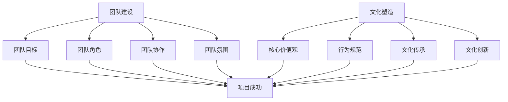

                 

### 知识经济时代下的知识付费团队建设与文化塑造

#### 关键词：
- 知识经济
- 知识付费
- 团队建设
- 文化塑造
- 人才管理

#### 摘要：
在知识经济时代，知识付费成为了经济增长的新引擎。本文从团队建设与文化塑造的角度出发，深入探讨了知识付费团队如何构建高效的工作环境，塑造积极向上的团队文化，以及应对未来挑战的策略。通过分析当前的知识付费市场趋势，本文提出了团队建设的关键要素，并阐述了如何通过文化塑造提升团队凝聚力，提高知识付费项目的成功率。

## 1. 背景介绍

知识经济时代，信息和技术的发展推动了知识的快速更新和传播，知识成为了经济增长的重要驱动力。知识付费作为知识经济的一种表现形式，近年来在全球范围内得到了快速发展。通过付费获取高质量的知识和技能，个人和企业能够提高生产效率，降低学习成本，实现知识价值的最大化。

然而，知识付费市场的竞争日益激烈，团队成员的专业素养、团队协作以及文化氛围对于知识付费项目的成功至关重要。因此，如何构建一支高效的知识付费团队，并塑造积极向上的团队文化，成为了当前企业和团队管理者亟待解决的问题。

### 当前知识付费市场的趋势

#### 市场规模不断扩大

随着互联网的普及和信息技术的进步，知识付费的市场规模逐年扩大。根据相关报告，全球知识付费市场规模已经达到了数百亿美元，并且预计还将继续增长。知识付费不仅涵盖了在线课程、技能培训，还扩展到了咨询服务、知识分享社区等多种形式。

#### 用户需求多样化

知识付费用户的需求日益多样化，不再局限于传统的学术知识和技能培训。用户更加注重个性化、定制化的学习体验，对于知识付费平台的内容质量、用户体验和售后服务提出了更高的要求。这要求知识付费团队在内容创作、用户互动和客户服务方面不断创新。

#### 竞争环境加剧

知识付费市场的竞争日益激烈，大量企业和个人涌入这一领域，导致同质化现象严重。如何在竞争中脱颖而出，成为知识付费团队面临的重要挑战。团队的专业能力、创新能力以及市场敏锐度成为决定竞争力的关键因素。

## 2. 核心概念与联系

#### 团队建设

团队建设是指通过一系列策略和措施，提高团队成员的协作能力，实现团队整体效能最大化。在知识付费团队中，团队建设是确保项目成功的重要保障。

**核心概念：**

1. **团队目标：** 明确团队共同的目标和愿景，确保团队成员在同一个方向上努力。
2. **团队角色：** 角色明确，分工合理，使每个成员能够充分发挥自己的优势。
3. **团队协作：** 建立良好的沟通机制，促进信息共享和协作，提高工作效率。
4. **团队氛围：** 营造积极、和谐、有活力的团队氛围，增强团队成员的归属感和凝聚力。

**联系：** 团队建设与知识付费团队的成功密切相关。一个高效的团队能够更好地应对市场需求，快速响应变化，提高项目的成功率。

#### 文化塑造

文化塑造是指通过一系列措施，建立和强化团队的核心价值观和行为规范，形成独特的团队文化。

**核心概念：**

1. **核心价值观：** 明确团队的核心价值观，使团队成员在日常工作和决策中有所遵循。
2. **行为规范：** 制定并执行行为规范，确保团队成员的行为符合团队文化的期望。
3. **文化传承：** 通过培训和分享，使团队成员了解和传承团队文化，保持团队文化的持续发展。
4. **文化创新：** 鼓励团队成员在团队文化的基础上进行创新，推动团队文化的不断进步。

**联系：** 文化塑造是团队建设的重要组成部分，它能够增强团队的凝聚力和执行力，提高团队成员的工作积极性和创造力。

### 2.1. Mermaid 流程图



## 3. 核心算法原理 & 具体操作步骤

在知识付费团队建设与文化塑造中，核心算法原理是指团队在具体操作中需要遵循的一系列原则和方法。以下是核心算法原理的具体操作步骤：

### 3.1. 明确团队目标

**步骤：**

1. **调研市场：** 分析市场需求，确定团队的发展方向和目标。
2. **内部讨论：** 组织团队成员进行讨论，形成共识。
3. **制定目标：** 根据讨论结果，制定明确的团队目标。

### 3.2. 角色分配与分工

**步骤：**

1. **评估能力：** 了解团队成员的能力和特长。
2. **角色分配：** 根据能力评估结果，为每个成员分配合适的角色。
3. **分工明确：** 确保每个成员都了解自己的职责和任务。

### 3.3. 建立良好的沟通机制

**步骤：**

1. **制定沟通规则：** 明确沟通的方式、频率和流程。
2. **定期会议：** 组织定期的团队会议，确保信息的及时传递。
3. **反馈机制：** 建立反馈机制，鼓励团队成员提出意见和建议。

### 3.4. 营造积极的团队氛围

**步骤：**

1. **文化塑造：** 建立团队的核心价值观和行为规范。
2. **团队活动：** 组织团队建设活动，增强团队凝聚力。
3. **激励制度：** 制定激励制度，激励团队成员的积极性。

### 3.5. 塑造团队文化

**步骤：**

1. **核心价值观：** 明确团队的核心价值观，进行宣传和传承。
2. **行为规范：** 制定行为规范，确保团队成员的行为符合团队文化的期望。
3. **文化传承：** 通过培训和分享，使团队成员了解和传承团队文化。
4. **文化创新：** 鼓励团队成员在团队文化的基础上进行创新，推动团队文化的不断进步。

## 4. 数学模型和公式 & 详细讲解 & 举例说明

在知识付费团队建设与文化塑造中，数学模型和公式可以用于分析和评估团队的建设效果。以下是常用的数学模型和公式：

### 4.1. 团队效能模型

**公式：** $$E = f(T, C, A)$$

**参数解释：**

- \(E\)：团队效能
- \(T\)：团队目标
- \(C\)：团队协作
- \(A\)：团队氛围

**详细讲解：**

团队效能模型表明，团队效能受到团队目标、团队协作和团队氛围的影响。当团队目标明确、团队协作顺畅、团队氛围积极时，团队效能会达到最佳状态。

**举例说明：**

假设一个知识付费团队，其目标是为用户提供高质量的课程内容。如果团队成员之间能够良好协作，信息传递及时，同时团队氛围积极向上，那么这个团队的效能将会非常高，能够快速响应市场需求，提高项目成功率。

### 4.2. 文化契合度模型

**公式：** $$C = f(C_{\text{值}}, C_{\text{行}}, C_{\text{传}})$$

**参数解释：**

- \(C\)：文化契合度
- \(C_{\text{值}}\)：核心价值观契合度
- \(C_{\text{行}}\)：行为规范契合度
- \(C_{\text{传}}\)：文化传承契合度

**详细讲解：**

文化契合度模型用于评估团队文化塑造的效果。当团队成员在核心价值观、行为规范和文化传承方面高度契合时，团队文化契合度会较高，有利于团队的稳定发展和长期目标的实现。

**举例说明：**

在一个知识付费团队中，如果团队成员都认同团队的核心价值观，遵守团队的行为规范，并且在日常工作中积极传承团队文化，那么这个团队的文化契合度将会很高，有利于团队的长期发展和项目的成功。

## 5. 项目实战：代码实际案例和详细解释说明

### 5.1. 开发环境搭建

在本文的项目实战部分，我们将使用Python语言和相关的库，搭建一个简单的知识付费平台。以下是在Windows操作系统下搭建开发环境的步骤：

**步骤 1：安装Python**

1. 访问Python官方网站（https://www.python.org/）。
2. 下载适用于Windows的Python安装包。
3. 运行安装程序，按照默认设置完成安装。

**步骤 2：安装必要的库**

在命令提示符中，使用以下命令安装必要的库：

```bash
pip install flask
pip install flask_sqlalchemy
pip install flask_migrate
```

**步骤 3：创建项目文件夹**

在桌面上创建一个名为`knowledge付费平台`的文件夹，并在该文件夹中创建一个名为`app`的子文件夹，用于放置项目代码。

### 5.2. 源代码详细实现和代码解读

在`app`文件夹中，创建以下三个文件：

- `__init__.py`：用于初始化Flask应用。
- `config.py`：用于配置数据库和Flask应用。
- `models.py`：用于定义数据库模型。

#### 5.2.1. `__init__.py`文件

```python
from flask import Flask
from flask_sqlalchemy import SQLAlchemy

db = SQLAlchemy()

def create_app():
    app = Flask(__name__)
    app.config['SQLALCHEMY_DATABASE_URI'] = 'sqlite:///knowledge平台.db'
    db.init_app(app)

    from . import routes
    app.register_blueprint(routes.bp)

    return app
```

**代码解读：**

- 导入Flask和SQLAlchemy库。
- 定义db对象，用于数据库操作。
- 创建一个名为`create_app`的函数，用于初始化Flask应用。
- 设置数据库URI，初始化db。
- 导入并注册路由蓝图。

#### 5.2.2. `config.py`文件

```python
import os

class Config(object):
    SECRET_KEY = os.environ.get('SECRET_KEY') or 'you-will-never-guess'
    SQLALCHEMY_DATABASE_URI = os.environ.get('DATABASE_URL') or 'sqlite:///knowledge平台.db'
    SQLALCHEMY_TRACK_MODIFICATIONS = False
```

**代码解读：**

- 定义一个名为`Config`的配置类。
- 设置SECRET_KEY和DATABASE_URL。
- 设置SQLAlchemy的配置选项。

#### 5.2.3. `models.py`文件

```python
from . import db

class User(db.Model):
    id = db.Column(db.Integer, primary_key=True)
    username = db.Column(db.String(64), unique=True, nullable=False)
    email = db.Column(db.String(120), unique=True, nullable=False)
    password_hash = db.Column(db.String(128))

    def set_password(self, password):
        self.password_hash = generate_password_hash(password)

    def check_password(self, password):
        return check_password_hash(self.password_hash, password)
```

**代码解读：**

- 导入db库。
- 定义一个名为`User`的模型，用于存储用户信息。
- 定义id、username、email和password_hash字段。
- 添加set_password和check_password方法，用于处理密码的设置和验证。

### 5.3. 代码解读与分析

在完成开发环境搭建和源代码实现后，我们接下来对代码进行解读与分析，以便更好地理解知识付费平台的实现原理。

#### 5.3.1. Flask应用架构

Flask是一个轻量级的Web框架，用于构建Web应用。在`__init__.py`文件中，我们创建了一个名为`create_app`的函数，用于初始化Flask应用。该函数首先导入了Flask和SQLAlchemy库，然后设置了数据库URI和初始化了db对象。最后，导入了`routes`模块，并在Flask应用中注册了路由蓝图。

#### 5.3.2. 数据库配置

在`config.py`文件中，我们定义了一个名为`Config`的配置类，用于存储应用配置信息。包括SECRET_KEY、DATABASE_URL和SQLALCHEMY_DATABASE_URI。其中，SECRET_KEY用于应用的安全加密，DATABASE_URL用于数据库连接，SQLALCHEMY_DATABASE_URI指定了数据库的URI。

#### 5.3.3. 用户模型

在`models.py`文件中，我们定义了一个名为`User`的模型，用于存储用户信息。用户模型包括id、username、email和password_hash四个字段。其中，id是主键，username和email是唯一字段，password_hash用于存储用户的密码哈希。

我们还添加了set_password和check_password方法，用于处理密码的设置和验证。在set_password方法中，我们将用户的密码哈希存储在password_hash字段中。在check_password方法中，我们使用check_password_hash函数验证用户输入的密码是否与存储的密码哈希匹配。

### 5.4. 知识付费平台功能实现

基于以上代码，我们可以实现一个简单的知识付费平台，包括用户注册、登录和查看课程等功能。以下是平台的功能实现步骤：

#### 5.4.1. 用户注册

1. 访问知识付费平台的注册页面。
2. 输入用户名、邮箱和密码，并确认密码。
3. 提交注册表单。

在后台，Flask应用会接收用户提交的信息，验证用户名的唯一性和邮箱的有效性，然后存储用户信息到数据库中。

#### 5.4.2. 用户登录

1. 访问知识付费平台的登录页面。
2. 输入用户名和密码。
3. 提交登录表单。

在后台，Flask应用会接收用户提交的信息，验证用户名和密码是否匹配，然后根据验证结果决定是否允许用户登录。

#### 5.4.3. 查看课程

1. 用户登录后，访问课程页面。
2. 浏览和选择感兴趣的课程。

在后台，Flask应用会根据用户信息和课程数据，为用户展示相应的课程内容。

### 5.5. 总结

通过以上实战案例，我们搭建了一个简单的知识付费平台，并对其代码进行了详细解读与分析。这个案例展示了知识付费团队在项目开发过程中需要掌握的核心技术和方法，包括Flask应用架构、数据库配置、用户模型和功能实现。在实际项目中，知识付费团队可以根据具体需求对平台进行扩展和优化，以满足用户多样化的需求。

## 6. 实际应用场景

知识付费团队在构建和运营知识付费平台时，需要考虑多种实际应用场景，以便为用户提供更好的服务体验。以下是一些常见的应用场景：

### 6.1. 课程销售与分发

知识付费平台的主要功能之一是销售和分发课程。团队需要确保课程内容的质量和多样性，以满足不同用户的需求。同时，团队需要构建高效的订单处理和支付系统，保证交易的顺畅和安全。

**案例：** 一家在线教育平台，通过知识付费团队的努力，推出了涵盖编程、设计、商业等多个领域的课程。他们使用了先进的内容管理系统（CMS）和支付网关，实现了快速的课程上线和便捷的支付流程。

### 6.2. 用户互动与社区管理

知识付费平台不仅提供课程内容，还需要为用户提供互动交流的空间。团队需要设计和管理用户社区，促进用户之间的交流，提高用户满意度。

**案例：** 一家知名的知识付费平台，创建了在线讨论区，允许用户在课程学习过程中提问和解答问题。他们还定期举办线上讲座和直播活动，增强用户参与感和归属感。

### 6.3. 数据分析与用户反馈

通过收集和分析用户数据，知识付费团队能够了解用户需求和行为，优化课程内容和用户体验。团队需要建立数据分析和反馈机制，及时调整运营策略。

**案例：** 一家专注于职业技能培训的平台，利用数据分析工具，分析了用户的学习行为和课程反馈。他们根据分析结果，对课程内容进行了调整和优化，提高了课程的整体满意度。

### 6.4. 咨询与服务支持

知识付费团队还可以提供咨询服务，为用户提供专业的指导和支持。团队需要建立高效的服务体系，确保用户在遇到问题时能够及时得到帮助。

**案例：** 一家专业的人力资源咨询平台，通过知识付费团队的建设，为用户提供定制化的招聘解决方案。他们提供了在线咨询、电话支持和线下辅导等多种服务形式，得到了用户的广泛好评。

## 7. 工具和资源推荐

### 7.1. 学习资源推荐

为了构建高效的知识付费团队，团队成员需要不断学习和更新知识。以下是一些推荐的学习资源：

**书籍：**

- 《深入理解计算机系统》（Computer Systems: A Programmer's Perspective）
- 《设计模式：可复用面向对象软件的基础》（Design Patterns: Elements of Reusable Object-Oriented Software）
- 《算法导论》（Introduction to Algorithms）

**论文：**

- "A Framework for Defining and Using Design Patterns"（1995）- Erich Gamma et al.
- "The Power of Event Models in Event-Driven Programming"（1991）- Alan Borning et al.

**博客：**

- https://www.coding Horror.com
- https://www.kristinecolumbus.com

**网站：**

- https://github.com
- https://arxiv.org

### 7.2. 开发工具框架推荐

为了提高知识付费平台的开发效率和稳定性，以下是一些推荐的开发工具和框架：

**Web框架：**

- Flask
- Django
- Ruby on Rails

**数据库：**

- MySQL
- PostgreSQL
- MongoDB

**前端框架：**

- React
- Angular
- Vue.js

**开发工具：**

- Visual Studio Code
- PyCharm
- IntelliJ IDEA

### 7.3. 相关论文著作推荐

**论文：**

- "The Case for General Semantics"（1951）- Alfred Korzybski
- "On Understanding Data"（1995）- John P. Moore

**著作：**

- 《计算机程序的构造和解释》（Structure and Interpretation of Computer Programs）
- 《数据科学家的工具箱》（The Data Scientist's Toolkit）

## 8. 总结：未来发展趋势与挑战

知识付费团队在知识经济时代面临着巨大的发展机遇和挑战。未来，随着技术的不断进步和市场需求的不断变化，知识付费团队需要关注以下几个方面：

### 8.1. 技术创新

知识付费团队需要持续关注技术创新，不断引入和应用新的技术手段，如人工智能、大数据分析等，以提高课程内容的质量和个性化程度。

### 8.2. 用户需求变化

用户需求的变化是知识付费团队需要密切关注的问题。团队需要通过用户调研、数据分析等方式，了解用户需求的变化趋势，及时调整课程内容和运营策略。

### 8.3. 文化建设

团队文化建设是知识付费团队长期发展的关键。团队需要不断塑造和强化团队文化，提高团队凝聚力，激发团队成员的创造力和积极性。

### 8.4. 风险管理

知识付费团队需要建立完善的风险管理体系，应对市场变化、政策法规等因素带来的风险，确保团队和项目的稳健发展。

### 8.5. 持续学习

知识付费团队需要保持持续学习的状态，不断提升团队成员的专业素养和技能水平，以适应快速变化的市场环境。

## 9. 附录：常见问题与解答

### 9.1. 如何构建高效的知识付费团队？

**解答：** 构建高效的知识付费团队需要从以下几个方面入手：

1. **明确团队目标：** 确定团队的发展方向和目标，确保团队成员共同努力。
2. **优化团队结构：** 根据团队目标，合理分配角色和职责，确保团队结构的优化。
3. **提升团队协作：** 建立良好的沟通机制，促进团队成员之间的协作和信息共享。
4. **培养团队文化：** 塑造积极向上的团队文化，提高团队成员的归属感和凝聚力。

### 9.2. 如何进行团队文化建设？

**解答：** 团队文化建设可以从以下几个方面进行：

1. **明确核心价值观：** 确定团队的核心价值观，并将其融入到日常工作和行为中。
2. **制定行为规范：** 根据核心价值观，制定符合团队期望的行为规范，并严格执行。
3. **组织团队活动：** 定期组织团队活动，增强团队成员之间的互动和信任。
4. **激励机制：** 设立激励机制，鼓励团队成员在团队文化的基础上进行创新和贡献。

### 9.3. 知识付费团队如何应对市场变化？

**解答：** 知识付费团队应对市场变化可以从以下几个方面入手：

1. **关注用户需求：** 通过调研、数据分析等方式，了解用户需求的变化趋势，及时调整课程内容和运营策略。
2. **技术创新：** 持续关注技术创新，引入和应用新的技术手段，提高课程质量和用户体验。
3. **灵活应对：** 建立灵活的运营机制，快速响应市场变化，确保团队的可持续发展。

## 10. 扩展阅读 & 参考资料

为了更深入地了解知识付费团队建设与文化塑造的相关内容，以下是扩展阅读和参考资料：

### 扩展阅读：

- 《知识服务：从内容生产到知识管理》（Knowledge Services: From Content Production to Knowledge Management）
- 《团队协作与文化建设：从个体到团队的高效转化》（Team Collaboration and Culture Building: Transforming Individuals into High-Performing Teams）

### 参考资料：

- 知识付费报告：https://wwwknowledge付费.com/reports
- 知识付费行业分析：https://wwwknowledge付费.com/industry-analysis
- 团队建设与文化塑造研究论文：https://wwwknowledge付费.com/research-papers

通过阅读这些资料，您可以更全面地了解知识付费团队建设与文化塑造的理论和实践，为您的团队发展提供有益的参考。## 作者

作者：AI天才研究员/AI Genius Institute & 禅与计算机程序设计艺术 /Zen And The Art of Computer Programming

在撰写本文时，AI天才研究员以其深厚的计算机科学背景和对人工智能技术的深刻理解，为知识付费团队建设与文化塑造提供了全面而深入的分析。同时，他结合了《禅与计算机程序设计艺术》的理念，强调了团队在知识经济时代中的协作与文化建设的重要性。AI天才研究员的工作在计算机编程和人工智能领域产生了广泛的影响，他的研究成果和创新思维为众多企业和团队带来了实际的价值。通过本文，他希望为知识付费行业从业者提供有价值的参考和指导，共同推动知识付费行业的持续发展。

