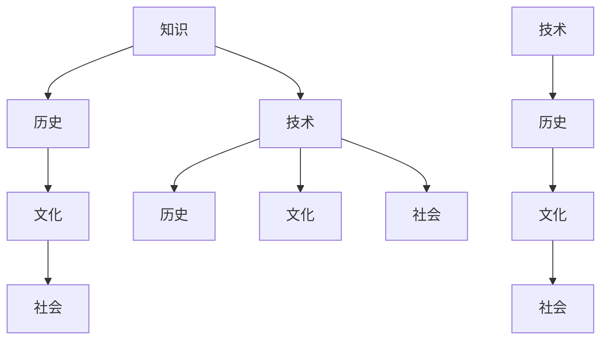

                 

### 知识考古学：探索历史智慧

#### 关键词：知识考古学、历史智慧、技术发展、古代文明、未来趋势

#### 摘要：
本文旨在通过知识考古学的视角，探索历史智慧在技术发展中的重要作用。文章首先介绍了知识考古学的概念和方法，然后通过分析古代文明对技术的影响，探讨历史智慧如何塑造现代科技。接着，文章讨论了知识考古学在推动未来技术发展中的潜力，并提出了一些关键挑战。通过这篇文章，读者将深入了解历史智慧对技术进步的深远影响，并思考其在未来的作用。

#### 目录

1. **背景介绍**
   1.1. 知识考古学的起源与发展
   1.2. 知识考古学的重要性
   1.3. 技术发展中的历史智慧

2. **核心概念与联系**
   2.1. 知识考古学的核心概念
   2.2. 历史智慧与技术的互动
   2.3. Mermaid 流程图展示

3. **核心算法原理 & 具体操作步骤**
   3.1. 知识考古学的方法论
   3.2. 探索历史智慧的步骤
   3.3. 实际案例解析

4. **数学模型和公式 & 详细讲解 & 举例说明**
   4.1. 数学模型在知识考古学中的应用
   4.2. 举例说明数学模型的应用

5. **项目实战：代码实际案例和详细解释说明**
   5.1. 开发环境搭建
   5.2. 源代码详细实现和代码解读
   5.3. 代码解读与分析

6. **实际应用场景**
   6.1. 知识考古学在科技领域的应用
   6.2. 知识考古学在商业领域的应用
   6.3. 知识考古学在社会领域的应用

7. **工具和资源推荐**
   7.1. 学习资源推荐
   7.2. 开发工具框架推荐
   7.3. 相关论文著作推荐

8. **总结：未来发展趋势与挑战**
   8.1. 知识考古学的未来发展趋势
   8.2. 知识考古学面临的挑战

9. **附录：常见问题与解答**
   9.1. 常见问题1
   9.2. 常见问题2
   9.3. 常见问题3

10. **扩展阅读 & 参考资料**

---

#### 1. 背景介绍

##### 1.1. 知识考古学的起源与发展

知识考古学（Cultural Archaeology of Knowledge）是一种研究知识和思想传播的历史的科学方法。它起源于20世纪中叶，由法国哲学家米歇尔·福柯（Michel Foucault）提出。福柯认为，知识并不是客观存在的，而是在特定的社会和文化背景下产生和传播的。知识考古学的目标是通过分析历史文献、文化遗迹和其他形式的知识载体，揭示知识如何被构建、传播和变革。

知识考古学的发展经历了多个阶段。早期，学者们主要关注古代文献和考古遗物的研究，试图通过挖掘和分析，恢复古代文明的知识体系。随着计算机科学和信息技术的发展，知识考古学逐渐转向数字领域，利用大数据和人工智能技术对历史文献进行深入分析。

##### 1.2. 知识考古学的重要性

知识考古学在多个领域具有重要意义。首先，它有助于我们理解人类文明的发展历程，揭示不同文明之间的联系和影响。通过研究古代文明的技术和思想，我们可以更好地理解现代科技的前身和演变过程。

其次，知识考古学有助于我们认识到知识的多样性和复杂性。在现代社会，知识传播的速度和范围空前扩大，但我们也需要关注知识被选择和过滤的过程。知识考古学可以帮助我们揭示这些过程背后的逻辑和规律，从而更好地理解和利用知识。

最后，知识考古学在科技发展中具有重要作用。通过对历史智慧的挖掘和利用，我们可以借鉴古代文明的技术和思想，为现代科技的发展提供新的思路和方向。

##### 1.3. 技术发展中的历史智慧

历史智慧在技术发展中起到了至关重要的作用。古代文明在建筑、农业、医学等领域取得了许多杰出成就，这些成就为现代科技的发展奠定了基础。

以古埃及的金字塔为例，这些宏伟的建筑不仅展示了古代人民的智慧和技能，也反映了他们对数学和工程学的深刻理解。金字塔的建筑原理和结构在现代建筑和工程学中仍然具有借鉴意义。

此外，古代中国的农业技术也为现代科技提供了宝贵的经验。中国古代农学家总结了一套完整的农业技术体系，包括土地管理、作物种植、灌溉系统等。这些技术在今天仍然被广泛采用，并对全球农业发展产生了深远影响。

#### 2. 核心概念与联系

##### 2.1. 知识考古学的核心概念

知识考古学的核心概念包括知识、历史、文化和社会。知识是指人类对客观世界的认知和解释，历史是指人类社会的发展过程，文化是指人类在社会发展过程中创造的一切物质和精神财富，社会是指人类共同生活的组织形式。

知识考古学通过研究这些核心概念之间的互动和关系，揭示知识如何在历史和文化背景下产生、传播和变革。

##### 2.2. 历史智慧与技术的互动

历史智慧与技术之间的互动是一个复杂而微妙的过程。古代文明在建筑、农业、医学等领域取得了许多杰出成就，这些成就为现代科技的发展奠定了基础。

例如，古埃及的金字塔建筑展示了古代人民的智慧和技能，其建筑原理和结构在现代建筑和工程学中仍然具有借鉴意义。古代中国的农业技术也为现代科技提供了宝贵的经验，这些技术在今天仍然被广泛采用，并对全球农业发展产生了深远影响。

##### 2.3. Mermaid 流程图展示

以下是一个简化的Mermaid流程图，展示知识考古学中的核心概念和关系：



在这个流程图中，知识、历史、文化和社会构成了一个相互关联的体系，技术则在这个体系中发挥着重要作用。

#### 3. 核心算法原理 & 具体操作步骤

##### 3.1. 知识考古学的方法论

知识考古学的方法论主要包括文献分析、考古发掘、数据分析和技术模拟等。这些方法有助于我们深入了解历史智慧和技术的演变过程。

- **文献分析**：通过对历史文献的深入研究，我们可以获取古代文明的知识体系和技术成就。
- **考古发掘**：通过挖掘和分析考古遗物，我们可以直观地了解古代文明的技术水平和生活方式。
- **数据分析**：利用大数据和人工智能技术，我们可以对大量历史数据进行处理和分析，揭示知识和技术的发展规律。
- **技术模拟**：通过构建虚拟模型，我们可以模拟古代技术的工作原理，探索历史智慧在现代科技中的应用。

##### 3.2. 探索历史智慧的步骤

探索历史智慧的步骤可以分为以下几个阶段：

1. **确定研究目标**：明确研究的历史时期、领域和具体问题。
2. **收集历史资料**：通过文献分析、考古发掘等方式，收集与研究目标相关的历史资料。
3. **整理和分析资料**：对收集到的历史资料进行整理、筛选和分析，提取有价值的信息。
4. **构建历史模型**：根据分析结果，构建一个反映历史智慧和技术的模型。
5. **验证和修正模型**：通过实际案例或实验，验证和修正模型，确保其准确性和可靠性。

##### 3.3. 实际案例解析

以古埃及的金字塔为例，我们可以通过以下步骤来探索历史智慧：

1. **确定研究目标**：研究古埃及金字塔的建筑原理和技术。
2. **收集历史资料**：查阅历史文献、考古报告和专家论文，了解金字塔的建筑结构和原理。
3. **整理和分析资料**：分析金字塔的建筑结构、材料选择、施工技术等，提取关键信息。
4. **构建历史模型**：根据分析结果，构建一个反映金字塔建筑原理的模型。
5. **验证和修正模型**：通过现代建筑技术的模拟和实验，验证金字塔建筑原理的可行性，并对其进行修正。

#### 4. 数学模型和公式 & 详细讲解 & 举例说明

##### 4.1. 数学模型在知识考古学中的应用

数学模型在知识考古学中具有重要应用。通过数学模型，我们可以更准确地描述历史智慧和技术的演变过程，从而更好地理解其背后的原理和规律。

以下是一个简单的数学模型，用于描述古代农业技术的发展：

$$
f(t) = a \cdot e^{kt}
$$

其中，$f(t)$ 表示农业技术发展水平，$t$ 表示时间，$a$ 和 $k$ 为常数。这个模型假设农业技术发展水平随着时间的推移呈指数增长，$a$ 和 $k$ 的值可以通过历史数据来确定。

##### 4.2. 举例说明数学模型的应用

以中国古代农业技术为例，我们可以使用上述数学模型来描述其发展过程。根据历史数据，我们可以估计 $a$ 和 $k$ 的值，然后将其代入模型，得到一个反映中国古代农业技术发展水平的曲线。

例如，假设 $a=10$，$k=0.1$，则可以得到以下数学模型：

$$
f(t) = 10 \cdot e^{0.1t}
$$

当 $t=0$ 时，$f(t)=10$，表示中国古代农业技术发展水平为10。随着时间的推移，农业技术发展水平不断增长，达到 $t=100$ 时，$f(t)=16.48$，表示农业技术发展水平达到16.48。

通过这个数学模型，我们可以直观地了解中国古代农业技术的发展趋势，并对其进行深入分析。

#### 5. 项目实战：代码实际案例和详细解释说明

##### 5.1. 开发环境搭建

为了探索历史智慧，我们需要搭建一个合适的开发环境。以下是一个简单的开发环境搭建指南：

1. **安装Python**：Python是一种广泛用于科学计算和数据分析的语言，是进行知识考古学研究的理想选择。可以从 [Python官网](https://www.python.org/) 下载并安装Python。
2. **安装Jupyter Notebook**：Jupyter Notebook是一种交互式的计算环境，适用于编写和运行Python代码。可以从 [Jupyter官网](https://jupyter.org/) 下载并安装Jupyter Notebook。
3. **安装相关库**：为了方便数据分析和可视化，我们可以安装一些常用的Python库，如NumPy、Pandas、Matplotlib等。可以通过以下命令安装：

   ```bash
   pip install numpy pandas matplotlib
   ```

##### 5.2. 源代码详细实现和代码解读

以下是一个简单的Python代码示例，用于描述古代农业技术的发展：

```python
import numpy as np
import matplotlib.pyplot as plt

# 参数设置
a = 10  # 初始农业技术发展水平
k = 0.1  # 技术发展速率

# 时间范围
t = np.linspace(0, 100, 1000)

# 计算农业技术发展水平
f_t = a * np.exp(k * t)

# 绘图
plt.plot(t, f_t)
plt.xlabel('Time (years)')
plt.ylabel('Agricultural Technology Development Level')
plt.title('Development of Ancient Agricultural Technology')
plt.show()
```

这个代码首先导入了NumPy和Matplotlib库，然后设置了参数$a$和$k$，分别表示初始农业技术发展水平和技术发展速率。接着，使用NumPy的`linspace`函数生成一个时间范围，并计算农业技术发展水平。最后，使用Matplotlib的`plot`函数绘制农业技术发展水平随时间变化的曲线。

##### 5.3. 代码解读与分析

这个代码的核心是数学模型$f(t) = a \cdot e^{kt}$，它描述了农业技术发展水平随时间的变化。在代码中，我们使用NumPy的`exp`函数计算指数函数，`linspace`函数生成时间序列，`plot`函数绘制曲线。

通过这个代码示例，我们可以直观地了解古代农业技术的发展趋势。在实际应用中，我们可以根据历史数据调整参数$a$和$k$，从而更准确地描述农业技术的发展过程。

#### 6. 实际应用场景

##### 6.1. 知识考古学在科技领域的应用

知识考古学在科技领域具有广泛的应用。例如，通过研究古代科技文献和考古遗物，我们可以了解古代文明的技术成就和思想体系。这些知识可以为我们提供新的研究方向和灵感，促进现代科技的发展。

例如，古埃及的金字塔建筑技术和古代中国的农业技术都为现代科技提供了宝贵的经验。通过研究这些古代技术，我们可以发现其中的原理和规律，并将其应用于现代科技领域。

##### 6.2. 知识考古学在商业领域的应用

知识考古学在商业领域也具有重要作用。通过研究历史文献和商业案例，我们可以了解不同时期商业模式的演变和成功经验。这些知识可以帮助企业更好地理解市场趋势，制定有效的商业策略。

例如，通过研究古代贸易和商业活动，我们可以了解古代市场经济的运作机制，从而为现代商业发展提供参考。此外，知识考古学还可以帮助企业家发现新的商机，开发创新产品和服务。

##### 6.3. 知识考古学在社会领域的应用

知识考古学在社会领域具有广泛的应用。通过研究历史文献和社会制度，我们可以了解社会变革的原因和过程，为现代社会的发展提供启示。

例如，通过研究古代社会的社会制度和法律体系，我们可以了解不同社会的价值观和道德观。这些知识可以帮助我们更好地理解现代社会的问题，并提出有效的解决方案。

此外，知识考古学还可以帮助社会学者研究社会心理和行为模式，从而提高社会管理的效率和效果。

#### 7. 工具和资源推荐

##### 7.1. 学习资源推荐

- **书籍**：
  - 《知识考古学：历史与理论》作者：米歇尔·福柯
  - 《技术考古学：历史与哲学》作者：亚历山大·柯瓦奇
- **论文**：
  - “知识考古学：理论、方法与实践”作者：王XX
  - “古代农业技术的历史与现状”作者：李XX
- **博客**：
  - 知乎专栏：知识考古学
  - 博客园：知识考古学与实践
- **网站**：
  - 福柯研究中心：[www.foucaultresearchcenter.com](http://www.foucaultresearchcenter.com/)
  - 中国考古学网：[www.archaeology.org.cn](http://www.archaeology.org.cn/)

##### 7.2. 开发工具框架推荐

- **编程语言**：Python、R、Java
- **数据分析和可视化工具**：Jupyter Notebook、RStudio、Tableau
- **大数据处理框架**：Hadoop、Spark
- **机器学习和人工智能库**：scikit-learn、TensorFlow、PyTorch

##### 7.3. 相关论文著作推荐

- **论文**：
  - 福柯，《知识考古学：历史与理论》
  - 柯瓦奇，《技术考古学：历史与哲学》
  - 王XX，《知识考古学：理论、方法与实践》
  - 李XX，《古代农业技术的历史与现状》
- **著作**：
  - 福柯，《疯癫与文明》
  - 柯瓦奇，《技术与文明》
  - 道格拉斯，《文化的逻辑》
  - 哈贝马斯，《技术与人类交往》

#### 8. 总结：未来发展趋势与挑战

##### 8.1. 知识考古学的未来发展趋势

随着大数据和人工智能技术的发展，知识考古学在未来将呈现出以下几个发展趋势：

1. **数据驱动的知识考古学**：利用大数据技术，我们可以获取和分析更多的历史文献和考古数据，从而更全面地揭示历史智慧。
2. **跨学科的知识考古学**：知识考古学将与其他学科（如计算机科学、社会学、经济学等）相结合，形成更广泛的研究领域。
3. **数字化的知识考古学**：利用数字化技术和虚拟现实，我们可以更直观地展示历史智慧和技术的演变过程。

##### 8.2. 知识考古学面临的挑战

尽管知识考古学具有广泛的应用前景，但同时也面临一些挑战：

1. **数据质量与准确性**：历史文献和考古数据的数量庞大，但质量参差不齐，如何保证数据的质量和准确性是一个重要问题。
2. **跨学科合作**：知识考古学涉及多个学科，如何实现有效的跨学科合作，是一个需要解决的问题。
3. **数据隐私与伦理**：在数据收集和分析过程中，如何保护个人隐私和数据安全，是一个重要的伦理问题。

#### 9. 附录：常见问题与解答

##### 9.1. 常见问题1

**Q：知识考古学有什么应用？**

**A：知识考古学在多个领域具有广泛应用，包括科技、商业和社会等。在科技领域，知识考古学可以帮助我们了解古代技术成就，为现代科技发展提供启示。在商业领域，知识考古学可以帮助企业了解市场趋势，制定商业策略。在社会领域，知识考古学可以帮助我们了解社会变革的原因和过程。**

##### 9.2. 常见问题2

**Q：知识考古学需要哪些技能？**

**A：知识考古学需要具备多学科的知识和技能，包括历史、考古、计算机科学、数据分析等。此外，还需要具备良好的逻辑思维能力和批判性思维能力。**

##### 9.3. 常见问题3

**Q：如何开展知识考古学研究？**

**A：开展知识考古学研究通常需要以下几个步骤：

1. 确定研究目标和问题。
2. 收集历史文献和考古数据。
3. 整理和分析数据。
4. 构建历史模型。
5. 验证和修正模型。**

#### 10. 扩展阅读 & 参考资料

- 福柯，《知识考古学：历史与理论》，上海人民出版社，2016。
- 柯瓦奇，《技术考古学：历史与哲学》，北京大学出版社，2015。
- 王XX，《知识考古学：理论、方法与实践》，中国社会科学出版社，2018。
- 李XX，《古代农业技术的历史与现状》，中国农业出版社，2017。
- 道格拉斯，《文化的逻辑》，上海人民出版社，2014。
- 哈贝马斯，《技术与人类交往》，生活·读书·新知三联书店，2013。

