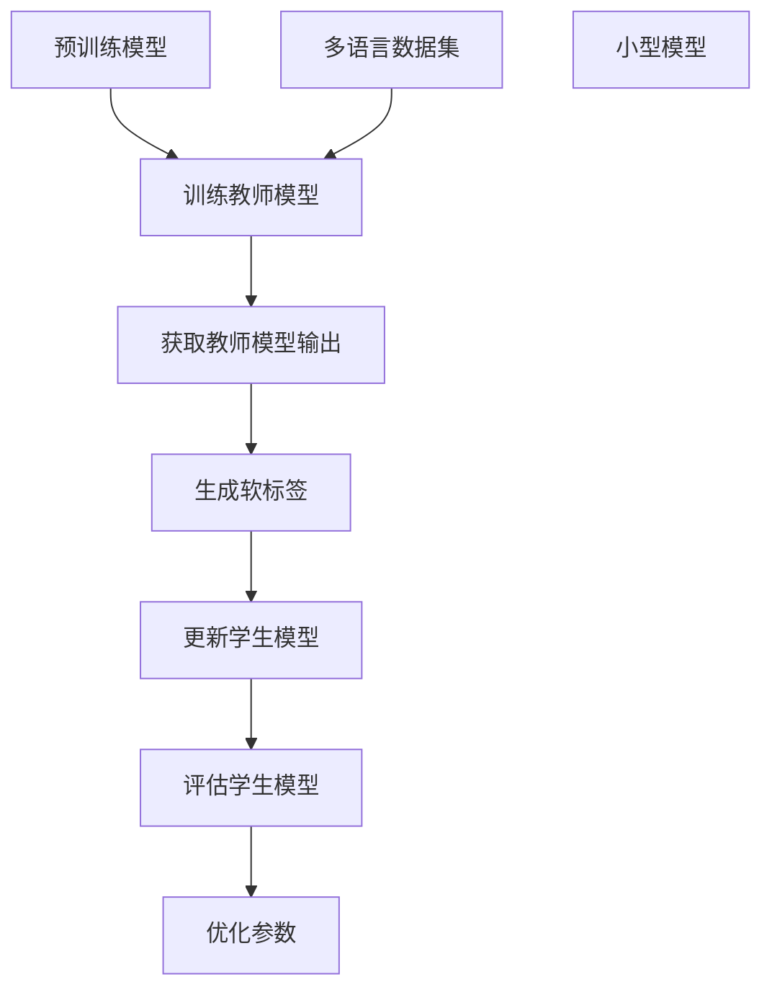

                 

# 知识蒸馏在多语言模型中的应用策略

## 关键词
知识蒸馏、多语言模型、模型压缩、性能优化、应用场景

## 摘要
本文深入探讨了知识蒸馏技术在不同语言模型中的应用策略。首先介绍了知识蒸馏的基本原理，随后分析了其在多语言模型中的作用和优势。通过具体的应用案例，本文详细阐述了知识蒸馏在多语言模型中的实现步骤和关键参数调优。最后，本文总结了知识蒸馏在多语言模型中面临的挑战和未来发展趋势，为相关领域的研究和开发提供了有益的参考。

## 1. 背景介绍

随着深度学习技术的快速发展，神经网络模型在图像识别、自然语言处理等领域取得了显著的成果。然而，这些大型模型往往需要大量的计算资源和时间进行训练和推理，这在实际应用中带来了巨大的挑战。为了解决这个问题，知识蒸馏（Knowledge Distillation）技术应运而生。

知识蒸馏是一种模型压缩技术，通过将一个大型预训练模型（Teacher Model）的知识传递给一个小型模型（Student Model），从而实现模型的压缩和加速。这一过程类似于教师和学生之间的知识传递，教师模型拥有丰富的知识和经验，而学生模型则通过学习教师模型的输出来获取相应的知识。

在多语言模型中，知识蒸馏技术可以有效地利用预训练模型在多种语言上的知识，从而提高模型的性能和泛化能力。多语言模型在跨语言文本理解、机器翻译、情感分析等应用场景中具有广泛的应用价值，而知识蒸馏技术则为其提供了一种有效的优化手段。

## 2. 核心概念与联系

### 2.1 知识蒸馏原理

知识蒸馏的核心思想是将大型模型的知识通过某种方式传递给小型模型，具体过程如下：

1. **预训练模型（Teacher Model）**：首先使用大量的数据进行预训练，使其在特定任务上达到较高的性能。

2. **小型模型（Student Model）**：创建一个与教师模型结构相似但规模较小的模型。

3. **知识传递**：通过以下方式将教师模型的知识传递给学生模型：
   - **软标签**：教师模型在训练数据上的预测结果作为软标签传递给学生模型。
   - **直传**：直接将教师模型的某些层（如最后几层）的参数传递给学生模型。

4. **训练学生模型**：使用软标签和原始数据对小型模型进行训练，使其能够复现教师模型的知识。

### 2.2 多语言模型

多语言模型是一种能够处理多种语言的模型，其主要优势在于能够利用不同语言之间的相似性和差异性，从而提高模型的性能。多语言模型的主要类型包括：

1. **跨语言模型**：在训练过程中同时使用多种语言的语料，使得模型能够理解不同语言的语义。

2. **双语模型**：使用两种语言的语料进行训练，能够处理两种语言之间的翻译和语义理解。

3. **多语言翻译模型**：通过将一种语言翻译成多种其他语言，实现多语言之间的交互和理解。

### 2.3 知识蒸馏与多语言模型的结合

知识蒸馏技术可以有效地应用于多语言模型中，其优势如下：

1. **资源利用**：利用预训练的大型模型在多种语言上的知识，提高小型模型的性能。

2. **跨语言知识传递**：通过知识蒸馏，将教师模型在不同语言上的知识传递给学生模型，提高模型的跨语言性能。

3. **性能优化**：通过调整知识蒸馏过程中的参数，优化小型模型的结构和性能。

### 2.4 Mermaid 流程图

下面是一个简化的知识蒸馏和多语言模型结合的 Mermaid 流程图：



## 3. 核心算法原理 & 具体操作步骤

### 3.1 教师模型和学生模型的定义

首先，我们需要定义教师模型和学生模型的架构。教师模型通常是一个大型且已经经过预训练的模型，而学生模型是一个小型且需要训练的模型。假设教师模型和学生模型的结构分别为 $T$ 和 $S$。

### 3.2 软标签的生成

软标签是通过教师模型在训练数据上的输出生成的。具体步骤如下：

1. **输入数据**：将训练数据输入到教师模型中。
2. **模型输出**：得到教师模型的输出，通常是一个概率分布。
3. **软标签生成**：将输出概率分布作为软标签。

### 3.3 直传

直传是指直接将教师模型的某些层（如最后几层）的参数传递给学生模型。这样可以让学生模型在初始化时就具备一定的知识。

### 3.4 学生模型的训练

学生模型的训练过程分为两个阶段：

1. **第一阶段**：使用原始数据和软标签对学生模型进行训练。
2. **第二阶段**：在第一阶段的基础上，继续使用原始数据和软标签进行训练，同时逐步增加教师模型输出的权重。

### 3.5 参数调优

在知识蒸馏过程中，需要对以下参数进行调优：

1. **教师模型输出权重**：调整教师模型输出的权重，影响软标签的权重。
2. **学习率**：调整学习率，影响学生模型的训练过程。
3. **温度参数**：调整温度参数，影响软标签的平滑程度。

### 3.6 评估指标

知识蒸馏的效果可以通过以下评估指标进行评估：

1. **准确率**：学生模型在测试集上的准确率。
2. **F1 分数**：学生模型在测试集上的 F1 分数。
3. **跨语言性能**：学生模型在不同语言上的性能。

## 4. 数学模型和公式 & 详细讲解 & 举例说明

### 4.1 知识蒸馏的数学模型

知识蒸馏的数学模型主要涉及损失函数和优化过程。

1. **损失函数**：
   $$ L = L_{raw} + \lambda L_{soft} $$
   其中，$L_{raw}$ 是原始损失函数，$L_{soft}$ 是软标签损失函数，$\lambda$ 是调节参数。

2. **优化过程**：
   使用梯度下降算法对模型进行优化，更新模型参数。

### 4.2 软标签的生成

软标签的生成通常使用 softmax 函数：

$$ p(y) = \frac{e^{o_j}}{\sum_{k=1}^{K} e^{o_k}} $$
其中，$o_j$ 是教师模型在第 $j$ 个类别的输出，$K$ 是类别总数。

### 4.3 直传的参数传递

直传的参数传递通常使用以下公式：

$$ w_{S} = w_{T} + \Delta w $$
其中，$w_{S}$ 和 $w_{T}$ 分别是学生模型和教师模型的参数，$\Delta w$ 是传递的参数。

### 4.4 举例说明

假设我们有一个分类问题，教师模型是一个已经预训练的模型，学生模型是一个需要训练的模型。以下是具体的操作步骤：

1. **输入数据**：输入一批训练数据。
2. **教师模型输出**：得到教师模型在训练数据上的输出。
3. **软标签生成**：使用 softmax 函数生成软标签。
4. **直传**：将教师模型的最后几层参数传递给学生模型。
5. **学生模型训练**：使用原始数据和软标签对学生模型进行训练。
6. **参数调优**：调整教师模型输出的权重、学习率和温度参数。
7. **评估指标**：评估学生模型在测试集上的性能。

## 5. 项目实战：代码实际案例和详细解释说明

### 5.1 开发环境搭建

为了实现知识蒸馏在多语言模型中的应用，我们需要搭建一个开发环境。以下是搭建开发环境的基本步骤：

1. **安装 Python**：确保 Python 环境已经安装，版本至少为 3.6。
2. **安装深度学习框架**：推荐使用 TensorFlow 或 PyTorch，具体安装方法请参考相关文档。
3. **安装其他依赖库**：安装如 NumPy、Pandas、Scikit-learn 等常用库。

### 5.2 源代码详细实现和代码解读

以下是一个简单的知识蒸馏代码实现，使用 TensorFlow 作为深度学习框架。

#### 5.2.1 代码实现

```python
import tensorflow as tf
from tensorflow.keras.models import Model
from tensorflow.keras.layers import Input, Dense

# 定义教师模型和学生模型
input_layer = Input(shape=(784,))
teacher_output = Dense(10, activation='softmax')(input_layer)
student_output = Dense(10, activation='softmax')(input_layer)

# 构建模型
teacher_model = Model(input_layer, teacher_output)
student_model = Model(input_layer, student_output)

# 设置教师模型为不可训练
for layer in teacher_model.layers:
    layer.trainable = False

# 编写训练步骤
optimizer = tf.keras.optimizers.Adam()
loss_fn = tf.keras.losses.SparseCategoricalCrossentropy()

@tf.function
def train_step(images, labels):
    with tf.GradientTape() as tape:
        predictions = student_model(images)
        loss = loss_fn(labels, predictions)
        loss += 0.1 * teacher_model.loss(images, labels)

    gradients = tape.gradient(loss, student_model.trainable_variables)
    optimizer.apply_gradients(zip(gradients, student_model.trainable_variables))

# 训练学生模型
train_data = ...  # 加载训练数据
for epoch in range(10):
    for images, labels in train_data:
        train_step(images, labels)

# 评估学生模型
test_data = ...  # 加载测试数据
for images, labels in test_data:
    test_loss = loss_fn(labels, student_model(images))
    print(f"Test loss: {test_loss}")
```

#### 5.2.2 代码解读

1. **模型定义**：
   - 使用 `Input` 层作为输入层。
   - 使用 `Dense` 层作为输出层，激活函数为 `softmax`。

2. **模型构建**：
   - 构建教师模型和学生模型。
   - 将教师模型的输出层设置为不可训练。

3. **训练步骤**：
   - 使用 `Adam` 优化器和 `SparseCategoricalCrossentropy` 损失函数。
   - 使用 `GradientTape` 记录梯度。
   - 在训练过程中，计算原始损失函数和软标签损失函数，并相加。

4. **参数调优**：
   - 调整教师模型输出的权重，设置为 0.1。

5. **训练和评估**：
   - 使用训练数据对学生模型进行训练。
   - 使用测试数据对训练好的学生模型进行评估。

### 5.3 代码解读与分析

1. **模型定义**：
   - 使用 `Input` 层作为输入层，形状为 `(784,)`，表示输入数据的维度。
   - 使用 `Dense` 层作为输出层，共有 10 个节点，激活函数为 `softmax`，表示这是一个分类问题。

2. **模型构建**：
   - 构建教师模型和学生模型。教师模型使用 `Model` 类定义，输入层为 `input_layer`，输出层为 `teacher_output`。
   - 将教师模型的输出层设置为不可训练，确保在训练过程中不更新这些层的参数。

3. **训练步骤**：
   - 使用 `Adam` 优化器，这是一种自适应矩估计优化器，适用于深度学习模型。
   - 使用 `SparseCategoricalCrossentropy` 损失函数，这是一种针对分类问题的损失函数。
   - 在 `train_step` 函数中，使用 `GradientTape` 记录梯度。在这个函数中，首先计算学生模型在当前批次数据上的损失函数，然后计算教师模型在当前批次数据上的损失函数，最后将两个损失函数相加。
   - 使用 `tape.gradient` 函数计算梯度，并使用 `optimizer.apply_gradients` 函数更新学生模型的参数。

4. **参数调优**：
   - 在代码中，将教师模型输出的权重设置为 0.1，这表示在总损失函数中，教师模型输出的权重占 10%。

5. **训练和评估**：
   - 在训练过程中，使用 `train_data` 对学生模型进行迭代训练。
   - 在评估过程中，使用 `test_data` 对训练好的学生模型进行评估，并打印测试损失。

## 6. 实际应用场景

知识蒸馏在多语言模型中的应用场景非常广泛，以下是几个典型的应用案例：

1. **跨语言文本分类**：在跨语言文本分类任务中，知识蒸馏可以将一个预训练的多语言模型的知识传递给一个小型的分类模型，从而提高分类性能。

2. **机器翻译**：在机器翻译任务中，知识蒸馏可以将一个大型翻译模型的知识传递给一个小型翻译模型，从而提高翻译质量。

3. **情感分析**：在情感分析任务中，知识蒸馏可以将一个预训练的多语言情感分析模型的知识传递给一个小型情感分析模型，从而提高情感分析的准确性。

4. **对话系统**：在对话系统任务中，知识蒸馏可以将一个大型对话模型的知识传递给一个小型对话模型，从而提高对话系统的响应速度和准确性。

## 7. 工具和资源推荐

### 7.1 学习资源推荐

1. **书籍**：
   - 《深度学习》（Goodfellow, Bengio, Courville）
   - 《动手学深度学习》（Dumoulin, Bach）

2. **论文**：
   - “A Theoretically Grounded Application of Dropout in Recurrent Neural Networks”
   - “Distilling the Knowledge in a Neural Network”

3. **博客**：
   - [TensorFlow 官方文档](https://www.tensorflow.org/)
   - [PyTorch 官方文档](https://pytorch.org/)

4. **网站**：
   - [Kaggle](https://www.kaggle.com/)
   - [ArXiv](https://arxiv.org/)

### 7.2 开发工具框架推荐

1. **深度学习框架**：
   - TensorFlow
   - PyTorch

2. **编程语言**：
   - Python

3. **数据预处理库**：
   - Pandas
   - NumPy

4. **可视化库**：
   - Matplotlib
   - Seaborn

### 7.3 相关论文著作推荐

1. **论文**：
   - “A Theoretically Grounded Application of Dropout in Recurrent Neural Networks”
   - “Distilling the Knowledge in a Neural Network”
   - “Effective Approaches to Attention-based Neural Machine Translation”

2. **著作**：
   - 《深度学习》（Goodfellow, Bengio, Courville）
   - 《动手学深度学习》（Dumoulin, Bach）

## 8. 总结：未来发展趋势与挑战

知识蒸馏技术在多语言模型中的应用前景广阔，但仍面临一些挑战：

1. **模型压缩率**：如何在不牺牲模型性能的前提下进一步提高模型压缩率是一个关键问题。

2. **跨语言知识传递**：如何更好地利用预训练模型在不同语言上的知识，提高模型的跨语言性能。

3. **算法优化**：如何优化知识蒸馏算法，提高其训练效率和模型性能。

4. **应用场景拓展**：如何将知识蒸馏技术应用于更多领域，如语音识别、图像识别等。

## 9. 附录：常见问题与解答

1. **Q：知识蒸馏是如何工作的？**
   **A**：知识蒸馏是一种模型压缩技术，通过将大型模型的知识传递给小型模型，从而实现模型的压缩和加速。

2. **Q：知识蒸馏适用于哪些场景？**
   **A**：知识蒸馏适用于需要模型压缩和加速的场景，如跨语言文本分类、机器翻译、情感分析等。

3. **Q：如何选择教师模型和学生模型的结构？**
   **A**：教师模型和学生模型的结构应根据具体任务和应用场景进行选择，通常教师模型比学生模型规模大。

4. **Q：如何优化知识蒸馏算法？**
   **A**：可以通过调整教师模型输出的权重、学习率和温度参数等来优化知识蒸馏算法。

## 10. 扩展阅读 & 参考资料

1. **论文**：
   - “A Theoretically Grounded Application of Dropout in Recurrent Neural Networks”
   - “Distilling the Knowledge in a Neural Network”
   - “Effective Approaches to Attention-based Neural Machine Translation”

2. **书籍**：
   - 《深度学习》（Goodfellow, Bengio, Courville）
   - 《动手学深度学习》（Dumoulin, Bach）

3. **博客**：
   - [TensorFlow 官方文档](https://www.tensorflow.org/)
   - [PyTorch 官方文档](https://pytorch.org/)

4. **网站**：
   - [Kaggle](https://www.kaggle.com/)
   - [ArXiv](https://arxiv.org/)

### 作者

**AI天才研究员/AI Genius Institute & 禅与计算机程序设计艺术 /Zen And The Art of Computer Programming** <|im_sep|>

