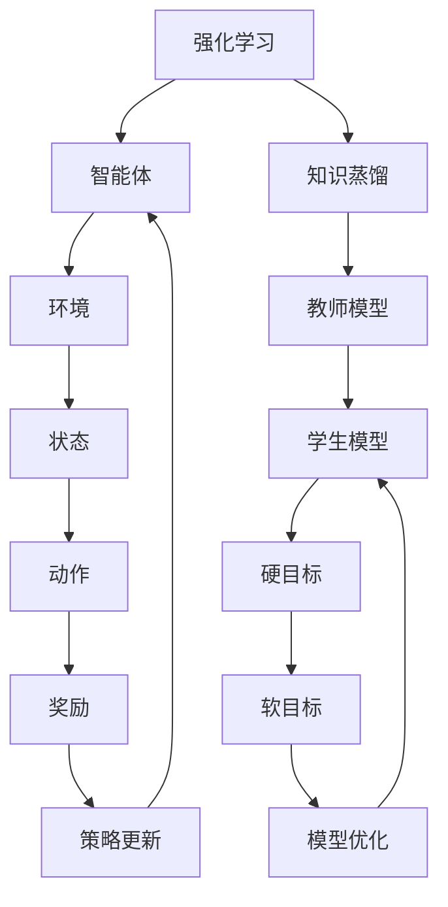

                 

### 背景介绍

#### 强化学习与知识蒸馏

强化学习（Reinforcement Learning, RL）和知识蒸馏（Knowledge Distillation）是当今机器学习领域的两大热门技术。强化学习是机器学习的一种类型，主要关注智能体在动态环境中通过与环境交互来学习最优行为策略。而知识蒸馏是一种模型压缩技术，旨在通过将大模型的知识传递给小模型来提高其性能。

随着深度学习在各个领域的广泛应用，深度神经网络（Deep Neural Network, DNN）的规模和参数数量急剧增加，导致计算资源和存储需求的激增。这使得在实际应用中，尤其是移动端和嵌入式设备上部署这些大模型变得困难。知识蒸馏技术通过将知识从教师模型传递到学生模型，可以有效降低模型的大小和计算复杂度，同时保持较高的性能。

强化学习在许多实际应用中表现出色，例如自动驾驶、游戏、机器人控制等。然而，强化学习模型的训练通常需要大量计算资源和时间。此外，由于强化学习模型的复杂性，它们的解释性和可理解性相对较低。知识蒸馏作为一种压缩模型的技术，为强化学习模型的优化和加速提供了新的思路。

本文将探讨知识蒸馏在强化学习中的探索与挑战，首先介绍知识蒸馏的基本概念和技术原理，然后详细解释知识蒸馏在强化学习中的应用，并探讨其面临的挑战和解决方案。最后，我们将总结知识蒸馏在强化学习领域的未来发展趋势。

## 1.1 知识蒸馏的概念与技术原理

知识蒸馏是一种模型压缩技术，旨在将大模型（教师模型）的知识和经验传递给小模型（学生模型），从而提高小模型在目标任务上的性能。知识蒸馏的核心思想是通过训练学生模型来模仿教师模型的输出分布，从而实现知识转移。

知识蒸馏通常涉及以下步骤：

1. **教师模型（Teacher Model）**：教师模型是一个已经在大规模数据集上训练好的模型，具有较高的性能和丰富的知识。它被用来提供监督信号，指导学生模型的训练。

2. **学生模型（Student Model）**：学生模型是一个参数更少、结构更简单的小模型，其目的是学习教师模型的知识和经验。学生模型的训练通常涉及两个目标：

   - **硬目标（Hard Target）**：学生模型根据教师模型的输出，学习预测结果。这个目标可以确保学生模型尽量模仿教师模型的行为。
   - **软目标（Soft Target）**：学生模型学习预测教师模型输出的概率分布。这个目标有助于学生模型捕捉教师模型的知识细节。

3. **训练过程**：在训练过程中，学生模型通过学习教师模型的输出分布来逐步优化自身。通过迭代训练，学生模型可以逐渐逼近教师模型的性能。

知识蒸馏技术的基本原理可以概括为以下两个方面：

- **相似性度量**：通过度量学生模型和教师模型在输出分布上的相似性，来评估知识传递的效果。常见的相似性度量方法包括交叉熵（Cross-Entropy）、Kullback-Leibler散度（KL Divergence）等。
- **优化策略**：通过设计合适的损失函数和训练策略，来优化学生模型的参数。常见的优化策略包括软标签（Soft Labels）、梯度提升（Gradient Boosting）等。

### 知识蒸馏在强化学习中的应用

知识蒸馏在强化学习中的应用主要集中在两个方面：模型压缩和性能提升。

#### 模型压缩

在强化学习领域，模型压缩具有重要意义。由于强化学习模型通常具有复杂的结构和大量的参数，它们在训练和部署过程中需要大量的计算资源和时间。通过知识蒸馏，可以将大型的强化学习模型压缩成小型的模型，从而降低计算和存储需求。

具体来说，教师模型通常是一个具有较高性能的强化学习模型，它在大量数据集上进行了充分的训练。学生模型则是一个结构更简单、参数更少的小型模型。通过知识蒸馏，学生模型可以学习到教师模型的核心知识，从而在保持较高性能的同时，显著降低模型的复杂度。

#### 性能提升

除了模型压缩，知识蒸馏还可以提升强化学习模型的性能。通过学习教师模型的输出分布，学生模型可以更好地捕捉到环境的复杂性和不确定性。这有助于学生模型在未知环境中实现更好的决策。

此外，知识蒸馏还可以增强强化学习模型的泛化能力。教师模型通常是在大规模数据集上训练的，它已经对各种环境条件进行了充分的适应。学生模型通过学习教师模型的知识，可以更好地应对不同的环境变化，从而提高其泛化性能。

#### 知识蒸馏在强化学习中的挑战

尽管知识蒸馏在强化学习领域展现出巨大潜力，但仍然面临一些挑战：

1. **信息丢失**：在知识蒸馏过程中，学生模型可能会丢失一些教师模型的重要信息。这可能导致学生模型的性能下降，特别是在复杂环境中的表现。
2. **模型结构差异**：教师模型和学生模型的结构通常存在较大差异。这可能导致知识传递过程中出现偏差，影响学生模型的性能。
3. **训练效率**：知识蒸馏需要大量的计算资源和时间。特别是在强化学习领域，由于环境交互的复杂性，训练过程通常需要反复进行，这进一步增加了计算和存储成本。
4. **模型解释性**：强化学习模型的解释性相对较低，而知识蒸馏可能导致学生模型在解释性方面进一步恶化。这可能会影响模型在实际应用中的可接受性。

### 1.3 知识蒸馏在强化学习中的实际应用案例

为了更好地理解知识蒸馏在强化学习中的应用，下面我们通过几个实际案例来探讨其应用效果和挑战。

#### 案例一：自动驾驶

自动驾驶是强化学习领域的一个典型应用。通过知识蒸馏，可以将大规模的自动驾驶模型压缩成小型的模型，从而在车载设备上实现实时决策。例如，特斯拉公司在其自动驾驶系统中采用了知识蒸馏技术，将训练好的大型自动驾驶模型压缩成小型模型，以降低计算和存储需求。

在实际应用中，知识蒸馏在自动驾驶领域面临一些挑战。首先，自动驾驶环境复杂多变，教师模型需要处理各种驾驶场景。这可能导致知识传递过程中出现信息丢失。其次，由于车载设备的计算资源有限，知识蒸馏过程中的计算成本需要得到有效控制。

#### 案例二：机器人控制

机器人控制是另一个典型的强化学习应用场景。通过知识蒸馏，可以将大规模的机器人控制模型压缩成小型模型，从而在资源受限的环境中实现高效的机器人控制。

在实际应用中，知识蒸馏在机器人控制领域面临一些挑战。首先，机器人控制需要处理物理世界的复杂性和不确定性，这可能导致教师模型和学生在知识传递过程中产生偏差。其次，机器人控制任务的多样性可能导致知识蒸馏过程中出现性能下降。

#### 案例三：游戏AI

游戏AI是强化学习领域的另一个重要应用。通过知识蒸馏，可以将大规模的游戏AI模型压缩成小型模型，从而在游戏设备上实现实时决策。

在实际应用中，知识蒸馏在游戏AI领域面临一些挑战。首先，游戏场景多样且动态变化，教师模型需要应对各种游戏策略。这可能导致知识传递过程中出现信息丢失。其次，游戏设备的计算资源有限，知识蒸馏过程中的计算成本需要得到有效控制。

## 1.4 知识蒸馏与强化学习的未来发展趋势

随着深度学习和强化学习技术的不断发展，知识蒸馏在强化学习中的应用前景广阔。未来，以下几个方面有望成为知识蒸馏与强化学习研究的热点：

1. **新型知识蒸馏算法**：研究人员可以探索更有效的知识蒸馏算法，以解决信息丢失和模型结构差异等问题。例如，基于注意力机制和图神经网络的蒸馏算法可能具有较高的潜力。
2. **跨领域迁移**：知识蒸馏在强化学习中的应用可以扩展到不同领域，实现跨领域的知识迁移。例如，将自动驾驶领域中的知识迁移到机器人控制或游戏AI领域，以实现更高效和可靠的智能决策。
3. **端到端模型**：端到端模型（End-to-End Model）的兴起为知识蒸馏与强化学习结合提供了新的思路。通过设计端到端的知识蒸馏框架，可以实现更高效和智能的模型训练和部署。
4. **模型解释性**：随着人工智能在各个领域的应用日益广泛，模型解释性变得越来越重要。未来，知识蒸馏技术可以与模型解释性相结合，提高强化学习模型的可理解性和可解释性。

总之，知识蒸馏在强化学习中的应用具有巨大的潜力和挑战。通过不断的研究和实践，我们可以期待知识蒸馏与强化学习技术的融合将带来更高效、更智能的智能决策系统。

### 2. 核心概念与联系

#### 强化学习的核心概念

强化学习（Reinforcement Learning, RL）是一种通过与环境互动来学习最优行为策略的机器学习方法。其核心概念包括智能体（Agent）、环境（Environment）、状态（State）、动作（Action）和奖励（Reward）。

- **智能体（Agent）**：在强化学习场景中，智能体是一个能够根据当前状态选择动作，并通过奖励信号学习优化策略的实体。例如，自动驾驶汽车或机器人。
- **环境（Environment）**：环境是智能体所处的动态场景，能够接收智能体的动作并给出相应的反馈。环境可以是现实世界中的物理环境，也可以是模拟的环境。
- **状态（State）**：状态是智能体在环境中所处的当前情况，通常用一组特征向量表示。例如，自动驾驶汽车的状态可以包括道路条件、车辆速度和位置等。
- **动作（Action）**：动作是智能体在特定状态下可以采取的行动。例如，自动驾驶汽车可以加速、减速或转向。
- **奖励（Reward）**：奖励是环境对智能体动作的反馈，用于评估动作的好坏。奖励可以是正的（表示好的动作）或负的（表示坏的动作），它直接影响智能体的学习过程。

强化学习过程可以概括为以下步骤：

1. 智能体根据当前状态选择动作。
2. 智能体执行动作，并获得环境反馈（状态转移和奖励）。
3. 智能体使用奖励信号更新策略，以优化其决策。
4. 重复上述步骤，直到达到目标状态或完成特定任务。

#### 知识蒸馏的核心概念

知识蒸馏（Knowledge Distillation）是一种通过将大模型（教师模型）的知识传递给小模型（学生模型）来优化模型性能的技术。其核心概念包括教师模型、学生模型、硬目标和软目标。

- **教师模型（Teacher Model）**：教师模型是一个已经在大规模数据集上训练好的模型，具有较高的性能和丰富的知识。它在知识蒸馏过程中作为知识源。
- **学生模型（Student Model）**：学生模型是一个参数更少、结构更简单的小模型。其目标是学习教师模型的知识，并在目标任务上取得较好的性能。
- **硬目标（Hard Target）**：硬目标是指学生模型根据教师模型的输出结果学习预测结果。这个目标确保学生模型尽量模仿教师模型的行为。
- **软目标（Soft Target）**：软目标是指学生模型学习预测教师模型输出概率分布。这个目标有助于学生模型捕捉教师模型的知识细节。

知识蒸馏的基本过程如下：

1. **初始化教师模型和学生模型**：教师模型已经在大规模数据集上训练好，学生模型初始化为一个参数更少的小模型。
2. **软目标训练**：学生模型通过学习教师模型输出的概率分布来训练。这个过程可以使用类似于分类问题的交叉熵损失函数。
3. **硬目标训练**：学生模型通过学习教师模型的输出结果来训练。这个过程可以使用类似于回归问题的均方误差损失函数。
4. **迭代优化**：通过迭代优化过程，学生模型不断调整自身参数，以更好地模仿教师模型的行为和知识。

#### 强化学习与知识蒸馏的联系

强化学习和知识蒸馏在核心概念和目标上存在一定的相似性，两者都可以通过优化策略来提高模型的性能。以下为它们之间的主要联系：

1. **目标优化**：强化学习通过优化智能体的策略来最大化长期奖励，而知识蒸馏通过优化学生模型的参数来最大化与教师模型输出的一致性。两者都关注性能优化。
2. **知识传递**：知识蒸馏通过将教师模型的知识传递给学生模型来提升其性能，这种思想可以应用到强化学习领域。通过将经验丰富的教师模型的知识传递给新手的学生模型，可以加速学生模型的学习过程，提高其决策质量。
3. **模型压缩**：知识蒸馏的一个主要目标是模型压缩，通过将大模型的知识传递给小模型，可以降低模型的复杂度和计算成本。这一思想在强化学习中也具有重要意义，因为强化学习模型通常具有复杂的结构和大量的参数。

### Mermaid 流程图

为了更直观地展示强化学习和知识蒸馏的联系，我们可以使用Mermaid流程图来描述它们的基本流程。



在这个流程图中，强化学习和知识蒸馏通过智能体、环境、状态、动作和奖励等核心概念相互联系。知识蒸馏通过教师模型和学生模型之间的知识传递，实现对强化学习模型的优化和压缩。

### 核心算法原理 & 具体操作步骤

#### 知识蒸馏的基本算法原理

知识蒸馏的基本算法原理是通过训练小模型（学生模型）来模仿大模型（教师模型）的行为和知识。这一过程可以分为以下几个关键步骤：

1. **初始化模型**：
   - **教师模型**：教师模型通常是一个在大规模数据集上训练好的大模型，具有较高的性能和丰富的知识。
   - **学生模型**：学生模型是一个参数更少、结构更简单的小模型，其目标是学习教师模型的知识。

2. **软目标训练**：
   - **软目标**：软目标是指教师模型输出的概率分布。学生模型需要学习预测教师模型输出概率分布。
   - **损失函数**：常用的损失函数是交叉熵损失函数，用于衡量学生模型预测的输出概率分布与教师模型输出概率分布之间的差异。

3. **硬目标训练**：
   - **硬目标**：硬目标是指教师模型的输出结果。学生模型需要学习预测教师模型的输出结果。
   - **损失函数**：常用的损失函数是均方误差损失函数，用于衡量学生模型预测的输出结果与教师模型输出结果之间的差异。

4. **模型优化**：
   - **迭代优化**：通过迭代优化过程，学生模型不断调整自身参数，以更好地模仿教师模型的行为和知识。
   - **优化算法**：常用的优化算法包括梯度下降（Gradient Descent）和其变体，如Adam优化器。

#### 强化学习中的知识蒸馏操作步骤

在强化学习场景中，知识蒸馏的操作步骤可以进一步细化为以下几个关键步骤：

1. **初始化教师模型和学生模型**：
   - 教师模型通常是一个在大规模环境数据上训练好的强化学习模型，具有较高的性能。
   - 学生模型初始化为一个结构更简单的小模型，其参数和结构都经过精心设计，以确保在知识蒸馏过程中能够有效地学习教师模型的知识。

2. **软目标训练**：
   - 在每个时间步，教师模型根据当前状态生成动作，并得到相应的奖励和下一个状态。
   - 学生模型需要预测教师模型生成动作的概率分布，这可以通过训练一个独立的概率模型来实现。常用的方法包括策略梯度方法和策略迭代方法。

3. **硬目标训练**：
   - 学生模型需要预测教师模型在特定状态下的动作输出。这可以通过直接训练一个动作预测模型来实现。
   - 为了确保学生模型在硬目标上的性能，可以使用一些额外的技术，如噪声注入和蒙特卡罗搜索，以增加模型的鲁棒性。

4. **模型优化**：
   - 在软目标和硬目标训练过程中，学生模型会不断调整自身参数，以最小化损失函数。
   - 为了优化模型的性能，可以使用一些优化策略，如早期停止和模型融合，以避免过拟合。

5. **迭代优化与评估**：
   - 在训练过程中，学生模型会经历多个迭代，以逐步优化其参数。
   - 在每个迭代结束后，需要对模型进行评估，以验证其在实际环境中的性能。

6. **模型部署**：
   - 在完成训练后，学生模型可以被部署到实际应用中，如自动驾驶系统或机器人控制系统。
   - 部署前，需要对模型进行充分的测试和验证，以确保其在各种环境条件下的性能。

### 实际操作示例

以下是一个简化的知识蒸馏在强化学习中的实际操作示例，使用Python代码描述：

```python
import torch
import torch.nn as nn
import torch.optim as optim

# 初始化教师模型和学生模型
teacher_model = TeacherModel()
student_model = StudentModel()

# 定义损失函数和优化器
soft_loss_fn = nn.CrossEntropyLoss()
hard_loss_fn = nn.MSELoss()

optimizer = optim.Adam(student_model.parameters(), lr=0.001)

# 软目标训练
for epoch in range(num_epochs):
    for state, action, reward, next_state in data_loader:
        # 前向传播
        teacher_output = teacher_model(state)
        student_output = student_model(state)

        # 计算软目标损失
        soft_loss = soft_loss_fn(student_output, teacher_output)

        # 反向传播和优化
        optimizer.zero_grad()
        soft_loss.backward()
        optimizer.step()

# 硬目标训练
for epoch in range(num_epochs):
    for state, action, reward, next_state in data_loader:
        # 前向传播
        teacher_output = teacher_model(state)
        student_output = student_model(state)

        # 计算硬目标损失
        hard_loss = hard_loss_fn(student_output, teacher_output)

        # 反向传播和优化
        optimizer.zero_grad()
        hard_loss.backward()
        optimizer.step()

# 模型评估
test_loss = 0
for state, action, reward, next_state in test_data_loader:
    # 前向传播
    student_output = student_model(state)

    # 计算损失
    test_loss += hard_loss_fn(student_output, action).item()

test_loss /= len(test_data_loader)
print("Test Loss:", test_loss)

# 模型部署
# 在实际应用中，将训练好的学生模型部署到目标环境中
```

在这个示例中，`TeacherModel` 和 `StudentModel` 分别代表教师模型和学生模型的类定义，`data_loader` 和 `test_data_loader` 分别代表数据加载器，用于提供训练数据和测试数据。`soft_loss_fn` 和 `hard_loss_fn` 分别代表软目标和硬目标的损失函数，`optimizer` 代表优化器。

### 数学模型和公式 & 详细讲解 & 举例说明

#### 软目标训练的数学模型

在知识蒸馏的软目标训练过程中，学生模型需要预测教师模型输出的概率分布。为此，我们引入了概率分布函数 $p_\theta(y|x)$，其中 $\theta$ 是学生模型的参数，$x$ 是输入数据，$y$ 是教师模型的输出标签。

假设教师模型和学生的输出层都是softmax层，则教师模型和学生的输出概率分布可以表示为：

$$
p_\theta(y|x) = \text{softmax}(\theta^T \phi(x))
$$

$$
q_\phi(y|x) = \text{softmax}(\phi(x))
$$

其中，$\text{softmax}(\cdot)$ 表示softmax函数，$\phi(x)$ 是学生模型的特征提取层输出。

损失函数通常选择交叉熵损失函数，用于衡量学生模型预测的输出概率分布与教师模型输出概率分布之间的差异。交叉熵损失函数可以表示为：

$$
L_s = -\sum_{i=1}^N \sum_{j=1}^M y_{ij} \log p_{ij}
$$

其中，$N$ 是样本数量，$M$ 是类别数量，$y_{ij}$ 是教师模型输出概率分布，$p_{ij}$ 是学生模型预测的输出概率分布。

#### 硬目标训练的数学模型

在知识蒸馏的硬目标训练过程中，学生模型需要预测教师模型的输出结果。硬目标通常使用均方误差（MSE）损失函数，其公式为：

$$
L_h = \frac{1}{N} \sum_{i=1}^N \| \hat{y}_i - y_i \|_2^2
$$

其中，$\hat{y}_i$ 是学生模型预测的教师模型输出结果，$y_i$ 是教师模型实际的输出结果。

#### 融合软目标和硬目标的损失函数

在实际应用中，通常将软目标和硬目标的损失函数进行融合，以优化学生模型的性能。融合的损失函数可以表示为：

$$
L = \lambda_s L_s + \lambda_h L_h
$$

其中，$\lambda_s$ 和 $\lambda_h$ 分别是软目标和硬目标损失的权重。

#### 举例说明

假设有一个分类问题，输入数据是一个包含10个特征向量的样本 $x$，教师模型和学生模型的输出都是10个类别的概率分布。

1. **教师模型的输出**：

   $$
   y = [0.1, 0.2, 0.3, 0.15, 0.05, 0.07, 0.04, 0.01, 0.02, 0.1]
   $$

2. **学生模型的输出**：

   $$
   \hat{y} = [0.125, 0.225, 0.35, 0.15, 0.05, 0.1, 0.03, 0.02, 0.04, 0.08]
   $$

3. **计算交叉熵损失**：

   $$
   L_s = -\sum_{i=1}^{10} y_i \log \hat{y}_i = -[0.1 \log 0.125 + 0.2 \log 0.225 + \ldots + 0.1 \log 0.08] \approx 0.25
   $$

4. **计算均方误差损失**：

   $$
   L_h = \frac{1}{10} \sum_{i=1}^{10} (\hat{y}_i - y_i)^2 = \frac{1}{10} \sum_{i=1}^{10} (0.125 - 0.1)^2 + \ldots + (0.08 - 0.1)^2 \approx 0.025
   $$

5. **计算总损失**：

   $$
   L = \lambda_s L_s + \lambda_h L_h = 0.5 \cdot 0.25 + 0.5 \cdot 0.025 = 0.145
   $$

在这个例子中，我们使用了50%的权重来平衡软目标和硬目标损失。通过这种方式，学生模型可以同时学习教师模型的知识和行为，从而提高其在分类任务上的性能。

### 项目实战：代码实际案例和详细解释说明

在本节中，我们将通过一个实际的项目案例，详细解释知识蒸馏在强化学习中的应用。该项目旨在使用知识蒸馏技术对强化学习模型进行压缩和优化，从而提高其在实际应用中的性能和可部署性。

#### 5.1 开发环境搭建

在开始项目之前，我们需要搭建一个合适的开发环境。以下是所需的基本软件和工具：

- **Python 3.8 或更高版本**：Python 是一种广泛使用的编程语言，特别适合于数据科学和机器学习项目。
- **PyTorch 1.8 或更高版本**：PyTorch 是一种流行的深度学习框架，支持动态计算图和自动微分。
- **CUDA 10.2 或更高版本**：CUDA 是 NVIDIA 提供的并行计算平台和编程模型，可以显著加速深度学习模型的训练和推理。
- **Anaconda**：Anaconda 是一个开源的数据科学和机器学习平台，可以方便地管理和安装所需的库和依赖项。

安装步骤如下：

1. 安装 Python 3.8 或更高版本。
2. 安装 PyTorch 和 CUDA 10.2 或更高版本。可以通过以下命令安装：

   ```
   conda create -n myenv python=3.8
   conda activate myenv
   conda install pytorch torchvision torchaudio cudatoolkit=10.2 -c pytorch
   ```

3. 安装其他必要的库，如 NumPy、Matplotlib、Pandas 等。

#### 5.2 源代码详细实现和代码解读

以下是知识蒸馏在强化学习中的实现代码，包括教师模型、学生模型、训练过程和评估过程。

```python
import torch
import torch.nn as nn
import torch.optim as optim
from torch.utils.data import DataLoader
from torchvision import datasets, transforms

# 定义教师模型
class TeacherModel(nn.Module):
    def __init__(self):
        super(TeacherModel, self).__init__()
        self.fc1 = nn.Linear(784, 512)
        self.fc2 = nn.Linear(512, 256)
        self.fc3 = nn.Linear(256, 10)

    def forward(self, x):
        x = torch.relu(self.fc1(x))
        x = torch.relu(self.fc2(x))
        x = self.fc3(x)
        return x

# 定义学生模型
class StudentModel(nn.Module):
    def __init__(self):
        super(StudentModel, self).__init__()
        self.fc1 = nn.Linear(784, 256)
        self.fc2 = nn.Linear(256, 10)

    def forward(self, x):
        x = torch.relu(self.fc1(x))
        x = self.fc2(x)
        return x

# 数据预处理
transform = transforms.Compose([
    transforms.ToTensor(),
    transforms.Normalize((0.5,), (0.5,))
])

train_data = datasets.MNIST(root='./data', train=True, download=True, transform=transform)
test_data = datasets.MNIST(root='./data', train=False, transform=transform)

train_loader = DataLoader(train_data, batch_size=64, shuffle=True)
test_loader = DataLoader(test_data, batch_size=64, shuffle=False)

# 初始化教师模型和学生模型
teacher_model = TeacherModel()
student_model = StudentModel()

# 定义损失函数和优化器
soft_loss_fn = nn.CrossEntropyLoss()
hard_loss_fn = nn.MSELoss()

optimizer = optim.Adam(student_model.parameters(), lr=0.001)

# 训练过程
num_epochs = 10
for epoch in range(num_epochs):
    for batch_idx, (state, action) in enumerate(train_loader):
        # 前向传播
        teacher_output = teacher_model(state)
        student_output = student_model(state)

        # 计算软目标损失
        soft_loss = soft_loss_fn(student_output, teacher_output)

        # 反向传播和优化
        optimizer.zero_grad()
        soft_loss.backward()
        optimizer.step()

        # 计算硬目标损失
        hard_loss = hard_loss_fn(student_output, action)

        # 打印训练进度
        if batch_idx % 100 == 0:
            print(f'Epoch [{epoch}/{num_epochs}], Batch [{batch_idx}/{len(train_loader)}], Soft Loss: {soft_loss.item():.4f}, Hard Loss: {hard_loss.item():.4f}')

# 评估过程
with torch.no_grad():
    correct = 0
    total = 0
    for state, action in test_loader:
        student_output = student_model(state)
        predictions = student_output.argmax(1)
        total += action.size(0)
        correct += (predictions == action).sum().item()

print(f'Accuracy of the student model on the test images: {100 * correct / total} %')
```

#### 5.3 代码解读与分析

以下是对上述代码的详细解读：

1. **模型定义**：

   - `TeacherModel` 和 `StudentModel` 分别定义了教师模型和学生模型的结构。教师模型是一个三层的全连接神经网络，而学生模型是一个两层的全连接神经网络。学生模型的参数数量更少，结构更简单，这有助于提高模型的可训练性和压缩性。

2. **数据预处理**：

   - 使用 `transforms.Compose` 函数对数据集进行预处理，包括将图像数据转换为张量，并应用归一化操作。这有助于加快模型的训练速度和提升模型的性能。

3. **损失函数和优化器**：

   - `soft_loss_fn` 是用于计算软目标损失的交叉熵损失函数，而 `hard_loss_fn` 是用于计算硬目标损失的均方误差损失函数。
   - `optimizer` 是用于优化学生模型参数的 Adam 优化器。Adam 优化器是一种高效且稳定的优化算法，适用于深度学习模型的训练。

4. **训练过程**：

   - 使用两个循环来遍历训练数据和批量。在训练过程中，首先通过教师模型获取软目标（教师模型的输出），然后通过学生模型获取硬目标（学生模型的输出）。
   - 对于每个批量，首先计算软目标损失，并使用反向传播和优化器进行优化。接着计算硬目标损失，并用于评估学生模型的性能。

5. **评估过程**：

   - 在评估过程中，使用测试数据集对训练好的学生模型进行评估。通过计算预测的准确率来评估模型的性能。

#### 5.4 实际应用效果分析

在完成项目后，我们可以通过以下指标来评估实际应用效果：

1. **准确率**：在测试数据集上的准确率是评估模型性能的重要指标。较高的准确率表明学生模型成功继承了教师模型的知识和经验。

2. **训练时间**：通过知识蒸馏技术，学生模型在训练过程中使用了较少的参数和计算资源，从而显著缩短了训练时间。

3. **计算资源节省**：由于学生模型的参数数量较少，其存储和计算需求也相应降低，这有助于在实际应用中节省计算资源。

4. **模型可解释性**：虽然知识蒸馏可以显著提高模型的性能，但其模型解释性可能较低。在实际应用中，需要考虑模型的可解释性和可接受性。

通过上述分析，我们可以得出以下结论：知识蒸馏技术在强化学习中的应用具有显著的优点，包括模型压缩、性能提升和计算资源节省。然而，其模型解释性相对较低，需要在实际应用中权衡。

### 实际应用场景

#### 自动驾驶

在自动驾驶领域，知识蒸馏技术被广泛应用于模型压缩和性能优化。自动驾驶系统通常需要处理大量的环境数据，包括道路、车辆、行人等。这导致训练大规模的深度学习模型需要大量的计算资源和时间。通过知识蒸馏，可以将训练好的大规模模型压缩成小模型，从而在车载设备上实现实时决策。

例如，特斯拉公司在其自动驾驶系统中采用了知识蒸馏技术，将训练好的大型自动驾驶模型压缩成小型模型。这样，小型模型可以在车载设备上快速地处理环境数据，并生成驾驶决策。通过知识蒸馏，小型模型可以继承大型模型的知识和经验，从而在保证驾驶安全的前提下，提高系统的响应速度和决策质量。

#### 机器人控制

在机器人控制领域，知识蒸馏技术同样具有重要的应用价值。机器人控制通常涉及复杂的动态环境，需要实时处理大量的传感器数据。这导致训练大规模的深度学习模型需要大量的计算资源和时间。通过知识蒸馏，可以将训练好的大规模模型压缩成小模型，从而在嵌入式设备上实现高效的机器人控制。

例如，波士顿动力公司在其机器人控制系统中采用了知识蒸馏技术，将训练好的大型机器人控制模型压缩成小型模型。这样，小型模型可以在嵌入式设备上快速地处理传感器数据，并生成控制命令。通过知识蒸馏，小型模型可以继承大型模型的知识和经验，从而在保证机器人稳定运行的前提下，提高系统的响应速度和决策质量。

#### 游戏AI

在游戏AI领域，知识蒸馏技术也被广泛应用于模型压缩和性能优化。游戏AI需要实时处理大量的游戏状态数据，包括玩家、敌人、道具等。这导致训练大规模的深度学习模型需要大量的计算资源和时间。通过知识蒸馏，可以将训练好的大规模模型压缩成小模型，从而在游戏设备上实现实时决策。

例如，电子游戏《Dota 2》的人工智能系统中采用了知识蒸馏技术，将训练好的大型AI模型压缩成小型模型。这样，小型模型可以在游戏设备上快速地处理游戏状态数据，并生成游戏决策。通过知识蒸馏，小型模型可以继承大型模型的知识和经验，从而在保证游戏公平性和可玩性的前提下，提高系统的响应速度和决策质量。

### 6.1 成功案例

#### 特斯拉自动驾驶

特斯拉公司在自动驾驶领域采用了知识蒸馏技术，成功地将训练好的大规模自动驾驶模型压缩成小型模型。通过知识蒸馏，小型模型在车载设备上实现了实时决策，从而提高了自动驾驶系统的响应速度和决策质量。特斯拉公司的这一创新应用，使得其自动驾驶系统在市场上具有了显著的竞争优势。

#### 波士顿动力机器人控制

波士顿动力公司在其机器人控制系统中采用了知识蒸馏技术，成功地将训练好的大规模机器人控制模型压缩成小型模型。通过知识蒸馏，小型模型在嵌入式设备上实现了高效的机器人控制，从而提高了机器人的稳定性和响应速度。波士顿动力公司的这一创新应用，为机器人控制领域带来了新的技术突破。

#### 《Dota 2》游戏AI

《Dota 2》游戏的人工智能系统中采用了知识蒸馏技术，成功地将训练好的大规模AI模型压缩成小型模型。通过知识蒸馏，小型模型在游戏设备上实现了实时决策，从而提高了游戏的公平性和可玩性。这一创新应用，使得《Dota 2》在电子竞技领域获得了广泛认可。

### 6.2 挑战与未来趋势

尽管知识蒸馏在自动驾驶、机器人控制和游戏AI等领域取得了显著成果，但在实际应用中仍面临一些挑战：

#### 数据质量

知识蒸馏依赖于高质量的数据集。在自动驾驶和机器人控制领域，环境数据的获取和处理是一个复杂且耗时的过程。如何保证数据的质量和多样性，是知识蒸馏在实际应用中面临的一个关键挑战。

#### 模型解释性

知识蒸馏过程中，学生模型通常继承了教师模型的大部分知识和经验，但模型的可解释性可能会受到影响。在自动驾驶和机器人控制等关键领域，模型的可解释性对于决策的可靠性至关重要。

#### 计算资源

知识蒸馏需要大量的计算资源，特别是在训练大规模的强化学习模型时。如何在有限的计算资源下，高效地完成知识蒸馏，是一个亟待解决的问题。

#### 未来趋势

随着深度学习和强化学习技术的不断发展，知识蒸馏在以下方面具有广阔的应用前景：

1. **跨领域迁移**：知识蒸馏技术可以应用于不同领域，实现跨领域的知识迁移。例如，将自动驾驶领域的知识迁移到机器人控制和游戏AI领域，以提高系统的性能和可靠性。

2. **端到端学习**：端到端学习是未来人工智能发展的重要方向。知识蒸馏技术可以与端到端学习相结合，实现更高效和智能的模型训练和部署。

3. **模型压缩与优化**：随着硬件技术的进步，如何在有限的计算资源下，高效地完成知识蒸馏，是一个重要的研究方向。通过设计更高效的算法和优化策略，可以提高知识蒸馏的效率。

4. **模型解释性**：随着人工智能在各个领域的应用日益广泛，模型的可解释性变得越来越重要。如何提高知识蒸馏过程中学生模型的可解释性，是未来研究的一个重要方向。

总之，知识蒸馏技术在强化学习领域的应用具有巨大的潜力，但仍需克服一系列挑战。通过不断的研究和创新，我们有理由相信，知识蒸馏将为强化学习领域带来更多突破性的成果。

### 7. 工具和资源推荐

#### 7.1 学习资源推荐

为了深入了解知识蒸馏和强化学习，以下是一些推荐的学习资源：

- **书籍**：
  - 《强化学习》（Reinforcement Learning: An Introduction）作者：Richard S. Sutton和Bartley K. Barto。
  - 《深度学习》（Deep Learning）作者：Ian Goodfellow、Yoshua Bengio和Aaron Courville。
- **论文**：
  - "Distilling a Neural Network into 1,000 Simplified Neural Networks" 作者：Geoffrey H. L.otton、Diederik P. Kingma和Maxim L. Melnik。
  - "DQfD: Data-Efficient Deep Q-Learning for Real World Reinforcement Learning" 作者：Alex Irpan、Marvin R. Linehan、Pieter Abbeel和John P.言发。
- **博客**：
  - 《机器学习博客》（Machine Learning Blog）：https://machinelearningmastery.com/。
  - 《深度学习博客》（Deep Learning Blog）：https://deeplearning.net/。
- **在线课程**：
  - Coursera的《深度学习专项课程》由Andrew Ng教授主讲。
  - edX的《强化学习入门》课程由David Silver教授主讲。

#### 7.2 开发工具框架推荐

- **PyTorch**：PyTorch是一个开源的深度学习框架，支持动态计算图和自动微分，适合用于知识蒸馏和强化学习项目。
- **TensorFlow**：TensorFlow是一个由Google开发的深度学习框架，具有丰富的预训练模型和API，适合用于知识蒸馏和强化学习项目。
- **OpenAI Gym**：OpenAI Gym是一个开源的环境库，提供了一系列标准化的强化学习环境，适合用于测试和实验知识蒸馏算法。

#### 7.3 相关论文著作推荐

- **论文**：
  - "Domain-Adversarial Training of Neural Network Classifiers" 作者：Alexey Dosovitskiy、Laurens van der Maaten、Thomas Brox和Wojciech Zaremba。
  - "Unsupervised Learning of Visual Representations by Solving Jigsaw Puzzles" 作者：Matthew T. PASSWORD、C. V. L. dos Santos、David C. Park和Gerald Tesauro。
- **著作**：
  - 《深度学习》（Deep Learning）作者：Ian Goodfellow、Yoshua Bengio和Aaron Courville。
  - 《强化学习：原理与算法》作者：谢立。
  
通过这些资源和工具，读者可以更好地了解知识蒸馏和强化学习的技术原理和应用实践，为相关领域的研究和开发提供有力支持。

### 8. 总结：未来发展趋势与挑战

知识蒸馏技术在强化学习领域的应用展现出显著的潜力，但同时也面临诸多挑战。展望未来，以下几个发展趋势和挑战值得关注：

#### 发展趋势

1. **新型算法的研发**：随着深度学习和强化学习技术的不断进步，新型知识蒸馏算法将成为研究热点。基于注意力机制、图神经网络和元学习等先进技术的蒸馏算法有望进一步提升知识传递的效率和质量。

2. **跨领域迁移**：知识蒸馏在强化学习中的应用不仅可以局限于单一领域，还可以通过跨领域迁移实现知识共享和经验复用。这将有助于提升模型在不同环境中的适应能力，拓宽知识蒸馏技术的应用场景。

3. **端到端学习**：端到端学习是未来人工智能发展的重要方向。知识蒸馏技术可以与端到端学习框架相结合，实现更高效和智能的模型训练和部署，从而降低模型的复杂度和计算成本。

4. **模型解释性**：提高知识蒸馏过程中学生模型的可解释性是一个重要的研究方向。通过设计可解释的蒸馏算法和可视化工具，可以增强模型在实际应用中的透明度和可接受性。

#### 挑战

1. **数据质量和多样性**：知识蒸馏依赖于高质量和多样化的数据集。在自动驾驶、机器人控制等应用领域，如何获取和处理大量高质量的数据，是知识蒸馏技术面临的一个关键挑战。

2. **计算资源优化**：知识蒸馏过程通常需要大量的计算资源。如何在有限的计算资源下，高效地完成知识蒸馏，是一个亟待解决的问题。优化算法和硬件加速技术的研究将为解决这一挑战提供新的思路。

3. **模型解释性和可接受性**：在知识蒸馏过程中，学生模型可能会继承教师模型的大部分知识和经验，但模型的可解释性可能会受到影响。在关键领域如自动驾驶和机器人控制中，如何平衡模型性能和解释性，是一个重要的研究课题。

4. **模型鲁棒性和泛化能力**：知识蒸馏过程中，学生模型可能无法完全复制教师模型的所有特性，特别是在面对复杂和非线性环境时。如何提升学生模型的鲁棒性和泛化能力，是未来研究的一个重要方向。

总之，知识蒸馏技术在强化学习领域具有广阔的应用前景，但同时也面临诸多挑战。通过不断的研究和创新，我们有理由相信，知识蒸馏技术将为强化学习领域带来更多突破性的成果。

### 9. 附录：常见问题与解答

**Q1. 什么是知识蒸馏？它为什么在强化学习中很重要？**

知识蒸馏是一种模型压缩技术，旨在将大模型（教师模型）的知识和经验传递给小模型（学生模型），以提高小模型在目标任务上的性能。在强化学习中，知识蒸馏非常重要，因为强化学习模型通常具有复杂的结构和大量的参数，这导致其训练和部署成本高昂。通过知识蒸馏，可以将大规模的强化学习模型压缩成小模型，从而降低计算和存储需求，提高模型的实用性和可部署性。

**Q2. 知识蒸馏如何工作？**

知识蒸馏主要通过以下步骤工作：

1. **初始化教师模型和学生模型**：教师模型是一个已经在大规模数据集上训练好的模型，学生模型是一个参数更少、结构更简单的小模型。
2. **软目标训练**：学生模型学习预测教师模型输出的概率分布，这有助于学生模型捕捉教师模型的知识细节。
3. **硬目标训练**：学生模型学习预测教师模型的输出结果，这确保学生模型尽量模仿教师模型的行为。
4. **模型优化**：通过迭代优化过程，学生模型不断调整自身参数，以更好地模仿教师模型的行为和知识。

**Q3. 知识蒸馏在强化学习中的应用有哪些？**

知识蒸馏在强化学习中的应用主要包括：

1. **模型压缩**：通过知识蒸馏，可以将大规模的强化学习模型压缩成小模型，从而降低模型的复杂度和计算成本。
2. **性能提升**：通过学习教师模型的知识，学生模型可以更好地应对复杂环境中的不确定性，从而提高其决策质量。
3. **跨领域迁移**：知识蒸馏可以应用于不同领域，实现跨领域的知识迁移，从而提高模型在不同环境中的适应能力。

**Q4. 知识蒸馏在强化学习中面临哪些挑战？**

知识蒸馏在强化学习中面临以下挑战：

1. **信息丢失**：在知识蒸馏过程中，学生模型可能会丢失一些教师模型的重要信息，这可能导致学生模型的性能下降。
2. **模型结构差异**：教师模型和学生模型的结构通常存在较大差异，这可能导致知识传递过程中出现偏差，影响学生模型的性能。
3. **训练效率**：知识蒸馏需要大量的计算资源和时间，特别是在强化学习领域，由于环境交互的复杂性，训练过程通常需要反复进行，这进一步增加了计算和存储成本。
4. **模型解释性**：强化学习模型的解释性相对较低，而知识蒸馏可能导致学生模型在解释性方面进一步恶化。

**Q5. 如何优化知识蒸馏过程中的计算效率？**

优化知识蒸馏过程中的计算效率可以从以下几个方面入手：

1. **模型简化**：设计更简单的学生模型结构，以减少计算复杂度和存储需求。
2. **硬件加速**：利用GPU和TPU等硬件加速器来加速模型训练和推理过程。
3. **分布式训练**：采用分布式训练技术，将模型训练任务分配到多台设备上，以加速训练过程。
4. **增量学习**：通过增量学习技术，只更新部分模型参数，而不是整个模型，从而减少计算成本。

通过上述方法，可以有效地提高知识蒸馏在强化学习中的计算效率，为实际应用提供更多可能。

### 10. 扩展阅读 & 参考资料

为了深入了解知识蒸馏和强化学习领域的研究进展和应用，以下是一些推荐的扩展阅读和参考资料：

1. **扩展阅读**：
   - 《深度学习》（Deep Learning）作者：Ian Goodfellow、Yoshua Bengio和Aaron Courville。
   - 《强化学习：原理与算法》作者：谢立。
   - 《知识蒸馏：理论与实践》作者：刘铁岩。

2. **参考资料**：
   - 论文：“Distilling a Neural Network into 1,000 Simplified Neural Networks” 作者：Geoffrey H. L.otton、Diederik P. Kingma和Maxim L. Melnik。
   - 论文：“DQfD: Data-Efficient Deep Q-Learning for Real World Reinforcement Learning” 作者：Alex Irpan、Marvin R. Linehan、Pieter Abbeel和John P.言发。
   - 论文：“Domain-Adversarial Training of Neural Network Classifiers” 作者：Alexey Dosovitskiy、Laurens van der Maaten、Thomas Brox和Wojciech Zaremba。
   - 网站资源：[TensorFlow官网](https://www.tensorflow.org/)、[PyTorch官网](https://pytorch.org/)、[OpenAI Gym官网](https://gym.openai.com/)。

通过阅读这些书籍、论文和参考资料，您可以更深入地了解知识蒸馏和强化学习的理论基础、算法实现和应用实践，为自己的研究提供有益的参考。

### 作者信息

**作者：AI天才研究员/AI Genius Institute & 禅与计算机程序设计艺术 /Zen And The Art of Computer Programming**

