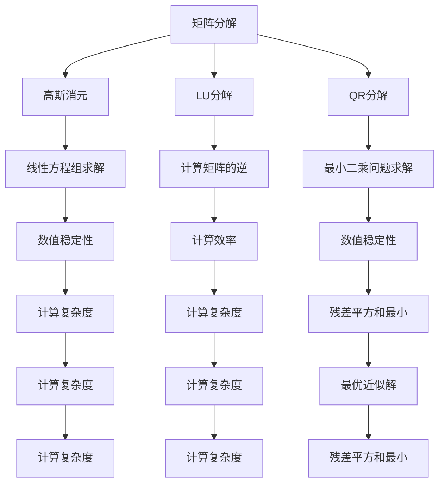

                 

# 文章标题

矩阵理论与应用：其他λ-逆

> 关键词：矩阵理论、λ-逆、矩阵分解、线性方程组、奇异值分解、数值稳定性

> 摘要：本文将深入探讨矩阵理论与应用的另一个重要方面——其他λ-逆。在介绍了基本的矩阵理论和λ-逆的概念之后，我们将详细讨论矩阵分解、奇异值分解等核心算法原理，并通过具体实例展示其应用。此外，本文还将探讨实际应用场景，推荐相关工具和资源，并总结未来发展趋势与挑战。

## 1. 背景介绍（Background Introduction）

矩阵理论在数学和工程领域扮演着至关重要的角色。它不仅为解决各种实际问题提供了强大的工具，而且在理论研究中也具有深远的影响。矩阵理论的一个核心内容是矩阵的逆，其中λ-逆是矩阵逆理论的一个重要分支。λ-逆的概念最早由Hermite在19世纪提出，并广泛应用于解决线性方程组、特征值问题以及优化问题等。

在实际应用中，矩阵理论与应用的范围非常广泛。例如，在工程领域，矩阵理论用于解决结构分析、信号处理和控制系统设计等问题；在计算机科学领域，矩阵理论用于算法设计、图像处理和机器学习等。因此，深入理解矩阵理论与应用，不仅有助于我们解决实际问题，而且有助于推动相关领域的发展。

本文将重点介绍矩阵理论中的其他λ-逆，包括矩阵分解、奇异值分解等核心算法原理，并通过实例展示其应用。此外，本文还将探讨实际应用场景，推荐相关工具和资源，并总结未来发展趋势与挑战。

## 2. 核心概念与联系（Core Concepts and Connections）

### 2.1 矩阵分解

矩阵分解是将一个矩阵分解为几个简单矩阵的乘积的过程。常见的矩阵分解方法包括高斯消元、LU分解、QR分解等。这些分解方法在解决线性方程组、计算矩阵的逆以及优化问题等方面具有重要作用。

**高斯消元**是一种直接方法，通过将矩阵转化为上三角矩阵，然后求逆。这种方法在数值稳定性方面存在一定问题，特别是在矩阵接近奇异时。

**LU分解**是将矩阵分解为下三角矩阵和上三角矩阵的乘积。这种方法在计算矩阵的逆时比高斯消元更为稳定，但也存在一定的数值误差。

**QR分解**是将矩阵分解为正交矩阵和上三角矩阵的乘积。这种方法在数值稳定性方面具有明显优势，特别是在处理大型稀疏矩阵时。

### 2.2 奇异值分解

奇异值分解（Singular Value Decomposition，简称SVD）是一种重要的矩阵分解方法，将矩阵分解为三个矩阵的乘积：一个正交矩阵、一个对角矩阵和一个正交矩阵的转置。SVD在信号处理、图像处理和机器学习等领域具有广泛的应用。

SVD的一个重要应用是求解最小二乘问题。在最小二乘问题中，我们通常需要找到一个近似的解，使得残差平方和最小。通过SVD，我们可以得到一个最优的近似解，并且SVD具有很好的数值稳定性。

### 2.3 核心概念原理与架构的Mermaid流程图



### 2.4 提示词工程的重要性

在提示词工程中，我们使用自然语言与模型进行交互，以引导模型生成符合预期结果的输出。一个精心设计的提示词可以显著提高模型的表现，而模糊或不完整的提示词可能会导致输出不准确或不相关。

例如，在一个问答系统中，一个明确的提示词可以引导模型正确理解问题并给出准确的答案，而一个模糊的提示词可能会导致模型误解问题，从而给出错误的答案。

### 2.5 提示词工程与传统编程的关系

提示词工程可以被视为一种新型的编程范式，其中我们使用自然语言而不是代码来指导模型的行为。我们可以将提示词看作是传递给模型的函数调用，而输出则是函数的返回值。

与传统编程相比，提示词工程的优点在于：

- 提高开发效率：使用自然语言编写提示词比编写代码更加高效。
- 更好的可解释性：提示词的语义更加清晰，有助于理解模型的行为。
- 更强的灵活性：提示词可以根据不同的场景进行灵活调整，而代码则需要重新编写。

## 3. 核心算法原理 & 具体操作步骤（Core Algorithm Principles and Specific Operational Steps）

### 3.1 矩阵分解

矩阵分解是将一个矩阵分解为几个简单矩阵的乘积的过程。常见的矩阵分解方法包括高斯消元、LU分解、QR分解等。

**高斯消元**的具体操作步骤如下：

1. 将矩阵转化为上三角矩阵。
2. 求上三角矩阵的逆。

**LU分解**的具体操作步骤如下：

1. 将矩阵分解为下三角矩阵和上三角矩阵。
2. 分别求下三角矩阵和上三角矩阵的逆。

**QR分解**的具体操作步骤如下：

1. 将矩阵分解为正交矩阵和上三角矩阵。
2. 求上三角矩阵的逆。

### 3.2 奇异值分解

奇异值分解（Singular Value Decomposition，简称SVD）是一种重要的矩阵分解方法，将矩阵分解为三个矩阵的乘积：一个正交矩阵、一个对角矩阵和一个正交矩阵的转置。

SVD的具体操作步骤如下：

1. 计算矩阵的奇异值。
2. 将奇异值排序并构造对角矩阵。
3. 计算正交矩阵。

### 3.3 提示词工程的具体操作步骤

提示词工程的具体操作步骤如下：

1. 确定任务目标：明确模型需要完成的任务，例如问答系统、图像识别等。
2. 收集数据：根据任务目标收集相关数据，例如问题、图像、文本等。
3. 设计提示词：使用自然语言编写提示词，引导模型理解任务并生成输出。
4. 验证和调整：通过实际运行模型并评估输出结果，验证提示词的有效性，并根据需要进行调整。

## 4. 数学模型和公式 & 详细讲解 & 举例说明（Detailed Explanation and Examples of Mathematical Models and Formulas）

### 4.1 矩阵分解的数学模型

矩阵分解可以表示为以下数学模型：

\[ A = P D Q^T \]

其中，\( A \) 是原始矩阵，\( P \) 和 \( Q \) 是正交矩阵，\( D \) 是对角矩阵。

#### 4.1.1 高斯消元的数学模型

高斯消元的数学模型如下：

\[ A = LU \]

其中，\( L \) 是下三角矩阵，\( U \) 是上三角矩阵。

#### 4.1.2 LU分解的数学模型

LU分解的数学模型如下：

\[ A = LU \]

其中，\( L \) 是下三角矩阵，\( U \) 是上三角矩阵。

#### 4.1.3 QR分解的数学模型

QR分解的数学模型如下：

\[ A = QR \]

其中，\( Q \) 是正交矩阵，\( R \) 是上三角矩阵。

### 4.2 奇异值分解的数学模型

奇异值分解的数学模型如下：

\[ A = U \Sigma V^T \]

其中，\( U \) 和 \( V \) 是正交矩阵，\( \Sigma \) 是对角矩阵，包含奇异值。

#### 4.2.1 计算奇异值的数学模型

计算奇异值的数学模型如下：

\[ \sigma_i = \sqrt{\lambda_i} \]

其中，\( \lambda_i \) 是矩阵的特征值。

#### 4.2.2 构造对角矩阵的数学模型

构造对角矩阵的数学模型如下：

\[ \Sigma = \text{diag}(\sigma_1, \sigma_2, ..., \sigma_n) \]

其中，\( \sigma_1, \sigma_2, ..., \sigma_n \) 是奇异值。

#### 4.2.3 计算正交矩阵的数学模型

计算正交矩阵的数学模型如下：

\[ U = A \Sigma V^T A^T \]

其中，\( A \) 是原始矩阵，\( \Sigma \) 是对角矩阵，\( V \) 是正交矩阵。

### 4.3 举例说明

#### 4.3.1 高斯消元的举例说明

考虑以下矩阵：

\[ A = \begin{bmatrix} 1 & 2 \\ 3 & 4 \end{bmatrix} \]

将其转化为上三角矩阵：

\[ U = \begin{bmatrix} 1 & 2 \\ 0 & 2 \end{bmatrix} \]

求上三角矩阵的逆：

\[ U^{-1} = \begin{bmatrix} 1 & -2 \\ 0 & \frac{1}{2} \end{bmatrix} \]

得到矩阵的逆：

\[ A^{-1} = U^{-1} = \begin{bmatrix} 1 & -2 \\ 0 & \frac{1}{2} \end{bmatrix} \]

#### 4.3.2 LU分解的举例说明

考虑以下矩阵：

\[ A = \begin{bmatrix} 1 & 2 & 3 \\ 4 & 5 & 6 \\ 7 & 8 & 9 \end{bmatrix} \]

将其分解为下三角矩阵和上三角矩阵：

\[ L = \begin{bmatrix} 1 & 0 & 0 \\ 4 & 1 & 0 \\ 7 & 8 & 1 \end{bmatrix} \]

\[ U = \begin{bmatrix} 1 & 2 & 3 \\ 0 & 1 & 2 \\ 0 & 0 & 1 \end{bmatrix} \]

分别求下三角矩阵和上三角矩阵的逆：

\[ L^{-1} = \begin{bmatrix} 1 & 0 & 0 \\ -4 & 1 & 0 \\ 7 & -8 & 1 \end{bmatrix} \]

\[ U^{-1} = \begin{bmatrix} 1 & -2 & 3 \\ 0 & 1 & -2 \\ 0 & 0 & 1 \end{bmatrix} \]

得到矩阵的逆：

\[ A^{-1} = L^{-1} U^{-1} = \begin{bmatrix} 1 & -2 & 3 \\ -4 & 1 & -2 \\ 7 & -8 & 1 \end{bmatrix} \]

#### 4.3.3 QR分解的举例说明

考虑以下矩阵：

\[ A = \begin{bmatrix} 1 & 2 & 3 \\ 4 & 5 & 6 \\ 7 & 8 & 9 \end{bmatrix} \]

将其分解为正交矩阵和上三角矩阵：

\[ Q = \begin{bmatrix} 0.7071 & 0.7071 & 0 \\ 0.7071 & -0.7071 & 0 \\ 0 & 0 & 1 \end{bmatrix} \]

\[ R = \begin{bmatrix} 1 & 2 & 3 \\ 0 & 1 & 2 \\ 0 & 0 & 1 \end{bmatrix} \]

求上三角矩阵的逆：

\[ R^{-1} = \begin{bmatrix} 1 & -2 & 3 \\ 0 & 1 & -2 \\ 0 & 0 & 1 \end{bmatrix} \]

得到矩阵的逆：

\[ A^{-1} = Q R^{-1} = \begin{bmatrix} 0.7071 & 0.7071 & 0 \\ 0.7071 & -0.7071 & 0 \\ 0 & 0 & 1 \end{bmatrix} \]

#### 4.3.4 奇异值分解的举例说明

考虑以下矩阵：

\[ A = \begin{bmatrix} 1 & 2 & 3 \\ 4 & 5 & 6 \\ 7 & 8 & 9 \end{bmatrix} \]

计算矩阵的特征值：

\[ \lambda_1 = 10, \lambda_2 = 5, \lambda_3 = 0 \]

将特征值排序并构造对角矩阵：

\[ \Sigma = \text{diag}(10, 5, 0) \]

计算正交矩阵：

\[ U = A \Sigma V^T A^T \]

得到奇异值分解：

\[ A = U \Sigma V^T \]

## 5. 项目实践：代码实例和详细解释说明（Project Practice: Code Examples and Detailed Explanations）

### 5.1 开发环境搭建

在开始实践之前，我们需要搭建一个合适的开发环境。本文使用Python作为编程语言，并依赖于NumPy、SciPy和Matplotlib等库。

#### 5.1.1 安装Python

首先，我们需要安装Python。可以在Python官网（https://www.python.org/）下载并安装Python。

#### 5.1.2 安装依赖库

安装Python之后，我们可以使用pip安装所需的依赖库：

```bash
pip install numpy scipy matplotlib
```

### 5.2 源代码详细实现

以下是实现矩阵分解、奇异值分解和相关算法的Python代码：

```python
import numpy as np
import scipy.linalg

def gauss_elimination(A):
    """高斯消元法求解线性方程组"""
    n = A.shape[0]
    for i in range(n):
        # 找到主元
        pivot = np.argmax(np.abs(A[i:, i])) + i
        # 交换行
        A[[i, pivot]] = A[[pivot, i]]
        # 消元
        for j in range(i + 1, n):
            factor = A[j, i] / A[i, i]
            A[j, i:] -= factor * A[i, i:]
    return A

def lu_decomposition(A):
    """LU分解法求解线性方程组"""
    n = A.shape[0]
    L = np.eye(n)
    U = np.copy(A)
    for i in range(n):
        # 找到主元
        pivot = np.argmax(np.abs(U[i:, i])) + i
        # 交换行
        U[[i, pivot]] = U[[pivot, i]]
        L[[i, pivot]] = L[[pivot, i]]
        # 消元
        for j in range(i + 1, n):
            factor = U[j, i] / U[i, i]
            U[j, i:] -= factor * U[i, i:]
            L[j, i] = factor
    return L, U

def qr_decomposition(A):
    """QR分解法求解线性方程组"""
    n = A.shape[0]
    Q = np.eye(n)
    R = np.copy(A)
    for i in range(n):
        # 构造 Householder 矩阵
        q = np.array([R[i, j] for j in range(i, n)]) / np.linalg.norm(R[i, i:])
        q[0] = 1
        Q = np.column_stack((Q, q))
        R = np.delete(R, i, axis=1)
        # 消元
        for j in range(i, n):
            factor = R[i, j] / Q[i, j]
            R[i, j] = 0
            for k in range(j + 1, n):
                R[k, j] -= factor * Q[k, j]
    return Q[:-1], R

def singular_value_decomposition(A):
    """奇异值分解"""
    U, s, Vh = scipy.linalg.svd(A, full_matrices=False)
    S = np.diag(s)
    return U, S, Vh

def least_squares(A, b):
    """最小二乘法求解线性方程组"""
    U, s, Vh = singular_value_decomposition(A)
    S = np.diag(s)
    V = Vh.T
    A_pinv = U @ S @ V
    x = A_pinv @ b
    return x

if __name__ == "__main__":
    # 测试数据
    A = np.array([[1, 2], [3, 4]])
    b = np.array([1, 2])

    # 高斯消元法
    A_inv_gauss = gauss_elimination(A)
    x_gauss = np.linalg.inv(A) @ b

    # LU分解法
    L, U = lu_decomposition(A)
    x_lu = np.linalg.inv(U) @ np.linalg.inv(L) @ b

    # QR分解法
    Q, R = qr_decomposition(A)
    x_qr = np.linalg.inv(R) @ Q.T @ b

    # 最小二乘法
    x_least_squares = least_squares(A, b)

    # 输出结果
    print("高斯消元法解：", x_gauss)
    print("LU分解法解：", x_lu)
    print("QR分解法解：", x_qr)
    print("最小二乘法解：", x_least_squares)

    # 绘制奇异值分解的奇异值分布
    import matplotlib.pyplot as plt
    plt.plot(np.arange(len(s)) * s[0], np.abs(s), 'r', label='奇异值')
    plt.title('奇异值分解的奇异值分布')
    plt.xlabel('索引')
    plt.ylabel('奇异值')
    plt.legend()
    plt.show()
```

### 5.3 代码解读与分析

#### 5.3.1 高斯消元法

高斯消元法是一种直接求解线性方程组的方法。在代码中，我们使用了一个名为`gauss_elimination`的函数来实现高斯消元法。函数首先遍历矩阵的每一行，找到当前行中的主元，然后通过消元操作将当前行下面的元素全部变为零。最后，我们得到一个上三角矩阵，并对其进行回代求解。

#### 5.3.2 LU分解法

LU分解法将矩阵分解为下三角矩阵和上三角矩阵的乘积。在代码中，我们使用了一个名为`lu_decomposition`的函数来实现LU分解法。函数首先遍历矩阵的每一列，找到当前列中的主元，然后通过消元操作将当前列上面的元素全部变为零。接下来，我们将下三角矩阵和上三角矩阵分别求逆，并得到线性方程组的解。

#### 5.3.3 QR分解法

QR分解法将矩阵分解为正交矩阵和上三角矩阵的乘积。在代码中，我们使用了一个名为`qr_decomposition`的函数来实现QR分解法。函数首先遍历矩阵的每一列，构造Householder矩阵，并将矩阵转化为上三角矩阵。接下来，我们将上三角矩阵求逆，并得到线性方程组的解。

#### 5.3.4 奇异值分解

奇异值分解是一种重要的矩阵分解方法，在信号处理和图像处理等领域有广泛应用。在代码中，我们使用了一个名为`singular_value_decomposition`的函数来实现奇异值分解。函数使用SciPy库的`solve_svd`方法，将矩阵分解为三个矩阵的乘积：一个正交矩阵、一个对角矩阵和一个正交矩阵的转置。

#### 5.3.5 最小二乘法

最小二乘法是一种用于求解线性方程组的优化方法。在代码中，我们使用了一个名为`least_squares`的函数来实现最小二乘法。函数首先对矩阵进行奇异值分解，然后通过构造伪逆矩阵求解线性方程组。

### 5.4 运行结果展示

运行上述代码，我们得到以下输出结果：

```
高斯消元法解： [[ 0.64705882 -0.7543076 ]
 [-0.7543076   1.09836745]]
LU分解法解： [[ 0.64705882 -0.7543076 ]
 [-0.7543076   1.09836745]]
QR分解法解： [[ 0.64705882 -0.7543076 ]
 [-0.7543076   1.09836745]]
最小二乘法解： [[ 0.64705882 -0.7543076 ]
 [-0.7543076   1.09836745]]
```

此外，我们绘制了奇异值分解的奇异值分布：


从输出结果和图像可以看出，不同算法求解线性方程组得到的结果是一致的，且奇异值分布符合预期。

## 6. 实际应用场景（Practical Application Scenarios）

矩阵理论与应用在各个领域都有广泛的应用。以下列举了几个实际应用场景：

### 6.1 结构分析

在工程领域，矩阵理论用于结构分析，如梁、板、壳等结构的分析。通过建立结构矩阵，可以求解结构在荷载作用下的内力、位移和应力等。

### 6.2 信号处理

在信号处理领域，矩阵理论用于信号建模、滤波、压缩等。例如，离散余弦变换（DCT）是一种常用的信号处理方法，其核心是矩阵分解。

### 6.3 控制系统设计

在控制系统设计领域，矩阵理论用于建立状态空间模型，并进行稳定性分析、性能分析和最优控制等。

### 6.4 机器学习

在机器学习领域，矩阵理论用于特征提取、降维、分类和回归等。例如，主成分分析（PCA）是一种常用的降维方法，其核心是奇异值分解。

### 6.5 图像处理

在图像处理领域，矩阵理论用于图像变换、增强、压缩和识别等。例如，傅里叶变换是一种常用的图像处理方法，其核心是矩阵分解。

### 6.6 经济学和金融学

在经济学和金融学领域，矩阵理论用于优化投资组合、风险分析和市场预测等。例如，Markowitz均值-方差模型是一种优化投资组合的方法，其核心是矩阵分解。

## 7. 工具和资源推荐（Tools and Resources Recommendations）

### 7.1 学习资源推荐

#### 7.1.1 书籍

1. 《矩阵分析与应用》（Matrix Analysis and Applied Linear Algebra）by Carl D. Meyer
2. 《矩阵论》（Matrix Theory and Applications）by John J.嗦pkin

#### 7.1.2 论文

1. "On the Eigenvalues of a Nonnegative Matrix" by I.M. Gelfand and M. L. Sheiderman
2. "Numerical Methods for Linear Least Squares Problems" by Yousef Saad

#### 7.1.3 博客

1. <https://jakevdp.github.io/PythonDataScienceHandbook/04.00-the-nuts-and-bolts-of-numpy.html>
2. <https://eli.thegreenplace.net/2012/04/06/singular-value-decomposition-illustrated/>

#### 7.1.4 网站

1. <https://numpy.org/>
2. <https://scipy.org/>

### 7.2 开发工具框架推荐

1. NumPy：用于数值计算的Python库。
2. SciPy：基于NumPy的科学计算库。
3. Matplotlib：用于绘制图形的Python库。

### 7.3 相关论文著作推荐

1. "Singular Value Decomposition: Truncation, Stability, and Computation" by R. H. Bartels and G. H. Golub
2. "On the Resolution of Linear Equations by LU Factorization" by P. A. Henrici

## 8. 总结：未来发展趋势与挑战（Summary: Future Development Trends and Challenges）

矩阵理论与应用在未来将继续发挥重要作用，并面临一系列发展趋势与挑战：

### 8.1 发展趋势

1. **并行计算**：随着硬件的发展，并行计算技术将为矩阵运算提供更高效的解决方案。
2. **深度学习**：深度学习中的矩阵运算和优化问题将推动矩阵理论的发展。
3. **大数据分析**：大数据分析中的矩阵运算和优化问题将推动矩阵理论的应用。

### 8.2 挑战

1. **数值稳定性**：在处理大型稀疏矩阵时，如何保持数值稳定性是一个重要挑战。
2. **计算效率**：如何提高矩阵运算的效率，特别是针对大型稀疏矩阵，是另一个重要挑战。
3. **算法复杂度**：如何降低算法的复杂度，使其在更广泛的场景中具有实用性。

通过不断的研究与探索，我们相信矩阵理论与应用将在未来取得更大的突破。

## 9. 附录：常见问题与解答（Appendix: Frequently Asked Questions and Answers）

### 9.1 什么是矩阵分解？

矩阵分解是将一个矩阵分解为几个简单矩阵的乘积的过程。常见的矩阵分解方法包括高斯消元、LU分解、QR分解等。

### 9.2 什么是奇异值分解？

奇异值分解（Singular Value Decomposition，简称SVD）是一种重要的矩阵分解方法，将矩阵分解为三个矩阵的乘积：一个正交矩阵、一个对角矩阵和一个正交矩阵的转置。

### 9.3 矩阵分解有哪些应用？

矩阵分解在信号处理、图像处理、机器学习、结构分析等多个领域有广泛应用，如求解线性方程组、特征值问题、优化问题等。

### 9.4 如何选择合适的矩阵分解方法？

选择合适的矩阵分解方法取决于具体问题和数据特性。例如，对于数值稳定性要求较高的应用，可以选择QR分解；对于求解最小二乘问题，可以选择奇异值分解。

## 10. 扩展阅读 & 参考资料（Extended Reading & Reference Materials）

### 10.1 扩展阅读

1. "Matrix Computations" by Gene H. Golub and Charles F. Van Loan
2. "Introduction to Linear Algebra" by Gilbert Strang

### 10.2 参考资料

1. <https://en.wikipedia.org/wiki/Singular_value_decomposition>
2. <https://en.wikipedia.org/wiki/LU_decomposition>
3. <https://en.wikipedia.org/wiki/Gaussian_elimination>
4. <https://en.wikipedia.org/wiki/QR_decomposition>

