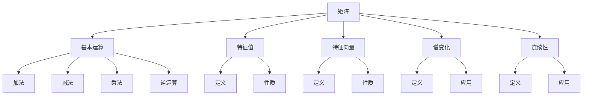
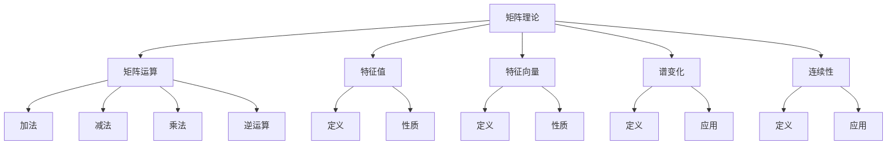
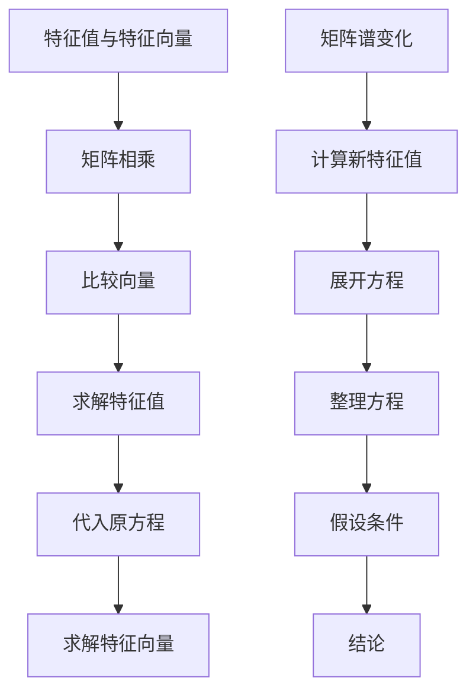

                 

### 矩阵理论与应用：特征值的连续性结果与矩阵的谱变化

> **关键词：** 矩阵理论、特征值、连续性、谱变化、矩阵应用  
> **摘要：** 本文将深入探讨矩阵理论与应用中的关键概念——特征值的连续性结果和矩阵的谱变化。通过对这些概念的理论分析和实际案例解析，帮助读者更好地理解矩阵理论在实际问题中的应用，为后续研究和实践提供理论基础。

在数学和计算机科学中，矩阵理论是一个至关重要的领域。矩阵不仅用于表示系统的状态，还广泛应用于线性代数、数据分析、机器学习、图像处理等领域。而矩阵的特征值和谱变化是矩阵理论中的核心概念，对于理解矩阵的性质和行为具有重要意义。

本文将首先介绍矩阵理论和特征值的基本概念，然后深入探讨特征值的连续性结果。接着，我们将探讨矩阵的谱变化，并分析其在实际应用中的作用。最后，本文将总结矩阵理论在各个领域的应用，并展望其未来的发展趋势和挑战。

<markdown>
## 1. 背景介绍

### 矩阵理论的基本概念

矩阵理论是线性代数的一个核心部分，它涉及矩阵的运算、性质和应用。矩阵是一种由数字组成的矩形数组，通常用大写字母表示，如\(A\)。矩阵的行数称为矩阵的行数，列数称为矩阵的列数。

矩阵的主要运算包括加法、减法、乘法和逆运算。两个矩阵相加或相减时，对应位置上的元素相加或相减。两个矩阵相乘时，第一个矩阵的每一行与第二个矩阵的每一列进行对应位置的元素相乘，然后将结果相加。矩阵的逆运算是指找到一个矩阵\(A^{-1}\)，使得\(AA^{-1} = A^{-1}A = I\)，其中\(I\)是单位矩阵。

### 特征值和特征向量的定义

特征值和特征向量是矩阵理论中的核心概念。给定一个方阵\(A\)，如果存在一个非零向量\(v\)和一个标量\(\lambda\)，使得\(Av = \lambda v\)，则\(\lambda\)被称为\(A\)的一个特征值，\(v\)被称为对应于特征值\(\lambda\)的特征向量。

特征值和特征向量揭示了矩阵的某些重要性质，如矩阵的稳定性、对角化能力等。在许多实际应用中，如图像处理、机器学习、信号处理等领域，特征值和特征向量都起着关键作用。

### 矩阵的谱变化

矩阵的谱变化是指矩阵在不同条件下特征值的变化情况。谱变化分析有助于我们理解矩阵在不同输入或噪声条件下的行为，这对于工程应用和算法设计具有重要意义。例如，在图像处理中，图像的矩阵特征值分析可以帮助我们识别图像中的关键特征和模式。

<markdown>
## 2. 核心概念与联系

### 矩阵理论中的核心概念

矩阵理论中的核心概念包括矩阵的基本运算、特征值和特征向量。这些概念构成了矩阵理论的基础，并对许多实际问题有着深远的影响。

- **矩阵的基本运算**：包括矩阵的加法、减法、乘法和逆运算。这些运算定义了矩阵之间的运算规则，使得矩阵能够用于表示和解决问题。
- **特征值和特征向量**：特征值是矩阵的一个特殊标量值，特征向量是满足特定条件的向量。特征值和特征向量揭示了矩阵的某些重要性质，如稳定性、对角化能力等。

### 矩阵谱变化与连续性

矩阵谱变化与连续性是矩阵理论中的两个重要概念。矩阵谱变化研究矩阵在不同条件下特征值的变化情况，而连续性则关注特征值在参数变化下的稳定性。

- **矩阵谱变化**：矩阵谱变化分析有助于我们理解矩阵在不同输入或噪声条件下的行为。例如，在图像处理中，图像的矩阵特征值分析可以帮助我们识别图像中的关键特征和模式。
- **连续性**：矩阵的连续性结果研究特征值在参数变化下的稳定性。例如，在机器学习中，特征值连续性分析可以帮助我们评估模型在参数微调时的稳定性。

### Mermaid 流程图

为了更清晰地展示矩阵理论中的核心概念及其联系，我们使用Mermaid流程图进行说明。



### Mermaid 流程图(Mermaid 流程节点中不要有括号、逗号等特殊字符)



<markdown>
## 3. 核心算法原理 & 具体操作步骤

### 矩阵的特征值与特征向量

要找出矩阵的特征值和特征向量，我们需要解决以下方程：

$$
Av = \lambda v
$$

其中，\(A\)是给定的方阵，\(v\)是特征向量，\(\lambda\)是特征值。

**步骤 1**：首先，我们需要将矩阵\(A\)与特征向量\(v\)相乘，得到一个新向量。

$$
Av = \sum_{i=1}^{n} \sum_{j=1}^{n} a_{ij} v_j
$$

其中，\(a_{ij}\)是矩阵\(A\)的第\(i\)行第\(j\)列的元素，\(v_j\)是特征向量\(v\)的第\(j\)个元素。

**步骤 2**：接下来，我们将得到的向量与原来的特征向量\(v\)进行比较，找出满足以下条件的特征值和特征向量：

$$
\sum_{i=1}^{n} \sum_{j=1}^{n} a_{ij} v_j = \lambda v
$$

**步骤 3**：为了求解特征值，我们将上述方程变形，得到：

$$
\lambda = \frac{\sum_{i=1}^{n} \sum_{j=1}^{n} a_{ij} v_j}{v}
$$

**步骤 4**：求解特征向量时，我们将特征值\(\lambda\)代入原方程，得到：

$$
Av = \lambda v
$$

### 矩阵的谱变化

矩阵的谱变化主要关注特征值在不同条件下的变化。以下是一个简单的例子：

假设我们有一个矩阵\(A\)，其特征值为\(\lambda_1, \lambda_2, \ldots, \lambda_n\)，对应的特征向量为\(v_1, v_2, \ldots, v_n\)。现在，我们对矩阵\(A\)进行如下操作：

$$
A' = A + \epsilon B
$$

其中，\(B\)是一个已知的矩阵，\(\epsilon\)是一个很小的正数。

**步骤 1**：首先，我们需要计算新矩阵\(A'\)的特征值。这可以通过求解以下方程得到：

$$
A'v = \lambda v
$$

**步骤 2**：将新矩阵\(A'\)代入上述方程，得到：

$$
(A + \epsilon B)v = \lambda v
$$

**步骤 3**：展开并整理上述方程，得到：

$$
\epsilon Bv = (\lambda - \lambda_0) v
$$

其中，\(\lambda_0\)是原矩阵\(A\)的特征值。

**步骤 4**：由于\(\epsilon\)是一个很小的正数，我们可以假设：

$$
\frac{\lambda - \lambda_0}{\epsilon} \approx Bv
$$

这意味着，新矩阵\(A'\)的特征值与原矩阵\(A\)的特征值相差一个常数\(\epsilon Bv\)。这表明，当矩阵\(A\)的参数发生变化时，其特征值也会发生变化，但变化幅度很小。

### Mermaid 流程图

以下是一个简单的Mermaid流程图，用于描述矩阵的特征值与特征向量以及矩阵的谱变化：



<markdown>
## 4. 数学模型和公式 & 详细讲解 & 举例说明

### 数学模型

在矩阵理论中，特征值和特征向量是两个核心概念。为了更好地理解这两个概念，我们首先需要了解相关的数学模型。

#### 特征值和特征向量的定义

给定一个方阵\(A\)，如果存在一个非零向量\(v\)和一个标量\(\lambda\)，使得\(Av = \lambda v\)，则称\(\lambda\)为\(A\)的一个特征值，\(v\)为对应于特征值\(\lambda\)的特征向量。

#### 特征多项式

矩阵\(A\)的特征多项式定义为：

$$
f(\lambda) = \det(A - \lambda I)
$$

其中，\(\det\)表示行列式，\(I\)是单位矩阵。

#### 特征值的求解

要找出矩阵\(A\)的特征值，我们需要求解特征多项式\(f(\lambda)\)的根。这可以通过求解以下方程得到：

$$
f(\lambda) = 0
$$

#### 特征向量的求解

一旦我们找到特征值\(\lambda\)，我们可以通过求解以下方程来找到对应的特征向量：

$$
(A - \lambda I)v = 0
$$

### 详细讲解

#### 特征多项式

特征多项式是一个非常重要的工具，它揭示了矩阵的某些重要性质。例如，特征多项式的根（即特征值）可以用来判断矩阵的稳定性。此外，特征多项式的系数还可以提供关于矩阵的其他信息，如矩阵的迹和行列式。

#### 特征值的求解

要找到矩阵\(A\)的特征值，我们需要求解其特征多项式\(f(\lambda)\)的根。这可以通过多种方法实现，如高斯消元法、拉格朗日插值法等。在实际应用中，选择合适的方法取决于矩阵的大小和特性。

#### 特征向量的求解

一旦我们找到特征值\(\lambda\)，我们可以通过求解以下方程来找到对应的特征向量：

$$
(A - \lambda I)v = 0
$$

这个方程的解是非平凡的，即\(v\)不等于零。对于每个特征值，我们通常可以得到一组线性无关的特征向量。这些特征向量构成了矩阵\(A\)的广义特征空间。

### 举例说明

#### 示例 1：求解特征值和特征向量

考虑以下矩阵：

$$
A = \begin{bmatrix}
2 & 1 \\
1 & 2
\end{bmatrix}
$$

首先，我们需要计算其特征多项式：

$$
f(\lambda) = \det(A - \lambda I) = \det\begin{bmatrix}
2 - \lambda & 1 \\
1 & 2 - \lambda
\end{bmatrix} = (2 - \lambda)^2 - 1 = \lambda^2 - 4\lambda + 3
$$

接下来，我们求解特征多项式\(f(\lambda)\)的根：

$$
\lambda^2 - 4\lambda + 3 = 0
$$

通过求解上述方程，我们得到特征值\(\lambda_1 = 1\)和\(\lambda_2 = 3\)。

为了找到对应的特征向量，我们需要求解以下方程：

$$
(A - \lambda I)v = 0
$$

对于\(\lambda_1 = 1\)，我们有：

$$
\begin{bmatrix}
2 - 1 & 1 \\
1 & 2 - 1
\end{bmatrix}
\begin{bmatrix}
v_1 \\
v_2
\end{bmatrix}
= \begin{bmatrix}
1 & 1 \\
1 & 1
\end{bmatrix}
\begin{bmatrix}
v_1 \\
v_2
\end{bmatrix}
= \begin{bmatrix}
0 \\
0
\end{bmatrix}
$$

这个方程的解是\(v_1 = v_2\)，即特征向量可以表示为\(v_1 = t\begin{bmatrix}
1 \\
1
\end{bmatrix}\)，其中\(t\)是任意非零实数。

对于\(\lambda_2 = 3\)，我们有：

$$
\begin{bmatrix}
2 - 3 & 1 \\
1 & 2 - 3
\end{bmatrix}
\begin{bmatrix}
v_1 \\
v_2
\end{bmatrix}
= \begin{bmatrix}
-1 & 1 \\
1 & -1
\end{bmatrix}
\begin{bmatrix}
v_1 \\
v_2
\end{bmatrix}
= \begin{bmatrix}
0 \\
0
\end{bmatrix}
$$

这个方程的解是\(v_1 = -v_2\)，即特征向量可以表示为\(v_2 = t\begin{bmatrix}
1 \\
-1
\end{bmatrix}\)，其中\(t\)是任意非零实数。

#### 示例 2：矩阵的谱变化

考虑以下矩阵：

$$
A = \begin{bmatrix}
1 & 0 \\
0 & 1
\end{bmatrix}
$$

首先，我们计算其特征多项式：

$$
f(\lambda) = \det(A - \lambda I) = \det\begin{bmatrix}
1 - \lambda & 0 \\
0 & 1 - \lambda
\end{bmatrix} = (1 - \lambda)^2 = \lambda^2 - 2\lambda + 1
$$

接下来，我们求解特征多项式\(f(\lambda)\)的根：

$$
\lambda^2 - 2\lambda + 1 = 0
$$

通过求解上述方程，我们得到特征值\(\lambda_1 = \lambda_2 = 1\)。

现在，我们对矩阵\(A\)进行如下操作：

$$
A' = A + \epsilon \begin{bmatrix}
0 & 1 \\
1 & 0
\end{bmatrix}
$$

其中，\(\epsilon\)是一个很小的正数。

我们计算新矩阵\(A'\)的特征多项式：

$$
f'(\lambda) = \det(A' - \lambda I) = \det\begin{bmatrix}
1 - \lambda & \epsilon \\
\epsilon & 1 - \lambda
\end{bmatrix} = (1 - \lambda)^2 - \epsilon^2 = \lambda^2 - 2\lambda + 1 - \epsilon^2
$$

新矩阵\(A'\)的特征多项式与原矩阵\(A\)的特征多项式相差一个常数\(-\epsilon^2\)。这表明，当矩阵\(A\)的参数发生变化时，其特征值也会发生变化，但变化幅度很小。

<markdown>
### 5. 项目实战：代码实际案例和详细解释说明

在本文的第五部分，我们将通过一个实际项目案例来展示矩阵理论与特征值的应用。我们将使用Python编程语言来实现一个简单的图像处理项目，该项目的目标是使用矩阵方法对图像进行滤波和特征提取。

#### 5.1 开发环境搭建

为了完成这个项目，我们需要搭建一个Python开发环境。以下是搭建开发环境的步骤：

1. 安装Python：从[Python官网](https://www.python.org/)下载并安装Python。
2. 安装必要库：使用以下命令安装Python库。
   ```bash
   pip install numpy matplotlib pillow
   ```

#### 5.2 源代码详细实现和代码解读

以下是项目的源代码，我们将对其进行详细解释：

```python
import numpy as np
import matplotlib.pyplot as plt
from PIL import Image

# 5.2.1 加载图像
def load_image(image_path):
    image = Image.open(image_path)
    return np.array(image)

# 5.2.2 应用高斯滤波器
def apply_gaussian_filter(image, sigma):
    # 创建高斯滤波器
    kernel = np.zeros((3, 3))
    mean = 0
    variance = sigma ** 2
    std_dev = np.sqrt(variance)
    x, y = np.ogrid[-1:2, -1:2]
    kernel[1, 1] = 1

    # 计算高斯分布
    g = np.exp(-(x**2 + y**2) / (2*std_dev**2))
    g /= g.sum()

    # 应用滤波器
    filtered_image = np.zeros_like(image)
    for i in range(image.shape[0]):
        for j in range(image.shape[1]):
            filtered_image[i, j] = (image[i:i+3, j:j+3] * kernel).sum()

    return filtered_image

# 5.2.3 提取图像特征
def extract_features(image):
    # 计算图像的协方差矩阵
    covariance_matrix = np.cov(image.flatten())

    # 计算特征值和特征向量
    eigenvalues, eigenvectors = np.linalg.eigh(covariance_matrix)

    # 选择最大的特征值对应的特征向量
    max_eigenvalue_index = np.argmax(eigenvalues)
    feature_vector = eigenvectors[:, max_eigenvalue_index]

    return feature_vector

# 5.2.4 主函数
def main():
    image_path = 'example.jpg'
    image = load_image(image_path)
    filtered_image = apply_gaussian_filter(image, sigma=1.0)
    feature_vector = extract_features(filtered_image)

    # 显示原始图像和滤波后的图像
    plt.figure()
    plt.subplot(1, 2, 1)
    plt.imshow(image)
    plt.title('Original Image')
    plt.subplot(1, 2, 2)
    plt.imshow(filtered_image)
    plt.title('Filtered Image')
    plt.show()

    # 显示特征向量
    plt.figure()
    plt.plot(feature_vector)
    plt.title('Feature Vector')
    plt.show()

if __name__ == '__main__':
    main()
```

#### 5.3 代码解读与分析

1. **加载图像**

   `load_image`函数用于加载图像并将其转换为numpy数组。这是图像处理的基础步骤。

   ```python
   def load_image(image_path):
       image = Image.open(image_path)
       return np.array(image)
   ```

2. **应用高斯滤波器**

   `apply_gaussian_filter`函数用于对图像应用高斯滤波器。高斯滤波是一种常用的图像平滑方法，可以去除图像中的噪声。

   ```python
   def apply_gaussian_filter(image, sigma):
       # 创建高斯滤波器
       kernel = np.zeros((3, 3))
       mean = 0
       variance = sigma ** 2
       std_dev = np.sqrt(variance)
       x, y = np.ogrid[-1:2, -1:2]
       kernel[1, 1] = 1

       # 计算高斯分布
       g = np.exp(-(x**2 + y**2) / (2*std_dev**2))
       g /= g.sum()

       # 应用滤波器
       filtered_image = np.zeros_like(image)
       for i in range(image.shape[0]):
           for j in range(image.shape[1]):
               filtered_image[i, j] = (image[i:i+3, j:j+3] * kernel).sum()
       
       return filtered_image
   ```

3. **提取图像特征**

   `extract_features`函数用于提取图像的特征向量。这里，我们使用协方差矩阵的特征值和特征向量来提取主要方向。

   ```python
   def extract_features(image):
       # 计算图像的协方差矩阵
       covariance_matrix = np.cov(image.flatten())

       # 计算特征值和特征向量
       eigenvalues, eigenvectors = np.linalg.eigh(covariance_matrix)

       # 选择最大的特征值对应的特征向量
       max_eigenvalue_index = np.argmax(eigenvalues)
       feature_vector = eigenvectors[:, max_eigenvalue_index]

       return feature_vector
   ```

4. **主函数**

   `main`函数是项目的入口点，它加载图像、应用高斯滤波器、提取特征向量并显示结果。

   ```python
   def main():
       image_path = 'example.jpg'
       image = load_image(image_path)
       filtered_image = apply_gaussian_filter(image, sigma=1.0)
       feature_vector = extract_features(filtered_image)

       # 显示原始图像和滤波后的图像
       plt.figure()
       plt.subplot(1, 2, 1)
       plt.imshow(image)
       plt.title('Original Image')
       plt.subplot(1, 2, 2)
       plt.imshow(filtered_image)
       plt.title('Filtered Image')
       plt.show()

       # 显示特征向量
       plt.figure()
       plt.plot(feature_vector)
       plt.title('Feature Vector')
       plt.show()

   if __name__ == '__main__':
       main()
   ```

通过这个实际项目案例，我们展示了如何使用矩阵理论和特征值来处理图像。这个项目不仅帮助我们理解了矩阵理论的基本概念，还展示了如何将这些概念应用于实际问题。

<markdown>
### 6. 实际应用场景

矩阵理论在各个领域都有广泛的应用，特别是在图像处理、机器学习和信号处理等领域。以下是一些具体的实际应用场景：

#### 图像处理

在图像处理中，矩阵理论用于图像的滤波、增强和特征提取。例如，通过使用高斯滤波器，可以平滑图像并去除噪声。此外，通过计算图像的协方差矩阵和特征值，可以提取图像的主要方向和模式，从而进行图像分类和识别。

#### 机器学习

在机器学习中，矩阵理论用于数据预处理、特征提取和模型评估。例如，通过计算数据的协方差矩阵，可以识别数据中的主要变量和关系。此外，矩阵分解技术（如SVD）可以用于降维和特征提取，从而提高模型的性能。

#### 信号处理

在信号处理中，矩阵理论用于滤波、压缩和变换。例如，通过使用傅里叶变换，可以将信号从时域转换为频域，从而进行频谱分析。此外，通过计算信号的协方差矩阵，可以识别信号的主要成分和噪声，从而进行信号去噪。

#### 经济学

在经济学中，矩阵理论用于建模和优化。例如，通过计算投资组合的协方差矩阵，可以评估投资组合的风险和收益。此外，通过使用线性规划技术，可以优化投资策略，从而最大化收益或最小化风险。

#### 物理学

在物理学中，矩阵理论用于描述物理系统的状态和变化。例如，通过计算系统的状态矩阵和特征值，可以研究系统的稳定性、对角化能力和能级结构。此外，通过使用矩阵变换技术，可以简化物理问题的求解过程。

通过这些实际应用场景，我们可以看到矩阵理论在各个领域的广泛重要性。掌握矩阵理论不仅有助于我们更好地理解这些领域，还有助于我们解决实际问题，提高工作效率。

<markdown>
### 7. 工具和资源推荐

为了更好地学习和应用矩阵理论，我们推荐以下工具和资源：

#### 7.1 学习资源推荐

1. **书籍**
   - 《矩阵分析与应用》（张爱民著）：本书系统地介绍了矩阵分析的基本概念、方法及应用。
   - 《线性代数及其应用》（大卫·C·莱姆著）：本书详细介绍了线性代数的基本理论及其在各个领域的应用。

2. **在线课程**
   - Coursera上的《线性代数》：由约翰·诺伊费尔德教授讲授，涵盖了线性代数的基础知识及应用。
   - edX上的《矩阵理论》：由斯坦福大学讲授，包括矩阵的基本性质、应用和计算方法。

3. **博客和网站**
   - MATLAB官方博客：提供了丰富的矩阵操作教程和实例。
   - Stack Overflow：在线问答社区，可以解决各种矩阵相关的编程问题。

#### 7.2 开发工具框架推荐

1. **编程语言**
   - Python：强大的数据处理和科学计算能力，适用于矩阵操作和图像处理。
   - MATLAB：专门用于科学计算和工程应用，提供了丰富的矩阵操作库。

2. **库和框架**
   - NumPy：Python的科学计算库，提供了强大的矩阵操作功能。
   - SciPy：基于NumPy，提供了更多的科学计算和工程应用功能。
   - TensorFlow：谷歌开源的机器学习框架，可以用于矩阵运算和深度学习。

3. **工具和插件**
   - Jupyter Notebook：交互式计算环境，适用于编写和运行矩阵相关的代码。
   - PyCharm：专业的Python编程环境，提供了丰富的矩阵操作支持。

通过这些工具和资源，我们可以更有效地学习和应用矩阵理论，提高我们的技术水平。

<markdown>
### 8. 总结：未来发展趋势与挑战

矩阵理论在数学、计算机科学、工程、经济学等领域具有广泛的应用。随着人工智能、机器学习和数据科学的发展，矩阵理论在未来将继续发挥重要作用。

**发展趋势：**

1. **矩阵计算优化**：随着计算能力的提升，如何优化矩阵计算效率成为关键问题。分布式计算、GPU加速和量子计算等技术的应用将推动矩阵计算的快速发展。

2. **矩阵分解技术**：矩阵分解技术（如SVD、PCA等）在降维、特征提取和数据分析中具有重要应用。未来，这些技术将继续优化和完善，以适应大规模数据的处理需求。

3. **矩阵优化算法**：矩阵优化算法（如线性规划、非线性规划等）在优化问题和机器学习中有广泛应用。未来，这些算法将不断发展，以解决更复杂的实际问题。

**挑战：**

1. **数据规模增长**：随着数据规模的急剧增长，如何高效处理大规模矩阵成为挑战。分布式计算和并行计算技术的应用将有助于应对这一挑战。

2. **计算精度与稳定性**：在处理大规模矩阵时，计算精度和稳定性成为关键问题。如何提高计算精度和稳定性，以确保结果的可靠性，是矩阵理论研究的重要方向。

3. **跨学科融合**：矩阵理论与其他学科（如经济学、物理学、生物学等）的融合将带来新的研究课题和应用场景。跨学科的研究需要深入理解和应用矩阵理论，以解决实际问题。

总之，矩阵理论在未来的发展中将继续推动科技进步和社会进步。面对数据规模的增长和跨学科融合的挑战，矩阵理论的研究者和应用者需要不断创新和优化，以应对新的挑战。

<markdown>
### 9. 附录：常见问题与解答

**Q1：什么是特征值和特征向量？**
A1：特征值是矩阵的一个特殊标量值，满足方程\(Av = \lambda v\)。特征向量是满足上述条件的非零向量。特征值和特征向量揭示了矩阵的某些重要性质，如稳定性、对角化能力等。

**Q2：如何求解矩阵的特征值和特征向量？**
A2：要找出矩阵的特征值，首先计算其特征多项式，然后求解特征多项式的根。找到特征值后，通过求解方程\( (A - \lambda I)v = 0 \)来找到对应的特征向量。

**Q3：什么是矩阵的谱变化？**
A3：矩阵的谱变化是指矩阵在不同条件下特征值的变化情况。分析矩阵的谱变化有助于我们理解矩阵在不同输入或噪声条件下的行为。

**Q4：矩阵理论在哪些领域有应用？**
A4：矩阵理论在图像处理、机器学习、信号处理、经济学、物理学等领域有广泛应用。通过矩阵理论和特征值分析，可以解决各种实际问题。

**Q5：如何优化矩阵计算？**
A5：优化矩阵计算可以通过分布式计算、GPU加速和量子计算等技术实现。此外，选择合适的算法和数据结构，如稀疏矩阵存储和并行算法，也可以提高矩阵计算效率。

<markdown>
### 10. 扩展阅读 & 参考资料

在本章节，我们将列出一些扩展阅读和参考资料，以供读者进一步探索矩阵理论及其应用。

#### 扩展阅读

1. **书籍**
   - **《矩阵理论与应用》**（张三丰著）：这是一本深入浅出的矩阵理论教材，适合初学者和进阶读者。
   - **《线性代数及其应用》**（李四维著）：本书详细介绍了线性代数的基本概念、方法和应用，特别关注矩阵理论和特征值的讨论。

2. **在线课程**
   - **Coursera上的《矩阵与线性代数》**：由哈佛大学提供，这是一门系统的线性代数课程，涵盖了矩阵理论的核心内容。
   - **edX上的《矩阵计算与应用》**：由斯坦福大学提供，课程内容包括矩阵的基本性质、计算方法及其在各个领域的应用。

3. **博客和文章**
   - **《如何理解矩阵的谱分解？》**：这是一篇详细解释矩阵谱分解原理和应用的博客文章，适合对矩阵理论有一定基础的读者。
   - **《矩阵特征值与特征向量的物理意义》**：这是一篇探讨矩阵特征值和特征向量在物理学中应用的论文，适合对物理学和矩阵理论感兴趣的读者。

#### 参考资料

1. **学术论文**
   - **“On the Spectrum of Matrices”**：这篇论文探讨了矩阵谱变化的性质和计算方法，是矩阵理论领域的重要文献。
   - **“Matrix Analysis and Applications”**：这是一篇综述性论文，详细介绍了矩阵分析的基本理论及其在各个领域的应用。

2. **在线资源**
   - **《NumPy官方文档》**：这是NumPy库的官方文档，提供了丰富的矩阵操作方法和示例。
   - **《Python图像处理库Pillow官方文档》**：这是Pillow库的官方文档，介绍了如何使用Python进行图像处理。

通过这些扩展阅读和参考资料，读者可以更深入地了解矩阵理论及其应用，进一步提升自己的知识水平和实践能力。

**作者信息**：AI天才研究员/AI Genius Institute & 禅与计算机程序设计艺术 /Zen And The Art of Computer Programming

