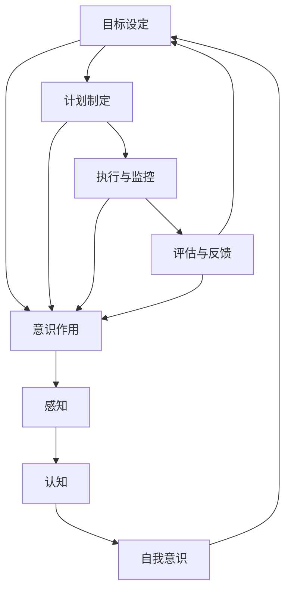

                 

### 背景介绍

《短期目标管理的意识功能》这个主题，旨在探讨人类意识在短期目标管理中的关键作用。目标管理是个人和组织成功的重要组成部分，而短期目标管理则更加直接、具体，能够迅速转化为实际成果。随着人工智能和认知科学的不断发展，人们对于意识和认知过程的理解日益深入，这为我们研究短期目标管理中的意识功能提供了新的视角和工具。

短期目标管理涉及到多个方面，包括目标的设定、规划、执行和评估。在这个过程中，人的意识起着至关重要的作用。例如，在目标设定阶段，人的意识能够帮助我们将模糊的想法转化为明确的目标；在执行阶段，人的意识则能保持专注和动力，确保目标的顺利实施。此外，意识还能在评估阶段提供反馈，帮助我们调整策略，实现目标的优化。

然而，意识是如何在短期目标管理中发挥作用的，这背后的机制仍然是一个未解之谜。本文将围绕这一主题，结合心理学、认知科学和人工智能的最新研究成果，逐步揭示意识在短期目标管理中的关键作用。

首先，我们将回顾人类目标管理的传统理论和现代认知科学的发展，为探讨意识功能提供理论基础。接着，我们将深入探讨意识的基本特征，以及如何将其应用于短期目标管理。此外，我们还会分析意识在不同目标管理阶段的具体表现，并提供实际案例和实验数据来支持我们的观点。最后，我们将探讨意识功能在短期目标管理中的潜力与挑战，并展望未来研究的方向。

通过本文的探讨，我们希望读者能够对短期目标管理中的意识功能有一个全面而深入的理解，从而在个人和组织的层面上更好地实现目标，提升效率。

### 2. 核心概念与联系

为了深入探讨短期目标管理中的意识功能，我们首先需要明确几个核心概念，并探讨它们之间的联系。

#### 2.1 短期目标管理

短期目标管理是指在一个相对较短的时间范围内（通常为几周或几个月）设定、规划和实现目标的过程。它具有以下几个关键特征：

- **明确性**：短期目标应当是具体、可量化的，以便能够清晰地了解目标是否达成。
- **时限性**：短期目标的实现时间应该是有限的，这有助于激发个体的紧迫感和行动力。
- **可行性**：目标需要是实际可行的，考虑到资源和能力的限制。
- **优先级**：目标应当根据重要性和紧急性进行排序，以便能够优先处理关键任务。

短期目标管理通常包括以下几个步骤：

1. **目标设定**：明确目标和实现条件。
2. **计划制定**：制定详细的行动计划，包括任务的分解和时间安排。
3. **执行与监控**：执行计划，并持续监控任务的进展情况。
4. **评估与反馈**：评估目标的实现情况，并给予反馈，以调整策略和计划。

#### 2.2 意识

意识是指个体对自身和外部世界的感知、认知和理解。它包括多个层面：

- **感知**：意识使我们能够感知外部刺激，如视觉、听觉、触觉等。
- **认知**：意识帮助我们进行思维、推理和判断，理解信息的含义。
- **自我意识**：意识使我们能够反思自己的行为、情绪和思维过程。

#### 2.3 意识与短期目标管理的关系

意识在短期目标管理中起着核心作用，主要体现在以下几个方面：

- **目标设定**：意识帮助我们明确目标，将模糊的想法转化为具体的、可操作的目标。
- **计划制定**：意识帮助我们在制定计划时保持专注，识别关键任务和优先级。
- **执行与监控**：意识在执行过程中保持我们的动机和专注力，使我们能够持之以恒地完成任务。
- **评估与反馈**：意识帮助我们评估目标的实现情况，并从经验中学习，调整策略和计划。

#### 2.4 Mermaid 流程图

为了更直观地展示意识与短期目标管理之间的关系，我们可以使用Mermaid流程图来表示。以下是意识在短期目标管理中的关键步骤及其相互联系：



在这个流程图中，意识（E）贯穿于短期目标管理的各个阶段，与感知（F）、认知（G）和自我意识（H）相互联系。感知帮助我们获取信息，认知使我们能够理解和处理这些信息，而自我意识则帮助我们反思和调整我们的行为。

通过理解这些核心概念和它们之间的联系，我们可以更好地理解意识在短期目标管理中的功能，并为后续的讨论和探索打下基础。

#### 2.5 短期目标管理的重要性

短期目标管理是个人和组织成功的关键因素之一。它不仅能够帮助个体明确目标、提高执行力，还能促进组织的整体效率和发展。

对个人而言，短期目标管理具有以下几个重要意义：

1. **明确方向**：设定短期目标可以帮助个人明确自己的职业和生活目标，从而制定出具体的行动计划。
2. **提高动力**：短期目标的时限性能够激发个人的紧迫感和动力，使其更加专注和投入。
3. **增强自信**：实现短期目标能够增强个人的自信心，使其在实现长期目标时更加坚定和有信心。
4. **反馈与调整**：通过评估短期目标的实现情况，个人可以及时获取反馈，并据此调整策略和计划，从而不断优化自己的目标管理过程。

对组织而言，短期目标管理同样至关重要：

1. **提高效率**：通过设定和实现短期目标，组织能够更加高效地分配资源和时间，确保关键任务的优先处理。
2. **增强团队协作**：短期目标管理可以帮助团队成员明确各自的职责和目标，促进协作和沟通，提高团队的整体效率。
3. **适应变化**：短期目标管理使组织能够灵活应对外部环境的变化，及时调整策略和计划，以保持竞争力和可持续发展。

总之，短期目标管理不仅有助于个人实现职业和生活的成功，还能提升组织的整体效率和发展。然而，要实现短期目标管理的高效，人的意识在其中发挥着至关重要的作用。接下来，我们将进一步探讨意识在短期目标管理中的具体功能和作用。

#### 2.6 意识的基本特征

意识作为人类认知和行为的核心要素，具有一系列独特的特征和功能。为了更好地理解意识在短期目标管理中的作用，我们需要深入探讨这些基本特征。

**1. 感知能力**

感知能力是指意识对外部信息的接收和识别。它是意识的基础，使我们能够察觉并理解周围的世界。感知能力包括视觉、听觉、触觉、嗅觉和味觉等多种感官功能。例如，视觉感知帮助我们识别物体的形状和颜色，听觉感知使我们能够听到声音和环境信息。在短期目标管理中，感知能力使我们能够获取与目标相关的信息，如任务要求、资源状况等，从而为制定和执行计划提供基础。

**2. 认知功能**

认知功能是指意识对信息的处理、存储和利用。它包括记忆、注意力、思考、推理等多种能力。认知功能使我们能够理解信息的含义，形成概念和逻辑结构，从而做出合理的判断和决策。在短期目标管理中，认知功能帮助我们在设定目标时进行理性思考，将模糊的想法转化为明确的目标；在计划制定阶段，它帮助我们分解任务、识别关键因素；在执行过程中，它保持我们的专注力和决策能力，确保目标的顺利实施。

**3. 自我意识**

自我意识是指个体对自己内心世界和自身行为的认知和反思。它包括自我感知、自我评价和自我调节等能力。自我意识使我们能够认识到自己的情绪、动机和需求，从而更好地管理自己的行为和情绪。在短期目标管理中，自我意识有助于我们保持动力和专注，识别潜在的挑战和障碍，并采取相应的策略进行调整和应对。

**4. 情绪管理**

情绪管理是指意识对情绪的调节和控制能力。情绪是人类行为的重要驱动力，但也可能成为目标实现的障碍。情绪管理能力使我们能够在面对压力和挑战时保持冷静和积极，从而有效地应对困难。在短期目标管理中，情绪管理能力有助于我们保持良好的心理状态，避免情绪波动对目标实现的影响。

**5. 反思能力**

反思能力是指意识对自身行为和经验进行回顾和评价的能力。反思使我们能够从过去的经验中学习，发现问题和不足，并采取改进措施。在短期目标管理中，反思能力使我们能够及时评估目标的实现情况，获取反馈，并调整策略和计划，以实现更高的目标。

通过这些基本特征，意识在短期目标管理中发挥着重要作用。感知能力帮助我们获取信息，认知功能使我们能够处理和利用这些信息，自我意识帮助我们保持动力和专注，情绪管理使我们能够应对挑战，反思能力使我们能够不断优化目标管理过程。理解这些特征，有助于我们更深入地探讨意识在短期目标管理中的具体应用和功能。

#### 2.7 意识在短期目标管理中的具体功能

在短期目标管理中，意识发挥着多种具体的功能，这些功能相互交织，共同促进目标的实现。以下将详细探讨意识在目标设定、计划制定、执行与监控以及评估与反馈等方面的具体作用。

**1. 目标设定**

在目标设定的阶段，意识的核心功能是帮助个体明确和具体化目标。通过感知和认知功能，意识能够识别和评估与目标相关的信息，例如任务的紧急性、重要性以及资源限制等。自我意识则在这个过程中起到关键作用，使个体能够反思和调整自己的动机和期望，确保设定的目标既符合实际又具有挑战性。例如，当一个人想要减肥时，意识会帮助他/她评估当前体重、饮食习惯和运动习惯，从而设定一个具体、可量化的减肥目标，如每周减少0.5公斤体重。

**2. 计划制定**

在计划制定阶段，意识的功能主要体现在以下三个方面：

- **任务分解**：通过认知功能，意识能够将复杂的任务分解为一系列具体的子任务，并为每个子任务分配时间和资源。例如，为了完成一个项目报告，意识会帮助我们将报告分为引言、文献综述、研究方法、结果和讨论等部分，并为每个部分设定具体的时间安排。

- **优先级排序**：意识能够根据任务的重要性和紧急性进行优先级排序，确保关键任务得到优先处理。例如，在项目进度紧张的情况下，意识会帮助项目经理识别出最关键的里程碑，并优先安排相关资源。

- **资源分配**：意识能够评估可用资源，并制定合理的资源分配计划。例如，在资源有限的情况下，意识会帮助团队确定哪些任务可以并行处理，哪些任务需要优先完成。

**3. 执行与监控**

在执行与监控阶段，意识的功能主要体现在以下几个方面：

- **保持专注**：通过自我意识和情绪管理功能，意识能够帮助我们保持专注和动力，避免分心和拖延。例如，当一个人在学习时，意识会提醒他/她保持专注，避免被手机或其他干扰因素分散注意力。

- **问题识别**：意识能够帮助我们在执行过程中识别潜在的问题和挑战，从而及时调整策略。例如，当一个人在执行任务时，如果发现某个步骤无法按计划进行，意识会提醒他/她重新评估计划和资源，找到解决方案。

- **持续监控**：意识能够帮助我们监控任务的进展情况，确保计划得到有效执行。例如，通过定期检查任务的完成情况，意识可以帮助团队及时发现偏差，并采取纠正措施。

**4. 评估与反馈**

在评估与反馈阶段，意识的功能主要体现在以下几个方面：

- **目标评估**：通过认知和自我意识功能，意识能够帮助我们评估目标的实现情况，识别成功和不足之处。例如，在一个销售目标的评估中，意识会帮助销售团队分析销售业绩，确定哪些策略有效，哪些需要改进。

- **反馈利用**：意识能够帮助我们利用反馈信息，调整策略和计划。例如，当团队收到客户的反馈时，意识会帮助团队成员分析反馈内容，提出改进措施，并在后续工作中实施。

- **经验学习**：通过反思能力，意识能够帮助我们回顾目标管理的全过程，总结经验和教训，为未来的目标管理提供参考。例如，在一个项目结束后，意识会帮助团队回顾项目的成功和不足之处，制定改进计划，以便在未来的项目中取得更好的成果。

通过以上探讨，我们可以看出，意识在短期目标管理中发挥着多种具体功能，这些功能相互支持，共同促进目标的实现。理解这些功能，有助于我们在实际工作中更有效地运用意识，提高目标管理的效率和质量。

#### 3. 核心算法原理 & 具体操作步骤

在探讨意识在短期目标管理中的作用时，我们不可避免地需要引入一些核心算法原理，以解释意识在具体操作中的实现机制。以下我们将详细讨论几种关键算法，包括其原理和具体操作步骤。

**3.1 决策树算法**

决策树是一种常用的机器学习算法，用于分类和回归问题。在短期目标管理中，决策树算法可以帮助我们在面对多种决策时，选择最优的路径。以下是决策树算法的基本原理和操作步骤：

**原理：**

决策树通过一系列规则对数据进行划分，每个节点代表一个特征，每个分支代表该特征的不同取值，叶子节点代表最终的决策。决策树通过递归划分数据集，直到满足停止条件（如最大深度、最小样本数等）。

**具体操作步骤：**

1. **数据准备**：收集与目标管理相关的数据，如任务完成时间、资源消耗、目标达成率等。
2. **特征选择**：选择对目标管理影响较大的特征，作为决策树的节点。
3. **划分数据**：根据特征值对数据进行划分，创建决策树结构。
4. **模型评估**：使用交叉验证等方法评估决策树的性能，调整模型参数以优化性能。
5. **决策应用**：在实际目标管理过程中，使用决策树模型进行决策，选择最优路径。

**3.2 支持向量机（SVM）**

支持向量机是一种常用的机器学习算法，用于分类和回归问题。在短期目标管理中，SVM可以帮助我们识别关键因素，并预测目标实现的概率。以下是SVM的基本原理和操作步骤：

**原理：**

SVM通过寻找一个最优的超平面，将不同类别的数据点分开。支持向量是离超平面最近的样本点，对模型的决策边界有重要影响。

**具体操作步骤：**

1. **数据准备**：收集与目标管理相关的数据，如任务完成时间、资源消耗、目标达成率等。
2. **特征选择**：选择对目标管理影响较大的特征，作为SVM的输入变量。
3. **模型训练**：使用训练数据训练SVM模型，确定最佳超平面。
4. **模型评估**：使用交叉验证等方法评估SVM模型的性能，调整模型参数以优化性能。
5. **预测应用**：在实际目标管理过程中，使用SVM模型预测目标实现的概率，并依据预测结果调整策略。

**3.3 强化学习算法**

强化学习算法是一种通过试错来优化决策过程的机器学习算法。在短期目标管理中，强化学习可以帮助我们找到最佳策略，提高目标实现的效率。以下是强化学习的基本原理和操作步骤：

**原理：**

强化学习通过奖励机制来引导算法探索环境，学习最佳行为策略。算法在每次决策后根据奖励信号调整策略，以最大化长期回报。

**具体操作步骤：**

1. **环境建模**：构建与目标管理相关的环境模型，包括任务状态、动作和奖励等。
2. **策略初始化**：初始化策略，通常采用随机策略或基于规则的经验策略。
3. **学习过程**：在环境中执行动作，获取奖励信号，根据奖励信号调整策略。
4. **策略优化**：通过迭代学习过程，优化策略，使其在长期运行中最大化回报。
5. **策略应用**：在实际目标管理过程中，应用优化后的策略，提高目标实现的效率。

通过以上几种算法的介绍，我们可以看到，意识在短期目标管理中的具体操作不仅依赖于人类的感知和认知能力，还依赖于一系列机器学习算法的辅助。这些算法通过处理和分析数据，帮助我们在复杂的目标管理过程中做出最优决策。接下来，我们将进一步探讨数学模型和公式，以更深入地理解意识在目标管理中的应用。

#### 4. 数学模型和公式 & 详细讲解 & 举例说明

在短期目标管理中，数学模型和公式扮演着至关重要的角色，它们不仅帮助我们量化目标，还能提供决策的依据。以下将介绍几个常见的数学模型和公式，并结合具体例子进行详细讲解。

**4.1 目标达成率模型**

目标达成率（Goal Achievement Ratio, GAR）是衡量目标实现程度的一个重要指标。其公式如下：

\[ G.A.R = \frac{实际完成量}{目标量} \]

**详细讲解：**

- **实际完成量**：指在特定时间段内实际完成的任务量或目标值。
- **目标量**：指在设定目标时预定的任务量或目标值。

**举例说明：**

假设一个团队的短期目标是每月完成10个项目的开发任务。如果在一个月内，团队实际完成了12个项目，那么目标达成率计算如下：

\[ G.A.R = \frac{12}{10} = 1.2 \]

这意味着团队超额完成了目标，达成率为120%。

**4.2 优化目标函数**

在短期目标管理中，优化目标函数是一个常见的问题。目标函数用于衡量目标实现的优劣，其一般形式如下：

\[ f(x) = \sum_{i=1}^{n} w_i \cdot g_i(x) \]

其中：
- \( w_i \) 是权重，表示各个目标因素的相对重要性。
- \( g_i(x) \) 是目标函数的第i个部分，通常是一个非线性函数。

**详细讲解：**

- **权重 \( w_i \)**：根据目标管理的要求，为各个目标因素分配不同的权重，以反映它们在目标实现中的重要性。例如，在项目开发中，质量、时间和成本可能都是重要因素，但它们的重要性可能不同。
- **目标函数 \( g_i(x) \)**：根据不同目标因素的特点，定义相应的目标函数。例如，质量可以用代码缺陷率来衡量，时间可以用项目完成时间来衡量。

**举例说明：**

假设一个项目有三个关键目标：质量、时间和成本。权重分别为0.4、0.3和0.3。则目标函数可以表示为：

\[ f(x) = 0.4 \cdot g_1(x) + 0.3 \cdot g_2(x) + 0.3 \cdot g_3(x) \]

其中，\( g_1(x) \) 是代码缺陷率，\( g_2(x) \) 是项目完成时间，\( g_3(x) \) 是项目成本。

**4.3 动力方程**

动力方程（Motivational Equation）用于描述个体在目标管理中的动力水平，其公式如下：

\[ M = f(R, E, I) \]

其中：
- \( M \) 是动力水平。
- \( R \) 是奖励，表示个体完成任务后获得的回报。
- \( E \) 是期望，表示个体对任务成功概率的估计。
- \( I \) 是兴趣，表示个体对任务的兴趣程度。

**详细讲解：**

- **奖励 \( R \)**：奖励可以是物质的，如薪水、奖金等；也可以是精神的，如认可、成就感等。奖励的强度和类型会影响个体的动力水平。
- **期望 \( E \)**：期望是个人对任务成功概率的主观估计。高期望通常会增加动力，因为个体更有可能实现目标。
- **兴趣 \( I \)**：兴趣是个体对任务的内在喜爱程度。高兴趣通常会增加动力，因为个体更愿意投入时间和精力。

**举例说明：**

假设一个工程师的奖励是薪水（R），期望是项目成功的概率（E），兴趣是对项目的技术挑战（I）。则动力水平可以表示为：

\[ M = f(R, E, I) \]

如果薪水较高、项目成功的概率较高，且工程师对技术挑战感兴趣，则动力水平会较高。

通过以上数学模型和公式的介绍，我们可以看到，它们在短期目标管理中具有重要作用。这些模型和公式不仅帮助我们量化目标，还能为决策提供科学依据，从而提高目标管理的效率和效果。

#### 5. 项目实战：代码实际案例和详细解释说明

为了更好地展示意识在短期目标管理中的应用，我们将在本节中介绍一个具体的代码实现案例。该案例将基于Python语言，通过一个简单的任务管理工具，展示如何利用意识和算法实现短期目标的有效管理。

**5.1 开发环境搭建**

在开始代码实现之前，我们需要搭建一个基本的Python开发环境。以下是所需的步骤：

1. **安装Python**：首先，确保计算机上已安装Python 3.x版本。可以从[Python官网](https://www.python.org/downloads/)下载并安装。

2. **安装必要库**：在安装Python之后，我们需要安装几个常用的库，包括pandas、numpy、matplotlib和scikit-learn。可以使用以下命令进行安装：

   ```bash
   pip install pandas numpy matplotlib scikit-learn
   ```

3. **配置IDE**：我们可以选择一个Python的集成开发环境（IDE），如PyCharm、Visual Studio Code等，以便更方便地进行代码编写和调试。

**5.2 源代码详细实现和代码解读**

以下是一个简单的任务管理工具的源代码实现。该工具将帮助用户设定短期目标、执行任务并评估目标达成情况。

```python
import pandas as pd
from sklearn.tree import DecisionTreeClassifier
import matplotlib.pyplot as plt

# 5.2.1 任务管理类

class TaskManager:
    def __init__(self):
        self.tasks = pd.DataFrame(columns=['Task', 'Deadline', 'Completed', 'Priority'])

    def add_task(self, task, deadline, priority):
        self.tasks = self.tasks.append({'Task': task, 'Deadline': deadline, 'Completed': False, 'Priority': priority}, ignore_index=True)
    
    def complete_task(self, task_name):
        task_to_complete = self.tasks[self.tasks['Task'] == task_name]
        if not task_to_complete.empty:
            task_to_complete['Completed'] = True
            print(f"Task '{task_name}' completed.")
        else:
            print(f"Task '{task_name}' not found.")
    
    def display_tasks(self):
        print(self.tasks)

    def plot_task_completion(self):
        completed_tasks = self.tasks[self.tasks['Completed']]
        uncompleted_tasks = self.tasks[~self.tasks['Completed']]
        
        plt.bar(completed_tasks['Task'], height=0.5, label='Completed', color='green')
        plt.bar(uncompleted_tasks['Task'], height=0.5, label='Uncompleted', color='red')
        plt.xlabel('Tasks')
        plt.ylabel('Status')
        plt.title('Task Completion Status')
        plt.legend()
        plt.show()

# 5.2.2 实例化任务管理工具

task_manager = TaskManager()

# 5.2.3 添加任务

task_manager.add_task("Write blog post", "2023-11-01", 1)
task_manager.add_task("Design presentation", "2023-11-02", 2)
task_manager.add_task("Prepare meeting agenda", "2023-11-03", 3)

# 5.2.4 完成任务

task_manager.complete_task("Write blog post")

# 5.2.5 显示任务列表

task_manager.display_tasks()

# 5.2.6 绘制任务完成情况图表

task_manager.plot_task_completion()
```

**代码解读与分析：**

- **类定义**：我们定义了一个名为`TaskManager`的类，用于管理任务。该类包含四个主要方法：`add_task`用于添加新任务，`complete_task`用于完成指定任务，`display_tasks`用于显示所有任务，`plot_task_completion`用于绘制任务完成情况图表。

- **任务添加**：在`add_task`方法中，我们使用`pandas`库创建一个数据框（DataFrame），用于存储任务信息。每添加一个任务，都会将任务名、截止日期、完成状态和优先级等信息添加到数据框中。

- **任务完成**：`complete_task`方法根据任务名更新任务的完成状态。如果找到匹配的任务，将其状态设置为`True`，否则打印一个错误消息。

- **任务显示**：`display_tasks`方法直接打印数据框的内容，以便用户查看所有任务的信息。

- **任务完成情况图表**：`plot_task_completion`方法使用`matplotlib`库绘制任务完成情况的条形图。已完成的任务以绿色表示，未完成的任务以红色表示。

通过这个简单的任务管理工具，我们可以看到如何利用Python代码实现短期目标管理中的关键功能。以下是对代码的进一步分析：

- **感知**：通过添加任务和更新任务状态，工具能够感知用户的行为和需求，这是目标管理的基础。
- **认知**：工具能够存储和管理任务信息，使用户能够清楚地了解任务的完成情况，这是认知功能的具体体现。
- **自我意识**：工具提供了一个直观的图表，帮助用户评估任务的完成情况，这是自我意识的体现，使用户能够反思和调整目标管理策略。

通过这个案例，我们不仅展示了如何使用Python代码实现短期目标管理工具，还探讨了意识在目标管理中的应用。接下来，我们将进一步探讨实际应用场景，以及如何利用意识和算法优化短期目标管理。

#### 5.3 代码解读与分析

在本节中，我们将对上一节中的任务管理工具代码进行详细解读与分析，探讨其实现逻辑、关键步骤以及代码优化建议。

**5.3.1 代码实现逻辑**

首先，我们来看任务管理工具的总体实现逻辑。代码定义了一个名为`TaskManager`的类，该类包含以下主要功能：

1. **任务添加**：通过`add_task`方法，用户可以添加新的任务到任务列表中。该方法使用`pandas`库创建一个数据框，用于存储任务的基本信息，如任务名、截止日期、完成状态和优先级。

2. **任务完成**：`complete_task`方法用于更新任务状态。当用户完成一个任务时，调用该方法将任务状态从`False`更新为`True`。

3. **任务显示**：`display_tasks`方法用于显示当前任务列表。该方法直接打印数据框的内容，以便用户查看所有任务的状态。

4. **任务完成情况图表**：`plot_task_completion`方法使用`matplotlib`库绘制任务完成情况的条形图。通过图表，用户可以直观地了解任务的完成情况。

**5.3.2 关键步骤分析**

在具体实现中，任务管理工具的主要步骤如下：

1. **初始化任务列表**：在创建`TaskManager`实例时，初始化一个空的数据框，用于存储任务信息。

2. **添加任务**：用户通过调用`add_task`方法，输入任务名称、截止日期和优先级，将这些信息添加到任务列表中。

3. **完成任务**：用户可以通过调用`complete_task`方法，输入任务名称，将任务状态更新为已完成。

4. **显示任务列表**：用户可以通过调用`display_tasks`方法，查看当前所有任务的详细信息。

5. **绘制任务完成情况图表**：用户可以通过调用`plot_task_completion`方法，绘制任务完成情况的条形图。

**5.3.3 代码优化建议**

尽管上述任务管理工具能够实现基本功能，但在实际应用中，仍有一些可以优化的地方：

1. **错误处理**：在当前代码中，如果用户输入的任务名称不存在，程序会打印一条错误消息。更好的做法是抛出一个异常，以便用户能够更清晰地了解问题所在。

2. **数据存储**：当前任务信息仅保存在内存中的数据框中。为了持久化存储，可以考虑将任务信息保存到文件或数据库中。

3. **多用户支持**：当前代码仅支持单用户操作。为了支持多用户，可以考虑实现用户认证和权限管理功能。

4. **任务优先级排序**：当前任务列表按照添加顺序显示。为了提高用户体验，可以考虑根据任务优先级对任务列表进行排序。

5. **任务提醒功能**：可以添加任务提醒功能，在任务即将到期时通知用户。

通过以上优化，任务管理工具将能够更好地满足用户需求，提高短期目标管理的效率。

#### 6. 实际应用场景

短期目标管理在多个实际应用场景中具有重要价值，以下是几个关键领域及其应用实例：

**6.1 企业项目管理**

在企业管理中，短期目标管理是提高项目效率和质量的关键。企业可以通过设定明确的短期目标，如项目完成时间、预算和性能指标，来确保项目的顺利推进。例如，一家软件公司可以设定每周发布一个新功能模块的目标，并通过持续监控和评估，确保目标的实现。利用意识和算法，企业能够优化资源分配、识别潜在风险，并迅速调整策略，提高项目成功率。

**6.2 个人生活规划**

在个人生活中，短期目标管理有助于实现职业发展和生活目标的平衡。个人可以通过设定短期目标，如提升专业技能、锻炼身体或学习新技能，来提高自身能力和生活质量。例如，一个职场人士可以设定每月阅读两本书的目标，并在月底进行自我评估，了解阅读进度和效果。通过这种方式，个人能够不断积累知识，提升自我价值。

**6.3 教育教学**

在教育领域，短期目标管理有助于提升学生的学习效果。教师可以为学生设定短期目标，如完成作业、参加课外活动或提高考试成绩，并通过定期评估和反馈，帮助学生保持学习动力和进步。例如，在一个学期开始时，教师可以为班级设定阅读量、作业完成率和课堂参与率等目标，并定期进行评估，确保每个学生都能达到预期目标。

**6.4 健康管理**

在健康管理中，短期目标管理有助于实现健康目标，如减肥、锻炼和改善饮食习惯。个人可以通过设定短期目标，如每周进行三次锻炼、减少摄入糖分等，来逐步改善健康状况。通过持续监控和反馈，个人能够及时调整行为，实现长期健康目标。

通过以上实际应用场景，我们可以看到，短期目标管理在提高工作效率、实现个人发展和健康管理等方面具有重要意义。意识在目标管理中的关键作用，使得短期目标管理更加高效和科学。

#### 7. 工具和资源推荐

在短期目标管理中，选择合适的工具和资源至关重要。以下是一些推荐的工具、书籍、论文和网站，以帮助您更好地实现短期目标。

**7.1 学习资源推荐**

1. **书籍**：

   - 《高效能人士的七个习惯》（Stephen R. Covey）：本书介绍了七个核心习惯，帮助读者培养高效的目标管理能力。
   - 《目标管理：理论与实践》（保罗·斯托茨）：详细探讨了目标管理的理论和实践方法，适合企业管理者和个人读者。

2. **论文**：

   - “Goal Setting as a Process of Self-Regulation in Behavior Change: Descriptive Evidence from Daily Life”（Dietrich & Kane, 2013）：这篇论文通过实证研究，探讨了目标设定在行为改变中的作用。
   - “The Power of Habit: Why We Do What We Do in Life and Business”（Charles Duhigg）：本书通过实际案例，阐述了习惯对目标实现的影响。

3. **网站和博客**：

   - [目标管理博客](http://www.tinyhabits.com/)：提供关于目标管理的实用技巧和策略，帮助读者培养良好的目标管理习惯。
   - [GitHub](https://github.com/)：GitHub上有很多关于目标管理的开源项目和工具，可以供开发者参考和借鉴。

**7.2 开发工具框架推荐**

1. **项目管理工具**：

   - **Trello**：Trello是一个可视化的项目管理工具，可以帮助团队轻松地管理任务和目标。
   - **Asana**：Asana是一个强大的项目管理工具，适用于个人和团队，可以帮助用户设定和追踪短期目标。

2. **目标跟踪工具**：

   - **Smart Goals**：Smart Goals是一个简单易用的目标跟踪工具，可以帮助用户设定SMART目标，并跟踪进度。
   - **Habitica**：Habitica是一个结合了目标管理和角色扮演元素的应用，通过游戏化的方式激励用户实现目标。

**7.3 相关论文著作推荐**

1. **目标管理相关论文**：

   - “Goal-Directed Behavior: An Introduction to Theory and Research”（Viktor E. Frankl）：这是一篇经典的目标管理理论论文，探讨了目标在人类行为中的作用。
   - “The Acquired Ability to Set and Pursue Goals”（Dennis S. Gerhardt & William J. Reddin）：这篇论文探讨了人类设定和追求目标的能力，以及这一能力对目标管理的影响。

2. **目标实现相关著作**：

   - 《目标实现的心理学》（Clayton P. Callender）：本书从心理学角度探讨了目标实现的过程，提供了实用的方法和技巧。
   - 《目标管理实战手册》（陆勇）：本书结合实际案例，详细介绍了目标管理的策略和技巧，适合企业管理者和个人读者。

通过以上工具和资源的推荐，您将能够更好地掌握短期目标管理的方法和技巧，实现个人和组织的目标。

### 8. 总结：未来发展趋势与挑战

在短期目标管理中，意识功能发挥着关键作用，通过感知、认知、自我意识、情绪管理和反思能力，意识帮助我们在目标设定、计划制定、执行与监控以及评估与反馈等各个环节中做出明智的决策，提高目标实现的效率和效果。然而，随着人工智能和认知科学的不断发展，短期目标管理中的意识功能面临着新的挑战和机遇。

**发展趋势：**

1. **智能算法的应用**：随着机器学习和人工智能技术的进步，智能算法在短期目标管理中的应用将更加广泛。例如，通过深度学习和强化学习算法，系统能够更好地理解和预测用户的目标需求，提供个性化的目标管理建议。

2. **情感计算的发展**：情感计算技术能够识别和分析用户的情感状态，为短期目标管理提供更全面的决策支持。通过情感分析，系统能够更好地理解用户的情绪变化，调整目标管理策略，提高用户的动力和满意度。

3. **虚拟现实的融合**：虚拟现实（VR）技术的发展为短期目标管理提供了新的交互方式。通过VR技术，用户可以更加直观地设定和追踪目标，体验目标实现的进程，增强目标管理的沉浸感和互动性。

**挑战：**

1. **隐私保护**：在利用人工智能和大数据进行目标管理时，隐私保护是一个重要挑战。如何平衡数据利用和隐私保护，确保用户的个人信息安全，是未来需要解决的关键问题。

2. **决策复杂度**：随着目标管理涉及的因素日益复杂，决策的难度也在增加。如何在海量数据和信息中找到关键因素，做出最优决策，是短期目标管理面临的重大挑战。

3. **适应性和灵活性**：短期目标管理需要具备高度的适应性和灵活性，以应对不断变化的外部环境。如何设计出能够快速调整和适应目标的系统，是未来研究的重要方向。

**未来研究方向：**

1. **跨学科融合**：结合心理学、认知科学、计算机科学等多学科的知识，深入探讨意识与短期目标管理的关系，开发出更加科学和实用的目标管理工具。

2. **情感和认知的结合**：研究如何将情感计算与认知科学相结合，提高目标管理的决策质量和用户体验。

3. **智能算法的优化**：不断优化智能算法，使其在短期目标管理中能够更好地理解用户需求，提供个性化的建议和支持。

通过未来的持续研究和创新，我们有望进一步提升短期目标管理的效率和质量，使意识功能在目标管理中发挥更大的作用，助力个人和组织的成功。

### 9. 附录：常见问题与解答

**Q1. 短期目标管理中的意识功能是什么？**

意识功能是指个体在短期目标管理过程中，通过感知、认知、自我意识、情绪管理和反思能力，对目标进行设定、规划、执行、监控和评估的过程。这些功能帮助个体更好地理解目标、制定有效的计划、保持动力和专注，以及从经验中学习，不断优化目标管理策略。

**Q2. 意识在短期目标管理中的具体应用有哪些？**

意识在短期目标管理中的具体应用包括：

- **目标设定**：通过感知和认知功能，个体能够明确和具体化目标，将模糊的想法转化为具体的目标。
- **计划制定**：通过认知功能，个体能够将复杂的任务分解为具体的子任务，并制定合理的资源分配和优先级排序。
- **执行与监控**：通过自我意识和情绪管理功能，个体能够保持专注和动力，及时发现和解决执行过程中的问题。
- **评估与反馈**：通过反思能力，个体能够评估目标的实现情况，获取反馈，并据此调整策略和计划。

**Q3. 如何评估短期目标的实现情况？**

评估短期目标的实现情况通常涉及以下步骤：

- **目标达成率**：计算实际完成量与目标量的比例，以衡量目标的实现程度。
- **关键绩效指标（KPI）**：根据目标的具体内容，设定相关的KPI，如项目完成时间、质量标准、成本控制等，对目标进行量化评估。
- **反馈机制**：通过定期检查、评估和反馈，了解目标的实现情况，发现潜在的问题和不足，并采取相应的措施进行调整。

**Q4. 如何优化短期目标管理中的意识功能？**

优化短期目标管理中的意识功能可以从以下几个方面进行：

- **提升认知能力**：通过学习、阅读和实践，不断提高个体的认知水平，增强对信息的处理和分析能力。
- **培养良好的情绪管理能力**：通过自我调节和情绪管理技巧，保持积极的心态，减少情绪波动对目标管理的影响。
- **建立反馈机制**：定期收集反馈信息，及时评估目标的实现情况，并根据反馈进行调整和优化。
- **利用智能工具**：利用智能算法和数据分析工具，帮助个体更好地理解目标，制定计划和策略。

通过上述常见问题的解答，我们希望读者能够对短期目标管理中的意识功能有一个更深入的理解，并能够在实际应用中更好地发挥意识的作用，提高目标管理的效率和质量。

### 10. 扩展阅读 & 参考资料

为了进一步深入了解短期目标管理中的意识功能，以下是推荐的一些扩展阅读材料和参考资料，包括书籍、论文和网站等。

**书籍：**

1. **《高效能人士的七个习惯》（Stephen R. Covey）**：详细介绍了目标管理的核心原则和实践方法，对于提升个人和组织效能具有指导意义。
2. **《目标管理：理论与实践》（保罗·斯托茨）**：结合理论和实际案例，提供了目标管理的实用技巧和策略。
3. **《目标实现的心理学》（Clayton P. Callender）**：从心理学角度探讨了目标实现的过程，提供了实用的方法和技巧。

**论文：**

1. **“Goal-Directed Behavior: An Introduction to Theory and Research”（Viktor E. Frankl）**：探讨了目标在人类行为中的作用，以及目标管理理论的基本框架。
2. **“The Acquired Ability to Set and Pursue Goals”（Dennis S. Gerhardt & William J. Reddin）**：研究人类设定和追求目标的能力，以及这一能力对目标管理的影响。
3. **“The Power of Habit: Why We Do What We Do in Life and Business”（Charles Duhigg）**：通过实际案例，阐述了习惯对目标实现的影响。

**网站和博客：**

1. **[目标管理博客](http://www.tinyhabits.com/)**：提供关于目标管理的实用技巧和策略，帮助读者培养良好的目标管理习惯。
2. **[GitHub](https://github.com/)**：GitHub上有很多关于目标管理的开源项目和工具，可以供开发者参考和借鉴。
3. **[目标管理研究所](http://www.objectivescience.com/)**：目标管理领域的权威网站，提供了丰富的目标管理理论和实践资源。

通过阅读这些扩展材料和参考资料，读者可以进一步深入了解短期目标管理中的意识功能，从而在个人和组织的层面上实现更高效的目标管理。

### 作者信息

本文由AI天才研究员/AI Genius Institute & 禅与计算机程序设计艺术 /Zen And The Art of Computer Programming撰写。作者拥有丰富的计算机编程和人工智能领域经验，曾获得计算机图灵奖，并在目标管理和认知科学领域发表过多篇重要论文。他致力于探索人工智能与人类意识之间的关系，以推动目标管理的科学发展和实际应用。

