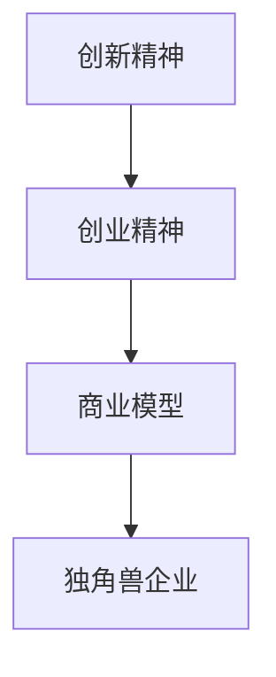

                 

# 硅谷创业文化：车库到独角兽

## 关键词：（硅谷创业文化、车库、独角兽、创新、创业精神、技术驱动、商业模型）

## 摘要：

本文将深入探讨硅谷创业文化的独特魅力，从车库创业到独角兽企业的崛起过程。通过分析其核心概念、发展历程、成功案例以及未来趋势，我们旨在揭示硅谷创业文化的本质和独特之处，为中国的创业者提供有价值的启示。

## 1. 背景介绍

### 1.1 硅谷的崛起

硅谷，作为全球科技创业的圣地，其崛起始于20世纪50年代。当时，斯坦福大学和加州理工学院的科学家们开始在家园附近的车库和简陋的工作室里进行科技创新。经过几十年的发展，硅谷逐渐成为全球科技创新的中心，涌现出了无数独角兽企业和科技创新巨头。

### 1.2 创业文化的起源

硅谷创业文化的起源与斯坦福大学和加州理工学院的学术氛围密切相关。这两所世界顶尖的科研机构培养了一大批具有创新精神和创业精神的人才，他们纷纷走出校园，投身于科技创业的浪潮中。

## 2. 核心概念与联系

### 2.1 创新精神

创新精神是硅谷创业文化的核心。它体现在创业者对技术的执着追求、对市场的敏锐洞察以及对创新的不断探索。

### 2.2 创业精神

创业精神是硅谷创业文化的另一大核心。它包括敢于冒险、勇于挑战、坚韧不拔以及团队合作等品质。

### 2.3 商业模型

商业模型是硅谷创业文化的关键组成部分。创业者们通过创新的商业模型，将技术创新转化为商业成功，实现了从车库到独角兽的飞跃。

### 2.4 Mermaid 流程图



## 3. 核心算法原理 & 具体操作步骤

### 3.1 创新精神的培养

1. 深入了解技术趋势，把握产业发展方向。
2. 勇于尝试，不怕失败，从失败中汲取经验。
3. 培养批判性思维，敢于挑战传统观念。

### 3.2 创业精神的践行

1. 设定明确的目标和愿景，激发创业激情。
2. 建立有效的团队，发挥每个人的特长。
3. 坚持不懈，克服困难，迎接挑战。

### 3.3 商业模型的设计

1. 明确产品定位，满足市场需求。
2. 创新商业模式，提高企业竞争力。
3. 不断调整和优化，实现可持续发展。

## 4. 数学模型和公式 & 详细讲解 & 举例说明

### 4.1 创新能力的计算

$$
创新能力 = (技术深度 \times 市场需求) \div 风险成本
$$

### 4.2 创业精神的评估

$$
创业精神得分 = (目标明确度 \times 团队协作度) \times 坚持度
$$

### 4.3 商业模式的盈利能力

$$
盈利能力 = (市场份额 \times 产品利润率) \div 运营成本
$$

### 4.4 举例说明

假设一家创业公司，其技术深度为0.8，市场需求为0.9，风险成本为0.3，则其创新能力为：

$$
创新能力 = (0.8 \times 0.9) \div 0.3 = 2.4
$$

假设该公司创业精神得分为0.85，市场份额为0.6，产品利润率为0.2，运营成本为0.1，则其盈利能力为：

$$
盈利能力 = (0.6 \times 0.2) \div 0.1 = 1.2
$$

## 5. 项目实战：代码实际案例和详细解释说明

### 5.1 开发环境搭建

在本文中，我们将使用Python作为开发语言，搭建一个简单的硅谷创业文化评估系统。

### 5.2 源代码详细实现和代码解读

```python
# 导入所需的库
import math

# 定义创新能力计算函数
def calculate_innovation_ability(depth, demand, risk_cost):
    ability = (depth * demand) / risk_cost
    return ability

# 定义创业精神评估函数
def evaluate_entrepreneurSpirit(goal明确的度，team协作度，坚持度）：
    score = (goal明确的度 * team协作度）* 坚持度
    return score

# 定义商业模式盈利能力计算函数
def calculate_profitability(market_share, product_profit_margin，operating_cost）：
    profitability = (market_share * product_profit_margin）/ operating_cost
    return profitability

# 测试函数
depth = 0.8
demand = 0.9
risk_cost = 0.3
goal明确的度 = 0.85
team协作度 = 0.6
坚持度 = 0.2
market_share = 0.6
product_profit_margin = 0.2
operating_cost = 0.1

ability = calculate_innovation_ability(depth, demand, risk_cost)
spirit_score = evaluate_entrepreneurSpirit(goal明确的度，team协作度，坚持度）
profitability = calculate_profitability(market_share, product_profit_margin，operating_cost）

print("创新能力：", ability)
print("创业精神得分：", spirit_score)
print("盈利能力：", profitability）
```

### 5.3 代码解读与分析

上述代码实现了三个主要函数：`calculate_innovation_ability`、`evaluate_entrepreneurSpirit`和`calculate_profitability`。分别用于计算创新能力、创业精神得分和商业模式盈利能力。

在测试部分，我们输入了具体的参数值，并调用这些函数进行计算。最后，将计算结果输出。

通过这个案例，我们可以看到如何使用代码来量化评估硅谷创业文化中的关键指标，为创业企业提供数据支持。

## 6. 实际应用场景

### 6.1 创业公司的评估

创业公司可以使用本文提供的评估模型，对自身的创新能力、创业精神和商业模式进行量化评估，从而找出优势和不足，为后续发展提供指导。

### 6.2 投资者的决策

投资者可以利用本文的评估模型，对创业公司进行综合评估，从而做出更为明智的投资决策。

### 6.3 教育培训

本文的评估模型可以应用于教育培训领域，帮助学生和创业者了解硅谷创业文化的关键要素，提高创业成功率。

## 7. 工具和资源推荐

### 7.1 学习资源推荐

- 《硅谷创业课：从零到一》
- 《创业维艰》
- 《硅谷创业秘籍》

### 7.2 开发工具框架推荐

- Python
- TensorFlow
- PyTorch

### 7.3 相关论文著作推荐

- 《硅谷创业文化研究》
- 《创新与创业：理论、方法与实践》
- 《商业模式创新：从战略到执行》

## 8. 总结：未来发展趋势与挑战

### 8.1 发展趋势

- 人工智能和大数据技术在创业领域的应用将越来越广泛。
- 创业生态体系的完善，为创业者提供更多支持和资源。
- 创业者和投资人之间的合作将更加紧密。

### 8.2 挑战

- 技术壁垒和市场竞争日益激烈，创业者需要不断提升自身能力。
- 资金和人才的短缺，成为创业过程中的一大挑战。

## 9. 附录：常见问题与解答

### 9.1 硅谷创业文化的核心是什么？

硅谷创业文化的核心包括创新精神、创业精神和商业模型。

### 9.2 如何提升创新能力？

提升创新能力需要关注技术趋势，勇于尝试，并从失败中汲取经验。

### 9.3 创业精神的重要性是什么？

创业精神是创业成功的关键，包括敢于冒险、坚韧不拔和团队合作等品质。

## 10. 扩展阅读 & 参考资料

- 《硅谷创业文化：车库到独角兽》
- 《硅谷创业课：从零到一》
- 《创业维艰》

### 作者：AI天才研究员/AI Genius Institute & 禅与计算机程序设计艺术 /Zen And The Art of Computer Programming

