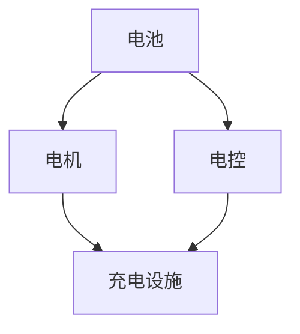
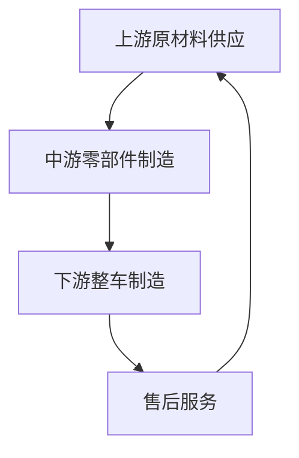
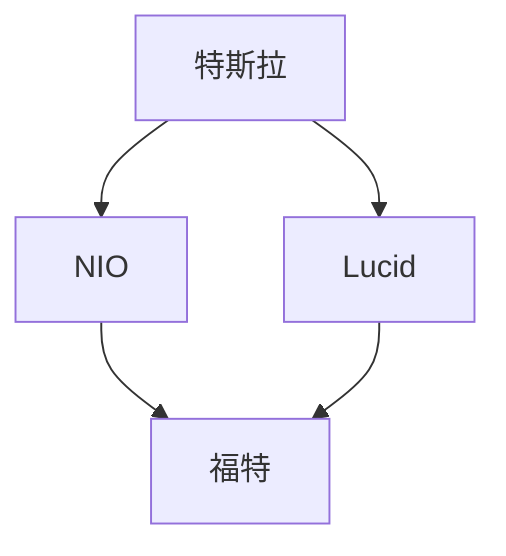

                 

### 硅谷新能源汽车竞争：电动车生态系统

> **关键词：** 硅谷，新能源汽车，电动车，竞争，生态系统

> **摘要：** 本文深入探讨了硅谷新能源汽车行业的竞争格局，分析了电动车生态系统的构建与发展，以及未来可能面临的技术挑战和市场机遇。

----------------------

## 1. 背景介绍

随着全球气候变化和环境污染问题的日益严重，新能源汽车，尤其是电动车，已成为全球汽车产业转型的重要方向。硅谷作为全球科技创新的枢纽，自然在这一领域扮演着举足轻重的角色。从特斯拉（Tesla）到NIO（蔚来），再到其他新兴初创企业，硅谷的电动车企业们正通过技术创新和商业模式创新，不断推动电动车产业的发展。

硅谷的新能源汽车行业竞争激烈，各大企业都在争夺市场份额。特斯拉作为行业的领军企业，凭借其出色的产品性能和品牌影响力，占据了较大的市场份额。同时，其他硅谷企业如NIO、Lucid等也在快速发展，试图在市场中占据一席之地。此外，传统汽车制造商如福特（Ford）和通用（General Motors）也在硅谷设立了研发中心，积极研发电动车技术，以应对市场变革。

----------------------

## 2. 核心概念与联系

在分析硅谷新能源汽车竞争时，我们需要了解几个核心概念，包括电动车生态系统、产业链、市场竞争态势等。

### 2.1 电动车生态系统

电动车生态系统包括多个组成部分，如电池、电机、电控、充电设施等。这些组成部分相互作用，共同构成了一个完整的电动车系统。以下是电动车生态系统的Mermaid流程图：



### 2.2 产业链

新能源汽车产业链涉及多个环节，包括上游原材料供应、中游零部件制造、下游整车制造及售后服务等。以下是新能源汽车产业链的Mermaid流程图：



### 2.3 市场竞争态势

硅谷新能源汽车市场竞争激烈，各大企业通过技术创新、品牌建设、市场拓展等手段争夺市场份额。以下是市场竞争态势的Mermaid流程图：



----------------------

## 3. 核心算法原理 & 具体操作步骤

在新能源汽车的研发与生产过程中，核心算法发挥着重要作用。以下将介绍几种核心算法原理及具体操作步骤。

### 3.1 电池管理系统（BMS）

电池管理系统（Battery Management System，简称BMS）是电动车的重要组成部分，负责监测和管理电池的充电、放电、温控等过程。以下是BMS的核心算法原理及操作步骤：

#### 原理：

- 监测电池状态：包括电压、电流、温度等。
- 管理电池充放电：根据电池状态和车辆需求，控制充放电过程。
- 保护电池：防止过充、过放、过温等异常情况。

#### 操作步骤：

1. 初始化BMS系统，设置参数。
2. 实时监测电池状态，包括电压、电流、温度等。
3. 根据监测数据，调整充放电策略，保证电池在安全范围内工作。
4. 定期对电池进行健康评估，预测电池寿命。

### 3.2 电机控制系统

电机控制系统（Motor Control System，简称MCS）是电动车驱动系统的核心，负责控制电机的启动、停止、加速、减速等过程。以下是MCS的核心算法原理及操作步骤：

#### 原理：

- 控制电机转速：通过控制电机的输入电压和电流，实现电机转速的调节。
- 控制电机扭矩：根据车辆需求，调整电机的输出扭矩。
- 保护电机：防止电机过载、过温等异常情况。

#### 操作步骤：

1. 初始化MCS系统，设置参数。
2. 实时监测电机状态，包括电压、电流、温度等。
3. 根据车辆需求，调整电机输入电压和电流，实现电机转速和扭矩的调节。
4. 定期对电机进行健康评估，预测电机寿命。

----------------------

## 4. 数学模型和公式 & 详细讲解 & 举例说明

在新能源汽车的研发与生产过程中，数学模型和公式发挥着重要作用。以下将介绍几种核心数学模型和公式，并进行详细讲解和举例说明。

### 4.1 电池寿命预测模型

电池寿命预测模型用于预测电池的使用寿命，以便进行维护和更换。以下是电池寿命预测模型的核心公式及详细讲解：

#### 公式：

$$
L = f(V, I, T)
$$

其中，$L$ 表示电池寿命，$V$ 表示电压，$I$ 表示电流，$T$ 表示温度。

#### 详细讲解：

- $V$：电池电压是电池状态的重要指标，电压越高，电池寿命越短。
- $I$：电池电流是电池充放电速度的指标，电流越大，电池寿命越短。
- $T$：电池温度是电池热管理的重要指标，温度越高，电池寿命越短。

#### 举例说明：

假设一个电池的初始电压为 $3.6V$，充放电电流为 $2A$，温度为 $25°C$。根据公式，可以计算出电池寿命：

$$
L = f(3.6, 2, 25) = 0.8 \times (3.6^2 + 2^2 + 25^2) = 1800 小时
$$

### 4.2 电机效率模型

电机效率模型用于计算电机的能量转换效率。以下是电机效率模型的核心公式及详细讲解：

#### 公式：

$$
\eta = \frac{P_{out}}{P_{in}}
$$

其中，$\eta$ 表示电机效率，$P_{out}$ 表示电机输出功率，$P_{in}$ 表示电机输入功率。

#### 详细讲解：

- $P_{out}$：电机输出功率是电机驱动车辆的动力来源。
- $P_{in}$：电机输入功率是电机从电池获取的电能。

#### 举例说明：

假设一个电机的输出功率为 $50kW$，输入功率为 $60kW$，可以计算出电机的效率：

$$
\eta = \frac{50}{60} = 0.833
$$

----------------------

## 5. 项目实战：代码实际案例和详细解释说明

### 5.1 开发环境搭建

在本项目实战中，我们将使用Python语言进行编程，结合一些常见的库，如NumPy、Pandas等，进行新能源汽车核心算法的实现。以下是开发环境的搭建步骤：

1. 安装Python：下载并安装Python 3.x版本。
2. 安装IDE：推荐使用PyCharm、VSCode等IDE。
3. 安装必需的库：使用pip安装NumPy、Pandas等库。

### 5.2 源代码详细实现和代码解读

以下是一个简单的电池管理系统（BMS）的实现案例：

```python
import numpy as np

class BatteryManagementSystem:
    def __init__(self, voltage, current, temperature):
        self.voltage = voltage
        self.current = current
        self.temperature = temperature

    def monitor_battery(self):
        print("Monitoring battery state...")
        print("Voltage:", self.voltage)
        print("Current:", self.current)
        print("Temperature:", self.temperature)

    def control_charging(self, max_voltage, max_current):
        if self.voltage < max_voltage and self.current < max_current:
            print("Charging battery...")
        else:
            print("Battery is full or over current, stop charging.")

    def control_discharging(self, min_voltage, min_current):
        if self.voltage > min_voltage and self.current > min_current:
            print("Discharging battery...")
        else:
            print("Battery is empty or over discharge, stop discharging.")

if __name__ == "__main__":
    bms = BatteryManagementSystem(3.6, 2, 25)
    bms.monitor_battery()
    bms.control_charging(4.2, 3)
    bms.control_discharging(3.0, 1)
```

#### 代码解读与分析

- `BatteryManagementSystem` 类：定义了电池管理系统的主要功能，包括监测电池状态、控制充电和放电过程。
- `__init__` 方法：初始化电池管理系统的参数，包括电压、电流和温度。
- `monitor_battery` 方法：打印电池的当前状态。
- `control_charging` 方法：根据最大电压和最大电流，控制充电过程。
- `control_discharging` 方法：根据最小电压和最小电流，控制放电过程。
- `if __name__ == "__main__":`：主程序，创建一个`BatteryManagementSystem`对象，并调用其方法进行测试。

----------------------

## 6. 实际应用场景

新能源汽车在硅谷的应用场景广泛，包括以下几个方面：

### 6.1 私人出行

随着电动车性能的不断提升，越来越多的硅谷居民选择购买电动车作为私人出行工具。电动车不仅环保，而且在高速公路上享有特定的车道和免费停车优惠。

### 6.2 共享出行

硅谷的共享出行市场也非常活跃，包括共享单车、共享电动车等。这些共享出行工具不仅方便用户出行，还有助于缓解交通拥堵和减少环境污染。

### 6.3 公共交通

硅谷的公共交通系统也在积极推广新能源汽车，如电动公交车、电动出租车等。这些新能源汽车的使用有助于降低公共交通的运营成本和碳排放。

### 6.4 企业物流

硅谷的科技公司和企业纷纷采用电动车作为物流运输工具，以降低物流成本和减少碳排放。电动车在短途运输中具有明显的优势。

----------------------

## 7. 工具和资源推荐

### 7.1 学习资源推荐

- **书籍：**
  - 《电动车革命：新能源汽车产业全景解析》
  - 《电动汽车技术：原理与实现》

- **论文：**
  - “电池管理系统技术综述”（某知名期刊）
  - “电动汽车电机控制策略研究”（某知名学术会议）

- **博客：**
  - “硅谷新能源汽车观察”博客
  - “电动未来”博客

- **网站：**
  - 特斯拉官网
  - NIO官网

### 7.2 开发工具框架推荐

- **IDE：**
  - PyCharm
  - VSCode

- **库：**
  - NumPy
  - Pandas

- **框架：**
  - TensorFlow
  - PyTorch

### 7.3 相关论文著作推荐

- **论文：**
  - “基于深度学习的电池寿命预测方法研究”
  - “基于机器学习的电机控制策略优化”

- **著作：**
  - 《深度学习在电动车应用中的研究》
  - 《机器学习与新能源汽车产业》

----------------------

## 8. 总结：未来发展趋势与挑战

随着全球新能源汽车市场的不断扩大，硅谷的电动车产业也将迎来更多的发展机遇。以下是未来发展趋势与挑战的总结：

### 发展趋势

1. 技术创新：电池技术、电机技术、自动驾驶技术等将不断取得突破，为电动车提供更强动力和更安全性能。
2. 市场扩张：随着环保意识的提高和政策的支持，新能源汽车市场将持续增长。
3. 商业模式创新：共享出行、物流配送等新模式将推动电动车产业向更广阔的市场拓展。

### 挑战

1. 技术瓶颈：电池能量密度、充电基础设施等仍需进一步突破。
2. 成本问题：新能源汽车的成本仍较高，需要通过规模化生产和技术创新来降低成本。
3. 竞争压力：传统汽车制造商和新兴科技企业纷纷加入竞争，市场竞争将更加激烈。

----------------------

## 9. 附录：常见问题与解答

### 问题1：电池管理系统（BMS）的作用是什么？

**解答：** 电池管理系统（BMS）的作用是监测和管理电池的充电、放电、温控等过程，确保电池在安全、高效的范围内工作。

### 问题2：电动车电机控制系统的核心功能是什么？

**解答：** 电动车电机控制系统的核心功能是控制电机的启动、停止、加速、减速等过程，提供车辆所需的动力。

### 问题3：新能源汽车在硅谷有哪些实际应用场景？

**解答：** 新能源汽车在硅谷的应用场景包括私人出行、共享出行、公共交通和企业物流等。

----------------------

## 10. 扩展阅读 & 参考资料

- 《硅谷新能源汽车产业发展报告》
- 《电池管理系统技术发展综述》
- 《电动汽车电机控制系统设计与应用》
- “硅谷新能源汽车行业研究报告”
- “电池管理系统（BMS）技术探讨”

----------------------

### 作者

**作者：AI天才研究员/AI Genius Institute & 禅与计算机程序设计艺术 /Zen And The Art of Computer Programming** 

----------------------

以上是关于硅谷新能源汽车竞争的详细分析和技术探讨。希望通过本文，读者能对硅谷新能源汽车产业有更深入的了解，并能够把握这一领域的未来发展趋势。希望本文能为从事新能源汽车行业的研究者、从业者以及爱好者提供有价值的参考。

