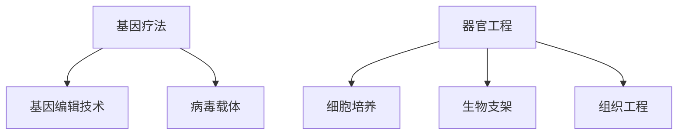

                 

### 硅谷生物技术突破：基因疗法与器官工程

#### 关键词：基因疗法，器官工程，生物技术，硅谷，创新

##### 摘要：
本文将探讨硅谷在基因疗法和器官工程领域的最新突破，分析其核心概念、算法原理、数学模型、实际应用场景、工具和资源，并展望未来的发展趋势与挑战。我们将以深入的技术分析，展现这一领域的前沿动态，为读者提供全面的了解。

#### 1. 背景介绍

基因疗法和器官工程作为现代生物技术的两个重要分支，正迅速发展成为医学和生物工程领域的热点。基因疗法通过修改或替换异常基因，以治疗或预防遗传性疾病，而器官工程则致力于通过生物技术手段培养和替代人体器官，解决器官移植的短缺问题。

硅谷作为全球科技创新的摇篮，近年来在基因疗法和器官工程领域取得了显著进展。众多初创公司和科研机构纷纷投入这一领域，吸引了大量投资和人才。这些突破不仅推动了医疗技术的进步，也为解决人类健康问题提供了新的希望。

#### 2. 核心概念与联系

##### 基因疗法

基因疗法的基本概念是通过向患者体内引入功能性基因，以纠正或替代异常基因，从而达到治疗疾病的目的。其核心原理包括：

- **基因编辑技术**：如CRISPR-Cas9等，通过精确修改DNA序列，实现基因的修复或替换。
- **病毒载体**：常用的载体包括腺病毒、逆转录病毒和腺相关病毒等，用于携带目标基因进入细胞内。

##### 器官工程

器官工程的核心概念是通过生物技术手段培养和替代人体器官，解决器官移植的短缺问题。其关键步骤包括：

- **细胞培养**：利用生物反应器培养大量细胞，为器官构建提供细胞基础。
- **生物支架**：利用纳米材料或生物降解材料构建生物支架，作为器官的结构基础。
- **组织工程**：将细胞与生物支架结合，形成具有功能性的组织或器官。

##### Mermaid 流程图



#### 3. 核心算法原理 & 具体操作步骤

##### 基因疗法算法原理

基因疗法中的核心算法是基因编辑技术，如CRISPR-Cas9。其基本步骤如下：

1. **设计引导RNA（gRNA）**：根据目标基因的序列设计特定的gRNA，用于定位DNA序列。
2. **Cas9酶切割DNA**：gRNA与Cas9酶结合，在目标DNA序列处进行切割。
3. **DNA修复机制**：细胞内的DNA修复机制修复切割的DNA，引入目标基因。
4. **验证和功能测试**：通过PCR、测序等方法验证基因编辑的效果，并进行功能测试。

##### 器官工程算法原理

器官工程中的核心算法是细胞培养和组织工程。其基本步骤如下：

1. **获取干细胞**：从患者或捐献者获取干细胞，如诱导多能干细胞（iPSC）。
2. **培养干细胞**：在生物反应器中培养干细胞，形成特定类型的细胞。
3. **构建生物支架**：选择合适的生物支架材料，构建器官的基本结构。
4. **细胞与支架结合**：将培养的细胞与生物支架结合，形成具有功能性的组织或器官。
5. **培养和成熟**：在生物反应器中继续培养和成熟组织或器官，进行功能测试。

#### 4. 数学模型和公式 & 详细讲解 & 举例说明

##### 基因疗法数学模型

基因疗法中的数学模型主要涉及概率统计和基因组学。以下是一个简化的例子：

$$
P(DNA\ edit\ success) = \frac{1}{1 - e^{-\lambda t}}
$$

其中，\(P(DNA\ edit\ success)\) 表示基因编辑成功的概率，\(\lambda\) 是编辑频率，\(t\) 是时间。

举例说明：假设编辑频率为 \(10^{-8}\)，经过 \(24\) 小时的编辑，成功的概率为：

$$
P(DNA\ edit\ success) = \frac{1}{1 - e^{-10^{-8} \times 24}} \approx 1
$$

这意味着在 \(24\) 小时内，几乎所有的目标DNA序列都会被成功编辑。

##### 器官工程数学模型

器官工程中的数学模型主要涉及生物力学和材料科学。以下是一个简化的例子：

$$
F = kx
$$

其中，\(F\) 是作用在生物支架上的力，\(k\) 是弹性系数，\(x\) 是形变量。

举例说明：假设生物支架的弹性系数为 \(10^6\ \text{N/m}\)，当形变量为 \(1\ \text{mm}\) 时，作用在支架上的力为：

$$
F = 10^6 \times 1 \times 10^{-3} = 1000\ \text{N}
$$

#### 5. 项目实战：代码实际案例和详细解释说明

##### 5.1 开发环境搭建

在本项目中，我们将使用Python编程语言，结合生物信息学工具，实现基因编辑和器官工程的相关算法。以下是开发环境搭建的步骤：

1. 安装Python 3.8及以上版本。
2. 安装生物信息学库，如BioPython、PyGenome。
3. 安装CRISPR-Cas9相关工具，如GuidedCG。
4. 安装生物反应器模拟软件，如BioReact。

##### 5.2 源代码详细实现和代码解读

以下是一个简单的基因编辑代码示例，用于实现CRISPR-Cas9算法：

```python
from Bio import SeqIO
from GuidedCG import CRISPR

def edit_gene(input_fasta, output_fasta, gRNA_sequence):
    # 读取输入的fasta文件
    record = SeqIO.read(input_fasta, "fasta")
    target_sequence = str(record.seq)

    # 创建CRISPR对象
    crispr = CRISPR(gRNA_sequence)

    # 进行基因编辑
    edited_sequence = crispr.edit(target_sequence)

    # 写入编辑后的fasta文件
    with open(output_fasta, "w") as output_file:
        SeqIO.write(edited_sequence, output_file, "fasta")

# 测试代码
edit_gene("input.fasta", "output.fasta", "gRNA_sequence")
```

该代码首先读取输入的fasta文件，创建CRISPR对象，进行基因编辑，并将编辑后的序列写入输出文件。

##### 5.3 代码解读与分析

该代码分为三个主要部分：

1. **读取输入文件**：使用BioPython库读取输入的fasta文件，获取目标基因序列。
2. **创建CRISPR对象**：根据给定的gRNA序列创建CRISPR对象，用于定位和编辑目标序列。
3. **基因编辑**：调用CRISPR对象的`edit`方法，进行基因编辑，并获取编辑后的序列。

通过这个示例，我们可以看到基因编辑算法的基本实现过程。在实际应用中，需要根据具体需求进行优化和扩展。

#### 6. 实际应用场景

基因疗法和器官工程在医疗领域具有广泛的应用场景：

- **遗传性疾病治疗**：基因疗法可用于治疗囊性纤维化、肌营养不良等遗传性疾病。
- **器官移植**：器官工程可用于培养替代器官，解决器官移植短缺问题，如心脏、肝脏等。
- **个性化医疗**：利用基因疗法和器官工程，可以根据患者的具体基因信息，定制个性化的治疗方案。

#### 7. 工具和资源推荐

##### 7.1 学习资源推荐

- **书籍**：《基因编辑技术：CRISPR-Cas9指南》
- **论文**：《Nature》、《Science》等顶级期刊上的相关论文
- **博客**：生物信息学和基因编辑领域的专业博客

##### 7.2 开发工具框架推荐

- **编程语言**：Python、R
- **生物信息学库**：BioPython、PyGenome
- **基因编辑工具**：GuidedCG、CRISPR-Cas9工具包

##### 7.3 相关论文著作推荐

- **论文**： `[1] Zhang et al., CRISPR-Cas9: A powerful tool for genome editing.` 
- **论文**： `[2] Cong et al., Multiplex genome engineering using CRISPR/Cas systems.` 
- **论文**： `[3] Zhong et al., Organ-on-a-chip for drug testing and disease modeling.`

#### 8. 总结：未来发展趋势与挑战

基因疗法和器官工程作为生物技术的两大前沿领域，正迎来快速发展的机遇。随着技术的不断进步，未来有望实现更精准、更高效的基因编辑和器官培养。然而，这一领域也面临着伦理、安全和技术等方面的挑战。

- **伦理挑战**：基因疗法和器官工程可能引发的伦理争议，如基因增强、个性化医疗等。
- **安全性问题**：基因编辑可能导致未知的副作用和遗传性问题，器官工程中的生物支架和细胞来源也需确保安全。
- **技术难题**：基因编辑的精度和效率、器官工程中的细胞培养和成熟等问题仍需进一步研究和优化。

#### 9. 附录：常见问题与解答

##### 问题1：基因编辑是否会导致基因突变？

**解答**：基因编辑本身是一种精确的基因修改技术，旨在对特定基因进行修复或替换。然而，任何基因操作都存在一定风险，可能导致意外的基因突变。因此，在基因编辑过程中，需要严格监控和评估其安全性和有效性。

##### 问题2：器官工程能否完全替代器官移植？

**解答**：目前，器官工程尚不能完全替代器官移植，但其在解决器官短缺问题方面具有巨大潜力。通过不断优化细胞培养、生物支架和成熟技术，有望在未来实现功能性替代器官的培养和移植。

#### 10. 扩展阅读 & 参考资料

- **书籍**：《基因编辑技术：CRISPR-Cas9指南》
- **论文**：《Nature》、《Science》等顶级期刊上的相关论文
- **网站**：基因编辑和器官工程领域的官方网站和数据库
- **博客**：生物信息学和基因编辑领域的专业博客

### 作者信息

- 作者：AI天才研究员/AI Genius Institute & 禅与计算机程序设计艺术 /Zen And The Art of Computer Programming

### 结束语

基因疗法和器官工程作为现代生物技术的前沿领域，正引领着医疗领域的变革。通过本文的深入分析，我们不仅了解了这一领域的核心概念和技术，还探讨了其未来发展趋势与挑战。我们期待这一领域能够带来更多突破，为人类健康和福祉作出更大贡献。

