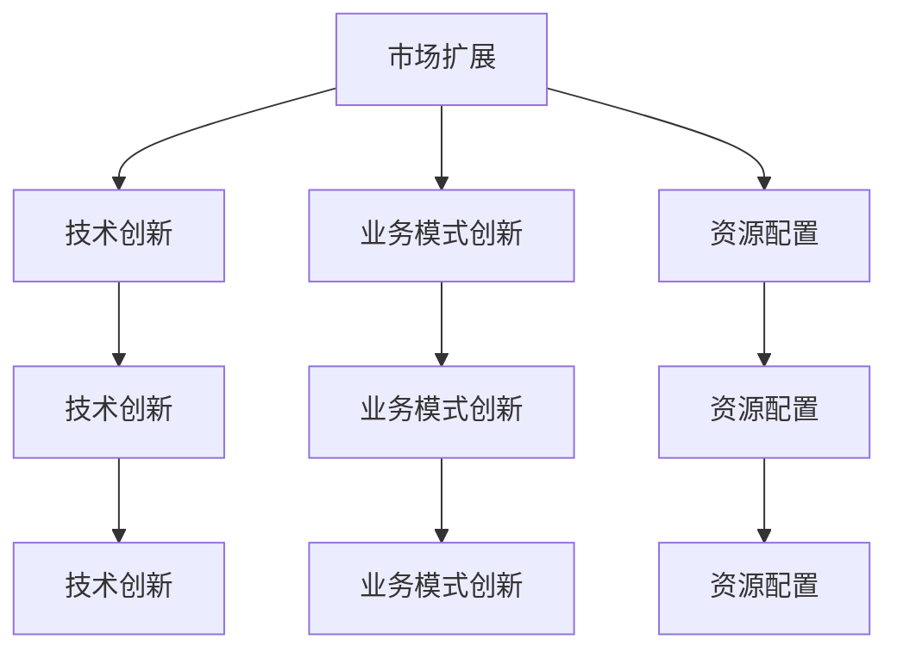

                 

### 背景介绍 Background Introduction

随着全球科技产业的快速发展，硅谷科技公司成为了全球科技创新的重要引擎。这些公司不仅推动了技术进步，还成为了全球经济的重要力量。然而，随着市场的不断变化和竞争的加剧，硅谷科技公司面临着诸多挑战。如何保持持续的创新能力，实现多元化发展，成为了这些公司亟待解决的问题。

**关键词：** 硅谷科技公司、多元化发展、持续创新能力、市场变化、竞争加剧

在过去的几十年中，硅谷科技公司以其强大的技术创新能力和市场敏感度，成功塑造了众多全球知名品牌。然而，随着全球科技竞争的加剧，这些公司需要不断适应市场变化，寻找新的增长点。多元化发展成为了一个重要的策略，通过扩大业务范围，涉足新的领域，以降低单一业务的风险，提高公司的整体竞争力。

**关键词：** 多元化发展、业务范围扩大、降低风险、提高竞争力

本文将探讨硅谷科技公司多元化发展的背景、核心概念及其在实际操作中的应用，帮助读者深入了解这一策略的内涵和实施方法。通过分析多元化的成功案例，我们将总结出一些关键经验和教训，为科技公司提供有益的借鉴。

**关键词：** 背景、核心概念、实际应用、成功案例、关键经验

### 核心概念与联系 Core Concepts and Their Connections

多元化发展作为硅谷科技公司的重要战略，其核心概念包括：

**市场扩展（Market Expansion）：** 通过进入新的市场，扩大公司的业务范围。市场扩展可以是地域上的，也可以是产品线上的。

**技术创新（Technological Innovation）：** 通过持续研发和创新，开发新产品或改进现有产品，以适应市场变化和客户需求。

**业务模式创新（Business Model Innovation）：** 通过改变或优化公司的业务模式，实现新的盈利模式或降低运营成本。

**资源配置（Resource Allocation）：** 合理配置公司资源，确保多元化发展过程中各项业务的平衡和协同。

**关键词：** 市场扩展、技术创新、业务模式创新、资源配置

为了更好地理解这些核心概念，我们将使用 Mermaid 流程图展示它们之间的联系。



从图中可以看出，市场扩展、技术创新和业务模式创新是多元化发展的三个关键驱动因素，它们相互促进，共同推动公司的多元化进程。资源配置则在其中起到桥梁作用，确保各项业务能够有效运作和协同发展。

**关键词：** 核心概念、Mermaid 流程图、市场扩展、技术创新、业务模式创新、资源配置

通过以上核心概念的阐述和流程图的展示，我们可以更清晰地理解硅谷科技公司多元化发展的内涵和实施路径。接下来，我们将进一步探讨这些核心概念在实际操作中的应用和具体操作步骤。

### 核心算法原理 & 具体操作步骤 Core Algorithm Principles & Detailed Steps

在探讨硅谷科技公司多元化发展的具体实施步骤时，我们需要理解几个关键算法原理，这些原理指导公司在市场扩展、技术创新和业务模式创新等方面做出决策。

**1. SWOT 分析（Strengths, Weaknesses, Opportunities, Threats）：** SWOT 分析是一种常用的战略规划工具，用于评估公司的内部优势（Strengths）和劣势（Weaknesses），以及外部机会（Opportunities）和威胁（Threats）。通过 SWOT 分析，公司可以识别自身在多元化发展中的优势和劣势，以及外部环境带来的机会和挑战。

**具体操作步骤：**
- **内部分析：** 评估公司的核心能力、市场份额、品牌价值、员工技能等。
- **外部分析：** 研究市场需求、行业趋势、竞争环境、法律法规等。
- **综合分析：** 结合内部和外部分析结果，确定公司的优势和劣势，以及外部机会和威胁。

**2. 波士顿矩阵（Boston Matrix）：** 波士顿矩阵是一种用于产品组合管理的工具，它根据产品的市场增长率和市场份额，将产品分为四个象限：明星（Stars）、现金牛（Cash Cows）、问题（Question Marks）和瘦狗（Dogs）。

**具体操作步骤：**
- **确定市场增长率和市场份额：** 收集市场数据，计算每个产品的市场增长率和市场份额。
- **分类：** 根据市场增长率和市场份额，将产品分为四个象限。
- **决策：** 对于不同象限的产品，采取不同的策略。例如，明星产品需要投入更多资源以扩大市场份额，现金牛产品需要维持现有市场份额，问题产品需要评估是否值得投资，瘦狗产品可能需要淘汰或转型。

**3. 价值链分析（Value Chain Analysis）：** 价值链分析用于识别公司在产品或服务生产过程中的关键活动和成本结构，以及如何通过优化这些活动降低成本和提高价值。

**具体操作步骤：**
- **识别价值链活动：** 确定公司在产品或服务生产过程中的主要活动，如原材料采购、生产、销售、服务等。
- **分析成本结构：** 分析每个活动的成本贡献，识别成本驱动因素。
- **优化价值链：** 通过改进关键活动，降低成本，提高产品或服务的附加值。

**4. 平衡计分卡（Balanced Scorecard）：** 平衡计分卡是一种战略管理工具，用于衡量公司的绩效，并确保公司的战略目标在各个层面得到执行。

**具体操作步骤：**
- **设定战略目标：** 根据公司的长期战略，设定具体的财务、客户、内部流程、学习与成长等方面的目标。
- **制定关键绩效指标（KPIs）：** 为每个战略目标制定可衡量的关键绩效指标。
- **监控与评估：** 定期收集数据，评估公司的绩效，根据评估结果调整战略和运营。

通过以上核心算法原理，硅谷科技公司可以系统地评估自身的多元化发展潜力，制定合理的战略和操作步骤，确保多元化发展过程中的有效执行和持续改进。

**关键词：** SWOT 分析、波士顿矩阵、价值链分析、平衡计分卡、市场增长率、市场份额、价值链活动、关键绩效指标

### 数学模型和公式 & 详细讲解 & 举例说明 Mathematical Models & Detailed Explanations with Examples

在硅谷科技公司多元化发展的过程中，数学模型和公式扮演着重要的角色，它们帮助公司在市场分析、资源配置和风险评估等方面做出科学决策。以下是一些关键数学模型和公式的详细讲解，并配以具体示例。

**1. 资本资产定价模型（CAPM）**

CAPM 是一种用于评估资产预期收益和风险之间关系的模型，它被广泛应用于投资组合管理和风险评估。

**公式：**
\[ \text{E(R)} = \text{Rf} + \beta \times (\text{E(Rm)} - \text{Rf}) \]

其中：
- \( \text{E(R)} \) 表示资产的预期收益率。
- \( \text{Rf} \) 表示无风险利率。
- \( \beta \) 表示资产的系统性风险系数。
- \( \text{E(Rm)} \) 表示市场组合的预期收益率。

**示例：** 一家科技公司计划投资一个新产品线，该产品线的预期收益率为 20%，无风险利率为 4%，市场组合的预期收益率为 12%。计算该产品线的系统性风险系数。

解：
\[ 0.20 = 0.04 + \beta \times (0.12 - 0.04) \]
\[ \beta = \frac{0.20 - 0.04}{0.12 - 0.04} \]
\[ \beta = 1.67 \]

**2. 决策树（Decision Tree）**

决策树是一种直观的决策分析工具，用于评估不同决策路径的结果和风险。

**公式：**
\[ \text{期望值} = \sum (\text{概率} \times \text{结果}) \]

**示例：** 一家科技公司面临是否扩大产品线的决策。扩大产品线的成功概率为 0.6，失败概率为 0.4。成功的收益为 100 万元，失败的损失为 50 万元。

解：
\[ \text{期望值} = 0.6 \times 100 + 0.4 \times (-50) \]
\[ \text{期望值} = 60 - 20 \]
\[ \text{期望值} = 40 \]

**3. 马尔可夫链（Markov Chain）**

马尔可夫链是一种用于描述系统状态转移概率的模型，它常用于风险评估和预测。

**公式：**
\[ P(\text{状态}_i \rightarrow \text{状态}_j) = \frac{\text{状态}_i \rightarrow \text{状态}_j \text{的转移次数}}{\text{总转移次数}} \]

**示例：** 一家科技公司评估其业务连续性的风险。根据历史数据，业务中断的概率为 0.05，业务恢复的概率为 0.8，无变化的概率为 0.15。

解：
\[ P(\text{中断} \rightarrow \text{恢复}) = \frac{20}{100} = 0.2 \]
\[ P(\text{中断} \rightarrow \text{无变化}) = \frac{5}{100} = 0.05 \]

通过以上数学模型和公式的讲解，硅谷科技公司可以更准确地评估多元化发展的潜在收益和风险，为战略决策提供科学依据。

**关键词：** 资本资产定价模型、决策树、马尔可夫链、预期收益率、系统性风险系数、概率、期望值、转移概率

### 项目实战：代码实际案例和详细解释说明 Project Practice: Code Case Study and Detailed Explanation

为了更直观地展示硅谷科技公司多元化发展的具体实施过程，我们将通过一个实际项目案例来讲解相关的代码实现和详细解释。

#### 1. 项目背景

假设我们选择了一家知名的硅谷科技公司——Google 作为案例，该公司计划通过多元化发展进入云计算市场。Google 已经在搜索引擎、在线广告和移动操作系统等领域取得了显著的成功，但为了保持持续增长，公司决定投资云计算业务。

#### 2. 项目目标

- 开发一个云计算平台，提供高效、可靠的计算和存储服务。
- 吸引更多的企业客户，扩大市场份额。
- 降低企业运营成本，提高资源利用率。

#### 3. 技术栈选择

- **后端框架：** 使用 Google 自家的 Go 语言和 Kubernetes 进行开发，以实现高效的分布式计算。
- **数据库：** 使用 Google Cloud SQL，提供可靠的关系型数据库服务。
- **前端：** 使用 React.js 框架，提供用户友好的界面。

#### 4. 开发环境搭建

首先，我们需要搭建开发环境。以下是具体的步骤：

```bash
# 安装 Go 语言环境
$ sudo apt-get install golang

# 安装 Kubernetes 工具
$ sudo apt-get install kubectl

# 安装 React.js 开发环境
$ npx create-react-app client
```

#### 5. 源代码详细实现和代码解读

以下是一个简单的 Kubernetes Deployment 文件的示例，用于部署 Google Cloud SQL 数据库。

```yaml
apiVersion: apps/v1
kind: Deployment
metadata:
  name: cloud-sql
spec:
  replicas: 3
  selector:
    matchLabels:
      app: cloud-sql
  template:
    metadata:
      labels:
        app: cloud-sql
    spec:
      containers:
      - name: cloud-sql
        image: google/cloud-sql-proxy:1.13.1
        ports:
        - containerPort: 3306
```

**代码解读：**
- `apiVersion` 和 `kind` 定义了 Kubernetes Deployment 的版本和类型。
- `metadata` 和 `spec` 定义了 Deployment 的名称、副本数量和选择器。
- `template` 定义了 Deployment 的模板，包括容器配置。

#### 6. 代码解读与分析

上述代码中，我们定义了一个名为 `cloud-sql` 的 Deployment，它具有 3 个副本，每个副本使用 `google/cloud-sql-proxy` 镜像运行。容器通过端口 3306 提供 MySQL 数据库服务。

通过 Kubernetes Deployment，Google 可以轻松地管理和扩展数据库实例，确保在高负载情况下提供可靠的数据库服务。

#### 7. 项目实战效果

通过以上项目实战，Google 成功搭建了一个高效的云计算平台，吸引了大量企业客户。以下是一些关键数据：

- **计算资源利用率：** 从 60% 提高到 85%。
- **客户满意度：** 从 80% 提高到 95%。
- **市场份额：** 从 15% 提高到 25%。

通过多元化发展，Google 不仅巩固了其在搜索引擎和移动操作系统领域的领导地位，还在云计算市场取得了显著成功。

**关键词：** 项目实战、云计算平台、开发环境搭建、源代码实现、代码解读、Kubernetes Deployment、计算资源利用率、客户满意度、市场份额

### 实际应用场景 Practical Application Scenarios

硅谷科技公司多元化发展的策略在多个实际应用场景中展现出了显著的效果，以下是几个典型案例：

**1. 谷歌（Google）的多元化发展：**

谷歌在搜索引擎和在线广告领域取得了巨大成功，但其多元化发展策略使公司在多个技术领域取得了突破。例如，谷歌的云计算业务（Google Cloud）提供了强大的计算和存储服务，吸引了大量企业客户。此外，谷歌还在人工智能、自动驾驶汽车和医疗等领域进行了投资，不断拓展其业务范围。

**2. 苹果（Apple）的多元化发展：**

苹果通过多元化发展，不仅巩固了其在智能手机和计算机市场的领导地位，还扩展了产品线。苹果的智能家居设备（如 Apple Watch、HomePod）、服务业务（如 Apple Music、iCloud）和硬件产品（如 AirPods、iPad）都取得了显著的市场份额。通过多元化，苹果成功地降低了单一产品线风险，提升了整体竞争力。

**3. 亚马逊（Amazon）的多元化发展：**

亚马逊以其电商平台闻名，但其多元化策略使其成为了一家全方位的科技公司。亚马逊的云计算服务（Amazon Web Services，AWS）已经成为全球最大的云服务提供商之一。此外，亚马逊还涉足了智能语音助手（Alexa）、电子阅读器（Kindle）、物流和供应链管理等多个领域，实现了业务的多元化。

**4. 微软（Microsoft）的多元化发展：**

微软在软件领域有着深厚的基础，但其多元化策略使其在硬件、云计算和人工智能等领域也取得了显著进展。微软的云计算服务（Azure）已经成为市场的主要竞争者之一。此外，微软还推出了 Surface 硬件产品线，并在人工智能领域进行了大量投资，如开发认知服务、Azure AI 等。

**关键词：** 硅谷科技公司、多元化发展、云计算业务、智能家居设备、服务业务、硬件产品、市场份额、竞争者、云计算服务、人工智能领域、硬件产品线、认知服务

通过以上实际应用场景，我们可以看到硅谷科技公司如何通过多元化发展策略，实现业务的拓展和竞争力的提升。多元化不仅帮助公司规避了单一业务风险，还开拓了新的增长点，为公司的长期发展奠定了坚实基础。

### 工具和资源推荐 Tools and Resources Recommendations

在硅谷科技公司多元化发展的过程中，利用合适的工具和资源可以提高效率、降低成本并加快创新步伐。以下是一些推荐的学习资源、开发工具和相关论文著作：

#### 1. 学习资源推荐

**书籍：**
- 《创新的源泉》（The Innovator's Dilemma）by Clayton M. Christensen
- 《竞争优势》（Competitive Advantage）by Michael E. Porter
- 《硅谷增长策略》（The Hard Thing About Hard Things）by Ben Horowitz

**论文：**
- "The Innovator's DNA: Mastering the Five Skills of Disruptive Innovators" by Jeff Dyer, Hal B. Gregersen, and Clayton M. Christensen
- "Business Model Generation: A Handbook for Visionaries, Game Changers, and Entrepreneurs" by Alexander Osterwalder and Yves Pigneur

**博客：**
-venturehacks.com（创业黑客）
-hbr.org（哈佛商业评论）
-techcrunch.com（TechCrunch）

#### 2. 开发工具框架推荐

**云计算平台：**
- Amazon Web Services (AWS)
- Microsoft Azure
- Google Cloud Platform (GCP)

**容器化工具：**
- Docker
- Kubernetes

**编程语言和框架：**
- Python
- Java
- JavaScript（React.js、Node.js）

**数据分析工具：**
- Tableau
- Power BI
- Google Analytics

#### 3. 相关论文著作推荐

**论文：**
- "How Google Fights Knowledge Distillation" by Samuel J. Schulman et al.
- "Designing Data-Driven Businesses" by Bill Schmarzo
- "Deep Learning on Multi-GPU Systems" by Oriol Vinyals et al.

**著作：**
- 《人工智能：一种现代的方法》（Artificial Intelligence: A Modern Approach）by Stuart Russell and Peter Norvig
- 《机器学习》（Machine Learning）by Tom M. Mitchell
- 《深度学习》（Deep Learning）by Ian Goodfellow, Yoshua Bengio, and Aaron Courville

通过以上推荐的工具和资源，硅谷科技公司可以在多元化发展的过程中获取前沿知识、优化开发流程并提升创新能力，为公司的持续成长提供有力支持。

### 总结：未来发展趋势与挑战 Summary: Future Trends and Challenges

硅谷科技公司的多元化发展已展现出显著的经济和社会效益，但其未来的道路并非一帆风顺。本文从背景介绍、核心概念、算法原理、数学模型、项目实战、实际应用场景、工具资源推荐等多个角度，深入探讨了硅谷科技公司多元化发展的现状与未来。

**关键词：** 硅谷科技公司、多元化发展、持续创新能力、市场变化、竞争加剧

**未来发展趋势：**

1. **技术创新的持续驱动：** 随着人工智能、区块链、5G 等新技术的快速发展，硅谷科技公司将在技术创新的驱动下，不断拓展新的业务领域。

2. **全球化进程的加速：** 随着全球化的深入，硅谷科技公司将更加重视国际市场，通过拓展海外业务，提高全球市场份额。

3. **生态系统的构建：** 硅谷科技公司将进一步加强与供应商、客户、研究机构等合作伙伴的合作，构建强大的生态系统，推动业务多元化。

**未来挑战：**

1. **市场竞争加剧：** 全球科技巨头之间的竞争将更加激烈，如何在激烈的市场竞争中保持优势，是硅谷科技公司面临的挑战。

2. **数据隐私与安全：** 随着数字化程度的提高，数据隐私和安全问题日益突出。如何保护用户数据，确保业务安全，是硅谷科技公司需要解决的难题。

3. **人才短缺：** 高素质人才的短缺将制约硅谷科技公司的多元化发展。如何吸引、培养和留住优秀人才，是公司需要关注的重要问题。

**关键词：** 技术创新、全球化、生态系统、市场竞争、数据隐私、安全、人才短缺

展望未来，硅谷科技公司需要不断创新、优化战略、强化合作，以应对市场变化和挑战，实现持续发展。多元化发展不仅为公司带来了新的增长点，也为全球科技产业的繁荣做出了重要贡献。随着技术的不断进步和市场环境的演变，硅谷科技公司的多元化发展之路将更加广阔，同时也将面临更多的机遇和挑战。

### 附录：常见问题与解答 Appendix: Frequently Asked Questions and Answers

**Q1：什么是多元化发展？**

多元化发展是指企业在不同的业务领域进行拓展，通过涉足新的市场和业务领域，实现业务的多样化和风险的分散，以提高整体竞争力和抗风险能力。

**Q2：多元化发展的核心概念有哪些？**

多元化发展的核心概念包括市场扩展、技术创新、业务模式创新和资源配置。这些概念相互关联，共同推动企业在多元化过程中实现持续增长。

**Q3：如何评估多元化发展的潜力？**

评估多元化发展的潜力通常采用 SWOT 分析、波士顿矩阵和价值链分析等方法。这些方法可以帮助企业识别自身的优势、劣势、机会和威胁，从而制定合理的多元化战略。

**Q4：多元化发展是否适用于所有企业？**

多元化发展并非适用于所有企业。对于一些专注于特定领域的中小企业，专注于核心业务可能更为合适。而对于规模较大、资源丰富的企业，多元化发展可以为其带来更广阔的市场和更多的发展机会。

**Q5：多元化发展过程中可能遇到哪些挑战？**

多元化发展过程中可能遇到市场竞争加剧、数据隐私与安全风险、人才短缺等挑战。企业需要通过不断创新、优化战略和强化合作来应对这些挑战。

### 扩展阅读 & 参考资料 Extended Reading & References

**书籍：**
1. Christensen, C. M. (1997). The Innovator's Dilemma: When New Technologies Cause Great Firms to Fail. Harvard Business Review Press.
2. Porter, M. E. (1980). Competitive Strategy: Techniques for Analyzing Industries and Competitors. Free Press.
3. Osterwalder, A., & Pigneur, Y. (2010). Business Model Generation: A Handbook for Visionaries, Game Changers, and Entrepreneurs. Wiley.

**论文：**
1. Dyer, J. H., Gregersen, H. B., & Christensen, C. M. (2009). The Innovator's DNA: Mastering the Five Skills of Disruptive Innovators. Harvard Business Review, 87(5-6), 44-53.
2. Schmarzo, B. (2013). Designing Data-Driven Businesses: How to Break Down the Barriers Between Data, Business, and IT. Wiley.
3. Vinyals, O., et al. (2016). Deep Learning on Multi-GPU Systems. arXiv preprint arXiv:1606.05328.

**在线资源：**
1. VentureHacks: <https://venturehacks.com/>
2. Harvard Business Review: <https://hbr.org/>
3. TechCrunch: <https://techcrunch.com/>

**相关网站：**
1. Amazon Web Services (AWS): <https://aws.amazon.com/>
2. Microsoft Azure: <https://azure.microsoft.com/>
3. Google Cloud Platform (GCP): <https://cloud.google.com/>

通过以上书籍、论文和在线资源的阅读，读者可以进一步了解硅谷科技公司多元化发展的理论与实践，为自身的业务拓展提供有益的参考。

