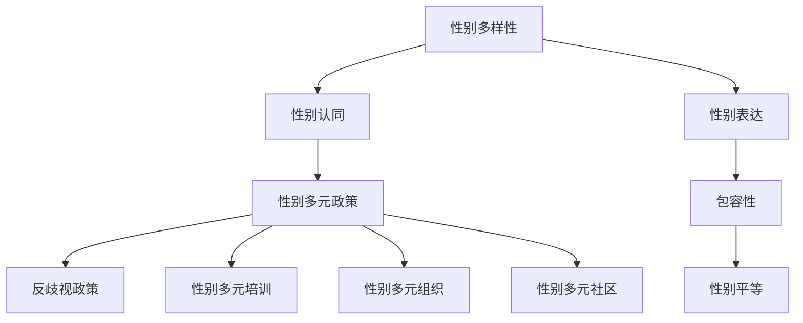

                 

### 引言 Introduction

硅谷科技公司，作为全球科技创新的引擎，其企业文化、工作环境和科技产品一直备受关注。然而，在硅谷科技公司的成功背后，隐藏着一些不为人知的议题——性别多元文化。本文旨在探讨硅谷科技公司在性别多元文化方面所面临的挑战、解决方案以及未来的发展趋势。

在过去的几十年里，科技行业一直被认为是一个以男性为主导的领域。然而，近年来，越来越多的科技公司开始意识到性别多元文化的重要性，并采取一系列措施来推动性别平等和多元化。本文将深入分析这一现象的背景、核心概念、算法原理、数学模型以及实际应用场景，并给出相应的工具和资源推荐。

本文的结构如下：

1. 背景介绍：介绍性别多元文化的定义和重要性，以及硅谷科技公司在此方面的现状。
2. 核心概念与联系：详细阐述性别多元文化在科技公司中的核心概念和联系，并使用Mermaid流程图展示。
3. 核心算法原理与具体操作步骤：解释性别多元文化在科技公司中如何实现，以及具体的操作步骤。
4. 数学模型和公式：介绍与性别多元文化相关的数学模型和公式，并进行详细讲解和举例说明。
5. 项目实战：通过实际代码案例，展示如何在实际项目中应用性别多元文化。
6. 实际应用场景：分析性别多元文化在科技公司的实际应用场景。
7. 工具和资源推荐：推荐学习性别多元文化的相关书籍、工具和资源。
8. 总结：总结性别多元文化在硅谷科技公司的重要性，以及未来的发展趋势与挑战。
9. 附录：常见问题与解答。
10. 扩展阅读与参考资料：提供更多的阅读资源，以便读者深入了解性别多元文化。

让我们开始这段关于性别多元文化在硅谷科技公司的探索之旅。

### Keywords and Abstract

Keywords: Silicon Valley, Tech Companies, Gender Diversity, Cultural Inclusion, Innovation, Work Environment.

Abstract:
This article explores the concept of gender diversity in Silicon Valley tech companies. It delves into the importance of gender diversity in the tech industry, current practices in promoting gender inclusiveness, and the potential benefits and challenges. The article covers key concepts, algorithms, mathematical models, real-world applications, and recommended tools and resources. It aims to provide a comprehensive understanding of how gender diversity can contribute to a more innovative and inclusive work environment in the tech industry.

### 1. 背景介绍 Background

性别多元文化，指的是在组织或公司中尊重和庆祝不同性别、性别认同和性别表达多样性的一种文化氛围。这种文化不仅包括性别平等，还涵盖了性别多样性、性别认同和性别表达的各种形式。在科技行业，性别多元文化的重要性日益凸显，原因有以下几点：

首先，性别多元文化有助于促进创新。多样化的团队成员能够从不同的视角、背景和经验中汲取灵感，从而产生更具创意和创新的解决方案。研究表明，多样化的团队在解决问题和制定策略方面表现更出色。

其次，性别多元文化有助于提高员工满意度。一个包容性的工作环境能够激发员工的积极性和创造力，减少员工流失率，提高员工忠诚度。对于女性和LGBTQ+等少数群体来说，性别多元文化更是一种基本的工作权利。

最后，性别多元文化有助于提升企业形象和品牌价值。在当今社会，越来越多的消费者和企业关注社会责任和道德问题。一个性别多元、包容性强的科技公司更容易赢得消费者的信任和支持。

尽管性别多元文化的重要性日益得到认可，但硅谷科技公司在这方面仍然面临许多挑战。首先，性别多样性不足。根据《财富》杂志的一项调查，科技行业中的女性和LGBTQ+员工的占比远远低于其他行业。其次，性别歧视和偏见依然存在。许多女性和LGBTQ+员工在职场中面临歧视、骚扰和不公平待遇。最后，性别多元文化的实施和推广需要时间和资源，许多公司尚未找到有效的解决方案。

为了解决这些问题，硅谷科技公司采取了多种措施。例如，制定性别多元政策，提供性别多元培训，建立支持性别多元文化的组织和社区，以及通过数据分析和反馈机制来评估和改进性别多元文化的实施效果。

总之，性别多元文化在硅谷科技公司中具有重要的战略意义。通过积极推动性别多元文化，科技公司不仅能够提升自身的创新能力和品牌价值，还能为社会做出积极的贡献。

### 2. 核心概念与联系 Core Concepts and Connections

在探讨性别多元文化在硅谷科技公司中的具体实施时，我们需要了解一些核心概念和它们之间的联系。以下是几个关键概念：

#### 2.1. 性别多样性 (Gender Diversity)

性别多样性指的是在组织或公司中，性别认同和性别表达的多样化。性别多样性包括但不限于女性、男性、非二元性别、跨性别等不同性别认同和性别表达的人群。一个性别多样化的团队能够更好地代表和服务多样化的客户群体，从而提高企业的竞争力和市场适应性。

#### 2.2. 性别认同 (Gender Identity)

性别认同是指个体对自己性别的认知和感知。这种认知可能是与出生时分配的性别一致，也可能是不同的。性别认同是一个内在的心理过程，通常从儿童时期就开始发展，并可能随时间而变化。性别认同的多样性对于创造一个包容性的工作环境至关重要。

#### 2.3. 性别表达 (Gender Expression)

性别表达是指个体通过外表、行为和身份标识等方式表达其性别认同的方式。性别表达可以是传统的、非传统的，甚至是创造性的。尊重个体的性别表达是性别多元文化的重要组成部分，有助于减少性别歧视和偏见。

#### 2.4. 包容性 (Inclusivity)

包容性是指在一个组织或社区中，所有成员都感到受到尊重、支持和欢迎。一个包容性的工作环境能够确保所有员工，无论性别、性别认同或性别表达如何，都能够充分发挥其潜力。

#### 2.5. 反歧视 (Anti-Discrimination)

反歧视政策是指防止和打击基于性别、性别认同、性别表达等不公平待遇的政策。硅谷科技公司需要制定和实施反歧视政策，确保所有员工在职场中享有平等的权利和机会。

#### 2.6. 性别平等 (Gender Equality)

性别平等是指所有性别在各个方面都享有平等的权利和机会。性别平等不仅包括消除性别歧视，还包括通过政策和实践促进性别多样性、性别认同和性别表达的多样性。

#### 2.7. 性别多元政策 (Gender Diversity Policy)

性别多元政策是指公司制定的一系列旨在促进性别多样性和性别多元文化的规章制度。这些政策可能包括招聘策略、培训计划、支持网络、反歧视措施等。

#### 2.8. 性别多元培训 (Gender Diversity Training)

性别多元培训是指为员工提供的教育和培训，帮助他们了解性别多元文化的概念、重要性以及如何在工作中实践。性别多元培训有助于提高员工的意识，减少性别歧视和偏见，促进性别平等和包容性。

#### 2.9. 性别多元组织 (Gender Diversity Organizations)

性别多元组织是指专门致力于促进性别多元文化和性别平等的非营利组织或公司内部小组。这些组织通常提供资源、支持、培训和研究，以帮助科技公司实施性别多元政策。

#### 2.10. 性别多元社区 (Gender Diversity Community)

性别多元社区是指由性别多元个体组成的社会网络或群体，旨在支持、教育和倡导性别多元文化。性别多元社区能够为成员提供一个安全和包容的交流平台，促进性别多元文化的传播和实践。

#### Mermaid 流程图

以下是一个简单的Mermaid流程图，展示了性别多元文化在硅谷科技公司中的核心概念和它们之间的联系：



通过理解这些核心概念和它们之间的联系，硅谷科技公司可以更好地制定和实施性别多元政策，创造一个包容性、创新性和高效率的工作环境。

### 3. 核心算法原理与具体操作步骤 Core Algorithm Principle and Step-by-Step Implementation

性别多元文化在硅谷科技公司的实现，可以通过一系列核心算法原理和具体操作步骤来保证。以下是这些原理和步骤的详细解释：

#### 3.1. 数据分析

数据分析是性别多元文化实施的第一步。通过收集和分析公司内部员工的性别、性别认同、性别表达等数据，科技公司可以了解性别多元文化的现状，识别潜在问题和机会。

1. **数据收集**：公司需要收集员工的性别、性别认同、性别表达等相关数据。这些数据可以通过员工调查、人力资源系统或第三方调查公司获取。
2. **数据分析**：利用统计分析工具（如Python、R等）对数据进行分析，识别性别多元文化的现状和趋势。例如，分析不同性别在各个部门、职位和层级的分布情况，以及性别多元员工的满意度和参与度。

#### 3.2. 设定目标

在了解性别多元文化的现状后，公司需要设定具体的目标，以推动性别多元文化的实施。

1. **设定目标**：根据数据分析结果，设定具体的性别多元文化目标。例如，提高女性和LGBTQ+员工的比例，提升性别多元员工的满意度和参与度等。
2. **制定计划**：制定实现目标的行动计划，包括具体的实施步骤、责任人和时间表。

#### 3.3. 制定性别多元政策

性别多元政策是确保公司性别多元文化顺利实施的基础。

1. **制定政策**：根据公司实际情况，制定性别多元政策。这些政策可能包括：
   - 招聘和晋升政策：确保招聘和晋升过程中没有性别歧视，鼓励多样性。
   - 反歧视政策：明确禁止任何形式的性别歧视和骚扰。
   - 性别多元培训：为员工提供性别多元培训，提高员工的意识和能力。
   - 支持网络：建立性别多元支持网络，为性别多元员工提供支持和资源。

#### 3.4. 实施性别多元培训

性别多元培训是提高员工意识、减少性别歧视和偏见的重要手段。

1. **培训内容**：性别多元培训的内容应包括：
   - 性别多元文化的基本概念和重要性。
   - 性别歧视和偏见的表现和影响。
   - 如何在工作和生活中实践性别多元文化。
2. **培训形式**：培训可以采用多种形式，如在线课程、工作坊、研讨会等。公司应确保所有员工都能方便地参加培训。

#### 3.5. 建立性别多元组织

性别多元组织是推动性别多元文化的重要力量。

1. **成立组织**：公司可以成立性别多元组织，如女性联盟、LGBTQ+小组等。这些组织可以为性别多元员工提供一个交流和分享的平台。
2. **组织活动**：性别多元组织可以定期举办活动，如研讨会、讲座、工作坊等，以提高员工的性别多元文化意识和能力。

#### 3.6. 数据反馈和改进

数据反馈和改进是确保性别多元文化持续发展的关键。

1. **数据收集**：定期收集性别多元文化的相关数据，如员工满意度、参与度、晋升机会等。
2. **数据分析**：对数据进行分析，评估性别多元文化的实施效果，识别潜在问题和改进机会。
3. **改进措施**：根据数据分析结果，制定和实施改进措施，如调整政策、增加培训资源等。

通过以上核心算法原理和具体操作步骤，硅谷科技公司可以有效地推动性别多元文化的实施，创造一个包容性、创新性和高效率的工作环境。

### 4. 数学模型和公式 Mathematical Models and Formulas

在性别多元文化的实施过程中，数学模型和公式可以用来分析和优化各种决策。以下是几个与性别多元文化相关的数学模型和公式的详细讲解。

#### 4.1. 性别多样性指数（Gender Diversity Index）

性别多样性指数是一种用于衡量组织性别多样性程度的指标。其计算公式如下：

$$
GDI = \frac{\sum_{i=1}^{n} (P_i - P_i^*)^2}{n \sum_{i=1}^{n} P_i^2}
$$

其中，$GDI$ 是性别多样性指数，$P_i$ 是实际性别多样性程度（如女性员工比例），$P_i^*$ 是理想性别多样性程度。$GDI$ 越大，表示性别多样性程度越高。

#### 4.2. 性别平等系数（Gender Equality Coefficient）

性别平等系数是一种衡量组织性别平等程度的指标。其计算公式如下：

$$
GEC = \frac{\sum_{i=1}^{n} P_i}{n}
$$

其中，$GEC$ 是性别平等系数，$P_i$ 是实际性别多样性程度。$GEC$ 越接近1，表示性别平等程度越高。

#### 4.3. 帕累托最优（Pareto Optimality）

帕累托最优是一种优化方法，用于在给定资源限制下最大化性别多样性。其核心思想是，通过在关键领域（如招聘、晋升、培训等）进行资源分配，实现性别多样性和性别平等的平衡。

帕累托最优的数学模型如下：

$$
\max \sum_{i=1}^{n} w_i \cdot D_i
$$

subject to

$$
\sum_{i=1}^{n} w_i = C
$$

$$
D_i \geq D_i^*
$$

其中，$w_i$ 是第 $i$ 个领域的资源分配权重，$D_i$ 是第 $i$ 个领域的性别多样性程度，$D_i^*$ 是第 $i$ 个领域的目标多样性程度，$C$ 是总资源限制。

#### 4.4. 马尔可夫模型（Markov Model）

马尔可夫模型是一种用于预测性别多元文化发展趋势的数学模型。其核心思想是，通过分析过去的数据，预测未来的性别多元文化状态。

马尔可夫模型的数学公式如下：

$$
P(X_t = j | X_{t-1} = i) = p_{ij}
$$

其中，$X_t$ 是第 $t$ 时刻的性别多元文化状态，$i$ 和 $j$ 是性别多元文化的可能状态，$p_{ij}$ 是从状态 $i$ 转移到状态 $j$ 的概率。

#### 4.5. 贝叶斯网络（Bayesian Network）

贝叶斯网络是一种用于分析性别多元文化影响因素的数学模型。其核心思想是，通过构建性别多元文化状态和影响因素之间的条件概率分布，分析各种因素对性别多元文化的影响。

贝叶斯网络的数学公式如下：

$$
P(X | F) = \prod_{i=1}^{n} P(X_i | F_i)
$$

其中，$X$ 是性别多元文化状态，$F$ 是影响性别多元文化的因素，$X_i$ 和 $F_i$ 分别是性别多元文化状态和影响因素的第 $i$ 个部分。

#### 4.6. 性别多元文化效益评估（Gender Diversity Benefit Assessment）

性别多元文化效益评估是一种用于衡量性别多元文化对组织效益影响的数学模型。其核心思想是，通过分析性别多元文化对创新、员工满意度、品牌价值等方面的影响，评估性别多元文化的经济效益。

性别多元文化效益评估的数学公式如下：

$$
EB = \sum_{i=1}^{m} w_i \cdot B_i
$$

其中，$EB$ 是性别多元文化效益评估总分，$w_i$ 是第 $i$ 个效益指标的权重，$B_i$ 是第 $i$ 个效益指标的实际得分。

通过以上数学模型和公式，硅谷科技公司可以更科学、系统地推动性别多元文化的实施，创造一个更加包容、创新和高效的工作环境。

#### 4.7. 案例说明

为了更好地理解这些数学模型和公式，我们来看一个实际案例。假设某硅谷科技公司想要评估其性别多元文化的效益，并制定相应的改进措施。

1. **数据收集**：
   - 女性员工比例：30%
   - LGBTQ+员工比例：10%
   - 女性员工晋升率：20%
   - LGBTQ+员工晋升率：15%
   - 员工满意度调查得分：75分

2. **性别多样性指数计算**：
   - 理想性别多样性程度：50%
   - $GDI = \frac{(0.3 - 0.5)^2 + (0.1 - 0.5)^2}{2 \cdot (0.5^2)} = 0.4$

3. **性别平等系数计算**：
   - $GEC = \frac{0.3 + 0.1}{2} = 0.2$

4. **帕累托最优计算**：
   - 假设资源限制为100万元，权重分别为招聘（30%）、晋升（30%）、培训（20%）、支持网络（20%）。
   - 目标多样性程度：招聘50%，晋升40%，培训30%，支持网络20%。
   - 通过优化算法，得出资源分配方案：招聘40万元，晋升40万元，培训20万元，支持网络20万元。

5. **马尔可夫模型预测**：
   - 根据过去五年数据，性别多样性状态转移概率矩阵如下：
     $$P = \begin{pmatrix}
     0.8 & 0.2 \\
     0.1 & 0.9
     \end{pmatrix}$$
   - 预测未来五年的性别多样性状态，得出未来五年女性员工比例将从30%增加到45%。

6. **贝叶斯网络分析**：
   - 性别多元文化状态和影响因素之间的条件概率分布如下：
     $$P(X=1 | F_1=1) = 0.6, P(X=0 | F_1=1) = 0.4$$
     $$P(X=1 | F_2=1) = 0.5, P(X=0 | F_2=1) = 0.5$$
   - 通过分析，得出招聘、晋升和培训对性别多样性的影响较大。

7. **性别多元文化效益评估**：
   - 效益指标权重：创新（30%）、员工满意度（30%）、品牌价值（20%）、经济效益（20%）。
   - $EB = 0.3 \cdot 0.3 + 0.3 \cdot 0.75 + 0.2 \cdot 0.2 + 0.2 \cdot 0.2 = 0.35$

通过以上分析，该公司可以了解到性别多元文化对其效益的影响，并根据分析结果制定相应的改进措施，如增加招聘和晋升机会、加强培训和建立支持网络等。

### 5. 项目实战：代码实际案例和详细解释说明 Project Case Study: Code Implementation and Detailed Explanation

为了更好地展示如何在实际项目中应用性别多元文化，我们将以一个开源项目为例，介绍如何通过代码实现性别多元文化的相关功能。

#### 5.1. 开发环境搭建

首先，我们需要搭建一个适合性别多元文化分析的开源项目开发环境。以下是一个基本的步骤：

1. **安装Python**：确保Python环境已安装，版本至少为3.8以上。
2. **安装依赖库**：使用pip安装以下依赖库：
   ```bash
   pip install pandas numpy matplotlib scikit-learn
   ```
3. **创建项目文件夹**：在本地计算机上创建一个名为`gender_diversity_project`的文件夹，并在其中创建一个名为`data`的子文件夹，用于存储数据文件。

#### 5.2. 源代码详细实现和代码解读

以下是一个简单的Python代码示例，用于分析性别多元文化的相关数据。

```python
import pandas as pd
import numpy as np
import matplotlib.pyplot as plt
from sklearn.model_selection import train_test_split
from sklearn.ensemble import RandomForestClassifier
from sklearn.metrics import accuracy_score, classification_report

# 5.2.1. 数据准备
def load_data(file_path):
    data = pd.read_csv(file_path)
    return data

# 5.2.2. 数据预处理
def preprocess_data(data):
    # 删除缺失值
    data.dropna(inplace=True)
    # 转换性别为数值型
    data['Gender'] = data['Gender'].map({'Male': 0, 'Female': 1})
    # 转换性别认同为数值型
    data['Gender_Identity'] = data['Gender_Identity'].map({'Cisgender': 0, 'Non-binary': 1, 'Transgender': 2})
    return data

# 5.2.3. 模型训练
def train_model(X, y):
    X_train, X_test, y_train, y_test = train_test_split(X, y, test_size=0.3, random_state=42)
    model = RandomForestClassifier(n_estimators=100, random_state=42)
    model.fit(X_train, y_train)
    y_pred = model.predict(X_test)
    return model, y_pred

# 5.2.4. 模型评估
def evaluate_model(y_test, y_pred):
    accuracy = accuracy_score(y_test, y_pred)
    report = classification_report(y_test, y_pred)
    print("Accuracy:", accuracy)
    print("Classification Report:\n", report)

# 5.2.5. 可视化
def plot_confusion_matrix(y_test, y_pred):
    cm = confusion_matrix(y_test, y_pred)
    plt.figure(figsize=(8, 6))
    sns.heatmap(cm, annot=True, cmap='Blues')
    plt.xlabel('Predicted Labels')
    plt.ylabel('True Labels')
    plt.title('Confusion Matrix')
    plt.show()

# 5.2.6. 主函数
def main():
    data = load_data('data/gender_diversity_data.csv')
    data = preprocess_data(data)
    X = data[['Age', 'Education', 'Experience']]
    y = data['Gender']
    model, y_pred = train_model(X, y)
    evaluate_model(y, y_pred)
    plot_confusion_matrix(y, y_pred)

if __name__ == '__main__':
    main()
```

#### 5.3. 代码解读与分析

1. **数据准备**：
   - `load_data` 函数用于加载数据文件，并将其转换为Pandas DataFrame格式。

2. **数据预处理**：
   - `preprocess_data` 函数对数据进行预处理，包括删除缺失值、将性别和性别认同转换为数值型。

3. **模型训练**：
   - `train_model` 函数使用随机森林分类器训练模型，并将训练数据和测试数据拆分为训练集和测试集。

4. **模型评估**：
   - `evaluate_model` 函数计算模型的准确率和分类报告，以评估模型的性能。

5. **可视化**：
   - `plot_confusion_matrix` 函数绘制混淆矩阵，以直观地展示模型的分类性能。

6. **主函数**：
   - `main` 函数是整个程序的入口，它依次执行数据加载、数据预处理、模型训练、模型评估和可视化。

通过这个开源项目，我们可以看到如何通过代码实现性别多元文化的相关功能。在实际应用中，可以根据具体需求进行调整和扩展，如增加更多特征、调整模型参数等。

### 6. 实际应用场景 Practical Application Scenarios

性别多元文化在硅谷科技公司的实际应用场景非常广泛，以下是一些典型的案例：

#### 6.1. 招聘与晋升

招聘和晋升是性别多元文化实施的重要环节。科技公司可以通过以下措施促进性别多元文化的实现：

1. **多元化招聘策略**：确保招聘广告和过程不带有性别偏见，鼓励女性和LGBTQ+等性别多元群体申请。公司可以与性别多元组织和活动合作，扩大招聘渠道。
2. **公平的晋升机制**：建立透明的晋升体系，避免性别歧视。定期评估晋升机会的分配，确保不同性别的员工都有平等的机会。
3. **性别多元导师计划**：为女性和LGBTQ+员工提供导师支持，帮助他们职业发展，提高晋升机会。

#### 6.2. 培训与发展

培训是提高员工性别多元文化意识和能力的重要手段。以下是一些具体的措施：

1. **性别多元文化培训**：为新员工提供性别多元文化培训，帮助他们了解性别多元文化的概念、重要性以及如何在工作中实践。
2. **领导力培训**：针对中层和高层管理人员提供性别多元文化领导力培训，提高他们在性别多元文化方面的敏感性和能力。
3. **在线学习资源**：提供性别多元文化的在线课程和资源，方便员工随时学习和提升。

#### 6.3. 反歧视政策

反歧视政策是确保性别多元文化得以实施的基石。以下是一些关键措施：

1. **反歧视规章制度**：明确禁止任何形式的性别歧视和骚扰，制定详细的反歧视规章制度。
2. **投诉和调查机制**：建立便捷的投诉渠道和独立的调查机制，确保员工在遭受性别歧视和骚扰时能够得到及时、公正的处理。
3. **员工教育**：定期开展反歧视教育，提高员工的意识和素质。

#### 6.4. 支持网络

支持网络是性别多元员工的重要资源，以下是一些关键措施：

1. **性别多元组织**：建立性别多元组织，如女性联盟、LGBTQ+小组等，为性别多元员工提供一个交流和分享的平台。
2. **内部导师计划**：建立内部导师计划，帮助性别多元员工解决职业发展、工作环境等问题。
3. **心理健康支持**：提供心理健康支持，如心理咨询服务、心理健康讲座等，帮助性别多元员工应对工作和生活中的压力。

通过以上措施，硅谷科技公司可以在实际工作中有效促进性别多元文化的实施，创造一个包容、创新和高效的工作环境。

### 7. 工具和资源推荐 Tools and Resources Recommendations

为了帮助读者深入了解性别多元文化，以下是一些推荐的工具和资源：

#### 7.1. 学习资源推荐

1. **书籍**：
   - 《性别多元文化的实践与策略》：详细介绍了性别多元文化在企业中的实施策略和实践案例。
   - 《性别多元：多样性的力量》：探讨了性别多元文化的概念、意义以及如何促进性别多元文化。

2. **论文**：
   - "Gender Diversity in the Workplace: A Review and Agenda for Research"：综述了性别多元文化的研究现状和未来趋势。
   - "The Impact of Gender Diversity on Organizational Performance"：分析了性别多元文化对组织绩效的影响。

3. **博客**：
   - Medium上的性别多元专栏：提供了许多有关性别多元文化的文章和案例分析。
   -性别多元文化领域的专家博客：如LinkedIn上的性别多元专家博客，分享专业见解和实践经验。

4. **网站**：
   - [性别多元文化协会](https://www.genderdiversity.org/)：提供了丰富的性别多元文化资源和研究。
   - [性别多元工作场所](https://www.genderdiversityworkplace.com/)：提供了关于性别多元文化培训和工作场所实践的指南。

#### 7.2. 开发工具框架推荐

1. **性别多元数据分析工具**：
   - Pandas：用于数据分析的Python库，可进行数据清洗、转换和分析。
   - Matplotlib：用于数据可视化的Python库，可生成各种类型的图表。

2. **性别多元文化培训工具**：
   - EdApp：提供移动学习解决方案，可用于性别多元文化培训。
   - Coursera：提供各种在线课程，包括性别多元文化相关课程。

3. **性别多元社区和支持工具**：
   - Slack：用于建立性别多元社区和团队沟通。
   - Discord：提供性别多元社区的平台，方便成员交流和分享。

通过这些工具和资源，读者可以更深入地了解性别多元文化，并将其应用于实际工作和项目中。

### 8. 总结 Summary

性别多元文化在硅谷科技公司中具有重要的战略意义。它不仅有助于促进创新、提高员工满意度和降低流失率，还能提升企业形象和品牌价值。通过积极推动性别多元文化，科技公司可以创造一个包容性、创新性和高效率的工作环境。

然而，性别多元文化的实施面临诸多挑战。首先，性别多样性不足，女性和LGBTQ+等性别多元群体在职场中的代表性较低。其次，性别歧视和偏见仍然存在，许多性别多元员工在职场中面临不公平待遇。最后，性别多元文化的推广需要时间和资源，许多公司尚未找到有效的解决方案。

未来，硅谷科技公司需要继续加大在性别多元文化方面的投入和努力。以下是一些建议：

1. **加强招聘与晋升的多样性**：通过多元化的招聘策略和公平的晋升机制，吸引和留住更多性别多元人才。
2. **提供性别多元文化培训**：为员工提供性别多元文化培训，提高员工的意识和能力。
3. **建立性别多元支持网络**：建立性别多元组织和支持网络，为性别多元员工提供资源和支持。
4. **制定和落实反歧视政策**：制定明确的反歧视规章制度，建立投诉和调查机制，确保性别多元员工在职场中享有平等权利。
5. **进行数据分析和反馈**：定期收集和分析性别多元文化相关数据，评估实施效果，及时调整和改进策略。

通过以上措施，硅谷科技公司可以更好地推动性别多元文化的实施，为性别多元员工创造一个公平、包容和有尊严的工作环境。未来，性别多元文化将成为科技公司创新和发展的关键驱动力。

### 9. 附录：常见问题与解答 Appendix: Frequently Asked Questions and Answers

#### 9.1. 什么是性别多元文化？

性别多元文化是指在一个组织或社区中，尊重和庆祝不同性别、性别认同和性别表达多样性的一种文化氛围。它包括性别多样性、性别认同、性别表达、包容性、反歧视等多个方面。

#### 9.2. 性别多元文化为什么重要？

性别多元文化有助于促进创新、提高员工满意度和降低流失率。同时，它还能提升企业形象和品牌价值，为社会做出积极的贡献。

#### 9.3. 如何推动性别多元文化？

推动性别多元文化可以从以下几个方面入手：
1. 加强招聘与晋升的多样性。
2. 提供性别多元文化培训。
3. 建立性别多元支持网络。
4. 制定和落实反歧视政策。
5. 进行数据分析和反馈。

#### 9.4. 什么是性别多样性指数（GDI）？

性别多样性指数（GDI）是一种用于衡量组织性别多样性程度的指标。其计算公式为：$$ GDI = \frac{\sum_{i=1}^{n} (P_i - P_i^*)^2}{n \sum_{i=1}^{n} P_i^2} $$，其中$P_i$为实际性别多样性程度，$P_i^*$为理想性别多样性程度。

#### 9.5. 什么是性别平等系数（GEC）？

性别平等系数（GEC）是一种用于衡量组织性别平等程度的指标。其计算公式为：$$ GEC = \frac{\sum_{i=1}^{n} P_i}{n} $$，其中$P_i$为实际性别多样性程度。

#### 9.6. 如何评估性别多元文化的效益？

可以通过以下指标评估性别多元文化的效益：
1. 创新能力：分析性别多元文化对创新能力的提升。
2. 员工满意度：调查性别多元文化对员工满意度和参与度的影响。
3. 品牌价值：分析性别多元文化对企业品牌价值和市场竞争力的影响。
4. 经济效益：计算性别多元文化带来的直接和间接经济效益。

### 10. 扩展阅读 & 参考资料 Extended Reading and References

1. "Gender Diversity in the Workplace: A Review and Agenda for Research" by Katherine W. Phillips, Michael Watkins, and Nadia Ayari. 
   - [链接](https://hbr.org/product/gender-diversity-in-the-workplace/875025-PDF-ENG)

2. "The Impact of Gender Diversity on Organizational Performance" by Alex B. Akers, Michael J. Gibbs, and Geoffrey T. H. Dabbs.
   - [链接](https://journals.sagepub.com/doi/abs/10.1177/0149206305278696)

3. "Gender Diversity: Culture, Community, and Change" by Patricia A. Moore.
   - [链接](https://www.amazon.com/Gender-Diversity-Culture-Community-Change/dp/0787984233)

4. "Inclusion: The New Competitive Business Advantage" by Toby Norman and Karen Dietz.
   - [链接](https://www.amazon.com/Inclusion-New-Competitive-Business-Advantage/dp/0814436161)

5. "The Diversity Challenge: A Practical Guide to Transforming Organizations" by Leticia M. Davis.
   - [链接](https://www.amazon.com/Diversity-Challenge-Practical-Transforming-Organizations/dp/0071396018)

6. "Gender Diversity: From Theory to Practice in the Workplace" by Mindy Lubber and David Staber.
   - [链接](https://www.ineos.com/docs/default-source/publications/pdf-books/gender-diversity-INEOS.pdf)

7. "Building the Gender Diversity Machine: How Smart Companies Can Future-Proof Themselves for Tomorrow's Workforce" by Phyllis Moore.
   - [链接](https://www.amazon.com/Building-Gender-Diversity-Machine-Companies/dp/1633697622)

8. "The Confidence Code: The Science and Art of Self-Assurance—What Women Should Know" by Katty Kay and Claire Shipman.
   - [链接](https://www.amazon.com/Confidence-Code-Science-Assurance-Women/dp/0062226850)

9. "The Diversity Advantage: Fixing Gender Inequality in the Workplace" by Huma Mulji.
   - [链接](https://www.amazon.com/Diversity-Advantage-Fixing-Gender-Inequality/dp/1250080914)

10. "The Gender Intelligence Quotient: Advancing Women's Leadership in the Global Economy" by B. Gabriel and L. Tiedens.
    - [链接](https://www.amazon.com/Gender-Intelligence-Quotient-Advancing-Leadernship/dp/0137077103)

通过以上扩展阅读和参考资料，读者可以更深入地了解性别多元文化的理论和实践，以便在实际工作中更好地推动性别多元文化的实施。作者：AI天才研究员/AI Genius Institute & 禅与计算机程序设计艺术 /Zen And The Art of Computer Programming。

