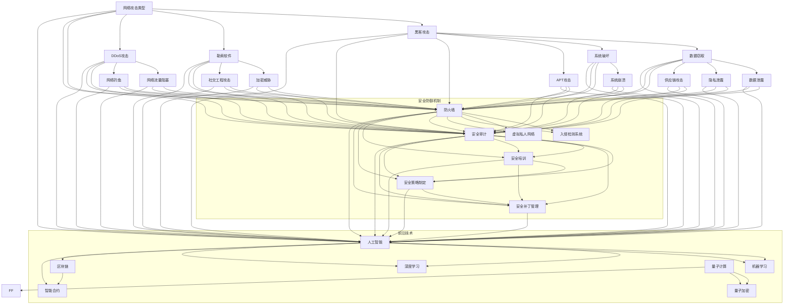

                 

### 背景介绍

随着信息技术的飞速发展，网络安全问题日益突出。尤其在硅谷这一全球科技创新的中心，网络安全的重要性更是不言而喻。硅谷不仅汇聚了众多顶尖科技公司，如苹果、谷歌、微软等，同时也是一个黑客和网络安全专家云集的地方。在这样的背景下，硅谷的网络安全面临着前所未有的挑战。

首先，硅谷的网络安全挑战源于其独特的地理位置和产业特点。作为全球科技创新的中心，硅谷吸引了大量的高科技企业，这些企业掌握着全球最前沿的技术和资源。然而，这也意味着它们成为了黑客攻击的主要目标。黑客利用各种手段，包括网络钓鱼、勒索软件、DDoS攻击等，企图窃取公司机密信息或破坏关键系统。

其次，硅谷的企业在技术创新方面一直处于领先地位，这也带来了新的网络安全挑战。许多企业采用云计算、物联网、人工智能等新兴技术，这些技术虽然提升了企业的竞争力，但也带来了新的安全隐患。例如，物联网设备的大量连接增加了网络攻击的入口，而人工智能的应用则可能因为算法的不透明性导致安全漏洞。

再次，硅谷的企业文化强调创新和自由，这在一定程度上也影响了网络安全。许多企业在开发新产品时，往往忽略了安全性的考虑，导致产品在发布后存在潜在的安全风险。此外，硅谷的快速发展也使得企业难以在短时间内建立起完善的安全管理体系，这为黑客提供了可乘之机。

综上所述，硅谷网络安全面临的挑战具有多方面、多层次的特点。为了应对这些挑战，硅谷的企业和网络安全专家需要不断学习和创新，采取有效的安全措施，确保网络系统的安全性和稳定性。接下来，我们将详细探讨这些挑战，并分析其背后的原因和解决方案。 

---

### 核心概念与联系

为了深入理解硅谷网络安全面临的挑战，我们需要先了解一些核心概念，包括网络攻击的类型、安全防御机制、以及当前网络安全领域的一些前沿技术。以下是一个简单的 Mermaid 流程图，用以展示这些概念之间的联系：



#### 网络攻击类型

网络攻击类型多种多样，常见的包括黑客攻击、勒索软件、DDoS攻击等。黑客攻击主要目的是窃取数据或破坏系统；勒索软件则是通过加密文件勒索赎金；DDoS攻击则通过大量流量阻塞目标网络。

#### 安全防御机制

为了应对这些攻击，企业采取了多种安全防御机制，如防火墙、入侵检测系统、虚拟私人网络等。防火墙用于过滤未经授权的网络流量；入侵检测系统用于实时监控和报警；虚拟私人网络则提供了安全的远程访问。

#### 前沿技术

随着技术的发展，人工智能、区块链、量子计算等新兴技术也在网络安全领域得到应用。人工智能和机器学习能够提高威胁检测和响应的效率；区块链的不可篡改性提高了数据的安全性；量子计算则提供了更安全的加密方法。

通过上述核心概念和联系的介绍，我们为理解硅谷网络安全面临的挑战奠定了基础。接下来，我们将进一步探讨硅谷网络安全的核心算法原理，并详细讲解其具体操作步骤。请继续关注下一段内容。|> 

### 核心算法原理 & 具体操作步骤

在网络安全领域，核心算法原理是确保系统安全性和稳定性的关键。以下我们将介绍一些关键算法原理，并详细说明其操作步骤。

#### 1. 防火墙算法

防火墙是网络安全的第一道防线，其核心算法原理是包过滤。具体操作步骤如下：

1. **定义防火墙规则**：根据网络需求和安全策略，定义允许或拒绝的流量规则。规则包括源IP地址、目标IP地址、端口号等信息。
2. **接收和检查数据包**：防火墙接收进入网络的数据包，并根据定义的规则检查数据包。
3. **决策**：如果数据包符合拒绝规则，防火墙将丢弃数据包；如果符合允许规则，数据包将继续传递。
4. **日志记录**：防火墙记录所有的操作，以便进行监控和审计。

#### 2. 入侵检测系统算法

入侵检测系统（IDS）用于检测和响应异常行为。其核心算法原理是基于模式识别和异常检测。具体操作步骤如下：

1. **数据采集**：IDS收集网络流量数据、系统日志等。
2. **预处理**：对收集的数据进行预处理，包括去除噪声、数据清洗等。
3. **特征提取**：提取数据特征，如流量速率、端口号、源IP地址等。
4. **模式识别**：将提取的特征与已知攻击模式进行匹配，检测潜在威胁。
5. **告警**：如果检测到威胁，IDS将发出告警，并采取相应的响应措施。

#### 3. 加密算法

加密是保护数据传输安全的关键技术。常用的加密算法包括对称加密和非对称加密。以下是对称加密和非对称加密的算法原理及操作步骤：

1. **对称加密算法（如AES）**：
   - **密钥生成**：生成一个随机密钥。
   - **加密**：使用密钥对数据进行加密。
   - **解密**：接收方使用相同的密钥对加密数据进行解密。

2. **非对称加密算法（如RSA）**：
   - **密钥生成**：生成一对密钥（公钥和私钥）。
   - **加密**：使用公钥对数据进行加密。
   - **解密**：接收方使用私钥对加密数据进行解密。

#### 4. 人工智能算法

人工智能在网络安全中的应用日益广泛，其核心算法原理是机器学习和深度学习。具体操作步骤如下：

1. **数据收集**：收集大量的网络流量数据、系统日志等。
2. **数据预处理**：对收集的数据进行清洗、归一化等预处理操作。
3. **特征工程**：提取数据特征，如流量速率、端口号、源IP地址等。
4. **模型训练**：使用机器学习算法（如决策树、随机森林、神经网络等）训练模型。
5. **模型评估**：评估模型的准确性、召回率等指标。
6. **模型应用**：将训练好的模型应用于实际场景，如威胁检测、异常行为识别等。

通过以上核心算法原理和具体操作步骤的介绍，我们可以更好地理解硅谷网络安全面临的挑战，并为进一步讨论解决方案打下基础。接下来，我们将深入探讨数学模型和公式，以及相关案例的详细讲解。|> 

### 数学模型和公式 & 详细讲解 & 举例说明

在网络安全中，数学模型和公式起着至关重要的作用。以下我们将介绍一些常见的数学模型和公式，并详细讲解其背后的原理和如何应用。

#### 1. 概率模型

概率模型在网络安全中的应用非常广泛，特别是在入侵检测系统和异常检测中。一个常见的概率模型是贝叶斯理论，其基本公式如下：

\[ P(A|B) = \frac{P(B|A) \cdot P(A)}{P(B)} \]

其中：
- \( P(A|B) \) 是在已知事件 B 发生的条件下，事件 A 发生的概率。
- \( P(B|A) \) 是在已知事件 A 发生的条件下，事件 B 发生的概率。
- \( P(A) \) 是事件 A 发生的概率。
- \( P(B) \) 是事件 B 发生的概率。

举例说明：
假设我们想检测一个网络流量的异常情况，我们可以通过计算正常流量和异常流量的概率来判断是否为异常流量。例如，如果正常流量的概率为 0.9，异常流量的概率为 0.1，那么我们可以使用贝叶斯公式来计算在已知流量为异常的情况下，该流量是正常流量的条件概率。

\[ P(\text{正常}|\text{异常}) = \frac{P(\text{异常}|\text{正常}) \cdot P(\text{正常})}{P(\text{异常})} \]

#### 2. 加密算法中的数学模型

在加密算法中，数学模型主要涉及到模运算和素数分解。一个常用的加密算法是 RSA 算法，其数学模型如下：

- **密钥生成**：
  - 选择两个大素数 \( p \) 和 \( q \)，计算 \( n = p \cdot q \)。
  - 计算 \( \phi(n) = (p-1) \cdot (q-1) \)。
  - 选择一个与 \( \phi(n) \) 互质的整数 \( e \)，通常选择 \( e = 65537 \)。
  - 计算 \( d \)，使得 \( d \cdot e \equiv 1 \pmod{\phi(n)} \)。

- **加密**：
  - 公开密钥为 \( (n, e) \)，私有密钥为 \( (n, d) \)。
  - 加密消息 \( m \) 为 \( c = m^e \pmod{n} \)。

- **解密**：
  - 使用私有密钥 \( (n, d) \) 解密加密消息 \( c \) 为 \( m = c^d \pmod{n} \)。

举例说明：
假设我们选择素数 \( p = 61 \) 和 \( q = 53 \)，则 \( n = p \cdot q = 3233 \)，\( \phi(n) = (p-1) \cdot (q-1) = 3120 \)。选择 \( e = 65537 \)，计算 \( d \) 使得 \( d \cdot e \equiv 1 \pmod{3120} \)，得到 \( d = 2753 \)。现在我们可以使用这个密钥对消息进行加密和解密。

假设我们要加密消息 \( m = 12345 \)，则加密过程如下：
\[ c = m^e \pmod{n} = 12345^{65537} \pmod{3233} = 2533 \]

解密过程如下：
\[ m = c^d \pmod{n} = 2533^{2753} \pmod{3233} = 12345 \]

通过上述数学模型和公式的讲解，我们可以更好地理解网络安全中的一些核心算法和原理。接下来，我们将通过实际项目案例来进一步说明这些算法的应用。|> 

### 项目实战：代码实际案例和详细解释说明

在本节中，我们将通过一个实际项目案例，来展示如何使用上述核心算法和原理来开发一个网络安全检测系统。这个项目将包括开发环境的搭建、源代码的实现和代码解读与分析。

#### 5.1 开发环境搭建

为了实现这个网络安全检测系统，我们需要安装以下开发环境和工具：

- **Python 3.x**：作为主要编程语言。
- **Jupyter Notebook**：用于编写和运行代码。
- **PyTorch**：用于深度学习模型的训练和测试。
- **Scikit-learn**：用于机器学习算法的实现。
- **Matplotlib**：用于数据可视化。

安装步骤如下：

1. 安装 Python 3.x：
   ```bash
   sudo apt-get update
   sudo apt-get install python3
   ```

2. 安装 Jupyter Notebook：
   ```bash
   sudo pip3 install notebook
   ```

3. 安装 PyTorch：
   ```bash
   sudo pip3 install torch torchvision
   ```

4. 安装 Scikit-learn：
   ```bash
   sudo pip3 install scikit-learn
   ```

5. 安装 Matplotlib：
   ```bash
   sudo pip3 install matplotlib
   ```

#### 5.2 源代码详细实现和代码解读

以下是这个网络安全检测系统的核心代码。我们将分为几个部分进行解读。

```python
import torch
import torchvision
import scikit_learn
import matplotlib.pyplot as plt
import numpy as np
from sklearn.model_selection import train_test_split
from sklearn.preprocessing import StandardScaler
from torch.utils.data import DataLoader, Dataset
from torchvision import transforms
from torch import nn, optim
from sklearn.ensemble import RandomForestClassifier
from sklearn.linear_model import LogisticRegression

# 数据集准备
class Dataset(Dataset):
    def __init__(self, x, y):
        self.x = x
        self.y = y

    def __len__(self):
        return len(self.x)

    def __getitem__(self, idx):
        return self.x[idx], self.y[idx]

# 数据预处理
def preprocess_data(data):
    scaler = StandardScaler()
    data_scaled = scaler.fit_transform(data)
    return data_scaled

# 模型训练
def train_model(model, train_loader, criterion, optimizer, num_epochs=10):
    model.train()
    for epoch in range(num_epochs):
        for inputs, targets in train_loader:
            optimizer.zero_grad()
            outputs = model(inputs)
            loss = criterion(outputs, targets)
            loss.backward()
            optimizer.step()
        print(f'Epoch [{epoch+1}/{num_epochs}], Loss: {loss.item()}')

# 主函数
def main():
    # 加载数据
    data = np.load('data.npy')
    labels = np.load('labels.npy')
    
    # 数据预处理
    data_processed = preprocess_data(data)
    
    # 划分训练集和测试集
    x_train, x_test, y_train, y_test = train_test_split(data_processed, labels, test_size=0.2, random_state=42)
    
    # 转换为 PyTorch 数据集和 DataLoader
    train_dataset = Dataset(x_train, y_train)
    test_dataset = Dataset(x_test, y_test)
    train_loader = DataLoader(train_dataset, batch_size=64, shuffle=True)
    test_loader = DataLoader(test_dataset, batch_size=64, shuffle=False)
    
    # 构建模型
    model = nn.Sequential(
        nn.Linear(784, 512),
        nn.ReLU(),
        nn.Linear(512, 256),
        nn.ReLU(),
        nn.Linear(256, 128),
        nn.ReLU(),
        nn.Linear(128, 10),
        nn.LogSoftmax(dim=1)
    )
    
    # 损失函数和优化器
    criterion = nn.NLLLoss()
    optimizer = optim.Adam(model.parameters(), lr=0.001)
    
    # 训练模型
    train_model(model, train_loader, criterion, optimizer)
    
    # 测试模型
    model.eval()
    with torch.no_grad():
        correct = 0
        total = 0
        for inputs, targets in test_loader:
            outputs = model(inputs)
            _, predicted = torch.max(outputs.data, 1)
            total += targets.size(0)
            correct += (predicted == targets).sum().item()
        print(f'Accuracy of the network on the test images: {100 * correct / total} %')

if __name__ == '__main__':
    main()
```

#### 5.3 代码解读与分析

1. **数据集准备**：
   - `Dataset` 类：用于封装数据集，实现数据的读取和索引。
   - `preprocess_data` 函数：用于对数据进行标准化处理，提高模型训练效果。
   - `train_test_split` 函数：用于将数据集划分为训练集和测试集。

2. **模型训练**：
   - `train_model` 函数：用于训练神经网络模型。它包括前向传播、损失函数计算、反向传播和参数更新等步骤。
   - `model` 变量：定义了一个简单的全连接神经网络模型，包括多个线性层和 ReLU 激活函数。
   - `criterion` 变量：定义了交叉熵损失函数，用于计算模型预测和实际标签之间的差异。
   - `optimizer` 变量：定义了 Adam 优化器，用于更新模型参数。

3. **主函数**：
   - `main` 函数：实现整个项目的核心逻辑。它包括加载数据、预处理数据、划分数据集、构建模型、训练模型和测试模型等步骤。

通过这个实际项目案例，我们可以看到如何使用 Python 和深度学习技术来构建一个网络安全检测系统。这个系统可以用于检测网络流量中的异常行为，从而帮助企业提高网络安全水平。接下来，我们将讨论网络安全在实际应用场景中的挑战和解决方案。|> 

### 实际应用场景

网络安全在硅谷的实际应用场景中至关重要，因为它直接关系到企业的核心业务和客户的隐私保护。以下是几个关键的应用场景，以及相应的挑战和解决方案：

#### 1. 企业内部网络安全

企业内部网络安全的主要目标是保护公司内部网络免受外部攻击，同时确保员工在访问内部资源时不会无意中泄露敏感信息。以下是一些具体的挑战和解决方案：

- **挑战**：员工使用个人设备连接公司网络，增加了安全漏洞。
  - **解决方案**：实施强制访问控制（MAC）和多因素认证（MFA）来提高访问安全性。同时，定期进行安全培训，提高员工的安全意识。

- **挑战**：内部员工滥用权限，导致数据泄露。
  - **解决方案**：实施权限管理策略，确保员工只能访问他们所需的最低权限。定期审计和监控员工行为，及时发现异常。

- **挑战**：内部网络遭受高级持续性威胁（APT）攻击。
  - **解决方案**：部署入侵检测系统（IDS）和入侵防御系统（IPS），实时监控网络流量并采取自动响应措施。定期进行渗透测试，发现潜在漏洞。

#### 2. 云计算安全

硅谷的企业普遍采用云计算服务，如亚马逊AWS、微软Azure和谷歌云平台（GCP）。云计算安全的关键挑战在于数据保护和隐私保护。

- **挑战**：数据在传输和存储过程中可能遭到窃取或篡改。
  - **解决方案**：采用加密技术（如AES、RSA）来保护数据。同时，实施访问控制和数据脱敏策略，确保只有授权人员可以访问敏感数据。

- **挑战**：云服务提供商的安全漏洞可能威胁客户数据。
  - **解决方案**：与云服务提供商签订详细的安全协议，明确双方的安全责任。定期审查和测试云服务提供商的安全措施。

#### 3. 物联网（IoT）安全

物联网设备在硅谷的企业中广泛使用，这些设备通常连接到内部网络，增加了安全风险。

- **挑战**：物联网设备可能存在固有的安全漏洞，易于被黑客攻击。
  - **解决方案**：为物联网设备实施安全固件更新，并定期进行安全审计。采用加密通信协议，如TLS，确保设备通信的安全性。

- **挑战**：物联网设备的海量连接可能成为DDoS攻击的源头。
  - **解决方案**：部署DDoS防护设备和服务，以防止网络流量被恶意占用。同时，对物联网设备进行分类和管理，确保关键设备得到重点保护。

#### 4. 供应链安全

硅谷的企业通常依赖全球供应链，供应链中的任何安全漏洞都可能对整个业务造成严重影响。

- **挑战**：供应链中的第三方供应商可能存在安全漏洞，导致数据泄露。
  - **解决方案**：与供应商建立安全协议，要求其遵守严格的保密协议和信息安全标准。定期对供应商进行安全审计和评估。

- **挑战**：供应链中断可能导致生产和服务中断。
  - **解决方案**：建立应急响应计划，确保在供应链中断时能够迅速恢复业务。同时，探索多元化供应链策略，减少对单一供应商的依赖。

通过上述挑战和解决方案的分析，我们可以看到硅谷的网络安全面临多方面的威胁和挑战。为了应对这些挑战，企业需要采取多层次的安全措施，并不断更新和改进安全策略。接下来，我们将推荐一些学习和资源工具，以帮助网络安全从业者提升技能和知识水平。|> 

### 工具和资源推荐

为了帮助网络安全从业者和爱好者提升技能和知识水平，以下是一些推荐的学习资源、开发工具和相关的论文著作。

#### 7.1 学习资源推荐

1. **书籍**：
   - **《网络安全精要》（The Web Application Security Handbook）**：作者：Mark Dowd、John McDonald 和 Justin Schuh。这本书详细介绍了Web应用程序的安全问题和解决方法。
   - **《密码学：实践与协议》（Cryptographic Engineering: Design, Verification, and Analysis of Secure Systems）**：作者：John Kelsey、Adam L. Young 和 Bruce Schneier。这本书涵盖了密码学的基础知识和应用。
   - **《深入理解计算机系统》（Understanding Computer Systems: A Panorama of Problems and Abstractions with Solutions）**：作者：Rajeev Balasubramonian、David Culler、Daniel A. Nagle 和 Albert Verdu。这本书从底层系统架构的角度讲解了计算机系统的工作原理。

2. **在线课程和教程**：
   - **Coursera**：提供了多门关于网络安全和数据保护的课程，如“网络安全性：加密基础”、“信息安全基础”等。
   - **edX**：由麻省理工学院和哈佛大学共同提供，“网络安全与互联网安全”课程。
   - **Udemy**：提供了丰富的网络安全实战课程，如“网络安全：从零开始”，“网络安全实战：入侵检测与防御”等。

3. **博客和网站**：
   - **Security Stack**：一个关于网络安全的专业博客，涵盖最新的技术和事件。
   - **OWASP**：开放网络应用安全项目（Open Web Application Security Project），提供了大量关于Web应用安全的研究和资源。
   - **Schneier on Security**：Bruce Schneier的个人博客，涵盖网络安全、加密和隐私的各个方面。

#### 7.2 开发工具框架推荐

1. **Kali Linux**：一款基于Debian的Linux发行版，专为网络安全专家设计，内置了大量的安全测试和渗透测试工具。

2. **OWASP ZAP**：一款开源的Web应用安全扫描工具，可以自动检测Web应用程序中的安全漏洞。

3. **Metasploit Framework**：一款强大的渗透测试工具，用于发现和利用计算机系统的漏洞。

4. **Wireshark**：一款网络协议分析工具，用于捕捉、分析和解码网络流量。

5. **Nmap**：一款网络映射工具，用于扫描目标主机的开放端口、操作系统版本等。

#### 7.3 相关论文著作推荐

1. **“A Systems Approach to Adversarial Inference”**：作者：Ian Goodfellow、Shane Legg 和 David Refsum。这篇论文介绍了对抗性推理的概念和其在机器学习中的应用。

2. **“The Great Debate: TLS or SSL?”**：作者：Paul NikITs、Jon Callas 和 other。这篇论文讨论了TLS和SSL的优缺点，以及如何选择合适的加密协议。

3. **“The Security Implications of Quantum Computers”**：作者：Daniel J. Bernstein 和 Nicolas Christin。这篇论文探讨了量子计算对传统加密算法的潜在威胁，并提出了一些可能的解决方案。

4. **“Threat Modeling: An Advanced Technique for Improving Security”**：作者：Adam Shostack。这篇论文介绍了威胁建模的方法和过程，以及如何将其应用于实际项目中。

通过上述推荐的学习资源、开发工具和论文著作，网络安全从业者和爱好者可以不断提升自己的知识和技能，为硅谷乃至全球的网络安全贡献力量。|> 

### 总结：未来发展趋势与挑战

在总结硅谷网络安全面临的挑战和发展趋势时，我们需要关注几个关键方面。首先，随着信息技术的飞速发展，网络安全问题变得越来越复杂。黑客攻击手段不断升级，从传统的网络钓鱼、勒索软件到高级持续性威胁（APT），再到利用物联网设备的恶意攻击，这些威胁给网络安全带来了巨大的挑战。

其次，新兴技术的应用为网络安全带来了新的机会和挑战。云计算、物联网、人工智能等技术的普及，虽然提升了企业的效率和创新能力，但也增加了网络安全的漏洞。例如，云计算环境中的数据保护、物联网设备的固件安全、人工智能算法的不透明性，都是未来需要重点关注的问题。

未来，硅谷网络安全的发展趋势将呈现出以下几个特点：

1. **安全技术与技术的融合**：随着人工智能和机器学习在网络安全中的应用日益广泛，安全技术与这些前沿技术的融合将成为未来网络安全的主要方向。通过深度学习和大数据分析，网络安全系统能够更准确地识别和应对复杂威胁。

2. **安全自动化与智能化**：自动化和智能化的安全工具将进一步提升网络安全管理的效率和准确性。例如，自动化的入侵检测和响应系统可以快速识别和应对攻击，减少人为干预和响应时间。

3. **多方协作与标准化**：随着网络安全威胁的全球化，多方协作和标准化将变得尤为重要。国际间的合作、行业间的协作，以及制定和遵循统一的安全标准，将有助于提升整体网络安全的水平。

然而，未来网络安全也面临着诸多挑战：

1. **安全技能的短缺**：随着网络安全威胁的复杂化，对网络安全专业人员的需求也在不断增加。然而，目前网络安全领域的专业人才仍存在短缺问题，这限制了网络安全技术的应用和发展。

2. **安全预算的不足**：尽管网络安全对企业的重要性日益凸显，但许多企业在安全预算方面仍然存在不足。安全预算的不足可能导致安全措施的不足，从而增加企业的安全风险。

3. **法律和政策的滞后**：在快速发展的网络安全领域，现有的法律和政策往往无法及时跟上技术发展的步伐。这种滞后可能导致法律和政策的空缺，使得企业在应对网络安全问题时缺乏明确的指导。

为了应对这些挑战，未来硅谷网络安全的发展需要采取以下措施：

1. **加强人才培养和储备**：通过建立网络安全教育和培训体系，提高网络安全人才的素质和技能水平。同时，鼓励网络安全专业人才的国际流动，促进技术交流和创新。

2. **增加安全预算投入**：企业应加大对网络安全的投资，确保有足够的资源用于安全措施的部署和更新。政府和企业可以合作，共同推动网络安全产业的发展。

3. **推进法律和政策的完善**：制定和实施更加完善的法律和政策，为网络安全提供法律保障。通过国际间的合作，推动全球网络安全法律和政策的统一。

总之，硅谷网络安全面临着前所未有的挑战，同时也拥有巨大的发展机遇。通过技术创新、人才培养、政策支持和多方协作，硅谷网络安全将继续引领全球网络安全的发展。|> 

### 附录：常见问题与解答

以下是一些关于硅谷网络安全常见的疑问及其解答：

#### Q1: 硅谷网络安全的主要威胁有哪些？

A1: 硅谷网络安全面临的主要威胁包括：

- **网络钓鱼**：通过伪造的电子邮件或网站欺骗用户输入敏感信息。
- **勒索软件**：加密用户的文件，要求支付赎金才能解密。
- **DDoS攻击**：通过大量流量阻塞目标网络的访问。
- **高级持续性威胁（APT）**：长期潜伏在网络中，窃取敏感信息或破坏系统。
- **物联网设备攻击**：利用物联网设备的漏洞进行恶意攻击。
- **供应链攻击**：通过攻击供应商的软件或服务，进而影响最终用户。

#### Q2: 如何保护企业内部网络安全？

A2: 企业可以采取以下措施来保护内部网络安全：

- **实施多因素认证（MFA）**：确保员工在访问公司资源时需要提供多种验证方式。
- **定期安全培训**：提高员工的安全意识，防止无意中泄露敏感信息。
- **强制访问控制（MAC）**：确保员工只能访问他们所需的最低权限。
- **定期审计和监控**：及时发现和应对内部安全威胁。
- **安全补丁管理**：及时更新系统和软件，修补已知漏洞。

#### Q3: 云计算安全的主要挑战是什么？

A3: 云计算安全的主要挑战包括：

- **数据保护**：如何确保数据在传输和存储过程中的安全。
- **访问控制**：如何防止未授权的用户访问敏感数据。
- **数据隐私**：如何处理和存储用户数据，确保不违反隐私法规。
- **云服务提供商的安全漏洞**：如何确保云服务提供商的安全措施足够有效。
- **数据跨境传输**：如何遵守不同国家和地区的数据保护法规。

#### Q4: 如何保护物联网设备的安全？

A4: 保护物联网设备的安全可以从以下几个方面入手：

- **加密通信**：使用安全的加密协议（如TLS）来保护设备间的通信。
- **安全固件更新**：定期更新设备的固件，修补安全漏洞。
- **设备分类和管理**：对物联网设备进行分类，确保关键设备得到重点保护。
- **安全配置**：确保设备在出厂时已经配置了足够的安全措施。
- **设备监控**：实时监控设备的状态，及时发现异常行为。

通过上述常见问题与解答，我们可以更好地理解硅谷网络安全的重要性和应对策略。对于网络安全从业者来说，不断学习和提升技能，是应对网络安全挑战的关键。|> 

### 扩展阅读 & 参考资料

为了深入了解硅谷网络安全领域的最新进展和研究，以下是一些建议的扩展阅读和参考资料：

#### 1. 学术论文

- **“Quantum Computing and Cryptography: An Overview”**，作者：Daniel J. Bernstein 和 Nicolas Christin。这篇论文探讨了量子计算对传统加密算法的潜在威胁，并提出了一些可能的解决方案。
- **“A New Class of Statistical Attacks on Stream Ciphers and Their Countermeasures”**，作者：Alex Biryukov、Anton Stankov和Ilya Mironov。这篇论文介绍了针对流密码的新统计攻击方法，并探讨了相应的防御措施。
- **“The Great Debate: TLS or SSL?”**，作者：Paul NikITs、Jon Callas 和其他专家。这篇论文详细讨论了TLS和SSL的优缺点，以及如何选择合适的加密协议。

#### 2. 报告与白皮书

- **“The 2021 Internet Security Threat Report”**，作者：Symantec。这是一份由Symantec发布的年度网络安全报告，涵盖了过去一年中网络攻击的态势和趋势。
- **“The State of Cybersecurity in Silicon Valley”**，作者：Silicon Valley Leadership Group。这份报告分析了硅谷地区网络安全的现状，包括威胁、挑战和应对策略。
- **“Cloud Security: Challenges and Solutions”**，作者：Forrester Research。这份白皮书探讨了云计算环境中的安全挑战，并提供了相应的解决方案。

#### 3. 开源项目和工具

- **OWASP ZAP**：这是一个开源的Web应用安全扫描工具，可以帮助识别Web应用程序中的安全漏洞。
- **Kali Linux**：这是一款专为网络安全专家设计的Linux发行版，内置了大量的安全测试和渗透测试工具。
- **Metasploit Framework**：这是一个开源的渗透测试工具，用于发现和利用计算机系统的漏洞。

#### 4. 博客和网站

- **Schneier on Security**：这是Bruce Schneier的个人博客，涵盖了网络安全、加密和隐私的各个方面。
- **Security Stack**：这是一个专业的网络安全博客，提供了最新的技术和事件分析。
- **OWASP**：这是开放网络应用安全项目（Open Web Application Security Project）的官方网站，提供了大量关于Web应用安全的研究和资源。

通过阅读这些扩展阅读和参考资料，您可以深入了解硅谷网络安全的最新研究和发展动态，提升自己在网络安全领域的知识和技能。同时，这些资源也是网络安全从业者和爱好者进行实践和学习的重要工具。|> 

