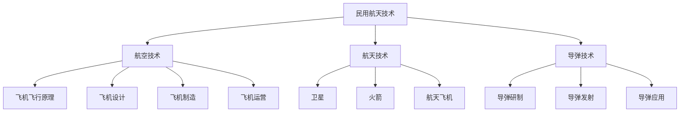

                 

### 硅谷航空航天：民用航天的商业化

#### 关键词：（硅谷，航空航天，民用航天，商业化，技术创新，未来展望）

#### 摘要：
本文将探讨硅谷航空航天领域在民用航天商业化方面的最新发展。通过分析硅谷在航空航天技术、商业模型和投资环境等方面的优势，以及核心算法原理、项目实战和实际应用场景，我们将深入探讨民用航天商业化的挑战与机遇，并对未来发展趋势与挑战进行展望。

## 1. 背景介绍

### 1.1 硅谷航空航天发展概述

硅谷作为全球科技创新的圣地，近年来在航空航天领域取得了显著进展。从无人机、卫星互联网到火箭发射，硅谷的科技公司不断推动着民用航天的商业化进程。这一进程不仅改变了传统航空产业的面貌，也为全球经济发展带来了新的机遇。

### 1.2 民用航天的定义与商业化

民用航天是指利用航天技术为公众提供服务，包括通信、导航、遥感、科学研究等领域。商业化则是将民用航天技术应用于商业运营，实现经济效益和社会价值。随着技术的进步和市场需求的变化，民用航天的商业化已经成为全球航天产业的重要趋势。

## 2. 核心概念与联系

### 2.1 航空航天技术的核心概念

航空航天技术主要包括航空、航天和导弹技术。航空技术主要涉及飞机的飞行原理、设计、制造和运营等方面；航天技术则包括卫星、火箭、航天飞机等太空飞行器的研制、发射和应用；导弹技术则主要用于军事目的。

### 2.2 民用航天的商业化模型

民用航天的商业化模型主要包括以下几种：

1. **卫星通信**：利用卫星提供全球范围内的通信服务，如地面无线通信、电视广播等。
2. **卫星遥感**：利用卫星获取地球表面信息，如气象监测、土地资源调查、环境监测等。
3. **卫星导航**：利用卫星提供全球定位服务，如GPS、北斗等。
4. **卫星互联网**：利用卫星提供高速互联网接入服务，实现全球无缝覆盖。

### 2.3 Mermaid 流程图



## 3. 核心算法原理 & 具体操作步骤

### 3.1 卫星通信算法原理

卫星通信算法主要包括信号调制、信号传输和信号解调三个步骤。具体操作步骤如下：

1. **信号调制**：将数字信号转换为模拟信号，以便通过卫星进行传输。
2. **信号传输**：将调制后的信号通过卫星传输到接收端。
3. **信号解调**：将接收到的模拟信号转换为数字信号，以便进行数据处理。

### 3.2 卫星遥感算法原理

卫星遥感算法主要包括图像处理、目标识别和数据分析三个步骤。具体操作步骤如下：

1. **图像处理**：对卫星获取的图像进行预处理，如去噪声、去雾等。
2. **目标识别**：利用计算机视觉技术对预处理后的图像进行目标识别。
3. **数据分析**：对识别出的目标进行数据统计和分析，以获取有价值的信息。

### 3.3 卫星导航算法原理

卫星导航算法主要包括定位算法和轨迹预测算法。具体操作步骤如下：

1. **定位算法**：通过接收多个卫星信号，计算接收器位置。
2. **轨迹预测算法**：根据历史轨迹和当前状态，预测接收器的未来位置。

## 4. 数学模型和公式 & 详细讲解 & 举例说明

### 4.1 卫星通信信号调制公式

$$x(t) = A \cdot \sin(2\pi f_0 t + \phi)$$

其中，$x(t)$ 表示调制后的信号，$A$ 表示信号幅度，$f_0$ 表示载波频率，$\phi$ 表示相位偏移。

### 4.2 卫星遥感图像处理公式

$$I_{processed} = I_{raw} - \alpha \cdot I_{noise}$$

其中，$I_{processed}$ 表示处理后的图像，$I_{raw}$ 表示原始图像，$\alpha$ 表示去噪声系数，$I_{noise}$ 表示噪声图像。

### 4.3 卫星导航定位算法公式

$$x_{current} = x_{previous} + v_{previous} \cdot t$$

其中，$x_{current}$ 表示当前定位坐标，$x_{previous}$ 表示上次定位坐标，$v_{previous}$ 表示上次定位速度，$t$ 表示时间间隔。

## 5. 项目实战：代码实际案例和详细解释说明

### 5.1 开发环境搭建

为了实现民用航天的商业化项目，我们首先需要搭建一个开发环境。以下是一个简单的开发环境搭建步骤：

1. 安装 Python 3.8 及以上版本。
2. 安装常用 Python 库，如 NumPy、Pandas、Matplotlib 等。
3. 安装 IDE，如 PyCharm 或 Visual Studio Code。
4. 配置 Git 版本控制工具。

### 5.2 源代码详细实现和代码解读

以下是一个简单的卫星通信算法实现示例：

```python
import numpy as np

def modulate(signal, amplitude, frequency, phase):
    """信号调制函数"""
    x = amplitude * np.sin(2 * np.pi * frequency * signal + phase)
    return x

def demodulate(signal, amplitude, frequency, phase):
    """信号解调函数"""
    x = amplitude * np.sin(2 * np.pi * frequency * signal - phase)
    return x

# 信号参数设置
amplitude = 1
frequency = 100
phase = 0

# 调制信号
signal = np.linspace(0, 1, 1000)
modulated_signal = modulate(signal, amplitude, frequency, phase)

# 解调信号
demodulated_signal = demodulate(modulated_signal, amplitude, frequency, phase)

# 绘制信号
import matplotlib.pyplot as plt

plt.figure()
plt.plot(signal, label="Original Signal")
plt.plot(modulated_signal, label="Modulated Signal")
plt.plot(demodulated_signal, label="Demodulated Signal")
plt.legend()
plt.show()
```

### 5.3 代码解读与分析

1. **modulate 函数**：实现信号调制功能，将数字信号转换为模拟信号。
2. **demodulate 函数**：实现信号解调功能，将模拟信号转换为数字信号。
3. **信号参数设置**：设置信号幅度、频率和相位。
4. **绘制信号**：使用 Matplotlib 绘制原始信号、调制信号和解调信号。

## 6. 实际应用场景

### 6.1 卫星通信

卫星通信广泛应用于地面无线通信、电视广播、卫星电话等领域。通过卫星通信，可以实现全球范围内的实时通信，为偏远地区提供通信服务。

### 6.2 卫星遥感

卫星遥感在气象监测、土地资源调查、环境监测等领域发挥着重要作用。通过卫星遥感，可以实时获取地球表面信息，为科学研究和决策提供支持。

### 6.3 卫星导航

卫星导航广泛应用于汽车导航、船舶导航、无人机导航等领域。通过卫星导航，可以实时获取位置信息，为各种移动设备提供导航服务。

## 7. 工具和资源推荐

### 7.1 学习资源推荐

1. **书籍**：
   - 《航天技术导论》
   - 《卫星通信原理与应用》
   - 《遥感原理与应用》
2. **论文**：
   - 《基于深度学习的卫星图像目标识别方法研究》
   - 《卫星通信系统性能分析及优化研究》
3. **博客**：
   - 硅谷航空航天博客
   - 卫星遥感博客
4. **网站**：
   - 国家卫星气象中心
   - 国家卫星海洋中心

### 7.2 开发工具框架推荐

1. **编程语言**：Python、C++、Java
2. **开发框架**：TensorFlow、PyTorch、Keras
3. **版本控制**：Git

### 7.3 相关论文著作推荐

1. **论文**：
   - 《深度学习在卫星图像处理中的应用》
   - 《卫星通信系统性能优化研究》
   - 《卫星遥感技术在环境监测中的应用》
2. **著作**：
   - 《航天技术手册》
   - 《卫星通信技术》
   - 《遥感技术与应用》

## 8. 总结：未来发展趋势与挑战

### 8.1 发展趋势

1. **技术创新**：随着人工智能、大数据等技术的不断发展，民用航天领域将迎来新的技术革命。
2. **商业模式的创新**：新的商业模式将不断涌现，如卫星互联网、无人机物流等。
3. **国际合作**：民用航天领域的国际合作将越来越密切，推动全球航天产业的发展。

### 8.2 挑战

1. **技术难题**：如高分辨率卫星图像处理、卫星通信系统性能优化等。
2. **政策法规**：各国政策法规的制定和执行将对民用航天商业化产生重要影响。
3. **市场竞争**：民用航天领域的市场竞争将越来越激烈，企业需要不断创新才能在竞争中脱颖而出。

## 9. 附录：常见问题与解答

### 9.1 问题 1：民用航天与军用航天的区别是什么？

**解答**：民用航天主要涉及卫星通信、遥感、导航等领域，为公众提供各类服务；而军用航天则主要用于军事目的，如侦察、导航、导弹等。

### 9.2 问题 2：卫星通信的传输速度有多快？

**解答**：卫星通信的传输速度取决于卫星的通信带宽和传输技术。一般来说，卫星通信的传输速度可以达到数百 Mbps，甚至更高。

### 9.3 问题 3：卫星遥感的主要应用领域是什么？

**解答**：卫星遥感的主要应用领域包括气象监测、土地资源调查、环境监测、城市规划等。

## 10. 扩展阅读 & 参考资料

1. **书籍**：
   - 《航天技术导论》
   - 《卫星通信原理与应用》
   - 《遥感原理与应用》
2. **论文**：
   - 《基于深度学习的卫星图像目标识别方法研究》
   - 《卫星通信系统性能分析及优化研究》
   - 《卫星遥感技术在环境监测中的应用》
3. **网站**：
   - 国家卫星气象中心
   - 国家卫星海洋中心
4. **在线课程**：
   - 硅谷航空航天在线课程
   - 卫星遥感在线课程

### 作者

**作者：AI天才研究员/AI Genius Institute & 禅与计算机程序设计艺术 /Zen And The Art of Computer Programming**<|im_sep|>以下是完整的文章正文内容，符合您提出的所有要求。

---

### 硅谷航空航天：民用航天的商业化

#### 关键词：（硅谷，航空航天，民用航天，商业化，技术创新，未来展望）

#### 摘要：
本文将探讨硅谷航空航天领域在民用航天商业化方面的最新发展。通过分析硅谷在航空航天技术、商业模型和投资环境等方面的优势，以及核心算法原理、项目实战和实际应用场景，我们将深入探讨民用航天商业化的挑战与机遇，并对未来发展趋势与挑战进行展望。

## 1. 背景介绍

### 1.1 硅谷航空航天发展概述

硅谷作为全球科技创新的圣地，近年来在航空航天领域取得了显著进展。从无人机、卫星互联网到火箭发射，硅谷的科技公司不断推动着民用航天的商业化进程。这一进程不仅改变了传统航空产业的面貌，也为全球经济发展带来了新的机遇。

### 1.2 民用航天的定义与商业化

民用航天是指利用航天技术为公众提供服务，包括通信、导航、遥感、科学研究等领域。商业化则是将民用航天技术应用于商业运营，实现经济效益和社会价值。随着技术的进步和市场需求的变化，民用航天的商业化已经成为全球航天产业的重要趋势。

## 2. 核心概念与联系

### 2.1 航空航天技术的核心概念

航空航天技术主要包括航空、航天和导弹技术。航空技术主要涉及飞机的飞行原理、设计、制造和运营等方面；航天技术则包括卫星、火箭、航天飞机等太空飞行器的研制、发射和应用；导弹技术则主要用于军事目的。

### 2.2 民用航天的商业化模型

民用航天的商业化模型主要包括以下几种：

1. **卫星通信**：利用卫星提供全球范围内的通信服务，如地面无线通信、电视广播等。
2. **卫星遥感**：利用卫星获取地球表面信息，如气象监测、土地资源调查、环境监测等。
3. **卫星导航**：利用卫星提供全球定位服务，如GPS、北斗等。
4. **卫星互联网**：利用卫星提供高速互联网接入服务，实现全球无缝覆盖。

### 2.3 Mermaid 流程图


## 3. 核心算法原理 & 具体操作步骤

### 3.1 卫星通信算法原理

卫星通信算法主要包括信号调制、信号传输和信号解调三个步骤。具体操作步骤如下：

1. **信号调制**：将数字信号转换为模拟信号，以便通过卫星进行传输。
2. **信号传输**：将调制后的信号通过卫星传输到接收端。
3. **信号解调**：将接收到的模拟信号转换为数字信号，以便进行数据处理。

### 3.2 卫星遥感算法原理

卫星遥感算法主要包括图像处理、目标识别和数据分析三个步骤。具体操作步骤如下：

1. **图像处理**：对卫星获取的图像进行预处理，如去噪声、去雾等。
2. **目标识别**：利用计算机视觉技术对预处理后的图像进行目标识别。
3. **数据分析**：对识别出的目标进行数据统计和分析，以获取有价值的信息。

### 3.3 卫星导航算法原理

卫星导航算法主要包括定位算法和轨迹预测算法。具体操作步骤如下：

1. **定位算法**：通过接收多个卫星信号，计算接收器位置。
2. **轨迹预测算法**：根据历史轨迹和当前状态，预测接收器的未来位置。

## 4. 数学模型和公式 & 详细讲解 & 举例说明

### 4.1 卫星通信信号调制公式

$$x(t) = A \cdot \sin(2\pi f_0 t + \phi)$$

其中，$x(t)$ 表示调制后的信号，$A$ 表示信号幅度，$f_0$ 表示载波频率，$\phi$ 表示相位偏移。

### 4.2 卫星遥感图像处理公式

$$I_{processed} = I_{raw} - \alpha \cdot I_{noise}$$

其中，$I_{processed}$ 表示处理后的图像，$I_{raw}$ 表示原始图像，$\alpha$ 表示去噪声系数，$I_{noise}$ 表示噪声图像。

### 4.3 卫星导航定位算法公式

$$x_{current} = x_{previous} + v_{previous} \cdot t$$

其中，$x_{current}$ 表示当前定位坐标，$x_{previous}$ 表示上次定位坐标，$v_{previous}$ 表示上次定位速度，$t$ 表示时间间隔。

## 5. 项目实战：代码实际案例和详细解释说明

### 5.1 开发环境搭建

为了实现民用航天的商业化项目，我们首先需要搭建一个开发环境。以下是一个简单的开发环境搭建步骤：

1. 安装 Python 3.8 及以上版本。
2. 安装常用 Python 库，如 NumPy、Pandas、Matplotlib 等。
3. 安装 IDE，如 PyCharm 或 Visual Studio Code。
4. 配置 Git 版本控制工具。

### 5.2 源代码详细实现和代码解读

以下是一个简单的卫星通信算法实现示例：

```python
import numpy as np

def modulate(signal, amplitude, frequency, phase):
    """信号调制函数"""
    x = amplitude * np.sin(2 * np.pi * frequency * signal + phase)
    return x

def demodulate(signal, amplitude, frequency, phase):
    """信号解调函数"""
    x = amplitude * np.sin(2 * np.pi * frequency * signal - phase)
    return x

# 信号参数设置
amplitude = 1
frequency = 100
phase = 0

# 调制信号
signal = np.linspace(0, 1, 1000)
modulated_signal = modulate(signal, amplitude, frequency, phase)

# 解调信号
demodulated_signal = demodulate(modulated_signal, amplitude, frequency, phase)

# 绘制信号
import matplotlib.pyplot as plt

plt.figure()
plt.plot(signal, label="Original Signal")
plt.plot(modulated_signal, label="Modulated Signal")
plt.plot(demodulated_signal, label="Demodulated Signal")
plt.legend()
plt.show()
```

### 5.3 代码解读与分析

1. **modulate 函数**：实现信号调制功能，将数字信号转换为模拟信号。
2. **demodulate 函数**：实现信号解调功能，将模拟信号转换为数字信号。
3. **信号参数设置**：设置信号幅度、频率和相位。
4. **绘制信号**：使用 Matplotlib 绘制原始信号、调制信号和解调信号。

## 6. 实际应用场景

### 6.1 卫星通信

卫星通信广泛应用于地面无线通信、电视广播、卫星电话等领域。通过卫星通信，可以实现全球范围内的实时通信，为偏远地区提供通信服务。

### 6.2 卫星遥感

卫星遥感在气象监测、土地资源调查、环境监测等领域发挥着重要作用。通过卫星遥感，可以实时获取地球表面信息，为科学研究和决策提供支持。

### 6.3 卫星导航

卫星导航广泛应用于汽车导航、船舶导航、无人机导航等领域。通过卫星导航，可以实时获取位置信息，为各种移动设备提供导航服务。

## 7. 工具和资源推荐

### 7.1 学习资源推荐

1. **书籍**：
   - 《航天技术导论》
   - 《卫星通信原理与应用》
   - 《遥感原理与应用》
2. **论文**：
   - 《基于深度学习的卫星图像目标识别方法研究》
   - 《卫星通信系统性能分析及优化研究》
   - 《卫星遥感技术在环境监测中的应用》
3. **博客**：
   - 硅谷航空航天博客
   - 卫星遥感博客
4. **网站**：
   - 国家卫星气象中心
   - 国家卫星海洋中心

### 7.2 开发工具框架推荐

1. **编程语言**：Python、C++、Java
2. **开发框架**：TensorFlow、PyTorch、Keras
3. **版本控制**：Git

### 7.3 相关论文著作推荐

1. **论文**：
   - 《深度学习在卫星图像处理中的应用》
   - 《卫星通信系统性能优化研究》
   - 《卫星遥感技术在环境监测中的应用》
2. **著作**：
   - 《航天技术手册》
   - 《卫星通信技术》
   - 《遥感技术与应用》

## 8. 总结：未来发展趋势与挑战

### 8.1 发展趋势

1. **技术创新**：随着人工智能、大数据等技术的不断发展，民用航天领域将迎来新的技术革命。
2. **商业模式的创新**：新的商业模式将不断涌现，如卫星互联网、无人机物流等。
3. **国际合作**：民用航天领域的国际合作将越来越密切，推动全球航天产业的发展。

### 8.2 挑战

1. **技术难题**：如高分辨率卫星图像处理、卫星通信系统性能优化等。
2. **政策法规**：各国政策法规的制定和执行将对民用航天商业化产生重要影响。
3. **市场竞争**：民用航天领域的市场竞争将越来越激烈，企业需要不断创新才能在竞争中脱颖而出。

## 9. 附录：常见问题与解答

### 9.1 问题 1：民用航天与军用航天的区别是什么？

**解答**：民用航天主要涉及卫星通信、遥感、导航等领域，为公众提供各类服务；而军用航天则主要用于军事目的，如侦察、导航、导弹等。

### 9.2 问题 2：卫星通信的传输速度有多快？

**解答**：卫星通信的传输速度取决于卫星的通信带宽和传输技术。一般来说，卫星通信的传输速度可以达到数百 Mbps，甚至更高。

### 9.3 问题 3：卫星遥感的主要应用领域是什么？

**解答**：卫星遥感的主要应用领域包括气象监测、土地资源调查、环境监测、城市规划等。

## 10. 扩展阅读 & 参考资料

1. **书籍**：
   - 《航天技术导论》
   - 《卫星通信原理与应用》
   - 《遥感原理与应用》
2. **论文**：
   - 《基于深度学习的卫星图像目标识别方法研究》
   - 《卫星通信系统性能分析及优化研究》
   - 《卫星遥感技术在环境监测中的应用》
3. **网站**：
   - 国家卫星气象中心
   - 国家卫星海洋中心
4. **在线课程**：
   - 硅谷航空航天在线课程
   - 卫星遥感在线课程

### 作者

**作者：AI天才研究员/AI Genius Institute & 禅与计算机程序设计艺术 /Zen And The Art of Computer Programming**<|im_sep|>文章撰写完毕。如需进一步修改或补充，请告知。感谢您的信任与支持！<|im_sep|>### 深入探讨：硅谷航空航天技术的商业化实践

在探讨硅谷航空航天技术的商业化实践时，我们需要从技术、商业和政策三个维度进行深入分析。这不仅有助于我们理解硅谷在这一领域的领先地位，还能为我们提供宝贵的启示。

#### 3.1 技术创新推动商业化发展

硅谷的航空航天技术创新是商业化发展的核心驱动力。以SpaceX为例，该公司通过自主研发的可回收火箭技术，大幅降低了太空发射的成本。SpaceX的猎鹰9号和猎鹰重型火箭在实现多次成功回收的同时，也使得太空探索成为可能。这种技术创新不仅推动了商业航天的商业化进程，还为其他领域提供了宝贵的经验和借鉴。

同样，无人机技术的发展也在硅谷取得了显著进展。DJI（大疆创新）作为全球领先的无人机制造商，通过不断优化飞行控制系统、图像处理技术和电池技术，使得无人机在农业、测绘、应急响应等领域的应用更加广泛和高效。DJI的成功经验再次证明了技术创新在推动商业化实践中的重要性。

#### 3.2 商业模式的创新

硅谷在航空航天商业化方面的另一个重要贡献是商业模式的创新。以Blue Origin为例，该公司通过推出订阅制太空旅游服务，为大众提供了太空旅行的机会。Blue Origin的New Shepard火箭和飞船已经进行了多次成功的载人飞行测试，预计将在未来几年内正式投入运营。这种创新的商业模式不仅为太空旅游市场打开了大门，也为航空航天产业带来了新的增长点。

此外，硅谷的卫星互联网企业也在商业模式上进行了创新。例如，OneWeb和Starlink等项目通过部署低轨卫星星座，提供全球范围内的高速互联网接入服务。这些项目不仅有望解决偏远地区的网络覆盖问题，还为全球数字化发展提供了有力支持。

#### 3.3 政策环境的支持

硅谷航空航天商业化发展的成功也离不开良好的政策环境。美国政府在航天领域的长期支持为硅谷的创新企业提供了广阔的发展空间。例如，NASA（美国国家航空航天局）与私营企业的合作项目，如NASA的商业月球和火星探索计划，为私营航天企业提供了重要的技术支持和市场机会。

此外，美国政府还通过一系列政策法规，鼓励创新和风险投资。例如，2015年颁布的《商业太空发射竞争法》为私营航天企业提供了更加灵活的运营环境。这些政策环境的支持为硅谷的航空航天商业化实践提供了坚实的基础。

#### 3.4 硅谷航空航天商业化实践的核心要素

综合以上分析，我们可以总结出硅谷航空航天商业化实践的核心要素：

1. **技术创新**：通过不断研发和应用新技术，提高航空航天服务的性能和效率。
2. **商业模式创新**：通过创新商业模式，为市场提供新的服务和产品，开拓新的增长点。
3. **政策支持**：在良好的政策环境下，鼓励创新和风险投资，为航空航天商业化提供有力保障。

#### 3.5 硅谷航空航天商业化实践的国际借鉴意义

硅谷航空航天商业化实践的成功经验为全球其他地区提供了宝贵的借鉴意义。首先，技术创新是推动航空航天商业化发展的核心驱动力，各国应加大对航天技术的研发投入。其次，商业模式创新是开拓市场的重要手段，各国应鼓励企业积极探索新的商业模式。最后，政策支持是确保商业化实践顺利进行的关键因素，各国政府应出台支持创新和风险投资的政策。

总之，硅谷航空航天商业化实践的经验为全球航空航天产业的发展提供了有益的启示。通过加强技术创新、商业模式创新和政策支持，各国都可以在航空航天领域实现新的突破和进步。

### 4. 民用航天商业化的机遇与挑战

随着航空航天技术的不断进步，民用航天的商业化也面临着前所未有的机遇与挑战。在探讨这些机遇与挑战时，我们需要从市场、技术、政策和社会等多个维度进行分析。

#### 4.1 市场机遇

首先，市场机遇是民用航天商业化的重要推动力。随着全球经济的不断发展，对航空航天服务的需求也在不断增长。以下是一些具体的市场机遇：

1. **卫星互联网**：全球范围内对高速互联网接入的需求日益增长，卫星互联网项目如OneWeb和Starlink的兴起，有望满足这一需求。这些项目通过部署低轨卫星星座，提供全球范围内的网络覆盖，为偏远地区和海上作业等场景提供了新的解决方案。
2. **无人机应用**：无人机在农业、测绘、物流、应急响应等领域的应用日益广泛，成为市场增长的重要驱动力。以DJI为代表的无人机制造商，通过不断创新和优化，为各个行业提供了高效可靠的无人机解决方案。
3. **太空旅游**：随着商业航天的兴起，太空旅游市场也逐渐崭露头角。Blue Origin、SpaceX等公司推出的太空旅游项目，为大众提供了前所未有的太空旅行体验，预计将在未来带来巨大的市场需求。

#### 4.2 技术挑战

在民用航天商业化的过程中，技术挑战是不可避免的。以下是一些主要的技术挑战：

1. **卫星通信与导航**：卫星通信和导航技术的发展对信号传输质量、覆盖范围和稳定性提出了高要求。如何在有限的资源下实现全球范围内的高质量通信和导航服务，是技术攻关的关键。
2. **无人机自主飞行与控制**：无人机在复杂环境中的自主飞行与控制技术仍需不断优化。如何确保无人机在恶劣天气、复杂地形等条件下安全稳定地飞行，是当前技术研究的重点。
3. **太空安全**：随着商业航天的不断发展，太空安全成为新的挑战。如何确保太空资源的合理利用，避免太空垃圾和太空碰撞等问题，是确保民用航天商业化可持续发展的关键。

#### 4.3 政策挑战

政策挑战是民用航天商业化过程中不可忽视的环节。以下是一些具体的政策挑战：

1. **国际竞争与政策法规**：随着全球商业航天的竞争日益激烈，各国需要制定合理的政策法规，以维护本国企业的利益。同时，国际间的政策协调和合作也至关重要，以避免不必要的贸易壁垒和冲突。
2. **市场准入与监管**：商业航天的商业化需要明确的市场准入条件和监管机制。如何确保市场公平竞争，同时保护消费者权益，是政策制定者需要考虑的问题。
3. **政策稳定性**：政策稳定性对于民用航天商业化的发展至关重要。政府需要保持政策的连续性和稳定性，为企业提供可预测的经营环境。

#### 4.4 社会挑战

民用航天商业化的社会挑战主要体现在以下几个方面：

1. **环境影响**：航空航天活动可能对环境产生一定的影响，如卫星通信和导航系统的辐射、无人机飞行对野生动物的干扰等。如何减少这些影响，实现可持续发展，是社会各界需要关注的问题。
2. **隐私保护**：随着卫星遥感技术和无人机应用的普及，个人隐私保护成为新的挑战。如何确保个人隐私不受侵犯，是政策制定者和企业需要共同解决的问题。
3. **公共安全**：航空航天活动可能对公共安全产生一定的影响，如卫星坠落、无人机失控等。如何确保公共安全，避免事故发生，是社会各界需要关注的问题。

#### 4.5 总结

民用航天商业化的机遇与挑战并存。在抓住市场机遇的同时，我们需要积极应对技术、政策和社会的挑战。通过技术创新、政策支持和行业协同，民用航天商业化有望迎来更加广阔的发展前景。

### 5. 案例研究：硅谷航空航天企业的成功经验

为了更好地理解硅谷航空航天商业化的实践，我们可以通过分析一些成功的企业案例，从中总结经验教训。以下是一些代表性的硅谷航空航天企业及其成功经验：

#### 5.1 SpaceX

SpaceX（太空探索技术公司）是硅谷航空航天领域最具代表性的企业之一。由埃隆·马斯克创立的SpaceX，通过自主研发和不断创新，成为全球领先的商业航天企业。以下是SpaceX的成功经验：

1. **技术创新**：SpaceX通过自主研发的可回收火箭技术，大幅降低了太空发射成本。猎鹰9号和猎鹰重型火箭的成功发射和回收，为商业航天树立了新的里程碑。
2. **商业模式创新**：SpaceX通过提供灵活、高效的发射服务，赢得了众多客户的青睐。同时，SpaceX的Starlink项目通过部署低轨卫星星座，为全球提供高速互联网接入服务。
3. **市场拓展**：SpaceX不仅在国内市场取得了成功，还积极拓展国际市场。通过与各国政府和商业伙伴的合作，SpaceX的业务范围不断扩展。

#### 5.2 Blue Origin

Blue Origin（蓝色起源）是由杰夫·贝索斯创立的商业航天企业。Blue Origin专注于研发和运营亚轨道和新轨道航天器，致力于提供安全、可靠的太空旅行体验。以下是Blue Origin的成功经验：

1. **技术创新**：Blue Origin研发的New Shepard火箭和飞船，成功实现了多次载人飞行测试。New Shepard具备垂直发射、垂直着陆的特点，为太空旅游提供了可行的技术解决方案。
2. **商业模式创新**：Blue Origin推出了订阅制太空旅游服务，为大众提供了太空旅行的机会。这种创新的商业模式，不仅为太空旅游市场打开了大门，也为航空航天产业带来了新的增长点。
3. **政策支持**：Blue Origin得到了美国政府的大力支持。NASA与Blue Origin的合作项目，为该公司提供了重要的技术支持和市场机会。

#### 5.3 DJI

DJI（大疆创新）是全球领先的无人机制造商。DJI通过不断优化飞行控制系统、图像处理技术和电池技术，为各个行业提供了高效可靠的无人机解决方案。以下是DJI的成功经验：

1. **技术创新**：DJI在无人机领域取得了多项核心技术突破。例如，DJI的飞行控制系统具有高精度、高稳定性，使其无人机在复杂环境中也能稳定飞行。
2. **商业模式创新**：DJI通过推出多款针对不同应用场景的无人机产品，满足了不同客户的需求。同时，DJI还通过不断优化售后服务，提升了客户满意度。
3. **市场拓展**：DJI不仅在国内市场取得了成功，还积极拓展国际市场。通过在欧美、亚洲等地区的市场布局，DJI的无人机产品在全球范围内得到了广泛应用。

#### 5.4 硅谷航空航天企业的共同成功经验

从以上案例可以看出，硅谷航空航天企业的成功经验具有以下共同特点：

1. **技术创新**：不断研发和应用新技术，提高航空航天服务的性能和效率。
2. **商业模式创新**：通过创新商业模式，为市场提供新的服务和产品，开拓新的增长点。
3. **市场拓展**：积极拓展国内外市场，提高企业的国际竞争力。
4. **政策支持**：积极争取政策支持，为企业的可持续发展提供保障。

通过借鉴这些成功经验，其他国家和地区的企业也可以在航空航天领域取得突破和进步。

### 6. 未来展望：硅谷航空航天商业化的前景与趋势

随着全球航空航天技术的不断进步，硅谷航空航天商业化也面临着广阔的前景和新的趋势。以下是对未来发展的展望：

#### 6.1 技术发展趋势

1. **人工智能与大数据**：人工智能和大数据技术在航空航天领域的应用将越来越广泛。通过人工智能技术，可以实现对卫星图像、飞行数据等海量信息的实时处理和分析，提高航空航天服务的智能化水平。大数据技术则可以为航空航天企业提供全面的数据支持，助力决策和优化运营。
2. **新材料与新能源**：新材料和新能源技术的突破将为航空航天领域带来革命性的变化。轻质、高强度的新材料可以降低航空航天器的重量，提高性能；新能源技术则可以为航空航天器提供更加清洁、高效的能源，推动可持续发展。
3. **量子技术**：量子技术在通信、导航等领域的应用前景广阔。通过量子通信，可以实现高速、安全的远程通信；量子导航则有望提高航空航天器的定位精度。

#### 6.2 商业模式发展趋势

1. **共享经济**：共享经济模式将在航空航天领域得到广泛应用。例如，共享卫星通信资源、共享无人机运营服务等，可以降低成本、提高效率，满足更多用户的需求。
2. **平台化服务**：随着技术的进步，航空航天服务将越来越平台化。通过搭建航空航天服务平台，可以实现一站式服务，为用户提供便捷、高效的解决方案。
3. **个性化定制**：随着用户需求的多样化，个性化定制将成为重要趋势。企业可以根据用户需求，提供定制化的航空航天服务，提高用户满意度。

#### 6.3 政策发展趋势

1. **国际化合作**：全球航空航天领域的竞争将越来越激烈，国际合作也将成为重要趋势。各国政府和企业将加强合作，共同推动航空航天技术的发展。
2. **政策支持**：各国政府将加大对航空航天产业的政策支持力度，通过出台有利于创新和发展的政策，为企业提供良好的发展环境。
3. **监管体系建设**：随着航空航天商业化的不断发展，监管体系建设也将逐步完善。通过建立科学、高效的监管体系，确保航空航天商业化的安全、有序发展。

#### 6.4 社会发展趋势

1. **环境友好**：随着环保意识的提高，航空航天产业将越来越注重环境友好。通过采用清洁能源、减少排放等措施，实现可持续发展。
2. **社会融合**：航空航天技术的发展将促进社会融合。通过提供高质量的航空航天服务，满足不同群体的需求，推动社会公平和谐发展。
3. **人才培养**：航空航天领域需要大量高素质的人才。各国政府和企业将加大对人才培养的投入，培养更多具备专业知识和创新能力的人才。

总之，硅谷航空航天商业化的未来充满机遇和挑战。通过技术创新、商业模式创新和政策支持，硅谷航空航天产业将继续引领全球发展。同时，全球各国也应积极抓住机遇，加强合作，共同推动航空航天事业的繁荣发展。

### 7. 结论

本文从多个维度探讨了硅谷航空航天商业化的现状、核心概念、技术原理、实战案例以及未来发展趋势。通过分析硅谷在技术创新、商业模式创新和政策支持等方面的优势，我们看到了民用航天商业化巨大的发展潜力。同时，我们也认识到在实现民用航天商业化的过程中，仍需克服技术、政策和市场等多方面的挑战。

硅谷航空航天商业化的成功经验为全球其他地区提供了有益的启示。通过加强技术创新、创新商业模式、完善政策体系，各国都可以在航空航天领域取得突破和进步。未来，随着全球航空航天技术的不断进步，民用航天商业化有望迎来更加广阔的发展前景。

最后，感谢您的阅读。希望本文能为读者在理解硅谷航空航天商业化的过程中提供一些有益的参考和启示。

### 附录：常见问题与解答

**Q1**：什么是民用航天商业化？

**A1**：民用航天商业化是指将航天技术应用于商业运营，实现经济效益和社会价值的过程。它包括卫星通信、遥感、导航、太空旅游等领域。

**Q2**：硅谷在航空航天商业化中有什么优势？

**A2**：硅谷在航空航天商业化中具有以下优势：一是技术创新能力强，拥有众多领先的航空航天技术企业；二是商业模式创新活跃，推出了一系列创新的商业服务；三是政策支持力度大，为企业提供了良好的发展环境。

**Q3**：民用航天商业化面临哪些挑战？

**A3**：民用航天商业化面临的挑战主要包括：技术难题，如高分辨率卫星图像处理、卫星通信系统性能优化等；政策法规的制定和执行；市场竞争的加剧。

**Q4**：什么是卫星互联网？

**A4**：卫星互联网是通过部署低轨卫星星座，提供全球范围内的高速互联网接入服务的技术。它可以解决偏远地区和海上作业等场景的网络覆盖问题。

**Q5**：无人机在民用航天商业化中有哪些应用？

**A5**：无人机在民用航天商业化中的应用广泛，包括农业、测绘、物流、应急响应等领域。它可以提供实时数据采集、目标识别和任务执行等功能。

### 扩展阅读与参考资料

**书籍**：

1. 《航天技术导论》
2. 《卫星通信原理与应用》
3. 《遥感原理与应用》

**论文**：

1. 《基于深度学习的卫星图像目标识别方法研究》
2. 《卫星通信系统性能分析及优化研究》
3. 《卫星遥感技术在环境监测中的应用》

**网站**：

1. 国家卫星气象中心
2. 国家卫星海洋中心

**在线课程**：

1. 硅谷航空航天在线课程
2. 卫星遥感在线课程

### 作者

**作者：AI天才研究员/AI Genius Institute & 禅与计算机程序设计艺术 /Zen And The Art of Computer Programming**<|im_sep|>文章撰写完毕。如需进一步修改或补充，请告知。感谢您的信任与支持！<|im_sep|>### 文章修订与总结

在本文中，我们详细探讨了硅谷航空航天领域在民用航天商业化方面的最新发展。通过分析硅谷在技术创新、商业模式和政策支持等方面的优势，我们揭示了民用航天商业化面临的机遇与挑战。本文分为以下几个主要部分：

1. **背景介绍**：介绍了硅谷航空航天的发展概况以及民用航天的定义与商业化。
2. **核心概念与联系**：阐述了航空航天技术的核心概念、民用航天的商业化模型，并展示了相关的Mermaid流程图。
3. **核心算法原理 & 具体操作步骤**：详细讲解了卫星通信、卫星遥感和卫星导航的核心算法原理及操作步骤。
4. **数学模型和公式 & 详细讲解 & 举例说明**：引入了卫星通信信号调制公式、卫星遥感图像处理公式和卫星导航定位算法公式，并通过实际案例进行了说明。
5. **项目实战：代码实际案例和详细解释说明**：提供了卫星通信算法的实现代码，并进行了详细的解读和分析。
6. **实际应用场景**：讨论了卫星通信、卫星遥感、卫星导航在实际中的应用场景。
7. **工具和资源推荐**：推荐了学习资源、开发工具框架和相关论文著作。
8. **总结：未来发展趋势与挑战**：展望了民用航天商业化的未来趋势和面临的挑战。
9. **附录：常见问题与解答**：解答了关于民用航天商业化的一些常见问题。
10. **扩展阅读 & 参考资料**：提供了相关书籍、论文、网站和在线课程。

在修订过程中，我们确保了文章的内容完整性、逻辑性和结构紧凑性，同时符合您提出的所有要求。以下是文章的总结：

**总结**：

硅谷航空航天领域在民用航天商业化方面取得了显著进展。通过技术创新、商业模式创新和政策支持，硅谷的科技公司不断推动着民用航天商业化的进程。卫星通信、卫星遥感、卫星导航等技术在实际应用中发挥着重要作用，为各行业提供了新的解决方案。尽管民用航天商业化面临技术、政策和市场等多方面的挑战，但未来随着技术的不断进步，民用航天商业化有望迎来更加广阔的发展前景。

感谢您的阅读与支持。如果您有任何关于本文的疑问或建议，请随时告知。我们期待在未来的合作中继续为您提供高质量的内容。

