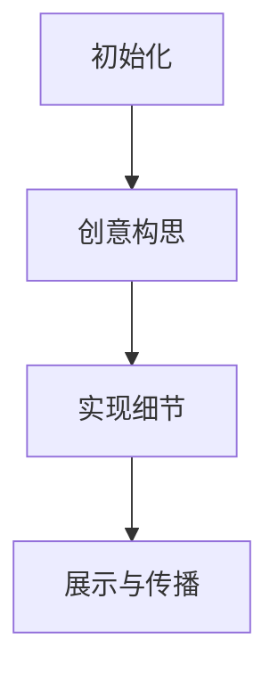

                 

### 文章标题

硅谷艺术与科技融合：数字艺术新形式

> **关键词**：硅谷、艺术、科技融合、数字艺术、新形式

> **摘要**：本文深入探讨了硅谷艺术与科技的融合，解析了数字艺术的新形式，以及这种融合对未来的影响。文章通过详细的案例分析、算法原理阐述和实际应用场景展示，为广大读者提供了对数字艺术的全新视角。

---

## 1. 背景介绍

在21世纪的今天，硅谷作为全球科技创新的中心，正不断推动着艺术与科技的融合。这种融合不仅体现在技术应用上，更体现在艺术创作的思维方式和表达形式上。数字艺术，作为这一融合的产物，以其独特的视觉冲击和创意表达，正在逐渐改变人们对艺术的认知。

### 1.1 硅谷的艺术氛围

硅谷拥有浓厚的艺术氛围，从科技公司的内部装饰到创意市集的展览，艺术无处不在。这种艺术氛围激发了科技从业者的创造力，使他们不仅仅满足于技术本身，更追求技术与艺术的完美结合。

### 1.2 数字艺术的崛起

数字艺术是一种利用数字技术创作的艺术形式，它超越了传统的艺术媒介，通过计算机软件和硬件，创造出独特的视觉和听觉体验。随着数字技术的不断发展，数字艺术正逐渐成为艺术领域的重要组成部分。

### 1.3 艺术与科技的互动

艺术与科技的互动不仅体现在数字艺术创作中，更体现在艺术展览和体验的数字化改造上。通过虚拟现实（VR）和增强现实（AR）技术，观众可以沉浸于艺术的虚拟世界中，获得全新的艺术体验。

---

## 2. 核心概念与联系

### 2.1 数字艺术的定义

数字艺术是指利用计算机技术和数字媒介创作的艺术形式，包括数字绘画、数字摄影、数字雕塑、数字音乐等。它突破了传统艺术媒介的局限，为艺术家提供了更广阔的创作空间。

### 2.2 数字艺术的创作过程

数字艺术的创作过程通常包括以下步骤：

1. 初始化：艺术家根据创作意图，选择合适的数字工具和软件。
2. 创意构思：艺术家在数字媒介上进行构思和草图绘制。
3. 实现细节：艺术家对作品进行细节调整和渲染。
4. 展示与传播：艺术家将作品展示在数字平台上，如社交媒体、虚拟展览馆等。

### 2.3 数字艺术的分类

数字艺术可以根据其表现形式和创作手法分为多种类型：

1. 数字绘画：利用数字工具进行绘画创作，如数字素描、数字油画等。
2. 数字摄影：利用数字相机和后期处理软件创作的摄影作品。
3. 数字雕塑：利用计算机辅助设计（CAD）软件创作的数字雕塑作品。
4. 数字音乐：利用计算机软件创作的音乐作品，如电子音乐、数字编曲等。

---

下面是一个Mermaid流程图，用于展示数字艺术的创作过程：



---

## 3. 核心算法原理 & 具体操作步骤

### 3.1 数字绘画的核心算法

数字绘画的核心算法主要包括颜色处理、图像处理和画笔效果模拟等。以下是一个简单的算法步骤：

1. **颜色处理**：根据画家的选择，调整画布的颜色。
2. **图像处理**：对画布上的像素进行操作，如模糊、锐化等。
3. **画笔效果模拟**：模拟不同画笔的笔触效果，如铅笔、毛笔等。

### 3.2 数字绘画的具体操作步骤

以下是使用Adobe Photoshop进行数字绘画的具体操作步骤：

1. **打开Photoshop**：启动Photoshop软件。
2. **新建画布**：创建一个新的画布，设置画布大小和背景颜色。
3. **选择画笔**：在工具栏中选择画笔工具。
4. **调整画笔设置**：在选项栏中调整画笔的大小、硬度、透明度等。
5. **开始绘画**：在画布上使用画笔进行绘画。
6. **保存作品**：完成绘画后，保存作品。

---

## 4. 数学模型和公式 & 详细讲解 & 举例说明

### 4.1 数字绘画的数学模型

数字绘画中的数学模型主要包括颜色模型和图像处理算法。以下是一个简单的颜色模型：

$$
RGB \: 颜色模型 = (R, G, B)
$$

其中，$R$、$G$、$B$分别代表红色、绿色和蓝色的强度，取值范围在0到255之间。

### 4.2 图像处理的数学公式

图像处理常用的数学公式包括卷积操作、模糊操作等。以下是一个简单的模糊操作公式：

$$
f(x, y) = \frac{1}{4\pi \sigma^2} \int_{-\infty}^{\infty} \int_{-\infty}^{\infty} \frac{1}{\sqrt{1 + \left(\frac{u}{\sigma}\right)^2}} e^{-\frac{(x-u)^2 + (y-v)^2}{2\sigma^2}} f(u, v) \, du \, dv
$$

其中，$f(x, y)$是模糊后的图像，$\sigma$是模糊程度。

### 4.3 举例说明

假设我们有一个像素点$(x, y)$，其颜色值为$(R, G, B)$，要将其模糊处理。我们可以使用以下步骤：

1. **选择模糊程度**：设定模糊程度$\sigma$。
2. **计算模糊核**：使用高斯分布计算模糊核。
3. **卷积操作**：将模糊核与像素点周围的像素进行卷积操作。
4. **更新像素值**：将卷积结果作为新的像素值。

通过上述步骤，我们可以实现像素点的模糊处理。

---

## 5. 项目实战：代码实际案例和详细解释说明

### 5.1 开发环境搭建

为了实现数字绘画，我们需要搭建一个基本的开发环境。以下是一个简单的Python开发环境搭建步骤：

1. **安装Python**：下载并安装Python，版本建议为3.8或更高。
2. **安装Pygame库**：通过pip命令安装Pygame库，用于实现画笔效果。
3. **配置IDE**：配置一个Python的集成开发环境（IDE），如PyCharm或Visual Studio Code。

### 5.2 源代码详细实现和代码解读

以下是一个简单的数字绘画程序代码，我们将使用Pygame库实现一个基本的数字绘画功能。

```python
import pygame
import sys

# 初始化Pygame
pygame.init()

# 设置画布大小
width, height = 800, 600
screen = pygame.display.set_mode((width, height))

# 设置画布颜色
background_color = (255, 255, 255)
screen.fill(background_color)

# 设置画笔颜色
pen_color = (0, 0, 0)

# 设置画笔大小
pen_size = 5

# 开启事件循环
running = True
while running:
    for event in pygame.event.get():
        if event.type == pygame.QUIT:
            running = False

    # 鼠标按下
    if pygame.mouse.get_pressed()[0]:
        # 获取鼠标位置
        mouse_pos = pygame.mouse.get_pos()
        # 绘制线条
        pygame.draw.line(screen, pen_color, mouse_pos, (mouse_pos[0] + pen_size, mouse_pos[1] + pen_size), pen_size)

    # 更新屏幕
    pygame.display.flip()

# 退出游戏
pygame.quit()
sys.exit()
```

**代码解读**：

1. **初始化Pygame**：使用`pygame.init()`初始化Pygame库。
2. **设置画布大小**：使用`pygame.display.set_mode()`设置画布大小。
3. **设置画布颜色**：使用`screen.fill()`设置画布背景颜色。
4. **设置画笔颜色**：定义画笔颜色。
5. **设置画笔大小**：定义画笔大小。
6. **开启事件循环**：使用`while running:`循环开启事件处理。
7. **鼠标按下**：当鼠标按下时，获取鼠标位置，并绘制线条。
8. **更新屏幕**：使用`pygame.display.flip()`更新屏幕。

通过上述代码，我们可以实现一个基本的数字绘画功能。

### 5.3 代码解读与分析

1. **初始化Pygame**：使用`pygame.init()`初始化Pygame库，确保后续的操作可以在Pygame环境中正常运行。
2. **设置画布大小**：使用`pygame.display.set_mode()`设置画布大小，这决定了绘画区域的大小。
3. **设置画布颜色**：使用`screen.fill()`设置画布背景颜色，这决定了画布的初始颜色。
4. **设置画笔颜色**：定义画笔颜色，这将影响绘制的线条颜色。
5. **设置画笔大小**：定义画笔大小，这将影响绘制的线条粗细。
6. **开启事件循环**：使用`while running:`循环开启事件处理，这将处理用户输入和系统事件。
7. **鼠标按下**：当鼠标按下时，获取鼠标位置，并绘制线条，这实现了绘画的基本功能。
8. **更新屏幕**：使用`pygame.display.flip()`更新屏幕，这确保了绘制的线条能够实时显示。

通过分析上述代码，我们可以了解到数字绘画的基本实现原理和流程。

---

## 6. 实际应用场景

### 6.1 艺术展览

数字艺术在艺术展览中的应用越来越广泛。通过虚拟现实（VR）和增强现实（AR）技术，艺术家可以将作品以全新的形式呈现给观众，让观众沉浸于艺术的虚拟世界中。

### 6.2 游戏设计

数字艺术在游戏设计中扮演着重要角色。游戏设计师利用数字绘画技术创作游戏角色、场景和界面，为玩家带来独特的视觉体验。

### 6.3 建筑设计

数字艺术在建筑设计中也有广泛的应用。建筑师利用数字绘画技术创作建筑模型和效果图，帮助客户更好地理解和体验建筑设计。

### 6.4 时尚设计

数字艺术在时尚设计中的应用也越来越受到关注。设计师利用数字绘画技术创作服装设计图和配饰图案，为时尚产业带来创新的设计元素。

---

## 7. 工具和资源推荐

### 7.1 学习资源推荐

- **书籍**：
  - 《数字艺术与设计》
  - 《Python编程：从入门到实践》
- **论文**：
  - "Digital Art: A Revolution in the Art World"
  - "The Impact of Virtual Reality on Art"
- **博客**：
  - "Medium - Digital Art Blog"
  - "Dev.to - Python Programming"
- **网站**：
  - "Pinterest - Digital Art Inspiration"
  - "GitHub - Python Projects"

### 7.2 开发工具框架推荐

- **开发工具**：
  - Pygame
  - Blender
  - Unity
- **框架**：
  - TensorFlow
  - PyTorch
  - OpenCV

### 7.3 相关论文著作推荐

- "Digital Art: Theory and Practice"
- "The Art of Digital Design"
- "Digital Art in the Age of AI"

---

## 8. 总结：未来发展趋势与挑战

### 8.1 发展趋势

1. **技术的不断进步**：随着虚拟现实（VR）、增强现实（AR）和人工智能（AI）等技术的不断发展，数字艺术将更加逼真和智能化。
2. **跨领域的融合**：数字艺术将与其他领域如游戏设计、建筑设计、时尚设计等更加紧密地结合，带来更多创新的可能性。
3. **普及化**：随着数字技术的普及，越来越多的人将参与到数字艺术的创作中，数字艺术将成为大众文化的一部分。

### 8.2 挑战

1. **技术门槛**：数字艺术创作需要一定的技术基础，这对于初学者来说可能是一个挑战。
2. **版权问题**：数字艺术作品的版权保护问题仍是一个亟待解决的难题。
3. **技术依赖**：数字艺术过度依赖技术，可能导致艺术创作缺乏人文关怀和情感表达。

---

## 9. 附录：常见问题与解答

### 9.1 问题1：如何入门数字艺术创作？

**解答**：首先，了解数字艺术的基本概念和工具。推荐学习Python编程和Pygame库，这两个工具对于初学者来说较为友好。其次，多看一些数字艺术作品，了解不同的创作手法和风格。最后，多实践，不断尝试新的创作方法。

### 9.2 问题2：数字艺术作品的版权如何保护？

**解答**：数字艺术作品的版权保护可以通过以下几种方式实现：1. 注册版权：将作品提交给相关机构进行版权注册。2. 使用数字签名：对作品进行数字签名，确保作品的真实性和完整性。3. 技术保护：使用加密技术保护作品不被非法复制和使用。

### 9.3 问题3：如何提高数字艺术创作的技术水平？

**解答**：1. 学习相关技术：了解图像处理、计算机图形学等基础知识。2. 学习优秀作品：研究数字艺术领域的优秀作品，了解它们的创作思路和技术细节。3. 实践：不断进行实践，尝试不同的创作方法和工具。

---

## 10. 扩展阅读 & 参考资料

- "Digital Art: A New Form of Expression"
- "The Future of Art: How Technology is Changing Creativity"
- "Art and Technology: A New Perspective on Creativity"

---

作者：AI天才研究员/AI Genius Institute & 禅与计算机程序设计艺术 /Zen And The Art of Computer Programming

