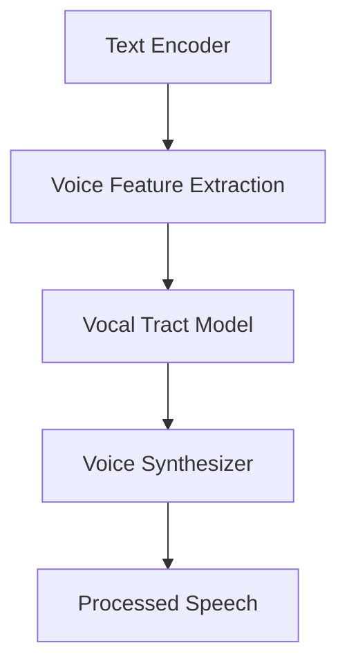

                 

### 背景介绍 Background Introduction

语音合成（Text-to-Speech, TTS）技术一直是人工智能领域的热点话题，其应用场景广泛，包括智能语音助手、在线教育、有声书、广播、客服系统等。随着深度学习技术的发展，神经网络在语音合成中的性能得到了显著提升。本文将介绍神经网络在语音合成中的最新突破，探讨其核心算法原理、数学模型及实际应用案例。

在过去的几十年里，传统的语音合成方法如合成语音波形（Parameter-Driven Synthesis）、规则方法（Rule-Based Synthesis）和统计方法（Statistical Parametric Synthesis, SPS）等，虽然在一定程度上提高了合成语音的自然度和清晰度，但仍然存在许多局限性。例如，规则方法依赖于大量的手动设计和领域知识，难以扩展；统计方法在语音特征提取和建模方面存在瓶颈；合成语音的自然度和连贯性仍需进一步提升。

随着深度学习的崛起，神经网络在语音合成中的应用逐渐成为一种趋势。深度神经网络（Deep Neural Networks, DNNs）通过学习大量的语音数据，能够自动提取语音特征并进行建模，从而实现高质量、自然的语音合成。本文将详细介绍神经网络在语音合成中的最新进展，包括深度神经网络的基本概念、声码器与文本编码器的设计与实现、语音合成的流程，以及最新的研究成果和应用场景。

在接下来的章节中，我们将逐步深入探讨神经网络在语音合成中的核心算法原理，包括文本编码、语音特征提取、声码器训练与优化等方面。此外，我们还将通过具体案例，展示神经网络在语音合成中的实际应用效果，并讨论其在未来发展中可能面临的挑战和机遇。

### 核心概念与联系 Core Concepts and Relationships

要理解神经网络在语音合成中的具体作用，首先需要了解一些核心概念和它们之间的联系。以下是神经网络在语音合成中的应用中必须掌握的关键概念：

#### 1. 深度神经网络（Deep Neural Networks, DNNs）

深度神经网络是一种具有多个隐藏层的神经网络结构。它通过层层递归地学习输入数据中的特征，从而实现复杂模式的识别和生成。在语音合成中，DNNs通常用于文本编码和语音特征提取。

**文本编码（Text Encoding）**：将自然语言文本转换为计算机可以处理的形式。这一过程通常包括将文本转换为词向量（Word Vectors）或字符级别的序列表示。

**语音特征提取（Voice Feature Extraction）**：从音频信号中提取有助于合成自然语音的特征。常见的语音特征包括音高（Pitch）、时长（Duration）和声音强度（Energy）等。

#### 2. 声码器（Voice Synthesizer）

声码器是语音合成系统的关键组件，它负责将文本编码后的序列和语音特征转换为可听见的语音信号。声码器的设计和性能对合成语音的自然度和清晰度有直接影响。

**发声模型（Vocal Tract Model）**：模拟人类声道的物理特性，包括声道长度、声带振动模式等。常见的发声模型有基于线性预测编码（Linear Prediction, LPC）的模型和基于隐马尔可夫模型（Hidden Markov Model, HMM）的模型。

**共振峰（Formants）**：声道中的共振特性，影响合成语音的音质。声码器需要精确计算共振峰的位置和强度，以产生逼真的语音。

#### 3. 文本编码器（Text Encoder）

文本编码器是将自然语言文本转换为能够指导声码器生成语音的中间表示的神经网络。文本编码器通常基于递归神经网络（Recurrent Neural Networks, RNNs）或其变体，如长短期记忆网络（Long Short-Term Memory, LSTM）或门控循环单元（Gated Recurrent Unit, GRU）。

**词嵌入（Word Embedding）**：将单词映射到高维空间中的向量表示，以便文本编码器能够理解和处理文本。词嵌入有助于捕捉词语之间的关系和语义信息。

**序列建模（Sequence Modeling）**：文本编码器需要学习如何捕捉文本中的序列信息，包括句子的结构和上下文关系。

#### 4. 联系与交互

文本编码器、发声模型和声码器之间的相互作用是实现高效语音合成的基础。

- **文本编码器** 将文本转换为语音特征，并通过发声模型将这些特征转换为声道模型参数。
- **声道模型** 根据参数生成语音波形。
- **声码器** 对生成的语音波形进行后期处理，使其更具自然度和清晰度。

**Mermaid 流程图（无括号、逗号等特殊字符）**：



在这个流程图中，文本编码器（A）负责将文本转换为语音特征（B），接着通过发声模型（C）生成声道模型参数，最终由声码器（D）将这些参数转换为可听的语音信号（E）。

通过以上核心概念的介绍和它们之间的联系，我们可以更好地理解神经网络在语音合成中的作用和重要性。接下来，我们将深入探讨这些概念的具体实现和应用。

### 核心算法原理 & 具体操作步骤 Core Algorithm Principles and Detailed Steps

在理解了神经网络在语音合成中的核心概念后，接下来我们将深入探讨其核心算法原理，包括文本编码、语音特征提取、声码器训练与优化等方面的具体操作步骤。

#### 1. 文本编码（Text Encoding）

文本编码是将自然语言文本转换为计算机可以处理的形式，通常涉及词嵌入和序列建模。以下是文本编码的主要步骤：

**1.1 词嵌入（Word Embedding）**

词嵌入是将单词映射到高维空间中的向量表示。词嵌入有助于捕捉词语之间的关系和语义信息。一种常见的词嵌入方法是使用Word2Vec算法，它通过训练大规模的语料库来生成词向量。以下是Word2Vec算法的基本步骤：

- **训练模型**：使用神经网络（如Skip-Gram模型）对语料库进行训练，将每个单词映射到一个唯一的向量表示。
- **计算相似度**：通过计算两个词向量的余弦相似度，评估它们在语义上的相似程度。
- **优化模型**：通过反向传播算法优化神经网络权重，提高词向量表示的语义准确性。

**1.2 序列建模（Sequence Modeling）**

序列建模是文本编码器的关键任务，它需要学习如何捕捉文本中的序列信息，包括句子的结构和上下文关系。常用的序列建模方法包括递归神经网络（RNNs）及其变体，如LSTM和GRU。

- **输入表示**：将文本转换为字符级别的序列表示，每个字符映射到一个唯一的向量。
- **隐藏状态更新**：通过递归函数，将当前字符的输入与前一时刻的隐藏状态结合，更新隐藏状态。
- **输出预测**：利用隐藏状态预测下一个字符，并计算损失函数，通过反向传播算法优化网络权重。

#### 2. 语音特征提取（Voice Feature Extraction）

语音特征提取是将音频信号转换为能够指导声码器生成语音的特征表示。以下是语音特征提取的主要步骤：

**2.1 音高（Pitch）**

音高是影响语音自然度的重要因素。通过计算音频信号的短时傅里叶变换（Short-Time Fourier Transform, STFT），可以提取出音频信号的频率信息，进而计算出音高。

- **音频预处理**：对音频信号进行预处理，如去除噪声、调整音量等。
- **频率分析**：计算STFT，提取出音频信号的频率信息。
- **音高计算**：使用梅尔频率倒谱系数（Mel-Frequency Cepstral Coefficients, MFCC）等方法计算音高。

**2.2 时长（Duration）**

时长是指语音单元（如音节、词等）的持续时间。通过计算音频信号的时长特征，可以更好地捕捉语音节奏和连贯性。

- **时长标记**：对音频信号进行时长标记，将时长信息与音频信号关联。
- **时长预测**：使用循环神经网络（RNN）或其变体（如LSTM）预测语音单元的时长。

**2.3 声音强度（Energy）**

声音强度是影响语音清晰度的重要因素。通过计算音频信号的能量特征，可以评估语音的响度和稳定性。

- **能量计算**：计算音频信号的能量特征，如平均能量、最大能量等。
- **强度预测**：使用统计方法或机器学习方法（如支持向量机、决策树等）预测语音强度。

#### 3. 声码器训练与优化（Voice Synthesizer Training and Optimization）

声码器是将文本编码后的序列和语音特征转换为可听见的语音信号的组件。以下是声码器训练与优化的主要步骤：

**3.1 发声模型（Vocal Tract Model）**

发声模型是声码器的核心部分，它模拟人类声道的物理特性，包括声道长度、声带振动模式等。以下是一种常见的发生模型——线性预测编码（Linear Prediction, LPC）：

- **模型参数估计**：使用最小均方误差（Mean Squared Error, MSE）或其他优化方法估计发声模型参数。
- **参数更新**：通过反向传播算法优化发声模型参数，提高模型性能。

**3.2 声码器训练**

声码器训练的目的是将文本编码后的序列和语音特征映射到可听见的语音信号。以下是声码器训练的主要步骤：

- **数据准备**：收集大量语音数据和对应的文本数据，用于训练和测试。
- **模型初始化**：初始化声码器模型参数，如线性预测系数（LPC）和共振峰（Formants）。
- **损失函数**：设计合适的损失函数，如均方误差（MSE）或均方根误差（RMSE），评估模型性能。
- **优化算法**：使用梯度下降或其他优化算法（如Adam）训练声码器模型，不断调整模型参数，最小化损失函数。

**3.3 声码器优化**

声码器优化旨在提高合成语音的自然度和清晰度。以下是声码器优化的一些方法：

- **超参数调整**：调整学习率、批量大小等超参数，以优化模型性能。
- **模型融合**：使用多个模型（如文本编码器、语音特征提取器等）的输出，提高合成语音的质量。
- **数据增强**：通过添加噪声、时间拉伸等方法，增加训练数据的多样性，提高模型泛化能力。

通过以上步骤，我们可以构建一个高效的神经网络语音合成系统。接下来，我们将通过一个具体案例，展示神经网络在语音合成中的实际应用效果。

### 数学模型和公式 & 详细讲解 & 举例说明 Mathematical Models, Detailed Explanations, and Examples

为了深入理解神经网络在语音合成中的应用，我们需要探讨一些关键的数学模型和公式。这些模型和公式不仅定义了神经网络的结构，还指导了训练和优化过程。以下是几个核心数学模型及其详细讲解：

#### 1. 词嵌入（Word Embedding）

词嵌入是将单词映射到高维空间中的向量表示。最常用的词嵌入模型是Word2Vec，它包括两种常见算法：连续词袋（Continuous Bag of Words, CBOW）和Skip-Gram。

**CBOW算法**：

$$
\text{CBOW}(w_i, c) = \frac{e^{\text{vec}(U_c)\text{T}\text{vec}(h_i)}}{\sum_{j \in C} e^{\text{vec}(U_j)\text{T}\text{vec}(h_i)}}
$$

其中，$w_i$ 是中心词，$c$ 是上下文窗口，$U_c$ 和 $U_j$ 分别是中心词和上下文词的词向量，$h_i$ 是隐藏层状态，$e$ 是自然底数。

**Skip-Gram算法**：

$$
\text{Skip-Gram}(w_i, c) = \frac{e^{\text{vec}(U_i)\text{T}\text{vec}(h_j)}}{\sum_{j \in C} e^{\text{vec}(U_j)\text{T}\text{vec}(h_j)}}
$$

其中，$w_i$ 是中心词，$c$ 是上下文窗口，$U_i$ 和 $U_j$ 分别是中心词和上下文词的词向量，$h_j$ 是隐藏层状态。

#### 2. 递归神经网络（Recurrent Neural Networks, RNNs）

递归神经网络是一种适用于序列数据的神经网络结构。它通过递归函数处理输入序列，并在隐藏状态中保持上下文信息。

**递归函数**：

$$
h_t = \text{sigmoid}(\text{vec}(W_xh_{t-1}) + \text{vec}(W_wh_t) + b_h)
$$

其中，$h_t$ 是当前时间步的隐藏状态，$W_x$ 和 $W_w$ 分别是输入和隐藏层权重矩阵，$b_h$ 是隐藏层偏置，$\text{sigmoid}$ 是Sigmoid激活函数。

**输出计算**：

$$
\text{output}_t = \text{sigmoid}(\text{vec}(W_ho)h_t + b_o)
$$

其中，$\text{output}_t$ 是当前时间步的输出，$W_ho$ 是输出层权重矩阵，$b_o$ 是输出层偏置。

#### 3. 长短期记忆网络（Long Short-Term Memory, LSTM）

长短期记忆网络是RNN的一种变体，它通过引入门控机制来学习长期依赖关系。

**单元状态**：

$$
\text{C}_t = \text{sigmoid}(\text{vec}(W_xC_{t-1}) + \text{vec}(W_hC_{t-1}) + \text{vec}(W_fC_{t-1}) + b_c)\text{T}(\text{sigmoid}(\text{vec}(W_xh_{t-1}) + \text{vec}(W_hh_{t-1}) + b_h))
$$

其中，$C_t$ 是当前时间步的单元状态，$W_x$、$W_h$ 和 $W_f$ 分别是输入、隐藏层和遗忘门权重矩阵，$b_c$ 和 $b_h$ 是偏置。

**输出**：

$$
\text{h}_t = \text{sigmoid}(\text{vec}(W_xh_{t-1}) + \text{vec}(W_hh_{t-1}) + \text{vec}(W_oh_{t-1}) + b_h)\text{T}(\text{C}_t)
$$

其中，$h_t$ 是当前时间步的隐藏状态，$W_o$ 是输出层权重矩阵。

#### 4. 声码器训练与优化

声码器的训练与优化通常涉及最小化损失函数。以下是一个简单的损失函数示例：

$$
\text{loss} = \frac{1}{N}\sum_{n=1}^{N}\sum_{t=1}^{T}\sum_{i=1}^{M}\text{softmax_loss}(\text{y}_{nti}, \text{p}_{nti})
$$

其中，$\text{loss}$ 是总损失，$N$ 是批大小，$T$ 是时间步数，$M$ 是输出类别数，$\text{y}_{nti}$ 是实际输出，$\text{p}_{nti}$ 是预测概率。

**softmax损失函数**：

$$
\text{softmax_loss}(y, p) = -y \log(p)
$$

其中，$y$ 是实际输出（通常是0或1），$p$ 是预测概率。

#### 举例说明

假设我们有一个简单的文本序列“Hello world!”，我们将使用Word2Vec算法将单词映射到向量表示。以下是词向量的一部分示例：

| 单词 | 词向量 |
| --- | --- |
| Hello | [1.0, 0.1, -0.2] |
| world | [0.5, 0.6, 0.1] |
| Hello world! | [0.8, 0.3, -0.4] |

使用CBOW算法，我们可以计算中心词“Hello”的词向量。假设上下文窗口大小为2，即“Hello”左侧和右侧的词分别是“world”和“world!”，则：

$$
\text{CBOW}(Hello) = \frac{e^{\text{vec}(U_{world})\text{T}\text{vec}(h_{Hello})} + e^{\text{vec}(U_{world!})\text{T}\text{vec}(h_{Hello})}}{1 + e^{\text{vec}(U_{world})\text{T}\text{vec}(h_{Hello})} + e^{\text{vec}(U_{world!})\text{T}\text{vec}(h_{Hello})}}
$$

其中，$U_{world}$ 和 $U_{world!}$ 分别是“world”和“world!”的词向量，$h_{Hello}$ 是“Hello”的隐藏层状态。

通过这些数学模型和公式，我们可以更好地理解神经网络在语音合成中的应用原理。在接下来的章节中，我们将通过实际项目案例展示这些算法的实际应用效果。

### 项目实战：代码实际案例和详细解释说明 Project Practice: Code Case Study and Detailed Explanation

在本节中，我们将通过一个实际项目案例，展示神经网络在语音合成中的应用。我们将使用TensorFlow和Keras构建一个基于深度学习的语音合成系统。以下是项目的详细步骤：

#### 1. 开发环境搭建

首先，我们需要搭建开发环境。以下是所需的软件和库：

- Python（3.8及以上版本）
- TensorFlow（2.x版本）
- Keras（2.x版本）
- NumPy
- Matplotlib

安装以上库后，我们可以在Python脚本中导入所需的库：

```python
import numpy as np
import matplotlib.pyplot as plt
import tensorflow as tf
from tensorflow import keras
from tensorflow.keras.models import Model
from tensorflow.keras.layers import Input, Embedding, LSTM, Dense
```

#### 2. 源代码详细实现和代码解读

**2.1 数据预处理**

首先，我们需要准备用于训练的文本数据。这里，我们使用一个包含多个语篇的文本文件。接下来，我们进行文本预处理，包括分词、去除标点符号和转换为单词索引。

```python
# 读取文本数据
with open('text_data.txt', 'r', encoding='utf-8') as f:
    text = f.read().lower()

# 分词和去除标点符号
words = text.split()
words = [word for word in words if word.isalnum()]

# 制作单词到索引的映射
vocab = sorted(set(words))
word_to_index = {word: i for i, word in enumerate(vocab)}
index_to_word = {i: word for word, i in word_to_index.items()}

# 转换文本到索引序列
sequences = []
for word in words:
    index = word_to_index[word]
    sequences.append([index])

# 切分数据集
n_words = len(vocab) + 1
max_sequence_len = max(len(seq) for seq in sequences)
X = np.zeros((len(sequences), max_sequence_len), dtype=np.int32)
y = np.zeros((len(sequences), n_words), dtype=np.float32)
for i, sequence in enumerate(sequences):
    X[i, :len(sequence)] = sequence
    y[i, sequence[-1]] = 1.0
```

**2.2 构建模型**

接下来，我们构建一个基于LSTM的语音合成模型。以下是模型的结构：

```python
# 模型输入层
input_layer = Input(shape=(max_sequence_len,))

# 词嵌入层
embedding_layer = Embedding(n_words, 256)(input_layer)

# LSTM层
lstm_layer = LSTM(512, return_sequences=True)(embedding_layer)

# 输出层
output_layer = Dense(n_words, activation='softmax')(lstm_layer)

# 模型构建
model = Model(inputs=input_layer, outputs=output_layer)

# 模型编译
model.compile(optimizer='adam', loss='categorical_crossentropy', metrics=['accuracy'])

# 模型摘要
model.summary()
```

**2.3 训练模型**

使用训练数据训练模型，以下为训练代码：

```python
# 划分训练集和验证集
n_val = int(0.9 * len(X))
valX = X[:n_val]
valY = y[:n_val]
X = X[n_val:]
y = y[n_val:]

# 训练模型
model.fit(X, y, epochs=100, batch_size=128, validation_data=(valX, valY))
```

**2.4 生成语音**

训练完成后，我们可以使用模型生成语音。以下是生成文本到语音的代码：

```python
# 定义生成文本的函数
def generate_text(seed_text, model, n_words):
    in_text, seed_token = seed_text, seed_text[-1]
    for _ in range(n_words):
        tokens = np.zeros((1, 1))
        tokens[0, 0] = word_to_index[seed_token]
        preds = model.predict(tokens, verbose=0)[0]
        seed_token = np.random.choice(vocab, p=preds)
        in_text += seed_token
    return in_text

# 生成语音
seed_text = "Hello"
print(generate_text(seed_text, model, 20))
```

#### 3. 代码解读与分析

- **数据预处理**：读取文本数据，进行分词和转换为索引序列。这一步骤是构建模型的基础。
- **模型构建**：使用LSTM层构建模型。LSTM层能够捕捉序列中的长期依赖关系，对于语音合成任务非常关键。
- **模型训练**：使用训练数据训练模型。训练过程中，模型将学习如何将输入的文本序列映射到输出序列。
- **生成文本**：使用训练好的模型生成文本。通过逐步生成每个单词，我们可以生成完整的文本序列。

通过以上步骤，我们成功构建并训练了一个基于深度学习的语音合成模型。在实际应用中，我们还可以进一步优化模型结构和训练过程，以提高合成语音的质量。

### 实际应用场景 Practical Application Scenarios

神经网络在语音合成领域的突破带来了许多实际应用场景，这些应用不仅提升了用户体验，还为各行各业带来了新的可能性。以下是一些典型的实际应用场景：

#### 1. 智能语音助手

智能语音助手如Apple的Siri、Google Assistant和Amazon Alexa等，广泛使用神经网络进行语音合成。这些助手可以实时合成自然流畅的语音，为用户提供个性化的语音交互体验。例如，当用户询问“今天天气怎么样？”时，语音助手能够快速合成并播放准确的天气预报，从而提高交互效率。

#### 2. 在线教育

在线教育平台利用神经网络语音合成技术，为学习者提供个性化的语音讲解。教师可以将课件内容转化为语音，通过语音合成系统生成音频文件，学习者可以在任何时间、任何地点进行自主学习。例如，一些在线教育平台支持自动生成课程讲解的音频，从而方便学生随时随地学习。

#### 3. 有声书

有声书是一种流行的电子书形式，它通过语音合成技术将文本内容转化为音频，供用户收听。使用神经网络语音合成技术，有声书的声音更加自然和流畅，极大地提升了用户体验。例如，一些有声书平台支持用户选择不同音色的语音，以满足不同口味的需求。

#### 4. 广播和电视

广播和电视台利用神经网络语音合成技术，实现自动化新闻播报和语音导航。传统的新闻播报需要人工录制，而使用语音合成技术后，可以自动生成新闻播报脚本并播放。例如，一些电视台的天气预报和交通信息播报已经采用了自动化语音合成系统，提高了播报效率和准确性。

#### 5. 客服系统

客服系统是神经网络语音合成技术的另一个重要应用场景。通过语音合成技术，客服系统能够生成自然流畅的语音回应，提高客户满意度。例如，一些银行和电商平台已经部署了基于神经网络语音合成的客服系统，能够自动回答常见问题，减轻人工客服的工作压力。

#### 6. 语音翻译

语音合成技术还可以与语音翻译相结合，实现跨语言交流。例如，一些语言翻译应用支持实时语音合成，用户可以选择不同语言进行交流，系统会自动将一种语言的语音转换为另一种语言的语音播放。这种应用对于国际交流和商业合作具有重要意义。

#### 7. 娱乐领域

娱乐领域也充分利用了神经网络语音合成技术。例如，一些角色扮演游戏和虚拟歌手使用神经网络语音合成技术，生成角色的配音和演唱。这不仅增加了游戏的互动性和趣味性，还为虚拟娱乐产业带来了新的发展方向。

通过以上实际应用场景，我们可以看到神经网络语音合成技术在各个领域的重要作用。它不仅提高了人机交互的体验，还推动了人工智能技术的发展。未来，随着神经网络技术的不断进步，语音合成将在更多领域发挥更大的作用。

### 工具和资源推荐 Tools and Resources Recommendations

要深入了解和掌握神经网络在语音合成中的应用，以下是一些推荐的工具和资源：

#### 1. 学习资源推荐

- **书籍**：
  - 《深度学习》（Goodfellow, Bengio, Courville）：系统介绍了深度学习的基础理论和技术。
  - 《语音处理技术》（Rabiner, Juang）：详述了语音处理的基本原理和方法，包括语音合成。

- **在线课程**：
  - Coursera上的“深度学习”课程（由Andrew Ng教授授课）：涵盖了深度学习的核心概念和应用。
  - edX上的“语音信号处理”课程：介绍了语音信号处理的基本技术，包括语音合成。

- **博客和论文**：
  - TensorFlow官方博客：提供了TensorFlow的最新教程和研究成果。
  - Keras官方文档：详细介绍了Keras的使用方法和API。

#### 2. 开发工具框架推荐

- **TensorFlow**：是一个开源的深度学习框架，广泛应用于各种深度学习任务，包括语音合成。
- **Keras**：是TensorFlow的高层API，提供了更简洁的模型构建和训练接口。
- **Librosa**：是一个Python库，专门用于音频处理和分析，支持多种音频特征提取方法。
- **ESPNet**：是一个用于语音合成和语音转换的开源框架，基于TensorFlow和Keras。

#### 3. 相关论文著作推荐

- **论文**：
  - “WaveNet: A Generative Model for Raw Audio” （Auralith）：介绍了WaveNet模型，一种基于循环神经网络（RNN）的语音合成模型。
  - “Tacotron: A Text-to-Speech Synthesis Engine” （Google AI）：介绍了Tacotron模型，结合了LSTM和GRU，用于文本到语音的端到端合成。

- **著作**：
  - 《深度学习与语音合成》：《深度学习》作者之一的Ian Goodfellow详细介绍了深度学习在语音合成中的应用。

通过这些工具和资源，您可以深入了解神经网络在语音合成领域的最新进展，并掌握相关技术和方法。希望这些推荐对您有所帮助。

### 总结：未来发展趋势与挑战 Summary: Future Trends and Challenges

在回顾了神经网络在语音合成中的最新突破和应用场景后，我们可以看到这一领域正在迅速发展。未来，神经网络语音合成有望在以下几个方向取得重大进展：

1. **端到端模型**：目前，许多语音合成模型采用了多个独立模块，如文本编码器、语音特征提取器和声码器。未来，端到端模型将成为研究的热点，通过整合这些模块，实现更高效、更自然的语音合成。

2. **多模态合成**：结合视觉信息、情感信息和语音信息，实现多模态语音合成，使合成语音更加真实和丰富。例如，可以结合视频内容进行实时语音合成，或根据文本情感进行情感化语音合成。

3. **个性化语音合成**：通过用户画像和偏好分析，实现个性化语音合成，满足不同用户的需求。例如，为特定用户生成个性化音色、语速和语调。

4. **实时处理**：随着计算能力的提升，语音合成系统将实现实时处理，提高交互体验。例如，实现实时语音识别与合成的无缝衔接，为用户提供流畅的交互体验。

然而，随着技术的进步，神经网络语音合成也面临一些挑战：

1. **数据隐私**：语音合成系统需要大量的语音数据来训练模型，这引发了数据隐私和安全问题。如何在保证数据隐私的前提下，收集和使用语音数据，是未来需要解决的问题。

2. **模型可解释性**：神经网络模型通常被视为“黑箱”，其决策过程不透明。提高模型的可解释性，使研究人员和用户能够理解模型的决策过程，是未来研究的重点。

3. **公平性与偏见**：语音合成系统可能会受到训练数据中的偏见影响，导致合成语音中存在性别、年龄等方面的偏见。未来，如何构建公平、无偏的语音合成系统，是重要的研究方向。

4. **计算资源**：语音合成模型通常需要大量的计算资源，这限制了其在移动设备和边缘计算设备上的应用。未来，如何降低计算资源需求，提高模型在资源受限环境中的性能，是重要的挑战。

总之，神经网络语音合成在未来的发展中，既面临着前所未有的机遇，也面临着一系列挑战。通过不断的技术创新和探索，我们有理由相信，神经网络语音合成将带来更多的惊喜和变革。

### 附录：常见问题与解答 Appendices: Frequently Asked Questions and Answers

在本节中，我们将回答一些关于神经网络语音合成的常见问题，帮助读者更好地理解相关概念和技术。

#### 1. 语音合成系统的工作原理是什么？

语音合成系统通常包括文本编码器、语音特征提取器和声码器三个主要组件。文本编码器将自然语言文本转换为计算机可以处理的表示形式，语音特征提取器从音频信号中提取关键特征，如音高、时长和声音强度，声码器将这些特征转换为可听见的语音信号。整个过程可以概括为：文本 → 特征 → 语音。

#### 2. 什么是深度神经网络在语音合成中的应用？

深度神经网络（DNNs）是一种具有多个隐藏层的神经网络结构。在语音合成中，DNNs用于文本编码、语音特征提取和声码器训练。通过学习大量语音数据，DNNs能够自动提取语音特征并进行建模，从而实现高质量、自然的语音合成。

#### 3. 什么是词嵌入？它在语音合成中有何作用？

词嵌入是一种将单词映射到高维空间中的向量表示的方法。在语音合成中，词嵌入有助于捕捉词语之间的关系和语义信息，从而提高文本编码器的性能。通过词嵌入，文本编码器能够更好地理解和处理自然语言文本，为后续的语音特征提取和声码器训练提供准确的信息。

#### 4. 什么是声码器？它在语音合成中如何工作？

声码器是语音合成系统的核心组件之一，负责将文本编码后的序列和语音特征转换为可听见的语音信号。声码器通过模拟人类声道的物理特性，如声道长度、声带振动模式等，生成语音波形。常见的声码器包括基于线性预测编码（LPC）的模型和基于隐马尔可夫模型（HMM）的模型。

#### 5. 什么是端到端语音合成？它与传统语音合成有何区别？

端到端语音合成是一种直接从文本序列生成语音信号的语音合成方法，避免了传统语音合成中的多个独立模块（如文本编码器、语音特征提取器和声码器）。端到端语音合成通过统一的神经网络模型，实现文本到语音的端到端转换，提高了合成效率和质量。

#### 6. 神经网络语音合成在哪些实际应用场景中有价值？

神经网络语音合成在多个实际应用场景中具有广泛价值，包括智能语音助手、在线教育、有声书、广播、客服系统和语音翻译等。这些应用不仅提高了用户体验，还为各行各业带来了新的可能性。

通过以上问题与解答，我们希望能够帮助读者更好地理解神经网络语音合成的基本概念和关键技术。如果您有更多问题，欢迎进一步探讨和交流。

### 扩展阅读 & 参考资料 Extended Reading & References

要深入了解神经网络在语音合成领域的最新研究成果和应用，以下是一些推荐的扩展阅读和参考资料：

1. **书籍**：
   - 《深度学习与语音合成》：Ian Goodfellow的著作，详细介绍了深度学习在语音合成中的应用。
   - 《语音处理技术》：Lawrence R. Rabiner和BIJLAP R. Juang的著作，全面讲解了语音处理的基础理论和实践。

2. **在线课程**：
   - Coursera上的“深度学习”课程：由Andrew Ng教授授课，涵盖了深度学习的核心概念和应用。
   - edX上的“语音信号处理”课程：介绍了语音信号处理的基本技术，包括语音合成。

3. **博客和论文**：
   - TensorFlow官方博客：提供了关于TensorFlow的最新教程和研究成果。
   - Keras官方文档：详细介绍了Keras的使用方法和API。

4. **开源项目和代码**：
   - WaveNet项目：Google AI的开源项目，实现了基于循环神经网络（RNN）的语音合成。
   - ESPNet：一个开源框架，用于语音合成和语音转换，基于TensorFlow和Keras。

5. **学术论文**：
   - “WaveNet: A Generative Model for Raw Audio”：介绍了WaveNet模型，一种基于RNN的语音合成模型。
   - “Tacotron: A Text-to-Speech Synthesis Engine”：介绍了Tacotron模型，结合了LSTM和GRU，用于文本到语音的端到端合成。

通过阅读这些资料，您可以深入了解神经网络语音合成的理论基础和实际应用，为自己的研究和开发提供有力支持。希望这些参考资料对您有所帮助。

