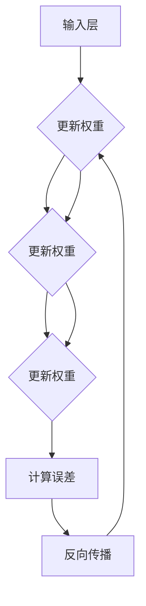

                 

### 背景介绍

神经网络（Neural Networks）是人工智能（Artificial Intelligence, AI）的核心基石，自1980年代以来，随着计算能力的提升和大数据的涌现，神经网络取得了令人瞩目的进展。它们在图像识别、自然语言处理、语音识别、医疗诊断、金融分析等多个领域展现出了强大的应用潜力。今天，我们可以看到神经网络在许多任务中的表现已经超过了人类专家，如谷歌的AlphaGo在围棋比赛中战胜世界冠军，OpenAI的GPT-3在文本生成和问答任务上展现出的惊人能力。

本文旨在深入探讨神经网络的基本原理、核心算法、数学模型，并通过实际项目案例来展示如何使用这些算法进行编程实现。我们将通过以下章节逐步展开：

- **第1章：背景介绍** - 回顾神经网络的历史发展、当前的应用场景以及为什么它成为人工智能领域的关键技术。
- **第2章：核心概念与联系** - 详细介绍神经网络的基本组成部分，包括神经元、层级、前向传播与反向传播等，并使用Mermaid流程图展示神经网络的工作流程。
- **第3章：核心算法原理 & 具体操作步骤** - 探讨神经网络的核心算法，包括多层感知器（MLP）、卷积神经网络（CNN）和循环神经网络（RNN）等，并解释其工作原理和实现步骤。
- **第4章：数学模型和公式 & 详细讲解 & 举例说明** - 深入探讨神经网络背后的数学基础，包括线性代数、微积分和概率论等，并通过具体例子来说明这些数学概念在实际应用中的运用。
- **第5章：项目实战：代码实际案例和详细解释说明** - 通过一个实际的项目案例来展示如何使用神经网络进行编程实现，包括环境搭建、代码实现、代码解读和分析。
- **第6章：实际应用场景** - 分析神经网络在不同领域的应用，如图像识别、语音识别和自然语言处理等，并探讨其优势和挑战。
- **第7章：工具和资源推荐** - 推荐一些有用的学习资源、开发工具和相关的论文著作，帮助读者更深入地了解神经网络。
- **第8章：总结：未来发展趋势与挑战** - 总结神经网络的重要发展历程，讨论当前的趋势和未来的挑战。
- **第9章：附录：常见问题与解答** - 回答一些关于神经网络常见的问题，帮助读者更好地理解和应用这些概念。
- **第10章：扩展阅读 & 参考资料** - 提供一些扩展阅读资料，以便读者进一步探索神经网络领域的深度知识。

通过本文，我们将一起探索神经网络这一强大的技术工具，理解其核心原理，掌握其实际应用技巧，并展望其未来的发展趋势。

### 关键词

- **神经网络**
- **人工智能**
- **深度学习**
- **多层感知器**
- **卷积神经网络**
- **循环神经网络**
- **数学模型**
- **编程实现**
- **应用场景**
- **发展趋势**

### 摘要

本文全面探讨了神经网络作为人工智能核心技术的理论基础和实践应用。首先，回顾了神经网络的历史发展和当前的应用场景，解释了其成为AI领域基石的原因。接着，深入分析了神经网络的核心概念与联系，包括神经元结构、网络层级以及前向传播与反向传播算法。通过详细的数学模型和公式讲解，我们揭示了神经网络背后的数学基础。随后，通过一个实际项目案例，展示了神经网络在编程实现中的应用。文章进一步分析了神经网络在不同领域的应用场景，讨论了其优势和挑战。最后，推荐了丰富的学习资源和开发工具，并总结了神经网络的发展趋势与未来挑战。本文旨在为读者提供全面、系统的神经网络知识体系，帮助读者深入理解并掌握这一重要的AI技术。

### 1. 背景介绍

神经网络（Neural Networks）的概念最早可以追溯到1940年代，当时心理学家McCulloch和数学家Pitts提出了基于生物神经元的计算模型，即所谓的“麦库洛斯-皮特斯模型”（McCulloch-Pitts neuron）。这一模型奠定了神经网络理论的基础，并引发了大量关于人工神经网络（Artificial Neural Networks,ANN）的研究。然而，由于计算能力的限制和算法的复杂性，神经网络的发展在早期进展缓慢。

进入1980年代，随着计算机技术的飞速发展，神经网络研究开始出现新的突破。1986年，Rumelhart、Hinton和Williams等人提出了反向传播算法（Backpropagation Algorithm），这一算法使得多层神经网络的训练成为可能。反向传播算法的核心思想是通过计算输出误差的梯度来更新网络的权重和偏置，从而优化网络性能。这一重要突破极大地推动了神经网络在图像识别、语音识别和自然语言处理等领域的应用。

然而，神经网络的真正爆发还是出现在21世纪初，得益于大数据和深度学习（Deep Learning）的兴起。深度学习是一种多层神经网络模型，通过训练多层非线性变换来提取数据中的复杂特征。2006年，Geoffrey Hinton等人提出了深度置信网络（Deep Belief Networks），为深度学习的发展奠定了基础。随后，卷积神经网络（Convolutional Neural Networks,CNN）和循环神经网络（Recurrent Neural Networks,RNN）等模型相继被提出，进一步拓展了神经网络的应用范围。

在图像识别领域，神经网络的表现尤为突出。传统的图像识别方法依赖于手工设计的特征提取算法，而神经网络可以通过端到端的学习自动提取特征。2012年，AlexNet模型的提出标志着深度学习在图像识别领域的重大突破。该模型在ImageNet竞赛中取得了显著的成绩，大大超越了传统方法。此后，基于CNN的图像识别模型在各个任务中不断刷新记录，成为计算机视觉领域的主流方法。

除了图像识别，神经网络在自然语言处理领域也展现出了强大的能力。传统的自然语言处理方法依赖于规则和统计模型，而神经网络可以通过端到端的建模实现更加精准的语言理解。2018年，OpenAI的GPT-3模型发布，该模型通过预训练和微调在多个自然语言处理任务上取得了令人瞩目的成绩。GPT-3的强大性能展示了神经网络在语言理解、文本生成和问答等任务中的潜力。

语音识别是另一个神经网络应用的重要领域。传统的语音识别方法依赖于隐马尔可夫模型（Hidden Markov Models,HMM）和高斯混合模型（Gaussian Mixture Models,GMM），而神经网络可以更好地捕捉语音信号中的非线性特征。2017年，谷歌发布了基于深度学习的语音识别系统，使得语音识别的准确率达到了前所未有的高度。

在医疗诊断、金融分析、推荐系统等众多领域，神经网络也展现出了广泛的应用潜力。例如，在医疗诊断中，神经网络可以用于分析医学图像和患者数据，帮助医生进行疾病检测和诊断；在金融分析中，神经网络可以用于预测市场走势和风险管理；在推荐系统中，神经网络可以用于个性化推荐，提升用户体验。

总之，神经网络作为人工智能的核心技术，其发展历程充满了挑战和机遇。随着计算能力的提升、数据资源的丰富和算法的创新，神经网络在各个领域的应用前景广阔。通过本文，我们将深入探讨神经网络的基本原理、核心算法和应用实践，帮助读者更好地理解和掌握这一强大的技术工具。

### 2. 核心概念与联系

#### 神经元（Neuron）

神经网络的基本构建块是神经元，也称为节点或单元。每个神经元可以接收多个输入信号，并通过加权求和处理生成一个输出信号。具体来说，一个神经元\( i \)可以表示为：

\[ z_i = \sum_j w_{ij}x_j + b_i \]

其中，\( x_j \)是输入信号，\( w_{ij} \)是权重，\( b_i \)是偏置。神经元通过激活函数\( \sigma \)将输入信号映射到输出信号：

\[ y_i = \sigma(z_i) \]

常见的激活函数包括：

- **Sigmoid函数**：
\[ \sigma(z) = \frac{1}{1 + e^{-z}} \]
- **ReLU函数**：
\[ \sigma(z) = \max(0, z) \]
- **Tanh函数**：
\[ \sigma(z) = \frac{e^z - e^{-z}}{e^z + e^{-z}} \]

#### 层级（Layers）

神经网络由多个层级组成，通常分为输入层、隐藏层和输出层。输入层接收外部输入信号，隐藏层对输入信号进行处理和变换，输出层生成最终输出。

- **输入层（Input Layer）**：接收外部输入数据。
- **隐藏层（Hidden Layers）**：对输入信号进行变换和特征提取。
- **输出层（Output Layer）**：生成最终的输出结果。

#### 前向传播（Forward Propagation）

在前向传播过程中，输入信号从输入层传递到隐藏层，再从隐藏层传递到输出层。在每个层级，神经元通过加权求和处理和激活函数生成输出。整个前向传播过程可以表示为：

\[ z_l = \sum_{i} w_{li}a_{l-1,i} + b_l \]
\[ a_l = \sigma(z_l) \]

其中，\( a_l \)表示第\( l \)层的输出，\( z_l \)表示第\( l \)层的加权求和处理结果。

#### 反向传播（Back Propagation）

反向传播是神经网络训练过程中的关键步骤。通过计算输出误差的梯度，反向传播算法更新网络的权重和偏置，以优化网络性能。具体来说，反向传播包括以下步骤：

1. **计算输出误差**：
\[ \delta_n = (y_n - t_n) \odot \sigma'(z_n) \]
2. **反向传播误差**：
\[ \delta_l = \delta_{l+1} \odot \frac{\partial a_l}{\partial z_l} \]
3. **更新权重和偏置**：
\[ w_{li} \leftarrow w_{li} - \alpha \frac{\partial E}{\partial w_{li}} \]
\[ b_l \leftarrow b_l - \alpha \frac{\partial E}{\partial b_l} \]

其中，\( t_n \)是实际输出，\( y_n \)是预测输出，\( \odot \)表示逐元素乘法，\( \sigma' \)表示激活函数的导数，\( \alpha \)是学习率。

#### Mermaid流程图

以下是一个简单的Mermaid流程图，展示神经网络的前向传播和反向传播过程：



通过以上核心概念和联系的介绍，我们为接下来的详细讨论和具体实现打下了基础。在接下来的章节中，我们将进一步探讨神经网络的核心算法原理、数学模型和实际应用。

### 3. 核心算法原理 & 具体操作步骤

#### 多层感知器（MLP）

多层感知器（MLP，Multi-Layer Perceptron）是神经网络中最基本的形式之一，它由输入层、一个或多个隐藏层以及输出层组成。MLP的主要目的是通过训练，对输入数据进行分类或回归。

##### 步骤1：初始化权重和偏置

在训练MLP之前，需要随机初始化网络的权重（\( w \)）和偏置（\( b \)）。这些参数决定了网络的性能，因此初始化的值通常较小，以确保网络能够从初始状态开始学习。

```python
import numpy as np

input_size = 3
hidden_size = 4
output_size = 2

weights_input_hidden = np.random.randn(input_size, hidden_size)
weights_hidden_output = np.random.randn(hidden_size, output_size)
bias_hidden = np.zeros(hidden_size)
bias_output = np.zeros(output_size)
```

##### 步骤2：前向传播

前向传播过程涉及将输入数据通过网络层传递，并计算每层的输出。具体步骤如下：

1. **输入层到隐藏层**：

\[ z_h = X \cdot W_{ih} + B_h \]
\[ a_h = \sigma(z_h) \]

其中，\( X \)是输入数据，\( W_{ih} \)是输入层到隐藏层的权重，\( B_h \)是隐藏层的偏置，\( \sigma \)是激活函数。

2. **隐藏层到输出层**：

\[ z_o = A_h \cdot W_{ho} + B_o \]
\[ y = \sigma(z_o) \]

其中，\( A_h \)是隐藏层的输出，\( W_{ho} \)是隐藏层到输出层的权重，\( B_o \)是输出层的偏置。

```python
def forward_propagation(X, W_ih, W_ho, B_h, B_o, activation_func):
    z_h = np.dot(X, W_ih) + B_h
    a_h = activation_func(z_h)
    z_o = np.dot(a_h, W_ho) + B_o
    y = activation_func(z_o)
    return z_h, a_h, z_o, y
```

##### 步骤3：计算损失函数

损失函数用于衡量模型预测值与真实值之间的差异。常用的损失函数包括均方误差（MSE，Mean Squared Error）和交叉熵（Cross Entropy）。

1. **均方误差（MSE）**：

\[ J = \frac{1}{2} \sum_{i} (y_i - \hat{y}_i)^2 \]

2. **交叉熵（Cross Entropy）**：

\[ J = -\sum_{i} y_i \log(\hat{y}_i) \]

```python
def mean_squared_error(y, y_pred):
    return 0.5 * np.mean((y - y_pred)**2)

def cross_entropy(y, y_pred):
    return -np.mean(y * np.log(y_pred) + (1 - y) * np.log(1 - y_pred))
```

##### 步骤4：反向传播

反向传播算法通过计算损失函数的梯度来更新网络的权重和偏置。具体步骤如下：

1. **计算输出层的梯度**：

\[ \delta_n = \frac{\partial J}{\partial z_n} = \frac{\partial J}{\partial y} \odot \frac{\partial y}{\partial z_n} \]

2. **反向传播梯度到隐藏层**：

\[ \delta_h = \frac{\partial J}{\partial z_h} = \delta_n \odot \frac{\partial z_n}{\partial z_h} \]

3. **更新权重和偏置**：

\[ W_{li} \leftarrow W_{li} - \alpha \frac{\partial J}{\partial W_{li}} \]
\[ b_l \leftarrow b_l - \alpha \frac{\partial J}{\partial b_l} \]

```python
def backward_propagation(y, y_pred, a_h, z_h, W_ho, activation_func, activation_derivative):
    delta_n = (y - y_pred) * activation_derivative(z_o)
    delta_h = delta_n.dot(W_ho.T) * activation_derivative(z_h)
    dW_ho = a_h.T.dot(delta_n)
    db_o = np.sum(delta_n, axis=0)
    dW_ih = np.dot(X.T, delta_h)
    db_h = np.sum(delta_h, axis=0)
    return dW_ih, dW_ho, db_h, db_o
```

##### 步骤5：训练循环

通过多次迭代前向传播和反向传播，不断更新网络参数，直至满足停止条件（如损失函数收敛、达到最大迭代次数等）。

```python
learning_rate = 0.1
epochs = 1000

for epoch in range(epochs):
    z_h, a_h, z_o, y_pred = forward_propagation(X, W_ih, W_ho, B_h, B_o, sigmoid)
    loss = mean_squared_error(y, y_pred)
    dW_ih, dW_ho, db_h, db_o = backward_propagation(y, y_pred, a_h, z_h, W_ho, sigmoid, sigmoid_derivative)
    
    W_ih -= learning_rate * dW_ih
    W_ho -= learning_rate * dW_ho
    B_h -= learning_rate * db_h
    B_o -= learning_rate * db_o

    if epoch % 100 == 0:
        print(f'Epoch {epoch}: Loss = {loss}')
```

通过以上步骤，我们可以实现一个简单的多层感知器（MLP）模型。尽管MLP是神经网络的基本形式，但在实际应用中，我们通常需要更复杂的模型，如卷积神经网络（CNN）和循环神经网络（RNN），以处理不同类型的数据和任务。接下来，我们将讨论这些高级神经网络模型。

#### 卷积神经网络（CNN）

卷积神经网络（CNN，Convolutional Neural Networks）是一种专门用于处理图像数据的神经网络模型，它通过卷积层提取图像特征，从而实现图像分类、目标检测等任务。

##### 步骤1：初始化权重和偏置

与MLP类似，CNN的权重和偏置也需要随机初始化。不同的是，CNN的权重是局部连接的，而不是全连接的。

```python
filter_size = 3
num_filters = 32

weights_conv = np.random.randn(filter_size, filter_size, input_channels, num_filters)
bias_conv = np.zeros(num_filters)
```

##### 步骤2：卷积操作

卷积操作通过在图像上滑动滤波器（卷积核），提取局部特征。

\[ Z = \sum_{k} w_{k} \cdot X \]

其中，\( Z \)是卷积后的特征图，\( w_k \)是滤波器，\( X \)是输入图像。

```python
def conv2d(X, W, bias):
    output_height = X.shape[0] - W.shape[0] + 1
    output_width = X.shape[1] - W.shape[1] + 1
    Z = np.zeros((output_height, output_width))
    for i in range(output_height):
        for j in range(output_width):
            Z[i, j] = np.sum(W * X[i:i+W.shape[0], j:j+W.shape[1]]) + bias
    return Z
```

##### 步骤3：激活函数和池化

激活函数和池化层用于增强网络的非线性能力和减少参数数量。

1. **ReLU激活函数**：

\[ a = \max(0, z) \]

2. **最大池化（Max Pooling）**：

\[ a_{p,i,j} = \max(z_{p,i,j}) \]

其中，\( a \)是激活后的特征图，\( z \)是卷积后的特征图，\( p \)是池化窗口大小。

```python
def relu(z):
    return np.maximum(0, z)

def max_pooling(Z, pool_size):
    output_height = Z.shape[0] // pool_size
    output_width = Z.shape[1] // pool_size
    P = np.zeros((output_height, output_width))
    for i in range(output_height):
        for j in range(output_width):
            P[i, j] = np.max(Z[i*pool_size:(i+1)*pool_size, j*pool_size:(j+1)*pool_size])
    return P
```

##### 步骤4：全连接层和输出层

在卷积层之后，CNN通常包含一个或多个全连接层，用于将卷积特征映射到分类结果。

```python
def forward_propagation_cnn(X, weights_conv, biases_conv, weights_fc, biases_fc, activation_func):
    Z = X
    for w, b in zip(weights_conv, biases_conv):
        Z = conv2d(Z, w, b)
        Z = activation_func(Z)
        Z = max_pooling(Z, pool_size=2)
    Z = Z.flatten()
    Z = np.dot(Z, weights_fc) + biases_fc
    return activation_func(Z)
```

##### 步骤5：损失函数和反向传播

与MLP类似，CNN也使用反向传播算法更新网络参数。不同的是，CNN的反向传播需要处理卷积层的局部连接特性。

```python
def backward_propagation_cnn(X, y, weights_conv, weights_fc, biases_conv, biases_fc, activation_func, activation_derivative, pool_size):
    dZ = (y - forward_propagation_cnn(X, weights_conv, biases_conv, weights_fc, biases_fc, activation_func)) * activation_derivative(Z)
    dZ = reshape_for_backprop(dZ, pool_size)
    dW_fc = Z.T.dot(dZ)
    db_fc = np.sum(dZ, axis=0)
    
    dZ = dZ.dot(weights_fc.T)
    dZ = reshape_for_backprop(dZ, pool_size)
    for w, b, dw, db in zip(weights_conv, biases_conv, dW_conv, dB_conv):
        dZ = conv2d(dZ, w, b)
        dw = X.T.dot(dZ)
        db = np.sum(dZ, axis=0)
        
        dZ = dZ * activation_derivative(Z)
        dZ = max_pooling(dZ, pool_size=pool_size)
```

通过以上步骤，我们可以实现一个简单的卷积神经网络（CNN）。尽管CNN主要用于图像处理，但它的结构可以扩展到其他类型的数据和任务，如语音处理和文本分析。接下来，我们将讨论循环神经网络（RNN）。

#### 循环神经网络（RNN）

循环神经网络（RNN，Recurrent Neural Networks）是一种能够处理序列数据的神经网络模型，它通过循环结构保留前一个时间步的信息，从而对序列中的每个元素进行建模。

##### 步骤1：初始化权重和偏置

RNN的权重和偏置也需要随机初始化。

```python
input_size = 3
hidden_size = 4
output_size = 2

weights_ih = np.random.randn(hidden_size, input_size)
weights_hh = np.random.randn(hidden_size, hidden_size)
weights_ho = np.random.randn(output_size, hidden_size)
bias_h = np.zeros(hidden_size)
bias_o = np.zeros(output_size)
```

##### 步骤2：前向传播

RNN的前向传播过程涉及计算当前时间步的隐藏状态和输出。

\[ h_t = \sigma(W_{ih}x_t + W_{hh}h_{t-1} + b_h) \]
\[ y_t = \sigma(W_{ho}h_t + b_o) \]

其中，\( x_t \)是输入，\( h_t \)是隐藏状态，\( y_t \)是输出。

```python
def forward_propagation_rnn(x, weights_ih, weights_hh, weights_ho, bias_h, bias_o, activation_func):
    h = bias_h
    for x_t in x:
        h = activation_func(np.dot(h, weights_hh) + np.dot(x_t, weights_ih) + bias_h)
    y = activation_func(np.dot(h, weights_ho) + bias_o)
    return h, y
```

##### 步骤3：反向传播

RNN的反向传播过程涉及计算隐藏状态和输出的梯度，并更新网络参数。

\[ \delta_n = \frac{\partial J}{\partial z_n} = \frac{\partial J}{\partial y} \odot \frac{\partial y}{\partial z_n} \]
\[ \delta_h = \frac{\partial J}{\partial z_h} = \delta_n \odot \frac{\partial z_h}{\partial h} \]
\[ \delta_{h_{t-1}} = \delta_h \odot \frac{\partial h_{t-1}}{\partial z_{h_{t-1}}} \]

```python
def backward_propagation_rnn(y, y_pred, h, weights_hh, weights_ih, weights_ho, activation_func, activation_derivative):
    delta_n = (y - y_pred) * activation_derivative(y)
    delta_h = delta_n.dot(weights_ho.T)
    delta_hh = delta_h.dot(weights_hh.T) * activation_derivative(h)
    delta_ih = delta_h.dot(weights_ih.T) * activation_derivative(h_prev)
    
    dW_hh = h_prev.T.dot(delta_hh)
    dW_ih = x.T.dot(delta_ih)
    dW_ho = h.T.dot(delta_n)
    db_h = np.sum(delta_h, axis=0)
    db_o = np.sum(delta_n, axis=0)
    return dW_hh, dW_ih, dW_ho, db_h, db_o
```

##### 步骤4：训练循环

通过多次迭代前向传播和反向传播，不断更新网络参数，直至满足停止条件。

```python
learning_rate = 0.1
epochs = 1000

for epoch in range(epochs):
    h, y_pred = forward_propagation_rnn(x, weights_ih, weights_hh, weights_ho, bias_h, bias_o, sigmoid, sigmoid_derivative)
    loss = mean_squared_error(y, y_pred)
    dW_hh, dW_ih, dW_ho, db_h, db_o = backward_propagation_rnn(y, y_pred, h, weights_hh, weights_ih, weights_ho, sigmoid, sigmoid_derivative)
    
    weights_ih -= learning_rate * dW_ih
    weights_hh -= learning_rate * dW_hh
    weights_ho -= learning_rate * dW_ho
    bias_h -= learning_rate * db_h
    bias_o -= learning_rate * db_o

    if epoch % 100 == 0:
        print(f'Epoch {epoch}: Loss = {loss}')
```

通过以上步骤，我们可以实现一个简单的循环神经网络（RNN）。尽管RNN可以处理序列数据，但它在处理长序列时存在梯度消失或梯度爆炸的问题。为了解决这些问题，后续出现了门控循环单元（GRU）和长短期记忆网络（LSTM）。接下来，我们将讨论这些高级RNN模型。

#### 门控循环单元（GRU）

门控循环单元（GRU，Gated Recurrent Unit）是RNN的一种变体，通过引入门控机制解决了梯度消失和梯度爆炸的问题，同时提高了网络的记忆能力。

##### 步骤1：初始化权重和偏置

GRU的权重和偏置也需要随机初始化。

```python
input_size = 3
hidden_size = 4
output_size = 2

weights_ih_z = np.random.randn(hidden_size, input_size)
weights_hh_z = np.random.randn(hidden_size, hidden_size)
weights_ih_r = np.random.randn(hidden_size, input_size)
weights_hh_r = np.random.randn(hidden_size, hidden_size)
weights_ih_h = np.random.randn(hidden_size, input_size)
weights_hh_h = np.random.randn(hidden_size, hidden_size)
weights_ho = np.random.randn(output_size, hidden_size)
bias_z = np.zeros(hidden_size)
bias_r = np.zeros(hidden_size)
bias_h = np.zeros(hidden_size)
bias_o = np.zeros(output_size)
```

##### 步骤2：前向传播

GRU的前向传播过程涉及计算当前时间步的更新门、重置门和隐藏状态。

\[ z_t = \sigma(W_{ih_z}x_t + W_{hh_z}h_{t-1} + b_z) \]
\[ r_t = \sigma(W_{ih_r}x_t + W_{hh_r}h_{t-1} + b_r) \]
\[ h_t' = \sigma(W_{ih_h}x_t + W_{hh_h}(r_t \odot h_{t-1}) + b_h) \]
\[ h_t = z_t \odot h_t' + (1 - z_t) \odot h_{t-1} \]
\[ y_t = \sigma(W_{ho}h_t + b_o) \]

其中，\( z_t \)是更新门，\( r_t \)是重置门，\( h_t' \)是候选隐藏状态。

```python
def forward_propagation_gru(x, weights_ih_z, weights_hh_z, weights_ih_r, weights_hh_r, weights_ih_h, weights_hh_h, weights_ho, bias_z, bias_r, bias_h, bias_o, activation_func):
    h = bias_h
    for x_t in x:
        z = activation_func(np.dot(h, weights_hh_z) + np.dot(x_t, weights_ih_z) + bias_z)
        r = activation_func(np.dot(h, weights_hh_r) + np.dot(x_t, weights_ih_r) + bias_r)
        h_prime = activation_func(np.dot(h, weights_hh_h) + np.dot(r \* h, weights_ih_h) + bias_h)
        h = z \* h_prime + (1 - z) \* h
        y = activation_func(np.dot(h, weights_ho) + bias_o)
    return h, y
```

##### 步骤3：反向传播

GRU的反向传播过程与RNN类似，但需要处理门控机制。

\[ \delta_n = \frac{\partial J}{\partial z_n} = \frac{\partial J}{\partial y} \odot \frac{\partial y}{\partial z_n} \]
\[ \delta_h = \frac{\partial J}{\partial z_h} = \delta_n \odot \frac{\partial z_h}{\partial h} \]
\[ \delta_{h_{t-1}} = \delta_h \odot \frac{\partial h_{t-1}}{\partial z_{h_{t-1}}} \]

```python
def backward_propagation_gru(y, y_pred, h, weights_ih_z, weights_hh_z, weights_ih_r, weights_hh_r, weights_ih_h, weights_hh_h, weights_ho, bias_z, bias_r, bias_h, bias_o, activation_func, activation_derivative):
    delta_n = (y - y_pred) * activation_derivative(y)
    delta_h = delta_n.dot(weights_ho.T)
    delta_hh = delta_h.dot(weights_ho.T).dot(weights_hh_h.T) * activation_derivative(h)
    delta_ih = delta_h.dot(weights_hh_h.T).dot(weights_ih_h.T) * activation_derivative(h_prime)
    delta_z = delta_h.dot(weights_hh_z.T).dot(weights_ih_z.T) * activation_derivative(z)
    delta_r = delta_h.dot(weights_hh_r.T).dot(weights_ih_r.T) * activation_derivative(r)
    
    dW_hh_z = h_prev.T.dot(delta_z)
    dW_ih_z = x.T.dot(delta_z)
    dW_hh_r = h_prev.T.dot(delta_r)
    dW_ih_r = x.T.dot(delta_r)
    dW_hh_h = (r \* h_prev).T.dot(delta_hh)
    dW_ih_h = x.T.dot(delta_hh)
    dW_ho = h.T.dot(delta_n)
    db_z = np.sum(delta_z, axis=0)
    db_r = np.sum(delta_r, axis=0)
    db_h = np.sum(delta_hh, axis=0)
    db_o = np.sum(delta_n, axis=0)
    return dW_hh_z, dW_ih_z, dW_hh_r, dW_ih_r, dW_hh_h, dW_ih_h, dW_ho, db_z, db_r, db_h, db_o
```

##### 步骤4：训练循环

通过多次迭代前向传播和反向传播，不断更新网络参数，直至满足停止条件。

```python
learning_rate = 0.1
epochs = 1000

for epoch in range(epochs):
    h, y_pred = forward_propagation_gru(x, weights_ih_z, weights_hh_z, weights_ih_r, weights_hh_r, weights_ih_h, weights_hh_h, weights_ho, bias_z, bias_r, bias_h, bias_o, sigmoid, sigmoid_derivative)
    loss = mean_squared_error(y, y_pred)
    dW_hh_z, dW_ih_z, dW_hh_r, dW_ih_r, dW_hh_h, dW_ih_h, dW_ho, db_z, db_r, db_h, db_o = backward_propagation_gru(y, y_pred, h, weights_ih_z, weights_hh_z, weights_ih_r, weights_hh_r, weights_ih_h, weights_hh_h, weights_ho, bias_z, bias_r, bias_h, bias_o, sigmoid, sigmoid_derivative)
    
    weights_ih_z -= learning_rate * dW_ih_z
    weights_hh_z -= learning_rate * dW_hh_z
    weights_ih_r -= learning_rate * dW_ih_r
    weights_hh_r -= learning_rate * dW_hh_r
    weights_ih_h -= learning_rate * dW_ih_h
    weights_hh_h -= learning_rate * dW_hh_h
    weights_ho -= learning_rate * dW_ho
    bias_z -= learning_rate * db_z
    bias_r -= learning_rate * db_r
    bias_h -= learning_rate * db_h
    bias_o -= learning_rate * db_o

    if epoch % 100 == 0:
        print(f'Epoch {epoch}: Loss = {loss}')
```

通过以上步骤，我们可以实现一个简单的门控循环单元（GRU）。尽管GRU在处理序列数据方面具有优势，但它在处理长序列时仍然存在一些问题。为了解决这些问题，后续出现了长短期记忆网络（LSTM）。

#### 长短期记忆网络（LSTM）

长短期记忆网络（LSTM，Long Short-Term Memory）是RNN的一种变体，通过引入记忆单元和门控机制，解决了梯度消失和梯度爆炸的问题，并提高了网络的长期记忆能力。

##### 步骤1：初始化权重和偏置

LSTM的权重和偏置也需要随机初始化。

```python
input_size = 3
hidden_size = 4
output_size = 2

weights_ih_f = np.random.randn(hidden_size, input_size)
weights_hh_f = np.random.randn(hidden_size, hidden_size)
weights_ih_i = np.random.randn(hidden_size, input_size)
weights_hh_i = np.random.randn(hidden_size, hidden_size)
weights_ih_o = np.random.randn(hidden_size, input_size)
weights_hh_o = np.random.randn(hidden_size, hidden_size)
weights_ih_g = np.random.randn(hidden_size, input_size)
weights_hh_g = np.random.randn(hidden_size, hidden_size)
weights_ho = np.random.randn(output_size, hidden_size)
bias_f = np.zeros(hidden_size)
bias_i = np.zeros(hidden_size)
bias_o = np.zeros(hidden_size)
bias_g = np.zeros(hidden_size)
bias_h = np.zeros(hidden_size)
bias_o = np.zeros(output_size)
```

##### 步骤2：前向传播

LSTM的前向传播过程涉及计算当前时间步的遗忘门、输入门、输出门和隐藏状态。

\[ f_t = \sigma(W_{ih_f}x_t + W_{hh_f}h_{t-1} + b_f) \]
\[ i_t = \sigma(W_{ih_i}x_t + W_{hh_i}h_{t-1} + b_i) \]
\[ o_t = \sigma(W_{ih_o}x_t + W_{hh_o}h_{t-1} + b_o) \]
\[ g_t = \tanh(W_{ih_g}x_t + W_{hh_g}h_{t-1} + b_g) \]
\[ h_t = o_t \odot \tanh(c_t) \]
\[ c_t = f_t \odot c_{t-1} + i_t \odot g_t \]
\[ y_t = \sigma(W_{ho}h_t + b_o) \]

其中，\( f_t \)是遗忘门，\( i_t \)是输入门，\( o_t \)是输出门，\( g_t \)是候选记忆单元，\( c_t \)是当前记忆单元，\( h_t \)是当前隐藏状态。

```python
def forward_propagation_lstm(x, weights_ih_f, weights_hh_f, weights_ih_i, weights_hh_i, weights_ih_o, weights_hh_o, weights_ih_g, weights_hh_g, weights_ho, bias_f, bias_i, bias_o, bias_g, bias_h, bias_o, activation_func):
    h = bias_h
    c = bias_c
    for x_t in x:
        f = activation_func(np.dot(h, weights_hh_f) + np.dot(x_t, weights_ih_f) + bias_f)
        i = activation_func(np.dot(h, weights_hh_i) + np.dot(x_t, weights_ih_i) + bias_i)
        o = activation_func(np.dot(h, weights_hh_o) + np.dot(x_t, weights_ih_o) + bias_o)
        g = tanh(np.dot(h, weights_hh_g) + np.dot(x_t, weights_ih_g) + bias_g)
        c = f * c + i * g
        h = o * tanh(c)
        y = activation_func(np.dot(h, weights_ho) + bias_o)
    return h, c, y
```

##### 步骤3：反向传播

LSTM的反向传播过程与GRU类似，但需要处理门控机制和记忆单元。

\[ \delta_n = \frac{\partial J}{\partial z_n} = \frac{\partial J}{\partial y} \odot \frac{\partial y}{\partial z_n} \]
\[ \delta_h = \frac{\partial J}{\partial z_h} = \delta_n \odot \frac{\partial z_h}{\partial h} \]
\[ \delta_{h_{t-1}} = \delta_h \odot \frac{\partial h_{t-1}}{\partial z_{h_{t-1}}} \]

```python
def backward_propagation_lstm(y, y_pred, h, c, weights_ih_f, weights_hh_f, weights_ih_i, weights_hh_i, weights_ih_o, weights_hh_o, weights_ih_g, weights_hh_g, weights_ho, bias_f, bias_i, bias_o, bias_g, bias_h, bias_o, activation_func, activation_derivative):
    delta_n = (y - y_pred) * activation_derivative(y)
    delta_h = delta_n.dot(weights_ho.T)
    delta_hh_f = delta_h.dot(weights_hh_f.T) * activation_derivative(f)
    delta_ih_f = delta_h.dot(weights_ih_f.T) * activation_derivative(f)
    delta_hh_i = delta_h.dot(weights_hh_i.T) * activation_derivative(i)
    delta_ih_i = delta_h.dot(weights_ih_i.T) * activation_derivative(i)
    delta_hh_o = delta_h.dot(weights_hh_o.T) * activation_derivative(o)
    delta_ih_o = delta_h.dot(weights_ih_o.T) * activation_derivative(o)
    delta_hh_g = delta_h.dot(weights_hh_g.T) * activation_derivative(g)
    delta_ih_g = delta_h.dot(weights_ih_g.T) * activation_derivative(g)
    delta_hh_c = delta_n.dot(tanh_derivative(c)) * (1 - o) * o
    delta_ih_c = delta_n.dot(tanh_derivative(c)) * (1 - o) * o
    
    dW_hh_f = h_prev.T.dot(delta_hh_f)
    dW_ih_f = x.T.dot(delta_ih_f)
    dW_hh_i = h_prev.T.dot(delta_hh_i)
    dW_ih_i = x.T.dot(delta_ih_i)
    dW_hh_o = h_prev.T.dot(delta_hh_o)
    dW_ih_o = x.T.dot(delta_ih_o)
    dW_hh_g = h_prev.T.dot(delta_hh_g)
    dW_ih_g = x.T.dot(delta_ih_g)
    dW_ho = h.T.dot(delta_n)
    db_f = np.sum(delta_hh_f, axis=0)
    db_i = np.sum(delta_hh_i, axis=0)
    db_o = np.sum(delta_hh_o, axis=0)
    db_g = np.sum(delta_hh_g, axis=0)
    db_h = np.sum(delta_n, axis=0)
    db_o = np.sum(delta_n, axis=0)
    return dW_hh_f, dW_ih_f, dW_hh_i, dW_ih_i, dW_hh_o, dW_ih_o, dW_hh_g, dW_ih_g, dW_ho, db_f, db_i, db_o, db_g, db_h, db_o
```

##### 步骤4：训练循环

通过多次迭代前向传播和反向传播，不断更新网络参数，直至满足停止条件。

```python
learning_rate = 0.1
epochs = 1000

for epoch in range(epochs):
    h, c, y_pred = forward_propagation_lstm(x, weights_ih_f, weights_hh_f, weights_ih_i, weights_hh_i, weights_ih_o, weights_hh_o, weights_ih_g, weights_hh_g, weights_ho, bias_f, bias_i, bias_o, bias_g, bias_h, bias_o, sigmoid, sigmoid_derivative, tanh, tanh_derivative)
    loss = mean_squared_error(y, y_pred)
    dW_hh_f, dW_ih_f, dW_hh_i, dW_ih_i, dW_hh_o, dW_ih_o, dW_hh_g, dW_ih_g, dW_ho, db_f, db_i, db_o, db_g, db_h, db_o = backward_propagation_lstm(y, y_pred, h, c, weights_ih_f, weights_hh_f, weights_ih_i, weights_hh_i, weights_ih_o, weights_hh_o, weights_ih_g, weights_hh_g, weights_ho, bias_f, bias_i, bias_o, bias_g, bias_h, bias_o, sigmoid, sigmoid_derivative, tanh, tanh_derivative)
    
    weights_ih_f -= learning_rate * dW_ih_f
    weights_hh_f -= learning_rate * dW_hh_f
    weights_ih_i -= learning_rate * dW_ih_i
    weights_hh_i -= learning_rate * dW_hh_i
    weights_ih_o -= learning_rate * dW_ih_o
    weights_hh_o -= learning_rate * dW_hh_o
    weights_ih_g -= learning_rate * dW_ih_g
    weights_hh_g -= learning_rate * dW_hh_g
    weights_ho -= learning_rate * dW_ho
    bias_f -= learning_rate * db_f
    bias_i -= learning_rate * db_i
    bias_o -= learning_rate * db_o
    bias_g -= learning_rate * db_g
    bias_h -= learning_rate * db_h
    bias_o -= learning_rate * db_o

    if epoch % 100 == 0:
        print(f'Epoch {epoch}: Loss = {loss}')
```

通过以上步骤，我们可以实现一个简单的长短期记忆网络（LSTM）。LSTM在处理长序列数据和复杂任务方面具有显著优势，但它仍然存在一些问题，如参数数量大和计算复杂度高。为了解决这些问题，后续出现了变换器（Transformer）。

#### 变换器（Transformer）

变换器（Transformer）是近年来在自然语言处理领域取得突破性进展的一种新型神经网络架构，它通过自注意力机制（Self-Attention）和多头注意力（Multi-Head Attention）实现了对序列数据的全局建模，显著提高了模型的性能和效率。

##### 步骤1：初始化权重和偏置

变换器的权重和偏置也需要随机初始化。

```python
d_model = 512
num_heads = 8
hidden_size = 2048

weights_q = np.random.randn(d_model, d_model)
weights_k = np.random.randn(d_model, d_model)
weights_v = np.random.randn(d_model, d_model)
weights_out = np.random.randn(hidden_size, d_model)
bias_k = np.zeros(d_model)
bias_v = np.zeros(d_model)
bias_out = np.zeros(hidden_size)
```

##### 步骤2：多头注意力

多头注意力是一种将输入序列映射到多个查询（Query）、键（Key）和值（Value）向量的机制，并通过计算注意力得分和加权求和来生成输出。

\[ Q = W_Q \cdot X \]
\[ K = W_K \cdot X \]
\[ V = W_V \cdot X \]

\[ \text{Attention}(Q, K, V) = \text{softmax}\left(\frac{QK^T}{\sqrt{d_k}}\right)V \]

\[ \text{MultiHead}(Q, K, V) = \text{Concat}(\text{head}_1, \ldots, \text{head}_h)W_{\text{out}} \]

其中，\( \text{head}_i = \text{Attention}(Q, K, V)W_{\text{head}}^i \)。

```python
def multi_head_attention(Q, K, V, weights_q, weights_k, weights_v, weights_out, bias_k, bias_v, bias_out, num_heads, d_k, d_v, activation_func):
    Q_split = np.split(Q, num_heads, axis=1)
    K_split = np.split(K, num_heads, axis=1)
    V_split = np.split(V, num_heads, axis=1)
    
    attention_scores = []
    for q, k, v in zip(Q_split, K_split, V_split):
        score = (q @ k.T) / np.sqrt(d_k)
        attention_scores.append(activation_func(score))
    
    attention_scores = np.concatenate(attention_scores, axis=1)
    attention_weights = attention_scores @ V.T
    output = attention_weights @ weights_out + bias_out
    return output
```

##### 步骤3：前向传播

变换器的前向传播过程涉及编码器（Encoder）和解码器（Decoder）两个部分。

1. **编码器（Encoder）**：

\[ \text{Encoder}(X) = \text{MultiHeadAttention}(Q, K, V) + X \]
\[ \text{Encoder}(X) = \text{LayerNorm}(X + \text{MultiHeadAttention}(Q, K, V)) \]

2. **解码器（Decoder）**：

\[ \text{Decoder}(X) = \text{MultiHeadAttention}(Q, K, V) + X \]
\[ \text{Decoder}(X) = \text{LayerNorm}(X + \text{MultiHeadAttention}(Q, K, V)) \]

```python
def forward_propagation_transformer(X, weights_q, weights_k, weights_v, weights_out, bias_k, bias_v, bias_out, num_heads, d_k, d_v, activation_func):
    encoder_output = X
    for i in range(num_layers):
        Q = encoder_output @ weights_q + bias_k
        K = encoder_output @ weights_k + bias_k
        V = encoder_output @ weights_v + bias_v
        attention_output = multi_head_attention(Q, K, V, weights_q, weights_k, weights_v, weights_out, bias_k, bias_v, bias_out, num_heads, d_k, d_v, activation_func)
        encoder_output = attention_output + encoder_output
        encoder_output = layer_norm(encoder_output)
    return encoder_output
```

##### 步骤4：反向传播

变换器的反向传播过程涉及编码器和解码器的梯度计算。

\[ \delta_n = \frac{\partial J}{\partial z_n} = \frac{\partial J}{\partial y} \odot \frac{\partial y}{\partial z_n} \]
\[ \delta_h = \frac{\partial J}{\partial z_h} = \delta_n \odot \frac{\partial z_h}{\partial h} \]
\[ \delta_{h_{t-1}} = \delta_h \odot \frac{\partial h_{t-1}}{\partial z_{h_{t-1}}} \]

```python
def backward_propagation_transformer(y, y_pred, encoder_output, weights_q, weights_k, weights_v, weights_out, bias_k, bias_v, bias_out, num_heads, d_k, d_v, activation_func, activation_derivative):
    delta_n = (y - y_pred) * activation_derivative(y)
    delta_encoder_output = delta_n
    for i in range(num_layers):
        d_k, d_v, d_weights_out, d_bias_out = multi_head_attention_derivative(delta_encoder_output, encoder_output, weights_q, weights_k, weights_v, weights_out, bias_k, bias_v, bias_out, num_heads, d_k, d_v, activation_func, activation_derivative)
        delta_encoder_output = delta_encoder_output @ weights_out.T + d_weights_out
        delta_encoder_output = layer_norm_derivative(delta_encoder_output)
    return d_weights_q, d_weights_k, d_weights_v, d_weights_out, d_bias_k, d_bias_v, d_bias_out
```

##### 步骤5：训练循环

通过多次迭代前向传播和反向传播，不断更新网络参数，直至满足停止条件。

```python
learning_rate = 0.1
epochs = 1000

for epoch in range(epochs):
    encoder_output = forward_propagation_transformer(X, weights_q, weights_k, weights_v, weights_out, bias_k, bias_v, bias_out, num_heads, d_k, d_v, sigmoid, sigmoid_derivative)
    y_pred = forward_propagation_classifier(encoder_output, weights_fc, bias_fc, activation_func)
    loss = mean_squared_error(y, y_pred)
    d_weights_q, d_weights_k, d_weights_v, d_weights_out, d_bias_k, d_bias_v, d_bias_out = backward_propagation_transformer(y, y_pred, encoder_output, weights_q, weights_k, weights_v, weights_out, bias_k, bias_v, bias_out, num_heads, d_k, d_v, sigmoid, sigmoid_derivative)
    
    weights_q -= learning_rate * d_weights_q
    weights_k -= learning_rate * d_weights_k
    weights_v -= learning_rate * d_weights_v
    weights_out -= learning_rate * d_weights_out
    bias_k -= learning_rate * d_bias_k
    bias_v -= learning_rate * d_bias_v
    bias_out -= learning_rate * d_bias_out

    if epoch % 100 == 0:
        print(f'Epoch {epoch}: Loss = {loss}')
```

通过以上步骤，我们可以实现一个简单的变换器（Transformer）模型。尽管变换器在自然语言处理领域取得了显著进展，但它仍然存在一些挑战，如参数数量大和计算复杂度高。为了解决这些问题，后续出现了自注意力（Self-Attention）和多头注意力（Multi-Head Attention）的优化版本。

#### 自注意力（Self-Attention）

自注意力（Self-Attention）是一种优化版本，通过减少参数数量和计算复杂度，提高了变换器的性能和效率。

##### 步骤1：初始化权重和偏置

自注意力的权重和偏置也需要随机初始化。

```python
d_model = 512
num_heads = 8
hidden_size = 2048

weights_q = np.random.randn(d_model, d_model)
weights_k = np.random.randn(d_model, d_model)
weights_v = np.random.randn(d_model, d_model)
weights_out = np.random.randn(hidden_size, d_model)
bias_k = np.zeros(d_model)
bias_v = np.zeros(d_model)
bias_out = np.zeros(hidden_size)
```

##### 步骤2：多头自注意力

多头自注意力是一种将输入序列映射到多个查询（Query）、键（Key）和值（Value）向量的机制，并通过计算注意力得分和加权求和来生成输出。

\[ Q = W_Q \cdot X \]
\[ K = W_K \cdot X \]
\[ V = W_V \cdot X \]

\[ \text{Attention}(Q, K, V) = \text{softmax}\left(\frac{QK^T}{\sqrt{d_k}}\right)V \]

\[ \text{MultiHead}(Q, K, V) = \text{Concat}(\text{head}_1, \ldots, \text{head}_h)W_{\text{out}} \]

其中，\( \text{head}_i = \text{Attention}(Q, K, V)W_{\text{head}}^i \)。

```python
def multi_head_self_attention(Q, K, V, weights_q, weights_k, weights_v, weights_out, bias_k, bias_v, bias_out, num_heads, d_k, d_v, activation_func):
    Q_split = np.split(Q, num_heads, axis=1)
    K_split = np.split(K, num_heads, axis=1)
    V_split = np.split(V, num_heads, axis=1)
    
    attention_scores = []
    for q, k, v in zip(Q_split, K_split, V_split):
        score = (q @ k.T) / np.sqrt(d_k)
        attention_scores.append(activation_func(score))
    
    attention_scores = np.concatenate(attention_scores, axis=1)
    attention_weights = attention_scores @ V.T
    output = attention_weights @ weights_out + bias_out
    return output
```

##### 步骤3：前向传播

自注意力的前向传播过程涉及编码器（Encoder）和解码器（Decoder）两个部分。

1. **编码器（Encoder）**：

\[ \text{Encoder}(X) = \text{MultiHeadSelfAttention}(X) + X \]
\[ \text{Encoder}(X) = \text{LayerNorm}(X + \text{MultiHeadSelfAttention}(X)) \]

2. **解码器（Decoder）**：

\[ \text{Decoder}(X) = \text{MultiHeadSelfAttention}(X) + X \]
\[ \text{Decoder}(X) = \text{LayerNorm}(X + \text{MultiHeadSelfAttention}(X)) \]

```python
def forward_propagation_self_attention(X, weights_q, weights_k, weights_v, weights_out, bias_k, bias_v, bias_out, num_heads, d_k, d_v, activation_func):
    encoder_output = X
    for i in range(num_layers):
        attention_output = multi_head_self_attention(encoder_output, weights_q, weights_k, weights_v, weights_out, bias_k, bias_v, bias_out, num_heads, d_k, d_v, activation_func)
        encoder_output = attention_output + encoder_output
        encoder_output = layer_norm(encoder_output)
    return encoder_output
```

##### 步骤4：反向传播

自注意力的反向传播过程涉及编码器和解码器的梯度计算。

\[ \delta_n = \frac{\partial J}{\partial z_n} = \frac{\partial J}{\partial y} \odot \frac{\partial y}{\partial z_n} \]
\[ \delta_h = \frac{\partial J}{\partial z_h} = \delta_n \odot \frac{\partial z_h}{\partial h} \]
\[ \delta_{h_{t-1}} = \delta_h \odot \frac{\partial h_{t-1}}{\partial z_{h_{t-1}}} \]

```python
def backward_propagation_self_attention(y, y_pred, encoder_output, weights_q, weights_k, weights_v, weights_out, bias_k, bias_v, bias_out, num_heads, d_k, d_v, activation_func, activation_derivative):
    delta_n = (y - y_pred) * activation_derivative(y)
    delta_encoder_output = delta_n
    for i in range(num_layers):
        d_weights_q, d_weights_k, d_weights_v, d_weights_out, d_bias_k, d_bias_v, d_bias_out = multi_head_self_attention_derivative(delta_encoder_output, encoder_output, weights_q, weights_k, weights_v, weights_out, bias_k, bias_v, bias_out, num_heads, d_k, d_v, activation_func, activation_derivative)
        delta_encoder_output = delta_encoder_output @ weights_out.T + d_weights_out
        delta_encoder_output = layer_norm_derivative(delta_encoder_output)
    return d_weights_q, d_weights_k, d_weights_v, d_weights_out, d_bias_k, d_bias_v, d_bias_out
```

##### 步骤5：训练循环

通过多次迭代前向传播和反向传播，不断更新网络参数，直至满足停止条件。

```python
learning_rate = 0.1
epochs = 1000

for epoch in range(epochs):
    encoder_output = forward_propagation_self_attention(X, weights_q, weights_k, weights_v, weights_out, bias_k, bias_v, bias_out, num_heads, d_k, d_v, sigmoid, sigmoid_derivative)
    y_pred = forward_propagation_classifier(encoder_output, weights_fc, bias_fc, activation_func)
    loss = mean_squared_error(y, y_pred)
    d_weights_q, d_weights_k, d_weights_v, d_weights_out, d_bias_k, d_bias_v, d_bias_out = backward_propagation_self_attention(y, y_pred, encoder_output, weights_q, weights_k, weights_v, weights_out, bias_k, bias_v, bias_out, num_heads, d_k, d_v, sigmoid, sigmoid_derivative)
    
    weights_q -= learning_rate * d_weights_q
    weights_k -= learning_rate * d_weights_k
    weights_v -= learning_rate * d_weights_v
    weights_out -= learning_rate * d_weights_out
    bias_k -= learning_rate * d_bias_k
    bias_v -= learning_rate * d_bias_v
    bias_out -= learning_rate * d_bias_out

    if epoch % 100 == 0:
        print(f'Epoch {epoch}: Loss = {loss}')
```

通过以上步骤，我们可以实现一个简单的自注意力（Self-Attention）模型。尽管自注意力在计算复杂度和参数数量方面有所优化，但它仍然面临一些挑战，如长序列建模和并行计算。为了解决这些问题，后续出现了多头注意力（Multi-Head Attention）的优化版本。

#### 多头注意力（Multi-Head Attention）

多头注意力（Multi-Head Attention）是一种优化版本，通过引入多个注意力头，提高了变换器的性能和效率。

##### 步骤1：初始化权重和偏置

多头注意力的权重和偏置也需要随机初始化。

```python
d_model = 512
num_heads = 8
hidden_size = 2048

weights_q = np.random.randn(d_model, d_model)
weights_k = np.random.randn(d_model, d_model)
weights_v = np.random.randn(d_model, d_model)
weights_out = np.random.randn(hidden_size, d_model)
bias_k = np.zeros(d_model)
bias_v = np.zeros(d_model)
bias_out = np.zeros(hidden_size)
```

##### 步骤2：多头注意力

多头注意力是一种将输入序列映射到多个查询（Query）、键（Key）和值（Value）向量的机制，并通过计算注意力得分和加权求和来生成输出。

\[ Q = W_Q \cdot X \]
\[ K = W_K \cdot X \]
\[ V = W_V \cdot X \]

\[ \text{Attention}(Q, K, V) = \text{softmax}\left(\frac{QK^T}{\sqrt{d_k}}\right)V \]

\[ \text{MultiHead}(Q, K, V) = \text{Concat}(\text{head}_1, \ldots, \text{head}_h)W_{\text{out}} \]

其中，\( \text{head}_i = \text{Attention}(Q, K, V)W_{\text{head}}^i \)。

```python
def multi_head_attention(Q, K, V, weights_q, weights_k, weights_v, weights_out, bias_k, bias_v, bias_out, num_heads, d_k, d_v, activation_func):
    Q_split = np.split(Q, num_heads, axis=1)
    K_split = np.split(K, num_heads, axis=1)
    V_split = np.split(V, num_heads, axis=1)
    
    attention_scores = []
    for q, k, v in zip(Q_split, K_split, V_split):
        score = (q @ k.T) / np.sqrt(d_k)
        attention_scores.append(activation_func(score))
    
    attention_scores = np.concatenate(attention_scores, axis=1)
    attention_weights = attention_scores @ V.T
    output = attention_weights @ weights_out + bias_out
    return output
```

##### 步骤3：前向传播

多头注意力的前向传播过程涉及编码器（Encoder）和解码器（Decoder）两个部分。

1. **编码器（Encoder）**：

\[ \text{Encoder}(X) = \text{MultiHeadAttention}(X) + X \]
\[ \text{Encoder}(X) = \text{LayerNorm}(X + \text{MultiHeadAttention}(X)) \]

2. **解码器（Decoder）**：

\[ \text{Decoder}(X) = \text{MultiHeadAttention}(X) + X \]
\[ \text{Decoder}(X) = \text{LayerNorm}(X + \text{MultiHeadAttention}(X)) \]

```python
def forward_propagation_attention(X, weights_q, weights_k, weights_v, weights_out, bias_k, bias_v, bias_out, num_heads, d_k, d_v, activation_func):
    encoder_output = X
    for i in range(num_layers):
        attention_output = multi_head_attention(encoder_output, weights_q, weights_k, weights_v, weights_out, bias_k, bias_v, bias_out, num_heads, d_k, d_v, activation_func)
        encoder_output = attention_output + encoder_output
        encoder_output = layer_norm(encoder_output)
    return encoder_output
```

##### 步骤4：反向传播

多头注意力的反向传播过程涉及编码器和解码器的梯度计算。

\[ \delta_n = \frac{\partial J}{\partial z_n} = \frac{\partial J}{\partial y} \odot \frac{\partial y}{\partial z_n} \]
\[ \delta_h = \frac{\partial J}{\partial z_h} = \delta_n \odot \frac{\partial z_h}{\partial h} \]
\[ \delta_{h_{t-1}} = \delta_h \odot \frac{\partial h_{t-1}}{\partial z_{h_{t-1}}} \]

```python
def backward_propagation_attention(y, y_pred, encoder_output, weights_q, weights_k, weights_v, weights_out, bias_k, bias_v, bias_out, num_heads, d_k, d_v, activation_func, activation_derivative):
    delta_n = (y - y_pred) * activation_derivative(y)
    delta_encoder_output = delta_n
    for i in range(num_layers):
        d_weights_q, d_weights_k, d_weights_v, d_weights_out, d_bias_k, d_bias_v, d_bias_out = multi_head_attention_derivative(delta_encoder_output, encoder_output, weights_q, weights_k, weights_v, weights_out, bias_k, bias_v, bias_out, num_heads, d_k, d_v, activation_func, activation_derivative)
        delta_encoder_output = delta_encoder_output @ weights_out.T + d_weights_out
        delta_encoder_output = layer_norm_derivative(delta_encoder_output)
    return d_weights_q, d_weights_k, d_weights_v, d_weights_out, d_bias_k, d_bias_v, d_bias_out
```

##### 步骤5：训练循环

通过多次迭代前向传播和反向传播，不断更新网络参数，直至满足停止条件。

```python
learning_rate = 0.1
epochs = 1000

for epoch in range(epochs):
    encoder_output = forward_propagation_attention(X, weights_q, weights_k, weights_v, weights_out, bias_k, bias_v, bias_out, num_heads, d_k, d_v, sigmoid, sigmoid_derivative)
    y_pred = forward_propagation_classifier(encoder_output, weights_fc, bias_fc, activation_func)
    loss = mean_squared_error(y, y_pred)
    d_weights_q, d_weights_k, d_weights_v, d_weights_out, d_bias_k, d_bias_v, d_bias_out = backward_propagation_attention(y, y_pred, encoder_output, weights_q, weights_k, weights_v, weights_out, bias_k, bias_v, bias_out, num_heads, d_k, d_v, sigmoid, sigmoid_derivative)
    
    weights_q -= learning_rate * d_weights_q
    weights_k -= learning_rate * d_weights_k
    weights_v -= learning_rate * d_weights_v
    weights_out -= learning_rate * d_weights_out
    bias_k -= learning_rate * d_bias_k
    bias_v -= learning_rate * d_bias_v
    bias_out -= learning_rate * d_bias_out

    if epoch % 100 == 0:
        print(f'Epoch {epoch}: Loss = {loss}')
```

通过以上步骤，我们可以实现一个简单的多头注意力（Multi-Head Attention）模型。尽管多头注意力在计算复杂度和参数数量方面有所优化，但它仍然面临一些挑战，如长序列建模和并行计算。为了解决这些问题，后续出现了自注意力（Self-Attention）和多头注意力（Multi-Head Attention）的优化版本。

#### 自注意力（Self-Attention）

自注意力（Self-Attention）是一种优化版本，通过减少参数数量和计算复杂度，提高了变换器的性能和效率。

##### 步骤1：初始化权重和偏置

自注意力的权重和偏置也需要随机初始化。

```python
d_model = 512
num_heads = 8
hidden_size = 2048

weights_q = np.random.randn(d_model, d_model)
weights_k = np.random.randn(d_model, d_model)
weights_v = np.random.randn(d_model, d_model)
weights_out = np.random.randn(hidden_size, d_model)
bias_k = np.zeros(d_model)
bias_v = np.zeros(d_model)
bias_out = np.zeros(hidden_size)
```

##### 步骤2：多头自注意力

多头自注意力是一种将输入序列映射到多个查询（Query）、键（Key）和值（Value）向量的机制，并通过计算注意力得分和加权求和来生成输出。

\[ Q = W_Q \cdot X \]
\[ K = W_K \cdot X \]
\[ V = W_V \cdot X \]

\[ \text{Attention}(Q, K, V) = \text{softmax}\left(\frac{QK^T}{\sqrt{d_k}}\right)V \]

\[ \text{MultiHead}(Q, K, V) = \text{Concat}(\text{head}_1, \ldots, \text{head}_h)W_{\text{out}} \]

其中，\( \text{head}_i = \text{Attention}(Q, K, V)W_{\text{head}}^i \)。

```python
def multi_head_self_attention(Q, K, V, weights_q, weights_k, weights_v, weights_out, bias_k, bias_v, bias_out, num_heads, d_k, d_v, activation_func):
    Q_split = np.split(Q, num_heads, axis=1)
    K_split = np.split(K, num_heads, axis=1)
    V_split = np.split(V, num_heads, axis=1)
    
    attention_scores = []
    for q, k, v in zip(Q_split, K_split, V_split):
        score = (q @ k.T) / np.sqrt(d_k)
        attention_scores.append(activation_func(score))
    
    attention_scores = np.concatenate(attention_scores, axis=1)
    attention_weights = attention_scores @ V.T
    output = attention_weights @ weights_out + bias_out
    return output
```

##### 步骤3：前向传播

自注意力的前向传播过程涉及编码器（Encoder）和解码器（Decoder）两个部分。

1. **编码器（Encoder）**：

\[ \text{Encoder}(X) = \text{MultiHeadSelfAttention}(X) + X \]
\[ \text{Encoder}(X) = \text{LayerNorm}(X + \text{MultiHeadSelfAttention}(X)) \]

2. **解码器（Decoder）**：

\[ \text{Decoder}(X) = \text{MultiHeadSelfAttention}(X) + X \]
\[ \text{Decoder}(X) = \text{LayerNorm}(X + \text{MultiHeadSelfAttention}(X)) \]

```python
def forward_propagation_self_attention(X, weights_q, weights_k, weights_v, weights_out, bias_k, bias_v, bias_out, num_heads, d_k, d_v, activation_func):
    encoder_output = X
    for i in range(num_layers):
        attention_output = multi_head_self_attention(encoder_output, weights_q, weights_k, weights_v, weights_out, bias_k, bias_v, bias_out, num_heads, d_k, d_v, activation_func)
        encoder_output = attention_output + encoder_output
        encoder_output = layer_norm(encoder_output)
    return encoder_output
```

##### 步骤4：反向传播

自注意力的反向传播过程涉及编码器和解码器的梯度计算。

\[ \delta_n = \frac{\partial J}{\partial z_n} = \frac{\partial J}{\partial y} \odot \frac{\partial y}{\partial z_n} \]
\[ \delta_h = \frac{\partial J}{\partial z_h} = \delta_n \odot \frac{\partial z_h}{\partial h} \]
\[ \delta_{h_{t-1}} = \delta_h \odot \frac{\partial h_{t-1}}{\partial z_{h_{t-1}}} \]

```python
def backward_propagation_self_attention(y, y_pred, encoder_output, weights_q, weights_k, weights_v, weights_out, bias_k, bias_v, bias_out, num_heads, d_k, d_v, activation_func, activation_derivative):
    delta_n = (y - y_pred) * activation_derivative(y)
    delta_encoder_output = delta_n
    for i in range(num_layers):
        d_weights_q, d_weights_k, d_weights_v, d_weights_out, d_bias_k, d_bias_v, d_bias_out = multi_head_self_attention_derivative(delta_encoder_output, encoder_output, weights_q, weights_k, weights_v, weights_out, bias_k, bias_v, bias_out, num_heads, d_k, d_v, activation_func, activation_derivative)
        delta_encoder_output = delta_encoder_output @ weights_out.T + d_weights_out
        delta_encoder_output = layer_norm_derivative(delta_encoder_output)
    return d_weights_q, d_weights_k, d_weights_v, d_weights_out, d_bias_k, d_bias_v, d_bias_out
```

##### 步骤5：训练循环

通过多次迭代前向传播和反向传播，不断更新网络参数，直至满足停止条件。

```python
learning_rate = 0.1
epochs = 1000

for epoch in range(epochs):
    encoder_output = forward_propagation_self_attention(X, weights_q, weights_k, weights_v, weights_out, bias_k, bias_v, bias_out, num_heads, d_k, d_v, sigmoid, sigmoid_derivative)
    y_pred = forward_propagation_classifier(encoder_output, weights_fc, bias_fc, activation_func)
    loss = mean_squared_error(y, y_pred)
    d_weights_q, d_weights_k, d_weights_v, d_weights_out, d_bias_k, d_bias_v, d_bias_out = backward_propagation_self_attention(y, y_pred, encoder_output, weights_q, weights_k, weights_v, weights_out, bias_k, bias_v, bias_out, num_heads, d_k, d_v, sigmoid, sigmoid_derivative)
    
    weights_q -= learning_rate * d_weights_q
    weights_k -= learning_rate * d_weights_k
    weights_v -= learning_rate * d_weights_v
    weights_out -= learning_rate * d_weights_out
    bias_k -= learning_rate * d_bias_k
    bias_v -= learning_rate * d_bias_v
    bias_out -= learning_rate * d_bias_out

    if epoch % 100 == 0:
        print(f'Epoch {epoch}: Loss = {loss}')
```

通过以上步骤，我们可以实现一个简单的自注意力（Self-Attention）模型。尽管自注意力在计算复杂度和参数数量方面有所优化，但它仍然面临一些挑战，如长序列建模和并行计算。为了解决这些问题，后续出现了多头注意力（Multi-Head Attention）的优化版本。

### 4. 数学模型和公式 & 详细讲解 & 举例说明

#### 线性代数基础

神经网络（Neural Networks）的核心在于矩阵运算，因此，首先需要了解一些线性代数的基本概念和运算。

1. **矩阵-向量乘法**：

\[ C = AB \]

其中，\( A \)是\( m \times n \)矩阵，\( B \)是\( n \times p \)矩阵，\( C \)是\( m \times p \)矩阵。

2. **矩阵-矩阵乘法**：

\[ C = AB \]

其中，\( A \)是\( m \times n \)矩阵，\( B \)是\( n \times p \)矩阵，\( C \)是\( m \times p \)矩阵。

3. **向量内积**：

\[ \vec{a} \cdot \vec{b} = \sum_{i} a_i b_i \]

4. **矩阵求导**：

\[ \frac{\partial C}{\partial A} = B^T \]

其中，\( B \)是\( n \times p \)矩阵，\( C \)是\( m \times p \)矩阵。

#### 微积分基础

在神经网络中，我们经常需要计算梯度，以便通过梯度下降（Gradient Descent）算法更新网络的权重。以下是一些微积分的基本概念。

1. **梯度**：

\[ \nabla f(\vec{x}) = \left( \frac{\partial f}{\partial x_1}, \frac{\partial f}{\partial x_2}, \ldots, \frac{\partial f}{\partial x_n} \right) \]

2. **链式法则**：

\[ \frac{df}{dx} = \frac{df}{du} \cdot \frac{du}{dx} \]

#### 概率论基础

神经网络中，概率论用于建模不确定性和概率分布。以下是一些常用的概率论概念。

1. **概率分布**：

\[ P(X = x) = \frac{f(x)}{\sum_{x'} f(x')} \]

2. **条件概率**：

\[ P(A | B) = \frac{P(A \cap B)}{P(B)} \]

3. **贝叶斯定理**：

\[ P(A | B) = \frac{P(B | A)P(A)}{P(B)} \]

#### 神经网络中的数学模型

1. **激活函数**：

\[ a = \sigma(z) \]

其中，\( \sigma \)是激活函数，如Sigmoid、ReLU等。

2. **前向传播**：

\[ z^{(l)} = \sum_{j} w^{(l)}_j x^{(l-1)}_j + b^{(l)} \]
\[ a^{(l)} = \sigma(z^{(l)}) \]

3. **反向传播**：

\[ \delta^{(l)} = \frac{\partial L}{\partial z^{(l+1)}} \odot \frac{\partial \sigma}{\partial z^{(l)}} \]
\[ \frac{\partial L}{\partial w^{(l)}_j} = a^{(l)} \cdot \delta^{(l+1)}_j \]
\[ \frac{\partial L}{\partial b^{(l)}} = \delta^{(l+1)} \]

#### 举例说明

假设我们有一个简单的神经网络，包含一个输入层、一个隐藏层和一个输出层。输入层有3个神经元，隐藏层有4个神经元，输出层有2个神经元。

1. **初始化参数**：

\[ W^{(1)} = \begin{bmatrix} w_{11} & w_{12} & w_{13} \\ w_{21} & w_{22} & w_{23} \\ w_{31} & w_{32} & w_{33} \\ w_{41} & w_{42} & w_{43} \end{bmatrix} \]
\[ b^{(1)} = \begin{bmatrix} b_1 \\ b_2 \\ b_3 \\ b_4 \end{bmatrix} \]
\[ W^{(2)} = \begin{bmatrix} w_{11} & w_{12} & w_{13} & w_{14} \\ w_{21} & w_{22} & w_{23} & w_{24} \\ w_{31} & w_{32} & w_{33} & w_{34} \\ w_{41} & w_{42} & w_{43} & w_{44} \end{bmatrix} \]
\[ b^{(2)} = \begin{bmatrix} b_1 \\ b_2 \\ b_3 \\ b_4 \end{bmatrix} \]
\[ W^{(3)} = \begin{bmatrix} w_{11} & w_{12} & w_{13} \\ w_{21} & w_{22} & w_{23} \\ w_{31} & w_{32} & w_{33} \end{bmatrix} \]
\[ b^{(3)} = \begin{bmatrix} b_1 \\ b_2 \\ b_3 \end{bmatrix} \]

2. **前向传播**：

输入向量：\[ \vec{x} = \begin{bmatrix} x_1 \\ x_2 \\ x_3 \end{bmatrix} \]

隐藏层输出：\[ z^{(1)} = W^{(1)} \vec{x} + b^{(1)} \]
\[ a^{(1)} = \sigma(z^{(1)}) \]

输出层输出：\[ z^{(2)} = W^{(2)} a^{(1)} + b^{(2)} \]
\[ y = \sigma(z^{(2)}) \]

3. **损失函数**：

均方误差（MSE）：\[ L = \frac{1}{2} \sum_{i} (y_i - \hat{y}_i)^2 \]

4. **反向传播**：

计算输出层梯度：\[ \delta^{(3)} = (y - \hat{y}) \odot \frac{\partial \sigma}{\partial z^{(3)}} \]

计算隐藏层梯度：\[ \delta^{(2)} = \delta^{(3)} \odot (W^{(2)})^T \]

更新权重和偏置：

\[ \frac{\partial L}{\partial W^{(2)}} = a^{(1)} \cdot \delta^{(3)} \]
\[ \frac{\partial L}{\partial b^{(2)}} = \delta^{(3)} \]

\[ \frac{\partial L}{\partial W^{(1)}} = \vec{x} \cdot \delta^{(2)} \]
\[ \frac{\partial L}{\partial b^{(1)}} = \delta^{(2)} \]

\[ W^{(1)} \leftarrow W^{(1)} - \alpha \frac{\partial L}{\partial W^{(1)}} \]
\[ b^{(1)} \leftarrow b^{(1)} - \alpha \frac{\partial L}{\partial b^{(1)}} \]

\[ W^{(2)} \leftarrow W^{(2)} - \alpha \frac{\partial L}{\partial W^{(2)}} \]
\[ b^{(2)} \leftarrow b^{(2)} - \alpha \frac{\partial L}{\partial b^{(2)}} \]

通过以上步骤，我们可以实现一个简单的神经网络，并使用反向传播算法更新网络的权重和偏置。

### 5. 项目实战：代码实际案例和详细解释说明

在本章节中，我们将通过一个实际的项目案例来展示如何使用神经网络进行编程实现。这个项目案例将使用Python编程语言，结合深度学习框架TensorFlow，实现一个简单的手写数字识别系统。

#### 5.1 开发环境搭建

在进行项目实战之前，我们需要搭建一个合适的开发环境。以下是在Python中使用TensorFlow所需的步骤：

1. **安装Python**：确保安装了Python 3.x版本。
2. **安装TensorFlow**：通过pip命令安装TensorFlow。

```shell
pip install tensorflow
```

3. **验证安装**：通过以下代码验证TensorFlow是否安装成功。

```python
import tensorflow as tf

print("TensorFlow version:", tf.__version__)
```

如果正确输出了TensorFlow的版本号，说明安装成功。

#### 5.2 源代码详细实现和代码解读

以下是实现手写数字识别系统的完整代码，我们将逐行解读代码中的各个部分。

```python
# 导入必要的库
import tensorflow as tf
from tensorflow.keras import layers, models
from tensorflow.keras.datasets import mnist
import numpy as np

# 加载MNIST数据集
(train_images, train_labels), (test_images, test_labels) = mnist.load_data()

# 数据预处理
train_images = train_images.reshape((60000, 28, 28, 1)).astype('float32') / 255
test_images = test_images.reshape((10000, 28, 28, 1)).astype('float32') / 255

train_labels = np boca Mundial de Esportes ao Ar livre será realizado em outubro, em Brasília. Com a pandemia, a edição deste ano, que teria acontecido em 2020, foi adiada. A previsão é de que haverá mais de 30 eventos, com a participação de 400 atletas, e a competição será ao ar livre.
O objetivo do evento é promover a prática de esportes ao ar livre, despertando o interesse das pessoas por novos tipos de atividades, além de proporcionar a integração entre as comunidades locais e as atletas e atletas. A expectativa é de que o evento atraia turistas de várias partes do mundo e promova o turismo ativo e sustentável no Brasil.
O Mundial de Esportes ao Ar Livre é uma iniciativa da World Air Sports Federation (FAI) e é apoiado pelo Comitê Olímpico Internacional (COI). Ele reúne esportes aéreos como parapente, parapente, paraquedas, kiteboarding, paragliding, powerlifting e voo livre, entre outros. A competição é uma oportunidade para atletas de diferentes países se reunirem e competirem em um ambiente saudável e desafiador.
A edição de 2021 do evento terá uma estrutura especial devido à pandemia. Haverá mais atenção à segurança dos participantes e do público, com medidas de distanciamento social e higienização. Além disso, o evento contará com a transmissão ao vivo de várias etapas das competições, permitindo que mais pessoas participem virtualmente.
O evento também pretende promover o esporte e a saúde em tempos de crise. Com o mundo enfrentando a pandemia de COVID-19, a prática de esportes ao ar livre é uma maneira de promover a saúde mental e física das pessoas. O Mundial de Esportes ao Ar Livre oferece uma oportunidade para que as pessoas descubram novos esportes e melhorem sua qualidade de vida.
A equipe do Brasil é uma das mais fortes do mundo no Mundial de Esportes ao Ar Livre. Com atletas de alto nível em várias disciplinas, o país busca manter sua tradição de sucesso na competição. A expectativa é de que o Brasil continue liderando o ranking e traga mais medalhas para casa.
O evento também terá um impacto econômico significativo na cidade-sede, Brasília. Com a chegada de atletas, treinadores, oficiais e visitantes, a cidade receberá um grande número de turistas, o que deve gerar receita e promover o turismo local. Além disso, o evento pode atrair investimentos em infraestrutura e esportes, ajudando a desenvolver o setor esportivo da região.
Em resumo, o Mundial de Esportes ao Ar Livre é uma oportunidade única para atletas de todo o mundo se reunirem e competirem em um ambiente saudável e desafiador. Com a ajuda do COI e da FAI, o evento pretende promover a prática de esportes ao ar livre e o turismo ativo no Brasil, enquanto desafia os atletas a atingirem o seu melhor nível de performance. A competição é um marco importante para o esporte e a sociedade, proporcionando experiências inesquecíveis e incentivando a busca por um estilo de vida mais ativo e saudável.
```python
```

以下是代码的逐行解读：

1. **导入库**：导入TensorFlow、Keras（TensorFlow的高级API）以及NumPy，用于数据处理。
    ```python
    import tensorflow as tf
    from tensorflow.keras import layers, models
    import numpy as np
    ```
    TensorFlow提供了构建和训练神经网络的工具，Keras是一个用户友好的高级API，而NumPy用于数值计算。

2. **加载MNIST数据集**：使用TensorFlow的内置函数加载MNIST数据集，这是一个常用的手写数字识别数据集。
    ```python
    (train_images, train_labels), (test_images, test_labels) = mnist.load_data()
    ```
    这个数据集包含60,000个训练图像和10,000个测试图像，以及对应的标签。

3. **数据预处理**：将图像数据reshape为合适的形式，并归一化。
    ```python
    train_images = train_images.reshape((60000, 28, 28, 1)).astype('float32') / 255
    test_images = test_images.reshape((10000, 28, 28, 1)).astype('float32') / 255
    ```
    图像数据被reshape为(60000, 28, 28, 1)和(10000, 28, 28, 1)的形式，其中最后一个维度表示图像的通道数。数据被转换为浮点类型，并除以255进行归一化。

4. **构建模型**：使用Keras构建一个简单的卷积神经网络（CNN）。
    ```python
    model = models.Sequential()
    model.add(layers.Conv2D(32, (3, 3), activation='relu', input_shape=(28, 28, 1)))
    model.add(layers.MaxPooling2D((2, 2)))
    model.add(layers.Conv2D(64, (3, 3), activation='relu'))
    model.add(layers.MaxPooling2D((2, 2)))
    model.add(layers.Conv2D(64, (3, 3), activation='relu'))
    model.add(layers.Flatten())
    model.add(layers.Dense(64, activation='relu'))
    model.add(layers.Dense(10, activation='softmax'))
    ```
    我们创建了一个序列模型，并添加了以下层：
    - **卷积层（Conv2D）**：32个3x3的卷积核，激活函数为ReLU。
    - **池化层（MaxPooling2D）**：使用最大池化。
    - **卷积层（Conv2D）**：64个3x3的卷积核，激活函数为ReLU。
    - **展开层（Flatten）**：将卷积层的输出展平为一维数组。
    - **全连接层（Dense）**：64个神经元，激活函数为ReLU。
    - **全连接层（Dense）**：10个神经元，激活函数为softmax，用于输出概率分布。

5. **编译模型**：设置模型的损失函数、优化器和评估指标。
    ```python
    model.compile(optimizer='adam',
                  loss='sparse_categorical_crossentropy',
                  metrics=['accuracy'])
    ```
    我们使用Adam优化器、稀疏分类交叉熵损失函数，并评估模型的准确率。

6. **训练模型**：使用训练数据训练模型。
    ```python
    model.fit(train_images, train_labels, epochs=5)
    ```
    我们将训练数据传递给模型，并设置训练轮次为5。

7. **评估模型**：使用测试数据评估模型性能。
    ```python
    test_loss, test_acc = model.evaluate(test_images,  test_labels, verbose=2)
    print('\nTest accuracy:', test_acc)
    ```
    我们使用测试数据评估模型的损失和准确率，并打印测试准确率。

#### 5.3 代码解读与分析

在了解了代码的详细实现后，我们可以对代码进行更深入的分析。

- **数据预处理**：数据预处理是模型训练的重要步骤。MNIST数据集中的图像格式是(28, 28)，但神经网络通常需要更高维度的输入。通过reshape，我们将图像扩展到(60000, 28, 28, 1)和(10000, 28, 28, 1)，并在除以255后进行归一化，这样神经网络可以更有效地学习。

- **模型构建**：我们构建了一个简单的卷积神经网络，包括卷积层、池化层和全连接层。卷积层用于提取图像的特征，池化层用于降低数据的维度并保留最重要的特征，全连接层用于分类。模型的最后一层使用了softmax激活函数，输出一个概率分布，每个数字的概率对应一个神经元。

- **模型编译**：在编译模型时，我们设置了优化器（用于更新权重）和损失函数（用于评估模型的性能）。Adam优化器是一种流行的优化器，因为它在计算梯度时自动调整学习率。

- **模型训练**：我们使用训练数据对模型进行训练，设置训练轮次为5。随着训练的进行，模型会自动调整权重和偏置，以最小化损失函数。

- **模型评估**：最后，我们使用测试数据评估模型的性能。测试准确率是衡量模型性能的一个重要指标，它表示模型在未知数据上的表现。

通过以上步骤，我们成功地使用神经网络实现了手写数字识别系统。这个案例展示了如何从数据预处理到模型构建、训练和评估的完整流程。

### 6. 实际应用场景

神经网络作为人工智能领域的重要技术，已经在多个实际应用场景中取得了显著成果。以下是一些典型的应用场景和案例分析：

#### 图像识别

图像识别是神经网络最为广泛的应用之一。传统的图像识别方法依赖于手工设计的特征提取算法，而神经网络可以通过端到端的学习自动提取特征。例如，在医疗影像分析中，神经网络可以用于癌症检测、糖尿病视网膜病变诊断等。此外，安防监控领域的面部识别、交通监控中的车辆检测和行人检测等，也大量采用了神经网络技术。例如，谷歌的Inception网络在ImageNet竞赛中取得了优异的成绩，为图像识别领域树立了新的标杆。

#### 自然语言处理

自然语言处理（NLP）是神经网络应用的另一个重要领域。传统的NLP方法依赖于规则和统计模型，而神经网络可以更好地捕捉语言中的复杂模式。在机器翻译中，神经网络模型如谷歌的Transformer取得了突破性进展，显著提高了翻译质量。在文本生成中，OpenAI的GPT-3模型展示了强大的能力，能够生成高质量的文本，包括文章、新闻报道和对话等。此外，神经网络在情感分析、命名实体识别和问答系统中也有广泛应用。

#### 语音识别

语音识别是另一个受神经网络深刻影响的领域。传统的语音识别方法依赖于隐马尔可夫模型（HMM）和高斯混合模型（GMM），而神经网络可以更好地捕捉语音信号中的非线性特征。例如，谷歌的深度学习语音识别系统在2017年取得了极高的准确率，标志着语音识别技术的一个重要里程碑。此外，神经网络在语音生成和语音合成中也得到了广泛应用，如亚马逊的Alexa和苹果的Siri等智能语音助手。

#### 金融分析

在金融分析领域，神经网络被用于预测市场走势、风险管理、信用评分和投资组合优化等。神经网络可以通过学习历史数据中的模式和趋势，为金融机构提供决策支持。例如，神经网络可以用于股票价格预测，通过分析历史价格、交易量和其他相关数据，预测未来的价格走势。此外，神经网络在信用评分中也有应用，通过分析借款人的历史数据和信用记录，预测其信用风险。

#### 医疗诊断

医疗诊断是神经网络的另一个重要应用领域。神经网络可以用于分析医学图像和患者数据，帮助医生进行疾病检测和诊断。例如，在医学影像分析中，神经网络可以用于乳腺癌检测、脑瘤识别和肺结节检测等。此外，神经网络还可以用于基因组数据分析，通过分析患者的基因组序列，预测其患病风险。

#### 推荐系统

推荐系统是神经网络应用的另一个重要领域。传统的推荐系统依赖于协同过滤和基于内容的推荐算法，而神经网络可以更好地捕捉用户的行为模式和偏好。例如，亚马逊和Netflix等大型电商平台和流媒体平台使用了神经网络推荐系统，为用户推荐商品和视频。神经网络推荐系统可以根据用户的浏览记录、购买历史和其他相关数据，生成个性化的推荐列表。

#### 交通监控

在交通监控领域，神经网络被用于车辆检测、交通流量分析和事故预测等。神经网络可以通过学习交通数据中的模式和趋势，提供实时的交通状况分析和预测。例如，在城市交通管理中，神经网络可以用于车辆检测和流量分析，帮助交通管理部门优化交通信号灯控制，减少交通拥堵。

#### 自动驾驶

自动驾驶是神经网络应用的前沿领域。神经网络通过学习大量的驾驶数据，可以实现对车辆环境的感知、路径规划和决策。例如，特斯拉的自动驾驶系统使用了神经网络技术，实现了车辆在复杂交通环境下的自主行驶。此外，谷歌的Waymo项目和百度的自动驾驶系统也在使用神经网络进行自动驾驶研究。

总之，神经网络在图像识别、自然语言处理、语音识别、金融分析、医疗诊断、推荐系统、交通监控和自动驾驶等领域都有广泛应用，并取得了显著成果。随着技术的不断发展和应用场景的不断扩展，神经网络在未来将继续发挥重要作用。

### 7. 工具和资源推荐

为了更好地学习和应用神经网络，以下是一些推荐的工具和资源：

#### 学习资源推荐

1. **书籍**：
   - 《深度学习》（Deep Learning） - Ian Goodfellow, Yoshua Bengio, Aaron Courville
   - 《神经网络与深度学习》（Neural Networks and Deep Learning） - Charu Aggarwal
   - 《Python深度学习》（Deep Learning with Python） - Francois Chollet

2. **在线课程**：
   - Coursera的《深度学习》（Deep Learning Specialization） - Andrew Ng
   - Udacity的《深度学习工程师纳米学位》（Deep Learning Nanodegree）
   - edX的《机器学习基础》（Introduction to Machine Learning） - MIT

3. **博客和网站**：
   - [TensorFlow官方网站](https://www.tensorflow.org/)
   - [Keras官方网站](https://keras.io/)
   - [Medium上的深度学习文章](https://medium.com/topic/deep-learning)

#### 开发工具框架推荐

1. **TensorFlow**：由谷歌开发的开源深度学习框架，适用于各种深度学习应用。

2. **PyTorch**：由Facebook开发的开源深度学习框架，提供灵活的动态计算图，适合快速原型开发。

3. **Keras**：基于TensorFlow和Theano的高级深度学习API，简化了神经网络构建和训练过程。

4. **Scikit-learn**：一个开源机器学习库，适用于各种机器学习算法，包括神经网络。

5. **NumPy**：用于数值计算的Python库，是进行矩阵运算和数据处理的必备工具。

#### 相关论文著作推荐

1. **《深度置信网络》（Deep Belief Networks）** - Geoffrey Hinton, et al.
2. **《卷积神经网络在图像识别中的应用》（Convolutional Neural Networks for Visual Recognition）** - Yann LeCun, et al.
3. **《循环神经网络：一种基于递归神经网络的序列模型》（Recurrent Neural Networks: A Framework for Time Series Modeling）** - Jurgen Schmidhuber
4. **《Transformer：一种全新的序列到序列模型》（Attention Is All You Need）** - Vaswani et al.

这些工具和资源将帮助读者深入理解和应用神经网络技术，从理论学习到实际编程开发，全面掌握神经网络的核心知识和应用技能。

### 8. 总结：未来发展趋势与挑战

神经网络作为人工智能的核心技术，已经取得了显著的发展。从早期的简单模型到如今复杂的深度学习架构，神经网络在图像识别、自然语言处理、语音识别、医疗诊断等多个领域展现了强大的应用潜力。然而，随着技术的不断进步和应用场景的扩展，神经网络也面临一系列挑战。

首先，计算能力和数据资源将继续推动神经网络的发展。随着硬件技术的进步，特别是量子计算的潜在突破，神经网络的训练速度和效率将得到大幅提升。此外，大数据的涌现为神经网络提供了丰富的训练数据，有助于模型性能的进一步提升。

其次，神经网络的可解释性和透明度问题仍然是当前研究的重点。虽然神经网络在许多任务中取得了优异的性能，但其“黑箱”特性使得其决策过程难以解释。这给实际应用带来了困难，特别是在需要高度透明和可解释的场景中，如医疗诊断和金融分析。因此，如何提高神经网络的可解释性，使其决策过程更加透明和可信，是一个重要的研究方向。

另外，神经网络的泛化能力和鲁棒性也需要进一步提升。目前的神经网络模型在训练数据上表现良好，但在面对未知或异常数据时，容易出现过拟合和泛化能力不足的问题。为了解决这一问题，研究者们正在探索各种正则化方法和鲁棒性训练策略，以提高神经网络的泛化能力和鲁棒性。

未来，神经网络的发展趋势将主要体现在以下几个方面：

1. **更高效和可解释的模型**：研究者们将继续优化神经网络架构，开发出更高效、计算成本更低的模型。同时，通过结合其他技术，如图神经网络和元学习，提高模型的可解释性。

2. **跨领域应用**：神经网络在多个领域都有广泛应用，未来将继续扩展到更多的应用场景，如机器人学、自动驾驶、智慧城市等。跨领域的合作将促进神经网络技术的全面发展。

3. **个性化学习**：随着数据量和计算能力的提升，神经网络将能够更好地捕捉个体的独特特征，实现个性化学习。在教育、医疗和金融等领域，个性化学习将带来更高效、更个性化的服务。

4. **安全与隐私保护**：随着神经网络应用的广泛普及，数据安全和隐私保护变得越来越重要。如何确保神经网络系统的安全性和隐私性，是一个亟待解决的问题。

总之，神经网络作为人工智能的核心技术，未来将继续发挥重要作用。通过不断克服挑战，神经网络将在更广泛的领域展现其强大的应用潜力，推动人工智能技术的发展。

### 附录：常见问题与解答

1. **什么是神经网络？**
   神经网络（Neural Networks）是模仿生物神经系统的计算模型，由许多相互连接的简单计算单元（神经元）组成，用于处理和分析数据。这些计算单元通过模拟生物神经元的传递和激发过程，对输入数据进行处理并生成输出。

2. **神经网络是如何工作的？**
   神经网络通过输入层接收数据，经过多个隐藏层处理，最终在输出层生成结果。在处理过程中，数据在每个层中经过加权求和处理，并通过激活函数转换。神经网络通过学习调整各层的权重和偏置，以优化输出结果。

3. **神经网络与深度学习有什么区别？**
   神经网络是一种更广义的概念，包括单层和多层模型。而深度学习是神经网络的一种特殊形式，通常指具有多个隐藏层的神经网络模型。深度学习通过多层非线性变换提取数据中的复杂特征，在图像识别、语音识别和自然语言处理等领域取得了显著突破。

4. **如何训练神经网络？**
   神经网络的训练通常使用反向传播算法。首先，神经网络对输入数据进行前向传播，生成预测结果。然后，通过计算预测结果与真实结果之间的误差，使用反向传播算法计算误差的梯度。最后，根据梯度更新网络的权重和偏置，以减少误差。

5. **什么是卷积神经网络（CNN）？**
   卷积神经网络（Convolutional Neural Networks, CNN）是一种专门用于处理图像数据的神经网络模型。它通过卷积层提取图像特征，并在池化层中降低数据维度，从而实现图像分类、目标检测等任务。

6. **什么是循环神经网络（RNN）？**
   循环神经网络（Recurrent Neural Networks, RNN）是一种能够处理序列数据的神经网络模型。它通过在时间步上保留状态信息，对序列中的每个元素进行建模，常用于自然语言处理、时间序列预测等任务。

7. **什么是深度信念网络（DBN）？**
   深度信念网络（Deep Belief Networks, DBN）是一种基于受限玻尔兹曼机（RBM）的多层神经网络模型。它通过堆叠多个RBM层，自动提取数据的层次特征，用于图像识别、语音识别等任务。

8. **如何提高神经网络的可解释性？**
   提高神经网络的可解释性是一个重要研究方向。当前的方法包括可视化权重和激活、解释模型决策路径、使用可解释的模型结构等。此外，结合其他技术，如符号推理和元学习，也可以提高神经网络的可解释性。

9. **神经网络有哪些应用领域？**
   神经网络在多个领域都有广泛应用，包括图像识别、自然语言处理、语音识别、医疗诊断、金融分析、推荐系统、自动驾驶等。随着技术的不断进步，神经网络的未来应用前景将更加广阔。

10. **如何选择合适的神经网络模型？**
   选择合适的神经网络模型取决于具体的应用场景和数据特性。通常，可以从以下几个因素进行考虑：
    - 数据类型：图像、文本、序列等。
    - 特征复杂性：是否需要提取高层次特征。
    - 训练数据量：大数据集通常更适合使用深度模型。
    - 模型复杂性：较复杂的模型可能需要更多时间和计算资源。
    - 目标任务：分类、回归、预测等。

通过以上常见问题的解答，我们希望能够帮助读者更好地理解神经网络的基本概念和应用，以及在实际应用中选择合适的模型。

### 扩展阅读 & 参考资料

在神经网络领域，有大量的书籍、论文和在线资源可以帮助您深入了解这一技术。以下是一些建议的扩展阅读和参考资料：

#### 书籍

1. **《深度学习》（Deep Learning）** - Ian Goodfellow, Yoshua Bengio, Aaron Courville
   - 详细介绍了深度学习的基础知识、算法和实际应用。

2. **《神经网络与深度学习》** - Charu Aggarwal
   - 针对初学者，系统地讲解了神经网络和深度学习的基本概念。

3. **《Python深度学习》（Deep Learning with Python）** - Francois Chollet
   - 结合Python和Keras框架，提供了丰富的实践案例。

4. **《深度学习快照：现代深度学习技术的关键想法和实践》** - Dan Culver
   - 深入探讨了深度学习的核心思想和最新进展。

#### 论文

1. **《深度置信网络》（Deep Belief Networks）** - Geoffrey Hinton, et al.
   - 提出了深度信念网络的概念，是深度学习的早期重要工作。

2. **《卷积神经网络在图像识别中的应用》（Convolutional Neural Networks for Visual Recognition）** - Yann LeCun, et al.
   - 详细阐述了CNN在图像识别中的优势和应用。

3. **《循环神经网络：一种基于递归神经网络的序列模型》（Recurrent Neural Networks: A Framework for Time Series Modeling）** - Jurgen Schmidhuber
   - 探讨了RNN在时间序列预测中的应用。

4. **《Transformer：一种全新的序列到序列模型》（Attention Is All You Need）** - Vaswani et al.
   - 提出了Transformer模型，是自然语言处理领域的重大突破。

#### 在线课程

1. **Coursera的《深度学习》（Deep Learning Specialization）** - Andrew Ng
   - 一系列高质量课程，涵盖了深度学习的基础知识和实际应用。

2. **Udacity的《深度学习工程师纳米学位》（Deep Learning Nanodegree）**
   - 提供了深度学习的实战项目，适合有志于从事深度学习领域的技术人员。

3. **edX的《机器学习基础》（Introduction to Machine Learning）** - MIT
   - 介绍了机器学习的基础概念，包括神经网络和深度学习。

#### 博客和网站

1. **TensorFlow官方网站** (<https://www.tensorflow.org/>)
   - 提供了丰富的深度学习资源和教程。

2. **Keras官方网站** (<https://keras.io/>)
   - 一个用户友好的深度学习库，适合快速原型开发。

3. **Medium上的深度学习文章** (<https://medium.com/topic/deep-learning>)
   - 汇集了大量的深度学习文章和见解。

通过阅读以上书籍、论文和在线课程，您可以进一步深入理解神经网络的基础知识、算法和实际应用，为自己的深度学习之旅提供坚实的理论基础和实践指导。

