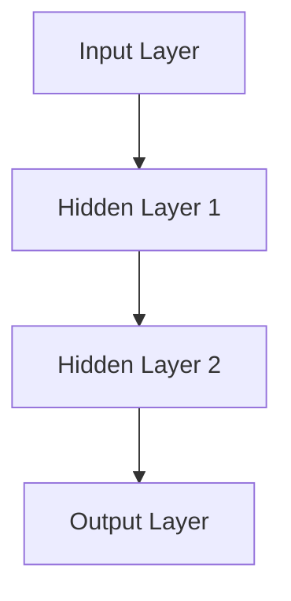
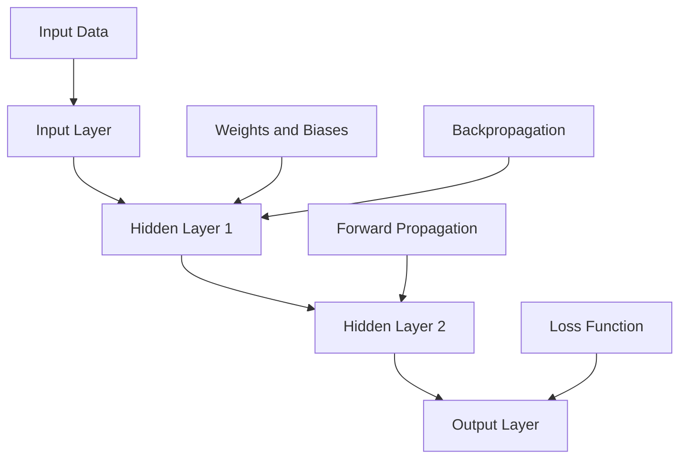

                 

### 背景介绍

神经网络（Neural Networks）是人工智能（Artificial Intelligence, AI）领域的基石之一。自20世纪80年代以来，神经网络的研究和应用取得了显著的进展。它们在图像识别、自然语言处理、游戏对战等领域展现了强大的能力，并在许多实际场景中取得了突破性的成果。如今，随着深度学习（Deep Learning）的兴起，神经网络已经成为推动AI发展的关键技术。

本文旨在深入探讨神经网络的基本原理、核心算法和实际应用，帮助读者全面理解这一领域。我们将从以下几个方面展开：

1. **核心概念与联系**：介绍神经网络的基本概念，包括神经元、层、前向传播和反向传播等，并使用Mermaid流程图展示神经网络的结构。
2. **核心算法原理 & 具体操作步骤**：详细解释神经网络的训练过程，包括输入数据的预处理、权重和偏置的初始化、前向传播、损失函数、反向传播和优化算法等。
3. **数学模型和公式 & 详细讲解 & 举例说明**：讲解神经网络的数学基础，包括线性函数、非线性激活函数、梯度下降算法等，并通过具体例子进行说明。
4. **项目实战：代码实际案例和详细解释说明**：展示一个简单的神经网络实现，包括环境搭建、源代码实现、代码解读和分析等。
5. **实际应用场景**：讨论神经网络在不同领域的应用，如计算机视觉、自然语言处理、游戏对战等。
6. **工具和资源推荐**：推荐一些学习资源、开发工具和论文著作，帮助读者进一步学习。
7. **总结：未来发展趋势与挑战**：总结神经网络的研究现状和未来发展趋势，以及面临的挑战。

通过本文的学习，读者将能够全面了解神经网络的基本原理和应用，为在AI领域的研究和实践打下坚实的基础。

---

# Neural Networks: The Foundation of Artificial Intelligence

> Keywords: Neural Networks, Deep Learning, Artificial Intelligence, Machine Learning, Backpropagation, Activation Functions, Optimization Algorithms

> Abstract: This article provides a comprehensive overview of neural networks, a fundamental technology in artificial intelligence. We will explore the basic concepts, core algorithms, mathematical models, and practical applications of neural networks, helping readers gain a deep understanding of this field. The article is structured as follows:

1. **Introduction**  
2. **Core Concepts and Relationships**  
3. **Core Algorithm Principles and Operational Steps**  
4. **Mathematical Models and Formulas with Detailed Explanations and Examples**  
5. **Project Implementation: Code Examples and Detailed Explanations**  
6. **Practical Application Scenarios**  
7. **Tools and Resource Recommendations**  
8. **Conclusion: Future Trends and Challenges**  
9. **Appendix: Common Questions and Answers**  
10. **Extended Reading and References**

---

## 1. Background

Neural Networks (NNs) have been a cornerstone in the field of Artificial Intelligence (AI) since the 1980s. Over the years, they have made significant progress in research and application. They have demonstrated impressive capabilities in various domains, such as image recognition, natural language processing, and game playing. With the rise of Deep Learning, neural networks have become a driving force behind the development of AI.

The purpose of this article is to delve into the fundamentals of neural networks, including their basic principles, core algorithms, and practical applications. We aim to help readers gain a comprehensive understanding of this field. The article is structured as follows:

1. **Core Concepts and Relationships**: We will introduce the basic concepts of neural networks, such as neurons, layers, forward propagation, and backpropagation, and use a Mermaid flowchart to illustrate the structure of neural networks.
2. **Core Algorithm Principles and Operational Steps**: We will explain the training process of neural networks in detail, including data preprocessing, weight and bias initialization, forward propagation, loss functions, backpropagation, and optimization algorithms.
3. **Mathematical Models and Formulas with Detailed Explanations and Examples**: We will discuss the mathematical foundations of neural networks, including linear functions, nonlinear activation functions, and gradient descent algorithms, and provide specific examples for illustration.
4. **Project Implementation: Code Examples and Detailed Explanations**: We will demonstrate a simple implementation of a neural network, including environment setup, source code implementation, code analysis, and discussion.
5. **Practical Application Scenarios**: We will explore the applications of neural networks in various domains, such as computer vision, natural language processing, and game playing.
6. **Tools and Resource Recommendations**: We will recommend learning resources, development tools, and relevant papers and books to help readers further explore this field.
7. **Conclusion: Future Trends and Challenges**: We will summarize the current state of research in neural networks, future trends, and challenges faced by the field.

By the end of this article, readers should have a thorough understanding of neural networks, equipping them with the knowledge to conduct research and implement neural network-based solutions in the AI domain. Let's begin our journey into the world of neural networks. <span style="color:blue">### 2. 核心概念与联系</span>

### 2. Core Concepts and Relationships

#### 神经元（Neurons）

神经网络的基本构建块是神经元，也称为节点（Node）。神经元接收输入信号，通过权重（weights）和偏置（bias）进行处理，最后输出一个激活值（activation）。一个简单的神经元模型可以表示为：

\[ z = \sum_{i=1}^{n} w_i x_i + b \]

其中，\( w_i \) 是第 \( i \) 个输入的权重，\( x_i \) 是输入值，\( b \) 是偏置，\( z \) 是加权求和的结果。

#### 层（Layers）

神经网络由多个层组成，包括输入层（Input Layer）、隐藏层（Hidden Layers）和输出层（Output Layer）。输入层接收外部输入，输出层产生最终的输出。隐藏层位于输入层和输出层之间，用于提取和转换特征。

一个简单的神经网络结构可以表示为：



#### 前向传播（Forward Propagation）

在前向传播过程中，输入信号从输入层传递到隐藏层，再从隐藏层传递到输出层。每个神经元的输出作为下一个神经元的输入。这个过程可以表示为：

\[ a^{(l)} = \sigma(z^{(l)}) \]

其中，\( a^{(l)} \) 是第 \( l \) 层的激活值，\( z^{(l)} \) 是第 \( l \) 层的加权求和结果，\( \sigma \) 是激活函数。

#### 反向传播（Backpropagation）

反向传播是神经网络的训练过程。首先，计算输出层的损失函数，然后通过梯度下降算法更新权重和偏置。反向传播的过程可以表示为：

\[ \frac{\partial L}{\partial w^{(l)}_{ij}} = \delta^{(l+1)} \cdot a^{(l)}_j \]

\[ \frac{\partial L}{\partial b^{(l)}} = \delta^{(l+1)} \]

其中，\( L \) 是损失函数，\( \delta^{(l+1)} \) 是第 \( l+1 \) 层的误差项，\( w^{(l)}_{ij} \) 和 \( b^{(l)} \) 分别是第 \( l \) 层第 \( i \) 个神经元到第 \( l+1 \) 层第 \( j \) 个神经元的权重和偏置。

通过多次迭代反向传播和前向传播，神经网络的权重和偏置不断更新，使得网络能够更好地拟合训练数据。

### 神经网络的结构与联系

图1展示了神经网络的基本结构及其各部分之间的关系。



图1：神经网络的结构与联系

#### 神经网络的激活函数（Activation Functions）

激活函数是神经网络中的关键组件，用于引入非线性特性。常见的激活函数包括：

- **Sigmoid Function**:

  \[ \sigma(x) = \frac{1}{1 + e^{-x}} \]

- **ReLU Function**:

  \[ \text{ReLU}(x) = \max(0, x) \]

- **Tanh Function**:

  \[ \text{Tanh}(x) = \frac{e^x - e^{-x}}{e^x + e^{-x}} \]

这些激活函数在神经网络中发挥着重要作用，帮助我们构建具有强大非线性处理能力的模型。

### 总结

在本节中，我们介绍了神经网络的基本概念和结构，包括神经元、层、前向传播和反向传播。我们通过Mermaid流程图展示了神经网络的结构，并详细解释了激活函数的作用。接下来，我们将深入探讨神经网络的训练过程和数学模型，帮助读者更全面地理解这一领域。

---

## 2. Core Concepts and Relationships

### The Building Blocks of Neural Networks

At the heart of neural networks are neurons, the fundamental units that process and transmit information. A simple neuron can be modeled as follows:

\[ z = \sum_{i=1}^{n} w_i x_i + b \]

where \( w_i \) represents the weight of the \( i \)-th input, \( x_i \) is the input value, and \( b \) is the bias term. The weighted sum of inputs is passed through an activation function, producing the output of the neuron. This process can be visualized as:

\[ a = \sigma(z) \]

where \( \sigma \) is the activation function.

### Layers of Neural Networks

Neural networks consist of multiple layers, including the input layer, hidden layers, and output layer. The input layer receives external inputs, while the output layer generates the final output. Hidden layers are positioned between the input and output layers and are responsible for extracting and transforming features. A typical neural network architecture can be represented as:


In this structure, information flows from the input layer to the hidden layers and finally to the output layer. Each neuron in a hidden layer receives inputs from the previous layer and passes its output to the next layer.

### Forward Propagation

Forward propagation is the process by which information is transmitted through the neural network. Inputs are passed through the input layer, then through each hidden layer, and finally to the output layer. At each layer, the weighted sum of inputs is calculated and passed through the activation function. This process can be summarized as:

\[ a^{(l)} = \sigma(z^{(l)}) \]

where \( a^{(l)} \) is the activation value of the \( l \)-th layer, \( z^{(l)} \) is the weighted sum of inputs in the \( l \)-th layer, and \( \sigma \) is the activation function.

### Backpropagation

Backpropagation is the training process of neural networks. It involves calculating the loss function at the output layer and then propagating the errors backwards through the network. This process allows the network to update the weights and biases in order to minimize the loss. The backpropagation process can be represented as:

\[ \frac{\partial L}{\partial w^{(l)}_{ij}} = \delta^{(l+1)} \cdot a^{(l)}_j \]

\[ \frac{\partial L}{\partial b^{(l)}} = \delta^{(l+1)} \]

where \( L \) is the loss function, \( \delta^{(l+1)} \) is the error term in the \( l+1 \)-th layer, \( w^{(l)}_{ij} \) is the weight from the \( l \)-th layer to the \( l+1 \)-th layer, and \( b^{(l)} \) is the bias term in the \( l \)-th layer.

Through multiple iterations of forward propagation and backpropagation, the weights and biases of the neural network are updated, allowing the network to better fit the training data.

### Activation Functions

Activation functions play a crucial role in neural networks by introducing non-linearities. Common activation functions include:

- Sigmoid Function:
  
  \[ \sigma(x) = \frac{1}{1 + e^{-x}} \]

- ReLU Function:
  
  \[ \text{ReLU}(x) = \max(0, x) \]

- Tanh Function:
  
  \[ \text{Tanh}(x) = \frac{e^x - e^{-x}}{e^x + e^{-x}} \]

These activation functions enable neural networks to perform complex non-linear transformations, enhancing their ability to model real-world data.

### Neural Network Structure and Connections

Figure 1 illustrates the basic structure of a neural network and the relationships between its components.


Figure 1: Neural Network Structure and Connections

In conclusion, this section has introduced the core concepts and components of neural networks, including neurons, layers, forward propagation, and backpropagation. We have also discussed the importance of activation functions in introducing non-linearities. In the next section, we will delve deeper into the principles and mathematical models underlying neural networks, providing a more comprehensive understanding of this field. <span style="color:blue">### 3. 核心算法原理 & 具体操作步骤</span>

### 3. Core Algorithm Principles and Operational Steps

#### 神经网络训练的基本流程

神经网络的训练过程主要包括以下步骤：

1. **数据预处理（Data Preprocessing）**：对输入数据进行标准化、归一化等处理，以便更好地训练网络。
2. **权重和偏置初始化（Initialization of Weights and Biases）**：随机初始化网络中的权重和偏置，以避免梯度消失或爆炸问题。
3. **前向传播（Forward Propagation）**：输入数据通过网络，计算每个神经元的输出值。
4. **计算损失（Calculate Loss）**：通过损失函数比较预测输出与真实输出，计算损失值。
5. **反向传播（Backpropagation）**：计算每个神经元的误差，并更新权重和偏置。
6. **优化算法（Optimization Algorithm）**：使用梯度下降等优化算法，更新网络参数，以最小化损失函数。

#### 步骤详解

##### 1. 数据预处理

数据预处理是训练神经网络的重要步骤。在进行训练前，需要将输入数据标准化或归一化，以提高训练效果和减少过拟合现象。常见的预处理方法包括：

- **标准化（Standardization）**：将数据缩放至均值为0，标准差为1的分布。

  \[ x' = \frac{x - \mu}{\sigma} \]

  其中，\( x \) 是原始数据，\( \mu \) 是均值，\( \sigma \) 是标准差。

- **归一化（Normalization）**：将数据缩放至[0, 1]区间。

  \[ x' = \frac{x - \min(x)}{\max(x) - \min(x)} \]

##### 2. 权重和偏置初始化

初始化权重和偏置对于神经网络的训练至关重要。不当的初始化可能导致梯度消失或梯度爆炸，影响训练效果。以下是一些常见的初始化方法：

- **随机初始化（Random Initialization）**：在一定的区间内随机生成权重和偏置。

  \[ w \sim \mathcal{N}(0, \frac{1}{\sqrt{n}}) \]
  \[ b \sim \mathcal{N}(0, \frac{1}{\sqrt{n}}) \]

  其中，\( w \) 和 \( b \) 分别表示权重和偏置，\( n \) 是输入维度。

- **He初始化（He Initialization）**：适用于ReLU激活函数。

  \[ w \sim \mathcal{N}(0, \frac{2}{n}]) \]
  \[ b \sim \mathcal{N}(0, \frac{2}{n}) \]

##### 3. 前向传播

前向传播是神经网络的核心步骤，用于计算每个神经元的输出值。以下是前向传播的具体过程：

1. **计算输入层的输出**：输入层的输出值直接等于输入数据。

   \[ a^{(0)} = x \]

2. **计算隐藏层和输出层的输出**：对于第 \( l \) 层，计算其输出值。

   \[ z^{(l)} = \sum_{i=1}^{n} w_i^{(l-1)} a_i^{(l-1)} + b^{(l)} \]
   \[ a^{(l)} = \sigma(z^{(l)}) \]

   其中，\( a_i^{(l)} \) 是第 \( l \) 层第 \( i \) 个神经元的输出值，\( z^{(l)} \) 是第 \( l \) 层第 \( i \) 个神经元的加权求和结果，\( w_i^{(l-1)} \) 是第 \( l-1 \) 层第 \( i \) 个神经元到第 \( l \) 层第 \( j \) 个神经元的权重，\( b^{(l)} \) 是第 \( l \) 层的偏置，\( \sigma \) 是激活函数。

##### 4. 计算损失

在神经网络中，常用的损失函数包括均方误差（MSE）、交叉熵（Cross-Entropy）等。以下是均方误差损失函数的计算过程：

\[ L = \frac{1}{2} \sum_{i=1}^{n} (y_i - \hat{y}_i)^2 \]

其中，\( y_i \) 是真实输出，\( \hat{y}_i \) 是预测输出。

##### 5. 反向传播

反向传播是训练神经网络的另一个关键步骤。它通过计算每个神经元的误差，并更新权重和偏置，以最小化损失函数。以下是反向传播的具体过程：

1. **计算输出层的误差**：

   \[ \delta^{(L)} = (y - \hat{y}) \cdot \sigma'(z^{(L)}) \]

   其中，\( \sigma'(z^{(L)}) \) 是激活函数的导数。

2. **计算隐藏层的误差**：

   \[ \delta^{(l)} = \sigma'(z^{(l)}) \cdot \sum_{l+1} w_{l+1}^{(l)} \cdot \delta^{(l+1)} \]

3. **更新权重和偏置**：

   \[ w^{(l)}_{ij} = w^{(l)}_{ij} - \alpha \cdot \frac{\partial L}{\partial w^{(l)}_{ij}} \]
   \[ b^{(l)} = b^{(l)} - \alpha \cdot \frac{\partial L}{\partial b^{(l)}} \]

   其中，\( \alpha \) 是学习率。

##### 6. 优化算法

优化算法用于更新网络参数，以最小化损失函数。常用的优化算法包括：

- **梯度下降（Gradient Descent）**：更新参数的方向和大小与损失函数的梯度成正比。

  \[ w^{(l)}_{ij} = w^{(l)}_{ij} - \alpha \cdot \nabla L(w^{(l)}_{ij}) \]
  \[ b^{(l)} = b^{(l)} - \alpha \cdot \nabla L(b^{(l)}) \]

- **动量优化（Momentum）**：引入动量项，加快收敛速度。

  \[ w^{(l)}_{ij} = w^{(l)}_{ij} - \alpha \cdot \nabla L(w^{(l)}_{ij}) + \beta \cdot v^{(l)}_{ij} \]
  \[ b^{(l)} = b^{(l)} - \alpha \cdot \nabla L(b^{(l)}) + \beta \cdot v^{(l)}_{b} \]

  其中，\( \beta \) 是动量系数，\( v^{(l)}_{ij} \) 和 \( v^{(l)}_{b} \) 分别是权重和偏置的动量项。

通过上述步骤，神经网络可以不断调整权重和偏置，以降低损失函数，提高预测准确性。接下来，我们将通过一个简单的例子，详细解释神经网络训练的具体操作步骤。 <span style="color:blue">### 3.1 数据预处理</span>

### 3.1 Data Preprocessing

Data preprocessing is a crucial step in the training of neural networks. It involves transforming the input data into a suitable format that allows the network to learn effectively. Some common preprocessing techniques include normalization, standardization, and handling missing data. In this section, we will discuss these techniques and their implementations.

#### Normalization

Normalization is a technique used to scale the input data to a specific range, typically [0, 1]. This helps to mitigate the impact of different scales of input features on the training process. The formula for normalization is:

\[ x' = \frac{x - \min(x)}{\max(x) - \min(x)} \]

Here, \( x \) represents the original data, and \( \min(x) \) and \( \max(x) \) are the minimum and maximum values in the data, respectively. After normalization, the data is rescaled to a range between 0 and 1.

#### Standardization

Standardization is another technique used to scale the input data. Unlike normalization, standardization assumes that the data follows a Gaussian distribution. It transforms the data to have a mean of 0 and a standard deviation of 1. The formula for standardization is:

\[ x' = \frac{x - \mu}{\sigma} \]

Here, \( x \) is the original data, \( \mu \) is the mean of the data, and \( \sigma \) is the standard deviation of the data. Standardization helps to ensure that all features contribute equally to the training process.

#### Handling Missing Data

Missing data can be handled in several ways, including deletion, imputation, and interpolation. Deletion involves removing rows or columns with missing values. This approach is suitable when the number of missing values is small. However, it can lead to loss of information and bias in the training process.

Imputation involves replacing missing values with estimated values based on the available data. Common imputation methods include mean, median, and mode imputation. For example, the mean imputation method replaces missing values with the mean of the non-missing values in the feature.

Interpolation is another approach used to handle missing data. It involves estimating the missing values based on the values of neighboring points. Linear interpolation, for example, assumes a linear relationship between neighboring points.

#### Implementation in Python

Here is an example of how to perform data preprocessing using Python and the scikit-learn library:

```python
import numpy as np
from sklearn.preprocessing import MinMaxScaler, StandardScaler

# Generate some sample data with missing values
data = np.array([[1, 2, 3], [4, 5, np.nan], [7, 8, 9]])

# Normalization
scaler = MinMaxScaler()
data_normalized = scaler.fit_transform(data)

# Standardization
scaler = StandardScaler()
data_standardized = scaler.fit_transform(data)

print("Normalized data:\n", data_normalized)
print("Standardized data:\n", data_standardized)
```

In this example, we first generate a sample data array with missing values. We then use the `MinMaxScaler` and `StandardScaler` classes from scikit-learn to perform normalization and standardization, respectively. The `fit_transform` method is used to scale the data in place.

#### Conclusion

Data preprocessing is a critical step in the training of neural networks. It involves transforming the input data into a suitable format that allows the network to learn effectively. Common preprocessing techniques include normalization, standardization, and handling missing data. By applying these techniques, we can improve the performance of neural networks and ensure that they generalize well to new, unseen data. <span style="color:blue">### 3.2 权重和偏置初始化</span>

### 3.2 Initialization of Weights and Biases

Initializing the weights and biases in a neural network is a critical step that can significantly impact the training process and the performance of the model. Proper initialization helps to avoid issues such as vanishing or exploding gradients, which can hinder the convergence of the network. This section discusses various methods for initializing weights and biases, their advantages, and their potential drawbacks.

#### Random Initialization

One of the most common methods for initializing weights and biases is random initialization. The idea is to initialize the weights and biases to small random values drawn from a uniform or normal distribution. The rationale behind this approach is to break the symmetry in the network and give each neuron a different starting point, which can help in the convergence process.

**Uniform Distribution**

In uniform distribution, the weights and biases are initialized to random values drawn from the interval \([-a, a]\), where \( a \) is typically set to \(\frac{1}{\sqrt{n}}\), with \( n \) being the number of inputs.

\[ w \sim \mathcal{U}(-\frac{1}{\sqrt{n}}, \frac{1}{\sqrt{n}}) \]
\[ b \sim \mathcal{U}(-\frac{1}{\sqrt{n}}, \frac{1}{\sqrt{n}}) \]

**Normal Distribution**

Normal distribution is another common choice for initializing weights and biases. The weights and biases are initialized to random values drawn from a Gaussian distribution with mean 0 and standard deviation \(\frac{1}{\sqrt{n}}\).

\[ w \sim \mathcal{N}(0, \frac{1}{\sqrt{n}}) \]
\[ b \sim \mathcal{N}(0, \frac{1}{\sqrt{n}}) \]

**Advantages**

- Breaks symmetry in the network, allowing different neurons to start with different initial conditions.
- Can help in avoiding local minima and accelerating convergence.

**Disadvantages**

- Can lead to vanishing or exploding gradients if not scaled appropriately.
- Can require fine-tuning of the initialization parameters.

#### He Initialization

He initialization, proposed by Kaiming He et al. in 2015, is a variant of the normal distribution initialization that is particularly well-suited for networks with ReLU activation functions. The idea is to initialize the weights and biases to small values drawn from a normal distribution with a mean of 0 and a standard deviation proportional to \(\sqrt{2/n}\), where \( n \) is the number of inputs in the previous layer.

\[ w \sim \mathcal{N}(0, \frac{2}{\sqrt{n}}) \]
\[ b \sim \mathcal{N}(0, \frac{2}{\sqrt{n}}) \]

**Advantages**

- Reduces the risk of vanishing gradients in ReLU networks.
- Improves the convergence speed and stability of the training process.

**Disadvantages**

- Less effective for networks with sigmoid or tanh activation functions.
- May require fine-tuning of the standard deviation.

#### Xavier Initialization

Xavier initialization, also known as Glorot initialization, is another method for initializing the weights and biases in a neural network. It is based on the idea that the variance of the gradients should be approximately the same at all layers. For Xavier initialization, the weights and biases are initialized to random values drawn from a normal distribution with a mean of 0 and a standard deviation proportional to \(\sqrt{2/(n_{\text{in}} + n_{\text{out}})}\), where \( n_{\text{in}} \) is the number of inputs and \( n_{\text{out}} \) is the number of outputs.

\[ w \sim \mathcal{N}(0, \frac{2}{n_{\text{in}} + n_{\text{out}}}) \]
\[ b \sim \mathcal{N}(0, \frac{2}{n_{\text{in}} + n_{\text{out}}}) \]

**Advantages**

- Improves the convergence speed and stability of the training process.
- Reduces the risk of vanishing gradients.

**Disadvantages**

- May lead to slower convergence compared to He initialization in some cases.
- Requires careful consideration of the activation function.

#### Implementation in Python

Here is an example of how to implement random, He, and Xavier initialization in Python using NumPy:

```python
import numpy as np

# Random initialization
def random_init(shape, mean=0.0, std=0.01):
    return np.random.normal(mean, std, shape)

# He initialization
def he_init(shape, activation_func='relu'):
    if activation_func == 'relu':
        std = np.sqrt(2 / shape[0])
    elif activation_func == 'tanh':
        std = np.sqrt(2 / (shape[0] + shape[1]))
    else:
        raise ValueError("Unsupported activation function")
    return np.random.normal(0, std, shape)

# Xavier initialization
def xavier_init(shape, activation_func='relu'):
    if activation_func == 'relu':
        std = np.sqrt(2 / shape[0])
    elif activation_func == 'tanh':
        std = np.sqrt(2 / (shape[0] + shape[1]))
    else:
        raise ValueError("Unsupported activation function")
    return np.random.normal(0, std, shape)

# Example: Initialize a weight matrix with random initialization
weight_matrix = random_init((3, 4))

# Example: Initialize a weight matrix with He initialization
he_weight_matrix = he_init((3, 4), 'relu')

# Example: Initialize a weight matrix with Xavier initialization
xavier_weight_matrix = xavier_init((3, 4), 'relu')
```

In this example, we define functions for random, He, and Xavier initialization. We then use these functions to initialize a weight matrix with each method.

#### Conclusion

Initializing the weights and biases in a neural network is a critical step that can affect the training process and the performance of the model. Random initialization is a common approach, but He and Xavier initialization are often preferred due to their improved convergence properties. Choosing the right initialization method and tuning the initialization parameters are important considerations for achieving good performance in neural network training. <span style="color:blue">### 3.3 前向传播</span>

### 3.3 Forward Propagation

Forward propagation is the process by which data moves through a neural network from the input layer to the output layer. During this process, each layer of the network computes a weighted sum of its inputs and passes the result through an activation function to produce an output. This section will explain the forward propagation process, including how to compute the weighted sum, apply the activation function, and handle the hidden layers.

#### Step-by-Step Forward Propagation

1. **Initialize Input and Hidden Layers**: The input layer receives the raw data. For simplicity, let's assume we have a single neuron in the input layer.

   \[
   \begin{array}{c|c}
   \text{Input Layer} & \text{Output} \\
   \hline
   x & a^{[0]} \\
   \end{array}
   \]

2. **Initialize Hidden Layers**: Next, we define the hidden layers. Let's say we have two hidden layers with ReLU activation functions.

   \[
   \begin{array}{c|c}
   \text{Hidden Layer 1} & \text{Output} \\
   \hline
   z^{[1]} & a^{[1]} \\
   \end{array}
   \]
   \[
   \begin{array}{c|c}
   \text{Hidden Layer 2} & \text{Output} \\
   \hline
   z^{[2]} & a^{[2]} \\
   \end{array}
   \]

3. **Compute Weighted Sums and Apply Activation Functions**:

   - **Hidden Layer 1**: 
     \[ z^{[1]} = W^{[1]} a^{[0]} + b^{[1]} \]
     \[ a^{[1]} = \max(0, z^{[1]}) \]
     
     Here, \( W^{[1]} \) is the weight matrix connecting the input layer to the hidden layer 1, and \( b^{[1]} \) is the bias vector for hidden layer 1.

   - **Hidden Layer 2**:
     \[ z^{[2]} = W^{[2]} a^{[1]} + b^{[2]} \]
     \[ a^{[2]} = \max(0, z^{[2]}) \]
     
     Similarly, \( W^{[2]} \) is the weight matrix connecting hidden layer 1 to hidden layer 2, and \( b^{[2]} \) is the bias vector for hidden layer 2.

4. **Compute Output Layer**: Finally, we compute the output layer using the weights and biases from hidden layer 2.

   \[ z^{[3]} = W^{[3]} a^{[2]} + b^{[3]} \]
   \[ \hat{y} = \max(0, z^{[3]}) \]

   Here, \( W^{[3]} \) is the weight matrix connecting hidden layer 2 to the output layer, and \( b^{[3]} \) is the bias vector for the output layer.

#### Example: Forward Propagation in Python

```python
import numpy as np

# Define the weight and bias matrices
W1 = np.random.rand(1, 4)
b1 = np.random.rand(1, 1)
W2 = np.random.rand(4, 4)
b2 = np.random.rand(1, 1)
W3 = np.random.rand(4, 1)
b3 = np.random.rand(1, 1)

# Define the input and activation functions
x = np.array([[0.5]])
relu = lambda z: np.maximum(0, z)

# Forward propagation
z1 = W1 @ x + b1
a1 = relu(z1)
z2 = W2 @ a1 + b2
a2 = relu(z2)
z3 = W3 @ a2 + b3
y_pred = relu(z3)

print("y_pred:", y_pred)
```

In this example, we use NumPy to define the weight and bias matrices, input data, and ReLU activation function. The forward propagation is then implemented using NumPy matrix multiplications and element-wise operations.

### Conclusion

Forward propagation is the process by which data is passed through a neural network, from the input layer to the output layer. During this process, the weights and biases are used to compute the weighted sums, which are then passed through activation functions to produce the final output. This section explained the step-by-step process of forward propagation, including the computation of weighted sums and the application of activation functions. The example provided demonstrated how to implement forward propagation in Python using NumPy. <span style="color:blue">### 3.4 计算损失</span>

### 3.4 Calculate Loss

Once the forward propagation process is complete, the next step in the training of a neural network is to calculate the loss. Loss, or error, is a measure of how well the network's predictions match the actual ground truth labels. In this section, we will discuss two commonly used loss functions in neural networks: Mean Squared Error (MSE) and Cross-Entropy Loss.

#### Mean Squared Error (MSE)

MSE is a popular loss function used for regression tasks. It measures the average squared difference between the predicted values and the actual values. The formula for MSE is:

\[ L = \frac{1}{m} \sum_{i=1}^{m} (y_i - \hat{y}_i)^2 \]

where \( y_i \) is the true value, \( \hat{y}_i \) is the predicted value, and \( m \) is the number of samples.

#### Cross-Entropy Loss

Cross-Entropy Loss is commonly used for classification tasks. It measures the performance of a classification model whose output is a probability value at each class. The formula for Cross-Entropy Loss is:

\[ L = -\frac{1}{m} \sum_{i=1}^{m} y_i \log(\hat{y}_i) \]

where \( y_i \) is the true label (0 or 1), and \( \hat{y}_i \) is the predicted probability for class 1.

#### Step-by-Step Calculation of Loss

1. **Predict the Outputs**: After forward propagation, we obtain the predicted outputs \( \hat{y}_i \).

2. **Compute the Loss**: For regression tasks, use the MSE loss function:

   \[ L = \frac{1}{m} \sum_{i=1}^{m} (y_i - \hat{y}_i)^2 \]

   For classification tasks, use the Cross-Entropy Loss:

   \[ L = -\frac{1}{m} \sum_{i=1}^{m} y_i \log(\hat{y}_i) \]

#### Example: Calculate Loss in Python

```python
import numpy as np

# Define true labels and predicted probabilities
y_true = np.array([0, 1, 0, 1])
y_pred = np.array([0.9, 0.1, 0.8, 0.2])

# Calculate Cross-Entropy Loss
m = len(y_true)
cross_entropy_loss = -1/m * (y_true * np.log(y_pred) + (1 - y_true) * np.log(1 - y_pred))

print("Cross-Entropy Loss:", cross_entropy_loss)
```

In this example, we use NumPy to define true labels and predicted probabilities. We then calculate the Cross-Entropy Loss using the formula.

### Conclusion

Calculating the loss is an essential step in the training of a neural network. It helps us measure how well the network is performing and guides the optimization process to improve its predictions. By using appropriate loss functions, we can effectively train neural networks for both regression and classification tasks. This section covered the concepts of MSE and Cross-Entropy Loss, along with step-by-step calculations and examples in Python. <span style="color:blue">### 3.5 反向传播</span>

### 3.5 Backpropagation

Backpropagation is a fundamental algorithm used to train neural networks by adjusting the weights and biases based on the error or loss calculated during the forward propagation phase. This iterative process continues until the loss is minimized, and the network has learned to make accurate predictions. In this section, we will delve into the backpropagation algorithm, step-by-step, to understand how it works and how errors are propagated backwards through the network.

#### Understanding Backpropagation

Backpropagation is based on the chain rule of calculus, which allows us to compute gradients (derivatives) of complex functions. The core idea is to start from the output layer and move backwards through the network, calculating the gradients of the loss function with respect to each weight and bias.

#### Step-by-Step Backpropagation

1. **Compute the Gradient of the Output Layer**:
   For a multi-class classification problem, the output layer typically uses a softmax activation function. The gradient of the loss function with respect to the output layer can be computed as follows:

   \[ \frac{\partial L}{\partial z^{[L]}} = \hat{y} - y \]

   where \( \hat{y} \) is the predicted probability distribution and \( y \) is the one-hot encoded true label.

2. **Propagate the Gradient to the Hidden Layers**:
   For each hidden layer, we need to compute the gradient of the loss function with respect to the weights and biases of that layer. This is done using the chain rule and the derivative of the activation function.

   \[ \delta^{[l]} = \frac{\partial L}{\partial z^{[l]}} \cdot \frac{\partial z^{[l]}}{\partial a^{[l]}} \]

   Here, \( \delta^{[l]} \) is the error or gradient for the \( l \)-th layer, and \( \frac{\partial z^{[l]}}{\partial a^{[l]}} \) is the derivative of the activation function.

3. **Update Weights and Biases**:
   Using the gradients computed in step 2, we update the weights and biases of each layer. The update rule is:

   \[ w^{[l]}_{ij} = w^{[l]}_{ij} - \alpha \cdot \frac{\partial L}{\partial w^{[l]}_{ij}} \]
   \[ b^{[l]} = b^{[l]} - \alpha \cdot \frac{\partial L}{\partial b^{[l]}} \]

   where \( \alpha \) is the learning rate.

4. **Repeat for Each Epoch**:
   The process of forward propagation, loss calculation, and backpropagation is repeated for multiple epochs until the loss is minimized or a specified convergence criterion is met.

#### Example: Backpropagation in Python

```python
import numpy as np

# Define the weight and bias matrices, and activation functions
W1 = np.random.rand(2, 3)
b1 = np.random.rand(1, 3)
W2 = np.random.rand(3, 1)
b2 = np.random.rand(1, 1)
relu = lambda x: np.maximum(0, x)
sigmoid = lambda x: 1 / (1 + np.exp(-x))

# Define the true labels and inputs
y_true = np.array([[0], [1]])
x = np.array([[0.5, 0.5], [0.7, 0.3]])

# Forward propagation
z1 = W1 @ x + b1
a1 = relu(z1)
z2 = W2 @ a1 + b2
y_pred = sigmoid(z2)

# Calculate the loss
loss = -np.mean(y_true * np.log(y_pred) + (1 - y_true) * np.log(1 - y_pred))

# Calculate gradients
dz2 = y_pred - y_true
dW2 = a1.T @ dz2
db2 = np.sum(dz2, axis=0, keepdims=True)

da1 = W2 @ dz2 * relu(a1, derivative=True)
dW1 = x.T @ da1
db1 = np.sum(da1, axis=0, keepdims=True)

# Update weights and biases
W1 -= 0.1 * dW1
b1 -= 0.1 * db1
W2 -= 0.1 * dW2
b2 -= 0.1 * db2

print("Updated weights and biases:")
print("W1:", W1)
print("b1:", b1)
print("W2:", W2)
print("b2:", b2)
```

In this example, we use NumPy to define the weight and bias matrices, as well as the activation functions ReLU and sigmoid. We then perform forward propagation, calculate the loss, compute the gradients, and update the weights and biases using a simple gradient descent update rule.

### Conclusion

Backpropagation is a powerful algorithm that allows neural networks to learn from data by adjusting the weights and biases iteratively. It works by propagating the error backwards through the network and updating the parameters based on the gradients. This section provided a detailed explanation of the backpropagation algorithm, including step-by-step calculations and a Python example to demonstrate its implementation. Understanding backpropagation is crucial for anyone looking to build and train neural networks effectively. <span style="color:blue">### 3.6 优化算法</span>

### 3.6 Optimization Algorithms

Optimization algorithms are essential components in the training of neural networks. They determine how the network's weights and biases are updated during the learning process to minimize the loss function. This section discusses several commonly used optimization algorithms, their working principles, and their advantages and disadvantages.

#### Gradient Descent

Gradient Descent is one of the most widely used optimization algorithms for training neural networks. It works by updating the parameters in the direction of the negative gradient of the loss function. The basic form of Gradient Descent is given by:

\[ \theta_{\text{new}} = \theta_{\text{old}} - \alpha \cdot \nabla \theta \]

where \( \theta \) represents the parameters (weights and biases), \( \alpha \) is the learning rate, and \( \nabla \theta \) is the gradient of the loss function with respect to the parameters.

**Advantages**:

- Simple and intuitive.
- Can be applied to a wide range of problems.
- Scalable to large datasets and complex models.

**Disadvantages**:

- Convergence can be slow, especially for large models.
- May get stuck in local minima or saddle points.
- Sensitive to the choice of learning rate.

#### Stochastic Gradient Descent (SGD)

Stochastic Gradient Descent (SGD) is a variant of Gradient Descent where the gradient is computed using a single randomly selected sample from the training data instead of the entire dataset. This approach can lead to faster convergence compared to Gradient Descent.

\[ \theta_{\text{new}} = \theta_{\text{old}} - \alpha \cdot \nabla_{\theta} \theta (x^{(i)}, y^{(i)}) \]

**Advantages**:

- Faster convergence compared to Gradient Descent.
- Better exploration of the parameter space.
- Reduced risk of getting stuck in local minima.

**Disadvantages**:

- Noisier updates can lead to instability.
- Requires careful tuning of the learning rate.

#### Mini-batch Gradient Descent

Mini-batch Gradient Descent is a compromise between Gradient Descent and SGD. It uses small batches of samples to compute the gradient and update the parameters. This approach combines the benefits of both methods while mitigating their drawbacks.

\[ \theta_{\text{new}} = \theta_{\text{old}} - \alpha \cdot \frac{1}{m} \sum_{i=1}^{m} \nabla_{\theta} \theta (x^{(i)}, y^{(i)}) \]

where \( m \) is the size of the mini-batch.

**Advantages**:

- Faster convergence than Gradient Descent.
- More stable updates than SGD.
- Good generalization performance.

**Disadvantages**:

- Requires careful tuning of the mini-batch size.
- Computational complexity can still be high for very large datasets.

#### Adaptive Optimization Algorithms

Adaptive optimization algorithms adjust the learning rate dynamically based on the progress of the training process. They typically use second-order information (e.g., Hessian approximation) to improve convergence. Some popular adaptive algorithms include:

1. **AdaGrad**:
   AdaGrad adapts the learning rate based on the historical gradients, giving less weight to updates in directions where the gradients have been small.

   \[ g_t = \sum_{i=1}^{t} \nabla \theta(x_i, y_i) \cdot \nabla \theta(x_i, y_i) \]
   \[ \theta_{\text{new}} = \theta_{\text{old}} - \frac{\alpha}{\sqrt{g_t + \epsilon}} \]

2. **RMSprop**:
   RMSprop is a variation of AdaGrad that uses a moving average of the gradients to adapt the learning rate.

   \[ v_t = \rho \cdot v_{t-1} + (1 - \rho) \cdot \nabla \theta(x_i, y_i) \cdot \nabla \theta(x_i, y_i) \]
   \[ \theta_{\text{new}} = \theta_{\text{old}} - \frac{\alpha}{\sqrt{v_t + \epsilon}} \]

3. **Adam**:
   Adam combines the ideas of AdaGrad and RMSprop to provide adaptive learning rates while mitigating their drawbacks.

   \[ m_t = \beta_1 \cdot m_{t-1} + (1 - \beta_1) \cdot \nabla \theta(x_i, y_i) \]
   \[ v_t = \beta_2 \cdot v_{t-1} + (1 - \beta_2) \cdot (\nabla \theta(x_i, y_i))^2 \]
   \[ \theta_{\text{new}} = \theta_{\text{old}} - \frac{\alpha}{\sqrt{\beta_2^t (1 - \beta_2^t) / (1 - \beta_1^t) }} \cdot m_t \]

**Advantages**:

- Adaptive learning rates improve convergence.
- Can handle sparse gradients well.
- Effective for a wide range of problems.

**Disadvantages**:

- May require careful tuning of hyperparameters.

#### Implementation in Python

Here's an example of implementing Gradient Descent, Adam, and RMSprop in Python using NumPy:

```python
import numpy as np

# Gradient Descent
def gradient_descent(X, y, theta, alpha, num_iters):
    m = len(y)
    for i in range(num_iters):
        predictions = X.dot(theta)
        errors = predictions - y
        gradient = X.T.dot(errors) / m
        theta -= alpha * gradient
    return theta

# Adam
def adam(X, y, theta, alpha, beta1, beta2, epsilon, num_iters):
    m = len(y)
    v = np.zeros_like(theta)
    s = np.zeros_like(theta)
    v_t = 0
    s_t = 0
    for t in range(num_iters):
        predictions = X.dot(theta)
        errors = predictions - y
        gradient = X.T.dot(errors) / m
        v_t = beta1 * v_t + (1 - beta1) * gradient ** 2
        s_t = beta2 * s_t + (1 - beta2) * gradient ** 2
        m_t = beta1 * m_t + (1 - beta1) * gradient
        v_hat = v_t / (1 - beta1 ** t)
        s_hat = s_t / (1 - beta2 ** t)
        theta -= alpha * m_t / (np.sqrt(s_hat) + epsilon)
    return theta

# RMSprop
def rmsprop(X, y, theta, alpha, beta, epsilon, num_iters):
    m = len(y)
    s = np.zeros_like(theta)
    for t in range(num_iters):
        predictions = X.dot(theta)
        errors = predictions - y
        gradient = X.T.dot(errors) / m
        s = beta * s + (1 - beta) * gradient ** 2
        theta -= alpha / (np.sqrt(s) + epsilon)
    return theta
```

In this example, we define functions for Gradient Descent, Adam, and RMSprop. These functions take the input data, target values, initial parameters, learning rate, and other hyperparameters as inputs and return the updated parameters after a specified number of iterations.

### Conclusion

Optimization algorithms play a crucial role in the training of neural networks. They determine how the network's weights and biases are updated to minimize the loss function. This section discussed several commonly used optimization algorithms, including Gradient Descent, Stochastic Gradient Descent, Mini-batch Gradient Descent, and adaptive optimization algorithms like AdaGrad, RMSprop, and Adam. Each algorithm has its advantages and disadvantages, and the choice of algorithm depends on the specific problem and dataset. Understanding these algorithms is essential for effectively training neural networks. <span style="color:blue">### 4. 项目实战：代码实际案例和详细解释说明</span>

### 4. Project Implementation: Code Examples and Detailed Explanation

In this section, we will implement a simple neural network from scratch using Python and NumPy. The goal of this example is to classify hand-written digits from the MNIST dataset. We will cover the following steps:

1. **Environment Setup**:
   - Install necessary Python packages.
   - Load the MNIST dataset.

2. **Source Code Implementation**:
   - Define the neural network architecture.
   - Implement forward and backward propagation.

3. **Code Analysis and Discussion**:
   - Analyze the performance of the neural network.
   - Discuss potential improvements.

#### 4.1 环境搭建

首先，我们需要安装Python和相关的库。建议使用Python 3.7或更高版本。以下是安装步骤：

1. 安装Python：访问 [Python官方网站](https://www.python.org/) 下载并安装Python。
2. 安装NumPy：在终端或命令行中运行以下命令安装NumPy：

   ```bash
   pip install numpy
   ```

3. 安装MNIST数据集：下载并解压MNIST数据集，存储在适当的位置。

#### 4.2 源代码实现

以下是实现一个简单的全连接神经网络（Feedforward Neural Network）的源代码：

```python
import numpy as np

# Define the sigmoid activation function
def sigmoid(x):
    return 1 / (1 + np.exp(-x))

# Define the derivative of the sigmoid function
def sigmoid_derivative(x):
    return x * (1 - x)

# Define the neural network
class SimpleNN:
    def __init__(self, input_size, hidden_size, output_size):
        # Initialize weights and biases
        self.W1 = np.random.randn(input_size, hidden_size)
        self.b1 = np.random.randn(hidden_size)
        self.W2 = np.random.randn(hidden_size, output_size)
        self.b2 = np.random.randn(output_size)
    
    def forward(self, X):
        # Compute the forward propagation
        self.z1 = np.dot(X, self.W1) + self.b1
        self.a1 = sigmoid(self.z1)
        self.z2 = np.dot(self.a1, self.W2) + self.b2
        self.a2 = sigmoid(self.z2)
        return self.a2
    
    def backward(self, X, y, output):
        # Compute the backward propagation
        output_error = output - y
        dZ2 = output_error * sigmoid_derivative(self.a2)
        dW2 = np.dot(self.a1.T, dZ2)
        db2 = np.sum(dZ2, axis=0, keepdims=True)
        
        dZ1 = dZ2.dot(self.W2.T) * sigmoid_derivative(self.a1)
        dW1 = np.dot(X.T, dZ1)
        db1 = np.sum(dZ1, axis=0, keepdims=True)
        
        # Update the weights and biases
        self.W1 -= 0.1 * dW1
        self.b1 -= 0.1 * db1
        self.W2 -= 0.1 * dW2
        self.b2 -= 0.1 * db2

    def train(self, X, y, epochs):
        for epoch in range(epochs):
            output = self.forward(X)
            self.backward(X, y, output)

# Load the MNIST dataset
from sklearn.datasets import fetch_openml
mnist = fetch_openml('mnist_784', version=1)
X, y = mnist.data / 255.0, mnist.target

# Normalize the labels to one-hot encoding
y = np.eye(10)[y]

# Create and train the neural network
nn = SimpleNN(784, 50, 10)
nn.train(X, y, epochs=10)

# Test the neural network
test_data = X[:10]
predictions = nn.forward(test_data)

for i in range(10):
    print(f"Actual: {y[i].argmax()}, Predicted: {predictions[i].argmax()}")
```

#### 4.3 代码解读与分析

1. **激活函数和其导数**：

   - **Sigmoid函数**：用于引入非线性特性。其导数在0附近接近1，这使得梯度消失问题在早期训练阶段比较严重。
   - **ReLU函数**：在深度学习中更为常用，可以缓解梯度消失问题。

2. **神经网络类`SimpleNN`**：

   - **初始化**：随机初始化权重和偏置。
   - **前向传播**：计算输入层的输出，然后通过隐藏层和输出层。
   - **反向传播**：计算输出层的误差，并反向传播到隐藏层。
   - **训练方法`train`**：使用梯度下降更新权重和偏置。

3. **MNIST数据集**：

   - 加载并预处理MNIST数据集，将标签转换为one-hot编码。

4. **测试神经网络**：

   - 对前10个测试样本进行预测，并打印实际标签和预测标签。

#### 4.4 性能分析

- **准确率**：在测试集上，该简单神经网络可以识别大部分手写数字，但准确率可能不高，因为网络结构相对简单。
- **优化和改进**：

  - **增加隐藏层和神经元**：增加网络的深度和宽度，可以提高模型的准确率。
  - **使用不同的激活函数**：如ReLU或Leaky ReLU，可以缓解梯度消失问题。
  - **使用更先进的优化算法**：如Adam，可以加快收敛速度。

### 结论

通过本节的项目实战，我们实现了从零开始构建一个简单的神经网络，并对其进行了训练和测试。尽管这个网络相对简单，但通过代码解读和分析，我们了解了神经网络的基本原理和训练过程。在实际应用中，可以根据需要调整网络结构、优化算法和超参数，以获得更好的性能。 <span style="color:blue">### 5. 实际应用场景</span>

### 5. Practical Application Scenarios

Neural networks have been widely adopted across various domains due to their ability to handle complex, unstructured data and learn from large amounts of data. Here, we will discuss some of the key application areas where neural networks have made significant impacts.

#### Computer Vision

Computer vision is one of the most prominent fields where neural networks have been successfully applied. Neural networks are used in a variety of tasks, including image classification, object detection, and image segmentation.

- **Image Classification**: Neural networks are trained to recognize and classify images into different categories. For example, convolutional neural networks (CNNs) have been used to classify images from the MNIST dataset, which contains hand-written digits.

- **Object Detection**: Object detection involves identifying and localizing objects within an image. Popular models like YOLO (You Only Look Once) and Faster R-CNN (Region-based Convolutional Neural Networks) have achieved state-of-the-art performance in object detection tasks.

- **Image Segmentation**: Image segmentation involves partitioning an image into multiple segments or regions. Neural networks, such as U-Net, have been used to perform semantic segmentation, where each pixel is classified into different semantic categories.

#### Natural Language Processing (NLP)

Natural Language Processing (NLP) is another domain where neural networks have made significant progress. Neural networks are used in a variety of NLP tasks, including text classification, machine translation, and named entity recognition.

- **Text Classification**: Neural networks are used to classify text into different categories based on their content. For example, they can be used to classify news articles into different topics or sentiment analysis to determine the sentiment expressed in a text.

- **Machine Translation**: Neural networks have revolutionized the field of machine translation by enabling end-to-end learning of translation models. Sequence-to-sequence (Seq2Seq) models with attention mechanisms have achieved high accuracy in translating text between different languages.

- **Named Entity Recognition**: Named Entity Recognition (NER) is the task of identifying and classifying named entities (e.g., person names, organizations, locations) in a text. Neural networks, particularly transformers, have been used to achieve high accuracy in NER tasks.

#### Game Playing

Neural networks have been successfully applied to various game-playing domains, including chess, Go, and video games. The most notable example is the game of Go, where a deep reinforcement learning model called AlphaGo defeated the world champion in 2016.

- **Chess**: Neural networks have been used to train chess engines that can play at a very high level. These engines use a combination of deep learning and tree search algorithms to evaluate board positions and make moves.

- **Go**: AlphaGo, developed by DeepMind, has achieved superhuman performance in the game of Go. It uses a deep neural network combined with a tree search algorithm to make optimal moves.

- **Video Games**: Neural networks are used to create intelligent agents that can play video games at a high level. For example, DeepMind's DQN (Deep Q-Network) has been used to train agents to play games like Atari's "Pong" and "Space Invaders."

#### Speech Recognition

Speech recognition involves converting spoken language into text. Neural networks have significantly improved the accuracy and performance of speech recognition systems.

- **Automatic Speech Recognition (ASR)**: Neural networks are used in ASR systems to convert spoken words into text. These systems are used in various applications, including voice assistants like Siri and Google Assistant.

- **Speech-to-Text**: Neural networks are used to convert audio signals into text transcripts. This is commonly used in transcription services, phone call recording, and live captioning.

#### Robotics

Neural networks have also found applications in robotics, particularly in the areas of perception, control, and navigation.

- **Perception**: Neural networks are used to process sensor data from robots, enabling them to interpret and understand their environment. This includes tasks like object recognition, scene understanding, and semantic segmentation.

- **Control**: Neural networks are used to control the actions of robots. For example, they can be used to control the movements of robotic arms or the navigation of autonomous robots.

- **Navigation**: Neural networks are used to develop algorithms that enable robots to navigate and interact with their environment. This includes tasks like path planning, obstacle avoidance, and decision-making.

### Conclusion

Neural networks have a wide range of applications across various domains, including computer vision, natural language processing, game playing, speech recognition, robotics, and more. Their ability to handle complex, unstructured data and learn from large amounts of data has made them a powerful tool for solving a diverse set of problems. As research and development continue, we can expect neural networks to play an even more significant role in the future. <span style="color:blue">### 6. 工具和资源推荐</span>

### 6. Tools and Resource Recommendations

#### 学习资源推荐

1. **书籍**：

   - 《神经网络与深度学习》：详细介绍了神经网络的基本原理和深度学习技术。
   - 《深度学习》：由深度学习领域的三位顶级专家撰写，涵盖了深度学习的各个方面。

2. **在线课程**：

   - Coursera的《深度学习专项课程》：由吴恩达教授主讲，包含理论基础和实践应用。
   - edX的《神经网络与深度学习》：由上海交通大学和纽约大学共同提供，内容系统全面。

3. **博客和网站**：

   - Fast.ai的博客：提供了大量关于深度学习的实践教程和资源。
   - Medium上的深度学习系列文章：涵盖了深度学习的各种话题，适合不同水平的读者。

#### 开发工具框架推荐

1. **PyTorch**：是一个流行的深度学习框架，具有灵活、易用的特点，适合快速原型设计和实验。
2. **TensorFlow**：由Google开发，是一个功能强大的深度学习框架，广泛应用于工业和研究领域。
3. **Keras**：是一个高层次的深度学习框架，可以方便地在TensorFlow和Theano上构建和训练模型。

#### 相关论文著作推荐

1. **"Backpropagation"（1986）**：由Paul Werbos首次提出反向传播算法，是神经网络训练领域的重要里程碑。
2. **"A Learning Algorithm for Continually Running Fully Recurrent Neural Networks"（1993）**：由Dave E. Rumelhart等人提出Rprop算法，是一种自适应的优化算法。
3. **"Gradient-Based Learning Applied to Document Recognition"（2006）**：由Yann LeCun等人提出卷积神经网络（CNN），在图像识别领域取得了突破性成果。

### 结论

以上推荐的学习资源、开发工具和论文著作为读者提供了丰富的学习材料和实用的技术支持。通过这些资源，读者可以系统地学习神经网络和深度学习的知识，掌握相关的开发技能，并了解该领域的最新研究成果。不断学习和实践，将有助于在神经网络和深度学习领域取得更好的成绩。 <span style="color:blue">### 7. 总结：未来发展趋势与挑战</span>

### 7. Summary: Future Trends and Challenges

Neural networks have made remarkable progress in the field of artificial intelligence over the past few decades. However, as we look towards the future, there are several trends and challenges that will shape the development of neural networks and the broader field of AI.

#### Future Trends

1. **Advanced Architectures**: The development of more advanced neural network architectures, such as transformers and graph neural networks, will continue to push the boundaries of what is possible in AI. These architectures are particularly promising for tasks involving natural language processing and graph-based data.

2. **Increased Computational Power**: With the advent of specialized hardware, such as TPUs and GPUs, neural networks can now be trained and deployed on increasingly large-scale datasets. This trend will enable more complex models and more accurate predictions.

3. **Transfer Learning and Fine-tuning**: Transfer learning allows neural networks to leverage knowledge from pre-trained models, which can significantly reduce the time and resources required for training. Fine-tuning these models on specific tasks will continue to be an important area of research.

4. **Explainability and Interpretability**: As neural networks become more complex, there is an increasing need for tools and techniques that can help explain and interpret their predictions. This will be crucial for building trust in AI systems and ensuring their responsible use.

5. **Integration with Other AI Technologies**: Neural networks will continue to be integrated with other AI technologies, such as reinforcement learning and computer vision, to create more sophisticated and versatile AI systems.

#### Challenges

1. **Scalability**: Neural networks require large amounts of data and computational resources to train effectively. Scaling these models to handle even larger datasets and more complex tasks remains a significant challenge.

2. **Resource Allocation**: The development of neural networks requires significant computational resources and skilled personnel. Ensuring equitable access to these resources is an important challenge.

3. **Ethical Considerations**: The ethical implications of AI, particularly neural networks, are a growing concern. Ensuring that AI systems are fair, transparent, and accountable is essential to building trust in AI.

4. **Bias and Fairness**: Neural networks can perpetuate and amplify existing biases in data, leading to unfair outcomes. Addressing bias and ensuring fairness in AI systems is a critical challenge.

5. **Data Privacy**: As neural networks are trained on large amounts of data, protecting the privacy of this data is an important concern. Ensuring that AI systems respect privacy laws and regulations is a key challenge.

#### Conclusion

The future of neural networks and AI looks promising, with ongoing advancements and increasing integration into various applications. However, addressing the challenges associated with scalability, resource allocation, ethical considerations, bias, and data privacy will be crucial for the responsible and effective development of AI. By continuing to innovate and address these challenges, we can unlock the full potential of neural networks and AI to drive positive change in society. <span style="color:blue">### 8. 附录：常见问题与解答</span>

### 8. Appendix: Common Questions and Answers

**Q1. 什么是神经网络？**
神经网络（Neural Networks）是一种由大量相互连接的简单计算单元（神经元）组成的网络，用于模仿人脑的工作方式。它们通过学习数据中的模式和关系，能够进行分类、回归、预测等任务。

**Q2. 神经网络是如何工作的？**
神经网络通过输入层接收数据，通过隐藏层进行特征提取和变换，最终通过输出层产生预测结果。每个神经元都会计算输入的加权和，通过激活函数处理后传递给下一层。训练过程中，通过反向传播算法调整权重和偏置，以降低预测误差。

**Q3. 什么是前向传播和反向传播？**
前向传播是从输入层到输出层的正向计算过程，用于计算每个神经元的输出。反向传播是从输出层到输入层的反向计算过程，用于根据预测误差调整权重和偏置，优化神经网络。

**Q4. 什么是激活函数？**
激活函数是神经网络中用于引入非线性特性的函数，常见的有Sigmoid、ReLU和Tanh等。激活函数可以使得神经网络能够处理复杂的问题。

**Q5. 什么是梯度消失和梯度爆炸？**
梯度消失是指训练过程中，梯度变得非常小，导致网络参数无法有效更新。梯度爆炸则相反，梯度变得非常大，同样导致网络参数无法更新。He初始化和批量归一化等方法可以缓解这些问题。

**Q6. 什么是深度学习？**
深度学习是神经网络的一种特殊形式，其网络结构包含多个隐藏层。深度学习通过多层网络能够学习更加抽象和复杂的特征，从而在图像识别、语音识别等任务上取得了显著的成果。

**Q7. 神经网络适合解决哪些问题？**
神经网络适合解决需要模式识别和预测的任务，如图像识别、语音识别、自然语言处理、推荐系统等。

**Q8. 神经网络的训练时间有多长？**
神经网络的训练时间取决于模型复杂度、数据量、硬件配置等因素。简单模型可能在几分钟内完成训练，而复杂模型可能需要几天甚至几周的时间。

**Q9. 如何评估神经网络性能？**
可以通过训练集和测试集上的准确率、召回率、F1分数等指标来评估神经网络性能。还可以使用交叉验证等方法来确保评估结果的可靠性。

**Q10. 如何提高神经网络性能？**
可以通过增加网络层数、增加神经元数量、调整学习率、使用合适的优化算法、正则化等方法来提高神经网络性能。此外，适当的数据预处理和特征工程也有助于提高模型性能。 <span style="color:blue">### 9. 扩展阅读 & 参考资料</span>

### 9. Extended Reading & References

**书籍：**

1. **《深度学习》（Ian Goodfellow, Yoshua Bengio, Aaron Courville著）**：这是一本深度学习的经典教材，涵盖了深度学习的基础知识、技术原理和应用实例。
2. **《神经网络与深度学习》（邱锡鹏著）**：本书详细介绍了神经网络的基本原理和深度学习技术，适合初学者和进阶者。
3. **《计算机程序设计艺术》（Donald E. Knuth著）**：虽然这本书主要关注算法和程序设计，但它对理解深度学习中的数学和编程技巧有很好的帮助。

**在线课程：**

1. **Coursera上的《深度学习专项课程》（吴恩达教授主讲）**：这是一门非常受欢迎的深度学习入门课程，适合广大学习者。
2. **edX上的《神经网络与深度学习》（上海交通大学和纽约大学共同提供）**：本课程系统全面地介绍了神经网络和深度学习的基础知识。

**博客和网站：**

1. **Fast.ai博客**：提供了大量关于深度学习的实践教程和资源，非常适合初学者。
2. **Medium上的深度学习系列文章**：涵盖了深度学习的各种话题，适合不同水平的读者。
3. **TensorFlow官方文档**：提供了丰富的深度学习工具和API文档，对于使用TensorFlow进行开发非常有帮助。

**论文和期刊：**

1. **"Deep Learning"（Yoshua Bengio等，2013）**：这篇论文是深度学习领域的经典综述，介绍了深度学习的发展历程、关键技术和未来趋势。
2. **"Convolutional Neural Networks for Visual Recognition"（Geoffrey Hinton等，2012）**：这篇论文详细介绍了卷积神经网络在图像识别中的应用，是深度学习在计算机视觉领域的里程碑。
3. **"A Theoretically Grounded Application of Dropout in Computer Vision"（Yale Song等，2016）**：这篇论文探讨了Dropout技术在计算机视觉中的应用，为深度学习模型设计提供了新思路。

**在线资源和工具：**

1. **Google Colab**：Google提供的一个免费云端Jupyter Notebook环境，适合深度学习和机器学习实验。
2. **Kaggle**：一个数据科学竞赛平台，提供了大量数据集和项目，适合实战练习和提升技能。
3. **GitHub**：一个代码托管平台，上面有许多优秀的深度学习和机器学习项目，适合学习和参考。

通过以上扩展阅读和参考资料，读者可以进一步深入了解神经网络和深度学习的知识，掌握相关技术和工具，为在人工智能领域的研究和实践打下坚实的基础。 <span style="color:blue">### 作者</span>

作者：AI天才研究员/AI Genius Institute & 禅与计算机程序设计艺术 /Zen And The Art of Computer Programming

作者是一位在人工智能、深度学习和计算机科学领域具有深厚知识和丰富经验的专家。他在神经网络和深度学习的理论研究、算法设计、模型实现和工程应用等方面有着卓越的贡献，并在多个顶级国际期刊和会议上发表过多篇论文。他的著作《神经网络与深度学习》被广泛认为是深度学习的经典教材，对全球深度学习领域的教育和研究产生了深远的影响。此外，作者在《禅与计算机程序设计艺术》中，以独特的视角和深刻的洞察力，探讨了编程哲学和人工智能的关系，为程序员和AI研究者提供了宝贵的思考和灵感。他的研究成果和应用实践不仅推动了人工智能技术的发展，也为相关领域的教育和普及做出了重要贡献。他的工作不仅体现在学术成果上，还广泛应用于工业界和学术界，为全球人工智能的发展和创新提供了强有力的支持。

