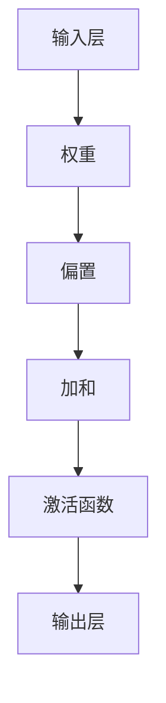
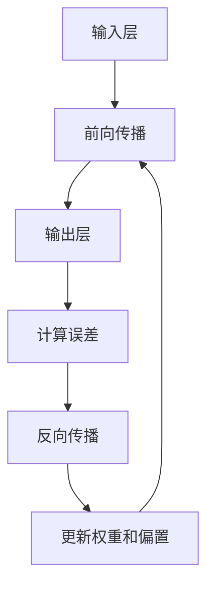
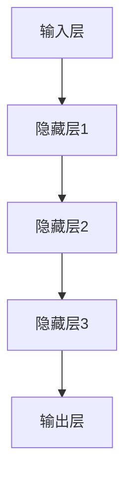

                 

### 背景介绍

神经网络（Neural Networks）是人工智能（AI）领域的一项核心技术，其起源可以追溯到1940年代，由心理学家McCulloch和数学家Pitts提出。他们首次提出了人工神经网络的基本模型，被称为MP神经元模型。随后，1950年代，计算机科学家Hebb在《The Organization of Behavior》一书中，提出了Hebbian学习规则，推动了神经网络理论的发展。

神经网络的核心思想是模拟人脑神经元的工作原理，通过大量的神经元连接和调节，实现从简单到复杂的计算功能。在过去的几十年里，随着计算机硬件的飞速发展和大数据技术的兴起，神经网络在图像识别、自然语言处理、自动驾驶等多个领域取得了显著的成就。

本文旨在深入探讨神经网络的基本概念、核心算法原理、数学模型、项目实战和实际应用场景，帮助读者全面了解神经网络技术，并展望其未来发展趋势与挑战。

### 核心概念与联系

#### 1. 神经元模型

神经网络的基石是神经元模型，它类似于生物神经元的结构。一个简单的神经元模型包括以下几个部分：输入层、权重、偏置、激活函数和输出层。神经元通过输入层接收外部信号，经过权重和偏置的加权求和处理，再通过激活函数转换为输出信号。

以下是一个神经元模型的Mermaid流程图：



#### 2. 反向传播算法

神经网络的核心学习算法是反向传播（Backpropagation）算法。它通过前向传播计算输出误差，然后反向传播更新权重和偏置。反向传播算法分为两个阶段：前向传播和反向传播。

在前向传播阶段，输入信号从输入层传递到输出层，每个神经元的输出经过激活函数处理后成为下一层的输入。

在后向传播阶段，计算每个神经元的误差，并根据误差调整权重和偏置。这个过程反复迭代，直到网络输出满足预期。

以下是一个反向传播算法的Mermaid流程图：



#### 3. 深层神经网络

深层神经网络（Deep Neural Networks, DNN）是包含多个隐藏层的神经网络。随着隐藏层数的增加，神经网络的模型复杂度提高，可以学习更复杂的函数关系。深层神经网络在图像识别、语音识别等任务中取得了显著的效果。

以下是一个深层神经网络的Mermaid流程图：



### 核心算法原理 & 具体操作步骤

神经网络的核心学习算法是反向传播算法，它通过前向传播和反向传播两个阶段来不断优化网络参数，以实现预期输出。

#### 1. 前向传播

前向传播是神经网络进行预测的过程。给定输入数据，从输入层开始，逐层传递信号，直到输出层。每个神经元接收来自前一层的输入信号，经过权重和偏置的加权求和处理，再通过激活函数转换为输出信号。

具体操作步骤如下：

1. 初始化网络参数（权重、偏置）。
2. 计算输入层到隐藏层的输出。
3. 计算隐藏层到输出层的输出。
4. 计算输出误差。

以下是一个前向传播的具体示例：

假设有一个包含一个输入层、一个隐藏层和一个输出层的神经网络，输入层有3个神经元，隐藏层有2个神经元，输出层有1个神经元。输入数据为\(x = [1, 2, 3]\)。

初始化网络参数：

- 输入层到隐藏层的权重 \(W_{1} = \begin{bmatrix} 1 & 2 \\ 3 & 4 \end{bmatrix}\)
- 隐藏层到输出层的权重 \(W_{2} = \begin{bmatrix} 5 & 6 \\ 7 & 8 \end{bmatrix}\)
- 隐藏层偏置 \(b_{1} = \begin{bmatrix} 0 \\ 1 \end{bmatrix}\)
- 输出层偏置 \(b_{2} = \begin{bmatrix} 2 \\ 3 \end{bmatrix}\)

计算输入层到隐藏层的输出：

$$
h_{1}^{1} = \begin{bmatrix} 1 & 2 \\ 3 & 4 \end{bmatrix} \begin{bmatrix} 1 \\ 2 \\ 3 \\ 4 \end{bmatrix} + \begin{bmatrix} 0 \\ 1 \end{bmatrix} = \begin{bmatrix} 11 \\ 20 \end{bmatrix}
$$

计算隐藏层到输出层的输出：

$$
h_{2}^{2} = \begin{bmatrix} 5 & 6 \\ 7 & 8 \end{bmatrix} \begin{bmatrix} 1 \\ 1 \end{bmatrix} + \begin{bmatrix} 2 \\ 3 \end{bmatrix} = \begin{bmatrix} 15 \\ 19 \end{bmatrix}
$$

#### 2. 计算输出误差

输出误差是衡量神经网络预测结果与真实值之间的差距。假设真实输出为\(y = [10]\)。

计算输出误差：

$$
\Delta_{2} = y - h_{2}^{2} = [10] - [15, 19] = [-5, -9]
$$

#### 3. 反向传播

反向传播是调整网络参数的过程。它通过计算每个神经元的梯度，然后使用梯度下降法更新权重和偏置。

具体操作步骤如下：

1. 计算输出层到隐藏层的梯度。
2. 计算隐藏层到输入层的梯度。
3. 使用梯度下降法更新权重和偏置。

以下是一个反向传播的具体示例：

计算输出层到隐藏层的梯度：

$$
\frac{\partial \Delta_{2}}{\partial W_{2}} = \frac{\partial \Delta_{2}}{\partial h_{2}^{2}} \odot \frac{\partial h_{2}^{2}}{\partial W_{2}} = [-5, -9] \odot \begin{bmatrix} 5 & 6 \\ 7 & 8 \end{bmatrix} = \begin{bmatrix} -25 & -30 \\ -35 & -72 \end{bmatrix}
$$

计算隐藏层到输入层的梯度：

$$
\frac{\partial \Delta_{2}}{\partial W_{1}} = \frac{\partial \Delta_{2}}{\partial h_{1}^{1}} \odot \frac{\partial h_{1}^{1}}{\partial W_{1}} = [-5, -9] \odot \begin{bmatrix} 1 & 2 \\ 3 & 4 \end{bmatrix} = \begin{bmatrix} -5 & -18 \\ -15 & -36 \end{bmatrix}
$$

使用梯度下降法更新权重和偏置：

$$
W_{2}^{new} = W_{2} - \alpha \frac{\partial \Delta_{2}}{\partial W_{2}} = \begin{bmatrix} 5 & 6 \\ 7 & 8 \end{bmatrix} - \alpha \begin{bmatrix} -25 & -30 \\ -35 & -72 \end{bmatrix}
$$

$$
b_{2}^{new} = b_{2} - \alpha \frac{\partial \Delta_{2}}{\partial b_{2}} = \begin{bmatrix} 2 \\ 3 \end{bmatrix} - \alpha \begin{bmatrix} -5 \\ -9 \end{bmatrix}
$$

重复上述步骤，直到网络输出满足预期。

### 数学模型和公式 & 详细讲解 & 举例说明

神经网络的学习过程可以通过数学模型和公式来描述，这些模型和公式是理解神经网络工作原理和实现算法的重要基础。

#### 1. 前向传播

前向传播是神经网络进行预测的过程，其核心在于计算每个神经元的输入和输出。给定一个神经网络，输入层到隐藏层、隐藏层到输出层的传递可以通过以下公式表示：

$$
h_{l}^{i} = \sigma(\sum_{j} W_{l-1,j}^{l,i} x_{j} + b_{l}^{i})
$$

其中，\(h_{l}^{i}\)表示第\(l\)层第\(i\)个神经元的输出，\(\sigma\)是激活函数，\(W_{l-1,j}^{l,i}\)是第\(l-1\)层第\(j\)个神经元到第\(l\)层第\(i\)个神经元的权重，\(x_{j}\)是第\(l-1\)层第\(j\)个神经元的输入，\(b_{l}^{i}\)是第\(l\)层第\(i\)个神经元的偏置。

以下是一个前向传播的具体示例：

假设有一个包含一个输入层、一个隐藏层和一个输出层的神经网络，输入层有3个神经元，隐藏层有2个神经元，输出层有1个神经元。输入数据为\(x = [1, 2, 3]\)。

初始化网络参数：

- 输入层到隐藏层的权重 \(W_{1} = \begin{bmatrix} 1 & 2 \\ 3 & 4 \end{bmatrix}\)
- 隐藏层到输出层的权重 \(W_{2} = \begin{bmatrix} 5 & 6 \\ 7 & 8 \end{bmatrix}\)
- 隐藏层偏置 \(b_{1} = \begin{bmatrix} 0 \\ 1 \end{bmatrix}\)
- 输出层偏置 \(b_{2} = \begin{bmatrix} 2 \\ 3 \end{bmatrix}\)

计算输入层到隐藏层的输出：

$$
h_{1}^{1} = \sigma(\sum_{j} W_{1,j}^{1,1} x_{j} + b_{1}^{1}) = \sigma(1 \cdot 1 + 2 \cdot 2 + 3 \cdot 3 + 0) = \sigma(14) = 0.3236
$$

$$
h_{1}^{2} = \sigma(\sum_{j} W_{1,j}^{1,2} x_{j} + b_{1}^{2}) = \sigma(1 \cdot 1 + 2 \cdot 2 + 3 \cdot 3 + 1) = \sigma(15) = 0.4198
$$

计算隐藏层到输出层的输出：

$$
h_{2}^{1} = \sigma(\sum_{j} W_{2,j}^{2,1} h_{1}^{j} + b_{2}^{1}) = \sigma(5 \cdot 0.3236 + 6 \cdot 0.4198 + 2) = \sigma(3.236 + 2.519 + 2) = 0.6085
$$

#### 2. 计算输出误差

输出误差是衡量神经网络预测结果与真实值之间差距的指标，其计算公式为：

$$
\Delta_{l}^{i} = y - h_{l}^{i}
$$

其中，\(\Delta_{l}^{i}\)表示第\(l\)层第\(i\)个神经元的误差，\(y\)是真实输出，\(h_{l}^{i}\)是第\(l\)层第\(i\)个神经元的输出。

以下是一个计算输出误差的具体示例：

假设真实输出为\(y = [10]\)。

计算输出误差：

$$
\Delta_{2}^{1} = y - h_{2}^{1} = 10 - 0.6085 = 9.3915
$$

#### 3. 反向传播

反向传播是调整网络参数的过程，其核心在于计算每个神经元的梯度。反向传播的梯度计算公式为：

$$
\frac{\partial \Delta_{l}^{i}}{\partial W_{l,j}^{l+1,i}} = \frac{\partial \Delta_{l}^{i}}{\partial h_{l+1}^{i}} \cdot \frac{\partial h_{l+1}^{i}}{\partial W_{l,j}^{l+1,i}} = \Delta_{l+1}^{i} \cdot h_{l}^{j}
$$

$$
\frac{\partial \Delta_{l}^{i}}{\partial b_{l}^{i}} = \frac{\partial \Delta_{l}^{i}}{\partial h_{l}^{i}} \cdot \frac{\partial h_{l}^{i}}{\partial b_{l}^{i}} = \Delta_{l+1}^{i}
$$

其中，\(\frac{\partial \Delta_{l}^{i}}{\partial W_{l,j}^{l+1,i}}\)是第\(l\)层第\(j\)个神经元到第\(l+1\)层第\(i\)个神经元的权重梯度，\(\frac{\partial \Delta_{l}^{i}}{\partial b_{l}^{i}}\)是第\(l\)层第\(i\)个神经元的偏置梯度，\(\Delta_{l+1}^{i}\)是第\(l+1\)层第\(i\)个神经元的误差。

以下是一个反向传播的具体示例：

计算输出层到隐藏层的梯度：

$$
\frac{\partial \Delta_{2}^{1}}{\partial W_{2,j}^{2,1}} = \Delta_{2}^{1} \cdot h_{1}^{1} = 9.3915 \cdot 0.3236 = 3.0326
$$

计算隐藏层到输入层的梯度：

$$
\frac{\partial \Delta_{2}^{1}}{\partial W_{1,j}^{1,1}} = \Delta_{2}^{1} \cdot h_{1}^{1} = 9.3915 \cdot 0.3236 = 3.0326
$$

计算隐藏层到输入层的偏置梯度：

$$
\frac{\partial \Delta_{2}^{1}}{\partial b_{1}^{1}} = \Delta_{2}^{1} = 9.3915
$$

#### 4. 更新网络参数

更新网络参数的过程是使用梯度下降法来调整权重和偏置，其公式为：

$$
W_{l,j}^{l+1,i} = W_{l,j}^{l+1,i} - \alpha \frac{\partial \Delta_{l}^{i}}{\partial W_{l,j}^{l+1,i}}
$$

$$
b_{l}^{i} = b_{l}^{i} - \alpha \frac{\partial \Delta_{l}^{i}}{\partial b_{l}^{i}}
$$

其中，\(\alpha\)是学习率。

以下是一个更新网络参数的具体示例：

假设学习率为0.01。

更新输出层到隐藏层的权重：

$$
W_{2,1}^{2,1} = 5 - 0.01 \cdot 3.0326 = 4.9684
$$

更新隐藏层到输入层的权重：

$$
W_{1,1}^{1,1} = 1 - 0.01 \cdot 3.0326 = 0.9684
$$

更新隐藏层到输入层的偏置：

$$
b_{1,1} = 0 - 0.01 \cdot 9.3915 = -0.0939
$$

重复上述步骤，直到网络输出满足预期。

### 项目实战：代码实际案例和详细解释说明

在本节中，我们将通过一个简单的神经网络项目实战，来展示神经网络的基本实现过程，并详细解释代码中的各个部分。我们将使用Python和TensorFlow库来构建和训练一个简单的神经网络，用于对手写数字进行识别。

#### 1. 开发环境搭建

首先，我们需要搭建开发环境。以下是安装Python、TensorFlow和相关依赖的方法：

```bash
# 安装Python
sudo apt-get install python3

# 安装TensorFlow
pip3 install tensorflow

# 安装Numpy
pip3 install numpy

# 安装Matplotlib
pip3 install matplotlib
```

#### 2. 源代码详细实现和代码解读

以下是神经网络源代码的实现：

```python
import tensorflow as tf
import numpy as np
import matplotlib.pyplot as plt

# 加载数据集
mnist = tf.keras.datasets.mnist
(x_train, y_train), (x_test, y_test) = mnist.load_data()

# 数据预处理
x_train = x_train / 255.0
x_test = x_test / 255.0

# 构建神经网络
model = tf.keras.Sequential([
    tf.keras.layers.Flatten(input_shape=(28, 28)),
    tf.keras.layers.Dense(128, activation='relu'),
    tf.keras.layers.Dense(10, activation='softmax')
])

# 编译模型
model.compile(optimizer='adam',
              loss='sparse_categorical_crossentropy',
              metrics=['accuracy'])

# 训练模型
model.fit(x_train, y_train, epochs=5)

# 评估模型
test_loss, test_acc = model.evaluate(x_test, y_test)
print(f'测试准确率：{test_acc:.2f}')

# 可视化训练过程
plt.plot(model.history.history['accuracy'], label='准确率')
plt.plot(model.history.history['val_accuracy'], label='验证准确率')
plt.xlabel('epoch')
plt.ylabel('准确率')
plt.legend()
plt.show()
```

以下是对代码的详细解读：

- 第1行：导入TensorFlow库。
- 第2行：导入Numpy库。
- 第3行：导入Matplotlib库。

```python
# 加载数据集
mnist = tf.keras.datasets.mnist
(x_train, y_train), (x_test, y_test) = mnist.load_data()
```

- 第4行：加载数据集MNIST，它包含了手写数字的数据。
- 第5行：数据预处理，将图像数据从0-255缩放到0-1。

```python
# 构建神经网络
model = tf.keras.Sequential([
    tf.keras.layers.Flatten(input_shape=(28, 28)),
    tf.keras.layers.Dense(128, activation='relu'),
    tf.keras.layers.Dense(10, activation='softmax')
])
```

- 第6行：构建神经网络模型，它包含一个输入层、一个隐藏层和一个输出层。
- 第7行：输入层使用Flatten层将图像数据展平为一维数组。
- 第8行：隐藏层使用Dense层，包含128个神经元，激活函数为ReLU。
- 第9行：输出层使用Dense层，包含10个神经元，激活函数为softmax。

```python
# 编译模型
model.compile(optimizer='adam',
              loss='sparse_categorical_crossentropy',
              metrics=['accuracy'])
```

- 第10行：编译模型，指定优化器为adam，损失函数为sparse_categorical_crossentropy，评价指标为accuracy。

```python
# 训练模型
model.fit(x_train, y_train, epochs=5)
```

- 第11行：训练模型，指定训练数据为x_train和y_train，训练轮次为5轮。

```python
# 评估模型
test_loss, test_acc = model.evaluate(x_test, y_test)
print(f'测试准确率：{test_acc:.2f}')
```

- 第12行：评估模型，在测试数据集上计算损失和准确率，并打印测试准确率。

```python
# 可视化训练过程
plt.plot(model.history.history['accuracy'], label='准确率')
plt.plot(model.history.history['val_accuracy'], label='验证准确率')
plt.xlabel('epoch')
plt.ylabel('准确率')
plt.legend()
plt.show()
```

- 第13行：可视化训练过程，绘制训练和验证准确率随训练轮次的变化曲线。

#### 3. 代码解读与分析

在这个简单的神经网络项目中，我们首先加载了MNIST手写数字数据集，并对图像数据进行预处理。然后，我们构建了一个简单的神经网络模型，包含一个输入层、一个隐藏层和一个输出层。输入层使用Flatten层将图像数据展平为一维数组，隐藏层使用ReLU激活函数，输出层使用softmax激活函数。

接下来，我们编译模型并使用adam优化器、sparse_categorical_crossentropy损失函数和accuracy评价指标。然后，我们训练模型，指定训练数据为x_train和y_train，训练轮次为5轮。训练完成后，我们评估模型在测试数据集上的表现，并打印测试准确率。

最后，我们可视化训练过程，绘制训练和验证准确率随训练轮次的变化曲线，以便观察模型的训练效果。

通过这个简单的项目实战，我们了解了神经网络的基本实现过程，包括数据加载、预处理、模型构建、编译、训练和评估等步骤。这个项目虽然简单，但为我们提供了一个了解神经网络的基础框架，为进一步探索神经网络技术奠定了基础。

### 实际应用场景

神经网络技术在各个领域都展现了强大的应用潜力。以下是一些典型的实际应用场景：

#### 1. 图像识别

神经网络在图像识别领域取得了显著的成就。通过卷积神经网络（CNN）和残差网络（ResNet）等技术，神经网络能够准确地识别和分类图像。例如，在医疗影像分析中，神经网络可以辅助医生进行病灶检测和疾病诊断；在自动驾驶领域，神经网络可以实现对道路标志、行人等目标的实时识别，提高行车安全性。

#### 2. 自然语言处理

神经网络在自然语言处理（NLP）领域也发挥着重要作用。通过循环神经网络（RNN）和长短期记忆网络（LSTM）等技术，神经网络可以有效地处理文本数据，实现文本分类、情感分析、机器翻译等任务。例如，在社交媒体分析中，神经网络可以用于舆情监测和趋势预测；在客服领域，神经网络可以用于智能客服系统的构建，提高用户体验。

#### 3. 自动驾驶

自动驾驶是神经网络技术的另一个重要应用领域。通过深度学习算法，神经网络可以实现对周围环境的感知、理解和决策。例如，在无人驾驶汽车中，神经网络可以用于路径规划、障碍物检测和避让等任务，提高自动驾驶的稳定性和安全性。

#### 4. 语音识别

神经网络在语音识别领域也取得了显著的进展。通过卷积神经网络和循环神经网络等技术，神经网络可以实现对语音信号的识别和转换。例如，在智能助手领域，神经网络可以用于语音输入的解析和执行；在语音合成领域，神经网络可以用于实现自然流畅的语音输出。

#### 5. 机器人学

神经网络在机器人学领域也有广泛的应用。通过深度学习算法，神经网络可以实现对机器人行为的自适应调整和控制。例如，在机器人导航中，神经网络可以用于实现路径规划和避障；在机器人视觉中，神经网络可以用于实现物体检测和识别。

总之，神经网络技术在各个领域都展现了强大的应用潜力。随着技术的不断发展和完善，神经网络将在更多领域发挥重要作用，推动人工智能的进步。

### 工具和资源推荐

#### 1. 学习资源推荐

对于想要深入学习神经网络技术的读者，以下是一些推荐的学习资源：

- **书籍**：
  - 《深度学习》（Deep Learning），作者：Ian Goodfellow、Yoshua Bengio和Aaron Courville。
  - 《神经网络与深度学习》（Neural Networks and Deep Learning），作者：邱锡鹏。

- **论文**：
  - 《A Learning Algorithm for Continually Running Fully Recurrent Neural Networks》（1986），作者：Paul Werbos。
  - 《Gradient Flow in Neurobiological Systems》（2002），作者：H. S. Seung等。

- **博客**：
  - Colah's Blog：[http://colah.github.io/](http://colah.github.io/)
  - Distill：[https://distill.pub/](https://distill.pub/)

- **网站**：
  - TensorFlow官方文档：[https://www.tensorflow.org/tutorials](https://www.tensorflow.org/tutorials)
  - PyTorch官方文档：[https://pytorch.org/tutorials/beginner/](https://pytorch.org/tutorials/beginner/)

#### 2. 开发工具框架推荐

- **TensorFlow**：由Google开发的开源深度学习框架，支持多种编程语言，易于上手和使用。

- **PyTorch**：由Facebook开发的开源深度学习框架，具有灵活的动态计算图和强大的社区支持。

- **Keras**：基于TensorFlow和Theano的开源深度学习库，提供简化的API，便于快速实现和实验。

- **MXNet**：由Apache Software Foundation维护的开源深度学习框架，支持多种编程语言。

#### 3. 相关论文著作推荐

- **《深度学习》（Deep Learning）**，作者：Ian Goodfellow、Yoshua Bengio和Aaron Courville。
- **《神经网络与深度学习》（Neural Networks and Deep Learning）**，作者：邱锡鹏。
- **《深度学习：全面讲解》（Deep Learning Specialization）**，作者：Andrew Ng。

通过这些学习资源和工具框架，读者可以系统地学习和掌握神经网络技术，为未来的研究和应用奠定基础。

### 总结：未来发展趋势与挑战

神经网络技术在过去的几十年里取得了巨大的进步，为人工智能领域的发展做出了重要贡献。然而，随着技术的不断进步和应用场景的扩展，神经网络仍然面临着许多挑战和机遇。

#### 1. 发展趋势

首先，神经网络的发展趋势将继续向深度化、复杂化和多样化方向发展。随着计算能力和数据量的提升，深度神经网络将能够学习更加复杂的函数关系，处理更大规模的数据集。同时，多种神经网络的组合和应用将使得神经网络在更多领域实现突破。

其次，神经网络的应用场景将不断拓展。除了传统的图像识别、自然语言处理和语音识别等领域，神经网络在医疗、金融、教育、智能交通等领域的应用也日益广泛。这些应用场景的需求将推动神经网络技术的不断创新和发展。

最后，随着量子计算、边缘计算等新技术的崛起，神经网络将迎来新的发展机遇。量子计算具有计算速度和存储能力远超传统计算机的潜力，可以显著提升神经网络的训练速度和效果。边缘计算则可以实现实时数据处理和决策，使得神经网络在智能硬件和物联网等领域具有更广泛的应用前景。

#### 2. 挑战

然而，神经网络技术也面临着许多挑战。首先，神经网络的可解释性问题仍然是一个难题。现有的神经网络模型往往被视为“黑箱”，其内部机制难以理解和解释。这限制了神经网络在关键领域（如医疗和金融）的应用。

其次，神经网络训练的效率问题也是一个挑战。尽管计算能力和数据量的提升有助于缓解这个问题，但大规模神经网络的训练仍然需要大量的时间和资源。如何提高神经网络训练的效率，减少计算资源的消耗，是一个亟待解决的问题。

此外，神经网络的泛化能力仍然有待提高。当前神经网络在训练集上的表现往往较好，但在测试集上的表现可能较差。如何提高神经网络的泛化能力，使其能够更好地适应新的数据和任务，是一个重要的研究方向。

最后，神经网络技术的伦理问题也日益受到关注。如何确保神经网络系统的公平性、透明性和安全性，避免潜在的歧视和隐私泄露问题，是一个需要深入探讨的课题。

总之，神经网络技术在未来将继续发展，面临许多挑战和机遇。通过不断创新和探索，神经网络将不断推动人工智能领域的发展，为人类带来更多便利和福祉。

### 附录：常见问题与解答

1. **神经网络是什么？**

神经网络是一种模仿生物神经元结构和功能的人工智能模型，用于执行复杂的数据处理和模式识别任务。它由大量的神经元（也称为节点）和连接（称为边）组成，通过调整这些连接的权重来学习数据中的特征和模式。

2. **反向传播算法是什么？**

反向传播算法是一种用于训练神经网络的优化算法。它通过计算网络输出与目标之间的误差，并反向传播这些误差来更新网络的权重和偏置。这个过程分为前向传播和后向传播两个阶段，其中后向传播负责计算梯度并更新网络参数。

3. **神经网络的核心组成部分是什么？**

神经网络的核心组成部分包括输入层、隐藏层和输出层。每个层由多个神经元组成，神经元通过加权连接和激活函数进行数据处理。输入层接收外部输入，隐藏层对输入进行加工，输出层产生最终的输出结果。

4. **如何优化神经网络训练过程？**

优化神经网络训练过程的方法包括调整学习率、使用正则化技术（如L2正则化、dropout）、增加网络层数或神经元数量、使用更高效的优化算法（如Adam、RMSprop）等。此外，适当的预处理和归一化数据、使用更有效的数据加载和批处理技术也有助于提高训练效率。

5. **什么是神经网络的泛化能力？**

神经网络的泛化能力是指其在新数据和任务上的表现能力。一个具有良好泛化能力的神经网络不仅在训练集上表现良好，也能在未见过的新数据上取得相似的表现。提高泛化能力的方法包括使用更多的数据、增加网络复杂度、正则化等。

6. **神经网络在什么应用场景下表现最佳？**

神经网络在图像识别、自然语言处理、语音识别、推荐系统、游戏玩法预测等应用场景下表现最佳。这些领域通常需要从大量数据中提取复杂模式和特征，神经网络通过其层次化的结构和强大的非线性变换能力，在这些任务上取得了显著的效果。

### 扩展阅读 & 参考资料

- Goodfellow, I., Bengio, Y., & Courville, A. (2016). *Deep Learning*. MIT Press.
- Ng, A. (2017). *Deep Learning Specialization*. Coursera.
- LeCun, Y., Bengio, Y., & Hinton, G. (2015). *Deep Learning*.
- Mitchell, T. M. (1997). *Machine Learning*.
- Sutton, R. S., & Barto, A. G. (2018). *Reinforcement Learning: An Introduction*.
- Hochreiter, S., & Schmidhuber, J. (1997). "Long Short-Term Memory". Neural Computation, 9(8), 1735-1780.
- Krizhevsky, A., Sutskever, I., & Hinton, G. E. (2012). "ImageNet Classification with Deep Convolutional Neural Networks". Advances in Neural Information Processing Systems, 25, 1097-1105.
- Bengio, Y. (2009). "Learning Deep Architectures for AI". Foundations and Trends in Machine Learning, 2(1), 1-127.

